<style type="text/css">

body{ /* Normal  */
      font-size: 17px;
  }
  
</style>


# Eye-body allometry in each species

We first examine static post-metamorphosis eye diameter-body length allometry across 16 species of deep-sea sergestids. Allometric relationships were fit using standardised major axis regression via the _smatr_ v.3.4.8 package. For each species, standard model checks, model fits, and an interactive plot of data and fits are shown. Hover over the plots to see individual data values. Points are colored by the source of the sample (fresh collection or preserved in ethanol or paraformaldehyde).

Note that for 3 of the species, a large/unreasonable outlier was present. We identified these by eye and they have been removed from the data subsets and analyses, but the outlier value is noted under each species header for reference, and a second plot including the outlier as a red diamond is included. 


```r
#import specimen data
specimens <- data.frame(read.csv("../Data/cleaned data/specimen_data_tidy.csv", header=TRUE))
```


```r
#set colors for fresh and preserved samples
col_pres <- c("ethanol" = "#a6cee3",
              "fresh" = "#b2df8a",
              "paraformaldehyde" = "#1f78b4")
```

## _Allosergestes pectinatus_


```r
# Subset data -----
apec <- specimens %>% filter(genus_species == "Allosergestes_pectinatus")

# Fit SMA model ------
sma_apec <- sma(formula = Eye_Diameter ~ Body_Length, 
            data = apec, 
            log = "xy", #sets both x and y variables as logged
            method="SMA", #defines SMA as model
            alpha = 0.05)

#plot fit, residuals, qq
par(mfrow = c(2,2)) #make plot window 2x2
plot(sma_apec, which = "default",type = "o") 
plot(sma_apec, which = "residual",type = "o")
plot(sma_apec, which = "qq", type = "o")
par(mfrow = c(1,1)) 
```

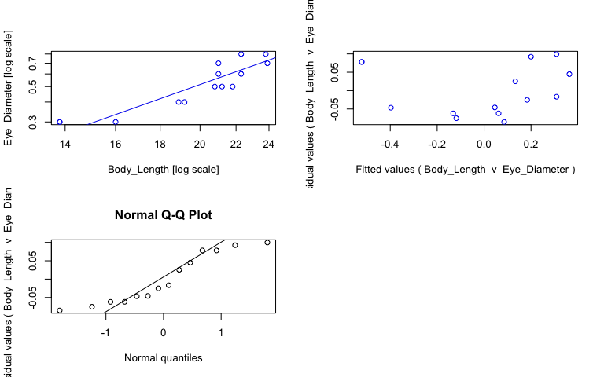<!-- -->

```r
#view fits
summary(sma_apec)
```

```{style="max-height: 300px;"}
## Call: sma(formula = Eye_Diameter ~ Body_Length, data = apec, log = "xy", 
##     method = "SMA", alpha = 0.05) 
## 
## Fit using Standardized Major Axis 
## 
## These variables were log-transformed before fitting: xy 
## 
## Confidence intervals (CI) are at 95%
## 
## ------------------------------------------------------------
## Coefficients:
##             elevation    slope
## estimate    -2.812398 1.940053
## lower limit -3.491769 1.485663
## upper limit -2.133027 2.533418
## 
## H0 : variables uncorrelated
## R-squared : 0.8156794 
## P-value : 9.643e-06
```

```r
#save coefficients of fits as object
cc_sma_apec <- data.frame(coef(sma_apec))

# Make plot ------
plot_apec <- ggplot(apec, aes(x = Body_Length, y = Eye_Diameter, col = Preservation)) + 
  geom_point(size = 2, alpha = 0.8) + 
  scale_color_manual(values = col_pres, name = "Sample state", breaks = c("ethanol", "fresh", "paraformaldehyde")) +
  scale_x_log10(name = "Body length (mm)") + #makes x axis log scale and named
  scale_y_log10(name = "Eye diameter (mm)") + #makes y axis log scale and named
  ggtitle("Allosergestes pectinatus") + 
  theme_bw() +
  theme(panel.grid.major = element_blank(), panel.grid.minor = element_blank(), plot.title = element_text(face = "italic")) +
  geom_abline(data = cc_sma_apec, aes(intercept = cc_sma_apec[1,1], slope = cc_sma_apec[2,1])) +
  geom_text(x = -Inf, y = Inf, hjust = -0.05, vjust = 1.5, nudge_x = 4, label = paste("b =", round(cc_sma_apec[2,1], digits = 2), sep = " "), size = 3.5, col = "black") +
  geom_text(x = -Inf, y = Inf, hjust = -0.05, vjust = 3, label = paste("a =", round(cc_sma_apec[1,1], digits = 2), sep = " "), size = 3.5, col = "black")

ggplotly(plot_apec)
```

```{=html}
<div id="htmlwidget-9f678c8f63c63e8f0316" style="width:768px;height:480px;" class="plotly html-widget"></div>
<script type="application/json" data-for="htmlwidget-9f678c8f63c63e8f0316">{"x":{"data":[{"x":[1.20411998265592,1.13987908640124,1.27646180417324,1.31806333496276,1.3384564936046],"y":[-0.522878745280338,-0.522878745280338,-0.397940008672038,-0.301029995663981,-0.301029995663981],"text":["Body_Length: 16.0<br />Eye_Diameter: 0.3<br />Preservation: ethanol","Body_Length: 13.8<br />Eye_Diameter: 0.3<br />Preservation: ethanol","Body_Length: 18.9<br />Eye_Diameter: 0.4<br />Preservation: ethanol","Body_Length: 20.8<br />Eye_Diameter: 0.5<br />Preservation: ethanol","Body_Length: 21.8<br />Eye_Diameter: 0.5<br />Preservation: ethanol"],"type":"scatter","mode":"markers","marker":{"autocolorscale":false,"color":"rgba(166,206,227,1)","opacity":0.8,"size":7.55905511811024,"symbol":"circle","line":{"width":1.88976377952756,"color":"rgba(166,206,227,1)"}},"hoveron":"points","name":"ethanol","legendgroup":"ethanol","showlegend":true,"xaxis":"x","yaxis":"y","hoverinfo":"text","frame":null},{"x":[1.28330122870355,1.32633586092875,1.37839790094814],"y":[-0.397940008672038,-0.301029995663981,-0.154901959985743],"text":["Body_Length: 19.2<br />Eye_Diameter: 0.4<br />Preservation: fresh","Body_Length: 21.2<br />Eye_Diameter: 0.5<br />Preservation: fresh","Body_Length: 23.9<br />Eye_Diameter: 0.7<br />Preservation: fresh"],"type":"scatter","mode":"markers","marker":{"autocolorscale":false,"color":"rgba(178,223,138,1)","opacity":0.8,"size":7.55905511811024,"symbol":"circle","line":{"width":1.88976377952756,"color":"rgba(178,223,138,1)"}},"hoveron":"points","name":"fresh","legendgroup":"fresh","showlegend":true,"xaxis":"x","yaxis":"y","hoverinfo":"text","frame":null},{"x":[1.13987908640124,1.34830486304816,1.32221929473392,1.32221929473392,1.37657695705651,1.34830486304816],"y":[-0.522878745280338,-0.221848749616356,-0.221848749616356,-0.154901959985743,-0.0969100130080564,-0.0969100130080564],"text":["Body_Length: 13.8<br />Eye_Diameter: 0.3<br />Preservation: paraformaldehyde","Body_Length: 22.3<br />Eye_Diameter: 0.6<br />Preservation: paraformaldehyde","Body_Length: 21.0<br />Eye_Diameter: 0.6<br />Preservation: paraformaldehyde","Body_Length: 21.0<br />Eye_Diameter: 0.7<br />Preservation: paraformaldehyde","Body_Length: 23.8<br />Eye_Diameter: 0.8<br />Preservation: paraformaldehyde","Body_Length: 22.3<br />Eye_Diameter: 0.8<br />Preservation: paraformaldehyde"],"type":"scatter","mode":"markers","marker":{"autocolorscale":false,"color":"rgba(31,120,180,1)","opacity":0.8,"size":7.55905511811024,"symbol":"circle","line":{"width":1.88976377952756,"color":"rgba(31,120,180,1)"}},"hoveron":"points","name":"paraformaldehyde","legendgroup":"paraformaldehyde","showlegend":true,"xaxis":"x","yaxis":"y","hoverinfo":"text","frame":null},{"x":[1.12795314567389,1.12795314567389,1.39032384167548,1.39032384167548],"y":[-0.624109413525781,-0.624109413525781,-0.115096460232714,-0.115096460232714],"text":"cc_sma_apec[1, 1]: -2.812398<br />cc_sma_apec[2, 1]: 1.940053","type":"scatter","mode":"lines","line":{"width":1.88976377952756,"color":"rgba(0,0,0,1)","dash":"solid"},"hoveron":"points","showlegend":false,"xaxis":"x","yaxis":"y","hoverinfo":"text","frame":null},{"x":[null,null,null,null,null,null,null,null,null,null,null,null,null,null],"y":[null,null,null,null,null,null,null,null,null,null,null,null,null,null],"text":["b = 1.94","b = 1.94","b = 1.94","b = 1.94","b = 1.94","b = 1.94","b = 1.94","b = 1.94","b = 1.94","b = 1.94","b = 1.94","b = 1.94","b = 1.94","b = 1.94"],"hovertext":["Body_Length: -Inf<br />Eye_Diameter: Inf<br />Preservation: black","Body_Length: -Inf<br />Eye_Diameter: Inf<br />Preservation: black","Body_Length: -Inf<br />Eye_Diameter: Inf<br />Preservation: black","Body_Length: -Inf<br />Eye_Diameter: Inf<br />Preservation: black","Body_Length: -Inf<br />Eye_Diameter: Inf<br />Preservation: black","Body_Length: -Inf<br />Eye_Diameter: Inf<br />Preservation: black","Body_Length: -Inf<br />Eye_Diameter: Inf<br />Preservation: black","Body_Length: -Inf<br />Eye_Diameter: Inf<br />Preservation: black","Body_Length: -Inf<br />Eye_Diameter: Inf<br />Preservation: black","Body_Length: -Inf<br />Eye_Diameter: Inf<br />Preservation: black","Body_Length: -Inf<br />Eye_Diameter: Inf<br />Preservation: black","Body_Length: -Inf<br />Eye_Diameter: Inf<br />Preservation: black","Body_Length: -Inf<br />Eye_Diameter: Inf<br />Preservation: black","Body_Length: -Inf<br />Eye_Diameter: Inf<br />Preservation: black"],"textfont":{"size":13.2283464566929,"color":"rgba(0,0,0,1)"},"type":"scatter","mode":"text","hoveron":"points","showlegend":false,"xaxis":"x","yaxis":"y","hoverinfo":"text","frame":null},{"x":[null,null,null,null,null,null,null,null,null,null,null,null,null,null],"y":[null,null,null,null,null,null,null,null,null,null,null,null,null,null],"text":["a = -2.81","a = -2.81","a = -2.81","a = -2.81","a = -2.81","a = -2.81","a = -2.81","a = -2.81","a = -2.81","a = -2.81","a = -2.81","a = -2.81","a = -2.81","a = -2.81"],"hovertext":["Body_Length: -Inf<br />Eye_Diameter: Inf<br />Preservation: black","Body_Length: -Inf<br />Eye_Diameter: Inf<br />Preservation: black","Body_Length: -Inf<br />Eye_Diameter: Inf<br />Preservation: black","Body_Length: -Inf<br />Eye_Diameter: Inf<br />Preservation: black","Body_Length: -Inf<br />Eye_Diameter: Inf<br />Preservation: black","Body_Length: -Inf<br />Eye_Diameter: Inf<br />Preservation: black","Body_Length: -Inf<br />Eye_Diameter: Inf<br />Preservation: black","Body_Length: -Inf<br />Eye_Diameter: Inf<br />Preservation: black","Body_Length: -Inf<br />Eye_Diameter: Inf<br />Preservation: black","Body_Length: -Inf<br />Eye_Diameter: Inf<br />Preservation: black","Body_Length: -Inf<br />Eye_Diameter: Inf<br />Preservation: black","Body_Length: -Inf<br />Eye_Diameter: Inf<br />Preservation: black","Body_Length: -Inf<br />Eye_Diameter: Inf<br />Preservation: black","Body_Length: -Inf<br />Eye_Diameter: Inf<br />Preservation: black"],"textfont":{"size":13.2283464566929,"color":"rgba(0,0,0,1)"},"type":"scatter","mode":"text","hoveron":"points","showlegend":false,"xaxis":"x","yaxis":"y","hoverinfo":"text","frame":null}],"layout":{"margin":{"t":45.2237442922374,"r":7.30593607305936,"b":41.6438356164384,"l":43.1050228310502},"plot_bgcolor":"rgba(255,255,255,1)","paper_bgcolor":"rgba(255,255,255,1)","font":{"color":"rgba(0,0,0,1)","family":"","size":14.6118721461187},"title":{"text":"<i> Allosergestes pectinatus <\/i>","font":{"color":"rgba(0,0,0,1)","family":"","size":17.5342465753425},"x":0,"xref":"paper"},"xaxis":{"domain":[0,1],"automargin":true,"type":"linear","autorange":false,"range":[1.12795314567389,1.39032384167548],"tickmode":"array","ticktext":["14","16","18","20","22","24"],"tickvals":[1.14612803567824,1.20411998265592,1.25527250510331,1.30102999566398,1.34242268082221,1.38021124171161],"categoryorder":"array","categoryarray":["14","16","18","20","22","24"],"nticks":null,"ticks":"outside","tickcolor":"rgba(51,51,51,1)","ticklen":3.65296803652968,"tickwidth":0.66417600664176,"showticklabels":true,"tickfont":{"color":"rgba(77,77,77,1)","family":"","size":11.689497716895},"tickangle":-0,"showline":false,"linecolor":null,"linewidth":0,"showgrid":false,"gridcolor":null,"gridwidth":0,"zeroline":false,"anchor":"y","title":{"text":"Body length (mm)","font":{"color":"rgba(0,0,0,1)","family":"","size":14.6118721461187}},"hoverformat":".2f"},"yaxis":{"domain":[0,1],"automargin":true,"type":"linear","autorange":false,"range":[-0.544177181893952,-0.0756115763944423],"tickmode":"array","ticktext":["0.3","0.5","0.7"],"tickvals":[-0.522878745280338,-0.301029995663981,-0.154901959985743],"categoryorder":"array","categoryarray":["0.3","0.5","0.7"],"nticks":null,"ticks":"outside","tickcolor":"rgba(51,51,51,1)","ticklen":3.65296803652968,"tickwidth":0.66417600664176,"showticklabels":true,"tickfont":{"color":"rgba(77,77,77,1)","family":"","size":11.689497716895},"tickangle":-0,"showline":false,"linecolor":null,"linewidth":0,"showgrid":false,"gridcolor":null,"gridwidth":0,"zeroline":false,"anchor":"x","title":{"text":"Eye diameter (mm)","font":{"color":"rgba(0,0,0,1)","family":"","size":14.6118721461187}},"hoverformat":".2f"},"shapes":[{"type":"rect","fillcolor":"transparent","line":{"color":"rgba(51,51,51,1)","width":0.66417600664176,"linetype":"solid"},"yref":"paper","xref":"paper","x0":0,"x1":1,"y0":0,"y1":1}],"showlegend":true,"legend":{"bgcolor":"rgba(255,255,255,1)","bordercolor":"transparent","borderwidth":1.88976377952756,"font":{"color":"rgba(0,0,0,1)","family":"","size":11.689497716895},"title":{"text":"Sample state","font":{"color":"rgba(0,0,0,1)","family":"","size":14.6118721461187}}},"hovermode":"closest","barmode":"relative"},"config":{"doubleClick":"reset","modeBarButtonsToAdd":["hoverclosest","hovercompare"],"showSendToCloud":false},"source":"A","attrs":{"20147abbbc68":{"x":{},"y":{},"colour":{},"type":"scatter"},"20143b4e8ecb":{"intercept":{},"slope":{}},"20142280cfd8":{"x":{},"y":{},"colour":{}},"201436cd7f9a":{"x":{},"y":{},"colour":{}}},"cur_data":"20147abbbc68","visdat":{"20147abbbc68":["function (y) ","x"],"20143b4e8ecb":["function (y) ","x"],"20142280cfd8":["function (y) ","x"],"201436cd7f9a":["function (y) ","x"]},"highlight":{"on":"plotly_click","persistent":false,"dynamic":false,"selectize":false,"opacityDim":0.2,"selected":{"opacity":1},"debounce":0},"shinyEvents":["plotly_hover","plotly_click","plotly_selected","plotly_relayout","plotly_brushed","plotly_brushing","plotly_clickannotation","plotly_doubleclick","plotly_deselect","plotly_afterplot","plotly_sunburstclick"],"base_url":"https://plot.ly"},"evals":[],"jsHooks":[]}</script>
```

## _Allosergestes sargassi_

Note: this species has a big outlier that was removed for analyses and plots (eye 0.7, body 13.0). 


```r
# Subset data -----
#note: outlier removed
asar <- specimens %>% 
  filter(genus_species == "Allosergestes_sargassi") %>%
  filter(!(Eye_Diameter == round(0.67, 1) & Body_Length == round(12.97,1)))

# Fit SMA model ------
sma_asar <- sma(formula = Eye_Diameter ~ Body_Length, 
            data = asar, 
            log = "xy", #sets both x and y variables as logged
            method="SMA", #defines SMA as model
            alpha = 0.05)

#plot fit, residuals, qq
par(mfrow = c(2,2)) #make plot window 2x2
plot(sma_asar, which = "default",type = "o") 
plot(sma_asar, which = "residual",type = "o")
plot(sma_asar, which = "qq", type = "o")
par(mfrow = c(1,1)) 
```

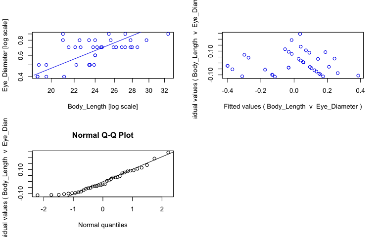<!-- -->

```r
#view fits
summary(sma_asar)
```

```{style="max-height: 300px;"}
## Call: sma(formula = Eye_Diameter ~ Body_Length, data = asar, log = "xy", 
##     method = "SMA", alpha = 0.05) 
## 
## Fit using Standardized Major Axis 
## 
## These variables were log-transformed before fitting: xy 
## 
## Confidence intervals (CI) are at 95%
## 
## ------------------------------------------------------------
## Coefficients:
##             elevation    slope
## estimate    -2.728530 1.844597
## lower limit -3.402995 1.419494
## upper limit -2.054065 2.397008
## 
## H0 : variables uncorrelated
## R-squared : 0.4037707 
## P-value : 2.3852e-05
```

```r
#save coefficients of fits as object
cc_sma_asar <- data.frame(coef(sma_asar))

# Make plot ------
plot_asar <- ggplot(asar, aes(x = Body_Length, y = Eye_Diameter, col = Preservation)) + 
  geom_point(size = 2, alpha = 0.8) + 
  scale_color_manual(values = col_pres, name = "Sample state", breaks = c("ethanol", "fresh", "paraformaldehyde")) +
  scale_x_log10(name = "Body length (mm)") + #makes x axis log scale and named
  scale_y_log10(name = "Eye diameter (mm)") + #makes y axis log scale and named
  ggtitle("Allosergestes sargassi") + 
  theme_bw() +
  theme(panel.grid.major = element_blank(), panel.grid.minor = element_blank(), plot.title = element_text(face = "italic")) +
  geom_abline(data = cc_sma_asar, aes(intercept = cc_sma_asar[1,1], slope = cc_sma_asar[2,1])) +
  geom_text(x = -Inf, y = Inf, hjust = -0.05, vjust = 1.5, nudge_x = 4, label = paste("b =", round(cc_sma_asar[2,1], digits = 2), sep = " "), size = 3.5, col = "black") +
  geom_text(x = -Inf, y = Inf, hjust = -0.05, vjust = 3, label = paste("a =", round(cc_sma_asar[1,1], digits = 2), sep = " "), size = 3.5, col = "black")

#plot with outlier shown
plot_asar_out <- plot_asar +
  geom_point(aes(y=round(0.67, 1), x=round(12.97,1)), colour="red", pch = 18) +
  ggtitle("Allosergestes sargassi + outlier")
  
#plot
ggplotly(plot_asar)
```

```{=html}
<div id="htmlwidget-e1cb6cc1e97fdfd3af55" style="width:768px;height:480px;" class="plotly html-widget"></div>
<script type="application/json" data-for="htmlwidget-e1cb6cc1e97fdfd3af55">{"x":{"data":[{"x":[1.27646180417324,1.32428245529769,1.29225607135648,1.27646180417324,1.27875360095283,1.29225607135648,1.37839790094814,1.38021124171161],"y":[-0.397940008672038,-0.397940008672038,-0.397940008672038,-0.397940008672038,-0.301029995663981,-0.301029995663981,-0.301029995663981,-0.221848749616356],"text":["Body_Length: 18.9<br />Eye_Diameter: 0.4<br />Preservation: ethanol","Body_Length: 21.1<br />Eye_Diameter: 0.4<br />Preservation: ethanol","Body_Length: 19.6<br />Eye_Diameter: 0.4<br />Preservation: ethanol","Body_Length: 18.9<br />Eye_Diameter: 0.4<br />Preservation: ethanol","Body_Length: 19.0<br />Eye_Diameter: 0.5<br />Preservation: ethanol","Body_Length: 19.6<br />Eye_Diameter: 0.5<br />Preservation: ethanol","Body_Length: 23.9<br />Eye_Diameter: 0.5<br />Preservation: ethanol","Body_Length: 24.0<br />Eye_Diameter: 0.6<br />Preservation: ethanol"],"type":"scatter","mode":"markers","marker":{"autocolorscale":false,"color":"rgba(166,206,227,1)","opacity":0.8,"size":7.55905511811024,"symbol":"circle","line":{"width":1.88976377952756,"color":"rgba(166,206,227,1)"}},"hoveron":"points","name":"ethanol","legendgroup":"ethanol","showlegend":true,"xaxis":"x","yaxis":"y","hoverinfo":"text","frame":null},{"x":[1.36921585741014,1.37106786227174,1.34635297445064,1.38021124171161,1.41830129131975,1.37657695705651,1.39093510710338,1.3541084391474,1.41329976408125,1.4345689040342,1.45636603312904,1.39269695325967,1.42813479402879,1.44715803134222,1.44404479591808,1.33243845991561,1.36921585741014,1.47275644931721,1.32221929473392,1.40823996531185,1.38021124171161,1.35218251811136,1.44404479591808,1.40483371661994,1.4345689040342,1.51188336097887],"y":[-0.301029995663981,-0.301029995663981,-0.301029995663981,-0.221848749616356,-0.154901959985743,-0.154901959985743,-0.154901959985743,-0.154901959985743,-0.154901959985743,-0.154901959985743,-0.154901959985743,-0.154901959985743,-0.154901959985743,-0.154901959985743,-0.154901959985743,-0.154901959985743,-0.0969100130080564,-0.0969100130080564,-0.0969100130080564,-0.0969100130080564,-0.0969100130080564,-0.0969100130080564,-0.0969100130080564,-0.0457574905606751,-0.0457574905606751,-0.0457574905606751],"text":["Body_Length: 23.4<br />Eye_Diameter: 0.5<br />Preservation: fresh","Body_Length: 23.5<br />Eye_Diameter: 0.5<br />Preservation: fresh","Body_Length: 22.2<br />Eye_Diameter: 0.5<br />Preservation: fresh","Body_Length: 24.0<br />Eye_Diameter: 0.6<br />Preservation: fresh","Body_Length: 26.2<br />Eye_Diameter: 0.7<br />Preservation: fresh","Body_Length: 23.8<br />Eye_Diameter: 0.7<br />Preservation: fresh","Body_Length: 24.6<br />Eye_Diameter: 0.7<br />Preservation: fresh","Body_Length: 22.6<br />Eye_Diameter: 0.7<br />Preservation: fresh","Body_Length: 25.9<br />Eye_Diameter: 0.7<br />Preservation: fresh","Body_Length: 27.2<br />Eye_Diameter: 0.7<br />Preservation: fresh","Body_Length: 28.6<br />Eye_Diameter: 0.7<br />Preservation: fresh","Body_Length: 24.7<br />Eye_Diameter: 0.7<br />Preservation: fresh","Body_Length: 26.8<br />Eye_Diameter: 0.7<br />Preservation: fresh","Body_Length: 28.0<br />Eye_Diameter: 0.7<br />Preservation: fresh","Body_Length: 27.8<br />Eye_Diameter: 0.7<br />Preservation: fresh","Body_Length: 21.5<br />Eye_Diameter: 0.7<br />Preservation: fresh","Body_Length: 23.4<br />Eye_Diameter: 0.8<br />Preservation: fresh","Body_Length: 29.7<br />Eye_Diameter: 0.8<br />Preservation: fresh","Body_Length: 21.0<br />Eye_Diameter: 0.8<br />Preservation: fresh","Body_Length: 25.6<br />Eye_Diameter: 0.8<br />Preservation: fresh","Body_Length: 24.0<br />Eye_Diameter: 0.8<br />Preservation: fresh","Body_Length: 22.5<br />Eye_Diameter: 0.8<br />Preservation: fresh","Body_Length: 27.8<br />Eye_Diameter: 0.8<br />Preservation: fresh","Body_Length: 25.4<br />Eye_Diameter: 0.9<br />Preservation: fresh","Body_Length: 27.2<br />Eye_Diameter: 0.9<br />Preservation: fresh","Body_Length: 32.5<br />Eye_Diameter: 0.9<br />Preservation: fresh"],"type":"scatter","mode":"markers","marker":{"autocolorscale":false,"color":"rgba(178,223,138,1)","opacity":0.8,"size":7.55905511811024,"symbol":"circle","line":{"width":1.88976377952756,"color":"rgba(178,223,138,1)"}},"hoveron":"points","name":"fresh","legendgroup":"fresh","showlegend":true,"xaxis":"x","yaxis":"y","hoverinfo":"text","frame":null},{"x":[1.38381536598043,1.34439227368511,1.32221929473392],"y":[-0.154901959985743,-0.154901959985743,-0.0457574905606751],"text":["Body_Length: 24.2<br />Eye_Diameter: 0.7<br />Preservation: paraformaldehyde","Body_Length: 22.1<br />Eye_Diameter: 0.7<br />Preservation: paraformaldehyde","Body_Length: 21.0<br />Eye_Diameter: 0.9<br />Preservation: paraformaldehyde"],"type":"scatter","mode":"markers","marker":{"autocolorscale":false,"color":"rgba(31,120,180,1)","opacity":0.8,"size":7.55905511811024,"symbol":"circle","line":{"width":1.88976377952756,"color":"rgba(31,120,180,1)"}},"hoveron":"points","name":"paraformaldehyde","legendgroup":"paraformaldehyde","showlegend":true,"xaxis":"x","yaxis":"y","hoverinfo":"text","frame":null},{"x":[1.26469072633296,1.26469072633296,1.52365443881916,1.52365443881916],"y":[-0.395684899506951,-0.395684899506951,0.0819987875644004,0.0819987875644004],"text":"cc_sma_asar[1, 1]: -2.72853<br />cc_sma_asar[2, 1]: 1.844597","type":"scatter","mode":"lines","line":{"width":1.88976377952756,"color":"rgba(0,0,0,1)","dash":"solid"},"hoveron":"points","showlegend":false,"xaxis":"x","yaxis":"y","hoverinfo":"text","frame":null},{"x":[null,null,null,null,null,null,null,null,null,null,null,null,null,null,null,null,null,null,null,null,null,null,null,null,null,null,null,null,null,null,null,null,null,null,null,null,null],"y":[null,null,null,null,null,null,null,null,null,null,null,null,null,null,null,null,null,null,null,null,null,null,null,null,null,null,null,null,null,null,null,null,null,null,null,null,null],"text":["b = 1.84","b = 1.84","b = 1.84","b = 1.84","b = 1.84","b = 1.84","b = 1.84","b = 1.84","b = 1.84","b = 1.84","b = 1.84","b = 1.84","b = 1.84","b = 1.84","b = 1.84","b = 1.84","b = 1.84","b = 1.84","b = 1.84","b = 1.84","b = 1.84","b = 1.84","b = 1.84","b = 1.84","b = 1.84","b = 1.84","b = 1.84","b = 1.84","b = 1.84","b = 1.84","b = 1.84","b = 1.84","b = 1.84","b = 1.84","b = 1.84","b = 1.84","b = 1.84"],"hovertext":["Body_Length: -Inf<br />Eye_Diameter: Inf<br />Preservation: black","Body_Length: -Inf<br />Eye_Diameter: Inf<br />Preservation: black","Body_Length: -Inf<br />Eye_Diameter: Inf<br />Preservation: black","Body_Length: -Inf<br />Eye_Diameter: Inf<br />Preservation: black","Body_Length: -Inf<br />Eye_Diameter: Inf<br />Preservation: black","Body_Length: -Inf<br />Eye_Diameter: Inf<br />Preservation: black","Body_Length: -Inf<br />Eye_Diameter: Inf<br />Preservation: black","Body_Length: -Inf<br />Eye_Diameter: Inf<br />Preservation: black","Body_Length: -Inf<br />Eye_Diameter: Inf<br />Preservation: black","Body_Length: -Inf<br />Eye_Diameter: Inf<br />Preservation: black","Body_Length: -Inf<br />Eye_Diameter: Inf<br />Preservation: black","Body_Length: -Inf<br />Eye_Diameter: Inf<br />Preservation: black","Body_Length: -Inf<br />Eye_Diameter: Inf<br />Preservation: black","Body_Length: -Inf<br />Eye_Diameter: Inf<br />Preservation: black","Body_Length: -Inf<br />Eye_Diameter: Inf<br />Preservation: black","Body_Length: -Inf<br />Eye_Diameter: Inf<br />Preservation: black","Body_Length: -Inf<br />Eye_Diameter: Inf<br />Preservation: black","Body_Length: -Inf<br />Eye_Diameter: Inf<br />Preservation: black","Body_Length: -Inf<br />Eye_Diameter: Inf<br />Preservation: black","Body_Length: -Inf<br />Eye_Diameter: Inf<br />Preservation: black","Body_Length: -Inf<br />Eye_Diameter: Inf<br />Preservation: black","Body_Length: -Inf<br />Eye_Diameter: Inf<br />Preservation: black","Body_Length: -Inf<br />Eye_Diameter: Inf<br />Preservation: black","Body_Length: -Inf<br />Eye_Diameter: Inf<br />Preservation: black","Body_Length: -Inf<br />Eye_Diameter: Inf<br />Preservation: black","Body_Length: -Inf<br />Eye_Diameter: Inf<br />Preservation: black","Body_Length: -Inf<br />Eye_Diameter: Inf<br />Preservation: black","Body_Length: -Inf<br />Eye_Diameter: Inf<br />Preservation: black","Body_Length: -Inf<br />Eye_Diameter: Inf<br />Preservation: black","Body_Length: -Inf<br />Eye_Diameter: Inf<br />Preservation: black","Body_Length: -Inf<br />Eye_Diameter: Inf<br />Preservation: black","Body_Length: -Inf<br />Eye_Diameter: Inf<br />Preservation: black","Body_Length: -Inf<br />Eye_Diameter: Inf<br />Preservation: black","Body_Length: -Inf<br />Eye_Diameter: Inf<br />Preservation: black","Body_Length: -Inf<br />Eye_Diameter: Inf<br />Preservation: black","Body_Length: -Inf<br />Eye_Diameter: Inf<br />Preservation: black","Body_Length: -Inf<br />Eye_Diameter: Inf<br />Preservation: black"],"textfont":{"size":13.2283464566929,"color":"rgba(0,0,0,1)"},"type":"scatter","mode":"text","hoveron":"points","showlegend":false,"xaxis":"x","yaxis":"y","hoverinfo":"text","frame":null},{"x":[null,null,null,null,null,null,null,null,null,null,null,null,null,null,null,null,null,null,null,null,null,null,null,null,null,null,null,null,null,null,null,null,null,null,null,null,null],"y":[null,null,null,null,null,null,null,null,null,null,null,null,null,null,null,null,null,null,null,null,null,null,null,null,null,null,null,null,null,null,null,null,null,null,null,null,null],"text":["a = -2.73","a = -2.73","a = -2.73","a = -2.73","a = -2.73","a = -2.73","a = -2.73","a = -2.73","a = -2.73","a = -2.73","a = -2.73","a = -2.73","a = -2.73","a = -2.73","a = -2.73","a = -2.73","a = -2.73","a = -2.73","a = -2.73","a = -2.73","a = -2.73","a = -2.73","a = -2.73","a = -2.73","a = -2.73","a = -2.73","a = -2.73","a = -2.73","a = -2.73","a = -2.73","a = -2.73","a = -2.73","a = -2.73","a = -2.73","a = -2.73","a = -2.73","a = -2.73"],"hovertext":["Body_Length: -Inf<br />Eye_Diameter: Inf<br />Preservation: black","Body_Length: -Inf<br />Eye_Diameter: Inf<br />Preservation: black","Body_Length: -Inf<br />Eye_Diameter: Inf<br />Preservation: black","Body_Length: -Inf<br />Eye_Diameter: Inf<br />Preservation: black","Body_Length: -Inf<br />Eye_Diameter: Inf<br />Preservation: black","Body_Length: -Inf<br />Eye_Diameter: Inf<br />Preservation: black","Body_Length: -Inf<br />Eye_Diameter: Inf<br />Preservation: black","Body_Length: -Inf<br />Eye_Diameter: Inf<br />Preservation: black","Body_Length: -Inf<br />Eye_Diameter: Inf<br />Preservation: black","Body_Length: -Inf<br />Eye_Diameter: Inf<br />Preservation: black","Body_Length: -Inf<br />Eye_Diameter: Inf<br />Preservation: black","Body_Length: -Inf<br />Eye_Diameter: Inf<br />Preservation: black","Body_Length: -Inf<br />Eye_Diameter: Inf<br />Preservation: black","Body_Length: -Inf<br />Eye_Diameter: Inf<br />Preservation: black","Body_Length: -Inf<br />Eye_Diameter: Inf<br />Preservation: black","Body_Length: -Inf<br />Eye_Diameter: Inf<br />Preservation: black","Body_Length: -Inf<br />Eye_Diameter: Inf<br />Preservation: black","Body_Length: -Inf<br />Eye_Diameter: Inf<br />Preservation: black","Body_Length: -Inf<br />Eye_Diameter: Inf<br />Preservation: black","Body_Length: -Inf<br />Eye_Diameter: Inf<br />Preservation: black","Body_Length: -Inf<br />Eye_Diameter: Inf<br />Preservation: black","Body_Length: -Inf<br />Eye_Diameter: Inf<br />Preservation: black","Body_Length: -Inf<br />Eye_Diameter: Inf<br />Preservation: black","Body_Length: -Inf<br />Eye_Diameter: Inf<br />Preservation: black","Body_Length: -Inf<br />Eye_Diameter: Inf<br />Preservation: black","Body_Length: -Inf<br />Eye_Diameter: Inf<br />Preservation: black","Body_Length: -Inf<br />Eye_Diameter: Inf<br />Preservation: black","Body_Length: -Inf<br />Eye_Diameter: Inf<br />Preservation: black","Body_Length: -Inf<br />Eye_Diameter: Inf<br />Preservation: black","Body_Length: -Inf<br />Eye_Diameter: Inf<br />Preservation: black","Body_Length: -Inf<br />Eye_Diameter: Inf<br />Preservation: black","Body_Length: -Inf<br />Eye_Diameter: Inf<br />Preservation: black","Body_Length: -Inf<br />Eye_Diameter: Inf<br />Preservation: black","Body_Length: -Inf<br />Eye_Diameter: Inf<br />Preservation: black","Body_Length: -Inf<br />Eye_Diameter: Inf<br />Preservation: black","Body_Length: -Inf<br />Eye_Diameter: Inf<br />Preservation: black","Body_Length: -Inf<br />Eye_Diameter: Inf<br />Preservation: black"],"textfont":{"size":13.2283464566929,"color":"rgba(0,0,0,1)"},"type":"scatter","mode":"text","hoveron":"points","showlegend":false,"xaxis":"x","yaxis":"y","hoverinfo":"text","frame":null}],"layout":{"margin":{"t":45.2237442922374,"r":7.30593607305936,"b":41.6438356164384,"l":43.1050228310502},"plot_bgcolor":"rgba(255,255,255,1)","paper_bgcolor":"rgba(255,255,255,1)","font":{"color":"rgba(0,0,0,1)","family":"","size":14.6118721461187},"title":{"text":"<i> Allosergestes sargassi <\/i>","font":{"color":"rgba(0,0,0,1)","family":"","size":17.5342465753425},"x":0,"xref":"paper"},"xaxis":{"domain":[0,1],"automargin":true,"type":"linear","autorange":false,"range":[1.26469072633296,1.52365443881916],"tickmode":"array","ticktext":["22","26","30"],"tickvals":[1.34242268082221,1.41497334797082,1.47712125471966],"categoryorder":"array","categoryarray":["22","26","30"],"nticks":null,"ticks":"outside","tickcolor":"rgba(51,51,51,1)","ticklen":3.65296803652968,"tickwidth":0.66417600664176,"showticklabels":true,"tickfont":{"color":"rgba(77,77,77,1)","family":"","size":11.689497716895},"tickangle":-0,"showline":false,"linecolor":null,"linewidth":0,"showgrid":false,"gridcolor":null,"gridwidth":0,"zeroline":false,"anchor":"y","title":{"text":"Body length (mm)","font":{"color":"rgba(0,0,0,1)","family":"","size":14.6118721461187}},"hoverformat":".2f"},"yaxis":{"domain":[0,1],"automargin":true,"type":"linear","autorange":false,"range":[-0.415549134577606,-0.028148364655107],"tickmode":"array","ticktext":["0.4","0.5","0.7"],"tickvals":[-0.397940008672038,-0.301029995663981,-0.154901959985743],"categoryorder":"array","categoryarray":["0.4","0.5","0.7"],"nticks":null,"ticks":"outside","tickcolor":"rgba(51,51,51,1)","ticklen":3.65296803652968,"tickwidth":0.66417600664176,"showticklabels":true,"tickfont":{"color":"rgba(77,77,77,1)","family":"","size":11.689497716895},"tickangle":-0,"showline":false,"linecolor":null,"linewidth":0,"showgrid":false,"gridcolor":null,"gridwidth":0,"zeroline":false,"anchor":"x","title":{"text":"Eye diameter (mm)","font":{"color":"rgba(0,0,0,1)","family":"","size":14.6118721461187}},"hoverformat":".2f"},"shapes":[{"type":"rect","fillcolor":"transparent","line":{"color":"rgba(51,51,51,1)","width":0.66417600664176,"linetype":"solid"},"yref":"paper","xref":"paper","x0":0,"x1":1,"y0":0,"y1":1}],"showlegend":true,"legend":{"bgcolor":"rgba(255,255,255,1)","bordercolor":"transparent","borderwidth":1.88976377952756,"font":{"color":"rgba(0,0,0,1)","family":"","size":11.689497716895},"title":{"text":"Sample state","font":{"color":"rgba(0,0,0,1)","family":"","size":14.6118721461187}}},"hovermode":"closest","barmode":"relative"},"config":{"doubleClick":"reset","modeBarButtonsToAdd":["hoverclosest","hovercompare"],"showSendToCloud":false},"source":"A","attrs":{"201456c1191a":{"x":{},"y":{},"colour":{},"type":"scatter"},"20141f572675":{"intercept":{},"slope":{}},"2014129ddb66":{"x":{},"y":{},"colour":{}},"201439af0f16":{"x":{},"y":{},"colour":{}}},"cur_data":"201456c1191a","visdat":{"201456c1191a":["function (y) ","x"],"20141f572675":["function (y) ","x"],"2014129ddb66":["function (y) ","x"],"201439af0f16":["function (y) ","x"]},"highlight":{"on":"plotly_click","persistent":false,"dynamic":false,"selectize":false,"opacityDim":0.2,"selected":{"opacity":1},"debounce":0},"shinyEvents":["plotly_hover","plotly_click","plotly_selected","plotly_relayout","plotly_brushed","plotly_brushing","plotly_clickannotation","plotly_doubleclick","plotly_deselect","plotly_afterplot","plotly_sunburstclick"],"base_url":"https://plot.ly"},"evals":[],"jsHooks":[]}</script>
```

```r
#plot with outlier
ggplotly(plot_asar_out)
```

```{=html}
<div id="htmlwidget-1767816a629040d4aaaf" style="width:768px;height:480px;" class="plotly html-widget"></div>
<script type="application/json" data-for="htmlwidget-1767816a629040d4aaaf">{"x":{"data":[{"x":[1.27646180417324,1.32428245529769,1.29225607135648,1.27646180417324,1.27875360095283,1.29225607135648,1.37839790094814,1.38021124171161],"y":[-0.397940008672038,-0.397940008672038,-0.397940008672038,-0.397940008672038,-0.301029995663981,-0.301029995663981,-0.301029995663981,-0.221848749616356],"text":["Body_Length: 18.9<br />Eye_Diameter: 0.4<br />Preservation: ethanol","Body_Length: 21.1<br />Eye_Diameter: 0.4<br />Preservation: ethanol","Body_Length: 19.6<br />Eye_Diameter: 0.4<br />Preservation: ethanol","Body_Length: 18.9<br />Eye_Diameter: 0.4<br />Preservation: ethanol","Body_Length: 19.0<br />Eye_Diameter: 0.5<br />Preservation: ethanol","Body_Length: 19.6<br />Eye_Diameter: 0.5<br />Preservation: ethanol","Body_Length: 23.9<br />Eye_Diameter: 0.5<br />Preservation: ethanol","Body_Length: 24.0<br />Eye_Diameter: 0.6<br />Preservation: ethanol"],"type":"scatter","mode":"markers","marker":{"autocolorscale":false,"color":"rgba(166,206,227,1)","opacity":0.8,"size":7.55905511811024,"symbol":"circle","line":{"width":1.88976377952756,"color":"rgba(166,206,227,1)"}},"hoveron":"points","name":"ethanol","legendgroup":"ethanol","showlegend":true,"xaxis":"x","yaxis":"y","hoverinfo":"text","frame":null},{"x":[1.36921585741014,1.37106786227174,1.34635297445064,1.38021124171161,1.41830129131975,1.37657695705651,1.39093510710338,1.3541084391474,1.41329976408125,1.4345689040342,1.45636603312904,1.39269695325967,1.42813479402879,1.44715803134222,1.44404479591808,1.33243845991561,1.36921585741014,1.47275644931721,1.32221929473392,1.40823996531185,1.38021124171161,1.35218251811136,1.44404479591808,1.40483371661994,1.4345689040342,1.51188336097887],"y":[-0.301029995663981,-0.301029995663981,-0.301029995663981,-0.221848749616356,-0.154901959985743,-0.154901959985743,-0.154901959985743,-0.154901959985743,-0.154901959985743,-0.154901959985743,-0.154901959985743,-0.154901959985743,-0.154901959985743,-0.154901959985743,-0.154901959985743,-0.154901959985743,-0.0969100130080564,-0.0969100130080564,-0.0969100130080564,-0.0969100130080564,-0.0969100130080564,-0.0969100130080564,-0.0969100130080564,-0.0457574905606751,-0.0457574905606751,-0.0457574905606751],"text":["Body_Length: 23.4<br />Eye_Diameter: 0.5<br />Preservation: fresh","Body_Length: 23.5<br />Eye_Diameter: 0.5<br />Preservation: fresh","Body_Length: 22.2<br />Eye_Diameter: 0.5<br />Preservation: fresh","Body_Length: 24.0<br />Eye_Diameter: 0.6<br />Preservation: fresh","Body_Length: 26.2<br />Eye_Diameter: 0.7<br />Preservation: fresh","Body_Length: 23.8<br />Eye_Diameter: 0.7<br />Preservation: fresh","Body_Length: 24.6<br />Eye_Diameter: 0.7<br />Preservation: fresh","Body_Length: 22.6<br />Eye_Diameter: 0.7<br />Preservation: fresh","Body_Length: 25.9<br />Eye_Diameter: 0.7<br />Preservation: fresh","Body_Length: 27.2<br />Eye_Diameter: 0.7<br />Preservation: fresh","Body_Length: 28.6<br />Eye_Diameter: 0.7<br />Preservation: fresh","Body_Length: 24.7<br />Eye_Diameter: 0.7<br />Preservation: fresh","Body_Length: 26.8<br />Eye_Diameter: 0.7<br />Preservation: fresh","Body_Length: 28.0<br />Eye_Diameter: 0.7<br />Preservation: fresh","Body_Length: 27.8<br />Eye_Diameter: 0.7<br />Preservation: fresh","Body_Length: 21.5<br />Eye_Diameter: 0.7<br />Preservation: fresh","Body_Length: 23.4<br />Eye_Diameter: 0.8<br />Preservation: fresh","Body_Length: 29.7<br />Eye_Diameter: 0.8<br />Preservation: fresh","Body_Length: 21.0<br />Eye_Diameter: 0.8<br />Preservation: fresh","Body_Length: 25.6<br />Eye_Diameter: 0.8<br />Preservation: fresh","Body_Length: 24.0<br />Eye_Diameter: 0.8<br />Preservation: fresh","Body_Length: 22.5<br />Eye_Diameter: 0.8<br />Preservation: fresh","Body_Length: 27.8<br />Eye_Diameter: 0.8<br />Preservation: fresh","Body_Length: 25.4<br />Eye_Diameter: 0.9<br />Preservation: fresh","Body_Length: 27.2<br />Eye_Diameter: 0.9<br />Preservation: fresh","Body_Length: 32.5<br />Eye_Diameter: 0.9<br />Preservation: fresh"],"type":"scatter","mode":"markers","marker":{"autocolorscale":false,"color":"rgba(178,223,138,1)","opacity":0.8,"size":7.55905511811024,"symbol":"circle","line":{"width":1.88976377952756,"color":"rgba(178,223,138,1)"}},"hoveron":"points","name":"fresh","legendgroup":"fresh","showlegend":true,"xaxis":"x","yaxis":"y","hoverinfo":"text","frame":null},{"x":[1.38381536598043,1.34439227368511,1.32221929473392],"y":[-0.154901959985743,-0.154901959985743,-0.0457574905606751],"text":["Body_Length: 24.2<br />Eye_Diameter: 0.7<br />Preservation: paraformaldehyde","Body_Length: 22.1<br />Eye_Diameter: 0.7<br />Preservation: paraformaldehyde","Body_Length: 21.0<br />Eye_Diameter: 0.9<br />Preservation: paraformaldehyde"],"type":"scatter","mode":"markers","marker":{"autocolorscale":false,"color":"rgba(31,120,180,1)","opacity":0.8,"size":7.55905511811024,"symbol":"circle","line":{"width":1.88976377952756,"color":"rgba(31,120,180,1)"}},"hoveron":"points","name":"paraformaldehyde","legendgroup":"paraformaldehyde","showlegend":true,"xaxis":"x","yaxis":"y","hoverinfo":"text","frame":null},{"x":[1.09404635187323,1.09404635187323,1.53178036141248,1.53178036141248],"y":[-0.710455000643236,-0.710455000643236,0.0969878399994615,0.0969878399994615],"text":"cc_sma_asar[1, 1]: -2.72853<br />cc_sma_asar[2, 1]: 1.844597","type":"scatter","mode":"lines","line":{"width":1.88976377952756,"color":"rgba(0,0,0,1)","dash":"solid"},"hoveron":"points","showlegend":false,"xaxis":"x","yaxis":"y","hoverinfo":"text","frame":null},{"x":[null,null,null,null,null,null,null,null,null,null,null,null,null,null,null,null,null,null,null,null,null,null,null,null,null,null,null,null,null,null,null,null,null,null,null,null,null],"y":[null,null,null,null,null,null,null,null,null,null,null,null,null,null,null,null,null,null,null,null,null,null,null,null,null,null,null,null,null,null,null,null,null,null,null,null,null],"text":["b = 1.84","b = 1.84","b = 1.84","b = 1.84","b = 1.84","b = 1.84","b = 1.84","b = 1.84","b = 1.84","b = 1.84","b = 1.84","b = 1.84","b = 1.84","b = 1.84","b = 1.84","b = 1.84","b = 1.84","b = 1.84","b = 1.84","b = 1.84","b = 1.84","b = 1.84","b = 1.84","b = 1.84","b = 1.84","b = 1.84","b = 1.84","b = 1.84","b = 1.84","b = 1.84","b = 1.84","b = 1.84","b = 1.84","b = 1.84","b = 1.84","b = 1.84","b = 1.84"],"hovertext":["Body_Length: -Inf<br />Eye_Diameter: Inf<br />Preservation: black","Body_Length: -Inf<br />Eye_Diameter: Inf<br />Preservation: black","Body_Length: -Inf<br />Eye_Diameter: Inf<br />Preservation: black","Body_Length: -Inf<br />Eye_Diameter: Inf<br />Preservation: black","Body_Length: -Inf<br />Eye_Diameter: Inf<br />Preservation: black","Body_Length: -Inf<br />Eye_Diameter: Inf<br />Preservation: black","Body_Length: -Inf<br />Eye_Diameter: Inf<br />Preservation: black","Body_Length: -Inf<br />Eye_Diameter: Inf<br />Preservation: black","Body_Length: -Inf<br />Eye_Diameter: Inf<br />Preservation: black","Body_Length: -Inf<br />Eye_Diameter: Inf<br />Preservation: black","Body_Length: -Inf<br />Eye_Diameter: Inf<br />Preservation: black","Body_Length: -Inf<br />Eye_Diameter: Inf<br />Preservation: black","Body_Length: -Inf<br />Eye_Diameter: Inf<br />Preservation: black","Body_Length: -Inf<br />Eye_Diameter: Inf<br />Preservation: black","Body_Length: -Inf<br />Eye_Diameter: Inf<br />Preservation: black","Body_Length: -Inf<br />Eye_Diameter: Inf<br />Preservation: black","Body_Length: -Inf<br />Eye_Diameter: Inf<br />Preservation: black","Body_Length: -Inf<br />Eye_Diameter: Inf<br />Preservation: black","Body_Length: -Inf<br />Eye_Diameter: Inf<br />Preservation: black","Body_Length: -Inf<br />Eye_Diameter: Inf<br />Preservation: black","Body_Length: -Inf<br />Eye_Diameter: Inf<br />Preservation: black","Body_Length: -Inf<br />Eye_Diameter: Inf<br />Preservation: black","Body_Length: -Inf<br />Eye_Diameter: Inf<br />Preservation: black","Body_Length: -Inf<br />Eye_Diameter: Inf<br />Preservation: black","Body_Length: -Inf<br />Eye_Diameter: Inf<br />Preservation: black","Body_Length: -Inf<br />Eye_Diameter: Inf<br />Preservation: black","Body_Length: -Inf<br />Eye_Diameter: Inf<br />Preservation: black","Body_Length: -Inf<br />Eye_Diameter: Inf<br />Preservation: black","Body_Length: -Inf<br />Eye_Diameter: Inf<br />Preservation: black","Body_Length: -Inf<br />Eye_Diameter: Inf<br />Preservation: black","Body_Length: -Inf<br />Eye_Diameter: Inf<br />Preservation: black","Body_Length: -Inf<br />Eye_Diameter: Inf<br />Preservation: black","Body_Length: -Inf<br />Eye_Diameter: Inf<br />Preservation: black","Body_Length: -Inf<br />Eye_Diameter: Inf<br />Preservation: black","Body_Length: -Inf<br />Eye_Diameter: Inf<br />Preservation: black","Body_Length: -Inf<br />Eye_Diameter: Inf<br />Preservation: black","Body_Length: -Inf<br />Eye_Diameter: Inf<br />Preservation: black"],"textfont":{"size":13.2283464566929,"color":"rgba(0,0,0,1)"},"type":"scatter","mode":"text","hoveron":"points","showlegend":false,"xaxis":"x","yaxis":"y","hoverinfo":"text","frame":null},{"x":[null,null,null,null,null,null,null,null,null,null,null,null,null,null,null,null,null,null,null,null,null,null,null,null,null,null,null,null,null,null,null,null,null,null,null,null,null],"y":[null,null,null,null,null,null,null,null,null,null,null,null,null,null,null,null,null,null,null,null,null,null,null,null,null,null,null,null,null,null,null,null,null,null,null,null,null],"text":["a = -2.73","a = -2.73","a = -2.73","a = -2.73","a = -2.73","a = -2.73","a = -2.73","a = -2.73","a = -2.73","a = -2.73","a = -2.73","a = -2.73","a = -2.73","a = -2.73","a = -2.73","a = -2.73","a = -2.73","a = -2.73","a = -2.73","a = -2.73","a = -2.73","a = -2.73","a = -2.73","a = -2.73","a = -2.73","a = -2.73","a = -2.73","a = -2.73","a = -2.73","a = -2.73","a = -2.73","a = -2.73","a = -2.73","a = -2.73","a = -2.73","a = -2.73","a = -2.73"],"hovertext":["Body_Length: -Inf<br />Eye_Diameter: Inf<br />Preservation: black","Body_Length: -Inf<br />Eye_Diameter: Inf<br />Preservation: black","Body_Length: -Inf<br />Eye_Diameter: Inf<br />Preservation: black","Body_Length: -Inf<br />Eye_Diameter: Inf<br />Preservation: black","Body_Length: -Inf<br />Eye_Diameter: Inf<br />Preservation: black","Body_Length: -Inf<br />Eye_Diameter: Inf<br />Preservation: black","Body_Length: -Inf<br />Eye_Diameter: Inf<br />Preservation: black","Body_Length: -Inf<br />Eye_Diameter: Inf<br />Preservation: black","Body_Length: -Inf<br />Eye_Diameter: Inf<br />Preservation: black","Body_Length: -Inf<br />Eye_Diameter: Inf<br />Preservation: black","Body_Length: -Inf<br />Eye_Diameter: Inf<br />Preservation: black","Body_Length: -Inf<br />Eye_Diameter: Inf<br />Preservation: black","Body_Length: -Inf<br />Eye_Diameter: Inf<br />Preservation: black","Body_Length: -Inf<br />Eye_Diameter: Inf<br />Preservation: black","Body_Length: -Inf<br />Eye_Diameter: Inf<br />Preservation: black","Body_Length: -Inf<br />Eye_Diameter: Inf<br />Preservation: black","Body_Length: -Inf<br />Eye_Diameter: Inf<br />Preservation: black","Body_Length: -Inf<br />Eye_Diameter: Inf<br />Preservation: black","Body_Length: -Inf<br />Eye_Diameter: Inf<br />Preservation: black","Body_Length: -Inf<br />Eye_Diameter: Inf<br />Preservation: black","Body_Length: -Inf<br />Eye_Diameter: Inf<br />Preservation: black","Body_Length: -Inf<br />Eye_Diameter: Inf<br />Preservation: black","Body_Length: -Inf<br />Eye_Diameter: Inf<br />Preservation: black","Body_Length: -Inf<br />Eye_Diameter: Inf<br />Preservation: black","Body_Length: -Inf<br />Eye_Diameter: Inf<br />Preservation: black","Body_Length: -Inf<br />Eye_Diameter: Inf<br />Preservation: black","Body_Length: -Inf<br />Eye_Diameter: Inf<br />Preservation: black","Body_Length: -Inf<br />Eye_Diameter: Inf<br />Preservation: black","Body_Length: -Inf<br />Eye_Diameter: Inf<br />Preservation: black","Body_Length: -Inf<br />Eye_Diameter: Inf<br />Preservation: black","Body_Length: -Inf<br />Eye_Diameter: Inf<br />Preservation: black","Body_Length: -Inf<br />Eye_Diameter: Inf<br />Preservation: black","Body_Length: -Inf<br />Eye_Diameter: Inf<br />Preservation: black","Body_Length: -Inf<br />Eye_Diameter: Inf<br />Preservation: black","Body_Length: -Inf<br />Eye_Diameter: Inf<br />Preservation: black","Body_Length: -Inf<br />Eye_Diameter: Inf<br />Preservation: black","Body_Length: -Inf<br />Eye_Diameter: Inf<br />Preservation: black"],"textfont":{"size":13.2283464566929,"color":"rgba(0,0,0,1)"},"type":"scatter","mode":"text","hoveron":"points","showlegend":false,"xaxis":"x","yaxis":"y","hoverinfo":"text","frame":null},{"x":[1.11394335230684,1.11394335230684,1.11394335230684,1.11394335230684,1.11394335230684,1.11394335230684,1.11394335230684,1.11394335230684,1.11394335230684,1.11394335230684,1.11394335230684,1.11394335230684,1.11394335230684,1.11394335230684,1.11394335230684,1.11394335230684,1.11394335230684,1.11394335230684,1.11394335230684,1.11394335230684,1.11394335230684,1.11394335230684,1.11394335230684,1.11394335230684,1.11394335230684,1.11394335230684,1.11394335230684,1.11394335230684,1.11394335230684,1.11394335230684,1.11394335230684,1.11394335230684,1.11394335230684,1.11394335230684,1.11394335230684,1.11394335230684,1.11394335230684],"y":[-0.154901959985743,-0.154901959985743,-0.154901959985743,-0.154901959985743,-0.154901959985743,-0.154901959985743,-0.154901959985743,-0.154901959985743,-0.154901959985743,-0.154901959985743,-0.154901959985743,-0.154901959985743,-0.154901959985743,-0.154901959985743,-0.154901959985743,-0.154901959985743,-0.154901959985743,-0.154901959985743,-0.154901959985743,-0.154901959985743,-0.154901959985743,-0.154901959985743,-0.154901959985743,-0.154901959985743,-0.154901959985743,-0.154901959985743,-0.154901959985743,-0.154901959985743,-0.154901959985743,-0.154901959985743,-0.154901959985743,-0.154901959985743,-0.154901959985743,-0.154901959985743,-0.154901959985743,-0.154901959985743,-0.154901959985743],"text":"round(12.97, 1): 13<br />round(0.67, 1): 0.7<br />Preservation: red","type":"scatter","mode":"markers","marker":{"autocolorscale":false,"color":"rgba(255,0,0,1)","opacity":1,"size":5.66929133858268,"symbol":"diamond","line":{"width":1.88976377952756,"color":"rgba(255,0,0,1)"}},"hoveron":"points","showlegend":false,"xaxis":"x","yaxis":"y","hoverinfo":"text","frame":null}],"layout":{"margin":{"t":45.2237442922374,"r":7.30593607305936,"b":41.6438356164384,"l":43.1050228310502},"plot_bgcolor":"rgba(255,255,255,1)","paper_bgcolor":"rgba(255,255,255,1)","font":{"color":"rgba(0,0,0,1)","family":"","size":14.6118721461187},"title":{"text":"<i> Allosergestes sargassi + outlier <\/i>","font":{"color":"rgba(0,0,0,1)","family":"","size":17.5342465753425},"x":0,"xref":"paper"},"xaxis":{"domain":[0,1],"automargin":true,"type":"linear","autorange":false,"range":[1.09404635187323,1.53178036141248],"tickmode":"array","ticktext":["15","20","25","30"],"tickvals":[1.17609125905568,1.30102999566398,1.39794000867204,1.47712125471966],"categoryorder":"array","categoryarray":["15","20","25","30"],"nticks":null,"ticks":"outside","tickcolor":"rgba(51,51,51,1)","ticklen":3.65296803652968,"tickwidth":0.66417600664176,"showticklabels":true,"tickfont":{"color":"rgba(77,77,77,1)","family":"","size":11.689497716895},"tickangle":-0,"showline":false,"linecolor":null,"linewidth":0,"showgrid":false,"gridcolor":null,"gridwidth":0,"zeroline":false,"anchor":"y","title":{"text":"Body length (mm)","font":{"color":"rgba(0,0,0,1)","family":"","size":14.6118721461187}},"hoverformat":".2f"},"yaxis":{"domain":[0,1],"automargin":true,"type":"linear","autorange":false,"range":[-0.415549134577606,-0.028148364655107],"tickmode":"array","ticktext":["0.4","0.5","0.7"],"tickvals":[-0.397940008672038,-0.301029995663981,-0.154901959985743],"categoryorder":"array","categoryarray":["0.4","0.5","0.7"],"nticks":null,"ticks":"outside","tickcolor":"rgba(51,51,51,1)","ticklen":3.65296803652968,"tickwidth":0.66417600664176,"showticklabels":true,"tickfont":{"color":"rgba(77,77,77,1)","family":"","size":11.689497716895},"tickangle":-0,"showline":false,"linecolor":null,"linewidth":0,"showgrid":false,"gridcolor":null,"gridwidth":0,"zeroline":false,"anchor":"x","title":{"text":"Eye diameter (mm)","font":{"color":"rgba(0,0,0,1)","family":"","size":14.6118721461187}},"hoverformat":".2f"},"shapes":[{"type":"rect","fillcolor":"transparent","line":{"color":"rgba(51,51,51,1)","width":0.66417600664176,"linetype":"solid"},"yref":"paper","xref":"paper","x0":0,"x1":1,"y0":0,"y1":1}],"showlegend":true,"legend":{"bgcolor":"rgba(255,255,255,1)","bordercolor":"transparent","borderwidth":1.88976377952756,"font":{"color":"rgba(0,0,0,1)","family":"","size":11.689497716895},"title":{"text":"Sample state","font":{"color":"rgba(0,0,0,1)","family":"","size":14.6118721461187}}},"hovermode":"closest","barmode":"relative"},"config":{"doubleClick":"reset","modeBarButtonsToAdd":["hoverclosest","hovercompare"],"showSendToCloud":false},"source":"A","attrs":{"20141837a47b":{"x":{},"y":{},"colour":{},"type":"scatter"},"20146d0f93a8":{"intercept":{},"slope":{}},"201419a73288":{"x":{},"y":{},"colour":{}},"20142fe68be0":{"x":{},"y":{},"colour":{}},"201448e937b1":{"x":{},"y":{},"colour":{}}},"cur_data":"20141837a47b","visdat":{"20141837a47b":["function (y) ","x"],"20146d0f93a8":["function (y) ","x"],"201419a73288":["function (y) ","x"],"20142fe68be0":["function (y) ","x"],"201448e937b1":["function (y) ","x"]},"highlight":{"on":"plotly_click","persistent":false,"dynamic":false,"selectize":false,"opacityDim":0.2,"selected":{"opacity":1},"debounce":0},"shinyEvents":["plotly_hover","plotly_click","plotly_selected","plotly_relayout","plotly_brushed","plotly_brushing","plotly_clickannotation","plotly_doubleclick","plotly_deselect","plotly_afterplot","plotly_sunburstclick"],"base_url":"https://plot.ly"},"evals":[],"jsHooks":[]}</script>
```

## _Challengerosergia hansjacobi_


```r
# Subset data -----
chan <- specimens %>% filter(genus_species == "Challengerosergia_hansjacobi")

# Fit SMA model ------
sma_chan <- sma(formula = Eye_Diameter ~ Body_Length, 
            data = chan, 
            log = "xy", #sets both x and y variables as logged
            method="SMA", #defines SMA as model
            alpha = 0.05)

#plot fit, residuals, qq
par(mfrow = c(2,2)) #make plot window 2x2
plot(sma_chan, which = "default",type = "o") 
plot(sma_chan, which = "residual",type = "o")
plot(sma_chan, which = "qq", type = "o")
par(mfrow = c(1,1)) 
```

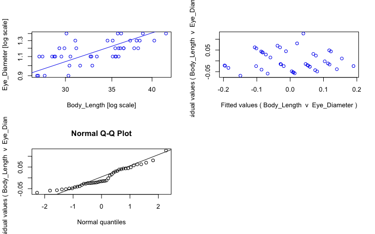<!-- -->

```r
#view fits
summary(sma_chan)
```

```{style="max-height: 300px;"}
## Call: sma(formula = Eye_Diameter ~ Body_Length, data = chan, log = "xy", 
##     method = "SMA", alpha = 0.05) 
## 
## Fit using Standardized Major Axis 
## 
## These variables were log-transformed before fitting: xy 
## 
## Confidence intervals (CI) are at 95%
## 
## ------------------------------------------------------------
## Coefficients:
##             elevation    slope
## estimate    -1.528299 1.047036
## lower limit -1.913161 0.824145
## upper limit -1.143436 1.330207
## 
## H0 : variables uncorrelated
## R-squared : 0.4129122 
## P-value : 3.3885e-06
```

```r
#save coefficients of fits as object
cc_sma_chan <- data.frame(coef(sma_chan))

# Make plot ------
plot_chan <- ggplot(chan, aes(x = Body_Length, y = Eye_Diameter, col = Preservation)) + 
  geom_point(size = 2, alpha = 0.8) + 
  scale_color_manual(values = col_pres, name = "Sample state", breaks = c("ethanol", "fresh", "paraformaldehyde")) +
  scale_x_log10(name = "Body length (mm)") + #makes x axis log scale and named
  scale_y_log10(name = "Eye diameter (mm)") + #makes y axis log scale and named
  ggtitle("Challengerosergia hansjacobi") + 
  theme_bw() +
  theme(panel.grid.major = element_blank(), panel.grid.minor = element_blank(), plot.title = element_text(face = "italic")) +
  geom_abline(data = cc_sma_chan, aes(intercept = cc_sma_chan[1,1], slope = cc_sma_chan[2,1])) +
  geom_text(x = -Inf, y = Inf, hjust = -0.05, vjust = 1.5, nudge_x = 4, label = paste("b =", round(cc_sma_chan[2,1], digits = 2), sep = " "), size = 3.5, col = "black") +
  geom_text(x = -Inf, y = Inf, hjust = -0.05, vjust = 3, label = paste("a =", round(cc_sma_chan[1,1], digits = 2), sep = " "), size = 3.5, col = "black")

ggplotly(plot_chan)
```

```{=html}
<div id="htmlwidget-2270cee9bec56c84fd00" style="width:768px;height:480px;" class="plotly html-widget"></div>
<script type="application/json" data-for="htmlwidget-2270cee9bec56c84fd00">{"x":{"data":[{"x":[1.43775056282039,1.48144262850231,1.51587384371168,1.48287358360875,1.47129171105894,1.48429983934679,1.46089784275655,1.51454775266029,1.51321760006794,1.54900326202579,1.55388302664387,1.46834733041216,1.56110138364906,1.49276038902684,1.55388302664387,1.54900326202579,1.56110138364906,1.57634135020579,1.5705429398819,1.57978359661681,1.53781909507327,1.49136169383427,1.58433122436753,1.60530504614111,1.54530711646582,1.55750720190566,1.58883172559421,1.47856649559384,1.55266821611219,1.6222140229663],"y":[-0.0457574905606751,-0.0457574905606751,0,0,0.0413926851582251,0.0413926851582251,0.0413926851582251,0.0413926851582251,0.0413926851582251,0.0413926851582251,0.0413926851582251,0.0791812460476248,0.0791812460476248,0.0791812460476248,0.0791812460476248,0.0791812460476248,0.0791812460476248,0.0791812460476248,0.113943352306837,0.113943352306837,0.113943352306837,0.113943352306837,0.113943352306837,0.113943352306837,0.113943352306837,0.146128035678238,0.146128035678238,0.146128035678238,0.146128035678238,0.146128035678238],"text":["Body_Length: 27.4<br />Eye_Diameter: 0.9<br />Preservation: ethanol","Body_Length: 30.3<br />Eye_Diameter: 0.9<br />Preservation: ethanol","Body_Length: 32.8<br />Eye_Diameter: 1.0<br />Preservation: ethanol","Body_Length: 30.4<br />Eye_Diameter: 1.0<br />Preservation: ethanol","Body_Length: 29.6<br />Eye_Diameter: 1.1<br />Preservation: ethanol","Body_Length: 30.5<br />Eye_Diameter: 1.1<br />Preservation: ethanol","Body_Length: 28.9<br />Eye_Diameter: 1.1<br />Preservation: ethanol","Body_Length: 32.7<br />Eye_Diameter: 1.1<br />Preservation: ethanol","Body_Length: 32.6<br />Eye_Diameter: 1.1<br />Preservation: ethanol","Body_Length: 35.4<br />Eye_Diameter: 1.1<br />Preservation: ethanol","Body_Length: 35.8<br />Eye_Diameter: 1.1<br />Preservation: ethanol","Body_Length: 29.4<br />Eye_Diameter: 1.2<br />Preservation: ethanol","Body_Length: 36.4<br />Eye_Diameter: 1.2<br />Preservation: ethanol","Body_Length: 31.1<br />Eye_Diameter: 1.2<br />Preservation: ethanol","Body_Length: 35.8<br />Eye_Diameter: 1.2<br />Preservation: ethanol","Body_Length: 35.4<br />Eye_Diameter: 1.2<br />Preservation: ethanol","Body_Length: 36.4<br />Eye_Diameter: 1.2<br />Preservation: ethanol","Body_Length: 37.7<br />Eye_Diameter: 1.2<br />Preservation: ethanol","Body_Length: 37.2<br />Eye_Diameter: 1.3<br />Preservation: ethanol","Body_Length: 38.0<br />Eye_Diameter: 1.3<br />Preservation: ethanol","Body_Length: 34.5<br />Eye_Diameter: 1.3<br />Preservation: ethanol","Body_Length: 31.0<br />Eye_Diameter: 1.3<br />Preservation: ethanol","Body_Length: 38.4<br />Eye_Diameter: 1.3<br />Preservation: ethanol","Body_Length: 40.3<br />Eye_Diameter: 1.3<br />Preservation: ethanol","Body_Length: 35.1<br />Eye_Diameter: 1.3<br />Preservation: ethanol","Body_Length: 36.1<br />Eye_Diameter: 1.4<br />Preservation: ethanol","Body_Length: 38.8<br />Eye_Diameter: 1.4<br />Preservation: ethanol","Body_Length: 30.1<br />Eye_Diameter: 1.4<br />Preservation: ethanol","Body_Length: 35.7<br />Eye_Diameter: 1.4<br />Preservation: ethanol","Body_Length: 41.9<br />Eye_Diameter: 1.4<br />Preservation: ethanol"],"type":"scatter","mode":"markers","marker":{"autocolorscale":false,"color":"rgba(166,206,227,1)","opacity":0.8,"size":7.55905511811024,"symbol":"circle","line":{"width":1.88976377952756,"color":"rgba(166,206,227,1)"}},"hoveron":"points","name":"ethanol","legendgroup":"ethanol","showlegend":true,"xaxis":"x","yaxis":"y","hoverinfo":"text","frame":null},{"x":[1.52244423350632,1.55022835305509],"y":[0.0413926851582251,0.0413926851582251],"text":["Body_Length: 33.3<br />Eye_Diameter: 1.1<br />Preservation: fresh","Body_Length: 35.5<br />Eye_Diameter: 1.1<br />Preservation: fresh"],"type":"scatter","mode":"markers","marker":{"autocolorscale":false,"color":"rgba(178,223,138,1)","opacity":0.8,"size":7.55905511811024,"symbol":"circle","line":{"width":1.88976377952756,"color":"rgba(178,223,138,1)"}},"hoveron":"points","name":"fresh","legendgroup":"fresh","showlegend":true,"xaxis":"x","yaxis":"y","hoverinfo":"text","frame":null},{"x":[1.44715803134222,1.43616264704076,1.4983105537896,1.44404479591808,1.45788189673399,1.46239799789896,1.54530711646582,1.43933269383026,1.47567118832443,1.58206336291171,1.55630250076729],"y":[-0.0457574905606751,-0.0457574905606751,0,0.0413926851582251,0.0413926851582251,0.0413926851582251,0.0413926851582251,0.0413926851582251,0.0791812460476248,0.0791812460476248,0.0791812460476248],"text":["Body_Length: 28.0<br />Eye_Diameter: 0.9<br />Preservation: paraformaldehyde","Body_Length: 27.3<br />Eye_Diameter: 0.9<br />Preservation: paraformaldehyde","Body_Length: 31.5<br />Eye_Diameter: 1.0<br />Preservation: paraformaldehyde","Body_Length: 27.8<br />Eye_Diameter: 1.1<br />Preservation: paraformaldehyde","Body_Length: 28.7<br />Eye_Diameter: 1.1<br />Preservation: paraformaldehyde","Body_Length: 29.0<br />Eye_Diameter: 1.1<br />Preservation: paraformaldehyde","Body_Length: 35.1<br />Eye_Diameter: 1.1<br />Preservation: paraformaldehyde","Body_Length: 27.5<br />Eye_Diameter: 1.1<br />Preservation: paraformaldehyde","Body_Length: 29.9<br />Eye_Diameter: 1.2<br />Preservation: paraformaldehyde","Body_Length: 38.2<br />Eye_Diameter: 1.2<br />Preservation: paraformaldehyde","Body_Length: 36.0<br />Eye_Diameter: 1.2<br />Preservation: paraformaldehyde"],"type":"scatter","mode":"markers","marker":{"autocolorscale":false,"color":"rgba(31,120,180,1)","opacity":0.8,"size":7.55905511811024,"symbol":"circle","line":{"width":1.88976377952756,"color":"rgba(31,120,180,1)"}},"hoveron":"points","name":"paraformaldehyde","legendgroup":"paraformaldehyde","showlegend":true,"xaxis":"x","yaxis":"y","hoverinfo":"text","frame":null},{"x":[1.42686007824448,1.42686007824448,1.63151659176257,1.63151659176257],"y":[-0.0343254714365591,-0.0343254714365591,0.179957175298139,0.179957175298139],"text":"cc_sma_chan[1, 1]: -1.528299<br />cc_sma_chan[2, 1]: 1.047036","type":"scatter","mode":"lines","line":{"width":1.88976377952756,"color":"rgba(0,0,0,1)","dash":"solid"},"hoveron":"points","showlegend":false,"xaxis":"x","yaxis":"y","hoverinfo":"text","frame":null},{"x":[null,null,null,null,null,null,null,null,null,null,null,null,null,null,null,null,null,null,null,null,null,null,null,null,null,null,null,null,null,null,null,null,null,null,null,null,null,null,null,null,null,null,null],"y":[null,null,null,null,null,null,null,null,null,null,null,null,null,null,null,null,null,null,null,null,null,null,null,null,null,null,null,null,null,null,null,null,null,null,null,null,null,null,null,null,null,null,null],"text":["b = 1.05","b = 1.05","b = 1.05","b = 1.05","b = 1.05","b = 1.05","b = 1.05","b = 1.05","b = 1.05","b = 1.05","b = 1.05","b = 1.05","b = 1.05","b = 1.05","b = 1.05","b = 1.05","b = 1.05","b = 1.05","b = 1.05","b = 1.05","b = 1.05","b = 1.05","b = 1.05","b = 1.05","b = 1.05","b = 1.05","b = 1.05","b = 1.05","b = 1.05","b = 1.05","b = 1.05","b = 1.05","b = 1.05","b = 1.05","b = 1.05","b = 1.05","b = 1.05","b = 1.05","b = 1.05","b = 1.05","b = 1.05","b = 1.05","b = 1.05"],"hovertext":["Body_Length: -Inf<br />Eye_Diameter: Inf<br />Preservation: black","Body_Length: -Inf<br />Eye_Diameter: Inf<br />Preservation: black","Body_Length: -Inf<br />Eye_Diameter: Inf<br />Preservation: black","Body_Length: -Inf<br />Eye_Diameter: Inf<br />Preservation: black","Body_Length: -Inf<br />Eye_Diameter: Inf<br />Preservation: black","Body_Length: -Inf<br />Eye_Diameter: Inf<br />Preservation: black","Body_Length: -Inf<br />Eye_Diameter: Inf<br />Preservation: black","Body_Length: -Inf<br />Eye_Diameter: Inf<br />Preservation: black","Body_Length: -Inf<br />Eye_Diameter: Inf<br />Preservation: black","Body_Length: -Inf<br />Eye_Diameter: Inf<br />Preservation: black","Body_Length: -Inf<br />Eye_Diameter: Inf<br />Preservation: black","Body_Length: -Inf<br />Eye_Diameter: Inf<br />Preservation: black","Body_Length: -Inf<br />Eye_Diameter: Inf<br />Preservation: black","Body_Length: -Inf<br />Eye_Diameter: Inf<br />Preservation: black","Body_Length: -Inf<br />Eye_Diameter: Inf<br />Preservation: black","Body_Length: -Inf<br />Eye_Diameter: Inf<br />Preservation: black","Body_Length: -Inf<br />Eye_Diameter: Inf<br />Preservation: black","Body_Length: -Inf<br />Eye_Diameter: Inf<br />Preservation: black","Body_Length: -Inf<br />Eye_Diameter: Inf<br />Preservation: black","Body_Length: -Inf<br />Eye_Diameter: Inf<br />Preservation: black","Body_Length: -Inf<br />Eye_Diameter: Inf<br />Preservation: black","Body_Length: -Inf<br />Eye_Diameter: Inf<br />Preservation: black","Body_Length: -Inf<br />Eye_Diameter: Inf<br />Preservation: black","Body_Length: -Inf<br />Eye_Diameter: Inf<br />Preservation: black","Body_Length: -Inf<br />Eye_Diameter: Inf<br />Preservation: black","Body_Length: -Inf<br />Eye_Diameter: Inf<br />Preservation: black","Body_Length: -Inf<br />Eye_Diameter: Inf<br />Preservation: black","Body_Length: -Inf<br />Eye_Diameter: Inf<br />Preservation: black","Body_Length: -Inf<br />Eye_Diameter: Inf<br />Preservation: black","Body_Length: -Inf<br />Eye_Diameter: Inf<br />Preservation: black","Body_Length: -Inf<br />Eye_Diameter: Inf<br />Preservation: black","Body_Length: -Inf<br />Eye_Diameter: Inf<br />Preservation: black","Body_Length: -Inf<br />Eye_Diameter: Inf<br />Preservation: black","Body_Length: -Inf<br />Eye_Diameter: Inf<br />Preservation: black","Body_Length: -Inf<br />Eye_Diameter: Inf<br />Preservation: black","Body_Length: -Inf<br />Eye_Diameter: Inf<br />Preservation: black","Body_Length: -Inf<br />Eye_Diameter: Inf<br />Preservation: black","Body_Length: -Inf<br />Eye_Diameter: Inf<br />Preservation: black","Body_Length: -Inf<br />Eye_Diameter: Inf<br />Preservation: black","Body_Length: -Inf<br />Eye_Diameter: Inf<br />Preservation: black","Body_Length: -Inf<br />Eye_Diameter: Inf<br />Preservation: black","Body_Length: -Inf<br />Eye_Diameter: Inf<br />Preservation: black","Body_Length: -Inf<br />Eye_Diameter: Inf<br />Preservation: black"],"textfont":{"size":13.2283464566929,"color":"rgba(0,0,0,1)"},"type":"scatter","mode":"text","hoveron":"points","showlegend":false,"xaxis":"x","yaxis":"y","hoverinfo":"text","frame":null},{"x":[null,null,null,null,null,null,null,null,null,null,null,null,null,null,null,null,null,null,null,null,null,null,null,null,null,null,null,null,null,null,null,null,null,null,null,null,null,null,null,null,null,null,null],"y":[null,null,null,null,null,null,null,null,null,null,null,null,null,null,null,null,null,null,null,null,null,null,null,null,null,null,null,null,null,null,null,null,null,null,null,null,null,null,null,null,null,null,null],"text":["a = -1.53","a = -1.53","a = -1.53","a = -1.53","a = -1.53","a = -1.53","a = -1.53","a = -1.53","a = -1.53","a = -1.53","a = -1.53","a = -1.53","a = -1.53","a = -1.53","a = -1.53","a = -1.53","a = -1.53","a = -1.53","a = -1.53","a = -1.53","a = -1.53","a = -1.53","a = -1.53","a = -1.53","a = -1.53","a = -1.53","a = -1.53","a = -1.53","a = -1.53","a = -1.53","a = -1.53","a = -1.53","a = -1.53","a = -1.53","a = -1.53","a = -1.53","a = -1.53","a = -1.53","a = -1.53","a = -1.53","a = -1.53","a = -1.53","a = -1.53"],"hovertext":["Body_Length: -Inf<br />Eye_Diameter: Inf<br />Preservation: black","Body_Length: -Inf<br />Eye_Diameter: Inf<br />Preservation: black","Body_Length: -Inf<br />Eye_Diameter: Inf<br />Preservation: black","Body_Length: -Inf<br />Eye_Diameter: Inf<br />Preservation: black","Body_Length: -Inf<br />Eye_Diameter: Inf<br />Preservation: black","Body_Length: -Inf<br />Eye_Diameter: Inf<br />Preservation: black","Body_Length: -Inf<br />Eye_Diameter: Inf<br />Preservation: black","Body_Length: -Inf<br />Eye_Diameter: Inf<br />Preservation: black","Body_Length: -Inf<br />Eye_Diameter: Inf<br />Preservation: black","Body_Length: -Inf<br />Eye_Diameter: Inf<br />Preservation: black","Body_Length: -Inf<br />Eye_Diameter: Inf<br />Preservation: black","Body_Length: -Inf<br />Eye_Diameter: Inf<br />Preservation: black","Body_Length: -Inf<br />Eye_Diameter: Inf<br />Preservation: black","Body_Length: -Inf<br />Eye_Diameter: Inf<br />Preservation: black","Body_Length: -Inf<br />Eye_Diameter: Inf<br />Preservation: black","Body_Length: -Inf<br />Eye_Diameter: Inf<br />Preservation: black","Body_Length: -Inf<br />Eye_Diameter: Inf<br />Preservation: black","Body_Length: -Inf<br />Eye_Diameter: Inf<br />Preservation: black","Body_Length: -Inf<br />Eye_Diameter: Inf<br />Preservation: black","Body_Length: -Inf<br />Eye_Diameter: Inf<br />Preservation: black","Body_Length: -Inf<br />Eye_Diameter: Inf<br />Preservation: black","Body_Length: -Inf<br />Eye_Diameter: Inf<br />Preservation: black","Body_Length: -Inf<br />Eye_Diameter: Inf<br />Preservation: black","Body_Length: -Inf<br />Eye_Diameter: Inf<br />Preservation: black","Body_Length: -Inf<br />Eye_Diameter: Inf<br />Preservation: black","Body_Length: -Inf<br />Eye_Diameter: Inf<br />Preservation: black","Body_Length: -Inf<br />Eye_Diameter: Inf<br />Preservation: black","Body_Length: -Inf<br />Eye_Diameter: Inf<br />Preservation: black","Body_Length: -Inf<br />Eye_Diameter: Inf<br />Preservation: black","Body_Length: -Inf<br />Eye_Diameter: Inf<br />Preservation: black","Body_Length: -Inf<br />Eye_Diameter: Inf<br />Preservation: black","Body_Length: -Inf<br />Eye_Diameter: Inf<br />Preservation: black","Body_Length: -Inf<br />Eye_Diameter: Inf<br />Preservation: black","Body_Length: -Inf<br />Eye_Diameter: Inf<br />Preservation: black","Body_Length: -Inf<br />Eye_Diameter: Inf<br />Preservation: black","Body_Length: -Inf<br />Eye_Diameter: Inf<br />Preservation: black","Body_Length: -Inf<br />Eye_Diameter: Inf<br />Preservation: black","Body_Length: -Inf<br />Eye_Diameter: Inf<br />Preservation: black","Body_Length: -Inf<br />Eye_Diameter: Inf<br />Preservation: black","Body_Length: -Inf<br />Eye_Diameter: Inf<br />Preservation: black","Body_Length: -Inf<br />Eye_Diameter: Inf<br />Preservation: black","Body_Length: -Inf<br />Eye_Diameter: Inf<br />Preservation: black","Body_Length: -Inf<br />Eye_Diameter: Inf<br />Preservation: black"],"textfont":{"size":13.2283464566929,"color":"rgba(0,0,0,1)"},"type":"scatter","mode":"text","hoveron":"points","showlegend":false,"xaxis":"x","yaxis":"y","hoverinfo":"text","frame":null}],"layout":{"margin":{"t":45.2237442922374,"r":7.30593607305936,"b":41.6438356164384,"l":43.1050228310502},"plot_bgcolor":"rgba(255,255,255,1)","paper_bgcolor":"rgba(255,255,255,1)","font":{"color":"rgba(0,0,0,1)","family":"","size":14.6118721461187},"title":{"text":"<i> Challengerosergia hansjacobi <\/i>","font":{"color":"rgba(0,0,0,1)","family":"","size":17.5342465753425},"x":0,"xref":"paper"},"xaxis":{"domain":[0,1],"automargin":true,"type":"linear","autorange":false,"range":[1.42686007824448,1.63151659176257],"tickmode":"array","ticktext":["30","35","40"],"tickvals":[1.47712125471966,1.54406804435028,1.60205999132796],"categoryorder":"array","categoryarray":["30","35","40"],"nticks":null,"ticks":"outside","tickcolor":"rgba(51,51,51,1)","ticklen":3.65296803652968,"tickwidth":0.66417600664176,"showticklabels":true,"tickfont":{"color":"rgba(77,77,77,1)","family":"","size":11.689497716895},"tickangle":-0,"showline":false,"linecolor":null,"linewidth":0,"showgrid":false,"gridcolor":null,"gridwidth":0,"zeroline":false,"anchor":"y","title":{"text":"Body length (mm)","font":{"color":"rgba(0,0,0,1)","family":"","size":14.6118721461187}},"hoverformat":".2f"},"yaxis":{"domain":[0,1],"automargin":true,"type":"linear","autorange":false,"range":[-0.0553517668726208,0.155722311990184],"tickmode":"array","ticktext":["0.9","1.0","1.1","1.2","1.3","1.4"],"tickvals":[-0.0457574905606751,0,0.0413926851582251,0.0791812460476249,0.113943352306837,0.146128035678238],"categoryorder":"array","categoryarray":["0.9","1.0","1.1","1.2","1.3","1.4"],"nticks":null,"ticks":"outside","tickcolor":"rgba(51,51,51,1)","ticklen":3.65296803652968,"tickwidth":0.66417600664176,"showticklabels":true,"tickfont":{"color":"rgba(77,77,77,1)","family":"","size":11.689497716895},"tickangle":-0,"showline":false,"linecolor":null,"linewidth":0,"showgrid":false,"gridcolor":null,"gridwidth":0,"zeroline":false,"anchor":"x","title":{"text":"Eye diameter (mm)","font":{"color":"rgba(0,0,0,1)","family":"","size":14.6118721461187}},"hoverformat":".2f"},"shapes":[{"type":"rect","fillcolor":"transparent","line":{"color":"rgba(51,51,51,1)","width":0.66417600664176,"linetype":"solid"},"yref":"paper","xref":"paper","x0":0,"x1":1,"y0":0,"y1":1}],"showlegend":true,"legend":{"bgcolor":"rgba(255,255,255,1)","bordercolor":"transparent","borderwidth":1.88976377952756,"font":{"color":"rgba(0,0,0,1)","family":"","size":11.689497716895},"title":{"text":"Sample state","font":{"color":"rgba(0,0,0,1)","family":"","size":14.6118721461187}}},"hovermode":"closest","barmode":"relative"},"config":{"doubleClick":"reset","modeBarButtonsToAdd":["hoverclosest","hovercompare"],"showSendToCloud":false},"source":"A","attrs":{"2014218e446e":{"x":{},"y":{},"colour":{},"type":"scatter"},"201432ea2f8":{"intercept":{},"slope":{}},"20146acd4969":{"x":{},"y":{},"colour":{}},"20144b8ec346":{"x":{},"y":{},"colour":{}}},"cur_data":"2014218e446e","visdat":{"2014218e446e":["function (y) ","x"],"201432ea2f8":["function (y) ","x"],"20146acd4969":["function (y) ","x"],"20144b8ec346":["function (y) ","x"]},"highlight":{"on":"plotly_click","persistent":false,"dynamic":false,"selectize":false,"opacityDim":0.2,"selected":{"opacity":1},"debounce":0},"shinyEvents":["plotly_hover","plotly_click","plotly_selected","plotly_relayout","plotly_brushed","plotly_brushing","plotly_clickannotation","plotly_doubleclick","plotly_deselect","plotly_afterplot","plotly_sunburstclick"],"base_url":"https://plot.ly"},"evals":[],"jsHooks":[]}</script>
```

## _Challengerosergia talismani_


```r
# Subset data -----
ctal <- specimens %>% filter(genus_species == "Challengerosergia_talismani")

# Fit SMA model ------
sma_ctal <- sma(formula = Eye_Diameter ~ Body_Length, 
            data = ctal, 
            log = "xy", #sets both x and y variables as logged
            method="SMA", #defines SMA as model
            alpha = 0.05)

#plot fit, residuals, qq
par(mfrow = c(2,2)) #make plot window 2x2
plot(sma_ctal, which = "default",type = "o") 
plot(sma_ctal, which = "residual",type = "o")
plot(sma_ctal, which = "qq", type = "o")
par(mfrow = c(1,1)) 
```

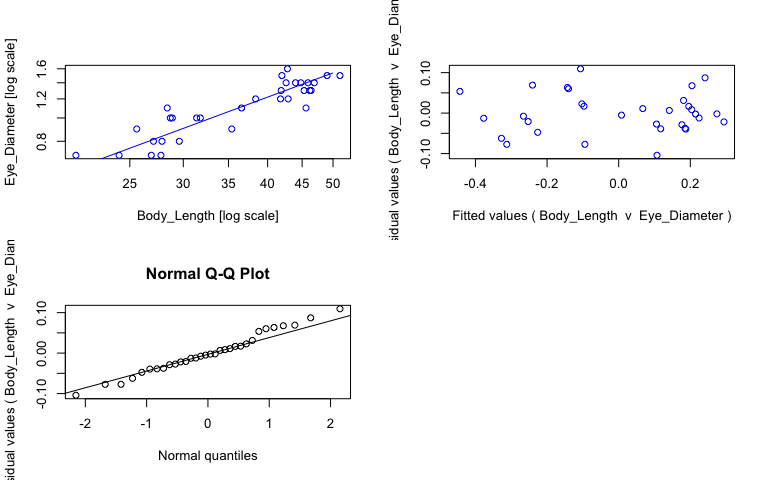<!-- -->

```r
#view fits
summary(sma_ctal)
```

```{style="max-height: 300px;"}
## Call: sma(formula = Eye_Diameter ~ Body_Length, data = ctal, log = "xy", 
##     method = "SMA", alpha = 0.05) 
## 
## Fit using Standardized Major Axis 
## 
## These variables were log-transformed before fitting: xy 
## 
## Confidence intervals (CI) are at 95%
## 
## ------------------------------------------------------------
## Coefficients:
##             elevation     slope
## estimate    -1.578063 1.0389917
## lower limit -1.840235 0.8845412
## upper limit -1.315891 1.2204109
## 
## H0 : variables uncorrelated
## R-squared : 0.8120894 
## P-value : 2.0471e-12
```

```r
#save coefficients of fits as object
cc_sma_ctal <- data.frame(coef(sma_ctal))

# Make plot ------
plot_ctal <- ggplot(ctal, aes(x = Body_Length, y = Eye_Diameter, col = Preservation)) + 
  geom_point(size = 2, alpha = 0.8) + 
  scale_color_manual(values = col_pres, name = "Sample state", breaks = c("ethanol", "fresh", "paraformaldehyde")) +
  scale_x_log10(name = "Body length (mm)") + #makes x axis log scale and named
  scale_y_log10(name = "Eye diameter (mm)") + #makes y axis log scale and named
  ggtitle("Challengerosergia talismani") + 
  theme_bw() +
  theme(panel.grid.major = element_blank(), panel.grid.minor = element_blank(), plot.title = element_text(face = "italic")) +
  geom_abline(data = cc_sma_ctal, aes(intercept = cc_sma_ctal[1,1], slope = cc_sma_ctal[2,1])) +
  geom_text(x = -Inf, y = Inf, hjust = -0.05, vjust = 1.5, nudge_x = 4, label = paste("b =", round(cc_sma_ctal[2,1], digits = 2), sep = " "), size = 3.5, col = "black") +
  geom_text(x = -Inf, y = Inf, hjust = -0.05, vjust = 3, label = paste("a =", round(cc_sma_ctal[1,1], digits = 2), sep = " "), size = 3.5, col = "black")

ggplotly(plot_ctal)
```

```{=html}
<div id="htmlwidget-ccd4c9be61b4554b7dfe" style="width:768px;height:480px;" class="plotly html-widget"></div>
<script type="application/json" data-for="htmlwidget-ccd4c9be61b4554b7dfe">{"x":{"data":[{"x":[1.31806333496276,1.38201704257487,1.4456042032736,1.47129171105894,1.40823996531185,1.45788189673399,1.50242711998443,1.56348108539441,1.63245729218472,1.66464197555613,1.6222140229663,1.65609820201283,1.66651798055488,1.67117284271508,1.65127801399814,1.66181268553726,1.64345267648619,1.69019608002851,1.6232492903979,1.70926996097583],"y":[-0.154901959985743,-0.154901959985743,-0.0969100130080564,-0.0969100130080564,-0.0457574905606751,0,0,0.0413926851582251,0.0791812460476248,0.113943352306837,0.113943352306837,0.113943352306837,0.113943352306837,0.146128035678238,0.146128035678238,0.146128035678238,0.146128035678238,0.176091259055681,0.176091259055681,0.176091259055681],"text":["Body_Length: 20.8<br />Eye_Diameter: 0.7<br />Preservation: ethanol","Body_Length: 24.1<br />Eye_Diameter: 0.7<br />Preservation: ethanol","Body_Length: 27.9<br />Eye_Diameter: 0.8<br />Preservation: ethanol","Body_Length: 29.6<br />Eye_Diameter: 0.8<br />Preservation: ethanol","Body_Length: 25.6<br />Eye_Diameter: 0.9<br />Preservation: ethanol","Body_Length: 28.7<br />Eye_Diameter: 1.0<br />Preservation: ethanol","Body_Length: 31.8<br />Eye_Diameter: 1.0<br />Preservation: ethanol","Body_Length: 36.6<br />Eye_Diameter: 1.1<br />Preservation: ethanol","Body_Length: 42.9<br />Eye_Diameter: 1.2<br />Preservation: ethanol","Body_Length: 46.2<br />Eye_Diameter: 1.3<br />Preservation: ethanol","Body_Length: 41.9<br />Eye_Diameter: 1.3<br />Preservation: ethanol","Body_Length: 45.3<br />Eye_Diameter: 1.3<br />Preservation: ethanol","Body_Length: 46.4<br />Eye_Diameter: 1.3<br />Preservation: ethanol","Body_Length: 46.9<br />Eye_Diameter: 1.4<br />Preservation: ethanol","Body_Length: 44.8<br />Eye_Diameter: 1.4<br />Preservation: ethanol","Body_Length: 45.9<br />Eye_Diameter: 1.4<br />Preservation: ethanol","Body_Length: 44.0<br />Eye_Diameter: 1.4<br />Preservation: ethanol","Body_Length: 49.0<br />Eye_Diameter: 1.5<br />Preservation: ethanol","Body_Length: 42.0<br />Eye_Diameter: 1.5<br />Preservation: ethanol","Body_Length: 51.2<br />Eye_Diameter: 1.5<br />Preservation: ethanol"],"type":"scatter","mode":"markers","marker":{"autocolorscale":false,"color":"rgba(166,206,227,1)","opacity":0.8,"size":7.55905511811024,"symbol":"circle","line":{"width":1.88976377952756,"color":"rgba(166,206,227,1)"}},"hoveron":"points","name":"ethanol","legendgroup":"ethanol","showlegend":true,"xaxis":"x","yaxis":"y","hoverinfo":"text","frame":null},{"x":[1.44404479591808,1.42975228000241,1.43296929087441,1.54900326202579,1.49692964807321,1.46089784275655,1.45331834004704,1.65896484266444,1.58433122436753,1.62117628177504,1.62940959910272],"y":[-0.154901959985743,-0.154901959985743,-0.0969100130080564,-0.0457574905606751,0,0,0.0413926851582251,0.0413926851582251,0.0791812460476248,0.0791812460476248,0.146128035678238],"text":["Body_Length: 27.8<br />Eye_Diameter: 0.7<br />Preservation: fresh","Body_Length: 26.9<br />Eye_Diameter: 0.7<br />Preservation: fresh","Body_Length: 27.1<br />Eye_Diameter: 0.8<br />Preservation: fresh","Body_Length: 35.4<br />Eye_Diameter: 0.9<br />Preservation: fresh","Body_Length: 31.4<br />Eye_Diameter: 1.0<br />Preservation: fresh","Body_Length: 28.9<br />Eye_Diameter: 1.0<br />Preservation: fresh","Body_Length: 28.4<br />Eye_Diameter: 1.1<br />Preservation: fresh","Body_Length: 45.6<br />Eye_Diameter: 1.1<br />Preservation: fresh","Body_Length: 38.4<br />Eye_Diameter: 1.2<br />Preservation: fresh","Body_Length: 41.8<br />Eye_Diameter: 1.2<br />Preservation: fresh","Body_Length: 42.6<br />Eye_Diameter: 1.4<br />Preservation: fresh"],"type":"scatter","mode":"markers","marker":{"autocolorscale":false,"color":"rgba(178,223,138,1)","opacity":0.8,"size":7.55905511811024,"symbol":"circle","line":{"width":1.88976377952756,"color":"rgba(178,223,138,1)"}},"hoveron":"points","name":"fresh","legendgroup":"fresh","showlegend":true,"xaxis":"x","yaxis":"y","hoverinfo":"text","frame":null},{"x":[1.63144376901317],"y":[0.204119982655925],"text":"Body_Length: 42.8<br />Eye_Diameter: 1.6<br />Preservation: paraformaldehyde","type":"scatter","mode":"markers","marker":{"autocolorscale":false,"color":"rgba(31,120,180,1)","opacity":0.8,"size":7.55905511811024,"symbol":"circle","line":{"width":1.88976377952756,"color":"rgba(31,120,180,1)"}},"hoveron":"points","name":"paraformaldehyde","legendgroup":"paraformaldehyde","showlegend":true,"xaxis":"x","yaxis":"y","hoverinfo":"text","frame":null},{"x":[1.29850300366211,1.29850300366211,1.72883029227648,1.72883029227648],"y":[-0.228929573632664,-0.228929573632664,0.218176904735162,0.218176904735162],"text":"cc_sma_ctal[1, 1]: -1.578063<br />cc_sma_ctal[2, 1]: 1.038992","type":"scatter","mode":"lines","line":{"width":1.88976377952756,"color":"rgba(0,0,0,1)","dash":"solid"},"hoveron":"points","showlegend":false,"xaxis":"x","yaxis":"y","hoverinfo":"text","frame":null},{"x":[null,null,null,null,null,null,null,null,null,null,null,null,null,null,null,null,null,null,null,null,null,null,null,null,null,null,null,null,null,null,null,null],"y":[null,null,null,null,null,null,null,null,null,null,null,null,null,null,null,null,null,null,null,null,null,null,null,null,null,null,null,null,null,null,null,null],"text":["b = 1.04","b = 1.04","b = 1.04","b = 1.04","b = 1.04","b = 1.04","b = 1.04","b = 1.04","b = 1.04","b = 1.04","b = 1.04","b = 1.04","b = 1.04","b = 1.04","b = 1.04","b = 1.04","b = 1.04","b = 1.04","b = 1.04","b = 1.04","b = 1.04","b = 1.04","b = 1.04","b = 1.04","b = 1.04","b = 1.04","b = 1.04","b = 1.04","b = 1.04","b = 1.04","b = 1.04","b = 1.04"],"hovertext":["Body_Length: -Inf<br />Eye_Diameter: Inf<br />Preservation: black","Body_Length: -Inf<br />Eye_Diameter: Inf<br />Preservation: black","Body_Length: -Inf<br />Eye_Diameter: Inf<br />Preservation: black","Body_Length: -Inf<br />Eye_Diameter: Inf<br />Preservation: black","Body_Length: -Inf<br />Eye_Diameter: Inf<br />Preservation: black","Body_Length: -Inf<br />Eye_Diameter: Inf<br />Preservation: black","Body_Length: -Inf<br />Eye_Diameter: Inf<br />Preservation: black","Body_Length: -Inf<br />Eye_Diameter: Inf<br />Preservation: black","Body_Length: -Inf<br />Eye_Diameter: Inf<br />Preservation: black","Body_Length: -Inf<br />Eye_Diameter: Inf<br />Preservation: black","Body_Length: -Inf<br />Eye_Diameter: Inf<br />Preservation: black","Body_Length: -Inf<br />Eye_Diameter: Inf<br />Preservation: black","Body_Length: -Inf<br />Eye_Diameter: Inf<br />Preservation: black","Body_Length: -Inf<br />Eye_Diameter: Inf<br />Preservation: black","Body_Length: -Inf<br />Eye_Diameter: Inf<br />Preservation: black","Body_Length: -Inf<br />Eye_Diameter: Inf<br />Preservation: black","Body_Length: -Inf<br />Eye_Diameter: Inf<br />Preservation: black","Body_Length: -Inf<br />Eye_Diameter: Inf<br />Preservation: black","Body_Length: -Inf<br />Eye_Diameter: Inf<br />Preservation: black","Body_Length: -Inf<br />Eye_Diameter: Inf<br />Preservation: black","Body_Length: -Inf<br />Eye_Diameter: Inf<br />Preservation: black","Body_Length: -Inf<br />Eye_Diameter: Inf<br />Preservation: black","Body_Length: -Inf<br />Eye_Diameter: Inf<br />Preservation: black","Body_Length: -Inf<br />Eye_Diameter: Inf<br />Preservation: black","Body_Length: -Inf<br />Eye_Diameter: Inf<br />Preservation: black","Body_Length: -Inf<br />Eye_Diameter: Inf<br />Preservation: black","Body_Length: -Inf<br />Eye_Diameter: Inf<br />Preservation: black","Body_Length: -Inf<br />Eye_Diameter: Inf<br />Preservation: black","Body_Length: -Inf<br />Eye_Diameter: Inf<br />Preservation: black","Body_Length: -Inf<br />Eye_Diameter: Inf<br />Preservation: black","Body_Length: -Inf<br />Eye_Diameter: Inf<br />Preservation: black","Body_Length: -Inf<br />Eye_Diameter: Inf<br />Preservation: black"],"textfont":{"size":13.2283464566929,"color":"rgba(0,0,0,1)"},"type":"scatter","mode":"text","hoveron":"points","showlegend":false,"xaxis":"x","yaxis":"y","hoverinfo":"text","frame":null},{"x":[null,null,null,null,null,null,null,null,null,null,null,null,null,null,null,null,null,null,null,null,null,null,null,null,null,null,null,null,null,null,null,null],"y":[null,null,null,null,null,null,null,null,null,null,null,null,null,null,null,null,null,null,null,null,null,null,null,null,null,null,null,null,null,null,null,null],"text":["a = -1.58","a = -1.58","a = -1.58","a = -1.58","a = -1.58","a = -1.58","a = -1.58","a = -1.58","a = -1.58","a = -1.58","a = -1.58","a = -1.58","a = -1.58","a = -1.58","a = -1.58","a = -1.58","a = -1.58","a = -1.58","a = -1.58","a = -1.58","a = -1.58","a = -1.58","a = -1.58","a = -1.58","a = -1.58","a = -1.58","a = -1.58","a = -1.58","a = -1.58","a = -1.58","a = -1.58","a = -1.58"],"hovertext":["Body_Length: -Inf<br />Eye_Diameter: Inf<br />Preservation: black","Body_Length: -Inf<br />Eye_Diameter: Inf<br />Preservation: black","Body_Length: -Inf<br />Eye_Diameter: Inf<br />Preservation: black","Body_Length: -Inf<br />Eye_Diameter: Inf<br />Preservation: black","Body_Length: -Inf<br />Eye_Diameter: Inf<br />Preservation: black","Body_Length: -Inf<br />Eye_Diameter: Inf<br />Preservation: black","Body_Length: -Inf<br />Eye_Diameter: Inf<br />Preservation: black","Body_Length: -Inf<br />Eye_Diameter: Inf<br />Preservation: black","Body_Length: -Inf<br />Eye_Diameter: Inf<br />Preservation: black","Body_Length: -Inf<br />Eye_Diameter: Inf<br />Preservation: black","Body_Length: -Inf<br />Eye_Diameter: Inf<br />Preservation: black","Body_Length: -Inf<br />Eye_Diameter: Inf<br />Preservation: black","Body_Length: -Inf<br />Eye_Diameter: Inf<br />Preservation: black","Body_Length: -Inf<br />Eye_Diameter: Inf<br />Preservation: black","Body_Length: -Inf<br />Eye_Diameter: Inf<br />Preservation: black","Body_Length: -Inf<br />Eye_Diameter: Inf<br />Preservation: black","Body_Length: -Inf<br />Eye_Diameter: Inf<br />Preservation: black","Body_Length: -Inf<br />Eye_Diameter: Inf<br />Preservation: black","Body_Length: -Inf<br />Eye_Diameter: Inf<br />Preservation: black","Body_Length: -Inf<br />Eye_Diameter: Inf<br />Preservation: black","Body_Length: -Inf<br />Eye_Diameter: Inf<br />Preservation: black","Body_Length: -Inf<br />Eye_Diameter: Inf<br />Preservation: black","Body_Length: -Inf<br />Eye_Diameter: Inf<br />Preservation: black","Body_Length: -Inf<br />Eye_Diameter: Inf<br />Preservation: black","Body_Length: -Inf<br />Eye_Diameter: Inf<br />Preservation: black","Body_Length: -Inf<br />Eye_Diameter: Inf<br />Preservation: black","Body_Length: -Inf<br />Eye_Diameter: Inf<br />Preservation: black","Body_Length: -Inf<br />Eye_Diameter: Inf<br />Preservation: black","Body_Length: -Inf<br />Eye_Diameter: Inf<br />Preservation: black","Body_Length: -Inf<br />Eye_Diameter: Inf<br />Preservation: black","Body_Length: -Inf<br />Eye_Diameter: Inf<br />Preservation: black","Body_Length: -Inf<br />Eye_Diameter: Inf<br />Preservation: black"],"textfont":{"size":13.2283464566929,"color":"rgba(0,0,0,1)"},"type":"scatter","mode":"text","hoveron":"points","showlegend":false,"xaxis":"x","yaxis":"y","hoverinfo":"text","frame":null}],"layout":{"margin":{"t":45.2237442922374,"r":7.30593607305936,"b":41.6438356164384,"l":43.1050228310502},"plot_bgcolor":"rgba(255,255,255,1)","paper_bgcolor":"rgba(255,255,255,1)","font":{"color":"rgba(0,0,0,1)","family":"","size":14.6118721461187},"title":{"text":"<i> Challengerosergia talismani <\/i>","font":{"color":"rgba(0,0,0,1)","family":"","size":17.5342465753425},"x":0,"xref":"paper"},"xaxis":{"domain":[0,1],"automargin":true,"type":"linear","autorange":false,"range":[1.29850300366211,1.72883029227648],"tickmode":"array","ticktext":["20","30","50"],"tickvals":[1.30102999566398,1.47712125471966,1.69897000433602],"categoryorder":"array","categoryarray":["20","30","50"],"nticks":null,"ticks":"outside","tickcolor":"rgba(51,51,51,1)","ticklen":3.65296803652968,"tickwidth":0.66417600664176,"showticklabels":true,"tickfont":{"color":"rgba(77,77,77,1)","family":"","size":11.689497716895},"tickangle":-0,"showline":false,"linecolor":null,"linewidth":0,"showgrid":false,"gridcolor":null,"gridwidth":0,"zeroline":false,"anchor":"y","title":{"text":"Body length (mm)","font":{"color":"rgba(0,0,0,1)","family":"","size":14.6118721461187}},"hoverformat":".2f"},"yaxis":{"domain":[0,1],"automargin":true,"type":"linear","autorange":false,"range":[-0.172853057117827,0.222071079788008],"tickmode":"array","ticktext":["0.7","0.8","1.0"],"tickvals":[-0.154901959985743,-0.0969100130080564,0],"categoryorder":"array","categoryarray":["0.7","0.8","1.0"],"nticks":null,"ticks":"outside","tickcolor":"rgba(51,51,51,1)","ticklen":3.65296803652968,"tickwidth":0.66417600664176,"showticklabels":true,"tickfont":{"color":"rgba(77,77,77,1)","family":"","size":11.689497716895},"tickangle":-0,"showline":false,"linecolor":null,"linewidth":0,"showgrid":false,"gridcolor":null,"gridwidth":0,"zeroline":false,"anchor":"x","title":{"text":"Eye diameter (mm)","font":{"color":"rgba(0,0,0,1)","family":"","size":14.6118721461187}},"hoverformat":".2f"},"shapes":[{"type":"rect","fillcolor":"transparent","line":{"color":"rgba(51,51,51,1)","width":0.66417600664176,"linetype":"solid"},"yref":"paper","xref":"paper","x0":0,"x1":1,"y0":0,"y1":1}],"showlegend":true,"legend":{"bgcolor":"rgba(255,255,255,1)","bordercolor":"transparent","borderwidth":1.88976377952756,"font":{"color":"rgba(0,0,0,1)","family":"","size":11.689497716895},"title":{"text":"Sample state","font":{"color":"rgba(0,0,0,1)","family":"","size":14.6118721461187}}},"hovermode":"closest","barmode":"relative"},"config":{"doubleClick":"reset","modeBarButtonsToAdd":["hoverclosest","hovercompare"],"showSendToCloud":false},"source":"A","attrs":{"201468b1901c":{"x":{},"y":{},"colour":{},"type":"scatter"},"2014616c53f6":{"intercept":{},"slope":{}},"2014efc6d72":{"x":{},"y":{},"colour":{}},"20145e755f0d":{"x":{},"y":{},"colour":{}}},"cur_data":"201468b1901c","visdat":{"201468b1901c":["function (y) ","x"],"2014616c53f6":["function (y) ","x"],"2014efc6d72":["function (y) ","x"],"20145e755f0d":["function (y) ","x"]},"highlight":{"on":"plotly_click","persistent":false,"dynamic":false,"selectize":false,"opacityDim":0.2,"selected":{"opacity":1},"debounce":0},"shinyEvents":["plotly_hover","plotly_click","plotly_selected","plotly_relayout","plotly_brushed","plotly_brushing","plotly_clickannotation","plotly_doubleclick","plotly_deselect","plotly_afterplot","plotly_sunburstclick"],"base_url":"https://plot.ly"},"evals":[],"jsHooks":[]}</script>
```

## _Deosergestes corniculum_


```r
# Subset data -----
dcor <- specimens %>% filter(genus_species == "Deosergestes_corniculum")

# Fit SMA model ------
sma_dcor <- sma(formula = Eye_Diameter ~ Body_Length, 
            data = dcor, 
            log = "xy", #sets both x and y variables as logged
            method="SMA", #defines SMA as model
            alpha = 0.05)

#plot fit, residuals, qq
par(mfrow = c(2,2)) #make plot window 2x2
plot(sma_dcor, which = "default",type = "o") 
plot(sma_dcor, which = "residual",type = "o")
plot(sma_dcor, which = "qq", type = "o")
par(mfrow = c(1,1)) 
```

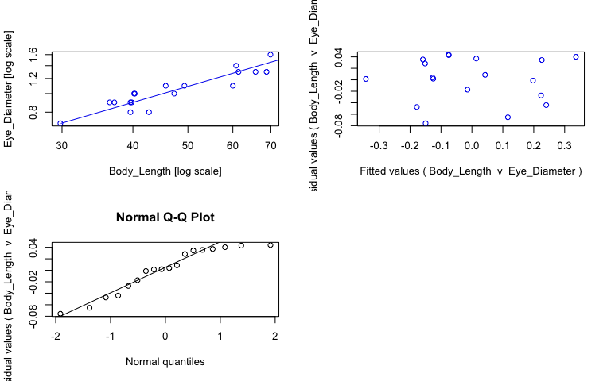<!-- -->

```r
#view fits
summary(sma_dcor)
```

```{style="max-height: 300px;"}
## Call: sma(formula = Eye_Diameter ~ Body_Length, data = dcor, log = "xy", 
##     method = "SMA", alpha = 0.05) 
## 
## Fit using Standardized Major Axis 
## 
## These variables were log-transformed before fitting: xy 
## 
## Confidence intervals (CI) are at 95%
## 
## ------------------------------------------------------------
## Coefficients:
##             elevation     slope
## estimate    -1.432046 0.8653057
## lower limit -1.737583 0.7020666
## upper limit -1.126509 1.0664999
## 
## H0 : variables uncorrelated
## R-squared : 0.8421211 
## P-value : 8.1768e-08
```

```r
#save coefficients of fits as object
cc_sma_dcor <- data.frame(coef(sma_dcor))

# Make plot ------
plot_dcor <- ggplot(dcor, aes(x = Body_Length, y = Eye_Diameter, col = Preservation)) + 
  geom_point(size = 2, alpha = 0.8) + 
  scale_color_manual(values = col_pres, name = "Sample state", breaks = c("ethanol", "fresh", "paraformaldehyde")) +
  scale_x_log10(name = "Body length (mm)") + #makes x axis log scale and named
  scale_y_log10(name = "Eye diameter (mm)") + #makes y axis log scale and named
  ggtitle("Deosergestes corniculum") + 
  theme_bw() +
  theme(panel.grid.major = element_blank(), panel.grid.minor = element_blank(), plot.title = element_text(face = "italic")) +
  geom_abline(data = cc_sma_dcor, aes(intercept = cc_sma_dcor[1,1], slope = cc_sma_dcor[2,1])) +
  geom_text(x = -Inf, y = Inf, hjust = -0.05, vjust = 1.5, nudge_x = 4, label = paste("b =", round(cc_sma_dcor[2,1], digits = 2), sep = " "), size = 3.5, col = "black") +
  geom_text(x = -Inf, y = Inf, hjust = -0.05, vjust = 3, label = paste("a =", round(cc_sma_dcor[1,1], digits = 2), sep = " "), size = 3.5, col = "black")

ggplotly(plot_dcor)
```

```{=html}
<div id="htmlwidget-b62da4f651673cca7c19" style="width:768px;height:480px;" class="plotly html-widget"></div>
<script type="application/json" data-for="htmlwidget-b62da4f651673cca7c19">{"x":{"data":[{"x":[1.47421626407626,1.63042787502502,1.59769518592551,1.59988307207369,1.56937390961505,1.59769518592551,1.56110138364906,1.67486114073781,1.60422605308447,1.60530504614111,1.77815125038364,1.81822589361396,1.78816837114117,1.83758843823551,1.78390357927273,1.84447717574568],"y":[-0.154901959985743,-0.0969100130080564,-0.0969100130080564,-0.0457574905606751,-0.0457574905606751,-0.0457574905606751,-0.0457574905606751,0,0,0,0.0413926851582251,0.113943352306837,0.113943352306837,0.113943352306837,0.146128035678238,0.204119982655925],"text":["Body_Length: 29.8<br />Eye_Diameter: 0.7<br />Preservation: ethanol","Body_Length: 42.7<br />Eye_Diameter: 0.8<br />Preservation: ethanol","Body_Length: 39.6<br />Eye_Diameter: 0.8<br />Preservation: ethanol","Body_Length: 39.8<br />Eye_Diameter: 0.9<br />Preservation: ethanol","Body_Length: 37.1<br />Eye_Diameter: 0.9<br />Preservation: ethanol","Body_Length: 39.6<br />Eye_Diameter: 0.9<br />Preservation: ethanol","Body_Length: 36.4<br />Eye_Diameter: 0.9<br />Preservation: ethanol","Body_Length: 47.3<br />Eye_Diameter: 1.0<br />Preservation: ethanol","Body_Length: 40.2<br />Eye_Diameter: 1.0<br />Preservation: ethanol","Body_Length: 40.3<br />Eye_Diameter: 1.0<br />Preservation: ethanol","Body_Length: 60.0<br />Eye_Diameter: 1.1<br />Preservation: ethanol","Body_Length: 65.8<br />Eye_Diameter: 1.3<br />Preservation: ethanol","Body_Length: 61.4<br />Eye_Diameter: 1.3<br />Preservation: ethanol","Body_Length: 68.8<br />Eye_Diameter: 1.3<br />Preservation: ethanol","Body_Length: 60.8<br />Eye_Diameter: 1.4<br />Preservation: ethanol","Body_Length: 69.9<br />Eye_Diameter: 1.6<br />Preservation: ethanol"],"type":"scatter","mode":"markers","marker":{"autocolorscale":false,"color":"rgba(166,206,227,1)","opacity":0.8,"size":7.55905511811024,"symbol":"circle","line":{"width":1.88976377952756,"color":"rgba(166,206,227,1)"}},"hoveron":"points","name":"ethanol","legendgroup":"ethanol","showlegend":true,"xaxis":"x","yaxis":"y","hoverinfo":"text","frame":null},{"x":[1.65991620006985,1.69284691927723],"y":[0.0413926851582251,0.0413926851582251],"text":["Body_Length: 45.7<br />Eye_Diameter: 1.1<br />Preservation: fresh","Body_Length: 49.3<br />Eye_Diameter: 1.1<br />Preservation: fresh"],"type":"scatter","mode":"markers","marker":{"autocolorscale":false,"color":"rgba(178,223,138,1)","opacity":0.8,"size":7.55905511811024,"symbol":"circle","line":{"width":1.88976377952756,"color":"rgba(178,223,138,1)"}},"hoveron":"points","name":"fresh","legendgroup":"fresh","showlegend":true,"xaxis":"x","yaxis":"y","hoverinfo":"text","frame":null},{"x":[1.45570321849278,1.45570321849278,1.86299022132915,1.86299022132915],"y":[-0.172417667699501,-0.172417667699501,0.180010089811954,0.180010089811954],"text":"cc_sma_dcor[1, 1]: -1.432046<br />cc_sma_dcor[2, 1]: 0.8653057","type":"scatter","mode":"lines","line":{"width":1.88976377952756,"color":"rgba(0,0,0,1)","dash":"solid"},"hoveron":"points","showlegend":false,"xaxis":"x","yaxis":"y","hoverinfo":"text","frame":null},{"x":[null,null,null,null,null,null,null,null,null,null,null,null,null,null,null,null,null,null],"y":[null,null,null,null,null,null,null,null,null,null,null,null,null,null,null,null,null,null],"text":["b = 0.87","b = 0.87","b = 0.87","b = 0.87","b = 0.87","b = 0.87","b = 0.87","b = 0.87","b = 0.87","b = 0.87","b = 0.87","b = 0.87","b = 0.87","b = 0.87","b = 0.87","b = 0.87","b = 0.87","b = 0.87"],"hovertext":["Body_Length: -Inf<br />Eye_Diameter: Inf<br />Preservation: black","Body_Length: -Inf<br />Eye_Diameter: Inf<br />Preservation: black","Body_Length: -Inf<br />Eye_Diameter: Inf<br />Preservation: black","Body_Length: -Inf<br />Eye_Diameter: Inf<br />Preservation: black","Body_Length: -Inf<br />Eye_Diameter: Inf<br />Preservation: black","Body_Length: -Inf<br />Eye_Diameter: Inf<br />Preservation: black","Body_Length: -Inf<br />Eye_Diameter: Inf<br />Preservation: black","Body_Length: -Inf<br />Eye_Diameter: Inf<br />Preservation: black","Body_Length: -Inf<br />Eye_Diameter: Inf<br />Preservation: black","Body_Length: -Inf<br />Eye_Diameter: Inf<br />Preservation: black","Body_Length: -Inf<br />Eye_Diameter: Inf<br />Preservation: black","Body_Length: -Inf<br />Eye_Diameter: Inf<br />Preservation: black","Body_Length: -Inf<br />Eye_Diameter: Inf<br />Preservation: black","Body_Length: -Inf<br />Eye_Diameter: Inf<br />Preservation: black","Body_Length: -Inf<br />Eye_Diameter: Inf<br />Preservation: black","Body_Length: -Inf<br />Eye_Diameter: Inf<br />Preservation: black","Body_Length: -Inf<br />Eye_Diameter: Inf<br />Preservation: black","Body_Length: -Inf<br />Eye_Diameter: Inf<br />Preservation: black"],"textfont":{"size":13.2283464566929,"color":"rgba(0,0,0,1)"},"type":"scatter","mode":"text","hoveron":"points","showlegend":false,"xaxis":"x","yaxis":"y","hoverinfo":"text","frame":null},{"x":[null,null,null,null,null,null,null,null,null,null,null,null,null,null,null,null,null,null],"y":[null,null,null,null,null,null,null,null,null,null,null,null,null,null,null,null,null,null],"text":["a = -1.43","a = -1.43","a = -1.43","a = -1.43","a = -1.43","a = -1.43","a = -1.43","a = -1.43","a = -1.43","a = -1.43","a = -1.43","a = -1.43","a = -1.43","a = -1.43","a = -1.43","a = -1.43","a = -1.43","a = -1.43"],"hovertext":["Body_Length: -Inf<br />Eye_Diameter: Inf<br />Preservation: black","Body_Length: -Inf<br />Eye_Diameter: Inf<br />Preservation: black","Body_Length: -Inf<br />Eye_Diameter: Inf<br />Preservation: black","Body_Length: -Inf<br />Eye_Diameter: Inf<br />Preservation: black","Body_Length: -Inf<br />Eye_Diameter: Inf<br />Preservation: black","Body_Length: -Inf<br />Eye_Diameter: Inf<br />Preservation: black","Body_Length: -Inf<br />Eye_Diameter: Inf<br />Preservation: black","Body_Length: -Inf<br />Eye_Diameter: Inf<br />Preservation: black","Body_Length: -Inf<br />Eye_Diameter: Inf<br />Preservation: black","Body_Length: -Inf<br />Eye_Diameter: Inf<br />Preservation: black","Body_Length: -Inf<br />Eye_Diameter: Inf<br />Preservation: black","Body_Length: -Inf<br />Eye_Diameter: Inf<br />Preservation: black","Body_Length: -Inf<br />Eye_Diameter: Inf<br />Preservation: black","Body_Length: -Inf<br />Eye_Diameter: Inf<br />Preservation: black","Body_Length: -Inf<br />Eye_Diameter: Inf<br />Preservation: black","Body_Length: -Inf<br />Eye_Diameter: Inf<br />Preservation: black","Body_Length: -Inf<br />Eye_Diameter: Inf<br />Preservation: black","Body_Length: -Inf<br />Eye_Diameter: Inf<br />Preservation: black"],"textfont":{"size":13.2283464566929,"color":"rgba(0,0,0,1)"},"type":"scatter","mode":"text","hoveron":"points","showlegend":false,"xaxis":"x","yaxis":"y","hoverinfo":"text","frame":null}],"layout":{"margin":{"t":45.2237442922374,"r":7.30593607305936,"b":41.6438356164384,"l":43.1050228310502},"plot_bgcolor":"rgba(255,255,255,1)","paper_bgcolor":"rgba(255,255,255,1)","font":{"color":"rgba(0,0,0,1)","family":"","size":14.6118721461187},"title":{"text":"<i> Deosergestes corniculum <\/i>","font":{"color":"rgba(0,0,0,1)","family":"","size":17.5342465753425},"x":0,"xref":"paper"},"xaxis":{"domain":[0,1],"automargin":true,"type":"linear","autorange":false,"range":[1.45570321849278,1.86299022132915],"tickmode":"array","ticktext":["30","50","70"],"tickvals":[1.47712125471966,1.69897000433602,1.84509804001426],"categoryorder":"array","categoryarray":["30","50","70"],"nticks":null,"ticks":"outside","tickcolor":"rgba(51,51,51,1)","ticklen":3.65296803652968,"tickwidth":0.66417600664176,"showticklabels":true,"tickfont":{"color":"rgba(77,77,77,1)","family":"","size":11.689497716895},"tickangle":-0,"showline":false,"linecolor":null,"linewidth":0,"showgrid":false,"gridcolor":null,"gridwidth":0,"zeroline":false,"anchor":"y","title":{"text":"Body length (mm)","font":{"color":"rgba(0,0,0,1)","family":"","size":14.6118721461187}},"hoverformat":".2f"},"yaxis":{"domain":[0,1],"automargin":true,"type":"linear","autorange":false,"range":[-0.172853057117827,0.222071079788008],"tickmode":"array","ticktext":["0.7","0.8","1.0"],"tickvals":[-0.154901959985743,-0.0969100130080564,0],"categoryorder":"array","categoryarray":["0.7","0.8","1.0"],"nticks":null,"ticks":"outside","tickcolor":"rgba(51,51,51,1)","ticklen":3.65296803652968,"tickwidth":0.66417600664176,"showticklabels":true,"tickfont":{"color":"rgba(77,77,77,1)","family":"","size":11.689497716895},"tickangle":-0,"showline":false,"linecolor":null,"linewidth":0,"showgrid":false,"gridcolor":null,"gridwidth":0,"zeroline":false,"anchor":"x","title":{"text":"Eye diameter (mm)","font":{"color":"rgba(0,0,0,1)","family":"","size":14.6118721461187}},"hoverformat":".2f"},"shapes":[{"type":"rect","fillcolor":"transparent","line":{"color":"rgba(51,51,51,1)","width":0.66417600664176,"linetype":"solid"},"yref":"paper","xref":"paper","x0":0,"x1":1,"y0":0,"y1":1}],"showlegend":true,"legend":{"bgcolor":"rgba(255,255,255,1)","bordercolor":"transparent","borderwidth":1.88976377952756,"font":{"color":"rgba(0,0,0,1)","family":"","size":11.689497716895},"title":{"text":"Sample state","font":{"color":"rgba(0,0,0,1)","family":"","size":14.6118721461187}}},"hovermode":"closest","barmode":"relative"},"config":{"doubleClick":"reset","modeBarButtonsToAdd":["hoverclosest","hovercompare"],"showSendToCloud":false},"source":"A","attrs":{"20147b74036b":{"x":{},"y":{},"colour":{},"type":"scatter"},"20147d8ca51e":{"intercept":{},"slope":{}},"20141cac94f7":{"x":{},"y":{},"colour":{}},"2014667f2d6":{"x":{},"y":{},"colour":{}}},"cur_data":"20147b74036b","visdat":{"20147b74036b":["function (y) ","x"],"20147d8ca51e":["function (y) ","x"],"20141cac94f7":["function (y) ","x"],"2014667f2d6":["function (y) ","x"]},"highlight":{"on":"plotly_click","persistent":false,"dynamic":false,"selectize":false,"opacityDim":0.2,"selected":{"opacity":1},"debounce":0},"shinyEvents":["plotly_hover","plotly_click","plotly_selected","plotly_relayout","plotly_brushed","plotly_brushing","plotly_clickannotation","plotly_doubleclick","plotly_deselect","plotly_afterplot","plotly_sunburstclick"],"base_url":"https://plot.ly"},"evals":[],"jsHooks":[]}</script>
```

## _Deosergestes henseni_


```r
# Subset data -----
dhen <- specimens %>% filter(genus_species == "Deosergestes_henseni")

# Fit SMA model ------
sma_dhen <- sma(formula = Eye_Diameter ~ Body_Length, 
            data = dhen, 
            log = "xy", #sets both x and y variables as logged
            method="SMA", #defines SMA as model
            alpha = 0.05)

#plot fit, residuals, qq
par(mfrow = c(2,2)) #make plot window 2x2
plot(sma_dhen, which = "default",type = "o") 
plot(sma_dhen, which = "residual",type = "o")
plot(sma_dhen, which = "qq", type = "o")
par(mfrow = c(1,1)) 
```

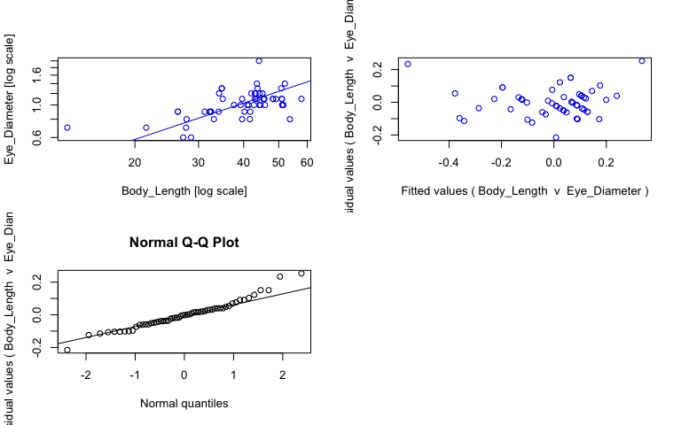<!-- -->

```r
#view fits
summary(sma_dhen)
```

```{style="max-height: 300px;"}
## Call: sma(formula = Eye_Diameter ~ Body_Length, data = dhen, log = "xy", 
##     method = "SMA", alpha = 0.05) 
## 
## Fit using Standardized Major Axis 
## 
## These variables were log-transformed before fitting: xy 
## 
## Confidence intervals (CI) are at 95%
## 
## ------------------------------------------------------------
## Coefficients:
##             elevation     slope
## estimate    -1.306994 0.8238705
## lower limit -1.593941 0.6637531
## upper limit -1.020047 1.0226131
## 
## H0 : variables uncorrelated
## R-squared : 0.3380975 
## P-value : 1.6982e-06
```

```r
#save coefficients of fits as object
cc_sma_dhen <- data.frame(coef(sma_dhen))

# Make plot ------
plot_dhen <- ggplot(dhen, aes(x = Body_Length, y = Eye_Diameter, col = Preservation)) + 
  geom_point(size = 2, alpha = 0.8) + 
  scale_color_manual(values = col_pres, name = "Sample state", breaks = c("ethanol", "fresh", "paraformaldehyde")) +
  scale_x_log10(name = "Body length (mm)") + #makes x axis log scale and named
  scale_y_log10(name = "Eye diameter (mm)") + #makes y axis log scale and named
  ggtitle("Deosergestes henseni") + 
  theme_bw() +
  theme(panel.grid.major = element_blank(), panel.grid.minor = element_blank(), plot.title = element_text(face = "italic")) +
  geom_abline(data = cc_sma_dhen, aes(intercept = cc_sma_dhen[1,1], slope = cc_sma_dhen[2,1])) +
  geom_text(x = -Inf, y = Inf, hjust = -0.05, vjust = 1.5, nudge_x = 4, label = paste("b =", round(cc_sma_dhen[2,1], digits = 2), sep = " "), size = 3.5, col = "black") +
  geom_text(x = -Inf, y = Inf, hjust = -0.05, vjust = 3, label = paste("a =", round(cc_sma_dhen[1,1], digits = 2), sep = " "), size = 3.5, col = "black")

ggplotly(plot_dhen)
```

```{=html}
<div id="htmlwidget-70e2e75f9ae25076d8b3" style="width:768px;height:480px;" class="plotly html-widget"></div>
<script type="application/json" data-for="htmlwidget-70e2e75f9ae25076d8b3">{"x":{"data":[{"x":[1.4345689040342,1.45636603312904,1.59769518592551,1.49415459401844,1.71011736511182,1.57518784492766,1.66086547800387,1.63346845557959,1.54406804435028,1.53402610605614],"y":[-0.221848749616356,-0.221848749616356,-0.0969100130080564,-0.0457574905606751,0,0,0,0.0413926851582251,0.0413926851582251,0.0791812460476248],"text":["Body_Length: 27.2<br />Eye_Diameter: 0.6<br />Preservation: ethanol","Body_Length: 28.6<br />Eye_Diameter: 0.6<br />Preservation: ethanol","Body_Length: 39.6<br />Eye_Diameter: 0.8<br />Preservation: ethanol","Body_Length: 31.2<br />Eye_Diameter: 0.9<br />Preservation: ethanol","Body_Length: 51.3<br />Eye_Diameter: 1.0<br />Preservation: ethanol","Body_Length: 37.6<br />Eye_Diameter: 1.0<br />Preservation: ethanol","Body_Length: 45.8<br />Eye_Diameter: 1.0<br />Preservation: ethanol","Body_Length: 43.0<br />Eye_Diameter: 1.1<br />Preservation: ethanol","Body_Length: 35.0<br />Eye_Diameter: 1.1<br />Preservation: ethanol","Body_Length: 34.2<br />Eye_Diameter: 1.2<br />Preservation: ethanol"],"type":"scatter","mode":"markers","marker":{"autocolorscale":false,"color":"rgba(166,206,227,1)","opacity":0.8,"size":7.55905511811024,"symbol":"circle","line":{"width":1.88976377952756,"color":"rgba(166,206,227,1)"}},"hoveron":"points","name":"ethanol","legendgroup":"ethanol","showlegend":true,"xaxis":"x","yaxis":"y","hoverinfo":"text","frame":null},{"x":[1.44247976906445,1.11394335230684,1.33243845991561,1.72997428569956,1.51982799377572,1.44404479591808,1.61909333062674,1.41995574848976,1.41995574848976,1.51054501020661,1.50785587169583,1.51188336097887,1.5327543789925,1.60422605308447,1.62013605497376,1.71180722904119,1.63042787502502,1.59328606702046,1.6159500516564,1.70842090013471,1.61172330800734,1.64542226934909,1.64836001098093,1.63447727016073,1.69196510276736,1.76192783842053,1.63948648926859,1.6570558528571,1.68304703823885,1.68304703823885,1.70757017609794,1.70757017609794,1.59769518592551,1.65896484266444,1.65896484266444,1.63346845557959,1.63447727016073,1.65417654187796,1.64640372622307,1.6232492903979,1.63346845557959,1.64048143697042,1.70586371228392,1.54157924394658,1.54157924394658,1.7160033436348,1.63848925695464,1.64443858946784],"y":[-0.154901959985743,-0.154901959985743,-0.154901959985743,-0.0969100130080564,-0.0969100130080564,-0.0969100130080564,-0.0969100130080564,-0.0457574905606751,-0.0457574905606751,-0.0457574905606751,-0.0457574905606751,-0.0457574905606751,-0.0457574905606751,-0.0457574905606751,-0.0457574905606751,0,0,0,0,0,0,0,0,0.0413926851582251,0.0413926851582251,0.0413926851582251,0.0413926851582251,0.0413926851582251,0.0413926851582251,0.0413926851582251,0.0413926851582251,0.0413926851582251,0.0413926851582251,0.0413926851582251,0.0413926851582251,0.0791812460476248,0.0791812460476248,0.0791812460476248,0.0791812460476248,0.0791812460476248,0.0791812460476248,0.113943352306837,0.113943352306837,0.113943352306837,0.113943352306837,0.146128035678238,0.146128035678238,0.301029995663981],"text":["Body_Length: 27.7<br />Eye_Diameter: 0.7<br />Preservation: fresh","Body_Length: 13.0<br />Eye_Diameter: 0.7<br />Preservation: fresh","Body_Length: 21.5<br />Eye_Diameter: 0.7<br />Preservation: fresh","Body_Length: 53.7<br />Eye_Diameter: 0.8<br />Preservation: fresh","Body_Length: 33.1<br />Eye_Diameter: 0.8<br />Preservation: fresh","Body_Length: 27.8<br />Eye_Diameter: 0.8<br />Preservation: fresh","Body_Length: 41.6<br />Eye_Diameter: 0.8<br />Preservation: fresh","Body_Length: 26.3<br />Eye_Diameter: 0.9<br />Preservation: fresh","Body_Length: 26.3<br />Eye_Diameter: 0.9<br />Preservation: fresh","Body_Length: 32.4<br />Eye_Diameter: 0.9<br />Preservation: fresh","Body_Length: 32.2<br />Eye_Diameter: 0.9<br />Preservation: fresh","Body_Length: 32.5<br />Eye_Diameter: 0.9<br />Preservation: fresh","Body_Length: 34.1<br />Eye_Diameter: 0.9<br />Preservation: fresh","Body_Length: 40.2<br />Eye_Diameter: 0.9<br />Preservation: fresh","Body_Length: 41.7<br />Eye_Diameter: 0.9<br />Preservation: fresh","Body_Length: 51.5<br />Eye_Diameter: 1.0<br />Preservation: fresh","Body_Length: 42.7<br />Eye_Diameter: 1.0<br />Preservation: fresh","Body_Length: 39.2<br />Eye_Diameter: 1.0<br />Preservation: fresh","Body_Length: 41.3<br />Eye_Diameter: 1.0<br />Preservation: fresh","Body_Length: 51.1<br />Eye_Diameter: 1.0<br />Preservation: fresh","Body_Length: 40.9<br />Eye_Diameter: 1.0<br />Preservation: fresh","Body_Length: 44.2<br />Eye_Diameter: 1.0<br />Preservation: fresh","Body_Length: 44.5<br />Eye_Diameter: 1.0<br />Preservation: fresh","Body_Length: 43.1<br />Eye_Diameter: 1.1<br />Preservation: fresh","Body_Length: 49.2<br />Eye_Diameter: 1.1<br />Preservation: fresh","Body_Length: 57.8<br />Eye_Diameter: 1.1<br />Preservation: fresh","Body_Length: 43.6<br />Eye_Diameter: 1.1<br />Preservation: fresh","Body_Length: 45.4<br />Eye_Diameter: 1.1<br />Preservation: fresh","Body_Length: 48.2<br />Eye_Diameter: 1.1<br />Preservation: fresh","Body_Length: 48.2<br />Eye_Diameter: 1.1<br />Preservation: fresh","Body_Length: 51.0<br />Eye_Diameter: 1.1<br />Preservation: fresh","Body_Length: 51.0<br />Eye_Diameter: 1.1<br />Preservation: fresh","Body_Length: 39.6<br />Eye_Diameter: 1.1<br />Preservation: fresh","Body_Length: 45.6<br />Eye_Diameter: 1.1<br />Preservation: fresh","Body_Length: 45.6<br />Eye_Diameter: 1.1<br />Preservation: fresh","Body_Length: 43.0<br />Eye_Diameter: 1.2<br />Preservation: fresh","Body_Length: 43.1<br />Eye_Diameter: 1.2<br />Preservation: fresh","Body_Length: 45.1<br />Eye_Diameter: 1.2<br />Preservation: fresh","Body_Length: 44.3<br />Eye_Diameter: 1.2<br />Preservation: fresh","Body_Length: 42.0<br />Eye_Diameter: 1.2<br />Preservation: fresh","Body_Length: 43.0<br />Eye_Diameter: 1.2<br />Preservation: fresh","Body_Length: 43.7<br />Eye_Diameter: 1.3<br />Preservation: fresh","Body_Length: 50.8<br />Eye_Diameter: 1.3<br />Preservation: fresh","Body_Length: 34.8<br />Eye_Diameter: 1.3<br />Preservation: fresh","Body_Length: 34.8<br />Eye_Diameter: 1.3<br />Preservation: fresh","Body_Length: 52.0<br />Eye_Diameter: 1.4<br />Preservation: fresh","Body_Length: 43.5<br />Eye_Diameter: 1.4<br />Preservation: fresh","Body_Length: 44.1<br />Eye_Diameter: 2.0<br />Preservation: fresh"],"type":"scatter","mode":"markers","marker":{"autocolorscale":false,"color":"rgba(178,223,138,1)","opacity":0.8,"size":7.55905511811024,"symbol":"circle","line":{"width":1.88976377952756,"color":"rgba(178,223,138,1)"}},"hoveron":"points","name":"fresh","legendgroup":"fresh","showlegend":true,"xaxis":"x","yaxis":"y","hoverinfo":"text","frame":null},{"x":[1.08154412800115,1.08154412800115,1.79432706272621,1.79432706272621],"y":[-0.415941607078785,-0.415941607078785,0.171299243542469,0.171299243542469],"text":"cc_sma_dhen[1, 1]: -1.306994<br />cc_sma_dhen[2, 1]: 0.8238705","type":"scatter","mode":"lines","line":{"width":1.88976377952756,"color":"rgba(0,0,0,1)","dash":"solid"},"hoveron":"points","showlegend":false,"xaxis":"x","yaxis":"y","hoverinfo":"text","frame":null},{"x":[null,null,null,null,null,null,null,null,null,null,null,null,null,null,null,null,null,null,null,null,null,null,null,null,null,null,null,null,null,null,null,null,null,null,null,null,null,null,null,null,null,null,null,null,null,null,null,null,null,null,null,null,null,null,null,null,null,null],"y":[null,null,null,null,null,null,null,null,null,null,null,null,null,null,null,null,null,null,null,null,null,null,null,null,null,null,null,null,null,null,null,null,null,null,null,null,null,null,null,null,null,null,null,null,null,null,null,null,null,null,null,null,null,null,null,null,null,null],"text":["b = 0.82","b = 0.82","b = 0.82","b = 0.82","b = 0.82","b = 0.82","b = 0.82","b = 0.82","b = 0.82","b = 0.82","b = 0.82","b = 0.82","b = 0.82","b = 0.82","b = 0.82","b = 0.82","b = 0.82","b = 0.82","b = 0.82","b = 0.82","b = 0.82","b = 0.82","b = 0.82","b = 0.82","b = 0.82","b = 0.82","b = 0.82","b = 0.82","b = 0.82","b = 0.82","b = 0.82","b = 0.82","b = 0.82","b = 0.82","b = 0.82","b = 0.82","b = 0.82","b = 0.82","b = 0.82","b = 0.82","b = 0.82","b = 0.82","b = 0.82","b = 0.82","b = 0.82","b = 0.82","b = 0.82","b = 0.82","b = 0.82","b = 0.82","b = 0.82","b = 0.82","b = 0.82","b = 0.82","b = 0.82","b = 0.82","b = 0.82","b = 0.82"],"hovertext":["Body_Length: -Inf<br />Eye_Diameter: Inf<br />Preservation: black","Body_Length: -Inf<br />Eye_Diameter: Inf<br />Preservation: black","Body_Length: -Inf<br />Eye_Diameter: Inf<br />Preservation: black","Body_Length: -Inf<br />Eye_Diameter: Inf<br />Preservation: black","Body_Length: -Inf<br />Eye_Diameter: Inf<br />Preservation: black","Body_Length: -Inf<br />Eye_Diameter: Inf<br />Preservation: black","Body_Length: -Inf<br />Eye_Diameter: Inf<br />Preservation: black","Body_Length: -Inf<br />Eye_Diameter: Inf<br />Preservation: black","Body_Length: -Inf<br />Eye_Diameter: Inf<br />Preservation: black","Body_Length: -Inf<br />Eye_Diameter: Inf<br />Preservation: black","Body_Length: -Inf<br />Eye_Diameter: Inf<br />Preservation: black","Body_Length: -Inf<br />Eye_Diameter: Inf<br />Preservation: black","Body_Length: -Inf<br />Eye_Diameter: Inf<br />Preservation: black","Body_Length: -Inf<br />Eye_Diameter: Inf<br />Preservation: black","Body_Length: -Inf<br />Eye_Diameter: Inf<br />Preservation: black","Body_Length: -Inf<br />Eye_Diameter: Inf<br />Preservation: black","Body_Length: -Inf<br />Eye_Diameter: Inf<br />Preservation: black","Body_Length: -Inf<br />Eye_Diameter: Inf<br />Preservation: black","Body_Length: -Inf<br />Eye_Diameter: Inf<br />Preservation: black","Body_Length: -Inf<br />Eye_Diameter: Inf<br />Preservation: black","Body_Length: -Inf<br />Eye_Diameter: Inf<br />Preservation: black","Body_Length: -Inf<br />Eye_Diameter: Inf<br />Preservation: black","Body_Length: -Inf<br />Eye_Diameter: Inf<br />Preservation: black","Body_Length: -Inf<br />Eye_Diameter: Inf<br />Preservation: black","Body_Length: -Inf<br />Eye_Diameter: Inf<br />Preservation: black","Body_Length: -Inf<br />Eye_Diameter: Inf<br />Preservation: black","Body_Length: -Inf<br />Eye_Diameter: Inf<br />Preservation: black","Body_Length: -Inf<br />Eye_Diameter: Inf<br />Preservation: black","Body_Length: -Inf<br />Eye_Diameter: Inf<br />Preservation: black","Body_Length: -Inf<br />Eye_Diameter: Inf<br />Preservation: black","Body_Length: -Inf<br />Eye_Diameter: Inf<br />Preservation: black","Body_Length: -Inf<br />Eye_Diameter: Inf<br />Preservation: black","Body_Length: -Inf<br />Eye_Diameter: Inf<br />Preservation: black","Body_Length: -Inf<br />Eye_Diameter: Inf<br />Preservation: black","Body_Length: -Inf<br />Eye_Diameter: Inf<br />Preservation: black","Body_Length: -Inf<br />Eye_Diameter: Inf<br />Preservation: black","Body_Length: -Inf<br />Eye_Diameter: Inf<br />Preservation: black","Body_Length: -Inf<br />Eye_Diameter: Inf<br />Preservation: black","Body_Length: -Inf<br />Eye_Diameter: Inf<br />Preservation: black","Body_Length: -Inf<br />Eye_Diameter: Inf<br />Preservation: black","Body_Length: -Inf<br />Eye_Diameter: Inf<br />Preservation: black","Body_Length: -Inf<br />Eye_Diameter: Inf<br />Preservation: black","Body_Length: -Inf<br />Eye_Diameter: Inf<br />Preservation: black","Body_Length: -Inf<br />Eye_Diameter: Inf<br />Preservation: black","Body_Length: -Inf<br />Eye_Diameter: Inf<br />Preservation: black","Body_Length: -Inf<br />Eye_Diameter: Inf<br />Preservation: black","Body_Length: -Inf<br />Eye_Diameter: Inf<br />Preservation: black","Body_Length: -Inf<br />Eye_Diameter: Inf<br />Preservation: black","Body_Length: -Inf<br />Eye_Diameter: Inf<br />Preservation: black","Body_Length: -Inf<br />Eye_Diameter: Inf<br />Preservation: black","Body_Length: -Inf<br />Eye_Diameter: Inf<br />Preservation: black","Body_Length: -Inf<br />Eye_Diameter: Inf<br />Preservation: black","Body_Length: -Inf<br />Eye_Diameter: Inf<br />Preservation: black","Body_Length: -Inf<br />Eye_Diameter: Inf<br />Preservation: black","Body_Length: -Inf<br />Eye_Diameter: Inf<br />Preservation: black","Body_Length: -Inf<br />Eye_Diameter: Inf<br />Preservation: black","Body_Length: -Inf<br />Eye_Diameter: Inf<br />Preservation: black","Body_Length: -Inf<br />Eye_Diameter: Inf<br />Preservation: black"],"textfont":{"size":13.2283464566929,"color":"rgba(0,0,0,1)"},"type":"scatter","mode":"text","hoveron":"points","showlegend":false,"xaxis":"x","yaxis":"y","hoverinfo":"text","frame":null},{"x":[null,null,null,null,null,null,null,null,null,null,null,null,null,null,null,null,null,null,null,null,null,null,null,null,null,null,null,null,null,null,null,null,null,null,null,null,null,null,null,null,null,null,null,null,null,null,null,null,null,null,null,null,null,null,null,null,null,null],"y":[null,null,null,null,null,null,null,null,null,null,null,null,null,null,null,null,null,null,null,null,null,null,null,null,null,null,null,null,null,null,null,null,null,null,null,null,null,null,null,null,null,null,null,null,null,null,null,null,null,null,null,null,null,null,null,null,null,null],"text":["a = -1.31","a = -1.31","a = -1.31","a = -1.31","a = -1.31","a = -1.31","a = -1.31","a = -1.31","a = -1.31","a = -1.31","a = -1.31","a = -1.31","a = -1.31","a = -1.31","a = -1.31","a = -1.31","a = -1.31","a = -1.31","a = -1.31","a = -1.31","a = -1.31","a = -1.31","a = -1.31","a = -1.31","a = -1.31","a = -1.31","a = -1.31","a = -1.31","a = -1.31","a = -1.31","a = -1.31","a = -1.31","a = -1.31","a = -1.31","a = -1.31","a = -1.31","a = -1.31","a = -1.31","a = -1.31","a = -1.31","a = -1.31","a = -1.31","a = -1.31","a = -1.31","a = -1.31","a = -1.31","a = -1.31","a = -1.31","a = -1.31","a = -1.31","a = -1.31","a = -1.31","a = -1.31","a = -1.31","a = -1.31","a = -1.31","a = -1.31","a = -1.31"],"hovertext":["Body_Length: -Inf<br />Eye_Diameter: Inf<br />Preservation: black","Body_Length: -Inf<br />Eye_Diameter: Inf<br />Preservation: black","Body_Length: -Inf<br />Eye_Diameter: Inf<br />Preservation: black","Body_Length: -Inf<br />Eye_Diameter: Inf<br />Preservation: black","Body_Length: -Inf<br />Eye_Diameter: Inf<br />Preservation: black","Body_Length: -Inf<br />Eye_Diameter: Inf<br />Preservation: black","Body_Length: -Inf<br />Eye_Diameter: Inf<br />Preservation: black","Body_Length: -Inf<br />Eye_Diameter: Inf<br />Preservation: black","Body_Length: -Inf<br />Eye_Diameter: Inf<br />Preservation: black","Body_Length: -Inf<br />Eye_Diameter: Inf<br />Preservation: black","Body_Length: -Inf<br />Eye_Diameter: Inf<br />Preservation: black","Body_Length: -Inf<br />Eye_Diameter: Inf<br />Preservation: black","Body_Length: -Inf<br />Eye_Diameter: Inf<br />Preservation: black","Body_Length: -Inf<br />Eye_Diameter: Inf<br />Preservation: black","Body_Length: -Inf<br />Eye_Diameter: Inf<br />Preservation: black","Body_Length: -Inf<br />Eye_Diameter: Inf<br />Preservation: black","Body_Length: -Inf<br />Eye_Diameter: Inf<br />Preservation: black","Body_Length: -Inf<br />Eye_Diameter: Inf<br />Preservation: black","Body_Length: -Inf<br />Eye_Diameter: Inf<br />Preservation: black","Body_Length: -Inf<br />Eye_Diameter: Inf<br />Preservation: black","Body_Length: -Inf<br />Eye_Diameter: Inf<br />Preservation: black","Body_Length: -Inf<br />Eye_Diameter: Inf<br />Preservation: black","Body_Length: -Inf<br />Eye_Diameter: Inf<br />Preservation: black","Body_Length: -Inf<br />Eye_Diameter: Inf<br />Preservation: black","Body_Length: -Inf<br />Eye_Diameter: Inf<br />Preservation: black","Body_Length: -Inf<br />Eye_Diameter: Inf<br />Preservation: black","Body_Length: -Inf<br />Eye_Diameter: Inf<br />Preservation: black","Body_Length: -Inf<br />Eye_Diameter: Inf<br />Preservation: black","Body_Length: -Inf<br />Eye_Diameter: Inf<br />Preservation: black","Body_Length: -Inf<br />Eye_Diameter: Inf<br />Preservation: black","Body_Length: -Inf<br />Eye_Diameter: Inf<br />Preservation: black","Body_Length: -Inf<br />Eye_Diameter: Inf<br />Preservation: black","Body_Length: -Inf<br />Eye_Diameter: Inf<br />Preservation: black","Body_Length: -Inf<br />Eye_Diameter: Inf<br />Preservation: black","Body_Length: -Inf<br />Eye_Diameter: Inf<br />Preservation: black","Body_Length: -Inf<br />Eye_Diameter: Inf<br />Preservation: black","Body_Length: -Inf<br />Eye_Diameter: Inf<br />Preservation: black","Body_Length: -Inf<br />Eye_Diameter: Inf<br />Preservation: black","Body_Length: -Inf<br />Eye_Diameter: Inf<br />Preservation: black","Body_Length: -Inf<br />Eye_Diameter: Inf<br />Preservation: black","Body_Length: -Inf<br />Eye_Diameter: Inf<br />Preservation: black","Body_Length: -Inf<br />Eye_Diameter: Inf<br />Preservation: black","Body_Length: -Inf<br />Eye_Diameter: Inf<br />Preservation: black","Body_Length: -Inf<br />Eye_Diameter: Inf<br />Preservation: black","Body_Length: -Inf<br />Eye_Diameter: Inf<br />Preservation: black","Body_Length: -Inf<br />Eye_Diameter: Inf<br />Preservation: black","Body_Length: -Inf<br />Eye_Diameter: Inf<br />Preservation: black","Body_Length: -Inf<br />Eye_Diameter: Inf<br />Preservation: black","Body_Length: -Inf<br />Eye_Diameter: Inf<br />Preservation: black","Body_Length: -Inf<br />Eye_Diameter: Inf<br />Preservation: black","Body_Length: -Inf<br />Eye_Diameter: Inf<br />Preservation: black","Body_Length: -Inf<br />Eye_Diameter: Inf<br />Preservation: black","Body_Length: -Inf<br />Eye_Diameter: Inf<br />Preservation: black","Body_Length: -Inf<br />Eye_Diameter: Inf<br />Preservation: black","Body_Length: -Inf<br />Eye_Diameter: Inf<br />Preservation: black","Body_Length: -Inf<br />Eye_Diameter: Inf<br />Preservation: black","Body_Length: -Inf<br />Eye_Diameter: Inf<br />Preservation: black","Body_Length: -Inf<br />Eye_Diameter: Inf<br />Preservation: black"],"textfont":{"size":13.2283464566929,"color":"rgba(0,0,0,1)"},"type":"scatter","mode":"text","hoveron":"points","showlegend":false,"xaxis":"x","yaxis":"y","hoverinfo":"text","frame":null}],"layout":{"margin":{"t":45.2237442922374,"r":7.30593607305936,"b":41.6438356164384,"l":43.1050228310502},"plot_bgcolor":"rgba(255,255,255,1)","paper_bgcolor":"rgba(255,255,255,1)","font":{"color":"rgba(0,0,0,1)","family":"","size":14.6118721461187},"title":{"text":"<i> Deosergestes henseni <\/i>","font":{"color":"rgba(0,0,0,1)","family":"","size":17.5342465753425},"x":0,"xref":"paper"},"xaxis":{"domain":[0,1],"automargin":true,"type":"linear","autorange":false,"range":[1.08154412800115,1.79432706272621],"tickmode":"array","ticktext":["20","30","50"],"tickvals":[1.30102999566398,1.47712125471966,1.69897000433602],"categoryorder":"array","categoryarray":["20","30","50"],"nticks":null,"ticks":"outside","tickcolor":"rgba(51,51,51,1)","ticklen":3.65296803652968,"tickwidth":0.66417600664176,"showticklabels":true,"tickfont":{"color":"rgba(77,77,77,1)","family":"","size":11.689497716895},"tickangle":-0,"showline":false,"linecolor":null,"linewidth":0,"showgrid":false,"gridcolor":null,"gridwidth":0,"zeroline":false,"anchor":"y","title":{"text":"Body length (mm)","font":{"color":"rgba(0,0,0,1)","family":"","size":14.6118721461187}},"hoverformat":".2f"},"yaxis":{"domain":[0,1],"automargin":true,"type":"linear","autorange":false,"range":[-0.247992686880373,0.327173932927998],"tickmode":"array","ticktext":["0.7","1.0","2.0"],"tickvals":[-0.154901959985743,0,0.301029995663981],"categoryorder":"array","categoryarray":["0.7","1.0","2.0"],"nticks":null,"ticks":"outside","tickcolor":"rgba(51,51,51,1)","ticklen":3.65296803652968,"tickwidth":0.66417600664176,"showticklabels":true,"tickfont":{"color":"rgba(77,77,77,1)","family":"","size":11.689497716895},"tickangle":-0,"showline":false,"linecolor":null,"linewidth":0,"showgrid":false,"gridcolor":null,"gridwidth":0,"zeroline":false,"anchor":"x","title":{"text":"Eye diameter (mm)","font":{"color":"rgba(0,0,0,1)","family":"","size":14.6118721461187}},"hoverformat":".2f"},"shapes":[{"type":"rect","fillcolor":"transparent","line":{"color":"rgba(51,51,51,1)","width":0.66417600664176,"linetype":"solid"},"yref":"paper","xref":"paper","x0":0,"x1":1,"y0":0,"y1":1}],"showlegend":true,"legend":{"bgcolor":"rgba(255,255,255,1)","bordercolor":"transparent","borderwidth":1.88976377952756,"font":{"color":"rgba(0,0,0,1)","family":"","size":11.689497716895},"title":{"text":"Sample state","font":{"color":"rgba(0,0,0,1)","family":"","size":14.6118721461187}}},"hovermode":"closest","barmode":"relative"},"config":{"doubleClick":"reset","modeBarButtonsToAdd":["hoverclosest","hovercompare"],"showSendToCloud":false},"source":"A","attrs":{"201452e2bf27":{"x":{},"y":{},"colour":{},"type":"scatter"},"20142473c3f4":{"intercept":{},"slope":{}},"20142c45dade":{"x":{},"y":{},"colour":{}},"20141e243b87":{"x":{},"y":{},"colour":{}}},"cur_data":"201452e2bf27","visdat":{"201452e2bf27":["function (y) ","x"],"20142473c3f4":["function (y) ","x"],"20142c45dade":["function (y) ","x"],"20141e243b87":["function (y) ","x"]},"highlight":{"on":"plotly_click","persistent":false,"dynamic":false,"selectize":false,"opacityDim":0.2,"selected":{"opacity":1},"debounce":0},"shinyEvents":["plotly_hover","plotly_click","plotly_selected","plotly_relayout","plotly_brushed","plotly_brushing","plotly_clickannotation","plotly_doubleclick","plotly_deselect","plotly_afterplot","plotly_sunburstclick"],"base_url":"https://plot.ly"},"evals":[],"jsHooks":[]}</script>
```

## _Eusergestes arcticus_ 


```r
# Subset data -----
euar <- specimens %>% filter(genus_species == "Eusergestes_arcticus")

# Fit SMA model ------
sma_euar <- sma(formula = Eye_Diameter ~ Body_Length, 
            data = euar, 
            log = "xy", #sets both x and y variables as logged
            method="SMA", #defines SMA as model
            alpha = 0.05)

#plot fit, residuals, qq
par(mfrow = c(2,2)) #make plot window 2x2
plot(sma_euar, which = "default",type = "o") 
plot(sma_euar, which = "residual",type = "o")
plot(sma_euar, which = "qq", type = "o")
par(mfrow = c(1,1)) 
```

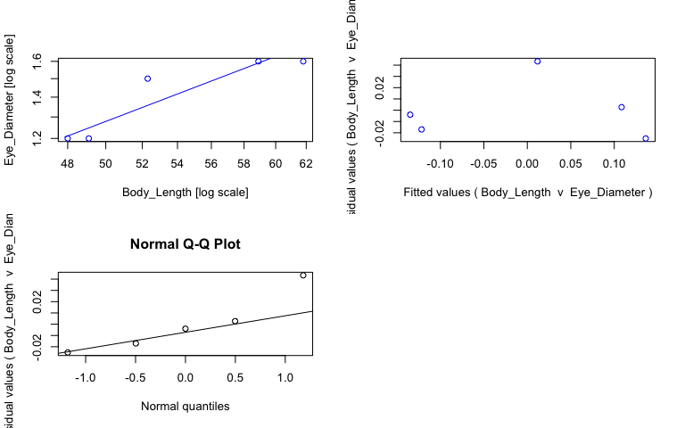<!-- -->

```r
#view fits
summary(sma_euar)
```

```{style="max-height: 300px;"}
## Call: sma(formula = Eye_Diameter ~ Body_Length, data = euar, log = "xy", 
##     method = "SMA", alpha = 0.05) 
## 
## Fit using Standardized Major Axis 
## 
## These variables were log-transformed before fitting: xy 
## 
## Confidence intervals (CI) are at 95%
## 
## ------------------------------------------------------------
## Coefficients:
##              elevation     slope
## estimate    -2.1539322 1.3306114
## lower limit -3.8635100 0.6694485
## upper limit -0.4443543 2.6447543
## 
## H0 : variables uncorrelated
## R-squared : 0.8368056 
## P-value : 0.029484
```

```r
#save coefficients of fits as object
cc_sma_euar <- data.frame(coef(sma_euar))

# Make plot ------
plot_euar <- ggplot(euar, aes(x = Body_Length, y = Eye_Diameter, col = Preservation)) + 
  geom_point(size = 2, alpha = 0.8) + 
  scale_color_manual(values = col_pres, name = "Sample state", breaks = c("ethanol", "fresh", "paraformaldehyde")) +
  scale_x_log10(name = "Body length (mm)") + #makes x axis log scale and named
  scale_y_log10(name = "Eye diameter (mm)") + #makes y axis log scale and named
  ggtitle("Eusergestes arcticus") + 
  theme_bw() +
  theme(panel.grid.major = element_blank(), panel.grid.minor = element_blank(), plot.title = element_text(face = "italic")) +
  geom_abline(data = cc_sma_euar, aes(intercept = cc_sma_euar[1,1], slope = cc_sma_euar[2,1])) +
  geom_text(x = -Inf, y = Inf, hjust = -0.05, vjust = 1.5, nudge_x = 4, label = paste("b =", round(cc_sma_euar[2,1], digits = 2), sep = " "), size = 3.5, col = "black") +
  geom_text(x = -Inf, y = Inf, hjust = -0.05, vjust = 3, label = paste("a =", round(cc_sma_euar[1,1], digits = 2), sep = " "), size = 3.5, col = "black")

ggplotly(plot_euar)
```

```{=html}
<div id="htmlwidget-4f8023caccec3d9a6f7c" style="width:768px;height:480px;" class="plotly html-widget"></div>
<script type="application/json" data-for="htmlwidget-4f8023caccec3d9a6f7c">{"x":{"data":[{"x":[1.68124123737559,1.69108149212297,1.7701152947871,1.71850168886727,1.79098847508882],"y":[0.0791812460476248,0.0791812460476248,0.204119982655925,0.176091259055681,0.204119982655925],"text":["Body_Length: 48.0<br />Eye_Diameter: 1.2<br />Preservation: ethanol","Body_Length: 49.1<br />Eye_Diameter: 1.2<br />Preservation: ethanol","Body_Length: 58.9<br />Eye_Diameter: 1.6<br />Preservation: ethanol","Body_Length: 52.3<br />Eye_Diameter: 1.5<br />Preservation: ethanol","Body_Length: 61.8<br />Eye_Diameter: 1.6<br />Preservation: ethanol"],"type":"scatter","mode":"markers","marker":{"autocolorscale":false,"color":"rgba(166,206,227,1)","opacity":0.8,"size":7.55905511811024,"symbol":"circle","line":{"width":1.88976377952756,"color":"rgba(166,206,227,1)"}},"hoveron":"points","name":"ethanol","legendgroup":"ethanol","showlegend":true,"xaxis":"x","yaxis":"y","hoverinfo":"text","frame":null},{"x":[1.67575387548993,1.67575387548993,1.79647583697448,1.79647583697448],"y":[0.0758450953681282,0.0758450953681282,0.236479118840703,0.236479118840703],"text":"cc_sma_euar[1, 1]: -2.153932<br />cc_sma_euar[2, 1]: 1.330611","type":"scatter","mode":"lines","line":{"width":1.88976377952756,"color":"rgba(0,0,0,1)","dash":"solid"},"hoveron":"points","showlegend":false,"xaxis":"x","yaxis":"y","hoverinfo":"text","frame":null},{"x":[null,null,null,null,null],"y":[null,null,null,null,null],"text":["b = 1.33","b = 1.33","b = 1.33","b = 1.33","b = 1.33"],"hovertext":["Body_Length: -Inf<br />Eye_Diameter: Inf<br />Preservation: black","Body_Length: -Inf<br />Eye_Diameter: Inf<br />Preservation: black","Body_Length: -Inf<br />Eye_Diameter: Inf<br />Preservation: black","Body_Length: -Inf<br />Eye_Diameter: Inf<br />Preservation: black","Body_Length: -Inf<br />Eye_Diameter: Inf<br />Preservation: black"],"textfont":{"size":13.2283464566929,"color":"rgba(0,0,0,1)"},"type":"scatter","mode":"text","hoveron":"points","showlegend":false,"xaxis":"x","yaxis":"y","hoverinfo":"text","frame":null},{"x":[null,null,null,null,null],"y":[null,null,null,null,null],"text":["a = -2.15","a = -2.15","a = -2.15","a = -2.15","a = -2.15"],"hovertext":["Body_Length: -Inf<br />Eye_Diameter: Inf<br />Preservation: black","Body_Length: -Inf<br />Eye_Diameter: Inf<br />Preservation: black","Body_Length: -Inf<br />Eye_Diameter: Inf<br />Preservation: black","Body_Length: -Inf<br />Eye_Diameter: Inf<br />Preservation: black","Body_Length: -Inf<br />Eye_Diameter: Inf<br />Preservation: black"],"textfont":{"size":13.2283464566929,"color":"rgba(0,0,0,1)"},"type":"scatter","mode":"text","hoveron":"points","showlegend":false,"xaxis":"x","yaxis":"y","hoverinfo":"text","frame":null}],"layout":{"margin":{"t":45.2237442922374,"r":7.30593607305936,"b":41.6438356164384,"l":43.1050228310502},"plot_bgcolor":"rgba(255,255,255,1)","paper_bgcolor":"rgba(255,255,255,1)","font":{"color":"rgba(0,0,0,1)","family":"","size":14.6118721461187},"title":{"text":"<i> Eusergestes arcticus <\/i>","font":{"color":"rgba(0,0,0,1)","family":"","size":17.5342465753425},"x":0,"xref":"paper"},"xaxis":{"domain":[0,1],"automargin":true,"type":"linear","autorange":false,"range":[1.67575387548993,1.79647583697448],"tickmode":"array","ticktext":["48","52","56","60"],"tickvals":[1.68124123737559,1.7160033436348,1.7481880270062,1.77815125038364],"categoryorder":"array","categoryarray":["48","52","56","60"],"nticks":null,"ticks":"outside","tickcolor":"rgba(51,51,51,1)","ticklen":3.65296803652968,"tickwidth":0.66417600664176,"showticklabels":true,"tickfont":{"color":"rgba(77,77,77,1)","family":"","size":11.689497716895},"tickangle":-0,"showline":false,"linecolor":null,"linewidth":0,"showgrid":false,"gridcolor":null,"gridwidth":0,"zeroline":false,"anchor":"y","title":{"text":"Body length (mm)","font":{"color":"rgba(0,0,0,1)","family":"","size":14.6118721461187}},"hoverformat":".2f"},"yaxis":{"domain":[0,1],"automargin":true,"type":"linear","autorange":false,"range":[0.0729343092172098,0.21036691948634],"tickmode":"array","ticktext":["1.2","1.3","1.4","1.5","1.6"],"tickvals":[0.0791812460476249,0.113943352306837,0.146128035678238,0.176091259055681,0.204119982655925],"categoryorder":"array","categoryarray":["1.2","1.3","1.4","1.5","1.6"],"nticks":null,"ticks":"outside","tickcolor":"rgba(51,51,51,1)","ticklen":3.65296803652968,"tickwidth":0.66417600664176,"showticklabels":true,"tickfont":{"color":"rgba(77,77,77,1)","family":"","size":11.689497716895},"tickangle":-0,"showline":false,"linecolor":null,"linewidth":0,"showgrid":false,"gridcolor":null,"gridwidth":0,"zeroline":false,"anchor":"x","title":{"text":"Eye diameter (mm)","font":{"color":"rgba(0,0,0,1)","family":"","size":14.6118721461187}},"hoverformat":".2f"},"shapes":[{"type":"rect","fillcolor":"transparent","line":{"color":"rgba(51,51,51,1)","width":0.66417600664176,"linetype":"solid"},"yref":"paper","xref":"paper","x0":0,"x1":1,"y0":0,"y1":1}],"showlegend":true,"legend":{"bgcolor":"rgba(255,255,255,1)","bordercolor":"transparent","borderwidth":1.88976377952756,"font":{"color":"rgba(0,0,0,1)","family":"","size":11.689497716895},"title":{"text":"Sample state","font":{"color":"rgba(0,0,0,1)","family":"","size":14.6118721461187}}},"hovermode":"closest","barmode":"relative"},"config":{"doubleClick":"reset","modeBarButtonsToAdd":["hoverclosest","hovercompare"],"showSendToCloud":false},"source":"A","attrs":{"20145ca51dbf":{"x":{},"y":{},"colour":{},"type":"scatter"},"20145c44161d":{"intercept":{},"slope":{}},"20147a07f93d":{"x":{},"y":{},"colour":{}},"2014217c5262":{"x":{},"y":{},"colour":{}}},"cur_data":"20145ca51dbf","visdat":{"20145ca51dbf":["function (y) ","x"],"20145c44161d":["function (y) ","x"],"20147a07f93d":["function (y) ","x"],"2014217c5262":["function (y) ","x"]},"highlight":{"on":"plotly_click","persistent":false,"dynamic":false,"selectize":false,"opacityDim":0.2,"selected":{"opacity":1},"debounce":0},"shinyEvents":["plotly_hover","plotly_click","plotly_selected","plotly_relayout","plotly_brushed","plotly_brushing","plotly_clickannotation","plotly_doubleclick","plotly_deselect","plotly_afterplot","plotly_sunburstclick"],"base_url":"https://plot.ly"},"evals":[],"jsHooks":[]}</script>
```

## _Gardinerosergia splendens_

Note: this species has a big outlier that was removed for analyses and plots (eye 1.7, body 22.0). 


```r
# Subset data -----
gspl <- specimens %>% 
  filter(genus_species == "Gardinerosergia_splendens") %>%
  filter(!(Eye_Diameter == round(1.71, 1) & Body_Length == round(21.98,1)))

# Fit SMA model ------
sma_gspl <- sma(formula = Eye_Diameter ~ Body_Length, 
            data = gspl, 
            log = "xy", #sets both x and y variables as logged
            method="SMA", #defines SMA as model
            alpha = 0.05)

#plot fit, residuals, qq
par(mfrow = c(2,2)) #make plot window 2x2
plot(sma_gspl, which = "default",type = "o") 
plot(sma_gspl, which = "residual",type = "o")
plot(sma_gspl, which = "qq", type = "o")
par(mfrow = c(1,1)) 
```

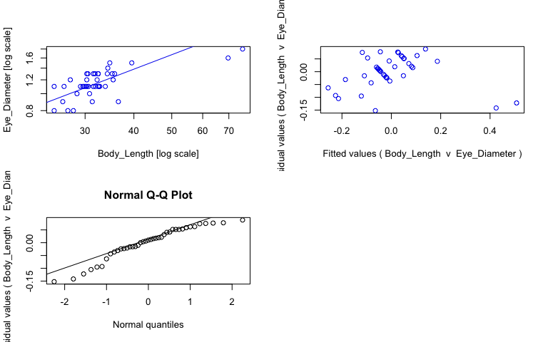<!-- -->

```r
#view fits
summary(sma_gspl)
```

```{style="max-height: 300px;"}
## Call: sma(formula = Eye_Diameter ~ Body_Length, data = gspl, log = "xy", 
##     method = "SMA", alpha = 0.05) 
## 
## Fit using Standardized Major Axis 
## 
## These variables were log-transformed before fitting: xy 
## 
## Confidence intervals (CI) are at 95%
## 
## ------------------------------------------------------------
## Coefficients:
##              elevation     slope
## estimate    -1.2253950 0.8523703
## lower limit -1.5326713 0.6732695
## upper limit -0.9181186 1.0791149
## 
## H0 : variables uncorrelated
## R-squared : 0.4597308 
## P-value : 1.1132e-06
```

```r
#save coefficients of fits as object
cc_sma_gspl <- data.frame(coef(sma_gspl))

# Make plot ------
plot_gspl <- ggplot(gspl, aes(x = Body_Length, y = Eye_Diameter, col = Preservation)) + 
  geom_point(size = 2, alpha = 0.8) + 
  scale_color_manual(values = col_pres, name = "Sample state", breaks = c("ethanol", "fresh", "paraformaldehyde")) +
  scale_x_log10(name = "Body length (mm)") + #makes x axis log scale and named
  scale_y_log10(name = "Eye diameter (mm)") + #makes y axis log scale and named
  ggtitle("Gardinerosergia splendens") + 
  theme_bw() +
  theme(panel.grid.major = element_blank(), panel.grid.minor = element_blank(), plot.title = element_text(face = "italic")) +
  geom_abline(data = cc_sma_gspl, aes(intercept = cc_sma_gspl[1,1], slope = cc_sma_gspl[2,1])) +
  geom_text(x = -Inf, y = Inf, hjust = -0.05, vjust = 1.5, nudge_x = 4, label = paste("b =", round(cc_sma_gspl[2,1], digits = 2), sep = " "), size = 3.5, col = "black") +
  geom_text(x = -Inf, y = Inf, hjust = -0.05, vjust = 3, label = paste("a =", round(cc_sma_gspl[1,1], digits = 2), sep = " "), size = 3.5, col = "black")

#plot with outlier shown
plot_gspl_out <- plot_gspl +
  geom_point(aes(y=round(1.71,1), x=round(21.98,1)), colour="red", pch = 18) +
  ggtitle("Gardinerosergia splendens + outlier")
  
#plot
ggplotly(plot_gspl)
```

```{=html}
<div id="htmlwidget-11160c2109e3a60bd155" style="width:768px;height:480px;" class="plotly html-widget"></div>
<script type="application/json" data-for="htmlwidget-11160c2109e3a60bd155">{"x":{"data":[{"x":[1.44715803134222,1.49554433754645,1.48855071650044,1.4983105537896,1.51321760006794,1.51054501020661,1.54900326202579,1.84323277809801,1.88024177589548],"y":[-0.0969100130080564,-0.0457574905606751,0,0.0413926851582251,0.0413926851582251,0.0413926851582251,0.0791812460476248,0.204119982655925,0.255272505103306],"text":["Body_Length: 28.0<br />Eye_Diameter: 0.8<br />Preservation: ethanol","Body_Length: 31.3<br />Eye_Diameter: 0.9<br />Preservation: ethanol","Body_Length: 30.8<br />Eye_Diameter: 1.0<br />Preservation: ethanol","Body_Length: 31.5<br />Eye_Diameter: 1.1<br />Preservation: ethanol","Body_Length: 32.6<br />Eye_Diameter: 1.1<br />Preservation: ethanol","Body_Length: 32.4<br />Eye_Diameter: 1.1<br />Preservation: ethanol","Body_Length: 35.4<br />Eye_Diameter: 1.2<br />Preservation: ethanol","Body_Length: 69.7<br />Eye_Diameter: 1.6<br />Preservation: ethanol","Body_Length: 75.9<br />Eye_Diameter: 1.8<br />Preservation: ethanol"],"type":"scatter","mode":"markers","marker":{"autocolorscale":false,"color":"rgba(166,206,227,1)","opacity":0.8,"size":7.55905511811024,"symbol":"circle","line":{"width":1.88976377952756,"color":"rgba(166,206,227,1)"}},"hoveron":"points","name":"ethanol","legendgroup":"ethanol","showlegend":true,"xaxis":"x","yaxis":"y","hoverinfo":"text","frame":null},{"x":[1.43296929087441,1.39794000867204,1.56229286445647,1.41995574848976,1.45636603312904,1.46538285144842,1.47856649559384,1.48144262850231,1.52891670027765,1.42324587393681,1.50379068305718,1.48572142648158,1.51454775266029,1.39794000867204,1.47129171105894,1.47421626407626,1.43933269383026,1.50785587169583,1.48144262850231,1.48429983934679,1.50242711998443,1.4983105537896,1.53402610605614,1.51054501020661,1.55266821611219,1.51054501020661,1.48144262850231,1.54654266347813,1.51054501020661,1.53529412004277,1.59659709562646,1.54032947479087],"y":[-0.0969100130080564,-0.0969100130080564,-0.0457574905606751,-0.0457574905606751,0,0.0413926851582251,0.0413926851582251,0.0413926851582251,0.0413926851582251,0.0413926851582251,0.0413926851582251,0.0413926851582251,0.0413926851582251,0.0413926851582251,0.0413926851582251,0.0413926851582251,0.0791812460476248,0.0791812460476248,0.0791812460476248,0.113943352306837,0.113943352306837,0.113943352306837,0.113943352306837,0.113943352306837,0.113943352306837,0.113943352306837,0.113943352306837,0.113943352306837,0.113943352306837,0.146128035678238,0.176091259055681,0.176091259055681],"text":["Body_Length: 27.1<br />Eye_Diameter: 0.8<br />Preservation: fresh","Body_Length: 25.0<br />Eye_Diameter: 0.8<br />Preservation: fresh","Body_Length: 36.5<br />Eye_Diameter: 0.9<br />Preservation: fresh","Body_Length: 26.3<br />Eye_Diameter: 0.9<br />Preservation: fresh","Body_Length: 28.6<br />Eye_Diameter: 1.0<br />Preservation: fresh","Body_Length: 29.2<br />Eye_Diameter: 1.1<br />Preservation: fresh","Body_Length: 30.1<br />Eye_Diameter: 1.1<br />Preservation: fresh","Body_Length: 30.3<br />Eye_Diameter: 1.1<br />Preservation: fresh","Body_Length: 33.8<br />Eye_Diameter: 1.1<br />Preservation: fresh","Body_Length: 26.5<br />Eye_Diameter: 1.1<br />Preservation: fresh","Body_Length: 31.9<br />Eye_Diameter: 1.1<br />Preservation: fresh","Body_Length: 30.6<br />Eye_Diameter: 1.1<br />Preservation: fresh","Body_Length: 32.7<br />Eye_Diameter: 1.1<br />Preservation: fresh","Body_Length: 25.0<br />Eye_Diameter: 1.1<br />Preservation: fresh","Body_Length: 29.6<br />Eye_Diameter: 1.1<br />Preservation: fresh","Body_Length: 29.8<br />Eye_Diameter: 1.1<br />Preservation: fresh","Body_Length: 27.5<br />Eye_Diameter: 1.2<br />Preservation: fresh","Body_Length: 32.2<br />Eye_Diameter: 1.2<br />Preservation: fresh","Body_Length: 30.3<br />Eye_Diameter: 1.2<br />Preservation: fresh","Body_Length: 30.5<br />Eye_Diameter: 1.3<br />Preservation: fresh","Body_Length: 31.8<br />Eye_Diameter: 1.3<br />Preservation: fresh","Body_Length: 31.5<br />Eye_Diameter: 1.3<br />Preservation: fresh","Body_Length: 34.2<br />Eye_Diameter: 1.3<br />Preservation: fresh","Body_Length: 32.4<br />Eye_Diameter: 1.3<br />Preservation: fresh","Body_Length: 35.7<br />Eye_Diameter: 1.3<br />Preservation: fresh","Body_Length: 32.4<br />Eye_Diameter: 1.3<br />Preservation: fresh","Body_Length: 30.3<br />Eye_Diameter: 1.3<br />Preservation: fresh","Body_Length: 35.2<br />Eye_Diameter: 1.3<br />Preservation: fresh","Body_Length: 32.4<br />Eye_Diameter: 1.3<br />Preservation: fresh","Body_Length: 34.3<br />Eye_Diameter: 1.4<br />Preservation: fresh","Body_Length: 39.5<br />Eye_Diameter: 1.5<br />Preservation: fresh","Body_Length: 34.7<br />Eye_Diameter: 1.5<br />Preservation: fresh"],"type":"scatter","mode":"markers","marker":{"autocolorscale":false,"color":"rgba(178,223,138,1)","opacity":0.8,"size":7.55905511811024,"symbol":"circle","line":{"width":1.88976377952756,"color":"rgba(178,223,138,1)"}},"hoveron":"points","name":"fresh","legendgroup":"fresh","showlegend":true,"xaxis":"x","yaxis":"y","hoverinfo":"text","frame":null},{"x":[1.37382492031087,1.37382492031087,1.90435686425665,1.90435686425665],"y":[-0.0543874345156297,-0.0543874345156297,0.397822225197447,0.397822225197447],"text":"cc_sma_gspl[1, 1]: -1.225395<br />cc_sma_gspl[2, 1]: 0.8523703","type":"scatter","mode":"lines","line":{"width":1.88976377952756,"color":"rgba(0,0,0,1)","dash":"solid"},"hoveron":"points","showlegend":false,"xaxis":"x","yaxis":"y","hoverinfo":"text","frame":null},{"x":[null,null,null,null,null,null,null,null,null,null,null,null,null,null,null,null,null,null,null,null,null,null,null,null,null,null,null,null,null,null,null,null,null,null,null,null,null,null,null,null,null],"y":[null,null,null,null,null,null,null,null,null,null,null,null,null,null,null,null,null,null,null,null,null,null,null,null,null,null,null,null,null,null,null,null,null,null,null,null,null,null,null,null,null],"text":["b = 0.85","b = 0.85","b = 0.85","b = 0.85","b = 0.85","b = 0.85","b = 0.85","b = 0.85","b = 0.85","b = 0.85","b = 0.85","b = 0.85","b = 0.85","b = 0.85","b = 0.85","b = 0.85","b = 0.85","b = 0.85","b = 0.85","b = 0.85","b = 0.85","b = 0.85","b = 0.85","b = 0.85","b = 0.85","b = 0.85","b = 0.85","b = 0.85","b = 0.85","b = 0.85","b = 0.85","b = 0.85","b = 0.85","b = 0.85","b = 0.85","b = 0.85","b = 0.85","b = 0.85","b = 0.85","b = 0.85","b = 0.85"],"hovertext":["Body_Length: -Inf<br />Eye_Diameter: Inf<br />Preservation: black","Body_Length: -Inf<br />Eye_Diameter: Inf<br />Preservation: black","Body_Length: -Inf<br />Eye_Diameter: Inf<br />Preservation: black","Body_Length: -Inf<br />Eye_Diameter: Inf<br />Preservation: black","Body_Length: -Inf<br />Eye_Diameter: Inf<br />Preservation: black","Body_Length: -Inf<br />Eye_Diameter: Inf<br />Preservation: black","Body_Length: -Inf<br />Eye_Diameter: Inf<br />Preservation: black","Body_Length: -Inf<br />Eye_Diameter: Inf<br />Preservation: black","Body_Length: -Inf<br />Eye_Diameter: Inf<br />Preservation: black","Body_Length: -Inf<br />Eye_Diameter: Inf<br />Preservation: black","Body_Length: -Inf<br />Eye_Diameter: Inf<br />Preservation: black","Body_Length: -Inf<br />Eye_Diameter: Inf<br />Preservation: black","Body_Length: -Inf<br />Eye_Diameter: Inf<br />Preservation: black","Body_Length: -Inf<br />Eye_Diameter: Inf<br />Preservation: black","Body_Length: -Inf<br />Eye_Diameter: Inf<br />Preservation: black","Body_Length: -Inf<br />Eye_Diameter: Inf<br />Preservation: black","Body_Length: -Inf<br />Eye_Diameter: Inf<br />Preservation: black","Body_Length: -Inf<br />Eye_Diameter: Inf<br />Preservation: black","Body_Length: -Inf<br />Eye_Diameter: Inf<br />Preservation: black","Body_Length: -Inf<br />Eye_Diameter: Inf<br />Preservation: black","Body_Length: -Inf<br />Eye_Diameter: Inf<br />Preservation: black","Body_Length: -Inf<br />Eye_Diameter: Inf<br />Preservation: black","Body_Length: -Inf<br />Eye_Diameter: Inf<br />Preservation: black","Body_Length: -Inf<br />Eye_Diameter: Inf<br />Preservation: black","Body_Length: -Inf<br />Eye_Diameter: Inf<br />Preservation: black","Body_Length: -Inf<br />Eye_Diameter: Inf<br />Preservation: black","Body_Length: -Inf<br />Eye_Diameter: Inf<br />Preservation: black","Body_Length: -Inf<br />Eye_Diameter: Inf<br />Preservation: black","Body_Length: -Inf<br />Eye_Diameter: Inf<br />Preservation: black","Body_Length: -Inf<br />Eye_Diameter: Inf<br />Preservation: black","Body_Length: -Inf<br />Eye_Diameter: Inf<br />Preservation: black","Body_Length: -Inf<br />Eye_Diameter: Inf<br />Preservation: black","Body_Length: -Inf<br />Eye_Diameter: Inf<br />Preservation: black","Body_Length: -Inf<br />Eye_Diameter: Inf<br />Preservation: black","Body_Length: -Inf<br />Eye_Diameter: Inf<br />Preservation: black","Body_Length: -Inf<br />Eye_Diameter: Inf<br />Preservation: black","Body_Length: -Inf<br />Eye_Diameter: Inf<br />Preservation: black","Body_Length: -Inf<br />Eye_Diameter: Inf<br />Preservation: black","Body_Length: -Inf<br />Eye_Diameter: Inf<br />Preservation: black","Body_Length: -Inf<br />Eye_Diameter: Inf<br />Preservation: black","Body_Length: -Inf<br />Eye_Diameter: Inf<br />Preservation: black"],"textfont":{"size":13.2283464566929,"color":"rgba(0,0,0,1)"},"type":"scatter","mode":"text","hoveron":"points","showlegend":false,"xaxis":"x","yaxis":"y","hoverinfo":"text","frame":null},{"x":[null,null,null,null,null,null,null,null,null,null,null,null,null,null,null,null,null,null,null,null,null,null,null,null,null,null,null,null,null,null,null,null,null,null,null,null,null,null,null,null,null],"y":[null,null,null,null,null,null,null,null,null,null,null,null,null,null,null,null,null,null,null,null,null,null,null,null,null,null,null,null,null,null,null,null,null,null,null,null,null,null,null,null,null],"text":["a = -1.23","a = -1.23","a = -1.23","a = -1.23","a = -1.23","a = -1.23","a = -1.23","a = -1.23","a = -1.23","a = -1.23","a = -1.23","a = -1.23","a = -1.23","a = -1.23","a = -1.23","a = -1.23","a = -1.23","a = -1.23","a = -1.23","a = -1.23","a = -1.23","a = -1.23","a = -1.23","a = -1.23","a = -1.23","a = -1.23","a = -1.23","a = -1.23","a = -1.23","a = -1.23","a = -1.23","a = -1.23","a = -1.23","a = -1.23","a = -1.23","a = -1.23","a = -1.23","a = -1.23","a = -1.23","a = -1.23","a = -1.23"],"hovertext":["Body_Length: -Inf<br />Eye_Diameter: Inf<br />Preservation: black","Body_Length: -Inf<br />Eye_Diameter: Inf<br />Preservation: black","Body_Length: -Inf<br />Eye_Diameter: Inf<br />Preservation: black","Body_Length: -Inf<br />Eye_Diameter: Inf<br />Preservation: black","Body_Length: -Inf<br />Eye_Diameter: Inf<br />Preservation: black","Body_Length: -Inf<br />Eye_Diameter: Inf<br />Preservation: black","Body_Length: -Inf<br />Eye_Diameter: Inf<br />Preservation: black","Body_Length: -Inf<br />Eye_Diameter: Inf<br />Preservation: black","Body_Length: -Inf<br />Eye_Diameter: Inf<br />Preservation: black","Body_Length: -Inf<br />Eye_Diameter: Inf<br />Preservation: black","Body_Length: -Inf<br />Eye_Diameter: Inf<br />Preservation: black","Body_Length: -Inf<br />Eye_Diameter: Inf<br />Preservation: black","Body_Length: -Inf<br />Eye_Diameter: Inf<br />Preservation: black","Body_Length: -Inf<br />Eye_Diameter: Inf<br />Preservation: black","Body_Length: -Inf<br />Eye_Diameter: Inf<br />Preservation: black","Body_Length: -Inf<br />Eye_Diameter: Inf<br />Preservation: black","Body_Length: -Inf<br />Eye_Diameter: Inf<br />Preservation: black","Body_Length: -Inf<br />Eye_Diameter: Inf<br />Preservation: black","Body_Length: -Inf<br />Eye_Diameter: Inf<br />Preservation: black","Body_Length: -Inf<br />Eye_Diameter: Inf<br />Preservation: black","Body_Length: -Inf<br />Eye_Diameter: Inf<br />Preservation: black","Body_Length: -Inf<br />Eye_Diameter: Inf<br />Preservation: black","Body_Length: -Inf<br />Eye_Diameter: Inf<br />Preservation: black","Body_Length: -Inf<br />Eye_Diameter: Inf<br />Preservation: black","Body_Length: -Inf<br />Eye_Diameter: Inf<br />Preservation: black","Body_Length: -Inf<br />Eye_Diameter: Inf<br />Preservation: black","Body_Length: -Inf<br />Eye_Diameter: Inf<br />Preservation: black","Body_Length: -Inf<br />Eye_Diameter: Inf<br />Preservation: black","Body_Length: -Inf<br />Eye_Diameter: Inf<br />Preservation: black","Body_Length: -Inf<br />Eye_Diameter: Inf<br />Preservation: black","Body_Length: -Inf<br />Eye_Diameter: Inf<br />Preservation: black","Body_Length: -Inf<br />Eye_Diameter: Inf<br />Preservation: black","Body_Length: -Inf<br />Eye_Diameter: Inf<br />Preservation: black","Body_Length: -Inf<br />Eye_Diameter: Inf<br />Preservation: black","Body_Length: -Inf<br />Eye_Diameter: Inf<br />Preservation: black","Body_Length: -Inf<br />Eye_Diameter: Inf<br />Preservation: black","Body_Length: -Inf<br />Eye_Diameter: Inf<br />Preservation: black","Body_Length: -Inf<br />Eye_Diameter: Inf<br />Preservation: black","Body_Length: -Inf<br />Eye_Diameter: Inf<br />Preservation: black","Body_Length: -Inf<br />Eye_Diameter: Inf<br />Preservation: black","Body_Length: -Inf<br />Eye_Diameter: Inf<br />Preservation: black"],"textfont":{"size":13.2283464566929,"color":"rgba(0,0,0,1)"},"type":"scatter","mode":"text","hoveron":"points","showlegend":false,"xaxis":"x","yaxis":"y","hoverinfo":"text","frame":null}],"layout":{"margin":{"t":45.2237442922374,"r":7.30593607305936,"b":41.6438356164384,"l":43.1050228310502},"plot_bgcolor":"rgba(255,255,255,1)","paper_bgcolor":"rgba(255,255,255,1)","font":{"color":"rgba(0,0,0,1)","family":"","size":14.6118721461187},"title":{"text":"<i> Gardinerosergia splendens <\/i>","font":{"color":"rgba(0,0,0,1)","family":"","size":17.5342465753425},"x":0,"xref":"paper"},"xaxis":{"domain":[0,1],"automargin":true,"type":"linear","autorange":false,"range":[1.37382492031087,1.90435686425665],"tickmode":"array","ticktext":["30","50","70"],"tickvals":[1.47712125471966,1.69897000433602,1.84509804001426],"categoryorder":"array","categoryarray":["30","50","70"],"nticks":null,"ticks":"outside","tickcolor":"rgba(51,51,51,1)","ticklen":3.65296803652968,"tickwidth":0.66417600664176,"showticklabels":true,"tickfont":{"color":"rgba(77,77,77,1)","family":"","size":11.689497716895},"tickangle":-0,"showline":false,"linecolor":null,"linewidth":0,"showgrid":false,"gridcolor":null,"gridwidth":0,"zeroline":false,"anchor":"y","title":{"text":"Body length (mm)","font":{"color":"rgba(0,0,0,1)","family":"","size":14.6118721461187}},"hoverformat":".2f"},"yaxis":{"domain":[0,1],"automargin":true,"type":"linear","autorange":false,"range":[-0.114519138913625,0.272881631008874],"tickmode":"array","ticktext":["0.8","0.9","1.0"],"tickvals":[-0.0969100130080564,-0.0457574905606751,0],"categoryorder":"array","categoryarray":["0.8","0.9","1.0"],"nticks":null,"ticks":"outside","tickcolor":"rgba(51,51,51,1)","ticklen":3.65296803652968,"tickwidth":0.66417600664176,"showticklabels":true,"tickfont":{"color":"rgba(77,77,77,1)","family":"","size":11.689497716895},"tickangle":-0,"showline":false,"linecolor":null,"linewidth":0,"showgrid":false,"gridcolor":null,"gridwidth":0,"zeroline":false,"anchor":"x","title":{"text":"Eye diameter (mm)","font":{"color":"rgba(0,0,0,1)","family":"","size":14.6118721461187}},"hoverformat":".2f"},"shapes":[{"type":"rect","fillcolor":"transparent","line":{"color":"rgba(51,51,51,1)","width":0.66417600664176,"linetype":"solid"},"yref":"paper","xref":"paper","x0":0,"x1":1,"y0":0,"y1":1}],"showlegend":true,"legend":{"bgcolor":"rgba(255,255,255,1)","bordercolor":"transparent","borderwidth":1.88976377952756,"font":{"color":"rgba(0,0,0,1)","family":"","size":11.689497716895},"title":{"text":"Sample state","font":{"color":"rgba(0,0,0,1)","family":"","size":14.6118721461187}}},"hovermode":"closest","barmode":"relative"},"config":{"doubleClick":"reset","modeBarButtonsToAdd":["hoverclosest","hovercompare"],"showSendToCloud":false},"source":"A","attrs":{"2014201526c6":{"x":{},"y":{},"colour":{},"type":"scatter"},"20144ca4a19e":{"intercept":{},"slope":{}},"20144c6eb361":{"x":{},"y":{},"colour":{}},"201477c2cc7a":{"x":{},"y":{},"colour":{}}},"cur_data":"2014201526c6","visdat":{"2014201526c6":["function (y) ","x"],"20144ca4a19e":["function (y) ","x"],"20144c6eb361":["function (y) ","x"],"201477c2cc7a":["function (y) ","x"]},"highlight":{"on":"plotly_click","persistent":false,"dynamic":false,"selectize":false,"opacityDim":0.2,"selected":{"opacity":1},"debounce":0},"shinyEvents":["plotly_hover","plotly_click","plotly_selected","plotly_relayout","plotly_brushed","plotly_brushing","plotly_clickannotation","plotly_doubleclick","plotly_deselect","plotly_afterplot","plotly_sunburstclick"],"base_url":"https://plot.ly"},"evals":[],"jsHooks":[]}</script>
```

```r
#plot with outlier
ggplotly(plot_gspl_out)
```

```{=html}
<div id="htmlwidget-b9a5da2bd6dc11a01703" style="width:768px;height:480px;" class="plotly html-widget"></div>
<script type="application/json" data-for="htmlwidget-b9a5da2bd6dc11a01703">{"x":{"data":[{"x":[1.44715803134222,1.49554433754645,1.48855071650044,1.4983105537896,1.51321760006794,1.51054501020661,1.54900326202579,1.84323277809801,1.88024177589548],"y":[-0.0969100130080564,-0.0457574905606751,0,0.0413926851582251,0.0413926851582251,0.0413926851582251,0.0791812460476248,0.204119982655925,0.255272505103306],"text":["Body_Length: 28.0<br />Eye_Diameter: 0.8<br />Preservation: ethanol","Body_Length: 31.3<br />Eye_Diameter: 0.9<br />Preservation: ethanol","Body_Length: 30.8<br />Eye_Diameter: 1.0<br />Preservation: ethanol","Body_Length: 31.5<br />Eye_Diameter: 1.1<br />Preservation: ethanol","Body_Length: 32.6<br />Eye_Diameter: 1.1<br />Preservation: ethanol","Body_Length: 32.4<br />Eye_Diameter: 1.1<br />Preservation: ethanol","Body_Length: 35.4<br />Eye_Diameter: 1.2<br />Preservation: ethanol","Body_Length: 69.7<br />Eye_Diameter: 1.6<br />Preservation: ethanol","Body_Length: 75.9<br />Eye_Diameter: 1.8<br />Preservation: ethanol"],"type":"scatter","mode":"markers","marker":{"autocolorscale":false,"color":"rgba(166,206,227,1)","opacity":0.8,"size":7.55905511811024,"symbol":"circle","line":{"width":1.88976377952756,"color":"rgba(166,206,227,1)"}},"hoveron":"points","name":"ethanol","legendgroup":"ethanol","showlegend":true,"xaxis":"x","yaxis":"y","hoverinfo":"text","frame":null},{"x":[1.43296929087441,1.39794000867204,1.56229286445647,1.41995574848976,1.45636603312904,1.46538285144842,1.47856649559384,1.48144262850231,1.52891670027765,1.42324587393681,1.50379068305718,1.48572142648158,1.51454775266029,1.39794000867204,1.47129171105894,1.47421626407626,1.43933269383026,1.50785587169583,1.48144262850231,1.48429983934679,1.50242711998443,1.4983105537896,1.53402610605614,1.51054501020661,1.55266821611219,1.51054501020661,1.48144262850231,1.54654266347813,1.51054501020661,1.53529412004277,1.59659709562646,1.54032947479087],"y":[-0.0969100130080564,-0.0969100130080564,-0.0457574905606751,-0.0457574905606751,0,0.0413926851582251,0.0413926851582251,0.0413926851582251,0.0413926851582251,0.0413926851582251,0.0413926851582251,0.0413926851582251,0.0413926851582251,0.0413926851582251,0.0413926851582251,0.0413926851582251,0.0791812460476248,0.0791812460476248,0.0791812460476248,0.113943352306837,0.113943352306837,0.113943352306837,0.113943352306837,0.113943352306837,0.113943352306837,0.113943352306837,0.113943352306837,0.113943352306837,0.113943352306837,0.146128035678238,0.176091259055681,0.176091259055681],"text":["Body_Length: 27.1<br />Eye_Diameter: 0.8<br />Preservation: fresh","Body_Length: 25.0<br />Eye_Diameter: 0.8<br />Preservation: fresh","Body_Length: 36.5<br />Eye_Diameter: 0.9<br />Preservation: fresh","Body_Length: 26.3<br />Eye_Diameter: 0.9<br />Preservation: fresh","Body_Length: 28.6<br />Eye_Diameter: 1.0<br />Preservation: fresh","Body_Length: 29.2<br />Eye_Diameter: 1.1<br />Preservation: fresh","Body_Length: 30.1<br />Eye_Diameter: 1.1<br />Preservation: fresh","Body_Length: 30.3<br />Eye_Diameter: 1.1<br />Preservation: fresh","Body_Length: 33.8<br />Eye_Diameter: 1.1<br />Preservation: fresh","Body_Length: 26.5<br />Eye_Diameter: 1.1<br />Preservation: fresh","Body_Length: 31.9<br />Eye_Diameter: 1.1<br />Preservation: fresh","Body_Length: 30.6<br />Eye_Diameter: 1.1<br />Preservation: fresh","Body_Length: 32.7<br />Eye_Diameter: 1.1<br />Preservation: fresh","Body_Length: 25.0<br />Eye_Diameter: 1.1<br />Preservation: fresh","Body_Length: 29.6<br />Eye_Diameter: 1.1<br />Preservation: fresh","Body_Length: 29.8<br />Eye_Diameter: 1.1<br />Preservation: fresh","Body_Length: 27.5<br />Eye_Diameter: 1.2<br />Preservation: fresh","Body_Length: 32.2<br />Eye_Diameter: 1.2<br />Preservation: fresh","Body_Length: 30.3<br />Eye_Diameter: 1.2<br />Preservation: fresh","Body_Length: 30.5<br />Eye_Diameter: 1.3<br />Preservation: fresh","Body_Length: 31.8<br />Eye_Diameter: 1.3<br />Preservation: fresh","Body_Length: 31.5<br />Eye_Diameter: 1.3<br />Preservation: fresh","Body_Length: 34.2<br />Eye_Diameter: 1.3<br />Preservation: fresh","Body_Length: 32.4<br />Eye_Diameter: 1.3<br />Preservation: fresh","Body_Length: 35.7<br />Eye_Diameter: 1.3<br />Preservation: fresh","Body_Length: 32.4<br />Eye_Diameter: 1.3<br />Preservation: fresh","Body_Length: 30.3<br />Eye_Diameter: 1.3<br />Preservation: fresh","Body_Length: 35.2<br />Eye_Diameter: 1.3<br />Preservation: fresh","Body_Length: 32.4<br />Eye_Diameter: 1.3<br />Preservation: fresh","Body_Length: 34.3<br />Eye_Diameter: 1.4<br />Preservation: fresh","Body_Length: 39.5<br />Eye_Diameter: 1.5<br />Preservation: fresh","Body_Length: 34.7<br />Eye_Diameter: 1.5<br />Preservation: fresh"],"type":"scatter","mode":"markers","marker":{"autocolorscale":false,"color":"rgba(178,223,138,1)","opacity":0.8,"size":7.55905511811024,"symbol":"circle","line":{"width":1.88976377952756,"color":"rgba(178,223,138,1)"}},"hoveron":"points","name":"fresh","legendgroup":"fresh","showlegend":true,"xaxis":"x","yaxis":"y","hoverinfo":"text","frame":null},{"x":[1.31553172606854,1.31553172606854,1.90713273064914,1.90713273064914],"y":[-0.104074820605623,-0.104074820605623,0.400188291201732,0.400188291201732],"text":"cc_sma_gspl[1, 1]: -1.225395<br />cc_sma_gspl[2, 1]: 0.8523703","type":"scatter","mode":"lines","line":{"width":1.88976377952756,"color":"rgba(0,0,0,1)","dash":"solid"},"hoveron":"points","showlegend":false,"xaxis":"x","yaxis":"y","hoverinfo":"text","frame":null},{"x":[null,null,null,null,null,null,null,null,null,null,null,null,null,null,null,null,null,null,null,null,null,null,null,null,null,null,null,null,null,null,null,null,null,null,null,null,null,null,null,null,null],"y":[null,null,null,null,null,null,null,null,null,null,null,null,null,null,null,null,null,null,null,null,null,null,null,null,null,null,null,null,null,null,null,null,null,null,null,null,null,null,null,null,null],"text":["b = 0.85","b = 0.85","b = 0.85","b = 0.85","b = 0.85","b = 0.85","b = 0.85","b = 0.85","b = 0.85","b = 0.85","b = 0.85","b = 0.85","b = 0.85","b = 0.85","b = 0.85","b = 0.85","b = 0.85","b = 0.85","b = 0.85","b = 0.85","b = 0.85","b = 0.85","b = 0.85","b = 0.85","b = 0.85","b = 0.85","b = 0.85","b = 0.85","b = 0.85","b = 0.85","b = 0.85","b = 0.85","b = 0.85","b = 0.85","b = 0.85","b = 0.85","b = 0.85","b = 0.85","b = 0.85","b = 0.85","b = 0.85"],"hovertext":["Body_Length: -Inf<br />Eye_Diameter: Inf<br />Preservation: black","Body_Length: -Inf<br />Eye_Diameter: Inf<br />Preservation: black","Body_Length: -Inf<br />Eye_Diameter: Inf<br />Preservation: black","Body_Length: -Inf<br />Eye_Diameter: Inf<br />Preservation: black","Body_Length: -Inf<br />Eye_Diameter: Inf<br />Preservation: black","Body_Length: -Inf<br />Eye_Diameter: Inf<br />Preservation: black","Body_Length: -Inf<br />Eye_Diameter: Inf<br />Preservation: black","Body_Length: -Inf<br />Eye_Diameter: Inf<br />Preservation: black","Body_Length: -Inf<br />Eye_Diameter: Inf<br />Preservation: black","Body_Length: -Inf<br />Eye_Diameter: Inf<br />Preservation: black","Body_Length: -Inf<br />Eye_Diameter: Inf<br />Preservation: black","Body_Length: -Inf<br />Eye_Diameter: Inf<br />Preservation: black","Body_Length: -Inf<br />Eye_Diameter: Inf<br />Preservation: black","Body_Length: -Inf<br />Eye_Diameter: Inf<br />Preservation: black","Body_Length: -Inf<br />Eye_Diameter: Inf<br />Preservation: black","Body_Length: -Inf<br />Eye_Diameter: Inf<br />Preservation: black","Body_Length: -Inf<br />Eye_Diameter: Inf<br />Preservation: black","Body_Length: -Inf<br />Eye_Diameter: Inf<br />Preservation: black","Body_Length: -Inf<br />Eye_Diameter: Inf<br />Preservation: black","Body_Length: -Inf<br />Eye_Diameter: Inf<br />Preservation: black","Body_Length: -Inf<br />Eye_Diameter: Inf<br />Preservation: black","Body_Length: -Inf<br />Eye_Diameter: Inf<br />Preservation: black","Body_Length: -Inf<br />Eye_Diameter: Inf<br />Preservation: black","Body_Length: -Inf<br />Eye_Diameter: Inf<br />Preservation: black","Body_Length: -Inf<br />Eye_Diameter: Inf<br />Preservation: black","Body_Length: -Inf<br />Eye_Diameter: Inf<br />Preservation: black","Body_Length: -Inf<br />Eye_Diameter: Inf<br />Preservation: black","Body_Length: -Inf<br />Eye_Diameter: Inf<br />Preservation: black","Body_Length: -Inf<br />Eye_Diameter: Inf<br />Preservation: black","Body_Length: -Inf<br />Eye_Diameter: Inf<br />Preservation: black","Body_Length: -Inf<br />Eye_Diameter: Inf<br />Preservation: black","Body_Length: -Inf<br />Eye_Diameter: Inf<br />Preservation: black","Body_Length: -Inf<br />Eye_Diameter: Inf<br />Preservation: black","Body_Length: -Inf<br />Eye_Diameter: Inf<br />Preservation: black","Body_Length: -Inf<br />Eye_Diameter: Inf<br />Preservation: black","Body_Length: -Inf<br />Eye_Diameter: Inf<br />Preservation: black","Body_Length: -Inf<br />Eye_Diameter: Inf<br />Preservation: black","Body_Length: -Inf<br />Eye_Diameter: Inf<br />Preservation: black","Body_Length: -Inf<br />Eye_Diameter: Inf<br />Preservation: black","Body_Length: -Inf<br />Eye_Diameter: Inf<br />Preservation: black","Body_Length: -Inf<br />Eye_Diameter: Inf<br />Preservation: black"],"textfont":{"size":13.2283464566929,"color":"rgba(0,0,0,1)"},"type":"scatter","mode":"text","hoveron":"points","showlegend":false,"xaxis":"x","yaxis":"y","hoverinfo":"text","frame":null},{"x":[null,null,null,null,null,null,null,null,null,null,null,null,null,null,null,null,null,null,null,null,null,null,null,null,null,null,null,null,null,null,null,null,null,null,null,null,null,null,null,null,null],"y":[null,null,null,null,null,null,null,null,null,null,null,null,null,null,null,null,null,null,null,null,null,null,null,null,null,null,null,null,null,null,null,null,null,null,null,null,null,null,null,null,null],"text":["a = -1.23","a = -1.23","a = -1.23","a = -1.23","a = -1.23","a = -1.23","a = -1.23","a = -1.23","a = -1.23","a = -1.23","a = -1.23","a = -1.23","a = -1.23","a = -1.23","a = -1.23","a = -1.23","a = -1.23","a = -1.23","a = -1.23","a = -1.23","a = -1.23","a = -1.23","a = -1.23","a = -1.23","a = -1.23","a = -1.23","a = -1.23","a = -1.23","a = -1.23","a = -1.23","a = -1.23","a = -1.23","a = -1.23","a = -1.23","a = -1.23","a = -1.23","a = -1.23","a = -1.23","a = -1.23","a = -1.23","a = -1.23"],"hovertext":["Body_Length: -Inf<br />Eye_Diameter: Inf<br />Preservation: black","Body_Length: -Inf<br />Eye_Diameter: Inf<br />Preservation: black","Body_Length: -Inf<br />Eye_Diameter: Inf<br />Preservation: black","Body_Length: -Inf<br />Eye_Diameter: Inf<br />Preservation: black","Body_Length: -Inf<br />Eye_Diameter: Inf<br />Preservation: black","Body_Length: -Inf<br />Eye_Diameter: Inf<br />Preservation: black","Body_Length: -Inf<br />Eye_Diameter: Inf<br />Preservation: black","Body_Length: -Inf<br />Eye_Diameter: Inf<br />Preservation: black","Body_Length: -Inf<br />Eye_Diameter: Inf<br />Preservation: black","Body_Length: -Inf<br />Eye_Diameter: Inf<br />Preservation: black","Body_Length: -Inf<br />Eye_Diameter: Inf<br />Preservation: black","Body_Length: -Inf<br />Eye_Diameter: Inf<br />Preservation: black","Body_Length: -Inf<br />Eye_Diameter: Inf<br />Preservation: black","Body_Length: -Inf<br />Eye_Diameter: Inf<br />Preservation: black","Body_Length: -Inf<br />Eye_Diameter: Inf<br />Preservation: black","Body_Length: -Inf<br />Eye_Diameter: Inf<br />Preservation: black","Body_Length: -Inf<br />Eye_Diameter: Inf<br />Preservation: black","Body_Length: -Inf<br />Eye_Diameter: Inf<br />Preservation: black","Body_Length: -Inf<br />Eye_Diameter: Inf<br />Preservation: black","Body_Length: -Inf<br />Eye_Diameter: Inf<br />Preservation: black","Body_Length: -Inf<br />Eye_Diameter: Inf<br />Preservation: black","Body_Length: -Inf<br />Eye_Diameter: Inf<br />Preservation: black","Body_Length: -Inf<br />Eye_Diameter: Inf<br />Preservation: black","Body_Length: -Inf<br />Eye_Diameter: Inf<br />Preservation: black","Body_Length: -Inf<br />Eye_Diameter: Inf<br />Preservation: black","Body_Length: -Inf<br />Eye_Diameter: Inf<br />Preservation: black","Body_Length: -Inf<br />Eye_Diameter: Inf<br />Preservation: black","Body_Length: -Inf<br />Eye_Diameter: Inf<br />Preservation: black","Body_Length: -Inf<br />Eye_Diameter: Inf<br />Preservation: black","Body_Length: -Inf<br />Eye_Diameter: Inf<br />Preservation: black","Body_Length: -Inf<br />Eye_Diameter: Inf<br />Preservation: black","Body_Length: -Inf<br />Eye_Diameter: Inf<br />Preservation: black","Body_Length: -Inf<br />Eye_Diameter: Inf<br />Preservation: black","Body_Length: -Inf<br />Eye_Diameter: Inf<br />Preservation: black","Body_Length: -Inf<br />Eye_Diameter: Inf<br />Preservation: black","Body_Length: -Inf<br />Eye_Diameter: Inf<br />Preservation: black","Body_Length: -Inf<br />Eye_Diameter: Inf<br />Preservation: black","Body_Length: -Inf<br />Eye_Diameter: Inf<br />Preservation: black","Body_Length: -Inf<br />Eye_Diameter: Inf<br />Preservation: black","Body_Length: -Inf<br />Eye_Diameter: Inf<br />Preservation: black","Body_Length: -Inf<br />Eye_Diameter: Inf<br />Preservation: black"],"textfont":{"size":13.2283464566929,"color":"rgba(0,0,0,1)"},"type":"scatter","mode":"text","hoveron":"points","showlegend":false,"xaxis":"x","yaxis":"y","hoverinfo":"text","frame":null},{"x":[1.34242268082221,1.34242268082221,1.34242268082221,1.34242268082221,1.34242268082221,1.34242268082221,1.34242268082221,1.34242268082221,1.34242268082221,1.34242268082221,1.34242268082221,1.34242268082221,1.34242268082221,1.34242268082221,1.34242268082221,1.34242268082221,1.34242268082221,1.34242268082221,1.34242268082221,1.34242268082221,1.34242268082221,1.34242268082221,1.34242268082221,1.34242268082221,1.34242268082221,1.34242268082221,1.34242268082221,1.34242268082221,1.34242268082221,1.34242268082221,1.34242268082221,1.34242268082221,1.34242268082221,1.34242268082221,1.34242268082221,1.34242268082221,1.34242268082221,1.34242268082221,1.34242268082221,1.34242268082221,1.34242268082221],"y":[0.230448921378274,0.230448921378274,0.230448921378274,0.230448921378274,0.230448921378274,0.230448921378274,0.230448921378274,0.230448921378274,0.230448921378274,0.230448921378274,0.230448921378274,0.230448921378274,0.230448921378274,0.230448921378274,0.230448921378274,0.230448921378274,0.230448921378274,0.230448921378274,0.230448921378274,0.230448921378274,0.230448921378274,0.230448921378274,0.230448921378274,0.230448921378274,0.230448921378274,0.230448921378274,0.230448921378274,0.230448921378274,0.230448921378274,0.230448921378274,0.230448921378274,0.230448921378274,0.230448921378274,0.230448921378274,0.230448921378274,0.230448921378274,0.230448921378274,0.230448921378274,0.230448921378274,0.230448921378274,0.230448921378274],"text":"round(21.98, 1): 22<br />round(1.71, 1): 1.7<br />Preservation: red","type":"scatter","mode":"markers","marker":{"autocolorscale":false,"color":"rgba(255,0,0,1)","opacity":1,"size":5.66929133858268,"symbol":"diamond","line":{"width":1.88976377952756,"color":"rgba(255,0,0,1)"}},"hoveron":"points","showlegend":false,"xaxis":"x","yaxis":"y","hoverinfo":"text","frame":null}],"layout":{"margin":{"t":45.2237442922374,"r":7.30593607305936,"b":41.6438356164384,"l":43.1050228310502},"plot_bgcolor":"rgba(255,255,255,1)","paper_bgcolor":"rgba(255,255,255,1)","font":{"color":"rgba(0,0,0,1)","family":"","size":14.6118721461187},"title":{"text":"<i> Gardinerosergia splendens + outlier <\/i>","font":{"color":"rgba(0,0,0,1)","family":"","size":17.5342465753425},"x":0,"xref":"paper"},"xaxis":{"domain":[0,1],"automargin":true,"type":"linear","autorange":false,"range":[1.31553172606854,1.90713273064914],"tickmode":"array","ticktext":["30","50","70"],"tickvals":[1.47712125471966,1.69897000433602,1.84509804001426],"categoryorder":"array","categoryarray":["30","50","70"],"nticks":null,"ticks":"outside","tickcolor":"rgba(51,51,51,1)","ticklen":3.65296803652968,"tickwidth":0.66417600664176,"showticklabels":true,"tickfont":{"color":"rgba(77,77,77,1)","family":"","size":11.689497716895},"tickangle":-0,"showline":false,"linecolor":null,"linewidth":0,"showgrid":false,"gridcolor":null,"gridwidth":0,"zeroline":false,"anchor":"y","title":{"text":"Body length (mm)","font":{"color":"rgba(0,0,0,1)","family":"","size":14.6118721461187}},"hoverformat":".2f"},"yaxis":{"domain":[0,1],"automargin":true,"type":"linear","autorange":false,"range":[-0.114519138913625,0.272881631008874],"tickmode":"array","ticktext":["0.8","0.9","1.0"],"tickvals":[-0.0969100130080564,-0.0457574905606751,0],"categoryorder":"array","categoryarray":["0.8","0.9","1.0"],"nticks":null,"ticks":"outside","tickcolor":"rgba(51,51,51,1)","ticklen":3.65296803652968,"tickwidth":0.66417600664176,"showticklabels":true,"tickfont":{"color":"rgba(77,77,77,1)","family":"","size":11.689497716895},"tickangle":-0,"showline":false,"linecolor":null,"linewidth":0,"showgrid":false,"gridcolor":null,"gridwidth":0,"zeroline":false,"anchor":"x","title":{"text":"Eye diameter (mm)","font":{"color":"rgba(0,0,0,1)","family":"","size":14.6118721461187}},"hoverformat":".2f"},"shapes":[{"type":"rect","fillcolor":"transparent","line":{"color":"rgba(51,51,51,1)","width":0.66417600664176,"linetype":"solid"},"yref":"paper","xref":"paper","x0":0,"x1":1,"y0":0,"y1":1}],"showlegend":true,"legend":{"bgcolor":"rgba(255,255,255,1)","bordercolor":"transparent","borderwidth":1.88976377952756,"font":{"color":"rgba(0,0,0,1)","family":"","size":11.689497716895},"title":{"text":"Sample state","font":{"color":"rgba(0,0,0,1)","family":"","size":14.6118721461187}}},"hovermode":"closest","barmode":"relative"},"config":{"doubleClick":"reset","modeBarButtonsToAdd":["hoverclosest","hovercompare"],"showSendToCloud":false},"source":"A","attrs":{"201479cc87c7":{"x":{},"y":{},"colour":{},"type":"scatter"},"201462e65849":{"intercept":{},"slope":{}},"2014ae5359":{"x":{},"y":{},"colour":{}},"201434e1f868":{"x":{},"y":{},"colour":{}},"20145f7b8ef7":{"x":{},"y":{},"colour":{}}},"cur_data":"201479cc87c7","visdat":{"201479cc87c7":["function (y) ","x"],"201462e65849":["function (y) ","x"],"2014ae5359":["function (y) ","x"],"201434e1f868":["function (y) ","x"],"20145f7b8ef7":["function (y) ","x"]},"highlight":{"on":"plotly_click","persistent":false,"dynamic":false,"selectize":false,"opacityDim":0.2,"selected":{"opacity":1},"debounce":0},"shinyEvents":["plotly_hover","plotly_click","plotly_selected","plotly_relayout","plotly_brushed","plotly_brushing","plotly_clickannotation","plotly_doubleclick","plotly_deselect","plotly_afterplot","plotly_sunburstclick"],"base_url":"https://plot.ly"},"evals":[],"jsHooks":[]}</script>
```

## _Neosergestes edwardsii_

Note: this species has a big outlier that was removed for analyses and plots (eye 0.9, body 0.7). Also note that for this species, sample size was insufficient to estimate eye-body allometry (N = 6, p = 0.57 for correlation between eye size and body size). 


```r
# Subset data -----
nedw <- specimens %>% 
  filter(genus_species == "Neosergestes_edwardsii") %>%
  filter(!(Eye_Diameter == round(0.85,1) & Body_Length == round(0.72,1)))

# Fit SMA model ------
sma_nedw <- sma(formula = Eye_Diameter ~ Body_Length, 
            data = nedw, 
            log = "xy", #sets both x and y variables as logged
            method="SMA", #defines SMA as model
            alpha = 0.05)

#plot fit, residuals, qq
par(mfrow = c(2,2)) #make plot window 2x2
plot(sma_nedw, which = "default",type = "o") 
plot(sma_nedw, which = "residual",type = "o")
plot(sma_nedw, which = "qq", type = "o")
par(mfrow = c(1,1)) 
```

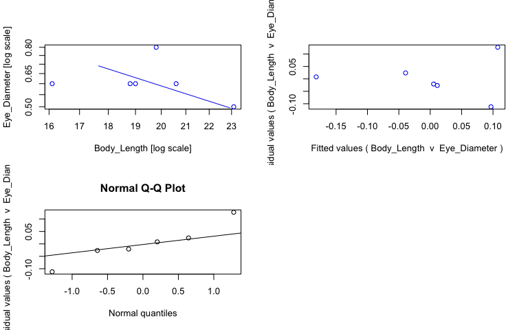<!-- -->

```r
#view fits
summary(sma_nedw)
```

```{style="max-height: 300px;"}
## Call: sma(formula = Eye_Diameter ~ Body_Length, data = nedw, log = "xy", 
##     method = "SMA", alpha = 0.05) 
## 
## Fit using Standardized Major Axis 
## 
## These variables were log-transformed before fitting: xy 
## 
## Confidence intervals (CI) are at 95%
## 
## ------------------------------------------------------------
## Coefficients:
##              elevation      slope
## estimate     1.4244363 -1.2712830
## lower limit -0.7533312 -3.8007834
## upper limit  3.6022037 -0.4252177
## 
## H0 : variables uncorrelated
## R-squared : 0.08540156 
## P-value : 0.57413
```

```r
#save coefficients of fits as object
cc_sma_nedw <- data.frame(coef(sma_nedw))

# Make plot ------
plot_nedw <- ggplot(nedw, aes(x = Body_Length, y = Eye_Diameter, col = Preservation)) + 
  geom_point(size = 2, alpha = 0.8) + 
  scale_color_manual(values = col_pres, name = "Sample state", breaks = c("ethanol", "fresh", "paraformaldehyde")) +
  scale_x_log10(name = "Body length (mm)") + #makes x axis log scale and named
  scale_y_log10(name = "Eye diameter (mm)") + #makes y axis log scale and named
  ggtitle("Neosergestes edwardsii") + 
  theme_bw() +
  theme(panel.grid.major = element_blank(), panel.grid.minor = element_blank(), plot.title = element_text(face = "italic")) 

#plot with outlier shown
plot_nedw_out <- plot_nedw +
  geom_point(aes(x=round(0.85,1), y=round(0.72,1)), colour="red", pch = 18) +
  ggtitle("Neosergestes edwardsii + outlier")
  
#plot
ggplotly(plot_nedw)
```

```{=html}
<div id="htmlwidget-3d49c5aa3400baa4189a" style="width:768px;height:480px;" class="plotly html-widget"></div>
<script type="application/json" data-for="htmlwidget-3d49c5aa3400baa4189a">{"x":{"data":[{"x":[1.36361197989214,1.31386722036915,1.20682587603185],"y":[-0.301029995663981,-0.221848749616356,-0.221848749616356],"text":["Body_Length: 23.1<br />Eye_Diameter: 0.5<br />Preservation: ethanol","Body_Length: 20.6<br />Eye_Diameter: 0.6<br />Preservation: ethanol","Body_Length: 16.1<br />Eye_Diameter: 0.6<br />Preservation: ethanol"],"type":"scatter","mode":"markers","marker":{"autocolorscale":false,"color":"rgba(166,206,227,1)","opacity":0.8,"size":7.55905511811024,"symbol":"circle","line":{"width":1.88976377952756,"color":"rgba(166,206,227,1)"}},"hoveron":"points","name":"ethanol","legendgroup":"ethanol","showlegend":true,"xaxis":"x","yaxis":"y","hoverinfo":"text","frame":null},{"x":[1.27875360095283,1.27415784926368,1.29666519026153],"y":[-0.221848749616356,-0.221848749616356,-0.0969100130080564],"text":["Body_Length: 19.0<br />Eye_Diameter: 0.6<br />Preservation: paraformaldehyde","Body_Length: 18.8<br />Eye_Diameter: 0.6<br />Preservation: paraformaldehyde","Body_Length: 19.8<br />Eye_Diameter: 0.8<br />Preservation: paraformaldehyde"],"type":"scatter","mode":"markers","marker":{"autocolorscale":false,"color":"rgba(31,120,180,1)","opacity":0.8,"size":7.55905511811024,"symbol":"circle","line":{"width":1.88976377952756,"color":"rgba(31,120,180,1)"}},"hoveron":"points","name":"paraformaldehyde","legendgroup":"paraformaldehyde","showlegend":true,"xaxis":"x","yaxis":"y","hoverinfo":"text","frame":null}],"layout":{"margin":{"t":45.2237442922374,"r":7.30593607305936,"b":41.6438356164384,"l":43.1050228310502},"plot_bgcolor":"rgba(255,255,255,1)","paper_bgcolor":"rgba(255,255,255,1)","font":{"color":"rgba(0,0,0,1)","family":"","size":14.6118721461187},"title":{"text":"<i> Neosergestes edwardsii <\/i>","font":{"color":"rgba(0,0,0,1)","family":"","size":17.5342465753425},"x":0,"xref":"paper"},"xaxis":{"domain":[0,1],"automargin":true,"type":"linear","autorange":false,"range":[1.19898657083883,1.37145128508516],"tickmode":"array","ticktext":["16","18","20","22"],"tickvals":[1.20411998265592,1.25527250510331,1.30102999566398,1.34242268082221],"categoryorder":"array","categoryarray":["16","18","20","22"],"nticks":null,"ticks":"outside","tickcolor":"rgba(51,51,51,1)","ticklen":3.65296803652968,"tickwidth":0.66417600664176,"showticklabels":true,"tickfont":{"color":"rgba(77,77,77,1)","family":"","size":11.689497716895},"tickangle":-0,"showline":false,"linecolor":null,"linewidth":0,"showgrid":false,"gridcolor":null,"gridwidth":0,"zeroline":false,"anchor":"y","title":{"text":"Body length (mm)","font":{"color":"rgba(0,0,0,1)","family":"","size":14.6118721461187}},"hoverformat":".2f"},"yaxis":{"domain":[0,1],"automargin":true,"type":"linear","autorange":false,"range":[-0.311235994796777,-0.0867040138752602],"tickmode":"array","ticktext":["0.5","0.6","0.7"],"tickvals":[-0.301029995663981,-0.221848749616356,-0.154901959985743],"categoryorder":"array","categoryarray":["0.5","0.6","0.7"],"nticks":null,"ticks":"outside","tickcolor":"rgba(51,51,51,1)","ticklen":3.65296803652968,"tickwidth":0.66417600664176,"showticklabels":true,"tickfont":{"color":"rgba(77,77,77,1)","family":"","size":11.689497716895},"tickangle":-0,"showline":false,"linecolor":null,"linewidth":0,"showgrid":false,"gridcolor":null,"gridwidth":0,"zeroline":false,"anchor":"x","title":{"text":"Eye diameter (mm)","font":{"color":"rgba(0,0,0,1)","family":"","size":14.6118721461187}},"hoverformat":".2f"},"shapes":[{"type":"rect","fillcolor":"transparent","line":{"color":"rgba(51,51,51,1)","width":0.66417600664176,"linetype":"solid"},"yref":"paper","xref":"paper","x0":0,"x1":1,"y0":0,"y1":1}],"showlegend":true,"legend":{"bgcolor":"rgba(255,255,255,1)","bordercolor":"transparent","borderwidth":1.88976377952756,"font":{"color":"rgba(0,0,0,1)","family":"","size":11.689497716895},"title":{"text":"Sample state","font":{"color":"rgba(0,0,0,1)","family":"","size":14.6118721461187}}},"hovermode":"closest","barmode":"relative"},"config":{"doubleClick":"reset","modeBarButtonsToAdd":["hoverclosest","hovercompare"],"showSendToCloud":false},"source":"A","attrs":{"20142b671319":{"x":{},"y":{},"colour":{},"type":"scatter"}},"cur_data":"20142b671319","visdat":{"20142b671319":["function (y) ","x"]},"highlight":{"on":"plotly_click","persistent":false,"dynamic":false,"selectize":false,"opacityDim":0.2,"selected":{"opacity":1},"debounce":0},"shinyEvents":["plotly_hover","plotly_click","plotly_selected","plotly_relayout","plotly_brushed","plotly_brushing","plotly_clickannotation","plotly_doubleclick","plotly_deselect","plotly_afterplot","plotly_sunburstclick"],"base_url":"https://plot.ly"},"evals":[],"jsHooks":[]}</script>
```

```r
#plot with outlier
ggplotly(plot_nedw_out)
```

```{=html}
<div id="htmlwidget-e897e0f5562e356e1763" style="width:768px;height:480px;" class="plotly html-widget"></div>
<script type="application/json" data-for="htmlwidget-e897e0f5562e356e1763">{"x":{"data":[{"x":[1.36361197989214,1.31386722036915,1.20682587603185],"y":[-0.301029995663981,-0.221848749616356,-0.221848749616356],"text":["Body_Length: 23.1<br />Eye_Diameter: 0.5<br />Preservation: ethanol","Body_Length: 20.6<br />Eye_Diameter: 0.6<br />Preservation: ethanol","Body_Length: 16.1<br />Eye_Diameter: 0.6<br />Preservation: ethanol"],"type":"scatter","mode":"markers","marker":{"autocolorscale":false,"color":"rgba(166,206,227,1)","opacity":0.8,"size":7.55905511811024,"symbol":"circle","line":{"width":1.88976377952756,"color":"rgba(166,206,227,1)"}},"hoveron":"points","name":"ethanol","legendgroup":"ethanol","showlegend":true,"xaxis":"x","yaxis":"y","hoverinfo":"text","frame":null},{"x":[1.27875360095283,1.27415784926368,1.29666519026153],"y":[-0.221848749616356,-0.221848749616356,-0.0969100130080564],"text":["Body_Length: 19.0<br />Eye_Diameter: 0.6<br />Preservation: paraformaldehyde","Body_Length: 18.8<br />Eye_Diameter: 0.6<br />Preservation: paraformaldehyde","Body_Length: 19.8<br />Eye_Diameter: 0.8<br />Preservation: paraformaldehyde"],"type":"scatter","mode":"markers","marker":{"autocolorscale":false,"color":"rgba(31,120,180,1)","opacity":0.8,"size":7.55905511811024,"symbol":"circle","line":{"width":1.88976377952756,"color":"rgba(31,120,180,1)"}},"hoveron":"points","name":"paraformaldehyde","legendgroup":"paraformaldehyde","showlegend":true,"xaxis":"x","yaxis":"y","hoverinfo":"text","frame":null},{"x":[-0.0969100130080564,-0.0969100130080564,-0.0969100130080564,-0.0969100130080564,-0.0969100130080564,-0.0969100130080564],"y":[-0.154901959985743,-0.154901959985743,-0.154901959985743,-0.154901959985743,-0.154901959985743,-0.154901959985743],"text":"round(0.85, 1): 0.8<br />round(0.72, 1): 0.7<br />Preservation: red","type":"scatter","mode":"markers","marker":{"autocolorscale":false,"color":"rgba(255,0,0,1)","opacity":1,"size":5.66929133858268,"symbol":"diamond","line":{"width":1.88976377952756,"color":"rgba(255,0,0,1)"}},"hoveron":"points","showlegend":false,"xaxis":"x","yaxis":"y","hoverinfo":"text","frame":null}],"layout":{"margin":{"t":45.2237442922374,"r":7.30593607305936,"b":41.6438356164384,"l":43.1050228310502},"plot_bgcolor":"rgba(255,255,255,1)","paper_bgcolor":"rgba(255,255,255,1)","font":{"color":"rgba(0,0,0,1)","family":"","size":14.6118721461187},"title":{"text":"<i> Neosergestes edwardsii + outlier <\/i>","font":{"color":"rgba(0,0,0,1)","family":"","size":17.5342465753425},"x":0,"xref":"paper"},"xaxis":{"domain":[0,1],"automargin":true,"type":"linear","autorange":false,"range":[-0.169936112653066,1.43663807953715],"tickmode":"array","ticktext":["1","3","10"],"tickvals":[0,0.477121254719662,1],"categoryorder":"array","categoryarray":["1","3","10"],"nticks":null,"ticks":"outside","tickcolor":"rgba(51,51,51,1)","ticklen":3.65296803652968,"tickwidth":0.66417600664176,"showticklabels":true,"tickfont":{"color":"rgba(77,77,77,1)","family":"","size":11.689497716895},"tickangle":-0,"showline":false,"linecolor":null,"linewidth":0,"showgrid":false,"gridcolor":null,"gridwidth":0,"zeroline":false,"anchor":"y","title":{"text":"Body length (mm)","font":{"color":"rgba(0,0,0,1)","family":"","size":14.6118721461187}},"hoverformat":".2f"},"yaxis":{"domain":[0,1],"automargin":true,"type":"linear","autorange":false,"range":[-0.311235994796777,-0.0867040138752602],"tickmode":"array","ticktext":["0.5","0.6","0.7"],"tickvals":[-0.301029995663981,-0.221848749616356,-0.154901959985743],"categoryorder":"array","categoryarray":["0.5","0.6","0.7"],"nticks":null,"ticks":"outside","tickcolor":"rgba(51,51,51,1)","ticklen":3.65296803652968,"tickwidth":0.66417600664176,"showticklabels":true,"tickfont":{"color":"rgba(77,77,77,1)","family":"","size":11.689497716895},"tickangle":-0,"showline":false,"linecolor":null,"linewidth":0,"showgrid":false,"gridcolor":null,"gridwidth":0,"zeroline":false,"anchor":"x","title":{"text":"Eye diameter (mm)","font":{"color":"rgba(0,0,0,1)","family":"","size":14.6118721461187}},"hoverformat":".2f"},"shapes":[{"type":"rect","fillcolor":"transparent","line":{"color":"rgba(51,51,51,1)","width":0.66417600664176,"linetype":"solid"},"yref":"paper","xref":"paper","x0":0,"x1":1,"y0":0,"y1":1}],"showlegend":true,"legend":{"bgcolor":"rgba(255,255,255,1)","bordercolor":"transparent","borderwidth":1.88976377952756,"font":{"color":"rgba(0,0,0,1)","family":"","size":11.689497716895},"title":{"text":"Sample state","font":{"color":"rgba(0,0,0,1)","family":"","size":14.6118721461187}}},"hovermode":"closest","barmode":"relative"},"config":{"doubleClick":"reset","modeBarButtonsToAdd":["hoverclosest","hovercompare"],"showSendToCloud":false},"source":"A","attrs":{"2014326366a2":{"x":{},"y":{},"colour":{},"type":"scatter"},"20141be72f86":{"x":{},"y":{},"colour":{}}},"cur_data":"2014326366a2","visdat":{"2014326366a2":["function (y) ","x"],"20141be72f86":["function (y) ","x"]},"highlight":{"on":"plotly_click","persistent":false,"dynamic":false,"selectize":false,"opacityDim":0.2,"selected":{"opacity":1},"debounce":0},"shinyEvents":["plotly_hover","plotly_click","plotly_selected","plotly_relayout","plotly_brushed","plotly_brushing","plotly_clickannotation","plotly_doubleclick","plotly_deselect","plotly_afterplot","plotly_sunburstclick"],"base_url":"https://plot.ly"},"evals":[],"jsHooks":[]}</script>
```

## _Parasergestes armatus_


```r
# Subset data -----
parm <- specimens %>% filter(genus_species == "Parasergestes_armatus")

# Fit SMA model ------
sma_parm <- sma(formula = Eye_Diameter ~ Body_Length, 
            data = parm, 
            log = "xy", #sets both x and y variables as logged
            method="SMA", #defines SMA as model
            alpha = 0.05)

#plot fit, residuals, qq
par(mfrow = c(2,2)) #make plot window 2x2
plot(sma_parm, which = "default",type = "o") 
plot(sma_parm, which = "residual",type = "o")
plot(sma_parm, which = "qq", type = "o")
par(mfrow = c(1,1)) 
```

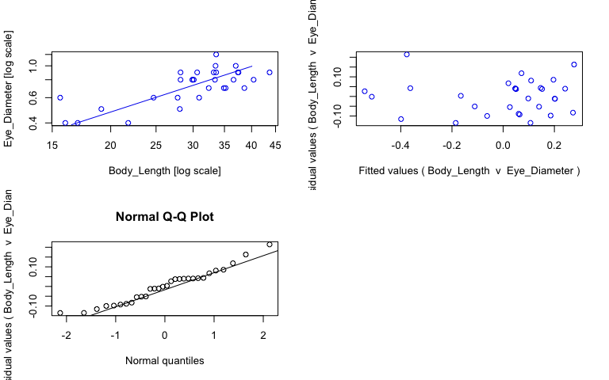<!-- -->

```r
#view fits
summary(sma_parm)
```

```{style="max-height: 300px;"}
## Call: sma(formula = Eye_Diameter ~ Body_Length, data = parm, log = "xy", 
##     method = "SMA", alpha = 0.05) 
## 
## Fit using Standardized Major Axis 
## 
## These variables were log-transformed before fitting: xy 
## 
## Confidence intervals (CI) are at 95%
## 
## ------------------------------------------------------------
## Coefficients:
##             elevation     slope
## estimate    -1.697577 1.0573117
## lower limit -2.095490 0.8217616
## upper limit -1.299663 1.3603801
## 
## H0 : variables uncorrelated
## R-squared : 0.5670657 
## P-value : 1.5744e-06
```

```r
#save coefficients of fits as object
cc_sma_parm <- data.frame(coef(sma_parm))

# Make plot ------
plot_parm <- ggplot(parm, aes(x = Body_Length, y = Eye_Diameter, col = Preservation)) + 
  geom_point(size = 2, alpha = 0.8) + 
  scale_color_manual(values = col_pres, name = "Sample state", breaks = c("ethanol", "fresh", "paraformaldehyde")) +
  scale_x_log10(name = "Body length (mm)") + #makes x axis log scale and named
  scale_y_log10(name = "Eye diameter (mm)") + #makes y axis log scale and named
  ggtitle("Parasergestes armatus") + 
  theme_bw() +
  theme(panel.grid.major = element_blank(), panel.grid.minor = element_blank(), plot.title = element_text(face = "italic")) +
  geom_abline(data = cc_sma_parm, aes(intercept = cc_sma_parm[1,1], slope = cc_sma_parm[2,1])) +
  geom_text(x = -Inf, y = Inf, hjust = -0.05, vjust = 1.5, nudge_x = 4, label = paste("b =", round(cc_sma_parm[2,1], digits = 2), sep = " "), size = 3.5, col = "black") +
  geom_text(x = -Inf, y = Inf, hjust = -0.05, vjust = 3, label = paste("a =", round(cc_sma_parm[1,1], digits = 2), sep = " "), size = 3.5, col = "black")

ggplotly(plot_parm)
```

```{=html}
<div id="htmlwidget-ab97ac1edbaa3eb793e1" style="width:768px;height:480px;" class="plotly html-widget"></div>
<script type="application/json" data-for="htmlwidget-ab97ac1edbaa3eb793e1">{"x":{"data":[{"x":[1.23044892137827,1.20411998265592,1.3384564936046,1.28103336724773,1.44870631990508,1.44404479591808,1.51054501020661,1.54654266347813,1.47567118832443,1.56348108539441,1.64048143697042],"y":[-0.397940008672038,-0.397940008672038,-0.397940008672038,-0.301029995663981,-0.301029995663981,-0.221848749616356,-0.154901959985743,-0.154901959985743,-0.0969100130080564,-0.0969100130080564,-0.0457574905606751],"text":["Body_Length: 17.0<br />Eye_Diameter: 0.4<br />Preservation: ethanol","Body_Length: 16.0<br />Eye_Diameter: 0.4<br />Preservation: ethanol","Body_Length: 21.8<br />Eye_Diameter: 0.4<br />Preservation: ethanol","Body_Length: 19.1<br />Eye_Diameter: 0.5<br />Preservation: ethanol","Body_Length: 28.1<br />Eye_Diameter: 0.5<br />Preservation: ethanol","Body_Length: 27.8<br />Eye_Diameter: 0.6<br />Preservation: ethanol","Body_Length: 32.4<br />Eye_Diameter: 0.7<br />Preservation: ethanol","Body_Length: 35.2<br />Eye_Diameter: 0.7<br />Preservation: ethanol","Body_Length: 29.9<br />Eye_Diameter: 0.8<br />Preservation: ethanol","Body_Length: 36.6<br />Eye_Diameter: 0.8<br />Preservation: ethanol","Body_Length: 43.7<br />Eye_Diameter: 0.9<br />Preservation: ethanol"],"type":"scatter","mode":"markers","marker":{"autocolorscale":false,"color":"rgba(166,206,227,1)","opacity":0.8,"size":7.55905511811024,"symbol":"circle","line":{"width":1.88976377952756,"color":"rgba(166,206,227,1)"}},"hoveron":"points","name":"ethanol","legendgroup":"ethanol","showlegend":true,"xaxis":"x","yaxis":"y","hoverinfo":"text","frame":null},{"x":[1.48995847942483,1.54282542695918,1.58658730467175,1.52374646681156,1.6063813651106,1.47856649559384,1.52633927738984,1.57287160220048,1.52113808370404,1.57403126772772,1.52504480703685,1.56820172406699],"y":[-0.221848749616356,-0.154901959985743,-0.154901959985743,-0.0969100130080564,-0.0969100130080564,-0.0969100130080564,-0.0457574905606751,-0.0457574905606751,-0.0457574905606751,-0.0457574905606751,0,0],"text":["Body_Length: 30.9<br />Eye_Diameter: 0.6<br />Preservation: fresh","Body_Length: 34.9<br />Eye_Diameter: 0.7<br />Preservation: fresh","Body_Length: 38.6<br />Eye_Diameter: 0.7<br />Preservation: fresh","Body_Length: 33.4<br />Eye_Diameter: 0.8<br />Preservation: fresh","Body_Length: 40.4<br />Eye_Diameter: 0.8<br />Preservation: fresh","Body_Length: 30.1<br />Eye_Diameter: 0.8<br />Preservation: fresh","Body_Length: 33.6<br />Eye_Diameter: 0.9<br />Preservation: fresh","Body_Length: 37.4<br />Eye_Diameter: 0.9<br />Preservation: fresh","Body_Length: 33.2<br />Eye_Diameter: 0.9<br />Preservation: fresh","Body_Length: 37.5<br />Eye_Diameter: 0.9<br />Preservation: fresh","Body_Length: 33.5<br />Eye_Diameter: 1.0<br />Preservation: fresh","Body_Length: 37.0<br />Eye_Diameter: 1.0<br />Preservation: fresh"],"type":"scatter","mode":"markers","marker":{"autocolorscale":false,"color":"rgba(178,223,138,1)","opacity":0.8,"size":7.55905511811024,"symbol":"circle","line":{"width":1.88976377952756,"color":"rgba(178,223,138,1)"}},"hoveron":"points","name":"fresh","legendgroup":"fresh","showlegend":true,"xaxis":"x","yaxis":"y","hoverinfo":"text","frame":null},{"x":[1.19312459835446,1.39269695325967,1.45024910831936,1.47567118832443,1.48572142648158,1.45024910831936,1.52633927738984],"y":[-0.221848749616356,-0.221848749616356,-0.0969100130080564,-0.0969100130080564,-0.0457574905606751,-0.0457574905606751,0.0791812460476248],"text":["Body_Length: 15.6<br />Eye_Diameter: 0.6<br />Preservation: paraformaldehyde","Body_Length: 24.7<br />Eye_Diameter: 0.6<br />Preservation: paraformaldehyde","Body_Length: 28.2<br />Eye_Diameter: 0.8<br />Preservation: paraformaldehyde","Body_Length: 29.9<br />Eye_Diameter: 0.8<br />Preservation: paraformaldehyde","Body_Length: 30.6<br />Eye_Diameter: 0.9<br />Preservation: paraformaldehyde","Body_Length: 28.2<br />Eye_Diameter: 0.9<br />Preservation: paraformaldehyde","Body_Length: 33.6<br />Eye_Diameter: 1.2<br />Preservation: paraformaldehyde"],"type":"scatter","mode":"markers","marker":{"autocolorscale":false,"color":"rgba(31,120,180,1)","opacity":0.8,"size":7.55905511811024,"symbol":"circle","line":{"width":1.88976377952756,"color":"rgba(31,120,180,1)"}},"hoveron":"points","name":"paraformaldehyde","legendgroup":"paraformaldehyde","showlegend":true,"xaxis":"x","yaxis":"y","hoverinfo":"text","frame":null},{"x":[1.17075675642366,1.17075675642366,1.66284927890122,1.66284927890122],"y":[-0.459721684216446,-0.459721684216446,0.0605735060037353,0.0605735060037353],"text":"cc_sma_parm[1, 1]: -1.697577<br />cc_sma_parm[2, 1]: 1.057312","type":"scatter","mode":"lines","line":{"width":1.88976377952756,"color":"rgba(0,0,0,1)","dash":"solid"},"hoveron":"points","showlegend":false,"xaxis":"x","yaxis":"y","hoverinfo":"text","frame":null},{"x":[null,null,null,null,null,null,null,null,null,null,null,null,null,null,null,null,null,null,null,null,null,null,null,null,null,null,null,null,null,null],"y":[null,null,null,null,null,null,null,null,null,null,null,null,null,null,null,null,null,null,null,null,null,null,null,null,null,null,null,null,null,null],"text":["b = 1.06","b = 1.06","b = 1.06","b = 1.06","b = 1.06","b = 1.06","b = 1.06","b = 1.06","b = 1.06","b = 1.06","b = 1.06","b = 1.06","b = 1.06","b = 1.06","b = 1.06","b = 1.06","b = 1.06","b = 1.06","b = 1.06","b = 1.06","b = 1.06","b = 1.06","b = 1.06","b = 1.06","b = 1.06","b = 1.06","b = 1.06","b = 1.06","b = 1.06","b = 1.06"],"hovertext":["Body_Length: -Inf<br />Eye_Diameter: Inf<br />Preservation: black","Body_Length: -Inf<br />Eye_Diameter: Inf<br />Preservation: black","Body_Length: -Inf<br />Eye_Diameter: Inf<br />Preservation: black","Body_Length: -Inf<br />Eye_Diameter: Inf<br />Preservation: black","Body_Length: -Inf<br />Eye_Diameter: Inf<br />Preservation: black","Body_Length: -Inf<br />Eye_Diameter: Inf<br />Preservation: black","Body_Length: -Inf<br />Eye_Diameter: Inf<br />Preservation: black","Body_Length: -Inf<br />Eye_Diameter: Inf<br />Preservation: black","Body_Length: -Inf<br />Eye_Diameter: Inf<br />Preservation: black","Body_Length: -Inf<br />Eye_Diameter: Inf<br />Preservation: black","Body_Length: -Inf<br />Eye_Diameter: Inf<br />Preservation: black","Body_Length: -Inf<br />Eye_Diameter: Inf<br />Preservation: black","Body_Length: -Inf<br />Eye_Diameter: Inf<br />Preservation: black","Body_Length: -Inf<br />Eye_Diameter: Inf<br />Preservation: black","Body_Length: -Inf<br />Eye_Diameter: Inf<br />Preservation: black","Body_Length: -Inf<br />Eye_Diameter: Inf<br />Preservation: black","Body_Length: -Inf<br />Eye_Diameter: Inf<br />Preservation: black","Body_Length: -Inf<br />Eye_Diameter: Inf<br />Preservation: black","Body_Length: -Inf<br />Eye_Diameter: Inf<br />Preservation: black","Body_Length: -Inf<br />Eye_Diameter: Inf<br />Preservation: black","Body_Length: -Inf<br />Eye_Diameter: Inf<br />Preservation: black","Body_Length: -Inf<br />Eye_Diameter: Inf<br />Preservation: black","Body_Length: -Inf<br />Eye_Diameter: Inf<br />Preservation: black","Body_Length: -Inf<br />Eye_Diameter: Inf<br />Preservation: black","Body_Length: -Inf<br />Eye_Diameter: Inf<br />Preservation: black","Body_Length: -Inf<br />Eye_Diameter: Inf<br />Preservation: black","Body_Length: -Inf<br />Eye_Diameter: Inf<br />Preservation: black","Body_Length: -Inf<br />Eye_Diameter: Inf<br />Preservation: black","Body_Length: -Inf<br />Eye_Diameter: Inf<br />Preservation: black","Body_Length: -Inf<br />Eye_Diameter: Inf<br />Preservation: black"],"textfont":{"size":13.2283464566929,"color":"rgba(0,0,0,1)"},"type":"scatter","mode":"text","hoveron":"points","showlegend":false,"xaxis":"x","yaxis":"y","hoverinfo":"text","frame":null},{"x":[null,null,null,null,null,null,null,null,null,null,null,null,null,null,null,null,null,null,null,null,null,null,null,null,null,null,null,null,null,null],"y":[null,null,null,null,null,null,null,null,null,null,null,null,null,null,null,null,null,null,null,null,null,null,null,null,null,null,null,null,null,null],"text":["a = -1.7","a = -1.7","a = -1.7","a = -1.7","a = -1.7","a = -1.7","a = -1.7","a = -1.7","a = -1.7","a = -1.7","a = -1.7","a = -1.7","a = -1.7","a = -1.7","a = -1.7","a = -1.7","a = -1.7","a = -1.7","a = -1.7","a = -1.7","a = -1.7","a = -1.7","a = -1.7","a = -1.7","a = -1.7","a = -1.7","a = -1.7","a = -1.7","a = -1.7","a = -1.7"],"hovertext":["Body_Length: -Inf<br />Eye_Diameter: Inf<br />Preservation: black","Body_Length: -Inf<br />Eye_Diameter: Inf<br />Preservation: black","Body_Length: -Inf<br />Eye_Diameter: Inf<br />Preservation: black","Body_Length: -Inf<br />Eye_Diameter: Inf<br />Preservation: black","Body_Length: -Inf<br />Eye_Diameter: Inf<br />Preservation: black","Body_Length: -Inf<br />Eye_Diameter: Inf<br />Preservation: black","Body_Length: -Inf<br />Eye_Diameter: Inf<br />Preservation: black","Body_Length: -Inf<br />Eye_Diameter: Inf<br />Preservation: black","Body_Length: -Inf<br />Eye_Diameter: Inf<br />Preservation: black","Body_Length: -Inf<br />Eye_Diameter: Inf<br />Preservation: black","Body_Length: -Inf<br />Eye_Diameter: Inf<br />Preservation: black","Body_Length: -Inf<br />Eye_Diameter: Inf<br />Preservation: black","Body_Length: -Inf<br />Eye_Diameter: Inf<br />Preservation: black","Body_Length: -Inf<br />Eye_Diameter: Inf<br />Preservation: black","Body_Length: -Inf<br />Eye_Diameter: Inf<br />Preservation: black","Body_Length: -Inf<br />Eye_Diameter: Inf<br />Preservation: black","Body_Length: -Inf<br />Eye_Diameter: Inf<br />Preservation: black","Body_Length: -Inf<br />Eye_Diameter: Inf<br />Preservation: black","Body_Length: -Inf<br />Eye_Diameter: Inf<br />Preservation: black","Body_Length: -Inf<br />Eye_Diameter: Inf<br />Preservation: black","Body_Length: -Inf<br />Eye_Diameter: Inf<br />Preservation: black","Body_Length: -Inf<br />Eye_Diameter: Inf<br />Preservation: black","Body_Length: -Inf<br />Eye_Diameter: Inf<br />Preservation: black","Body_Length: -Inf<br />Eye_Diameter: Inf<br />Preservation: black","Body_Length: -Inf<br />Eye_Diameter: Inf<br />Preservation: black","Body_Length: -Inf<br />Eye_Diameter: Inf<br />Preservation: black","Body_Length: -Inf<br />Eye_Diameter: Inf<br />Preservation: black","Body_Length: -Inf<br />Eye_Diameter: Inf<br />Preservation: black","Body_Length: -Inf<br />Eye_Diameter: Inf<br />Preservation: black","Body_Length: -Inf<br />Eye_Diameter: Inf<br />Preservation: black"],"textfont":{"size":13.2283464566929,"color":"rgba(0,0,0,1)"},"type":"scatter","mode":"text","hoveron":"points","showlegend":false,"xaxis":"x","yaxis":"y","hoverinfo":"text","frame":null}],"layout":{"margin":{"t":45.2237442922374,"r":7.30593607305936,"b":41.6438356164384,"l":43.1050228310502},"plot_bgcolor":"rgba(255,255,255,1)","paper_bgcolor":"rgba(255,255,255,1)","font":{"color":"rgba(0,0,0,1)","family":"","size":14.6118721461187},"title":{"text":"<i> Parasergestes armatus <\/i>","font":{"color":"rgba(0,0,0,1)","family":"","size":17.5342465753425},"x":0,"xref":"paper"},"xaxis":{"domain":[0,1],"automargin":true,"type":"linear","autorange":false,"range":[1.17075675642366,1.66284927890122],"tickmode":"array","ticktext":["20","30","40"],"tickvals":[1.30102999566398,1.47712125471966,1.60205999132796],"categoryorder":"array","categoryarray":["20","30","40"],"nticks":null,"ticks":"outside","tickcolor":"rgba(51,51,51,1)","ticklen":3.65296803652968,"tickwidth":0.66417600664176,"showticklabels":true,"tickfont":{"color":"rgba(77,77,77,1)","family":"","size":11.689497716895},"tickangle":-0,"showline":false,"linecolor":null,"linewidth":0,"showgrid":false,"gridcolor":null,"gridwidth":0,"zeroline":false,"anchor":"y","title":{"text":"Body length (mm)","font":{"color":"rgba(0,0,0,1)","family":"","size":14.6118721461187}},"hoverformat":".2f"},"yaxis":{"domain":[0,1],"automargin":true,"type":"linear","autorange":false,"range":[-0.421796071408021,0.103037308783608],"tickmode":"array","ticktext":["0.5","0.7","1.0"],"tickvals":[-0.301029995663981,-0.154901959985743,0],"categoryorder":"array","categoryarray":["0.5","0.7","1.0"],"nticks":null,"ticks":"outside","tickcolor":"rgba(51,51,51,1)","ticklen":3.65296803652968,"tickwidth":0.66417600664176,"showticklabels":true,"tickfont":{"color":"rgba(77,77,77,1)","family":"","size":11.689497716895},"tickangle":-0,"showline":false,"linecolor":null,"linewidth":0,"showgrid":false,"gridcolor":null,"gridwidth":0,"zeroline":false,"anchor":"x","title":{"text":"Eye diameter (mm)","font":{"color":"rgba(0,0,0,1)","family":"","size":14.6118721461187}},"hoverformat":".2f"},"shapes":[{"type":"rect","fillcolor":"transparent","line":{"color":"rgba(51,51,51,1)","width":0.66417600664176,"linetype":"solid"},"yref":"paper","xref":"paper","x0":0,"x1":1,"y0":0,"y1":1}],"showlegend":true,"legend":{"bgcolor":"rgba(255,255,255,1)","bordercolor":"transparent","borderwidth":1.88976377952756,"font":{"color":"rgba(0,0,0,1)","family":"","size":11.689497716895},"title":{"text":"Sample state","font":{"color":"rgba(0,0,0,1)","family":"","size":14.6118721461187}}},"hovermode":"closest","barmode":"relative"},"config":{"doubleClick":"reset","modeBarButtonsToAdd":["hoverclosest","hovercompare"],"showSendToCloud":false},"source":"A","attrs":{"20145a5a7975":{"x":{},"y":{},"colour":{},"type":"scatter"},"201469dc1eaa":{"intercept":{},"slope":{}},"201472616131":{"x":{},"y":{},"colour":{}},"2014573412a1":{"x":{},"y":{},"colour":{}}},"cur_data":"20145a5a7975","visdat":{"20145a5a7975":["function (y) ","x"],"201469dc1eaa":["function (y) ","x"],"201472616131":["function (y) ","x"],"2014573412a1":["function (y) ","x"]},"highlight":{"on":"plotly_click","persistent":false,"dynamic":false,"selectize":false,"opacityDim":0.2,"selected":{"opacity":1},"debounce":0},"shinyEvents":["plotly_hover","plotly_click","plotly_selected","plotly_relayout","plotly_brushed","plotly_brushing","plotly_clickannotation","plotly_doubleclick","plotly_deselect","plotly_afterplot","plotly_sunburstclick"],"base_url":"https://plot.ly"},"evals":[],"jsHooks":[]}</script>
```

## _Parasergestes vigilax_


```r
# Subset data -----
pvig <- specimens %>% filter(genus_species == "Parasergestes_vigilax")

# Fit SMA model ------
sma_pvig <- sma(formula = Eye_Diameter ~ Body_Length, 
            data = pvig, 
            log = "xy", #sets both x and y variables as logged
            method="SMA", #defines SMA as model
            alpha = 0.05)

#plot fit, residuals, qq
par(mfrow = c(2,2)) #make plot window 2x2
plot(sma_pvig, which = "default",type = "o") 
plot(sma_pvig, which = "residual",type = "o")
plot(sma_pvig, which = "qq", type = "o")
par(mfrow = c(1,1)) 
```

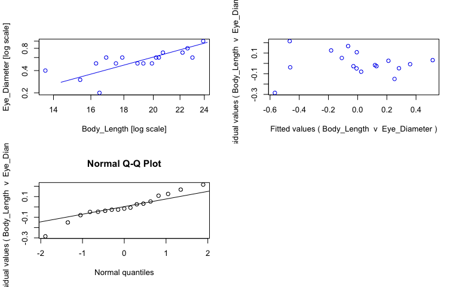<!-- -->

```r
#view fits
summary(sma_pvig)
```

```{style="max-height: 300px;"}
## Call: sma(formula = Eye_Diameter ~ Body_Length, data = pvig, log = "xy", 
##     method = "SMA", alpha = 0.05) 
## 
## Fit using Standardized Major Axis 
## 
## These variables were log-transformed before fitting: xy 
## 
## Confidence intervals (CI) are at 95%
## 
## ------------------------------------------------------------
## Coefficients:
##             elevation    slope
## estimate    -3.306489 2.375713
## lower limit -4.455793 1.641298
## upper limit -2.157186 3.438750
## 
## H0 : variables uncorrelated
## R-squared : 0.5274941 
## P-value : 0.00096145
```

```r
#save coefficients of fits as object
cc_sma_pvig <- data.frame(coef(sma_pvig))

# Make plot ------
plot_pvig <- ggplot(pvig, aes(x = Body_Length, y = Eye_Diameter, col = Preservation)) + 
  geom_point(size = 2, alpha = 0.8) + 
  scale_color_manual(values = col_pres, name = "Sample state", breaks = c("ethanol", "fresh", "paraformaldehyde")) +
  scale_x_log10(name = "Body length (mm)") + #makes x axis log scale and named
  scale_y_log10(name = "Eye diameter (mm)") + #makes y axis log scale and named
  ggtitle("Parasergestes vigilax") + 
  theme_bw() +
  theme(panel.grid.major = element_blank(), panel.grid.minor = element_blank(), plot.title = element_text(face = "italic")) +
  geom_abline(data = cc_sma_pvig, aes(intercept = cc_sma_pvig[1,1], slope = cc_sma_pvig[2,1])) +
  geom_text(x = -Inf, y = Inf, hjust = -0.05, vjust = 1.5, nudge_x = 4, label = paste("b =", round(cc_sma_pvig[2,1], digits = 2), sep = " "), size = 3.5, col = "black") +
  geom_text(x = -Inf, y = Inf, hjust = -0.05, vjust = 3, label = paste("a =", round(cc_sma_pvig[1,1], digits = 2), sep = " "), size = 3.5, col = "black")

ggplotly(plot_pvig)
```

```{=html}
<div id="htmlwidget-e64baf3b4cadf9cfa66e" style="width:768px;height:480px;" class="plotly html-widget"></div>
<script type="application/json" data-for="htmlwidget-e64baf3b4cadf9cfa66e">{"x":{"data":[{"x":[1.13353890837022,1.21218760440396,1.28555730900777,1.27646180417324,1.36172783601759,1.25285303097989,1.22788670461367,1.30535136944662,1.3096301674259,1.34635297445064,1.31597034545692],"y":[-0.397940008672038,-0.301029995663981,-0.301029995663981,-0.301029995663981,-0.221848749616356,-0.221848749616356,-0.221848749616356,-0.221848749616356,-0.221848749616356,-0.154901959985743,-0.154901959985743],"text":["Body_Length: 13.6<br />Eye_Diameter: 0.4<br />Preservation: ethanol","Body_Length: 16.3<br />Eye_Diameter: 0.5<br />Preservation: ethanol","Body_Length: 19.3<br />Eye_Diameter: 0.5<br />Preservation: ethanol","Body_Length: 18.9<br />Eye_Diameter: 0.5<br />Preservation: ethanol","Body_Length: 23.0<br />Eye_Diameter: 0.6<br />Preservation: ethanol","Body_Length: 17.9<br />Eye_Diameter: 0.6<br />Preservation: ethanol","Body_Length: 16.9<br />Eye_Diameter: 0.6<br />Preservation: ethanol","Body_Length: 20.2<br />Eye_Diameter: 0.6<br />Preservation: ethanol","Body_Length: 20.4<br />Eye_Diameter: 0.6<br />Preservation: ethanol","Body_Length: 22.2<br />Eye_Diameter: 0.7<br />Preservation: ethanol","Body_Length: 20.7<br />Eye_Diameter: 0.7<br />Preservation: ethanol"],"type":"scatter","mode":"markers","marker":{"autocolorscale":false,"color":"rgba(166,206,227,1)","opacity":0.8,"size":7.55905511811024,"symbol":"circle","line":{"width":1.88976377952756,"color":"rgba(166,206,227,1)"}},"hoveron":"points","name":"ethanol","legendgroup":"ethanol","showlegend":true,"xaxis":"x","yaxis":"y","hoverinfo":"text","frame":null},{"x":[1.21748394421391],"y":[-0.698970004336019],"text":"Body_Length: 16.5<br />Eye_Diameter: 0.2<br />Preservation: fresh","type":"scatter","mode":"markers","marker":{"autocolorscale":false,"color":"rgba(178,223,138,1)","opacity":0.8,"size":7.55905511811024,"symbol":"circle","line":{"width":1.88976377952756,"color":"rgba(178,223,138,1)"}},"hoveron":"points","name":"fresh","legendgroup":"fresh","showlegend":true,"xaxis":"x","yaxis":"y","hoverinfo":"text","frame":null},{"x":[1.18752072083646,1.24303804868629,1.29885307640971,1.3541084391474,1.37839790094814],"y":[-0.522878745280338,-0.301029995663981,-0.301029995663981,-0.0969100130080564,0],"text":["Body_Length: 15.4<br />Eye_Diameter: 0.3<br />Preservation: paraformaldehyde","Body_Length: 17.5<br />Eye_Diameter: 0.5<br />Preservation: paraformaldehyde","Body_Length: 19.9<br />Eye_Diameter: 0.5<br />Preservation: paraformaldehyde","Body_Length: 22.6<br />Eye_Diameter: 0.8<br />Preservation: paraformaldehyde","Body_Length: 23.9<br />Eye_Diameter: 1.0<br />Preservation: paraformaldehyde"],"type":"scatter","mode":"markers","marker":{"autocolorscale":false,"color":"rgba(31,120,180,1)","opacity":0.8,"size":7.55905511811024,"symbol":"circle","line":{"width":1.88976377952756,"color":"rgba(31,120,180,1)"}},"hoveron":"points","name":"paraformaldehyde","legendgroup":"paraformaldehyde","showlegend":true,"xaxis":"x","yaxis":"y","hoverinfo":"text","frame":null},{"x":[1.12129595874132,1.12129595874132,1.39064085057703,1.39064085057703],"y":[-0.642611435744768,-0.642611435744768,-0.00272516474427231,-0.00272516474427231],"text":"cc_sma_pvig[1, 1]: -3.306489<br />cc_sma_pvig[2, 1]: 2.375713","type":"scatter","mode":"lines","line":{"width":1.88976377952756,"color":"rgba(0,0,0,1)","dash":"solid"},"hoveron":"points","showlegend":false,"xaxis":"x","yaxis":"y","hoverinfo":"text","frame":null},{"x":[null,null,null,null,null,null,null,null,null,null,null,null,null,null,null,null,null],"y":[null,null,null,null,null,null,null,null,null,null,null,null,null,null,null,null,null],"text":["b = 2.38","b = 2.38","b = 2.38","b = 2.38","b = 2.38","b = 2.38","b = 2.38","b = 2.38","b = 2.38","b = 2.38","b = 2.38","b = 2.38","b = 2.38","b = 2.38","b = 2.38","b = 2.38","b = 2.38"],"hovertext":["Body_Length: -Inf<br />Eye_Diameter: Inf<br />Preservation: black","Body_Length: -Inf<br />Eye_Diameter: Inf<br />Preservation: black","Body_Length: -Inf<br />Eye_Diameter: Inf<br />Preservation: black","Body_Length: -Inf<br />Eye_Diameter: Inf<br />Preservation: black","Body_Length: -Inf<br />Eye_Diameter: Inf<br />Preservation: black","Body_Length: -Inf<br />Eye_Diameter: Inf<br />Preservation: black","Body_Length: -Inf<br />Eye_Diameter: Inf<br />Preservation: black","Body_Length: -Inf<br />Eye_Diameter: Inf<br />Preservation: black","Body_Length: -Inf<br />Eye_Diameter: Inf<br />Preservation: black","Body_Length: -Inf<br />Eye_Diameter: Inf<br />Preservation: black","Body_Length: -Inf<br />Eye_Diameter: Inf<br />Preservation: black","Body_Length: -Inf<br />Eye_Diameter: Inf<br />Preservation: black","Body_Length: -Inf<br />Eye_Diameter: Inf<br />Preservation: black","Body_Length: -Inf<br />Eye_Diameter: Inf<br />Preservation: black","Body_Length: -Inf<br />Eye_Diameter: Inf<br />Preservation: black","Body_Length: -Inf<br />Eye_Diameter: Inf<br />Preservation: black","Body_Length: -Inf<br />Eye_Diameter: Inf<br />Preservation: black"],"textfont":{"size":13.2283464566929,"color":"rgba(0,0,0,1)"},"type":"scatter","mode":"text","hoveron":"points","showlegend":false,"xaxis":"x","yaxis":"y","hoverinfo":"text","frame":null},{"x":[null,null,null,null,null,null,null,null,null,null,null,null,null,null,null,null,null],"y":[null,null,null,null,null,null,null,null,null,null,null,null,null,null,null,null,null],"text":["a = -3.31","a = -3.31","a = -3.31","a = -3.31","a = -3.31","a = -3.31","a = -3.31","a = -3.31","a = -3.31","a = -3.31","a = -3.31","a = -3.31","a = -3.31","a = -3.31","a = -3.31","a = -3.31","a = -3.31"],"hovertext":["Body_Length: -Inf<br />Eye_Diameter: Inf<br />Preservation: black","Body_Length: -Inf<br />Eye_Diameter: Inf<br />Preservation: black","Body_Length: -Inf<br />Eye_Diameter: Inf<br />Preservation: black","Body_Length: -Inf<br />Eye_Diameter: Inf<br />Preservation: black","Body_Length: -Inf<br />Eye_Diameter: Inf<br />Preservation: black","Body_Length: -Inf<br />Eye_Diameter: Inf<br />Preservation: black","Body_Length: -Inf<br />Eye_Diameter: Inf<br />Preservation: black","Body_Length: -Inf<br />Eye_Diameter: Inf<br />Preservation: black","Body_Length: -Inf<br />Eye_Diameter: Inf<br />Preservation: black","Body_Length: -Inf<br />Eye_Diameter: Inf<br />Preservation: black","Body_Length: -Inf<br />Eye_Diameter: Inf<br />Preservation: black","Body_Length: -Inf<br />Eye_Diameter: Inf<br />Preservation: black","Body_Length: -Inf<br />Eye_Diameter: Inf<br />Preservation: black","Body_Length: -Inf<br />Eye_Diameter: Inf<br />Preservation: black","Body_Length: -Inf<br />Eye_Diameter: Inf<br />Preservation: black","Body_Length: -Inf<br />Eye_Diameter: Inf<br />Preservation: black","Body_Length: -Inf<br />Eye_Diameter: Inf<br />Preservation: black"],"textfont":{"size":13.2283464566929,"color":"rgba(0,0,0,1)"},"type":"scatter","mode":"text","hoveron":"points","showlegend":false,"xaxis":"x","yaxis":"y","hoverinfo":"text","frame":null}],"layout":{"margin":{"t":45.2237442922374,"r":7.30593607305936,"b":41.6438356164384,"l":43.1050228310502},"plot_bgcolor":"rgba(255,255,255,1)","paper_bgcolor":"rgba(255,255,255,1)","font":{"color":"rgba(0,0,0,1)","family":"","size":14.6118721461187},"title":{"text":"<i> Parasergestes vigilax <\/i>","font":{"color":"rgba(0,0,0,1)","family":"","size":17.5342465753425},"x":0,"xref":"paper"},"xaxis":{"domain":[0,1],"automargin":true,"type":"linear","autorange":false,"range":[1.12129595874132,1.39064085057703],"tickmode":"array","ticktext":["15.0","17.5","20.0","22.5"],"tickvals":[1.17609125905568,1.24303804868629,1.30102999566398,1.35218251811136],"categoryorder":"array","categoryarray":["15.0","17.5","20.0","22.5"],"nticks":null,"ticks":"outside","tickcolor":"rgba(51,51,51,1)","ticklen":3.65296803652968,"tickwidth":0.66417600664176,"showticklabels":true,"tickfont":{"color":"rgba(77,77,77,1)","family":"","size":11.689497716895},"tickangle":-0,"showline":false,"linecolor":null,"linewidth":0,"showgrid":false,"gridcolor":null,"gridwidth":0,"zeroline":false,"anchor":"y","title":{"text":"Body length (mm)","font":{"color":"rgba(0,0,0,1)","family":"","size":14.6118721461187}},"hoverformat":".2f"},"yaxis":{"domain":[0,1],"automargin":true,"type":"linear","autorange":false,"range":[-0.73391850455282,0.0349485002168009],"tickmode":"array","ticktext":["0.3","0.5","1.0"],"tickvals":[-0.522878745280338,-0.301029995663981,0],"categoryorder":"array","categoryarray":["0.3","0.5","1.0"],"nticks":null,"ticks":"outside","tickcolor":"rgba(51,51,51,1)","ticklen":3.65296803652968,"tickwidth":0.66417600664176,"showticklabels":true,"tickfont":{"color":"rgba(77,77,77,1)","family":"","size":11.689497716895},"tickangle":-0,"showline":false,"linecolor":null,"linewidth":0,"showgrid":false,"gridcolor":null,"gridwidth":0,"zeroline":false,"anchor":"x","title":{"text":"Eye diameter (mm)","font":{"color":"rgba(0,0,0,1)","family":"","size":14.6118721461187}},"hoverformat":".2f"},"shapes":[{"type":"rect","fillcolor":"transparent","line":{"color":"rgba(51,51,51,1)","width":0.66417600664176,"linetype":"solid"},"yref":"paper","xref":"paper","x0":0,"x1":1,"y0":0,"y1":1}],"showlegend":true,"legend":{"bgcolor":"rgba(255,255,255,1)","bordercolor":"transparent","borderwidth":1.88976377952756,"font":{"color":"rgba(0,0,0,1)","family":"","size":11.689497716895},"title":{"text":"Sample state","font":{"color":"rgba(0,0,0,1)","family":"","size":14.6118721461187}}},"hovermode":"closest","barmode":"relative"},"config":{"doubleClick":"reset","modeBarButtonsToAdd":["hoverclosest","hovercompare"],"showSendToCloud":false},"source":"A","attrs":{"20141d844011":{"x":{},"y":{},"colour":{},"type":"scatter"},"2014558a2b3a":{"intercept":{},"slope":{}},"2014621c18b5":{"x":{},"y":{},"colour":{}},"2014229a4565":{"x":{},"y":{},"colour":{}}},"cur_data":"20141d844011","visdat":{"20141d844011":["function (y) ","x"],"2014558a2b3a":["function (y) ","x"],"2014621c18b5":["function (y) ","x"],"2014229a4565":["function (y) ","x"]},"highlight":{"on":"plotly_click","persistent":false,"dynamic":false,"selectize":false,"opacityDim":0.2,"selected":{"opacity":1},"debounce":0},"shinyEvents":["plotly_hover","plotly_click","plotly_selected","plotly_relayout","plotly_brushed","plotly_brushing","plotly_clickannotation","plotly_doubleclick","plotly_deselect","plotly_afterplot","plotly_sunburstclick"],"base_url":"https://plot.ly"},"evals":[],"jsHooks":[]}</script>
```

## _Phorcosergia grandis_


```r
# Subset data -----
pgra <- specimens %>% filter(genus_species == "Phorcosergia_grandis")

# Fit SMA model ------
sma_pgra <- sma(formula = Eye_Diameter ~ Body_Length, 
            data = pgra, 
            log = "xy", #sets both x and y variables as logged
            method="SMA", #defines SMA as model
            alpha = 0.05)

#plot fit, residuals, qq
par(mfrow = c(2,2)) #make plot window 2x2
plot(sma_pgra, which = "default",type = "o") 
plot(sma_pgra, which = "residual",type = "o")
plot(sma_pgra, which = "qq", type = "o")
par(mfrow = c(1,1)) 
```

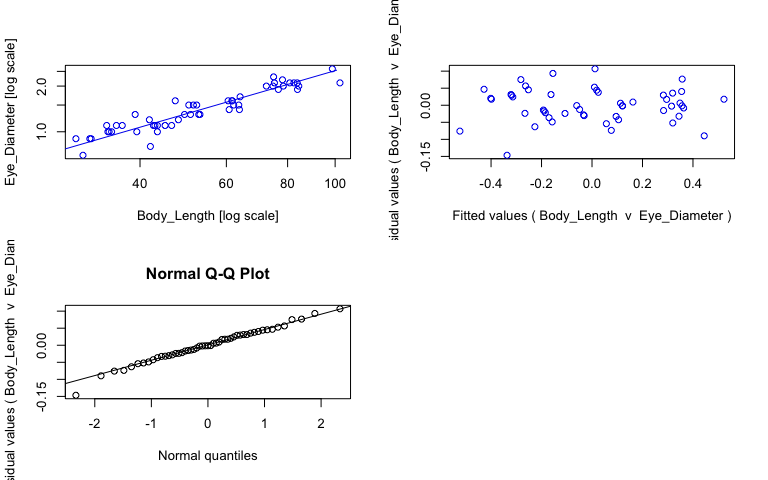<!-- -->

```r
#view fits
summary(sma_pgra)
```

```{style="max-height: 300px;"}
## Call: sma(formula = Eye_Diameter ~ Body_Length, data = pgra, log = "xy", 
##     method = "SMA", alpha = 0.05) 
## 
## Fit using Standardized Major Axis 
## 
## These variables were log-transformed before fitting: xy 
## 
## Confidence intervals (CI) are at 95%
## 
## ------------------------------------------------------------
## Coefficients:
##             elevation     slope
## estimate    -1.470665 0.9366565
## lower limit -1.632022 0.8480626
## upper limit -1.309308 1.0345055
## 
## H0 : variables uncorrelated
## R-squared : 0.8798127 
## P-value : < 2.22e-16
```

```r
#save coefficients of fits as object
cc_sma_pgra <- data.frame(coef(sma_pgra))

# Make plot ------
plot_pgra <- ggplot(pgra, aes(x = Body_Length, y = Eye_Diameter, col = Preservation)) + 
  geom_point(size = 2, alpha = 0.8) + 
  scale_color_manual(values = col_pres, name = "Sample state", breaks = c("ethanol", "fresh", "paraformaldehyde")) +
  scale_x_log10(name = "Body length (mm)") + #makes x axis log scale and named
  scale_y_log10(name = "Eye diameter (mm)") + #makes y axis log scale and named
  ggtitle("Phorcosergia grandis") + 
  theme_bw() +
  theme(panel.grid.major = element_blank(), panel.grid.minor = element_blank(), plot.title = element_text(face = "italic")) +
  geom_abline(data = cc_sma_pgra, aes(intercept = cc_sma_pgra[1,1], slope = cc_sma_pgra[2,1])) +
  geom_text(x = -Inf, y = Inf, hjust = -0.05, vjust = 1.5, nudge_x = 4, label = paste("b =", round(cc_sma_pgra[2,1], digits = 2), sep = " "), size = 3.5, col = "black") +
  geom_text(x = -Inf, y = Inf, hjust = -0.05, vjust = 3, label = paste("a =", round(cc_sma_pgra[1,1], digits = 2), sep = " "), size = 3.5, col = "black")

ggplotly(plot_pgra)
```

```{=html}
<div id="htmlwidget-748b2ca1fc7ea0d76436" style="width:768px;height:480px;" class="plotly html-widget"></div>
<script type="application/json" data-for="htmlwidget-748b2ca1fc7ea0d76436">{"x":{"data":[{"x":[1.4996870826184,1.47129171105894,1.63748972951251,1.53907609879278,1.66651798055488,1.55388302664387,1.65321251377534,1.62940959910272,1.63748972951251,1.68033551341456,1.69284691927723,1.70500795933334,1.72181061521255,1.78390357927273,1.80482067872116,1.79309160017658,1.71096311899528,1.80345711564841,1.71767050300226,1.78958071216443,1.79028516403324,1.92324401863028,1.8842287696326,1.89431606268444,1.92582757462474,1.85973856619715,1.8733206018154,1.87621784059164,1.90741136077459,1.91592721169712,1.92272545799326,2.00987563371216,1.8926510338773,1.87448181769947,1.99431715266964],"y":[-0.0457574905606751,-0.0457574905606751,0,0,0.0413926851582251,0.0413926851582251,0.0413926851582251,0.0413926851582251,0.0413926851582251,0.0791812460476248,0.113943352306837,0.113943352306837,0.113943352306837,0.146128035678238,0.146128035678238,0.176091259055681,0.176091259055681,0.176091259055681,0.176091259055681,0.204119982655925,0.204119982655925,0.278753600952829,0.278753600952829,0.301029995663981,0.301029995663981,0.301029995663981,0.301029995663981,0.322219294733919,0.322219294733919,0.322219294733919,0.322219294733919,0.322219294733919,0.342422680822206,0.361727836017593,0.414973347970818],"text":["Body_Length:  31.6<br />Eye_Diameter: 0.9<br />Preservation: ethanol","Body_Length:  29.6<br />Eye_Diameter: 0.9<br />Preservation: ethanol","Body_Length:  43.4<br />Eye_Diameter: 1.0<br />Preservation: ethanol","Body_Length:  34.6<br />Eye_Diameter: 1.0<br />Preservation: ethanol","Body_Length:  46.4<br />Eye_Diameter: 1.1<br />Preservation: ethanol","Body_Length:  35.8<br />Eye_Diameter: 1.1<br />Preservation: ethanol","Body_Length:  45.0<br />Eye_Diameter: 1.1<br />Preservation: ethanol","Body_Length:  42.6<br />Eye_Diameter: 1.1<br />Preservation: ethanol","Body_Length:  43.4<br />Eye_Diameter: 1.1<br />Preservation: ethanol","Body_Length:  47.9<br />Eye_Diameter: 1.2<br />Preservation: ethanol","Body_Length:  49.3<br />Eye_Diameter: 1.3<br />Preservation: ethanol","Body_Length:  50.7<br />Eye_Diameter: 1.3<br />Preservation: ethanol","Body_Length:  52.7<br />Eye_Diameter: 1.3<br />Preservation: ethanol","Body_Length:  60.8<br />Eye_Diameter: 1.4<br />Preservation: ethanol","Body_Length:  63.8<br />Eye_Diameter: 1.4<br />Preservation: ethanol","Body_Length:  62.1<br />Eye_Diameter: 1.5<br />Preservation: ethanol","Body_Length:  51.4<br />Eye_Diameter: 1.5<br />Preservation: ethanol","Body_Length:  63.6<br />Eye_Diameter: 1.5<br />Preservation: ethanol","Body_Length:  52.2<br />Eye_Diameter: 1.5<br />Preservation: ethanol","Body_Length:  61.6<br />Eye_Diameter: 1.6<br />Preservation: ethanol","Body_Length:  61.7<br />Eye_Diameter: 1.6<br />Preservation: ethanol","Body_Length:  83.8<br />Eye_Diameter: 1.9<br />Preservation: ethanol","Body_Length:  76.6<br />Eye_Diameter: 1.9<br />Preservation: ethanol","Body_Length:  78.4<br />Eye_Diameter: 2.0<br />Preservation: ethanol","Body_Length:  84.3<br />Eye_Diameter: 2.0<br />Preservation: ethanol","Body_Length:  72.4<br />Eye_Diameter: 2.0<br />Preservation: ethanol","Body_Length:  74.7<br />Eye_Diameter: 2.0<br />Preservation: ethanol","Body_Length:  75.2<br />Eye_Diameter: 2.1<br />Preservation: ethanol","Body_Length:  80.8<br />Eye_Diameter: 2.1<br />Preservation: ethanol","Body_Length:  82.4<br />Eye_Diameter: 2.1<br />Preservation: ethanol","Body_Length:  83.7<br />Eye_Diameter: 2.1<br />Preservation: ethanol","Body_Length: 102.3<br />Eye_Diameter: 2.1<br />Preservation: ethanol","Body_Length:  78.1<br />Eye_Diameter: 2.2<br />Preservation: ethanol","Body_Length:  74.9<br />Eye_Diameter: 2.3<br />Preservation: ethanol","Body_Length:  98.7<br />Eye_Diameter: 2.6<br />Preservation: ethanol"],"type":"scatter","mode":"markers","marker":{"autocolorscale":false,"color":"rgba(166,206,227,1)","opacity":0.8,"size":7.55905511811024,"symbol":"circle","line":{"width":1.88976377952756,"color":"rgba(166,206,227,1)"}},"hoveron":"points","name":"ethanol","legendgroup":"ethanol","showlegend":true,"xaxis":"x","yaxis":"y","hoverinfo":"text","frame":null},{"x":[1.48572142648158,1.6232492903979,1.50242711998443,1.54406804435028,1.53655844257153,1.72427586960079,1.67394199863409,1.78175537465247,1.80617997398389],"y":[-0.154901959985743,-0.0969100130080564,-0.0457574905606751,0,0,0.113943352306837,0.204119982655925,0.204119982655925,0.230448921378274],"text":["Body_Length:  30.6<br />Eye_Diameter: 0.7<br />Preservation: fresh","Body_Length:  42.0<br />Eye_Diameter: 0.8<br />Preservation: fresh","Body_Length:  31.8<br />Eye_Diameter: 0.9<br />Preservation: fresh","Body_Length:  35.0<br />Eye_Diameter: 1.0<br />Preservation: fresh","Body_Length:  34.4<br />Eye_Diameter: 1.0<br />Preservation: fresh","Body_Length:  53.0<br />Eye_Diameter: 1.3<br />Preservation: fresh","Body_Length:  47.2<br />Eye_Diameter: 1.6<br />Preservation: fresh","Body_Length:  60.5<br />Eye_Diameter: 1.6<br />Preservation: fresh","Body_Length:  64.0<br />Eye_Diameter: 1.7<br />Preservation: fresh"],"type":"scatter","mode":"markers","marker":{"autocolorscale":false,"color":"rgba(178,223,138,1)","opacity":0.8,"size":7.55905511811024,"symbol":"circle","line":{"width":1.88976377952756,"color":"rgba(178,223,138,1)"}},"hoveron":"points","name":"fresh","legendgroup":"fresh","showlegend":true,"xaxis":"x","yaxis":"y","hoverinfo":"text","frame":null},{"x":[1.59549622182557,1.53402610605614,1.56584781867352,1.63245729218472,1.62117628177504,1.59217675739587,1.70156798505593],"y":[0,0.0413926851582251,0.0413926851582251,0.0413926851582251,0.0791812460476248,0.113943352306837,0.176091259055681],"text":["Body_Length:  39.4<br />Eye_Diameter: 1.0<br />Preservation: paraformaldehyde","Body_Length:  34.2<br />Eye_Diameter: 1.1<br />Preservation: paraformaldehyde","Body_Length:  36.8<br />Eye_Diameter: 1.1<br />Preservation: paraformaldehyde","Body_Length:  42.9<br />Eye_Diameter: 1.1<br />Preservation: paraformaldehyde","Body_Length:  41.8<br />Eye_Diameter: 1.2<br />Preservation: paraformaldehyde","Body_Length:  39.1<br />Eye_Diameter: 1.3<br />Preservation: paraformaldehyde","Body_Length:  50.3<br />Eye_Diameter: 1.5<br />Preservation: paraformaldehyde"],"type":"scatter","mode":"markers","marker":{"autocolorscale":false,"color":"rgba(31,120,180,1)","opacity":0.8,"size":7.55905511811024,"symbol":"circle","line":{"width":1.88976377952756,"color":"rgba(31,120,180,1)"}},"hoveron":"points","name":"paraformaldehyde","legendgroup":"paraformaldehyde","showlegend":true,"xaxis":"x","yaxis":"y","hoverinfo":"text","frame":null},{"x":[1.44436251492628,1.44436251492628,2.03680482984482,2.03680482984482],"y":[-0.117793338099878,-0.117793338099878,0.437121624486404,0.437121624486404],"text":"cc_sma_pgra[1, 1]: -1.470665<br />cc_sma_pgra[2, 1]: 0.9366565","type":"scatter","mode":"lines","line":{"width":1.88976377952756,"color":"rgba(0,0,0,1)","dash":"solid"},"hoveron":"points","showlegend":false,"xaxis":"x","yaxis":"y","hoverinfo":"text","frame":null},{"x":[null,null,null,null,null,null,null,null,null,null,null,null,null,null,null,null,null,null,null,null,null,null,null,null,null,null,null,null,null,null,null,null,null,null,null,null,null,null,null,null,null,null,null,null,null,null,null,null,null,null,null],"y":[null,null,null,null,null,null,null,null,null,null,null,null,null,null,null,null,null,null,null,null,null,null,null,null,null,null,null,null,null,null,null,null,null,null,null,null,null,null,null,null,null,null,null,null,null,null,null,null,null,null,null],"text":["b = 0.94","b = 0.94","b = 0.94","b = 0.94","b = 0.94","b = 0.94","b = 0.94","b = 0.94","b = 0.94","b = 0.94","b = 0.94","b = 0.94","b = 0.94","b = 0.94","b = 0.94","b = 0.94","b = 0.94","b = 0.94","b = 0.94","b = 0.94","b = 0.94","b = 0.94","b = 0.94","b = 0.94","b = 0.94","b = 0.94","b = 0.94","b = 0.94","b = 0.94","b = 0.94","b = 0.94","b = 0.94","b = 0.94","b = 0.94","b = 0.94","b = 0.94","b = 0.94","b = 0.94","b = 0.94","b = 0.94","b = 0.94","b = 0.94","b = 0.94","b = 0.94","b = 0.94","b = 0.94","b = 0.94","b = 0.94","b = 0.94","b = 0.94","b = 0.94"],"hovertext":["Body_Length: -Inf<br />Eye_Diameter: Inf<br />Preservation: black","Body_Length: -Inf<br />Eye_Diameter: Inf<br />Preservation: black","Body_Length: -Inf<br />Eye_Diameter: Inf<br />Preservation: black","Body_Length: -Inf<br />Eye_Diameter: Inf<br />Preservation: black","Body_Length: -Inf<br />Eye_Diameter: Inf<br />Preservation: black","Body_Length: -Inf<br />Eye_Diameter: Inf<br />Preservation: black","Body_Length: -Inf<br />Eye_Diameter: Inf<br />Preservation: black","Body_Length: -Inf<br />Eye_Diameter: Inf<br />Preservation: black","Body_Length: -Inf<br />Eye_Diameter: Inf<br />Preservation: black","Body_Length: -Inf<br />Eye_Diameter: Inf<br />Preservation: black","Body_Length: -Inf<br />Eye_Diameter: Inf<br />Preservation: black","Body_Length: -Inf<br />Eye_Diameter: Inf<br />Preservation: black","Body_Length: -Inf<br />Eye_Diameter: Inf<br />Preservation: black","Body_Length: -Inf<br />Eye_Diameter: Inf<br />Preservation: black","Body_Length: -Inf<br />Eye_Diameter: Inf<br />Preservation: black","Body_Length: -Inf<br />Eye_Diameter: Inf<br />Preservation: black","Body_Length: -Inf<br />Eye_Diameter: Inf<br />Preservation: black","Body_Length: -Inf<br />Eye_Diameter: Inf<br />Preservation: black","Body_Length: -Inf<br />Eye_Diameter: Inf<br />Preservation: black","Body_Length: -Inf<br />Eye_Diameter: Inf<br />Preservation: black","Body_Length: -Inf<br />Eye_Diameter: Inf<br />Preservation: black","Body_Length: -Inf<br />Eye_Diameter: Inf<br />Preservation: black","Body_Length: -Inf<br />Eye_Diameter: Inf<br />Preservation: black","Body_Length: -Inf<br />Eye_Diameter: Inf<br />Preservation: black","Body_Length: -Inf<br />Eye_Diameter: Inf<br />Preservation: black","Body_Length: -Inf<br />Eye_Diameter: Inf<br />Preservation: black","Body_Length: -Inf<br />Eye_Diameter: Inf<br />Preservation: black","Body_Length: -Inf<br />Eye_Diameter: Inf<br />Preservation: black","Body_Length: -Inf<br />Eye_Diameter: Inf<br />Preservation: black","Body_Length: -Inf<br />Eye_Diameter: Inf<br />Preservation: black","Body_Length: -Inf<br />Eye_Diameter: Inf<br />Preservation: black","Body_Length: -Inf<br />Eye_Diameter: Inf<br />Preservation: black","Body_Length: -Inf<br />Eye_Diameter: Inf<br />Preservation: black","Body_Length: -Inf<br />Eye_Diameter: Inf<br />Preservation: black","Body_Length: -Inf<br />Eye_Diameter: Inf<br />Preservation: black","Body_Length: -Inf<br />Eye_Diameter: Inf<br />Preservation: black","Body_Length: -Inf<br />Eye_Diameter: Inf<br />Preservation: black","Body_Length: -Inf<br />Eye_Diameter: Inf<br />Preservation: black","Body_Length: -Inf<br />Eye_Diameter: Inf<br />Preservation: black","Body_Length: -Inf<br />Eye_Diameter: Inf<br />Preservation: black","Body_Length: -Inf<br />Eye_Diameter: Inf<br />Preservation: black","Body_Length: -Inf<br />Eye_Diameter: Inf<br />Preservation: black","Body_Length: -Inf<br />Eye_Diameter: Inf<br />Preservation: black","Body_Length: -Inf<br />Eye_Diameter: Inf<br />Preservation: black","Body_Length: -Inf<br />Eye_Diameter: Inf<br />Preservation: black","Body_Length: -Inf<br />Eye_Diameter: Inf<br />Preservation: black","Body_Length: -Inf<br />Eye_Diameter: Inf<br />Preservation: black","Body_Length: -Inf<br />Eye_Diameter: Inf<br />Preservation: black","Body_Length: -Inf<br />Eye_Diameter: Inf<br />Preservation: black","Body_Length: -Inf<br />Eye_Diameter: Inf<br />Preservation: black","Body_Length: -Inf<br />Eye_Diameter: Inf<br />Preservation: black"],"textfont":{"size":13.2283464566929,"color":"rgba(0,0,0,1)"},"type":"scatter","mode":"text","hoveron":"points","showlegend":false,"xaxis":"x","yaxis":"y","hoverinfo":"text","frame":null},{"x":[null,null,null,null,null,null,null,null,null,null,null,null,null,null,null,null,null,null,null,null,null,null,null,null,null,null,null,null,null,null,null,null,null,null,null,null,null,null,null,null,null,null,null,null,null,null,null,null,null,null,null],"y":[null,null,null,null,null,null,null,null,null,null,null,null,null,null,null,null,null,null,null,null,null,null,null,null,null,null,null,null,null,null,null,null,null,null,null,null,null,null,null,null,null,null,null,null,null,null,null,null,null,null,null],"text":["a = -1.47","a = -1.47","a = -1.47","a = -1.47","a = -1.47","a = -1.47","a = -1.47","a = -1.47","a = -1.47","a = -1.47","a = -1.47","a = -1.47","a = -1.47","a = -1.47","a = -1.47","a = -1.47","a = -1.47","a = -1.47","a = -1.47","a = -1.47","a = -1.47","a = -1.47","a = -1.47","a = -1.47","a = -1.47","a = -1.47","a = -1.47","a = -1.47","a = -1.47","a = -1.47","a = -1.47","a = -1.47","a = -1.47","a = -1.47","a = -1.47","a = -1.47","a = -1.47","a = -1.47","a = -1.47","a = -1.47","a = -1.47","a = -1.47","a = -1.47","a = -1.47","a = -1.47","a = -1.47","a = -1.47","a = -1.47","a = -1.47","a = -1.47","a = -1.47"],"hovertext":["Body_Length: -Inf<br />Eye_Diameter: Inf<br />Preservation: black","Body_Length: -Inf<br />Eye_Diameter: Inf<br />Preservation: black","Body_Length: -Inf<br />Eye_Diameter: Inf<br />Preservation: black","Body_Length: -Inf<br />Eye_Diameter: Inf<br />Preservation: black","Body_Length: -Inf<br />Eye_Diameter: Inf<br />Preservation: black","Body_Length: -Inf<br />Eye_Diameter: Inf<br />Preservation: black","Body_Length: -Inf<br />Eye_Diameter: Inf<br />Preservation: black","Body_Length: -Inf<br />Eye_Diameter: Inf<br />Preservation: black","Body_Length: -Inf<br />Eye_Diameter: Inf<br />Preservation: black","Body_Length: -Inf<br />Eye_Diameter: Inf<br />Preservation: black","Body_Length: -Inf<br />Eye_Diameter: Inf<br />Preservation: black","Body_Length: -Inf<br />Eye_Diameter: Inf<br />Preservation: black","Body_Length: -Inf<br />Eye_Diameter: Inf<br />Preservation: black","Body_Length: -Inf<br />Eye_Diameter: Inf<br />Preservation: black","Body_Length: -Inf<br />Eye_Diameter: Inf<br />Preservation: black","Body_Length: -Inf<br />Eye_Diameter: Inf<br />Preservation: black","Body_Length: -Inf<br />Eye_Diameter: Inf<br />Preservation: black","Body_Length: -Inf<br />Eye_Diameter: Inf<br />Preservation: black","Body_Length: -Inf<br />Eye_Diameter: Inf<br />Preservation: black","Body_Length: -Inf<br />Eye_Diameter: Inf<br />Preservation: black","Body_Length: -Inf<br />Eye_Diameter: Inf<br />Preservation: black","Body_Length: -Inf<br />Eye_Diameter: Inf<br />Preservation: black","Body_Length: -Inf<br />Eye_Diameter: Inf<br />Preservation: black","Body_Length: -Inf<br />Eye_Diameter: Inf<br />Preservation: black","Body_Length: -Inf<br />Eye_Diameter: Inf<br />Preservation: black","Body_Length: -Inf<br />Eye_Diameter: Inf<br />Preservation: black","Body_Length: -Inf<br />Eye_Diameter: Inf<br />Preservation: black","Body_Length: -Inf<br />Eye_Diameter: Inf<br />Preservation: black","Body_Length: -Inf<br />Eye_Diameter: Inf<br />Preservation: black","Body_Length: -Inf<br />Eye_Diameter: Inf<br />Preservation: black","Body_Length: -Inf<br />Eye_Diameter: Inf<br />Preservation: black","Body_Length: -Inf<br />Eye_Diameter: Inf<br />Preservation: black","Body_Length: -Inf<br />Eye_Diameter: Inf<br />Preservation: black","Body_Length: -Inf<br />Eye_Diameter: Inf<br />Preservation: black","Body_Length: -Inf<br />Eye_Diameter: Inf<br />Preservation: black","Body_Length: -Inf<br />Eye_Diameter: Inf<br />Preservation: black","Body_Length: -Inf<br />Eye_Diameter: Inf<br />Preservation: black","Body_Length: -Inf<br />Eye_Diameter: Inf<br />Preservation: black","Body_Length: -Inf<br />Eye_Diameter: Inf<br />Preservation: black","Body_Length: -Inf<br />Eye_Diameter: Inf<br />Preservation: black","Body_Length: -Inf<br />Eye_Diameter: Inf<br />Preservation: black","Body_Length: -Inf<br />Eye_Diameter: Inf<br />Preservation: black","Body_Length: -Inf<br />Eye_Diameter: Inf<br />Preservation: black","Body_Length: -Inf<br />Eye_Diameter: Inf<br />Preservation: black","Body_Length: -Inf<br />Eye_Diameter: Inf<br />Preservation: black","Body_Length: -Inf<br />Eye_Diameter: Inf<br />Preservation: black","Body_Length: -Inf<br />Eye_Diameter: Inf<br />Preservation: black","Body_Length: -Inf<br />Eye_Diameter: Inf<br />Preservation: black","Body_Length: -Inf<br />Eye_Diameter: Inf<br />Preservation: black","Body_Length: -Inf<br />Eye_Diameter: Inf<br />Preservation: black","Body_Length: -Inf<br />Eye_Diameter: Inf<br />Preservation: black"],"textfont":{"size":13.2283464566929,"color":"rgba(0,0,0,1)"},"type":"scatter","mode":"text","hoveron":"points","showlegend":false,"xaxis":"x","yaxis":"y","hoverinfo":"text","frame":null}],"layout":{"margin":{"t":45.2237442922374,"r":7.30593607305936,"b":41.6438356164384,"l":43.1050228310502},"plot_bgcolor":"rgba(255,255,255,1)","paper_bgcolor":"rgba(255,255,255,1)","font":{"color":"rgba(0,0,0,1)","family":"","size":14.6118721461187},"title":{"text":"<i> Phorcosergia grandis <\/i>","font":{"color":"rgba(0,0,0,1)","family":"","size":17.5342465753425},"x":0,"xref":"paper"},"xaxis":{"domain":[0,1],"automargin":true,"type":"linear","autorange":false,"range":[1.44436251492628,2.03680482984482],"tickmode":"array","ticktext":["30","50","100"],"tickvals":[1.47712125471966,1.69897000433602,2],"categoryorder":"array","categoryarray":["30","50","100"],"nticks":null,"ticks":"outside","tickcolor":"rgba(51,51,51,1)","ticklen":3.65296803652968,"tickwidth":0.66417600664176,"showticklabels":true,"tickfont":{"color":"rgba(77,77,77,1)","family":"","size":11.689497716895},"tickangle":-0,"showline":false,"linecolor":null,"linewidth":0,"showgrid":false,"gridcolor":null,"gridwidth":0,"zeroline":false,"anchor":"y","title":{"text":"Body length (mm)","font":{"color":"rgba(0,0,0,1)","family":"","size":14.6118721461187}},"hoverformat":".2f"},"yaxis":{"domain":[0,1],"automargin":true,"type":"linear","autorange":false,"range":[-0.183395725383571,0.443467113368646],"tickmode":"array","ticktext":["0.7","1.0","2.0"],"tickvals":[-0.154901959985743,0,0.301029995663981],"categoryorder":"array","categoryarray":["0.7","1.0","2.0"],"nticks":null,"ticks":"outside","tickcolor":"rgba(51,51,51,1)","ticklen":3.65296803652968,"tickwidth":0.66417600664176,"showticklabels":true,"tickfont":{"color":"rgba(77,77,77,1)","family":"","size":11.689497716895},"tickangle":-0,"showline":false,"linecolor":null,"linewidth":0,"showgrid":false,"gridcolor":null,"gridwidth":0,"zeroline":false,"anchor":"x","title":{"text":"Eye diameter (mm)","font":{"color":"rgba(0,0,0,1)","family":"","size":14.6118721461187}},"hoverformat":".2f"},"shapes":[{"type":"rect","fillcolor":"transparent","line":{"color":"rgba(51,51,51,1)","width":0.66417600664176,"linetype":"solid"},"yref":"paper","xref":"paper","x0":0,"x1":1,"y0":0,"y1":1}],"showlegend":true,"legend":{"bgcolor":"rgba(255,255,255,1)","bordercolor":"transparent","borderwidth":1.88976377952756,"font":{"color":"rgba(0,0,0,1)","family":"","size":11.689497716895},"title":{"text":"Sample state","font":{"color":"rgba(0,0,0,1)","family":"","size":14.6118721461187}}},"hovermode":"closest","barmode":"relative"},"config":{"doubleClick":"reset","modeBarButtonsToAdd":["hoverclosest","hovercompare"],"showSendToCloud":false},"source":"A","attrs":{"20147f424f1c":{"x":{},"y":{},"colour":{},"type":"scatter"},"20145a57f889":{"intercept":{},"slope":{}},"2014457e18b5":{"x":{},"y":{},"colour":{}},"2014598836b7":{"x":{},"y":{},"colour":{}}},"cur_data":"20147f424f1c","visdat":{"20147f424f1c":["function (y) ","x"],"20145a57f889":["function (y) ","x"],"2014457e18b5":["function (y) ","x"],"2014598836b7":["function (y) ","x"]},"highlight":{"on":"plotly_click","persistent":false,"dynamic":false,"selectize":false,"opacityDim":0.2,"selected":{"opacity":1},"debounce":0},"shinyEvents":["plotly_hover","plotly_click","plotly_selected","plotly_relayout","plotly_brushed","plotly_brushing","plotly_clickannotation","plotly_doubleclick","plotly_deselect","plotly_afterplot","plotly_sunburstclick"],"base_url":"https://plot.ly"},"evals":[],"jsHooks":[]}</script>
```

## _Robustosergia robusta_


```r
# Subset data -----
rrob <- specimens %>% filter(genus_species == "Robustosergia_robusta")

# Fit SMA model ------
sma_rrob <- sma(formula = Eye_Diameter ~ Body_Length, 
            data = rrob, 
            log = "xy", #sets both x and y variables as logged
            method="SMA", #defines SMA as model
            alpha = 0.05)

#plot fit, residuals, qq
par(mfrow = c(2,2)) #make plot window 2x2
plot(sma_rrob, which = "default",type = "o") 
plot(sma_rrob, which = "residual",type = "o")
plot(sma_rrob, which = "qq", type = "o")
par(mfrow = c(1,1)) 
```

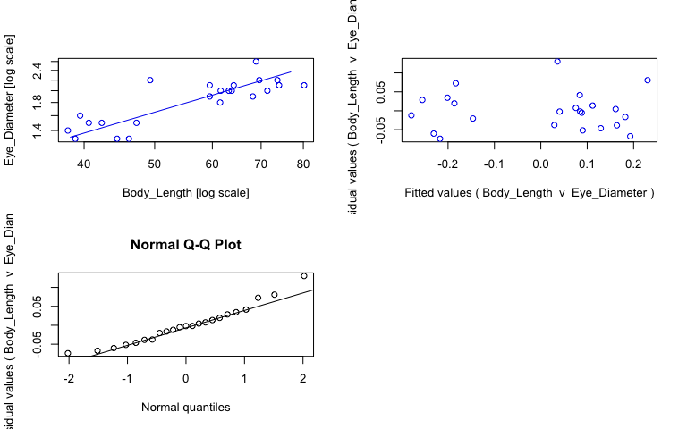<!-- -->

```r
#view fits
summary(sma_rrob)
```

```{style="max-height: 300px;"}
## Call: sma(formula = Eye_Diameter ~ Body_Length, data = rrob, log = "xy", 
##     method = "SMA", alpha = 0.05) 
## 
## Fit using Standardized Major Axis 
## 
## These variables were log-transformed before fitting: xy 
## 
## Confidence intervals (CI) are at 95%
## 
## ------------------------------------------------------------
## Coefficients:
##              elevation     slope
## estimate    -1.2073093 0.8386026
## lower limit -1.5732188 0.6553974
## upper limit -0.8413998 1.0730198
## 
## H0 : variables uncorrelated
## R-squared : 0.6989428 
## P-value : 6.7833e-07
```

```r
#save coefficients of fits as object
cc_sma_rrob <- data.frame(coef(sma_rrob))

# Make plot ------
plot_rrob <- ggplot(rrob, aes(x = Body_Length, y = Eye_Diameter, col = Preservation)) + 
  geom_point(size = 2, alpha = 0.8) + 
  scale_color_manual(values = col_pres, name = "Sample state", breaks = c("ethanol", "fresh", "paraformaldehyde")) +
  scale_x_log10(name = "Body length (mm)") + #makes x axis log scale and named
  scale_y_log10(name = "Eye diameter (mm)") + #makes y axis log scale and named
  ggtitle("Robustosergia robusta") + 
  theme_bw() +
  theme(panel.grid.major = element_blank(), panel.grid.minor = element_blank(), plot.title = element_text(face = "italic")) +
  geom_abline(data = cc_sma_rrob, aes(intercept = cc_sma_rrob[1,1], slope = cc_sma_rrob[2,1])) +
  geom_text(x = -Inf, y = Inf, hjust = -0.05, vjust = 1.5, nudge_x = 4, label = paste("b =", round(cc_sma_rrob[2,1], digits = 2), sep = " "), size = 3.5, col = "black") +
  geom_text(x = -Inf, y = Inf, hjust = -0.05, vjust = 3, label = paste("a =", round(cc_sma_rrob[1,1], digits = 2), sep = " "), size = 3.5, col = "black")

ggplotly(plot_rrob)
```

```{=html}
<div id="htmlwidget-432b7f7d01dfad9282f7" style="width:768px;height:480px;" class="plotly html-widget"></div>
<script type="application/json" data-for="htmlwidget-432b7f7d01dfad9282f7">{"x":{"data":[{"x":[1.66370092538965,1.58994960132571,1.64738297011462,1.57978359661681,1.60852603357719,1.62634036737504,1.67394199863409,1.59659709562646,1.78887511577542,1.77451696572855,1.83378437465648,1.78958071216443,1.85369821177617,1.80482067872116,1.80071707828239,1.80753502806885,1.86981820797933,1.90417436828416,1.77451696572855,1.69284691927723,1.84260923961056,1.86746748785905,1.83821922190763],"y":[0.113943352306837,0.113943352306837,0.113943352306837,0.146128035678238,0.176091259055681,0.176091259055681,0.176091259055681,0.204119982655925,0.255272505103306,0.278753600952829,0.278753600952829,0.301029995663981,0.301029995663981,0.301029995663981,0.301029995663981,0.322219294733919,0.322219294733919,0.322219294733919,0.322219294733919,0.342422680822206,0.342422680822206,0.342422680822206,0.414973347970818],"text":["Body_Length: 46.1<br />Eye_Diameter: 1.3<br />Preservation: ethanol","Body_Length: 38.9<br />Eye_Diameter: 1.3<br />Preservation: ethanol","Body_Length: 44.4<br />Eye_Diameter: 1.3<br />Preservation: ethanol","Body_Length: 38.0<br />Eye_Diameter: 1.4<br />Preservation: ethanol","Body_Length: 40.6<br />Eye_Diameter: 1.5<br />Preservation: ethanol","Body_Length: 42.3<br />Eye_Diameter: 1.5<br />Preservation: ethanol","Body_Length: 47.2<br />Eye_Diameter: 1.5<br />Preservation: ethanol","Body_Length: 39.5<br />Eye_Diameter: 1.6<br />Preservation: ethanol","Body_Length: 61.5<br />Eye_Diameter: 1.8<br />Preservation: ethanol","Body_Length: 59.5<br />Eye_Diameter: 1.9<br />Preservation: ethanol","Body_Length: 68.2<br />Eye_Diameter: 1.9<br />Preservation: ethanol","Body_Length: 61.6<br />Eye_Diameter: 2.0<br />Preservation: ethanol","Body_Length: 71.4<br />Eye_Diameter: 2.0<br />Preservation: ethanol","Body_Length: 63.8<br />Eye_Diameter: 2.0<br />Preservation: ethanol","Body_Length: 63.2<br />Eye_Diameter: 2.0<br />Preservation: ethanol","Body_Length: 64.2<br />Eye_Diameter: 2.1<br />Preservation: ethanol","Body_Length: 74.1<br />Eye_Diameter: 2.1<br />Preservation: ethanol","Body_Length: 80.2<br />Eye_Diameter: 2.1<br />Preservation: ethanol","Body_Length: 59.5<br />Eye_Diameter: 2.1<br />Preservation: ethanol","Body_Length: 49.3<br />Eye_Diameter: 2.2<br />Preservation: ethanol","Body_Length: 69.6<br />Eye_Diameter: 2.2<br />Preservation: ethanol","Body_Length: 73.7<br />Eye_Diameter: 2.2<br />Preservation: ethanol","Body_Length: 68.9<br />Eye_Diameter: 2.6<br />Preservation: ethanol"],"type":"scatter","mode":"markers","marker":{"autocolorscale":false,"color":"rgba(166,206,227,1)","opacity":0.8,"size":7.55905511811024,"symbol":"circle","line":{"width":1.88976377952756,"color":"rgba(166,206,227,1)"}},"hoveron":"points","name":"ethanol","legendgroup":"ethanol","showlegend":true,"xaxis":"x","yaxis":"y","hoverinfo":"text","frame":null},{"x":[1.56356405803344,1.56356405803344,1.92039390686753,1.92039390686753],"y":[0.103899662249623,0.103899662249623,0.403138112043298,0.403138112043298],"text":"cc_sma_rrob[1, 1]: -1.207309<br />cc_sma_rrob[2, 1]: 0.8386026","type":"scatter","mode":"lines","line":{"width":1.88976377952756,"color":"rgba(0,0,0,1)","dash":"solid"},"hoveron":"points","showlegend":false,"xaxis":"x","yaxis":"y","hoverinfo":"text","frame":null},{"x":[null,null,null,null,null,null,null,null,null,null,null,null,null,null,null,null,null,null,null,null,null,null,null],"y":[null,null,null,null,null,null,null,null,null,null,null,null,null,null,null,null,null,null,null,null,null,null,null],"text":["b = 0.84","b = 0.84","b = 0.84","b = 0.84","b = 0.84","b = 0.84","b = 0.84","b = 0.84","b = 0.84","b = 0.84","b = 0.84","b = 0.84","b = 0.84","b = 0.84","b = 0.84","b = 0.84","b = 0.84","b = 0.84","b = 0.84","b = 0.84","b = 0.84","b = 0.84","b = 0.84"],"hovertext":["Body_Length: -Inf<br />Eye_Diameter: Inf<br />Preservation: black","Body_Length: -Inf<br />Eye_Diameter: Inf<br />Preservation: black","Body_Length: -Inf<br />Eye_Diameter: Inf<br />Preservation: black","Body_Length: -Inf<br />Eye_Diameter: Inf<br />Preservation: black","Body_Length: -Inf<br />Eye_Diameter: Inf<br />Preservation: black","Body_Length: -Inf<br />Eye_Diameter: Inf<br />Preservation: black","Body_Length: -Inf<br />Eye_Diameter: Inf<br />Preservation: black","Body_Length: -Inf<br />Eye_Diameter: Inf<br />Preservation: black","Body_Length: -Inf<br />Eye_Diameter: Inf<br />Preservation: black","Body_Length: -Inf<br />Eye_Diameter: Inf<br />Preservation: black","Body_Length: -Inf<br />Eye_Diameter: Inf<br />Preservation: black","Body_Length: -Inf<br />Eye_Diameter: Inf<br />Preservation: black","Body_Length: -Inf<br />Eye_Diameter: Inf<br />Preservation: black","Body_Length: -Inf<br />Eye_Diameter: Inf<br />Preservation: black","Body_Length: -Inf<br />Eye_Diameter: Inf<br />Preservation: black","Body_Length: -Inf<br />Eye_Diameter: Inf<br />Preservation: black","Body_Length: -Inf<br />Eye_Diameter: Inf<br />Preservation: black","Body_Length: -Inf<br />Eye_Diameter: Inf<br />Preservation: black","Body_Length: -Inf<br />Eye_Diameter: Inf<br />Preservation: black","Body_Length: -Inf<br />Eye_Diameter: Inf<br />Preservation: black","Body_Length: -Inf<br />Eye_Diameter: Inf<br />Preservation: black","Body_Length: -Inf<br />Eye_Diameter: Inf<br />Preservation: black","Body_Length: -Inf<br />Eye_Diameter: Inf<br />Preservation: black"],"textfont":{"size":13.2283464566929,"color":"rgba(0,0,0,1)"},"type":"scatter","mode":"text","hoveron":"points","showlegend":false,"xaxis":"x","yaxis":"y","hoverinfo":"text","frame":null},{"x":[null,null,null,null,null,null,null,null,null,null,null,null,null,null,null,null,null,null,null,null,null,null,null],"y":[null,null,null,null,null,null,null,null,null,null,null,null,null,null,null,null,null,null,null,null,null,null,null],"text":["a = -1.21","a = -1.21","a = -1.21","a = -1.21","a = -1.21","a = -1.21","a = -1.21","a = -1.21","a = -1.21","a = -1.21","a = -1.21","a = -1.21","a = -1.21","a = -1.21","a = -1.21","a = -1.21","a = -1.21","a = -1.21","a = -1.21","a = -1.21","a = -1.21","a = -1.21","a = -1.21"],"hovertext":["Body_Length: -Inf<br />Eye_Diameter: Inf<br />Preservation: black","Body_Length: -Inf<br />Eye_Diameter: Inf<br />Preservation: black","Body_Length: -Inf<br />Eye_Diameter: Inf<br />Preservation: black","Body_Length: -Inf<br />Eye_Diameter: Inf<br />Preservation: black","Body_Length: -Inf<br />Eye_Diameter: Inf<br />Preservation: black","Body_Length: -Inf<br />Eye_Diameter: Inf<br />Preservation: black","Body_Length: -Inf<br />Eye_Diameter: Inf<br />Preservation: black","Body_Length: -Inf<br />Eye_Diameter: Inf<br />Preservation: black","Body_Length: -Inf<br />Eye_Diameter: Inf<br />Preservation: black","Body_Length: -Inf<br />Eye_Diameter: Inf<br />Preservation: black","Body_Length: -Inf<br />Eye_Diameter: Inf<br />Preservation: black","Body_Length: -Inf<br />Eye_Diameter: Inf<br />Preservation: black","Body_Length: -Inf<br />Eye_Diameter: Inf<br />Preservation: black","Body_Length: -Inf<br />Eye_Diameter: Inf<br />Preservation: black","Body_Length: -Inf<br />Eye_Diameter: Inf<br />Preservation: black","Body_Length: -Inf<br />Eye_Diameter: Inf<br />Preservation: black","Body_Length: -Inf<br />Eye_Diameter: Inf<br />Preservation: black","Body_Length: -Inf<br />Eye_Diameter: Inf<br />Preservation: black","Body_Length: -Inf<br />Eye_Diameter: Inf<br />Preservation: black","Body_Length: -Inf<br />Eye_Diameter: Inf<br />Preservation: black","Body_Length: -Inf<br />Eye_Diameter: Inf<br />Preservation: black","Body_Length: -Inf<br />Eye_Diameter: Inf<br />Preservation: black","Body_Length: -Inf<br />Eye_Diameter: Inf<br />Preservation: black"],"textfont":{"size":13.2283464566929,"color":"rgba(0,0,0,1)"},"type":"scatter","mode":"text","hoveron":"points","showlegend":false,"xaxis":"x","yaxis":"y","hoverinfo":"text","frame":null}],"layout":{"margin":{"t":45.2237442922374,"r":7.30593607305936,"b":41.6438356164384,"l":43.1050228310502},"plot_bgcolor":"rgba(255,255,255,1)","paper_bgcolor":"rgba(255,255,255,1)","font":{"color":"rgba(0,0,0,1)","family":"","size":14.6118721461187},"title":{"text":"<i> Robustosergia robusta <\/i>","font":{"color":"rgba(0,0,0,1)","family":"","size":17.5342465753425},"x":0,"xref":"paper"},"xaxis":{"domain":[0,1],"automargin":true,"type":"linear","autorange":false,"range":[1.56356405803344,1.92039390686753],"tickmode":"array","ticktext":["40","50","70"],"tickvals":[1.60205999132796,1.69897000433602,1.84509804001426],"categoryorder":"array","categoryarray":["40","50","70"],"nticks":null,"ticks":"outside","tickcolor":"rgba(51,51,51,1)","ticklen":3.65296803652968,"tickwidth":0.66417600664176,"showticklabels":true,"tickfont":{"color":"rgba(77,77,77,1)","family":"","size":11.689497716895},"tickangle":-0,"showline":false,"linecolor":null,"linewidth":0,"showgrid":false,"gridcolor":null,"gridwidth":0,"zeroline":false,"anchor":"y","title":{"text":"Body length (mm)","font":{"color":"rgba(0,0,0,1)","family":"","size":14.6118721461187}},"hoverformat":".2f"},"yaxis":{"domain":[0,1],"automargin":true,"type":"linear","autorange":false,"range":[0.0988918525236377,0.430024847754017],"tickmode":"array","ticktext":["1.6","2.0","2.4"],"tickvals":[0.204119982655925,0.301029995663981,0.380211241711606],"categoryorder":"array","categoryarray":["1.6","2.0","2.4"],"nticks":null,"ticks":"outside","tickcolor":"rgba(51,51,51,1)","ticklen":3.65296803652968,"tickwidth":0.66417600664176,"showticklabels":true,"tickfont":{"color":"rgba(77,77,77,1)","family":"","size":11.689497716895},"tickangle":-0,"showline":false,"linecolor":null,"linewidth":0,"showgrid":false,"gridcolor":null,"gridwidth":0,"zeroline":false,"anchor":"x","title":{"text":"Eye diameter (mm)","font":{"color":"rgba(0,0,0,1)","family":"","size":14.6118721461187}},"hoverformat":".2f"},"shapes":[{"type":"rect","fillcolor":"transparent","line":{"color":"rgba(51,51,51,1)","width":0.66417600664176,"linetype":"solid"},"yref":"paper","xref":"paper","x0":0,"x1":1,"y0":0,"y1":1}],"showlegend":true,"legend":{"bgcolor":"rgba(255,255,255,1)","bordercolor":"transparent","borderwidth":1.88976377952756,"font":{"color":"rgba(0,0,0,1)","family":"","size":11.689497716895},"title":{"text":"Sample state","font":{"color":"rgba(0,0,0,1)","family":"","size":14.6118721461187}}},"hovermode":"closest","barmode":"relative"},"config":{"doubleClick":"reset","modeBarButtonsToAdd":["hoverclosest","hovercompare"],"showSendToCloud":false},"source":"A","attrs":{"20147910f234":{"x":{},"y":{},"colour":{},"type":"scatter"},"2014478d7204":{"intercept":{},"slope":{}},"20141738894f":{"x":{},"y":{},"colour":{}},"2014bead72":{"x":{},"y":{},"colour":{}}},"cur_data":"20147910f234","visdat":{"20147910f234":["function (y) ","x"],"2014478d7204":["function (y) ","x"],"20141738894f":["function (y) ","x"],"2014bead72":["function (y) ","x"]},"highlight":{"on":"plotly_click","persistent":false,"dynamic":false,"selectize":false,"opacityDim":0.2,"selected":{"opacity":1},"debounce":0},"shinyEvents":["plotly_hover","plotly_click","plotly_selected","plotly_relayout","plotly_brushed","plotly_brushing","plotly_clickannotation","plotly_doubleclick","plotly_deselect","plotly_afterplot","plotly_sunburstclick"],"base_url":"https://plot.ly"},"evals":[],"jsHooks":[]}</script>
```

## _Robustosergia regalis_


```r
# Subset data -----
rreg <- specimens %>% filter(genus_species == "Robustosergia_regalis")

# Fit SMA model ------
sma_rreg <- sma(formula = Eye_Diameter ~ Body_Length, 
            data = rreg, 
            log = "xy", #sets both x and y variables as logged
            method="SMA", #defines SMA as model
            alpha = 0.05)

#plot fit, residuals, qq
par(mfrow = c(2,2)) #make plot window 2x2
plot(sma_rreg, which = "default",type = "o") 
plot(sma_rreg, which = "residual",type = "o")
plot(sma_rreg, which = "qq", type = "o")
par(mfrow = c(1,1)) 
```

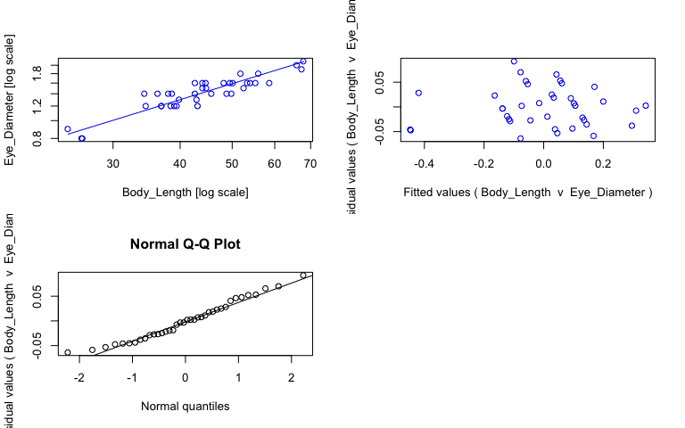<!-- -->

```r
#view fits
summary(sma_rreg)
```

```{style="max-height: 300px;"}
## Call: sma(formula = Eye_Diameter ~ Body_Length, data = rreg, log = "xy", 
##     method = "SMA", alpha = 0.05) 
## 
## Fit using Standardized Major Axis 
## 
## These variables were log-transformed before fitting: xy 
## 
## Confidence intervals (CI) are at 95%
## 
## ------------------------------------------------------------
## Coefficients:
##             elevation     slope
## estimate    -1.324440 0.8978007
## lower limit -1.531510 0.7807317
## upper limit -1.117369 1.0324239
## 
## H0 : variables uncorrelated
## R-squared : 0.8280327 
## P-value : 2.4971e-15
```

```r
#save coefficients of fits as object
cc_sma_rreg <- data.frame(coef(sma_rreg))

# Make plot ------
plot_rreg <- ggplot(rreg, aes(x = Body_Length, y = Eye_Diameter, col = Preservation)) + 
  geom_point(size = 2, alpha = 0.8) + 
  scale_color_manual(values = col_pres, name = "Sample state", breaks = c("ethanol", "fresh", "paraformaldehyde")) +
  scale_x_log10(name = "Body length (mm)") + #makes x axis log scale and named
  scale_y_log10(name = "Eye diameter (mm)") + #makes y axis log scale and named
  ggtitle("Robustosergia regalis") + 
  theme_bw() +
  theme(panel.grid.major = element_blank(), panel.grid.minor = element_blank(), plot.title = element_text(face = "italic")) +
  geom_abline(data = cc_sma_rreg, aes(intercept = cc_sma_rreg[1,1], slope = cc_sma_rreg[2,1])) +
  geom_text(x = -Inf, y = Inf, hjust = -0.05, vjust = 1.5, nudge_x = 4, label = paste("b =", round(cc_sma_rreg[2,1], digits = 2), sep = " "), size = 3.5, col = "black") +
  geom_text(x = -Inf, y = Inf, hjust = -0.05, vjust = 3, label = paste("a =", round(cc_sma_rreg[1,1], digits = 2), sep = " "), size = 3.5, col = "black")

ggplotly(plot_rreg)
```

```{=html}
<div id="htmlwidget-7ee6bb8fdc34c64a1761" style="width:768px;height:480px;" class="plotly html-widget"></div>
<script type="application/json" data-for="htmlwidget-7ee6bb8fdc34c64a1761">{"x":{"data":[{"x":[1.41830129131975,1.41995574848976,1.39269695325967,1.53781909507327,1.58433122436753,1.63447727016073,1.56702636615906,1.56702636615906,1.59549622182557,1.59988307207369,1.63245729218472,1.55990662503611,1.53529412004277,1.68841982200271,1.62940959910272,1.57978359661681,1.64345267648619,1.72672720902657,1.76789761601809,1.73239375982297,1.7419390777292,1.68304703823885,1.64345267648619,1.74741180788642,1.82801506422398,1.81888541459401,1.83122969386706],"y":[-0.0969100130080564,-0.0969100130080564,-0.0457574905606751,0.0791812460476248,0.0791812460476248,0.0791812460476248,0.0791812460476248,0.0791812460476248,0.0791812460476248,0.113943352306837,0.113943352306837,0.146128035678238,0.146128035678238,0.146128035678238,0.146128035678238,0.146128035678238,0.176091259055681,0.204119982655925,0.204119982655925,0.204119982655925,0.204119982655925,0.204119982655925,0.204119982655925,0.255272505103306,0.278753600952829,0.301029995663981,0.322219294733919],"text":["Body_Length: 26.2<br />Eye_Diameter: 0.8<br />Preservation: ethanol","Body_Length: 26.3<br />Eye_Diameter: 0.8<br />Preservation: ethanol","Body_Length: 24.7<br />Eye_Diameter: 0.9<br />Preservation: ethanol","Body_Length: 34.5<br />Eye_Diameter: 1.2<br />Preservation: ethanol","Body_Length: 38.4<br />Eye_Diameter: 1.2<br />Preservation: ethanol","Body_Length: 43.1<br />Eye_Diameter: 1.2<br />Preservation: ethanol","Body_Length: 36.9<br />Eye_Diameter: 1.2<br />Preservation: ethanol","Body_Length: 36.9<br />Eye_Diameter: 1.2<br />Preservation: ethanol","Body_Length: 39.4<br />Eye_Diameter: 1.2<br />Preservation: ethanol","Body_Length: 39.8<br />Eye_Diameter: 1.3<br />Preservation: ethanol","Body_Length: 42.9<br />Eye_Diameter: 1.3<br />Preservation: ethanol","Body_Length: 36.3<br />Eye_Diameter: 1.4<br />Preservation: ethanol","Body_Length: 34.3<br />Eye_Diameter: 1.4<br />Preservation: ethanol","Body_Length: 48.8<br />Eye_Diameter: 1.4<br />Preservation: ethanol","Body_Length: 42.6<br />Eye_Diameter: 1.4<br />Preservation: ethanol","Body_Length: 38.0<br />Eye_Diameter: 1.4<br />Preservation: ethanol","Body_Length: 44.0<br />Eye_Diameter: 1.5<br />Preservation: ethanol","Body_Length: 53.3<br />Eye_Diameter: 1.6<br />Preservation: ethanol","Body_Length: 58.6<br />Eye_Diameter: 1.6<br />Preservation: ethanol","Body_Length: 54.0<br />Eye_Diameter: 1.6<br />Preservation: ethanol","Body_Length: 55.2<br />Eye_Diameter: 1.6<br />Preservation: ethanol","Body_Length: 48.2<br />Eye_Diameter: 1.6<br />Preservation: ethanol","Body_Length: 44.0<br />Eye_Diameter: 1.6<br />Preservation: ethanol","Body_Length: 55.9<br />Eye_Diameter: 1.8<br />Preservation: ethanol","Body_Length: 67.3<br />Eye_Diameter: 1.9<br />Preservation: ethanol","Body_Length: 65.9<br />Eye_Diameter: 2.0<br />Preservation: ethanol","Body_Length: 67.8<br />Eye_Diameter: 2.1<br />Preservation: ethanol"],"type":"scatter","mode":"markers","marker":{"autocolorscale":false,"color":"rgba(166,206,227,1)","opacity":0.8,"size":7.55905511811024,"symbol":"circle","line":{"width":1.88976377952756,"color":"rgba(166,206,227,1)"}},"hoveron":"points","name":"ethanol","legendgroup":"ethanol","showlegend":true,"xaxis":"x","yaxis":"y","hoverinfo":"text","frame":null},{"x":[1.5910646070265,1.58658730467175,1.69722934275972,1.65991620006985,1.65030752313194,1.72015930340596,1.69460519893357,1.64933485871214,1.69983772586725,1.62940959910272,1.71432975974523],"y":[0.0791812460476248,0.146128035678238,0.146128035678238,0.146128035678238,0.176091259055681,0.176091259055681,0.204119982655925,0.204119982655925,0.204119982655925,0.204119982655925,0.255272505103306],"text":["Body_Length: 39.0<br />Eye_Diameter: 1.2<br />Preservation: fresh","Body_Length: 38.6<br />Eye_Diameter: 1.4<br />Preservation: fresh","Body_Length: 49.8<br />Eye_Diameter: 1.4<br />Preservation: fresh","Body_Length: 45.7<br />Eye_Diameter: 1.4<br />Preservation: fresh","Body_Length: 44.7<br />Eye_Diameter: 1.5<br />Preservation: fresh","Body_Length: 52.5<br />Eye_Diameter: 1.5<br />Preservation: fresh","Body_Length: 49.5<br />Eye_Diameter: 1.6<br />Preservation: fresh","Body_Length: 44.6<br />Eye_Diameter: 1.6<br />Preservation: fresh","Body_Length: 50.1<br />Eye_Diameter: 1.6<br />Preservation: fresh","Body_Length: 42.6<br />Eye_Diameter: 1.6<br />Preservation: fresh","Body_Length: 51.8<br />Eye_Diameter: 1.8<br />Preservation: fresh"],"type":"scatter","mode":"markers","marker":{"autocolorscale":false,"color":"rgba(178,223,138,1)","opacity":0.8,"size":7.55905511811024,"symbol":"circle","line":{"width":1.88976377952756,"color":"rgba(178,223,138,1)"}},"hoveron":"points","name":"fresh","legendgroup":"fresh","showlegend":true,"xaxis":"x","yaxis":"y","hoverinfo":"text","frame":null},{"x":[1.3707703162293,1.3707703162293,1.85315633089743,1.85315633089743],"y":[-0.0937611089273527,-0.0937611089273527,0.339325377277223,0.339325377277223],"text":"cc_sma_rreg[1, 1]: -1.32444<br />cc_sma_rreg[2, 1]: 0.8978007","type":"scatter","mode":"lines","line":{"width":1.88976377952756,"color":"rgba(0,0,0,1)","dash":"solid"},"hoveron":"points","showlegend":false,"xaxis":"x","yaxis":"y","hoverinfo":"text","frame":null},{"x":[null,null,null,null,null,null,null,null,null,null,null,null,null,null,null,null,null,null,null,null,null,null,null,null,null,null,null,null,null,null,null,null,null,null,null,null,null,null],"y":[null,null,null,null,null,null,null,null,null,null,null,null,null,null,null,null,null,null,null,null,null,null,null,null,null,null,null,null,null,null,null,null,null,null,null,null,null,null],"text":["b = 0.9","b = 0.9","b = 0.9","b = 0.9","b = 0.9","b = 0.9","b = 0.9","b = 0.9","b = 0.9","b = 0.9","b = 0.9","b = 0.9","b = 0.9","b = 0.9","b = 0.9","b = 0.9","b = 0.9","b = 0.9","b = 0.9","b = 0.9","b = 0.9","b = 0.9","b = 0.9","b = 0.9","b = 0.9","b = 0.9","b = 0.9","b = 0.9","b = 0.9","b = 0.9","b = 0.9","b = 0.9","b = 0.9","b = 0.9","b = 0.9","b = 0.9","b = 0.9","b = 0.9"],"hovertext":["Body_Length: -Inf<br />Eye_Diameter: Inf<br />Preservation: black","Body_Length: -Inf<br />Eye_Diameter: Inf<br />Preservation: black","Body_Length: -Inf<br />Eye_Diameter: Inf<br />Preservation: black","Body_Length: -Inf<br />Eye_Diameter: Inf<br />Preservation: black","Body_Length: -Inf<br />Eye_Diameter: Inf<br />Preservation: black","Body_Length: -Inf<br />Eye_Diameter: Inf<br />Preservation: black","Body_Length: -Inf<br />Eye_Diameter: Inf<br />Preservation: black","Body_Length: -Inf<br />Eye_Diameter: Inf<br />Preservation: black","Body_Length: -Inf<br />Eye_Diameter: Inf<br />Preservation: black","Body_Length: -Inf<br />Eye_Diameter: Inf<br />Preservation: black","Body_Length: -Inf<br />Eye_Diameter: Inf<br />Preservation: black","Body_Length: -Inf<br />Eye_Diameter: Inf<br />Preservation: black","Body_Length: -Inf<br />Eye_Diameter: Inf<br />Preservation: black","Body_Length: -Inf<br />Eye_Diameter: Inf<br />Preservation: black","Body_Length: -Inf<br />Eye_Diameter: Inf<br />Preservation: black","Body_Length: -Inf<br />Eye_Diameter: Inf<br />Preservation: black","Body_Length: -Inf<br />Eye_Diameter: Inf<br />Preservation: black","Body_Length: -Inf<br />Eye_Diameter: Inf<br />Preservation: black","Body_Length: -Inf<br />Eye_Diameter: Inf<br />Preservation: black","Body_Length: -Inf<br />Eye_Diameter: Inf<br />Preservation: black","Body_Length: -Inf<br />Eye_Diameter: Inf<br />Preservation: black","Body_Length: -Inf<br />Eye_Diameter: Inf<br />Preservation: black","Body_Length: -Inf<br />Eye_Diameter: Inf<br />Preservation: black","Body_Length: -Inf<br />Eye_Diameter: Inf<br />Preservation: black","Body_Length: -Inf<br />Eye_Diameter: Inf<br />Preservation: black","Body_Length: -Inf<br />Eye_Diameter: Inf<br />Preservation: black","Body_Length: -Inf<br />Eye_Diameter: Inf<br />Preservation: black","Body_Length: -Inf<br />Eye_Diameter: Inf<br />Preservation: black","Body_Length: -Inf<br />Eye_Diameter: Inf<br />Preservation: black","Body_Length: -Inf<br />Eye_Diameter: Inf<br />Preservation: black","Body_Length: -Inf<br />Eye_Diameter: Inf<br />Preservation: black","Body_Length: -Inf<br />Eye_Diameter: Inf<br />Preservation: black","Body_Length: -Inf<br />Eye_Diameter: Inf<br />Preservation: black","Body_Length: -Inf<br />Eye_Diameter: Inf<br />Preservation: black","Body_Length: -Inf<br />Eye_Diameter: Inf<br />Preservation: black","Body_Length: -Inf<br />Eye_Diameter: Inf<br />Preservation: black","Body_Length: -Inf<br />Eye_Diameter: Inf<br />Preservation: black","Body_Length: -Inf<br />Eye_Diameter: Inf<br />Preservation: black"],"textfont":{"size":13.2283464566929,"color":"rgba(0,0,0,1)"},"type":"scatter","mode":"text","hoveron":"points","showlegend":false,"xaxis":"x","yaxis":"y","hoverinfo":"text","frame":null},{"x":[null,null,null,null,null,null,null,null,null,null,null,null,null,null,null,null,null,null,null,null,null,null,null,null,null,null,null,null,null,null,null,null,null,null,null,null,null,null],"y":[null,null,null,null,null,null,null,null,null,null,null,null,null,null,null,null,null,null,null,null,null,null,null,null,null,null,null,null,null,null,null,null,null,null,null,null,null,null],"text":["a = -1.32","a = -1.32","a = -1.32","a = -1.32","a = -1.32","a = -1.32","a = -1.32","a = -1.32","a = -1.32","a = -1.32","a = -1.32","a = -1.32","a = -1.32","a = -1.32","a = -1.32","a = -1.32","a = -1.32","a = -1.32","a = -1.32","a = -1.32","a = -1.32","a = -1.32","a = -1.32","a = -1.32","a = -1.32","a = -1.32","a = -1.32","a = -1.32","a = -1.32","a = -1.32","a = -1.32","a = -1.32","a = -1.32","a = -1.32","a = -1.32","a = -1.32","a = -1.32","a = -1.32"],"hovertext":["Body_Length: -Inf<br />Eye_Diameter: Inf<br />Preservation: black","Body_Length: -Inf<br />Eye_Diameter: Inf<br />Preservation: black","Body_Length: -Inf<br />Eye_Diameter: Inf<br />Preservation: black","Body_Length: -Inf<br />Eye_Diameter: Inf<br />Preservation: black","Body_Length: -Inf<br />Eye_Diameter: Inf<br />Preservation: black","Body_Length: -Inf<br />Eye_Diameter: Inf<br />Preservation: black","Body_Length: -Inf<br />Eye_Diameter: Inf<br />Preservation: black","Body_Length: -Inf<br />Eye_Diameter: Inf<br />Preservation: black","Body_Length: -Inf<br />Eye_Diameter: Inf<br />Preservation: black","Body_Length: -Inf<br />Eye_Diameter: Inf<br />Preservation: black","Body_Length: -Inf<br />Eye_Diameter: Inf<br />Preservation: black","Body_Length: -Inf<br />Eye_Diameter: Inf<br />Preservation: black","Body_Length: -Inf<br />Eye_Diameter: Inf<br />Preservation: black","Body_Length: -Inf<br />Eye_Diameter: Inf<br />Preservation: black","Body_Length: -Inf<br />Eye_Diameter: Inf<br />Preservation: black","Body_Length: -Inf<br />Eye_Diameter: Inf<br />Preservation: black","Body_Length: -Inf<br />Eye_Diameter: Inf<br />Preservation: black","Body_Length: -Inf<br />Eye_Diameter: Inf<br />Preservation: black","Body_Length: -Inf<br />Eye_Diameter: Inf<br />Preservation: black","Body_Length: -Inf<br />Eye_Diameter: Inf<br />Preservation: black","Body_Length: -Inf<br />Eye_Diameter: Inf<br />Preservation: black","Body_Length: -Inf<br />Eye_Diameter: Inf<br />Preservation: black","Body_Length: -Inf<br />Eye_Diameter: Inf<br />Preservation: black","Body_Length: -Inf<br />Eye_Diameter: Inf<br />Preservation: black","Body_Length: -Inf<br />Eye_Diameter: Inf<br />Preservation: black","Body_Length: -Inf<br />Eye_Diameter: Inf<br />Preservation: black","Body_Length: -Inf<br />Eye_Diameter: Inf<br />Preservation: black","Body_Length: -Inf<br />Eye_Diameter: Inf<br />Preservation: black","Body_Length: -Inf<br />Eye_Diameter: Inf<br />Preservation: black","Body_Length: -Inf<br />Eye_Diameter: Inf<br />Preservation: black","Body_Length: -Inf<br />Eye_Diameter: Inf<br />Preservation: black","Body_Length: -Inf<br />Eye_Diameter: Inf<br />Preservation: black","Body_Length: -Inf<br />Eye_Diameter: Inf<br />Preservation: black","Body_Length: -Inf<br />Eye_Diameter: Inf<br />Preservation: black","Body_Length: -Inf<br />Eye_Diameter: Inf<br />Preservation: black","Body_Length: -Inf<br />Eye_Diameter: Inf<br />Preservation: black","Body_Length: -Inf<br />Eye_Diameter: Inf<br />Preservation: black","Body_Length: -Inf<br />Eye_Diameter: Inf<br />Preservation: black"],"textfont":{"size":13.2283464566929,"color":"rgba(0,0,0,1)"},"type":"scatter","mode":"text","hoveron":"points","showlegend":false,"xaxis":"x","yaxis":"y","hoverinfo":"text","frame":null}],"layout":{"margin":{"t":45.2237442922374,"r":7.30593607305936,"b":41.6438356164384,"l":43.1050228310502},"plot_bgcolor":"rgba(255,255,255,1)","paper_bgcolor":"rgba(255,255,255,1)","font":{"color":"rgba(0,0,0,1)","family":"","size":14.6118721461187},"title":{"text":"<i> Robustosergia regalis <\/i>","font":{"color":"rgba(0,0,0,1)","family":"","size":17.5342465753425},"x":0,"xref":"paper"},"xaxis":{"domain":[0,1],"automargin":true,"type":"linear","autorange":false,"range":[1.3707703162293,1.85315633089743],"tickmode":"array","ticktext":["30","50","70"],"tickvals":[1.47712125471966,1.69897000433602,1.84509804001426],"categoryorder":"array","categoryarray":["30","50","70"],"nticks":null,"ticks":"outside","tickcolor":"rgba(51,51,51,1)","ticklen":3.65296803652968,"tickwidth":0.66417600664176,"showticklabels":true,"tickfont":{"color":"rgba(77,77,77,1)","family":"","size":11.689497716895},"tickangle":-0,"showline":false,"linecolor":null,"linewidth":0,"showgrid":false,"gridcolor":null,"gridwidth":0,"zeroline":false,"anchor":"y","title":{"text":"Body length (mm)","font":{"color":"rgba(0,0,0,1)","family":"","size":14.6118721461187}},"hoverformat":".2f"},"yaxis":{"domain":[0,1],"automargin":true,"type":"linear","autorange":false,"range":[-0.117866478395155,0.343175760121018],"tickmode":"array","ticktext":["0.8","1.0","2.0"],"tickvals":[-0.0969100130080564,-1.38777878078145e-17,0.301029995663981],"categoryorder":"array","categoryarray":["0.8","1.0","2.0"],"nticks":null,"ticks":"outside","tickcolor":"rgba(51,51,51,1)","ticklen":3.65296803652968,"tickwidth":0.66417600664176,"showticklabels":true,"tickfont":{"color":"rgba(77,77,77,1)","family":"","size":11.689497716895},"tickangle":-0,"showline":false,"linecolor":null,"linewidth":0,"showgrid":false,"gridcolor":null,"gridwidth":0,"zeroline":false,"anchor":"x","title":{"text":"Eye diameter (mm)","font":{"color":"rgba(0,0,0,1)","family":"","size":14.6118721461187}},"hoverformat":".2f"},"shapes":[{"type":"rect","fillcolor":"transparent","line":{"color":"rgba(51,51,51,1)","width":0.66417600664176,"linetype":"solid"},"yref":"paper","xref":"paper","x0":0,"x1":1,"y0":0,"y1":1}],"showlegend":true,"legend":{"bgcolor":"rgba(255,255,255,1)","bordercolor":"transparent","borderwidth":1.88976377952756,"font":{"color":"rgba(0,0,0,1)","family":"","size":11.689497716895},"title":{"text":"Sample state","font":{"color":"rgba(0,0,0,1)","family":"","size":14.6118721461187}}},"hovermode":"closest","barmode":"relative"},"config":{"doubleClick":"reset","modeBarButtonsToAdd":["hoverclosest","hovercompare"],"showSendToCloud":false},"source":"A","attrs":{"2014745a8c98":{"x":{},"y":{},"colour":{},"type":"scatter"},"201464c48ad5":{"intercept":{},"slope":{}},"20142376d9a2":{"x":{},"y":{},"colour":{}},"20144fca2cde":{"x":{},"y":{},"colour":{}}},"cur_data":"2014745a8c98","visdat":{"2014745a8c98":["function (y) ","x"],"201464c48ad5":["function (y) ","x"],"20142376d9a2":["function (y) ","x"],"20144fca2cde":["function (y) ","x"]},"highlight":{"on":"plotly_click","persistent":false,"dynamic":false,"selectize":false,"opacityDim":0.2,"selected":{"opacity":1},"debounce":0},"shinyEvents":["plotly_hover","plotly_click","plotly_selected","plotly_relayout","plotly_brushed","plotly_brushing","plotly_clickannotation","plotly_doubleclick","plotly_deselect","plotly_afterplot","plotly_sunburstclick"],"base_url":"https://plot.ly"},"evals":[],"jsHooks":[]}</script>
```

## _Sergestes atlanticus_


```r
# Subset data -----
satl <- specimens %>% filter(genus_species == "Sergestes_atlanticus")

# Fit SMA model ------
sma_satl <- sma(formula = Eye_Diameter ~ Body_Length, 
            data = satl, 
            log = "xy", #sets both x and y variables as logged
            method="SMA", #defines SMA as model
            alpha = 0.05)

#plot fit, residuals, qq
par(mfrow = c(2,2)) #make plot window 2x2
plot(sma_satl, which = "default",type = "o") 
plot(sma_satl, which = "residual",type = "o")
plot(sma_satl, which = "qq", type = "o")
par(mfrow = c(1,1)) 
```

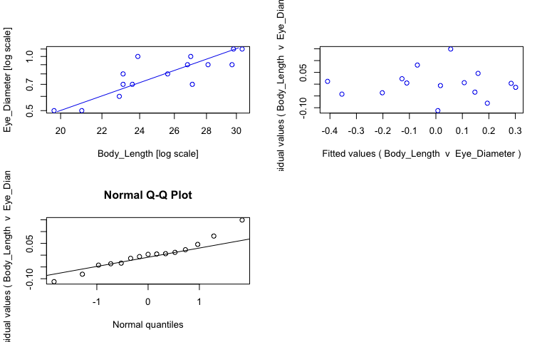<!-- -->

```r
#view fits
summary(sma_satl)
```

```{style="max-height: 300px;"}
## Call: sma(formula = Eye_Diameter ~ Body_Length, data = satl, log = "xy", 
##     method = "SMA", alpha = 0.05) 
## 
## Fit using Standardized Major Axis 
## 
## These variables were log-transformed before fitting: xy 
## 
## Confidence intervals (CI) are at 95%
## 
## ------------------------------------------------------------
## Coefficients:
##             elevation    slope
## estimate    -2.839127 1.951572
## lower limit -3.727822 1.418514
## upper limit -1.950431 2.684945
## 
## H0 : variables uncorrelated
## R-squared : 0.7067609 
## P-value : 8.6609e-05
```

```r
#save coefficients of fits as object
cc_sma_satl <- data.frame(coef(sma_satl))

# Make plot ------
plot_satl <- ggplot(satl, aes(x = Body_Length, y = Eye_Diameter, col = Preservation)) + 
  geom_point(size = 2, alpha = 0.8) + 
  scale_color_manual(values = col_pres, name = "Sample state", breaks = c("ethanol", "fresh", "paraformaldehyde")) +
  scale_x_log10(name = "Body length (mm)") + #makes x axis log scale and named
  scale_y_log10(name = "Eye diameter (mm)") + #makes y axis log scale and named
  ggtitle("Sergestes atlanticus") + 
  theme_bw() +
  theme(panel.grid.major = element_blank(), panel.grid.minor = element_blank(), plot.title = element_text(face = "italic")) +
  geom_abline(data = cc_sma_satl, aes(intercept = cc_sma_satl[1,1], slope = cc_sma_satl[2,1])) +
  geom_text(x = -Inf, y = Inf, hjust = -0.05, vjust = 1.5, nudge_x = 4, label = paste("b =", round(cc_sma_satl[2,1], digits = 2), sep = " "), size = 3.5, col = "black") +
  geom_text(x = -Inf, y = Inf, hjust = -0.05, vjust = 3, label = paste("a =", round(cc_sma_satl[1,1], digits = 2), sep = " "), size = 3.5, col = "black")

ggplotly(plot_satl)
```

```{=html}
<div id="htmlwidget-c9b4086ed4fd517dfae9" style="width:768px;height:480px;" class="plotly html-widget"></div>
<script type="application/json" data-for="htmlwidget-c9b4086ed4fd517dfae9">{"x":{"data":[{"x":[1.29446622616159,1.32221929473392,1.35983548233989,1.43296929087441,1.37291200297011],"y":[-0.301029995663981,-0.301029995663981,-0.221848749616356,-0.154901959985743,-0.154901959985743],"text":["Body_Length: 19.7<br />Eye_Diameter: 0.5<br />Preservation: ethanol","Body_Length: 21.0<br />Eye_Diameter: 0.5<br />Preservation: ethanol","Body_Length: 22.9<br />Eye_Diameter: 0.6<br />Preservation: ethanol","Body_Length: 27.1<br />Eye_Diameter: 0.7<br />Preservation: ethanol","Body_Length: 23.6<br />Eye_Diameter: 0.7<br />Preservation: ethanol"],"type":"scatter","mode":"markers","marker":{"autocolorscale":false,"color":"rgba(166,206,227,1)","opacity":0.8,"size":7.55905511811024,"symbol":"circle","line":{"width":1.88976377952756,"color":"rgba(166,206,227,1)"}},"hoveron":"points","name":"ethanol","legendgroup":"ethanol","showlegend":true,"xaxis":"x","yaxis":"y","hoverinfo":"text","frame":null},{"x":[1.36361197989214,1.36361197989214,1.40823996531185,1.47275644931721,1.44870631990508,1.42813479402879],"y":[-0.154901959985743,-0.0969100130080564,-0.0969100130080564,-0.0457574905606751,-0.0457574905606751,-0.0457574905606751],"text":["Body_Length: 23.1<br />Eye_Diameter: 0.7<br />Preservation: fresh","Body_Length: 23.1<br />Eye_Diameter: 0.8<br />Preservation: fresh","Body_Length: 25.6<br />Eye_Diameter: 0.8<br />Preservation: fresh","Body_Length: 29.7<br />Eye_Diameter: 0.9<br />Preservation: fresh","Body_Length: 28.1<br />Eye_Diameter: 0.9<br />Preservation: fresh","Body_Length: 26.8<br />Eye_Diameter: 0.9<br />Preservation: fresh"],"type":"scatter","mode":"markers","marker":{"autocolorscale":false,"color":"rgba(178,223,138,1)","opacity":0.8,"size":7.55905511811024,"symbol":"circle","line":{"width":1.88976377952756,"color":"rgba(178,223,138,1)"}},"hoveron":"points","name":"fresh","legendgroup":"fresh","showlegend":true,"xaxis":"x","yaxis":"y","hoverinfo":"text","frame":null},{"x":[1.43136376415899,1.37839790094814,1.47421626407626,1.48287358360875],"y":[0,0,0.0413926851582251,0.0413926851582251],"text":["Body_Length: 27.0<br />Eye_Diameter: 1.0<br />Preservation: paraformaldehyde","Body_Length: 23.9<br />Eye_Diameter: 1.0<br />Preservation: paraformaldehyde","Body_Length: 29.8<br />Eye_Diameter: 1.1<br />Preservation: paraformaldehyde","Body_Length: 30.4<br />Eye_Diameter: 1.1<br />Preservation: paraformaldehyde"],"type":"scatter","mode":"markers","marker":{"autocolorscale":false,"color":"rgba(31,120,180,1)","opacity":0.8,"size":7.55905511811024,"symbol":"circle","line":{"width":1.88976377952756,"color":"rgba(31,120,180,1)"}},"hoveron":"points","name":"paraformaldehyde","legendgroup":"paraformaldehyde","showlegend":true,"xaxis":"x","yaxis":"y","hoverinfo":"text","frame":null},{"x":[1.28504585828923,1.28504585828923,1.49229395148111,1.49229395148111],"y":[-0.331267298850152,-0.331267298850152,0.0731922410029986,0.0731922410029986],"text":"cc_sma_satl[1, 1]: -2.839127<br />cc_sma_satl[2, 1]: 1.951572","type":"scatter","mode":"lines","line":{"width":1.88976377952756,"color":"rgba(0,0,0,1)","dash":"solid"},"hoveron":"points","showlegend":false,"xaxis":"x","yaxis":"y","hoverinfo":"text","frame":null},{"x":[null,null,null,null,null,null,null,null,null,null,null,null,null,null,null],"y":[null,null,null,null,null,null,null,null,null,null,null,null,null,null,null],"text":["b = 1.95","b = 1.95","b = 1.95","b = 1.95","b = 1.95","b = 1.95","b = 1.95","b = 1.95","b = 1.95","b = 1.95","b = 1.95","b = 1.95","b = 1.95","b = 1.95","b = 1.95"],"hovertext":["Body_Length: -Inf<br />Eye_Diameter: Inf<br />Preservation: black","Body_Length: -Inf<br />Eye_Diameter: Inf<br />Preservation: black","Body_Length: -Inf<br />Eye_Diameter: Inf<br />Preservation: black","Body_Length: -Inf<br />Eye_Diameter: Inf<br />Preservation: black","Body_Length: -Inf<br />Eye_Diameter: Inf<br />Preservation: black","Body_Length: -Inf<br />Eye_Diameter: Inf<br />Preservation: black","Body_Length: -Inf<br />Eye_Diameter: Inf<br />Preservation: black","Body_Length: -Inf<br />Eye_Diameter: Inf<br />Preservation: black","Body_Length: -Inf<br />Eye_Diameter: Inf<br />Preservation: black","Body_Length: -Inf<br />Eye_Diameter: Inf<br />Preservation: black","Body_Length: -Inf<br />Eye_Diameter: Inf<br />Preservation: black","Body_Length: -Inf<br />Eye_Diameter: Inf<br />Preservation: black","Body_Length: -Inf<br />Eye_Diameter: Inf<br />Preservation: black","Body_Length: -Inf<br />Eye_Diameter: Inf<br />Preservation: black","Body_Length: -Inf<br />Eye_Diameter: Inf<br />Preservation: black"],"textfont":{"size":13.2283464566929,"color":"rgba(0,0,0,1)"},"type":"scatter","mode":"text","hoveron":"points","showlegend":false,"xaxis":"x","yaxis":"y","hoverinfo":"text","frame":null},{"x":[null,null,null,null,null,null,null,null,null,null,null,null,null,null,null],"y":[null,null,null,null,null,null,null,null,null,null,null,null,null,null,null],"text":["a = -2.84","a = -2.84","a = -2.84","a = -2.84","a = -2.84","a = -2.84","a = -2.84","a = -2.84","a = -2.84","a = -2.84","a = -2.84","a = -2.84","a = -2.84","a = -2.84","a = -2.84"],"hovertext":["Body_Length: -Inf<br />Eye_Diameter: Inf<br />Preservation: black","Body_Length: -Inf<br />Eye_Diameter: Inf<br />Preservation: black","Body_Length: -Inf<br />Eye_Diameter: Inf<br />Preservation: black","Body_Length: -Inf<br />Eye_Diameter: Inf<br />Preservation: black","Body_Length: -Inf<br />Eye_Diameter: Inf<br />Preservation: black","Body_Length: -Inf<br />Eye_Diameter: Inf<br />Preservation: black","Body_Length: -Inf<br />Eye_Diameter: Inf<br />Preservation: black","Body_Length: -Inf<br />Eye_Diameter: Inf<br />Preservation: black","Body_Length: -Inf<br />Eye_Diameter: Inf<br />Preservation: black","Body_Length: -Inf<br />Eye_Diameter: Inf<br />Preservation: black","Body_Length: -Inf<br />Eye_Diameter: Inf<br />Preservation: black","Body_Length: -Inf<br />Eye_Diameter: Inf<br />Preservation: black","Body_Length: -Inf<br />Eye_Diameter: Inf<br />Preservation: black","Body_Length: -Inf<br />Eye_Diameter: Inf<br />Preservation: black","Body_Length: -Inf<br />Eye_Diameter: Inf<br />Preservation: black"],"textfont":{"size":13.2283464566929,"color":"rgba(0,0,0,1)"},"type":"scatter","mode":"text","hoveron":"points","showlegend":false,"xaxis":"x","yaxis":"y","hoverinfo":"text","frame":null}],"layout":{"margin":{"t":45.2237442922374,"r":7.30593607305936,"b":41.6438356164384,"l":43.1050228310502},"plot_bgcolor":"rgba(255,255,255,1)","paper_bgcolor":"rgba(255,255,255,1)","font":{"color":"rgba(0,0,0,1)","family":"","size":14.6118721461187},"title":{"text":"<i> Sergestes atlanticus <\/i>","font":{"color":"rgba(0,0,0,1)","family":"","size":17.5342465753425},"x":0,"xref":"paper"},"xaxis":{"domain":[0,1],"automargin":true,"type":"linear","autorange":false,"range":[1.28504585828923,1.49229395148111],"tickmode":"array","ticktext":["20.0","22.5","25.0","27.5","30.0"],"tickvals":[1.30102999566398,1.35218251811136,1.39794000867204,1.43933269383026,1.47712125471966],"categoryorder":"array","categoryarray":["20.0","22.5","25.0","27.5","30.0"],"nticks":null,"ticks":"outside","tickcolor":"rgba(51,51,51,1)","ticklen":3.65296803652968,"tickwidth":0.66417600664176,"showticklabels":true,"tickfont":{"color":"rgba(77,77,77,1)","family":"","size":11.689497716895},"tickangle":-0,"showline":false,"linecolor":null,"linewidth":0,"showgrid":false,"gridcolor":null,"gridwidth":0,"zeroline":false,"anchor":"y","title":{"text":"Body length (mm)","font":{"color":"rgba(0,0,0,1)","family":"","size":14.6118721461187}},"hoverformat":".2f"},"yaxis":{"domain":[0,1],"automargin":true,"type":"linear","autorange":false,"range":[-0.318151129705092,0.0585138191993354],"tickmode":"array","ticktext":["0.5","0.7","1.0"],"tickvals":[-0.301029995663981,-0.154901959985743,0],"categoryorder":"array","categoryarray":["0.5","0.7","1.0"],"nticks":null,"ticks":"outside","tickcolor":"rgba(51,51,51,1)","ticklen":3.65296803652968,"tickwidth":0.66417600664176,"showticklabels":true,"tickfont":{"color":"rgba(77,77,77,1)","family":"","size":11.689497716895},"tickangle":-0,"showline":false,"linecolor":null,"linewidth":0,"showgrid":false,"gridcolor":null,"gridwidth":0,"zeroline":false,"anchor":"x","title":{"text":"Eye diameter (mm)","font":{"color":"rgba(0,0,0,1)","family":"","size":14.6118721461187}},"hoverformat":".2f"},"shapes":[{"type":"rect","fillcolor":"transparent","line":{"color":"rgba(51,51,51,1)","width":0.66417600664176,"linetype":"solid"},"yref":"paper","xref":"paper","x0":0,"x1":1,"y0":0,"y1":1}],"showlegend":true,"legend":{"bgcolor":"rgba(255,255,255,1)","bordercolor":"transparent","borderwidth":1.88976377952756,"font":{"color":"rgba(0,0,0,1)","family":"","size":11.689497716895},"title":{"text":"Sample state","font":{"color":"rgba(0,0,0,1)","family":"","size":14.6118721461187}}},"hovermode":"closest","barmode":"relative"},"config":{"doubleClick":"reset","modeBarButtonsToAdd":["hoverclosest","hovercompare"],"showSendToCloud":false},"source":"A","attrs":{"2014f8ff05b":{"x":{},"y":{},"colour":{},"type":"scatter"},"201432ecee58":{"intercept":{},"slope":{}},"20146113ed86":{"x":{},"y":{},"colour":{}},"2014634f2a34":{"x":{},"y":{},"colour":{}}},"cur_data":"2014f8ff05b","visdat":{"2014f8ff05b":["function (y) ","x"],"201432ecee58":["function (y) ","x"],"20146113ed86":["function (y) ","x"],"2014634f2a34":["function (y) ","x"]},"highlight":{"on":"plotly_click","persistent":false,"dynamic":false,"selectize":false,"opacityDim":0.2,"selected":{"opacity":1},"debounce":0},"shinyEvents":["plotly_hover","plotly_click","plotly_selected","plotly_relayout","plotly_brushed","plotly_brushing","plotly_clickannotation","plotly_doubleclick","plotly_deselect","plotly_afterplot","plotly_sunburstclick"],"base_url":"https://plot.ly"},"evals":[],"jsHooks":[]}</script>
```

## _Sergia tenuiremis_


```r
# Subset data -----
sten <- specimens %>% filter(genus_species == "Sergia_tenuiremis")

# Fit SMA model ------
sma_sten <- sma(formula = Eye_Diameter ~ Body_Length, 
            data = sten, 
            log = "xy", #sets both x and y variables as logged
            method="SMA", #defines SMA as model
            alpha = 0.05)

#plot fit, residuals, qq
par(mfrow = c(2,2)) #make plot window 2x2
plot(sma_sten, which = "default",type = "o") 
plot(sma_sten, which = "residual",type = "o")
plot(sma_sten, which = "qq", type = "o")
par(mfrow = c(1,1)) 
```

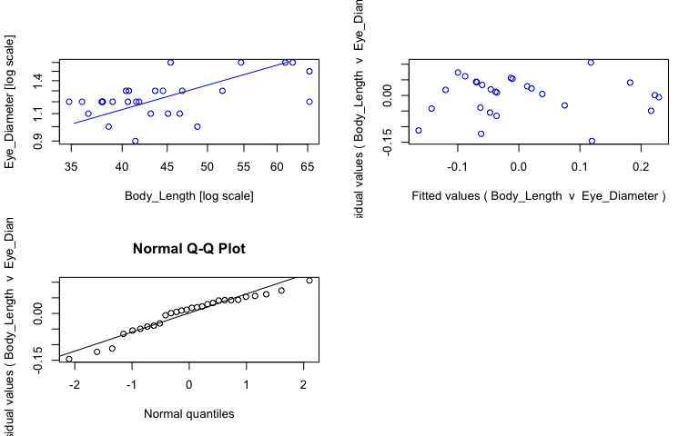<!-- -->

```r
#view fits
summary(sma_sten)
```

```{style="max-height: 300px;"}
## Call: sma(formula = Eye_Diameter ~ Body_Length, data = sten, log = "xy", 
##     method = "SMA", alpha = 0.05) 
## 
## Fit using Standardized Major Axis 
## 
## These variables were log-transformed before fitting: xy 
## 
## Confidence intervals (CI) are at 95%
## 
## ------------------------------------------------------------
## Coefficients:
##              elevation     slope
## estimate    -1.2313110 0.8025570
## lower limit -1.6822103 0.5747311
## upper limit -0.7804117 1.1206941
## 
## H0 : variables uncorrelated
## R-squared : 0.2880646 
## P-value : 0.0032339
```

```r
#save coefficients of fits as object
cc_sma_sten <- data.frame(coef(sma_sten))

# Make plot ------
plot_sten <- ggplot(sten, aes(x = Body_Length, y = Eye_Diameter, col = Preservation)) + 
  geom_point(size = 2, alpha = 0.8) + 
  scale_color_manual(values = col_pres, name = "Sample state", breaks = c("ethanol", "fresh", "paraformaldehyde")) +
  scale_x_log10(name = "Body length (mm)") + #makes x axis log scale and named
  scale_y_log10(name = "Eye diameter (mm)") + #makes y axis log scale and named
  ggtitle("Sergia tenuiremis") + 
  theme_bw() +
  theme(panel.grid.major = element_blank(), panel.grid.minor = element_blank(), plot.title = element_text(face = "italic")) +
  geom_abline(data = cc_sma_sten, aes(intercept = cc_sma_sten[1,1], slope = cc_sma_sten[2,1])) +
  geom_text(x = -Inf, y = Inf, hjust = -0.05, vjust = 1.5, nudge_x = 4, label = paste("b =", round(cc_sma_sten[2,1], digits = 2), sep = " "), size = 3.5, col = "black") +
  geom_text(x = -Inf, y = Inf, hjust = -0.05, vjust = 3, label = paste("a =", round(cc_sma_sten[1,1], digits = 2), sep = " "), size = 3.5, col = "black")

ggplotly(plot_sten)
```

```{=html}
<div id="htmlwidget-fc05dee08d56c475156c" style="width:768px;height:480px;" class="plotly html-widget"></div>
<script type="application/json" data-for="htmlwidget-fc05dee08d56c475156c">{"x":{"data":[{"x":[1.6170003411209,1.68752896121463,1.58658730467175,1.56348108539441,1.63447727016073,1.65417654187796,1.66745295288995,1.54157924394658,1.57863920996807,1.61804809671209,1.57978359661681,1.55630250076729,1.62117628177504,1.5910646070265,1.57978359661681,1.60852603357719,1.81491318127507,1.6063813651106,1.67024585307412,1.63948648926859,1.64836001098093,1.7160033436348,1.60959440922522,1.81491318127507,1.73719264270474,1.6570558528571,1.79588001734408,1.78746047451842],"y":[-0.0457574905606751,0,0,0.0413926851582251,0.0413926851582251,0.0413926851582251,0.0413926851582251,0.0791812460476248,0.0791812460476248,0.0791812460476248,0.0791812460476248,0.0791812460476248,0.0791812460476248,0.0791812460476248,0.0791812460476248,0.0791812460476248,0.0791812460476248,0.113943352306837,0.113943352306837,0.113943352306837,0.113943352306837,0.113943352306837,0.113943352306837,0.176091259055681,0.204119982655925,0.204119982655925,0.204119982655925,0.204119982655925],"text":["Body_Length: 41.4<br />Eye_Diameter: 0.9<br />Preservation: fresh","Body_Length: 48.7<br />Eye_Diameter: 1.0<br />Preservation: fresh","Body_Length: 38.6<br />Eye_Diameter: 1.0<br />Preservation: fresh","Body_Length: 36.6<br />Eye_Diameter: 1.1<br />Preservation: fresh","Body_Length: 43.1<br />Eye_Diameter: 1.1<br />Preservation: fresh","Body_Length: 45.1<br />Eye_Diameter: 1.1<br />Preservation: fresh","Body_Length: 46.5<br />Eye_Diameter: 1.1<br />Preservation: fresh","Body_Length: 34.8<br />Eye_Diameter: 1.2<br />Preservation: fresh","Body_Length: 37.9<br />Eye_Diameter: 1.2<br />Preservation: fresh","Body_Length: 41.5<br />Eye_Diameter: 1.2<br />Preservation: fresh","Body_Length: 38.0<br />Eye_Diameter: 1.2<br />Preservation: fresh","Body_Length: 36.0<br />Eye_Diameter: 1.2<br />Preservation: fresh","Body_Length: 41.8<br />Eye_Diameter: 1.2<br />Preservation: fresh","Body_Length: 39.0<br />Eye_Diameter: 1.2<br />Preservation: fresh","Body_Length: 38.0<br />Eye_Diameter: 1.2<br />Preservation: fresh","Body_Length: 40.6<br />Eye_Diameter: 1.2<br />Preservation: fresh","Body_Length: 65.3<br />Eye_Diameter: 1.2<br />Preservation: fresh","Body_Length: 40.4<br />Eye_Diameter: 1.3<br />Preservation: fresh","Body_Length: 46.8<br />Eye_Diameter: 1.3<br />Preservation: fresh","Body_Length: 43.6<br />Eye_Diameter: 1.3<br />Preservation: fresh","Body_Length: 44.5<br />Eye_Diameter: 1.3<br />Preservation: fresh","Body_Length: 52.0<br />Eye_Diameter: 1.3<br />Preservation: fresh","Body_Length: 40.7<br />Eye_Diameter: 1.3<br />Preservation: fresh","Body_Length: 65.3<br />Eye_Diameter: 1.5<br />Preservation: fresh","Body_Length: 54.6<br />Eye_Diameter: 1.6<br />Preservation: fresh","Body_Length: 45.4<br />Eye_Diameter: 1.6<br />Preservation: fresh","Body_Length: 62.5<br />Eye_Diameter: 1.6<br />Preservation: fresh","Body_Length: 61.3<br />Eye_Diameter: 1.6<br />Preservation: fresh"],"type":"scatter","mode":"markers","marker":{"autocolorscale":false,"color":"rgba(178,223,138,1)","opacity":0.8,"size":7.55905511811024,"symbol":"circle","line":{"width":1.88976377952756,"color":"rgba(178,223,138,1)"}},"hoveron":"points","name":"fresh","legendgroup":"fresh","showlegend":true,"xaxis":"x","yaxis":"y","hoverinfo":"text","frame":null},{"x":[1.52791254708016,1.52791254708016,1.8285798781415,1.8285798781415],"y":[-0.00507411530935586,-0.00507411530935586,0.236228555469056,0.236228555469056],"text":"cc_sma_sten[1, 1]: -1.231311<br />cc_sma_sten[2, 1]: 0.802557","type":"scatter","mode":"lines","line":{"width":1.88976377952756,"color":"rgba(0,0,0,1)","dash":"solid"},"hoveron":"points","showlegend":false,"xaxis":"x","yaxis":"y","hoverinfo":"text","frame":null},{"x":[null,null,null,null,null,null,null,null,null,null,null,null,null,null,null,null,null,null,null,null,null,null,null,null,null,null,null,null],"y":[null,null,null,null,null,null,null,null,null,null,null,null,null,null,null,null,null,null,null,null,null,null,null,null,null,null,null,null],"text":["b = 0.8","b = 0.8","b = 0.8","b = 0.8","b = 0.8","b = 0.8","b = 0.8","b = 0.8","b = 0.8","b = 0.8","b = 0.8","b = 0.8","b = 0.8","b = 0.8","b = 0.8","b = 0.8","b = 0.8","b = 0.8","b = 0.8","b = 0.8","b = 0.8","b = 0.8","b = 0.8","b = 0.8","b = 0.8","b = 0.8","b = 0.8","b = 0.8"],"hovertext":["Body_Length: -Inf<br />Eye_Diameter: Inf<br />Preservation: black","Body_Length: -Inf<br />Eye_Diameter: Inf<br />Preservation: black","Body_Length: -Inf<br />Eye_Diameter: Inf<br />Preservation: black","Body_Length: -Inf<br />Eye_Diameter: Inf<br />Preservation: black","Body_Length: -Inf<br />Eye_Diameter: Inf<br />Preservation: black","Body_Length: -Inf<br />Eye_Diameter: Inf<br />Preservation: black","Body_Length: -Inf<br />Eye_Diameter: Inf<br />Preservation: black","Body_Length: -Inf<br />Eye_Diameter: Inf<br />Preservation: black","Body_Length: -Inf<br />Eye_Diameter: Inf<br />Preservation: black","Body_Length: -Inf<br />Eye_Diameter: Inf<br />Preservation: black","Body_Length: -Inf<br />Eye_Diameter: Inf<br />Preservation: black","Body_Length: -Inf<br />Eye_Diameter: Inf<br />Preservation: black","Body_Length: -Inf<br />Eye_Diameter: Inf<br />Preservation: black","Body_Length: -Inf<br />Eye_Diameter: Inf<br />Preservation: black","Body_Length: -Inf<br />Eye_Diameter: Inf<br />Preservation: black","Body_Length: -Inf<br />Eye_Diameter: Inf<br />Preservation: black","Body_Length: -Inf<br />Eye_Diameter: Inf<br />Preservation: black","Body_Length: -Inf<br />Eye_Diameter: Inf<br />Preservation: black","Body_Length: -Inf<br />Eye_Diameter: Inf<br />Preservation: black","Body_Length: -Inf<br />Eye_Diameter: Inf<br />Preservation: black","Body_Length: -Inf<br />Eye_Diameter: Inf<br />Preservation: black","Body_Length: -Inf<br />Eye_Diameter: Inf<br />Preservation: black","Body_Length: -Inf<br />Eye_Diameter: Inf<br />Preservation: black","Body_Length: -Inf<br />Eye_Diameter: Inf<br />Preservation: black","Body_Length: -Inf<br />Eye_Diameter: Inf<br />Preservation: black","Body_Length: -Inf<br />Eye_Diameter: Inf<br />Preservation: black","Body_Length: -Inf<br />Eye_Diameter: Inf<br />Preservation: black","Body_Length: -Inf<br />Eye_Diameter: Inf<br />Preservation: black"],"textfont":{"size":13.2283464566929,"color":"rgba(0,0,0,1)"},"type":"scatter","mode":"text","hoveron":"points","showlegend":false,"xaxis":"x","yaxis":"y","hoverinfo":"text","frame":null},{"x":[null,null,null,null,null,null,null,null,null,null,null,null,null,null,null,null,null,null,null,null,null,null,null,null,null,null,null,null],"y":[null,null,null,null,null,null,null,null,null,null,null,null,null,null,null,null,null,null,null,null,null,null,null,null,null,null,null,null],"text":["a = -1.23","a = -1.23","a = -1.23","a = -1.23","a = -1.23","a = -1.23","a = -1.23","a = -1.23","a = -1.23","a = -1.23","a = -1.23","a = -1.23","a = -1.23","a = -1.23","a = -1.23","a = -1.23","a = -1.23","a = -1.23","a = -1.23","a = -1.23","a = -1.23","a = -1.23","a = -1.23","a = -1.23","a = -1.23","a = -1.23","a = -1.23","a = -1.23"],"hovertext":["Body_Length: -Inf<br />Eye_Diameter: Inf<br />Preservation: black","Body_Length: -Inf<br />Eye_Diameter: Inf<br />Preservation: black","Body_Length: -Inf<br />Eye_Diameter: Inf<br />Preservation: black","Body_Length: -Inf<br />Eye_Diameter: Inf<br />Preservation: black","Body_Length: -Inf<br />Eye_Diameter: Inf<br />Preservation: black","Body_Length: -Inf<br />Eye_Diameter: Inf<br />Preservation: black","Body_Length: -Inf<br />Eye_Diameter: Inf<br />Preservation: black","Body_Length: -Inf<br />Eye_Diameter: Inf<br />Preservation: black","Body_Length: -Inf<br />Eye_Diameter: Inf<br />Preservation: black","Body_Length: -Inf<br />Eye_Diameter: Inf<br />Preservation: black","Body_Length: -Inf<br />Eye_Diameter: Inf<br />Preservation: black","Body_Length: -Inf<br />Eye_Diameter: Inf<br />Preservation: black","Body_Length: -Inf<br />Eye_Diameter: Inf<br />Preservation: black","Body_Length: -Inf<br />Eye_Diameter: Inf<br />Preservation: black","Body_Length: -Inf<br />Eye_Diameter: Inf<br />Preservation: black","Body_Length: -Inf<br />Eye_Diameter: Inf<br />Preservation: black","Body_Length: -Inf<br />Eye_Diameter: Inf<br />Preservation: black","Body_Length: -Inf<br />Eye_Diameter: Inf<br />Preservation: black","Body_Length: -Inf<br />Eye_Diameter: Inf<br />Preservation: black","Body_Length: -Inf<br />Eye_Diameter: Inf<br />Preservation: black","Body_Length: -Inf<br />Eye_Diameter: Inf<br />Preservation: black","Body_Length: -Inf<br />Eye_Diameter: Inf<br />Preservation: black","Body_Length: -Inf<br />Eye_Diameter: Inf<br />Preservation: black","Body_Length: -Inf<br />Eye_Diameter: Inf<br />Preservation: black","Body_Length: -Inf<br />Eye_Diameter: Inf<br />Preservation: black","Body_Length: -Inf<br />Eye_Diameter: Inf<br />Preservation: black","Body_Length: -Inf<br />Eye_Diameter: Inf<br />Preservation: black","Body_Length: -Inf<br />Eye_Diameter: Inf<br />Preservation: black"],"textfont":{"size":13.2283464566929,"color":"rgba(0,0,0,1)"},"type":"scatter","mode":"text","hoveron":"points","showlegend":false,"xaxis":"x","yaxis":"y","hoverinfo":"text","frame":null}],"layout":{"margin":{"t":45.2237442922374,"r":7.30593607305936,"b":41.6438356164384,"l":43.1050228310502},"plot_bgcolor":"rgba(255,255,255,1)","paper_bgcolor":"rgba(255,255,255,1)","font":{"color":"rgba(0,0,0,1)","family":"","size":14.6118721461187},"title":{"text":"<i> Sergia tenuiremis <\/i>","font":{"color":"rgba(0,0,0,1)","family":"","size":17.5342465753425},"x":0,"xref":"paper"},"xaxis":{"domain":[0,1],"automargin":true,"type":"linear","autorange":false,"range":[1.52791254708016,1.8285798781415],"tickmode":"array","ticktext":["40","50","60"],"tickvals":[1.60205999132796,1.69897000433602,1.77815125038364],"categoryorder":"array","categoryarray":["40","50","60"],"nticks":null,"ticks":"outside","tickcolor":"rgba(51,51,51,1)","ticklen":3.65296803652968,"tickwidth":0.66417600664176,"showticklabels":true,"tickfont":{"color":"rgba(77,77,77,1)","family":"","size":11.689497716895},"tickangle":-0,"showline":false,"linecolor":null,"linewidth":0,"showgrid":false,"gridcolor":null,"gridwidth":0,"zeroline":false,"anchor":"y","title":{"text":"Body length (mm)","font":{"color":"rgba(0,0,0,1)","family":"","size":14.6118721461187}},"hoverformat":".2f"},"yaxis":{"domain":[0,1],"automargin":true,"type":"linear","autorange":false,"range":[-0.0582513642215051,0.216613856316755],"tickmode":"array","ticktext":["1.0","1.2","1.4","1.6"],"tickvals":[0,0.0791812460476249,0.146128035678238,0.204119982655925],"categoryorder":"array","categoryarray":["1.0","1.2","1.4","1.6"],"nticks":null,"ticks":"outside","tickcolor":"rgba(51,51,51,1)","ticklen":3.65296803652968,"tickwidth":0.66417600664176,"showticklabels":true,"tickfont":{"color":"rgba(77,77,77,1)","family":"","size":11.689497716895},"tickangle":-0,"showline":false,"linecolor":null,"linewidth":0,"showgrid":false,"gridcolor":null,"gridwidth":0,"zeroline":false,"anchor":"x","title":{"text":"Eye diameter (mm)","font":{"color":"rgba(0,0,0,1)","family":"","size":14.6118721461187}},"hoverformat":".2f"},"shapes":[{"type":"rect","fillcolor":"transparent","line":{"color":"rgba(51,51,51,1)","width":0.66417600664176,"linetype":"solid"},"yref":"paper","xref":"paper","x0":0,"x1":1,"y0":0,"y1":1}],"showlegend":true,"legend":{"bgcolor":"rgba(255,255,255,1)","bordercolor":"transparent","borderwidth":1.88976377952756,"font":{"color":"rgba(0,0,0,1)","family":"","size":11.689497716895},"title":{"text":"Sample state","font":{"color":"rgba(0,0,0,1)","family":"","size":14.6118721461187}}},"hovermode":"closest","barmode":"relative"},"config":{"doubleClick":"reset","modeBarButtonsToAdd":["hoverclosest","hovercompare"],"showSendToCloud":false},"source":"A","attrs":{"201443e479c5":{"x":{},"y":{},"colour":{},"type":"scatter"},"20144cf69755":{"intercept":{},"slope":{}},"2014514974ec":{"x":{},"y":{},"colour":{}},"20142d9b5ba5":{"x":{},"y":{},"colour":{}}},"cur_data":"201443e479c5","visdat":{"201443e479c5":["function (y) ","x"],"20144cf69755":["function (y) ","x"],"2014514974ec":["function (y) ","x"],"20142d9b5ba5":["function (y) ","x"]},"highlight":{"on":"plotly_click","persistent":false,"dynamic":false,"selectize":false,"opacityDim":0.2,"selected":{"opacity":1},"debounce":0},"shinyEvents":["plotly_hover","plotly_click","plotly_selected","plotly_relayout","plotly_brushed","plotly_brushing","plotly_clickannotation","plotly_doubleclick","plotly_deselect","plotly_afterplot","plotly_sunburstclick"],"base_url":"https://plot.ly"},"evals":[],"jsHooks":[]}</script>
```

## Figure for static eye-body scaling across sergestid species


```r
#make figure panels
fig.a <- plot_dcor + theme(legend.position = "none", axis.title.x = element_blank())
fig.b <- plot_dhen + theme(legend.position = "none", axis.title.x = element_blank(), axis.title.y = element_blank())
fig.c <- plot_apec + theme(legend.position = "none", axis.title.x = element_blank(), axis.title.y = element_blank())
fig.d <- plot_asar + theme(legend.position = "none", axis.title.x = element_blank())
fig.e <- plot_satl + theme(legend.position = "none", axis.title.x = element_blank(), axis.title.y = element_blank())
fig.f <- plot_pvig + theme(legend.position = "none", axis.title.x = element_blank(), axis.title.y = element_blank())
fig.g <- plot_parm + theme(legend.position = "none", axis.title.x = element_blank())
fig.h <- plot_euar + theme(legend.position = "none", axis.title.x = element_blank(), axis.title.y = element_blank())
fig.i <- plot_gspl + theme(legend.position = "none", axis.title.x = element_blank(), axis.title.y = element_blank())
fig.j <- plot_rreg + theme(legend.position = "none", axis.title.x = element_blank())
fig.k <- plot_rrob + theme(legend.position = "none", axis.title.x = element_blank(), axis.title.y = element_blank())
fig.l <- plot_pgra + theme(legend.position = "none", axis.title.x = element_blank(), axis.title.y = element_blank())
fig.m <- plot_sten + theme(legend.position = "none")
fig.n <- plot_ctal  + theme(legend.position = "none", axis.title.y = element_blank())
fig.o <- plot_chan + theme(legend.position = "none", axis.title.y = element_blank())

# arrange panels in figure
plots <- plot_grid(fig.a, fig.b, fig.c, fig.d, fig.e, fig.f, fig.g, fig.h, fig.i, fig.j, fig.k, fig.l, fig.m, fig.n, fig.o, #list of plots to arrange in grid
           align = 'vh', #align horizontally and vertically
           axis = 'lb',
           labels = c("A", "B", "C", "D", "E", "F", "G", "H", "I","J", "K", "L", "M", "N", "O"), #panel labels for figure
           hjust = -1, #adjustment for panel labels
           nrow = 5) #number of rows in grids

#extract legend
leg <- get_legend(fig.e + theme(legend.position="bottom"))


#view figure
plot_grid(plots, leg, nrow = 2, rel_heights = c(1, .01), align = 'vh')
```

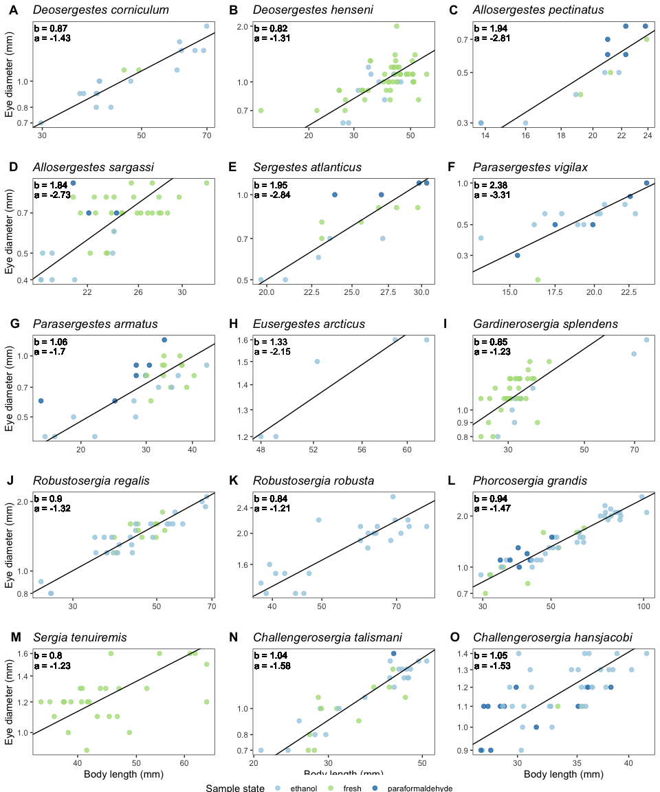<!-- -->

```r
#export figure
#png("../Figures/dev-allometry.png", width = 10, height = 12, units = "in", res = 500)
pdf("../Figures/Fig-S1.pdf", width = 9, height = 12)
plot_grid(plots, leg, nrow = 2, rel_heights = c(1, .05), align = 'vh')
dev.off()
```

# Test whether species differ in static allometry

We've looked at how eyes scale with body size within each species, but are there significant differences in static allometry across species? Here we use two approaches: first, we compare linear mixed models to see which best describes our data. Then, we look at pairwise comparisons of SMA regressions among species to see which are driving these differences. 

## Linear mixed model to test whether slopes vary across species

Here, we use linear mixed models in _lme4_ v.1.1.25 to test whether species show differences in static eye-body allometric slopes. We fit 1) a constant-slope, variable intercept model to our eye and body size data with species as a random effect and 2) a variable slope model with the same effects, and then compared model fits by AIC scores. Both models are fit using reduced maximum likelihood (REML), as this approach is better than maximum likelihood (ML) for detecting differences in random effects among models, which is what we are testing here (ML is better for fixed effects). 

First we removed the three outliers and the species with insufficient sampling (_N. edwardsii_) from our full specimen dataset, then ran each model. 


```r
#Remove outliers from specimen dataset
specimens_ed <- specimens %>%
  filter(!(genus_species == "Allosergestes_sargassi" & Eye_Diameter == 0.7 & Body_Length == 13.0)) %>% #(0.67, 12.97 raw)
  filter(!(genus_species == "Gardinerosergia_splendens" & Eye_Diameter == 1.7 & Body_Length == 22.0)) %>% #(1.71, 21.98 raw)
  filter(!(genus_species == "Neosergestes_edwardsii" & Eye_Diameter == 0.8 & Body_Length == 0.7)) #(0.85, 0.72 raw)

#Export data without outliers
write.csv(specimens_ed, file = "../Data/cleaned data/specimen_data_tidy_no-outliers.csv", row.names = FALSE)

#Remove species with insufficient sampling
specimens_test <- specimens_ed %>%
  filter(genus_species != "Neosergestes_edwardsii") %>%
  mutate(species_text = as.factor(paste(Genus, Species, sep = " "))) # Add labels for species text
```

### Fixed slope (variable intercepts) model


```r
# variable intercepts model (species can have different intercepts but share mean slope) -------
lme_fixed <- lmer(log10(Eye_Diameter) ~ log10(Body_Length) + (1|genus_species), 
                  data = specimens_test)

# summary 
summary(lme_fixed)
```

```{style="max-height: 300px;"}
## Linear mixed model fit by REML ['lmerMod']
## Formula: log10(Eye_Diameter) ~ log10(Body_Length) + (1 | genus_species)
##    Data: specimens_test
## 
## REML criterion at convergence: -1091.9
## 
## Scaled residuals: 
##     Min      1Q  Median      3Q     Max 
## -5.6547 -0.5660  0.0425  0.5699  3.7587 
## 
## Random effects:
##  Groups        Name        Variance Std.Dev.
##  genus_species (Intercept) 0.004257 0.06525 
##  Residual                  0.004549 0.06745 
## Number of obs: 450, groups:  genus_species, 15
## 
## Fixed effects:
##                    Estimate Std. Error t value
## (Intercept)        -1.24683    0.05121  -24.35
## log10(Body_Length)  0.80642    0.03122   25.83
## 
## Correlation of Fixed Effects:
##             (Intr)
## lg10(Bdy_L) -0.941
```

```r
# intercepts (variable) and slope (constant)
coef(lme_fixed)
```

```{style="max-height: 300px;"}
## $genus_species
##                              (Intercept) log10(Body_Length)
## Allosergestes_pectinatus       -1.337988          0.8064169
## Allosergestes_sargassi         -1.295962          0.8064169
## Challengerosergia_hansjacobi   -1.164606          0.8064169
## Challengerosergia_talismani    -1.216875          0.8064169
## Deosergestes_corniculum        -1.328655          0.8064169
## Deosergestes_henseni           -1.278582          0.8064169
## Eusergestes_arcticus           -1.246866          0.8064169
## Gardinerosergia_splendens      -1.158266          0.8064169
## Parasergestes_armatus          -1.325352          0.8064169
## Parasergestes_vigilax          -1.299386          0.8064169
## Phorcosergia_grandis           -1.246064          0.8064169
## Robustosergia_regalis          -1.176361          0.8064169
## Robustosergia_robusta          -1.155267          0.8064169
## Sergestes_atlanticus           -1.234190          0.8064169
## Sergia_tenuiremis              -1.238014          0.8064169
## 
## attr(,"class")
## [1] "coef.mer"
```

```r
# AIC
AIC(lme_fixed)
```

```{style="max-height: 300px;"}
## [1] -1083.888
```

```r
#fixed effects
fixef(lme_fixed)
```

```{style="max-height: 300px;"}
##        (Intercept) log10(Body_Length) 
##         -1.2468288          0.8064169
```

```r
#confidence intervals
## if these overlap zero, we do not have good support for significant effects
## if .sig01, which is our estimate of the variability in the random effect is very large and very widely defined, t indicates we may have a lack of precision between our groups - either because the group effect is small between groups, we have too few groups to get a more precise estimate, we have too few units within each group, or a combination of all of the above.
confint(lme_fixed, level = 0.95)
```

```{style="max-height: 300px;"}
##                          2.5 %      97.5 %
## .sig01              0.04428477  0.09578174
## .sigma              0.06313279  0.07211335
## (Intercept)        -1.34880013 -1.14643360
## log10(Body_Length)  0.74536494  0.86929119
```

### Variable slopes model 


```r
# variable slopes model (species can have different slopes/interaction effect between body size and species on eye size) -------
lme_variable <- lmer(log10(Eye_Diameter) ~ log10(Body_Length) + (1 + log10(Body_Length) | genus_species), 
                     data = specimens_test)

# summary
summary(lme_variable)
```

```{style="max-height: 300px;"}
## Linear mixed model fit by REML ['lmerMod']
## Formula: log10(Eye_Diameter) ~ log10(Body_Length) + (1 + log10(Body_Length) |  
##     genus_species)
##    Data: specimens_test
## 
## REML criterion at convergence: -1125.9
## 
## Scaled residuals: 
##     Min      1Q  Median      3Q     Max 
## -5.4279 -0.5359  0.0306  0.5910  4.2687 
## 
## Random effects:
##  Groups        Name               Variance Std.Dev. Corr 
##  genus_species (Intercept)        0.232807 0.48250       
##                log10(Body_Length) 0.104532 0.32331  -0.99
##  Residual                         0.003977 0.06306       
## Number of obs: 450, groups:  genus_species, 15
## 
## Fixed effects:
##                    Estimate Std. Error t value
## (Intercept)        -1.35693    0.13739  -9.876
## log10(Body_Length)  0.89778    0.09181   9.778
## 
## Correlation of Fixed Effects:
##             (Intr)
## lg10(Bdy_L) -0.993
```

```r
# intercepts (variable) and slope (constant)
coef(lme_variable)
```

```{style="max-height: 300px;"}
## $genus_species
##                              (Intercept) log10(Body_Length)
## Allosergestes_pectinatus      -2.2120964          1.4762026
## Allosergestes_sargassi        -1.7513868          1.1366814
## Challengerosergia_hansjacobi  -1.0760213          0.7484245
## Challengerosergia_talismani   -1.4111004          0.9318641
## Deosergestes_corniculum       -1.1953553          0.7273404
## Deosergestes_henseni          -0.7843247          0.4963146
## Eusergestes_arcticus          -1.2644263          0.8196651
## Gardinerosergia_splendens     -0.8716955          0.6169987
## Parasergestes_armatus         -1.3258605          0.8075505
## Parasergestes_vigilax         -2.0269469          1.3719045
## Phorcosergia_grandis          -1.3536721          0.8693323
## Robustosergia_regalis         -1.2328227          0.8412590
## Robustosergia_robusta         -1.1498050          0.8037740
## Sergestes_atlanticus          -1.8945693          1.2766884
## Sergia_tenuiremis             -0.8038697          0.5427274
## 
## attr(,"class")
## [1] "coef.mer"
```

```r
# AIC
AIC(lme_variable)
```

```{style="max-height: 300px;"}
## [1] -1113.879
```

```r
#fixed effects
fixef(lme_variable)
```

```{style="max-height: 300px;"}
##        (Intercept) log10(Body_Length) 
##         -1.3569302          0.8977818
```

```r
#confidence intervals
## if these overlap zero, we do not have good support for significant effects
## if .sig01, which is our estimate of the variability in the random effect is very large and very widely defined, t indicates we may have a lack of precision between our groups - either because the group effect is small between groups, we have too few groups to get a more precise estimate, we have too few units within each group, or a combination of all of the above.
confint(lme_variable, level = 0.95)
```

```{style="max-height: 300px;"}
##                          2.5 %      97.5 %
## .sig01              0.27582256  0.74974111
## .sig02             -0.99580186 -0.97348803
## .sig03              0.17701121  0.50987554
## .sigma              0.05903897  0.06767603
## (Intercept)        -1.64344107 -1.07983292
## log10(Body_Length)  0.71455352  1.09409513
```

Note that the parameter estimates for slopes and intercepts for species groups are a bit different than those we estimated via OLS. That's because here, the model is looking across all the data for all the species, and finding a common mean slope/intercept as well as the group effects. 

### Compare models

Then we can compare the two models via AIC and log likelihood. 


```r
#model AIC comparison
AIC(lme_fixed, lme_variable)
```

```{style="max-height: 300px;"}
##              df       AIC
## lme_fixed     4 -1083.888
## lme_variable  6 -1113.879
```

```r
#log likelihood comparison
anova(lme_fixed, lme_variable, refit=FALSE)
```

```{style="max-height: 300px;"}
## Data: specimens_test
## Models:
## lme_fixed: log10(Eye_Diameter) ~ log10(Body_Length) + (1 | genus_species)
## lme_variable: log10(Eye_Diameter) ~ log10(Body_Length) + (1 + log10(Body_Length) | genus_species)
##              npar     AIC     BIC logLik deviance  Chisq Df Pr(>Chisq)    
## lme_fixed       4 -1083.9 -1067.5 545.94  -1091.9                         
## lme_variable    6 -1113.9 -1089.2 562.94  -1125.9 33.991  2  4.159e-08 ***
## ---
## Signif. codes:  0 '***' 0.001 '**' 0.01 '*' 0.05 '.' 0.1 ' ' 1
```

Here we find by comparing AIC scores and log likelihoods that the model with variable slopes is better supported than the one with fixed slopes. We have evidence here that species differ significantly in the slopes of their static eye-body allometries rather than following a shared growth trajectory. 


## Test for significant effect of preservation as a covariate

Here, we add preservation method as a fixed effect into our linear mixed models of eye size vs. body size with species as a random effect. We have already selected the variable slopes model, so here we use a maximum likelihood approach (ML) to fit models that 1) don't include preservation as a covariate and 2) do include preservation as a covariate and then compare model fits. We include preservation as a fixed rather than a random effect because random effects should have more than 5 levels, and preservation type has only 3. 

### Model without preservation type


```r
# variable slopes model (species can have different slopes/interaction effect between body size and species on eye size) -------
lme_nopres <- lmer(log10(Eye_Diameter) ~ log10(Body_Length) + (1 + log10(Body_Length) | genus_species), 
                   data = specimens_test,
                   REML = FALSE) #uses ML instead of REML

# summary
summary(lme_nopres)
```

```{style="max-height: 300px;"}
## Linear mixed model fit by maximum likelihood  ['lmerMod']
## Formula: log10(Eye_Diameter) ~ log10(Body_Length) + (1 + log10(Body_Length) |  
##     genus_species)
##    Data: specimens_test
## 
##      AIC      BIC   logLik deviance df.resid 
##  -1123.3  -1098.6    567.6  -1135.3      444 
## 
## Scaled residuals: 
##     Min      1Q  Median      3Q     Max 
## -5.4474 -0.5397  0.0290  0.5871  4.2627 
## 
## Random effects:
##  Groups        Name               Variance Std.Dev. Corr 
##  genus_species (Intercept)        0.205885 0.45375       
##                log10(Body_Length) 0.091871 0.30310  -0.99
##  Residual                         0.003983 0.06311       
## Number of obs: 450, groups:  genus_species, 15
## 
## Fixed effects:
##                    Estimate Std. Error t value
## (Intercept)        -1.35193    0.13036  -10.37
## log10(Body_Length)  0.89371    0.08686   10.29
## 
## Correlation of Fixed Effects:
##             (Intr)
## lg10(Bdy_L) -0.993
```

```r
# intercepts (variable) and slope (constant)
coef(lme_nopres)
```

```{style="max-height: 300px;"}
## $genus_species
##                              (Intercept) log10(Body_Length)
## Allosergestes_pectinatus      -2.1804353          1.4518078
## Allosergestes_sargassi        -1.7432761          1.1308509
## Challengerosergia_hansjacobi  -1.0817350          0.7520768
## Challengerosergia_talismani   -1.4101465          0.9312293
## Deosergestes_corniculum       -1.1915651          0.7253703
## Deosergestes_henseni          -0.7877696          0.4985142
## Eusergestes_arcticus          -1.2643317          0.8197744
## Gardinerosergia_splendens     -0.8765164          0.6200697
## Parasergestes_armatus         -1.3286935          0.8097102
## Parasergestes_vigilax         -1.9939834          1.3460569
## Phorcosergia_grandis          -1.3527442          0.8688288
## Robustosergia_regalis         -1.2356712          0.8429113
## Robustosergia_robusta         -1.1602404          0.8095839
## Sergestes_atlanticus          -1.8546790          1.2481074
## Sergia_tenuiremis             -0.8172119          0.5507995
## 
## attr(,"class")
## [1] "coef.mer"
```

```r
# AIC
AIC(lme_nopres)
```

```{style="max-height: 300px;"}
## [1] -1123.278
```

```r
#fixed effects
fixef(lme_nopres)
```

```{style="max-height: 300px;"}
##        (Intercept) log10(Body_Length) 
##         -1.3519333          0.8937128
```

```r
#confidence intervals
## if these overlap zero, we do not have good support for significant effects
## if .sig01, which is our estimate of the variability in the random effect is very large and very widely defined, t indicates we may have a lack of precision between our groups - either because the group effect is small between groups, we have too few groups to get a more precise estimate, we have too few units within each group, or a combination of all of the above.
confint(lme_nopres, level = 0.95)
```

```{style="max-height: 300px;"}
##                          2.5 %      97.5 %
## .sig01              0.27582268  0.74974134
## .sig02             -0.99580165 -0.97348804
## .sig03              0.17701128  0.50987568
## .sigma              0.05903897  0.06767603
## (Intercept)        -1.64344107 -1.07983293
## log10(Body_Length)  0.71455335  1.09409513
```

### Model including preservation type


```r
#reorder levels for preservation so that contrasts will be compared to fresh samples
specimens_test$Preservation <- factor(specimens_test$Preservation, 
                                      levels = c("fresh", "ethanol", "paraformaldehyde"))

# variable slopes model (species can have different slopes/interaction effect between body size and species on eye size) -------
lme_withpres <- lmer(log10(Eye_Diameter) ~ log10(Body_Length) + Preservation + (1 + log10(Body_Length) | genus_species), 
                   data = specimens_test,
                   REML = FALSE) #uses ML instead of REML

# summary
summary(lme_withpres)
```

```{style="max-height: 300px;"}
## Linear mixed model fit by maximum likelihood  ['lmerMod']
## Formula: log10(Eye_Diameter) ~ log10(Body_Length) + Preservation + (1 +  
##     log10(Body_Length) | genus_species)
##    Data: specimens_test
## 
##      AIC      BIC   logLik deviance df.resid 
##  -1152.9  -1120.0    584.5  -1168.9      442 
## 
## Scaled residuals: 
##     Min      1Q  Median      3Q     Max 
## -5.7037 -0.5122  0.0295  0.5644  4.3676 
## 
## Random effects:
##  Groups        Name               Variance Std.Dev. Corr 
##  genus_species (Intercept)        0.167876 0.40973       
##                log10(Body_Length) 0.071632 0.26764  -0.99
##  Residual                         0.003701 0.06083       
## Number of obs: 450, groups:  genus_species, 15
## 
## Fixed effects:
##                               Estimate Std. Error t value
## (Intercept)                  -1.353719   0.119794 -11.300
## log10(Body_Length)            0.894613   0.078169  11.445
## Preservationethanol          -0.019607   0.008151  -2.405
## Preservationparaformaldehyde  0.045520   0.012167   3.741
## 
## Correlation of Fixed Effects:
##             (Intr) l10(B_ Prsrvtnt
## lg10(Bdy_L) -0.990                
## Prsrvtnthnl -0.057  0.022         
## Prsrvtnprfr -0.068  0.041  0.455
```

```r
# AIC
AIC(lme_withpres)
```

```{style="max-height: 300px;"}
## [1] -1152.918
```

```r
#fixed effects
fixef(lme_withpres)
```

```{style="max-height: 300px;"}
##                  (Intercept)           log10(Body_Length) 
##                  -1.35371863                   0.89461257 
##          Preservationethanol Preservationparaformaldehyde 
##                  -0.01960702                   0.04551984
```

```r
#confidence intervals
## if these overlap zero, we do not have good support for significant effects
## if .sig01, which is our estimate of the variability in the random effect is very large and very widely defined, t indicates we may have a lack of precision between our groups - either because the group effect is small between groups, we have too few groups to get a more precise estimate, we have too few units within each group, or a combination of all of the above.
confint(lme_withpres, level = 0.95)
```

```{style="max-height: 300px;"}
##                                    2.5 %      97.5 %
## .sig01                        0.25281957  0.67323848
## .sig02                       -0.99341603 -0.96585932
## .sig03                        0.15905144  0.44860338
## .sigma                        0.05692248  0.06521126
## (Intercept)                  -1.61782966 -1.10480110
## log10(Body_Length)            0.73401477  1.07261071
## Preservationethanol          -0.03573800 -0.00350345
## Preservationparaformaldehyde  0.02141721  0.06962976
```

### Compare models

Then we can compare the two models via AIC and log likelihood. 


```r
#model AIC comparison
AIC(lme_nopres, lme_withpres)
```

```{style="max-height: 300px;"}
##              df       AIC
## lme_nopres    6 -1123.278
## lme_withpres  8 -1152.918
```

```r
#log likelihood comparison
anova(lme_nopres, lme_withpres)
```

```{style="max-height: 300px;"}
## Data: specimens_test
## Models:
## lme_nopres: log10(Eye_Diameter) ~ log10(Body_Length) + (1 + log10(Body_Length) | genus_species)
## lme_withpres: log10(Eye_Diameter) ~ log10(Body_Length) + Preservation + (1 + log10(Body_Length) | genus_species)
##              npar     AIC     BIC logLik deviance Chisq Df Pr(>Chisq)    
## lme_nopres      6 -1123.3 -1098.6 567.64  -1135.3                        
## lme_withpres    8 -1152.9 -1120.0 584.46  -1168.9 33.64  2  4.957e-08 ***
## ---
## Signif. codes:  0 '***' 0.001 '**' 0.01 '*' 0.05 '.' 0.1 ' ' 1
```

Here we see that the model that includes preservation type as a covariate is significantly better supported. Ethanol preservation has a negative effect on intercept (eye size compared to body size), but paraformaldehyde has a positive effect. Note also that these effects are very small, so while they are significantly affecting our models, they seem to have minor effects.

## Linear SMA regression for pairwise comparisons among species slopes

The _smatr_ package also allows you to test whether groups exhibit significant differences in allometric scaling (slopes or intercepts). Below, we again use standardized major axis regression to model the scaling of eye diameter with body length across all specimens measured and test whether we see significant differences in static allometry across species. 


```r
# Model for static allometry across specimens with species and species*body size interaction as covariates
sma_species <- sma(formula = Eye_Diameter ~ Body_Length * genus_species, 
            data = specimens_test, 
            log = "xy", #sets both x and y variables as logged
            method="SMA", #defines SMA as model
            multcomp = TRUE, # adds pairwise comparisons between groups
            multcompmethod = "adjusted", # adjusts p-value for multiple comparisons
            alpha = 0.05) 

#plot fit, residuals, qq
par(mfrow = c(2,2)) #make plot window 2x2
plot(sma_species, which = "default",type = "o") 
plot(sma_species,which = "residual",type = "o")
plot(sma_species, which = "qq", type = "o")
par(mfrow = c(1,1)) 
```

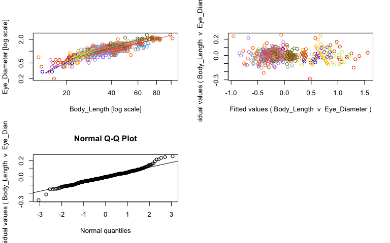<!-- -->

```r
#view fits
summary(sma_species)
```

```{style="max-height: 300px;"}
## Call: sma(formula = Eye_Diameter ~ Body_Length * genus_species, data = specimens_test, 
##     log = "xy", method = "SMA", alpha = 0.05, multcomp = TRUE, 
##     multcompmethod = "adjusted") 
## 
## Fit using Standardized Major Axis 
## 
## These variables were log-transformed before fitting: xy 
## 
## Confidence intervals (CI) are at 95%
## 
## ------------------------------------------------------------
## Results of comparing lines among groups.
## 
## H0 : slopes are equal.
## Likelihood ratio statistic : 78.37 with 14 degrees of freedom
## P-value : 5.6738e-11 
## ------------------------------------------------------------
## 
## Results of multiple comparisons among groups.
## 
## Test for pair-wise difference in slope :
##                  genus_species_1              genus_species_2       Pval
## 1       Allosergestes_pectinatus       Allosergestes_sargassi 1.00000000
## 2       Allosergestes_pectinatus Challengerosergia_hansjacobi 0.10631965
## 3       Allosergestes_pectinatus  Challengerosergia_talismani 0.03771725
## 4       Allosergestes_pectinatus      Deosergestes_corniculum 0.00370375
## 5       Allosergestes_pectinatus         Deosergestes_henseni 0.00191135
## 6       Allosergestes_pectinatus         Eusergestes_arcticus 1.00000000
## 7       Allosergestes_pectinatus    Gardinerosergia_splendens 0.00417512
## 8       Allosergestes_pectinatus        Parasergestes_armatus 0.14662731
## 9       Allosergestes_pectinatus        Parasergestes_vigilax 1.00000000
## 10      Allosergestes_pectinatus         Phorcosergia_grandis 0.00484593
## 11      Allosergestes_pectinatus        Robustosergia_regalis 0.00330606
## 12      Allosergestes_pectinatus        Robustosergia_robusta 0.00386781
## 13      Allosergestes_pectinatus         Sergestes_atlanticus 1.00000000
## 14      Allosergestes_pectinatus            Sergia_tenuiremis 0.00977338
## 15        Allosergestes_sargassi Challengerosergia_hansjacobi 0.17642048
## 16        Allosergestes_sargassi  Challengerosergia_talismani 0.03323729
## 17        Allosergestes_sargassi      Deosergestes_corniculum 0.00219121
## 18        Allosergestes_sargassi         Deosergestes_henseni 0.00062265
## 19        Allosergestes_sargassi         Eusergestes_arcticus 1.00000000
## 20        Allosergestes_sargassi    Gardinerosergia_splendens 0.00279183
## 21        Allosergestes_sargassi        Parasergestes_armatus 0.25381226
## 22        Allosergestes_sargassi        Parasergestes_vigilax 1.00000000
## 23        Allosergestes_sargassi         Phorcosergia_grandis 0.00071873
## 24        Allosergestes_sargassi        Robustosergia_regalis 0.00055799
## 25        Allosergestes_sargassi        Robustosergia_robusta 0.00340588
## 26        Allosergestes_sargassi         Sergestes_atlanticus 1.00000000
## 27        Allosergestes_sargassi            Sergia_tenuiremis 0.01682182
## 28  Challengerosergia_hansjacobi  Challengerosergia_talismani 1.00000000
## 29  Challengerosergia_hansjacobi      Deosergestes_corniculum 1.00000000
## 30  Challengerosergia_hansjacobi         Deosergestes_henseni 0.99999989
## 31  Challengerosergia_hansjacobi         Eusergestes_arcticus 1.00000000
## 32  Challengerosergia_hansjacobi    Gardinerosergia_splendens 1.00000000
## 33  Challengerosergia_hansjacobi        Parasergestes_armatus 1.00000000
## 34  Challengerosergia_hansjacobi        Parasergestes_vigilax 0.04921452
## 35  Challengerosergia_hansjacobi         Phorcosergia_grandis 1.00000000
## 36  Challengerosergia_hansjacobi        Robustosergia_regalis 1.00000000
## 37  Challengerosergia_hansjacobi        Robustosergia_robusta 1.00000000
## 38  Challengerosergia_hansjacobi         Sergestes_atlanticus 0.25203409
## 39  Challengerosergia_hansjacobi            Sergia_tenuiremis 1.00000000
## 40   Challengerosergia_talismani      Deosergestes_corniculum 0.99999999
## 41   Challengerosergia_talismani         Deosergestes_henseni 0.99993757
## 42   Challengerosergia_talismani         Eusergestes_arcticus 1.00000000
## 43   Challengerosergia_talismani    Gardinerosergia_splendens 1.00000000
## 44   Challengerosergia_talismani        Parasergestes_armatus 1.00000000
## 45   Challengerosergia_talismani        Parasergestes_vigilax 0.02124209
## 46   Challengerosergia_talismani         Phorcosergia_grandis 1.00000000
## 47   Challengerosergia_talismani        Robustosergia_regalis 1.00000000
## 48   Challengerosergia_talismani        Robustosergia_robusta 0.99999992
## 49   Challengerosergia_talismani         Sergestes_atlanticus 0.11697344
## 50   Challengerosergia_talismani            Sergia_tenuiremis 0.99999999
## 51       Deosergestes_corniculum         Deosergestes_henseni 1.00000000
## 52       Deosergestes_corniculum         Eusergestes_arcticus 0.99999999
## 53       Deosergestes_corniculum    Gardinerosergia_splendens 1.00000000
## 54       Deosergestes_corniculum        Parasergestes_armatus 1.00000000
## 55       Deosergestes_corniculum        Parasergestes_vigilax 0.00236873
## 56       Deosergestes_corniculum         Phorcosergia_grandis 1.00000000
## 57       Deosergestes_corniculum        Robustosergia_regalis 1.00000000
## 58       Deosergestes_corniculum        Robustosergia_robusta 1.00000000
## 59       Deosergestes_corniculum         Sergestes_atlanticus 0.01350778
## 60       Deosergestes_corniculum            Sergia_tenuiremis 1.00000000
## 61          Deosergestes_henseni         Eusergestes_arcticus 0.99999959
## 62          Deosergestes_henseni    Gardinerosergia_splendens 1.00000000
## 63          Deosergestes_henseni        Parasergestes_armatus 0.99999978
## 64          Deosergestes_henseni        Parasergestes_vigilax 0.00128436
## 65          Deosergestes_henseni         Phorcosergia_grandis 1.00000000
## 66          Deosergestes_henseni        Robustosergia_regalis 1.00000000
## 67          Deosergestes_henseni        Robustosergia_robusta 1.00000000
## 68          Deosergestes_henseni         Sergestes_atlanticus 0.00731827
## 69          Deosergestes_henseni            Sergia_tenuiremis 1.00000000
## 70          Eusergestes_arcticus    Gardinerosergia_splendens 0.99999997
## 71          Eusergestes_arcticus        Parasergestes_armatus 1.00000000
## 72          Eusergestes_arcticus        Parasergestes_vigilax 0.99996770
## 73          Eusergestes_arcticus         Phorcosergia_grandis 1.00000000
## 74          Eusergestes_arcticus        Robustosergia_regalis 1.00000000
## 75          Eusergestes_arcticus        Robustosergia_robusta 0.99999993
## 76          Eusergestes_arcticus         Sergestes_atlanticus 1.00000000
## 77          Eusergestes_arcticus            Sergia_tenuiremis 0.99999911
## 78     Gardinerosergia_splendens        Parasergestes_armatus 1.00000000
## 79     Gardinerosergia_splendens        Parasergestes_vigilax 0.00266011
## 80     Gardinerosergia_splendens         Phorcosergia_grandis 1.00000000
## 81     Gardinerosergia_splendens        Robustosergia_regalis 1.00000000
## 82     Gardinerosergia_splendens        Robustosergia_robusta 1.00000000
## 83     Gardinerosergia_splendens         Sergestes_atlanticus 0.01499340
## 84     Gardinerosergia_splendens            Sergia_tenuiremis 1.00000000
## 85         Parasergestes_armatus        Parasergestes_vigilax 0.06386567
## 86         Parasergestes_armatus         Phorcosergia_grandis 1.00000000
## 87         Parasergestes_armatus        Robustosergia_regalis 1.00000000
## 88         Parasergestes_armatus        Robustosergia_robusta 1.00000000
## 89         Parasergestes_armatus         Sergestes_atlanticus 0.31517941
## 90         Parasergestes_armatus            Sergia_tenuiremis 1.00000000
## 91         Parasergestes_vigilax         Phorcosergia_grandis 0.00320670
## 92         Parasergestes_vigilax        Robustosergia_regalis 0.00220257
## 93         Parasergestes_vigilax        Robustosergia_robusta 0.00240837
## 94         Parasergestes_vigilax         Sergestes_atlanticus 1.00000000
## 95         Parasergestes_vigilax            Sergia_tenuiremis 0.00481337
## 96          Phorcosergia_grandis        Robustosergia_regalis 1.00000000
## 97          Phorcosergia_grandis        Robustosergia_robusta 1.00000000
## 98          Phorcosergia_grandis         Sergestes_atlanticus 0.01851043
## 99          Phorcosergia_grandis            Sergia_tenuiremis 1.00000000
## 100        Robustosergia_regalis        Robustosergia_robusta 1.00000000
## 101        Robustosergia_regalis         Sergestes_atlanticus 0.01271145
## 102        Robustosergia_regalis            Sergia_tenuiremis 1.00000000
## 103        Robustosergia_robusta         Sergestes_atlanticus 0.01358845
## 104        Robustosergia_robusta            Sergia_tenuiremis 1.00000000
## 105         Sergestes_atlanticus            Sergia_tenuiremis 0.02662028
##         TestStat
## 1   7.666232e-02
## 2   1.070239e+01
## 3   1.269776e+01
## 4   1.710663e+01
## 5   1.836679e+01
## 6   1.514543e+00
## 7   1.687873e+01
## 8   1.006766e+01
## 9   8.341304e-01
## 10  1.659541e+01
## 11  1.732280e+01
## 12  1.702417e+01
## 13  8.875795e-04
## 14  1.526295e+01
## 15  9.695878e+00
## 16  1.293861e+01
## 17  1.810626e+01
## 18  2.051006e+01
## 19  1.218474e+00
## 20  1.764469e+01
## 21  8.943571e+00
## 22  1.268181e+00
## 23  2.023537e+01
## 24  2.072006e+01
## 25  1.726619e+01
## 26  7.817618e-02
## 27  1.423248e+01
## 28  2.850713e-03
## 29  1.459201e+00
## 30  2.159382e+00
## 31  7.165782e-01
## 32  1.474497e+00
## 33  3.154991e-03
## 34  1.218978e+01
## 35  7.281210e-01
## 36  1.215204e+00
## 37  1.670749e+00
## 38  8.958462e+00
## 39  1.652888e+00
## 40  1.971056e+00
## 41  2.909088e+00
## 42  7.908634e-01
## 43  1.901819e+00
## 44  1.381453e-02
## 45  1.378961e+01
## 46  1.203054e+00
## 47  1.877144e+00
## 48  2.130775e+00
## 49  1.051505e+01
## 50  1.917202e+00
## 51  1.091006e-01
## 52  1.922892e+00
## 53  9.383239e-03
## 54  1.528670e+00
## 55  1.795778e+01
## 56  4.919054e-01
## 57  9.043887e-02
## 58  3.949879e-02
## 59  1.464885e+01
## 60  1.486450e-01
## 61  2.285326e+00
## 62  4.454856e-02
## 63  2.224689e+00
## 64  1.912552e+01
## 65  1.138002e+00
## 66  4.397057e-01
## 67  1.181780e-02
## 68  1.581216e+01
## 69  1.724888e-02
## 70  2.036867e+00
## 71  6.530716e-01
## 72  2.808168e+00
## 73  1.445758e+00
## 74  1.716984e+00
## 75  2.123385e+00
## 76  1.501074e+00
## 77  2.362523e+00
## 78  1.546238e+00
## 79  1.773675e+01
## 80  5.367445e-01
## 81  1.427310e-01
## 82  9.239058e-03
## 83  1.445085e+01
## 84  8.641470e-02
## 85  1.169009e+01
## 86  7.995621e-01
## 87  1.285411e+00
## 88  1.740929e+00
## 89  8.475706e+00
## 90  1.723105e+00
## 91  1.738089e+01
## 92  1.809640e+01
## 93  1.792616e+01
## 94  6.837798e-01
## 95  1.660823e+01
## 96  2.447817e-01
## 97  7.055402e-01
## 98  1.405093e+01
## 99  7.801888e-01
## 100 2.376709e-01
## 101 1.476415e+01
## 102 3.827565e-01
## 103 1.463755e+01
## 104 4.529580e-02
## 105 1.336087e+01
## 
## ------------------------------------------------------------
## Coefficients by group in variable "genus_species"
## 
## Group: Allosergestes_pectinatus 
##             elevation    slope
## estimate    -2.812398 1.940053
## lower limit -3.491769 1.485663
## upper limit -2.133027 2.533418
## 
## H0 : variables uncorrelated.
## R-squared : 0.8156794 
## P-value : 9.643e-06 
## 
## Group: Allosergestes_sargassi 
##             elevation    slope
## estimate    -2.728530 1.844597
## lower limit -3.402995 1.419494
## upper limit -2.054065 2.397008
## 
## H0 : variables uncorrelated.
## R-squared : 0.4037707 
## P-value : 2.3852e-05 
## 
## Group: Challengerosergia_hansjacobi 
##             elevation    slope
## estimate    -1.528299 1.047036
## lower limit -1.913161 0.824145
## upper limit -1.143436 1.330207
## 
## H0 : variables uncorrelated.
## R-squared : 0.4129122 
## P-value : 3.3885e-06 
## 
## Group: Challengerosergia_talismani 
##             elevation     slope
## estimate    -1.578063 1.0389917
## lower limit -1.840235 0.8845412
## upper limit -1.315891 1.2204109
## 
## H0 : variables uncorrelated.
## R-squared : 0.8120894 
## P-value : 2.0471e-12 
## 
## Group: Deosergestes_corniculum 
##             elevation     slope
## estimate    -1.432046 0.8653057
## lower limit -1.737583 0.7020666
## upper limit -1.126509 1.0664999
## 
## H0 : variables uncorrelated.
## R-squared : 0.8421211 
## P-value : 8.1768e-08 
## 
## Group: Deosergestes_henseni 
##             elevation     slope
## estimate    -1.306994 0.8238705
## lower limit -1.593941 0.6637531
## upper limit -1.020047 1.0226131
## 
## H0 : variables uncorrelated.
## R-squared : 0.3380975 
## P-value : 1.6982e-06 
## 
## Group: Eusergestes_arcticus 
##              elevation     slope
## estimate    -2.1539322 1.3306114
## lower limit -3.8635100 0.6694485
## upper limit -0.4443543 2.6447543
## 
## H0 : variables uncorrelated.
## R-squared : 0.8368056 
## P-value : 0.029484 
## 
## Group: Gardinerosergia_splendens 
##              elevation     slope
## estimate    -1.2253950 0.8523703
## lower limit -1.5326713 0.6732695
## upper limit -0.9181186 1.0791149
## 
## H0 : variables uncorrelated.
## R-squared : 0.4597308 
## P-value : 1.1132e-06 
## 
## Group: Parasergestes_armatus 
##             elevation     slope
## estimate    -1.697577 1.0573117
## lower limit -2.095490 0.8217616
## upper limit -1.299663 1.3603801
## 
## H0 : variables uncorrelated.
## R-squared : 0.5670657 
## P-value : 1.5744e-06 
## 
## Group: Parasergestes_vigilax 
##             elevation    slope
## estimate    -3.306489 2.375713
## lower limit -4.455793 1.641298
## upper limit -2.157186 3.438750
## 
## H0 : variables uncorrelated.
## R-squared : 0.5274941 
## P-value : 0.00096145 
## 
## Group: Phorcosergia_grandis 
##             elevation     slope
## estimate    -1.470665 0.9366565
## lower limit -1.632022 0.8480626
## upper limit -1.309308 1.0345055
## 
## H0 : variables uncorrelated.
## R-squared : 0.8798127 
## P-value : < 2.22e-16 
## 
## Group: Robustosergia_regalis 
##             elevation     slope
## estimate    -1.324440 0.8978007
## lower limit -1.531510 0.7807317
## upper limit -1.117369 1.0324239
## 
## H0 : variables uncorrelated.
## R-squared : 0.8280327 
## P-value : 2.4971e-15 
## 
## Group: Robustosergia_robusta 
##              elevation     slope
## estimate    -1.2073093 0.8386026
## lower limit -1.5732188 0.6553974
## upper limit -0.8413998 1.0730198
## 
## H0 : variables uncorrelated.
## R-squared : 0.6989428 
## P-value : 6.7833e-07 
## 
## Group: Sergestes_atlanticus 
##             elevation    slope
## estimate    -2.839127 1.951572
## lower limit -3.727822 1.418514
## upper limit -1.950431 2.684945
## 
## H0 : variables uncorrelated.
## R-squared : 0.7067609 
## P-value : 8.6609e-05 
## 
## Group: Sergia_tenuiremis 
##              elevation     slope
## estimate    -1.2313110 0.8025570
## lower limit -1.6822103 0.5747311
## upper limit -0.7804117 1.1206941
## 
## H0 : variables uncorrelated.
## R-squared : 0.2880646 
## P-value : 0.0032339
```

```r
#save coefficients of fits as object
cc_species <- data.frame(coef(sma_species))
```

Among 15 sergestid species (450 specimens), species significantly differ in eye-body allometric scaling (p < 0.0001). Pairwise comparisons show which species differ significantly in slope and which do not.

Here we plot the static allometry of all the species with sufficient sampling (n = 15). It's interactive, so you can click on different species in the legend to hide or show those points.


```r
#reorder factor levels for figure legend (phylo order)
specimens_test$species_text <- factor(specimens_test$species_text, 
                                      levels = c("Deosergestes corniculum",
                                                 "Deosergestes henseni",
                                                 "Allosergestes pectinatus",
                                                 "Allosergestes sargassi",
                                                 "Sergestes atlanticus",
                                                 "Parasergestes vigilax",
                                                 "Parasergestes armatus",
                                                 "Eusergestes arcticus",
                                                 "Gardinerosergia splendens",
                                                 "Robustosergia regalis",
                                                 "Robustosergia robusta",
                                                 "Phorcosergia grandis",
                                                 "Sergia tenuiremis",
                                                 "Challengerosergia talismani",
                                                 "Challengerosergia hansjacobi"))

#make shape pallette
shapes.sp <- c("Deosergestes corniculum" = 21,
              "Deosergestes henseni" = 22, 
              "Allosergestes pectinatus" = 23, 
              "Allosergestes sargassi" = 24,
              "Sergestes atlanticus" = 25, 
              "Parasergestes vigilax" = 21, 
              "Parasergestes armatus" = 22,
              "Eusergestes arcticus" = 23, 
              "Gardinerosergia splendens" = 24, 
              "Robustosergia regalis" = 25, 
              "Robustosergia robusta" = 21, 
              "Phorcosergia grandis" = 22,
              "Sergia tenuiremis" = 23,
              "Challengerosergia talismani" = 24,
              "Challengerosergia hansjacobi" = 25)

#rainbow palette
cols.sp <- c("Deosergestes corniculum" = "#16ABA8",
              "Deosergestes henseni" = "#1f78b4",
              "Allosergestes pectinatus" = "#3acf75",
              "Allosergestes sargassi" = "#33a02c",
              "Sergestes atlanticus" = "#fb9a99",
              "Parasergestes vigilax" = "#e31a1c",
              "Parasergestes armatus" = "#fdbf6f",
              "Eusergestes arcticus" = "#ff7f00",
              "Gardinerosergia splendens" = "#cab2d6",
              "Robustosergia regalis" = "#6a3d9a",
              "Robustosergia robusta" = "gray31",
              "Phorcosergia grandis" = "burlywood4",
              "Sergia tenuiremis" = "black",
              "Challengerosergia talismani" = "maroon1",
              "Challengerosergia hansjacobi" = "orchid1")

#sergia/sergestes green purple pallette
# cols.sp <- c(#Sergestes group
#               "Deosergestes corniculum" = "#512E5F",
#               "Deosergestes henseni" = "#633974", 
#               "Allosergestes pectinatus" = "#76448A", 
#               "Allosergestes sargassi" = "#884EA0",
#               "Sergestes atlanticus" = "#9B59B6", 
#               #"Neosergestes edwardsii" = "#AF7AC5"
#               "Parasergestes vigilax" = "#C39BD3", 
#               "Parasergestes armatus" = "#D7BDE2",
#               "Eusergestes arcticus" = "#EBDEF0", 
#              #Sergia group
#               "Gardinerosergia splendens" = "#D4EFDF",
#               "Robustosergia regalis" = "#A9DFBF", 
#               "Robustosergia robusta" = "#52BE80",
#               "Phorcosergia grandis" = "#27AE60",
#               "Sergia tenuiremis" = "#1E8449",
#               "Challengerosergia talismani" = "#196F3D",
#               "Challengerosergia hansjacobi" = "#145A32")


#set s limits by species for plots
limits <- specimens_test %>%
  group_by(genus_species) %>%
  summarise(max = max(Body_Length, na.rm = TRUE),
            min = min(Body_Length, na.rm = TRUE))

#make plot
plot_species <- ggplot(specimens_test, aes(x = Body_Length, y = Eye_Diameter, color =  species_text, shape = species_text, fill = species_text)) + 
  geom_point(size = 2, alpha = 0.4) + 
  scale_shape_manual(values = shapes.sp, name = "Species") + 
  scale_color_manual(values = cols.sp, name = "Species") +
  scale_fill_manual(values = cols.sp, name = "Species") +
  scale_x_log10(name = "Body length (mm)", breaks = c(15,20,30,50,100)) + #makes x axis log scale and named
  scale_y_log10(name = "Eye diameter (mm)", breaks = c(0.2,0.3,0.5,1, 2.6)) + #makes y axis log scale and named
  theme_bw() +
  theme(panel.grid.major = element_blank(), panel.grid.minor = element_blank(), legend.text = element_text(face = "italic")) +
    geom_segment(aes(x = limits$min[which(limits$genus_species == "Allosergestes_pectinatus")], xend = limits$max[which(limits$genus_species == "Allosergestes_pectinatus")], y = 10^(log10(limits$min[which(limits$genus_species == "Allosergestes_pectinatus")])*cc_species["Allosergestes_pectinatus", "slope"] + cc_species["Allosergestes_pectinatus", "elevation"]), yend = 10^(log10(limits$max[which(limits$genus_species == "Allosergestes_pectinatus")])*cc_species["Allosergestes_pectinatus", "slope"] + cc_species["Allosergestes_pectinatus", "elevation"])), color = cols.sp["Allosergestes pectinatus"]) + #Rana temporaria adult scaling
  geom_segment(aes(x = limits$min[which(limits$genus_species == "Allosergestes_sargassi")], xend = limits$max[which(limits$genus_species == "Allosergestes_sargassi")], y = 10^(log10(limits$min[which(limits$genus_species == "Allosergestes_sargassi")])*cc_species["Allosergestes_sargassi", "slope"] + cc_species["Allosergestes_sargassi", "elevation"]), yend = 10^(log10(limits$max[which(limits$genus_species == "Allosergestes_sargassi")])*cc_species["Allosergestes_sargassi", "slope"] + cc_species["Allosergestes_sargassi", "elevation"])), color = cols.sp["Allosergestes sargassi"]) + #Allosergestes_sargassi adult scaling
  geom_segment(aes(x = limits$min[which(limits$genus_species == "Challengerosergia_hansjacobi")], xend = limits$max[which(limits$genus_species == "Challengerosergia_hansjacobi")], y = 10^(log10(limits$min[which(limits$genus_species == "Challengerosergia_hansjacobi")])*cc_species["Challengerosergia_hansjacobi", "slope"] + cc_species["Challengerosergia_hansjacobi", "elevation"]), yend = 10^(log10(limits$max[which(limits$genus_species == "Challengerosergia_hansjacobi")])*cc_species["Challengerosergia_hansjacobi", "slope"] + cc_species["Challengerosergia_hansjacobi", "elevation"])), color = cols.sp["Challengerosergia hansjacobi"]) + #Challengerosergia_hansjacobi adult scaling
  geom_segment(aes(x = limits$min[which(limits$genus_species == "Challengerosergia_talismani")], xend = limits$max[which(limits$genus_species == "Challengerosergia_talismani")], y = 10^(log10(limits$min[which(limits$genus_species == "Challengerosergia_talismani")])*cc_species["Challengerosergia_talismani", "slope"] + cc_species["Challengerosergia_talismani", "elevation"]), yend = 10^(log10(limits$max[which(limits$genus_species == "Challengerosergia_talismani")])*cc_species["Challengerosergia_talismani", "slope"] + cc_species["Challengerosergia_talismani", "elevation"])), color = cols.sp["Challengerosergia talismani"]) + #Challengerosergia_talismani adult scaling
  geom_segment(aes(x = limits$min[which(limits$genus_species == "Deosergestes_corniculum")], xend = limits$max[which(limits$genus_species == "Deosergestes_corniculum")], y = 10^(log10(limits$min[which(limits$genus_species == "Deosergestes_corniculum")])*cc_species["Deosergestes_corniculum", "slope"] + cc_species["Deosergestes_corniculum", "elevation"]), yend = 10^(log10(limits$max[which(limits$genus_species == "Deosergestes_corniculum")])*cc_species["Deosergestes_corniculum", "slope"] + cc_species["Deosergestes_corniculum", "elevation"])), color = cols.sp["Deosergestes corniculum"]) + #Deosergestes_corniculum adult scaling
  geom_segment(aes(x = limits$min[which(limits$genus_species == "Deosergestes_henseni")], xend = limits$max[which(limits$genus_species == "Deosergestes_henseni")], y = 10^(log10(limits$min[which(limits$genus_species == "Deosergestes_henseni")])*cc_species["Deosergestes_henseni", "slope"] + cc_species["Deosergestes_henseni", "elevation"]), yend = 10^(log10(limits$max[which(limits$genus_species == "Deosergestes_henseni")])*cc_species["Deosergestes_henseni", "slope"] + cc_species["Deosergestes_henseni", "elevation"])), color = cols.sp["Deosergestes henseni"]) + #Deosergestes henseni adult scaling
  geom_segment(aes(x = limits$min[which(limits$genus_species == "Gardinerosergia_splendens")], xend = limits$max[which(limits$genus_species == "Gardinerosergia_splendens")], y = 10^(log10(limits$min[which(limits$genus_species == "Gardinerosergia_splendens")])*cc_species["Gardinerosergia_splendens", "slope"] + cc_species["Gardinerosergia_splendens", "elevation"]), yend = 10^(log10(limits$max[which(limits$genus_species == "Gardinerosergia_splendens")])*cc_species["Gardinerosergia_splendens", "slope"] + cc_species["Gardinerosergia_splendens", "elevation"])), color = cols.sp["Gardinerosergia splendens"]) + #Gardinerosergia splendens adult scaling
  geom_segment(aes(x = limits$min[which(limits$genus_species == "Parasergestes_armatus")], xend = limits$max[which(limits$genus_species == "Parasergestes_armatus")], y = 10^(log10(limits$min[which(limits$genus_species == "Parasergestes_armatus")])*cc_species["Parasergestes_armatus", "slope"] + cc_species["Parasergestes_armatus", "elevation"]), yend = 10^(log10(limits$max[which(limits$genus_species == "Parasergestes_armatus")])*cc_species["Parasergestes_armatus", "slope"] + cc_species["Parasergestes_armatus", "elevation"])), color = cols.sp["Parasergestes armatus"]) + #Parasergestes armatus adult scaling
  geom_segment(aes(x = limits$min[which(limits$genus_species == "Parasergestes_vigilax")], xend = limits$max[which(limits$genus_species == "Parasergestes_vigilax")], y = 10^(log10(limits$min[which(limits$genus_species == "Parasergestes_vigilax")])*cc_species["Parasergestes_vigilax", "slope"] + cc_species["Parasergestes_vigilax", "elevation"]), yend = 10^(log10(limits$max[which(limits$genus_species == "Parasergestes_vigilax")])*cc_species["Parasergestes_vigilax", "slope"] + cc_species["Parasergestes_vigilax", "elevation"])), color = cols.sp["Parasergestes vigilax"]) + #Parasergestes vigilax adult scaling
  geom_segment(aes(x = limits$min[which(limits$genus_species == "Phorcosergia_grandis")], xend = limits$max[which(limits$genus_species == "Phorcosergia_grandis")], y = 10^(log10(limits$min[which(limits$genus_species == "Phorcosergia_grandis")])*cc_species["Phorcosergia_grandis", "slope"] + cc_species["Phorcosergia_grandis", "elevation"]), yend = 10^(log10(limits$max[which(limits$genus_species == "Phorcosergia_grandis")])*cc_species["Phorcosergia_grandis", "slope"] + cc_species["Phorcosergia_grandis", "elevation"])), color = cols.sp["Phorcosergia grandis"]) + #Phorcosergia grandis adult scaling
  geom_segment(aes(x = limits$min[which(limits$genus_species == "Robustosergia_robusta")], xend = limits$max[which(limits$genus_species == "Robustosergia_robusta")], y = 10^(log10(limits$min[which(limits$genus_species == "Robustosergia_robusta")])*cc_species["Robustosergia_robusta", "slope"] + cc_species["Robustosergia_robusta", "elevation"]), yend = 10^(log10(limits$max[which(limits$genus_species == "Robustosergia_robusta")])*cc_species["Robustosergia_robusta", "slope"] + cc_species["Robustosergia_robusta", "elevation"])), color = cols.sp["Robustosergia robusta"]) + #Robustosergia robusta adult scaling
  geom_segment(aes(x = limits$min[which(limits$genus_species == "Robustosergia_regalis")], xend = limits$max[which(limits$genus_species == "Robustosergia_regalis")], y = 10^(log10(limits$min[which(limits$genus_species == "Robustosergia_regalis")])*cc_species["Robustosergia_regalis", "slope"] + cc_species["Robustosergia_regalis", "elevation"]), yend = 10^(log10(limits$max[which(limits$genus_species == "Robustosergia_regalis")])*cc_species["Robustosergia_regalis", "slope"] + cc_species["Robustosergia_regalis", "elevation"])), color = cols.sp["Robustosergia regalis"]) +
  geom_segment(aes(x = limits$min[which(limits$genus_species == "Sergestes_atlanticus")], xend = limits$max[which(limits$genus_species == "Sergestes_atlanticus")], y = 10^(log10(limits$min[which(limits$genus_species == "Sergestes_atlanticus")])*cc_species["Sergestes_atlanticus", "slope"] + cc_species["Sergestes_atlanticus", "elevation"]), yend = 10^(log10(limits$max[which(limits$genus_species == "Sergestes_atlanticus")])*cc_species["Sergestes_atlanticus", "slope"] + cc_species["Sergestes_atlanticus", "elevation"])), color = cols.sp["Sergestes atlanticus"]) +
  geom_segment(aes(x = limits$min[which(limits$genus_species == "Sergia_tenuiremis")], xend = limits$max[which(limits$genus_species == "Sergia_tenuiremis")], y = 10^(log10(limits$min[which(limits$genus_species == "Sergia_tenuiremis")])*cc_species["Sergia_tenuiremis", "slope"] + cc_species["Sergia_tenuiremis", "elevation"]), yend = 10^(log10(limits$max[which(limits$genus_species == "Sergia_tenuiremis")])*cc_species["Sergia_tenuiremis", "slope"] + cc_species["Sergia_tenuiremis", "elevation"])), color = cols.sp["Sergia tenuiremis"])+
  geom_segment(aes(x = limits$min[which(limits$genus_species == "Eusergestes_arcticus")], xend = limits$max[which(limits$genus_species == "Eusergestes_arcticus")], y = 10^(log10(limits$min[which(limits$genus_species == "Eusergestes_arcticus")])*cc_species["Eusergestes_arcticus", "slope"] + cc_species["Eusergestes_arcticus", "elevation"]), yend = 10^(log10(limits$max[which(limits$genus_species == "Eusergestes_arcticus")])*cc_species["Eusergestes_arcticus", "slope"] + cc_species["Eusergestes_arcticus", "elevation"])), color = cols.sp["Eusergestes arcticus"])+
  theme(legend.text = element_text(face = "italic"))


#interactive plot
ggplotly(plot_species)
```

```{=html}
<div id="htmlwidget-31ea89cdd9f8c9b8d483" style="width:864px;height:864px;" class="plotly html-widget"></div>
<script type="application/json" data-for="htmlwidget-31ea89cdd9f8c9b8d483">{"x":{"data":[{"x":[1.47421626407626,1.63042787502502,1.59769518592551,1.59988307207369,1.56937390961505,1.59769518592551,1.56110138364906,1.67486114073781,1.60422605308447,1.60530504614111,1.65991620006985,1.77815125038364,1.69284691927723,1.81822589361396,1.78816837114117,1.83758843823551,1.78390357927273,1.84447717574568],"y":[-0.154901959985743,-0.0969100130080564,-0.0969100130080564,-0.0457574905606751,-0.0457574905606751,-0.0457574905606751,-0.0457574905606751,0,0,0,0.0413926851582251,0.0413926851582251,0.0413926851582251,0.113943352306837,0.113943352306837,0.113943352306837,0.146128035678238,0.204119982655925],"text":["Body_Length:  29.8<br />Eye_Diameter: 0.7<br />species_text: Deosergestes corniculum<br />species_text: Deosergestes corniculum<br />species_text: Deosergestes corniculum","Body_Length:  42.7<br />Eye_Diameter: 0.8<br />species_text: Deosergestes corniculum<br />species_text: Deosergestes corniculum<br />species_text: Deosergestes corniculum","Body_Length:  39.6<br />Eye_Diameter: 0.8<br />species_text: Deosergestes corniculum<br />species_text: Deosergestes corniculum<br />species_text: Deosergestes corniculum","Body_Length:  39.8<br />Eye_Diameter: 0.9<br />species_text: Deosergestes corniculum<br />species_text: Deosergestes corniculum<br />species_text: Deosergestes corniculum","Body_Length:  37.1<br />Eye_Diameter: 0.9<br />species_text: Deosergestes corniculum<br />species_text: Deosergestes corniculum<br />species_text: Deosergestes corniculum","Body_Length:  39.6<br />Eye_Diameter: 0.9<br />species_text: Deosergestes corniculum<br />species_text: Deosergestes corniculum<br />species_text: Deosergestes corniculum","Body_Length:  36.4<br />Eye_Diameter: 0.9<br />species_text: Deosergestes corniculum<br />species_text: Deosergestes corniculum<br />species_text: Deosergestes corniculum","Body_Length:  47.3<br />Eye_Diameter: 1.0<br />species_text: Deosergestes corniculum<br />species_text: Deosergestes corniculum<br />species_text: Deosergestes corniculum","Body_Length:  40.2<br />Eye_Diameter: 1.0<br />species_text: Deosergestes corniculum<br />species_text: Deosergestes corniculum<br />species_text: Deosergestes corniculum","Body_Length:  40.3<br />Eye_Diameter: 1.0<br />species_text: Deosergestes corniculum<br />species_text: Deosergestes corniculum<br />species_text: Deosergestes corniculum","Body_Length:  45.7<br />Eye_Diameter: 1.1<br />species_text: Deosergestes corniculum<br />species_text: Deosergestes corniculum<br />species_text: Deosergestes corniculum","Body_Length:  60.0<br />Eye_Diameter: 1.1<br />species_text: Deosergestes corniculum<br />species_text: Deosergestes corniculum<br />species_text: Deosergestes corniculum","Body_Length:  49.3<br />Eye_Diameter: 1.1<br />species_text: Deosergestes corniculum<br />species_text: Deosergestes corniculum<br />species_text: Deosergestes corniculum","Body_Length:  65.8<br />Eye_Diameter: 1.3<br />species_text: Deosergestes corniculum<br />species_text: Deosergestes corniculum<br />species_text: Deosergestes corniculum","Body_Length:  61.4<br />Eye_Diameter: 1.3<br />species_text: Deosergestes corniculum<br />species_text: Deosergestes corniculum<br />species_text: Deosergestes corniculum","Body_Length:  68.8<br />Eye_Diameter: 1.3<br />species_text: Deosergestes corniculum<br />species_text: Deosergestes corniculum<br />species_text: Deosergestes corniculum","Body_Length:  60.8<br />Eye_Diameter: 1.4<br />species_text: Deosergestes corniculum<br />species_text: Deosergestes corniculum<br />species_text: Deosergestes corniculum","Body_Length:  69.9<br />Eye_Diameter: 1.6<br />species_text: Deosergestes corniculum<br />species_text: Deosergestes corniculum<br />species_text: Deosergestes corniculum"],"type":"scatter","mode":"markers","marker":{"autocolorscale":false,"color":"rgba(22,171,168,1)","opacity":0.4,"size":7.55905511811024,"symbol":"circle","line":{"width":1.88976377952756,"color":"rgba(22,171,168,1)"}},"hoveron":"points","name":"Deosergestes corniculum","legendgroup":"Deosergestes corniculum","showlegend":true,"xaxis":"x","yaxis":"y","hoverinfo":"text","frame":null},{"x":[1.4345689040342,1.45636603312904,1.44247976906445,1.11394335230684,1.33243845991561,1.72997428569956,1.51982799377572,1.59769518592551,1.44404479591808,1.61909333062674,1.41995574848976,1.41995574848976,1.49415459401844,1.51054501020661,1.50785587169583,1.51188336097887,1.5327543789925,1.60422605308447,1.62013605497376,1.71011736511182,1.71180722904119,1.57518784492766,1.63042787502502,1.59328606702046,1.6159500516564,1.70842090013471,1.61172330800734,1.64542226934909,1.64836001098093,1.66086547800387,1.63447727016073,1.63346845557959,1.69196510276736,1.76192783842053,1.63948648926859,1.6570558528571,1.68304703823885,1.68304703823885,1.70757017609794,1.70757017609794,1.54406804435028,1.59769518592551,1.65896484266444,1.65896484266444,1.63346845557959,1.63447727016073,1.65417654187796,1.64640372622307,1.6232492903979,1.63346845557959,1.53402610605614,1.64048143697042,1.70586371228392,1.54157924394658,1.54157924394658,1.7160033436348,1.63848925695464,1.64443858946784],"y":[-0.221848749616356,-0.221848749616356,-0.154901959985743,-0.154901959985743,-0.154901959985743,-0.0969100130080564,-0.0969100130080564,-0.0969100130080564,-0.0969100130080564,-0.0969100130080564,-0.0457574905606751,-0.0457574905606751,-0.0457574905606751,-0.0457574905606751,-0.0457574905606751,-0.0457574905606751,-0.0457574905606751,-0.0457574905606751,-0.0457574905606751,0,0,0,0,0,0,0,0,0,0,0,0.0413926851582251,0.0413926851582251,0.0413926851582251,0.0413926851582251,0.0413926851582251,0.0413926851582251,0.0413926851582251,0.0413926851582251,0.0413926851582251,0.0413926851582251,0.0413926851582251,0.0413926851582251,0.0413926851582251,0.0413926851582251,0.0791812460476248,0.0791812460476248,0.0791812460476248,0.0791812460476248,0.0791812460476248,0.0791812460476248,0.0791812460476248,0.113943352306837,0.113943352306837,0.113943352306837,0.113943352306837,0.146128035678238,0.146128035678238,0.301029995663981],"text":["Body_Length:  27.2<br />Eye_Diameter: 0.6<br />species_text: Deosergestes henseni<br />species_text: Deosergestes henseni<br />species_text: Deosergestes henseni","Body_Length:  28.6<br />Eye_Diameter: 0.6<br />species_text: Deosergestes henseni<br />species_text: Deosergestes henseni<br />species_text: Deosergestes henseni","Body_Length:  27.7<br />Eye_Diameter: 0.7<br />species_text: Deosergestes henseni<br />species_text: Deosergestes henseni<br />species_text: Deosergestes henseni","Body_Length:  13.0<br />Eye_Diameter: 0.7<br />species_text: Deosergestes henseni<br />species_text: Deosergestes henseni<br />species_text: Deosergestes henseni","Body_Length:  21.5<br />Eye_Diameter: 0.7<br />species_text: Deosergestes henseni<br />species_text: Deosergestes henseni<br />species_text: Deosergestes henseni","Body_Length:  53.7<br />Eye_Diameter: 0.8<br />species_text: Deosergestes henseni<br />species_text: Deosergestes henseni<br />species_text: Deosergestes henseni","Body_Length:  33.1<br />Eye_Diameter: 0.8<br />species_text: Deosergestes henseni<br />species_text: Deosergestes henseni<br />species_text: Deosergestes henseni","Body_Length:  39.6<br />Eye_Diameter: 0.8<br />species_text: Deosergestes henseni<br />species_text: Deosergestes henseni<br />species_text: Deosergestes henseni","Body_Length:  27.8<br />Eye_Diameter: 0.8<br />species_text: Deosergestes henseni<br />species_text: Deosergestes henseni<br />species_text: Deosergestes henseni","Body_Length:  41.6<br />Eye_Diameter: 0.8<br />species_text: Deosergestes henseni<br />species_text: Deosergestes henseni<br />species_text: Deosergestes henseni","Body_Length:  26.3<br />Eye_Diameter: 0.9<br />species_text: Deosergestes henseni<br />species_text: Deosergestes henseni<br />species_text: Deosergestes henseni","Body_Length:  26.3<br />Eye_Diameter: 0.9<br />species_text: Deosergestes henseni<br />species_text: Deosergestes henseni<br />species_text: Deosergestes henseni","Body_Length:  31.2<br />Eye_Diameter: 0.9<br />species_text: Deosergestes henseni<br />species_text: Deosergestes henseni<br />species_text: Deosergestes henseni","Body_Length:  32.4<br />Eye_Diameter: 0.9<br />species_text: Deosergestes henseni<br />species_text: Deosergestes henseni<br />species_text: Deosergestes henseni","Body_Length:  32.2<br />Eye_Diameter: 0.9<br />species_text: Deosergestes henseni<br />species_text: Deosergestes henseni<br />species_text: Deosergestes henseni","Body_Length:  32.5<br />Eye_Diameter: 0.9<br />species_text: Deosergestes henseni<br />species_text: Deosergestes henseni<br />species_text: Deosergestes henseni","Body_Length:  34.1<br />Eye_Diameter: 0.9<br />species_text: Deosergestes henseni<br />species_text: Deosergestes henseni<br />species_text: Deosergestes henseni","Body_Length:  40.2<br />Eye_Diameter: 0.9<br />species_text: Deosergestes henseni<br />species_text: Deosergestes henseni<br />species_text: Deosergestes henseni","Body_Length:  41.7<br />Eye_Diameter: 0.9<br />species_text: Deosergestes henseni<br />species_text: Deosergestes henseni<br />species_text: Deosergestes henseni","Body_Length:  51.3<br />Eye_Diameter: 1.0<br />species_text: Deosergestes henseni<br />species_text: Deosergestes henseni<br />species_text: Deosergestes henseni","Body_Length:  51.5<br />Eye_Diameter: 1.0<br />species_text: Deosergestes henseni<br />species_text: Deosergestes henseni<br />species_text: Deosergestes henseni","Body_Length:  37.6<br />Eye_Diameter: 1.0<br />species_text: Deosergestes henseni<br />species_text: Deosergestes henseni<br />species_text: Deosergestes henseni","Body_Length:  42.7<br />Eye_Diameter: 1.0<br />species_text: Deosergestes henseni<br />species_text: Deosergestes henseni<br />species_text: Deosergestes henseni","Body_Length:  39.2<br />Eye_Diameter: 1.0<br />species_text: Deosergestes henseni<br />species_text: Deosergestes henseni<br />species_text: Deosergestes henseni","Body_Length:  41.3<br />Eye_Diameter: 1.0<br />species_text: Deosergestes henseni<br />species_text: Deosergestes henseni<br />species_text: Deosergestes henseni","Body_Length:  51.1<br />Eye_Diameter: 1.0<br />species_text: Deosergestes henseni<br />species_text: Deosergestes henseni<br />species_text: Deosergestes henseni","Body_Length:  40.9<br />Eye_Diameter: 1.0<br />species_text: Deosergestes henseni<br />species_text: Deosergestes henseni<br />species_text: Deosergestes henseni","Body_Length:  44.2<br />Eye_Diameter: 1.0<br />species_text: Deosergestes henseni<br />species_text: Deosergestes henseni<br />species_text: Deosergestes henseni","Body_Length:  44.5<br />Eye_Diameter: 1.0<br />species_text: Deosergestes henseni<br />species_text: Deosergestes henseni<br />species_text: Deosergestes henseni","Body_Length:  45.8<br />Eye_Diameter: 1.0<br />species_text: Deosergestes henseni<br />species_text: Deosergestes henseni<br />species_text: Deosergestes henseni","Body_Length:  43.1<br />Eye_Diameter: 1.1<br />species_text: Deosergestes henseni<br />species_text: Deosergestes henseni<br />species_text: Deosergestes henseni","Body_Length:  43.0<br />Eye_Diameter: 1.1<br />species_text: Deosergestes henseni<br />species_text: Deosergestes henseni<br />species_text: Deosergestes henseni","Body_Length:  49.2<br />Eye_Diameter: 1.1<br />species_text: Deosergestes henseni<br />species_text: Deosergestes henseni<br />species_text: Deosergestes henseni","Body_Length:  57.8<br />Eye_Diameter: 1.1<br />species_text: Deosergestes henseni<br />species_text: Deosergestes henseni<br />species_text: Deosergestes henseni","Body_Length:  43.6<br />Eye_Diameter: 1.1<br />species_text: Deosergestes henseni<br />species_text: Deosergestes henseni<br />species_text: Deosergestes henseni","Body_Length:  45.4<br />Eye_Diameter: 1.1<br />species_text: Deosergestes henseni<br />species_text: Deosergestes henseni<br />species_text: Deosergestes henseni","Body_Length:  48.2<br />Eye_Diameter: 1.1<br />species_text: Deosergestes henseni<br />species_text: Deosergestes henseni<br />species_text: Deosergestes henseni","Body_Length:  48.2<br />Eye_Diameter: 1.1<br />species_text: Deosergestes henseni<br />species_text: Deosergestes henseni<br />species_text: Deosergestes henseni","Body_Length:  51.0<br />Eye_Diameter: 1.1<br />species_text: Deosergestes henseni<br />species_text: Deosergestes henseni<br />species_text: Deosergestes henseni","Body_Length:  51.0<br />Eye_Diameter: 1.1<br />species_text: Deosergestes henseni<br />species_text: Deosergestes henseni<br />species_text: Deosergestes henseni","Body_Length:  35.0<br />Eye_Diameter: 1.1<br />species_text: Deosergestes henseni<br />species_text: Deosergestes henseni<br />species_text: Deosergestes henseni","Body_Length:  39.6<br />Eye_Diameter: 1.1<br />species_text: Deosergestes henseni<br />species_text: Deosergestes henseni<br />species_text: Deosergestes henseni","Body_Length:  45.6<br />Eye_Diameter: 1.1<br />species_text: Deosergestes henseni<br />species_text: Deosergestes henseni<br />species_text: Deosergestes henseni","Body_Length:  45.6<br />Eye_Diameter: 1.1<br />species_text: Deosergestes henseni<br />species_text: Deosergestes henseni<br />species_text: Deosergestes henseni","Body_Length:  43.0<br />Eye_Diameter: 1.2<br />species_text: Deosergestes henseni<br />species_text: Deosergestes henseni<br />species_text: Deosergestes henseni","Body_Length:  43.1<br />Eye_Diameter: 1.2<br />species_text: Deosergestes henseni<br />species_text: Deosergestes henseni<br />species_text: Deosergestes henseni","Body_Length:  45.1<br />Eye_Diameter: 1.2<br />species_text: Deosergestes henseni<br />species_text: Deosergestes henseni<br />species_text: Deosergestes henseni","Body_Length:  44.3<br />Eye_Diameter: 1.2<br />species_text: Deosergestes henseni<br />species_text: Deosergestes henseni<br />species_text: Deosergestes henseni","Body_Length:  42.0<br />Eye_Diameter: 1.2<br />species_text: Deosergestes henseni<br />species_text: Deosergestes henseni<br />species_text: Deosergestes henseni","Body_Length:  43.0<br />Eye_Diameter: 1.2<br />species_text: Deosergestes henseni<br />species_text: Deosergestes henseni<br />species_text: Deosergestes henseni","Body_Length:  34.2<br />Eye_Diameter: 1.2<br />species_text: Deosergestes henseni<br />species_text: Deosergestes henseni<br />species_text: Deosergestes henseni","Body_Length:  43.7<br />Eye_Diameter: 1.3<br />species_text: Deosergestes henseni<br />species_text: Deosergestes henseni<br />species_text: Deosergestes henseni","Body_Length:  50.8<br />Eye_Diameter: 1.3<br />species_text: Deosergestes henseni<br />species_text: Deosergestes henseni<br />species_text: Deosergestes henseni","Body_Length:  34.8<br />Eye_Diameter: 1.3<br />species_text: Deosergestes henseni<br />species_text: Deosergestes henseni<br />species_text: Deosergestes henseni","Body_Length:  34.8<br />Eye_Diameter: 1.3<br />species_text: Deosergestes henseni<br />species_text: Deosergestes henseni<br />species_text: Deosergestes henseni","Body_Length:  52.0<br />Eye_Diameter: 1.4<br />species_text: Deosergestes henseni<br />species_text: Deosergestes henseni<br />species_text: Deosergestes henseni","Body_Length:  43.5<br />Eye_Diameter: 1.4<br />species_text: Deosergestes henseni<br />species_text: Deosergestes henseni<br />species_text: Deosergestes henseni","Body_Length:  44.1<br />Eye_Diameter: 2.0<br />species_text: Deosergestes henseni<br />species_text: Deosergestes henseni<br />species_text: Deosergestes henseni"],"type":"scatter","mode":"markers","marker":{"autocolorscale":false,"color":"rgba(31,120,180,1)","opacity":0.4,"size":7.55905511811024,"symbol":"square","line":{"width":1.88976377952756,"color":"rgba(31,120,180,1)"}},"hoveron":"points","name":"Deosergestes henseni","legendgroup":"Deosergestes henseni","showlegend":true,"xaxis":"x","yaxis":"y","hoverinfo":"text","frame":null},{"x":[1.20411998265592,1.13987908640124,1.13987908640124,1.28330122870355,1.27646180417324,1.32633586092875,1.31806333496276,1.3384564936046,1.34830486304816,1.32221929473392,1.32221929473392,1.37839790094814,1.37657695705651,1.34830486304816],"y":[-0.522878745280338,-0.522878745280338,-0.522878745280338,-0.397940008672038,-0.397940008672038,-0.301029995663981,-0.301029995663981,-0.301029995663981,-0.221848749616356,-0.221848749616356,-0.154901959985743,-0.154901959985743,-0.0969100130080564,-0.0969100130080564],"text":["Body_Length:  16.0<br />Eye_Diameter: 0.3<br />species_text: Allosergestes pectinatus<br />species_text: Allosergestes pectinatus<br />species_text: Allosergestes pectinatus","Body_Length:  13.8<br />Eye_Diameter: 0.3<br />species_text: Allosergestes pectinatus<br />species_text: Allosergestes pectinatus<br />species_text: Allosergestes pectinatus","Body_Length:  13.8<br />Eye_Diameter: 0.3<br />species_text: Allosergestes pectinatus<br />species_text: Allosergestes pectinatus<br />species_text: Allosergestes pectinatus","Body_Length:  19.2<br />Eye_Diameter: 0.4<br />species_text: Allosergestes pectinatus<br />species_text: Allosergestes pectinatus<br />species_text: Allosergestes pectinatus","Body_Length:  18.9<br />Eye_Diameter: 0.4<br />species_text: Allosergestes pectinatus<br />species_text: Allosergestes pectinatus<br />species_text: Allosergestes pectinatus","Body_Length:  21.2<br />Eye_Diameter: 0.5<br />species_text: Allosergestes pectinatus<br />species_text: Allosergestes pectinatus<br />species_text: Allosergestes pectinatus","Body_Length:  20.8<br />Eye_Diameter: 0.5<br />species_text: Allosergestes pectinatus<br />species_text: Allosergestes pectinatus<br />species_text: Allosergestes pectinatus","Body_Length:  21.8<br />Eye_Diameter: 0.5<br />species_text: Allosergestes pectinatus<br />species_text: Allosergestes pectinatus<br />species_text: Allosergestes pectinatus","Body_Length:  22.3<br />Eye_Diameter: 0.6<br />species_text: Allosergestes pectinatus<br />species_text: Allosergestes pectinatus<br />species_text: Allosergestes pectinatus","Body_Length:  21.0<br />Eye_Diameter: 0.6<br />species_text: Allosergestes pectinatus<br />species_text: Allosergestes pectinatus<br />species_text: Allosergestes pectinatus","Body_Length:  21.0<br />Eye_Diameter: 0.7<br />species_text: Allosergestes pectinatus<br />species_text: Allosergestes pectinatus<br />species_text: Allosergestes pectinatus","Body_Length:  23.9<br />Eye_Diameter: 0.7<br />species_text: Allosergestes pectinatus<br />species_text: Allosergestes pectinatus<br />species_text: Allosergestes pectinatus","Body_Length:  23.8<br />Eye_Diameter: 0.8<br />species_text: Allosergestes pectinatus<br />species_text: Allosergestes pectinatus<br />species_text: Allosergestes pectinatus","Body_Length:  22.3<br />Eye_Diameter: 0.8<br />species_text: Allosergestes pectinatus<br />species_text: Allosergestes pectinatus<br />species_text: Allosergestes pectinatus"],"type":"scatter","mode":"markers","marker":{"autocolorscale":false,"color":"rgba(58,207,117,1)","opacity":0.4,"size":7.55905511811024,"symbol":"diamond","line":{"width":1.88976377952756,"color":"rgba(58,207,117,1)"}},"hoveron":"points","name":"Allosergestes pectinatus","legendgroup":"Allosergestes pectinatus","showlegend":true,"xaxis":"x","yaxis":"y","hoverinfo":"text","frame":null},{"x":[1.27646180417324,1.32428245529769,1.29225607135648,1.27646180417324,1.27875360095283,1.29225607135648,1.36921585741014,1.37106786227174,1.34635297445064,1.37839790094814,1.38021124171161,1.38021124171161,1.41830129131975,1.37657695705651,1.39093510710338,1.3541084391474,1.38381536598043,1.41329976408125,1.4345689040342,1.45636603312904,1.39269695325967,1.42813479402879,1.44715803134222,1.44404479591808,1.33243845991561,1.34439227368511,1.36921585741014,1.47275644931721,1.32221929473392,1.40823996531185,1.38021124171161,1.35218251811136,1.44404479591808,1.40483371661994,1.4345689040342,1.32221929473392,1.51188336097887],"y":[-0.397940008672038,-0.397940008672038,-0.397940008672038,-0.397940008672038,-0.301029995663981,-0.301029995663981,-0.301029995663981,-0.301029995663981,-0.301029995663981,-0.301029995663981,-0.221848749616356,-0.221848749616356,-0.154901959985743,-0.154901959985743,-0.154901959985743,-0.154901959985743,-0.154901959985743,-0.154901959985743,-0.154901959985743,-0.154901959985743,-0.154901959985743,-0.154901959985743,-0.154901959985743,-0.154901959985743,-0.154901959985743,-0.154901959985743,-0.0969100130080564,-0.0969100130080564,-0.0969100130080564,-0.0969100130080564,-0.0969100130080564,-0.0969100130080564,-0.0969100130080564,-0.0457574905606751,-0.0457574905606751,-0.0457574905606751,-0.0457574905606751],"text":["Body_Length:  18.9<br />Eye_Diameter: 0.4<br />species_text: Allosergestes sargassi<br />species_text: Allosergestes sargassi<br />species_text: Allosergestes sargassi","Body_Length:  21.1<br />Eye_Diameter: 0.4<br />species_text: Allosergestes sargassi<br />species_text: Allosergestes sargassi<br />species_text: Allosergestes sargassi","Body_Length:  19.6<br />Eye_Diameter: 0.4<br />species_text: Allosergestes sargassi<br />species_text: Allosergestes sargassi<br />species_text: Allosergestes sargassi","Body_Length:  18.9<br />Eye_Diameter: 0.4<br />species_text: Allosergestes sargassi<br />species_text: Allosergestes sargassi<br />species_text: Allosergestes sargassi","Body_Length:  19.0<br />Eye_Diameter: 0.5<br />species_text: Allosergestes sargassi<br />species_text: Allosergestes sargassi<br />species_text: Allosergestes sargassi","Body_Length:  19.6<br />Eye_Diameter: 0.5<br />species_text: Allosergestes sargassi<br />species_text: Allosergestes sargassi<br />species_text: Allosergestes sargassi","Body_Length:  23.4<br />Eye_Diameter: 0.5<br />species_text: Allosergestes sargassi<br />species_text: Allosergestes sargassi<br />species_text: Allosergestes sargassi","Body_Length:  23.5<br />Eye_Diameter: 0.5<br />species_text: Allosergestes sargassi<br />species_text: Allosergestes sargassi<br />species_text: Allosergestes sargassi","Body_Length:  22.2<br />Eye_Diameter: 0.5<br />species_text: Allosergestes sargassi<br />species_text: Allosergestes sargassi<br />species_text: Allosergestes sargassi","Body_Length:  23.9<br />Eye_Diameter: 0.5<br />species_text: Allosergestes sargassi<br />species_text: Allosergestes sargassi<br />species_text: Allosergestes sargassi","Body_Length:  24.0<br />Eye_Diameter: 0.6<br />species_text: Allosergestes sargassi<br />species_text: Allosergestes sargassi<br />species_text: Allosergestes sargassi","Body_Length:  24.0<br />Eye_Diameter: 0.6<br />species_text: Allosergestes sargassi<br />species_text: Allosergestes sargassi<br />species_text: Allosergestes sargassi","Body_Length:  26.2<br />Eye_Diameter: 0.7<br />species_text: Allosergestes sargassi<br />species_text: Allosergestes sargassi<br />species_text: Allosergestes sargassi","Body_Length:  23.8<br />Eye_Diameter: 0.7<br />species_text: Allosergestes sargassi<br />species_text: Allosergestes sargassi<br />species_text: Allosergestes sargassi","Body_Length:  24.6<br />Eye_Diameter: 0.7<br />species_text: Allosergestes sargassi<br />species_text: Allosergestes sargassi<br />species_text: Allosergestes sargassi","Body_Length:  22.6<br />Eye_Diameter: 0.7<br />species_text: Allosergestes sargassi<br />species_text: Allosergestes sargassi<br />species_text: Allosergestes sargassi","Body_Length:  24.2<br />Eye_Diameter: 0.7<br />species_text: Allosergestes sargassi<br />species_text: Allosergestes sargassi<br />species_text: Allosergestes sargassi","Body_Length:  25.9<br />Eye_Diameter: 0.7<br />species_text: Allosergestes sargassi<br />species_text: Allosergestes sargassi<br />species_text: Allosergestes sargassi","Body_Length:  27.2<br />Eye_Diameter: 0.7<br />species_text: Allosergestes sargassi<br />species_text: Allosergestes sargassi<br />species_text: Allosergestes sargassi","Body_Length:  28.6<br />Eye_Diameter: 0.7<br />species_text: Allosergestes sargassi<br />species_text: Allosergestes sargassi<br />species_text: Allosergestes sargassi","Body_Length:  24.7<br />Eye_Diameter: 0.7<br />species_text: Allosergestes sargassi<br />species_text: Allosergestes sargassi<br />species_text: Allosergestes sargassi","Body_Length:  26.8<br />Eye_Diameter: 0.7<br />species_text: Allosergestes sargassi<br />species_text: Allosergestes sargassi<br />species_text: Allosergestes sargassi","Body_Length:  28.0<br />Eye_Diameter: 0.7<br />species_text: Allosergestes sargassi<br />species_text: Allosergestes sargassi<br />species_text: Allosergestes sargassi","Body_Length:  27.8<br />Eye_Diameter: 0.7<br />species_text: Allosergestes sargassi<br />species_text: Allosergestes sargassi<br />species_text: Allosergestes sargassi","Body_Length:  21.5<br />Eye_Diameter: 0.7<br />species_text: Allosergestes sargassi<br />species_text: Allosergestes sargassi<br />species_text: Allosergestes sargassi","Body_Length:  22.1<br />Eye_Diameter: 0.7<br />species_text: Allosergestes sargassi<br />species_text: Allosergestes sargassi<br />species_text: Allosergestes sargassi","Body_Length:  23.4<br />Eye_Diameter: 0.8<br />species_text: Allosergestes sargassi<br />species_text: Allosergestes sargassi<br />species_text: Allosergestes sargassi","Body_Length:  29.7<br />Eye_Diameter: 0.8<br />species_text: Allosergestes sargassi<br />species_text: Allosergestes sargassi<br />species_text: Allosergestes sargassi","Body_Length:  21.0<br />Eye_Diameter: 0.8<br />species_text: Allosergestes sargassi<br />species_text: Allosergestes sargassi<br />species_text: Allosergestes sargassi","Body_Length:  25.6<br />Eye_Diameter: 0.8<br />species_text: Allosergestes sargassi<br />species_text: Allosergestes sargassi<br />species_text: Allosergestes sargassi","Body_Length:  24.0<br />Eye_Diameter: 0.8<br />species_text: Allosergestes sargassi<br />species_text: Allosergestes sargassi<br />species_text: Allosergestes sargassi","Body_Length:  22.5<br />Eye_Diameter: 0.8<br />species_text: Allosergestes sargassi<br />species_text: Allosergestes sargassi<br />species_text: Allosergestes sargassi","Body_Length:  27.8<br />Eye_Diameter: 0.8<br />species_text: Allosergestes sargassi<br />species_text: Allosergestes sargassi<br />species_text: Allosergestes sargassi","Body_Length:  25.4<br />Eye_Diameter: 0.9<br />species_text: Allosergestes sargassi<br />species_text: Allosergestes sargassi<br />species_text: Allosergestes sargassi","Body_Length:  27.2<br />Eye_Diameter: 0.9<br />species_text: Allosergestes sargassi<br />species_text: Allosergestes sargassi<br />species_text: Allosergestes sargassi","Body_Length:  21.0<br />Eye_Diameter: 0.9<br />species_text: Allosergestes sargassi<br />species_text: Allosergestes sargassi<br />species_text: Allosergestes sargassi","Body_Length:  32.5<br />Eye_Diameter: 0.9<br />species_text: Allosergestes sargassi<br />species_text: Allosergestes sargassi<br />species_text: Allosergestes sargassi"],"type":"scatter","mode":"markers","marker":{"autocolorscale":false,"color":"rgba(51,160,44,1)","opacity":0.4,"size":7.55905511811024,"symbol":"triangle-up","line":{"width":1.88976377952756,"color":"rgba(51,160,44,1)"}},"hoveron":"points","name":"Allosergestes sargassi","legendgroup":"Allosergestes sargassi","showlegend":true,"xaxis":"x","yaxis":"y","hoverinfo":"text","frame":null},{"x":[1.29446622616159,1.32221929473392,1.35983548233989,1.43296929087441,1.36361197989214,1.37291200297011,1.36361197989214,1.40823996531185,1.47275644931721,1.44870631990508,1.42813479402879,1.43136376415899,1.37839790094814,1.47421626407626,1.48287358360875],"y":[-0.301029995663981,-0.301029995663981,-0.221848749616356,-0.154901959985743,-0.154901959985743,-0.154901959985743,-0.0969100130080564,-0.0969100130080564,-0.0457574905606751,-0.0457574905606751,-0.0457574905606751,0,0,0.0413926851582251,0.0413926851582251],"text":["Body_Length:  19.7<br />Eye_Diameter: 0.5<br />species_text: Sergestes atlanticus<br />species_text: Sergestes atlanticus<br />species_text: Sergestes atlanticus","Body_Length:  21.0<br />Eye_Diameter: 0.5<br />species_text: Sergestes atlanticus<br />species_text: Sergestes atlanticus<br />species_text: Sergestes atlanticus","Body_Length:  22.9<br />Eye_Diameter: 0.6<br />species_text: Sergestes atlanticus<br />species_text: Sergestes atlanticus<br />species_text: Sergestes atlanticus","Body_Length:  27.1<br />Eye_Diameter: 0.7<br />species_text: Sergestes atlanticus<br />species_text: Sergestes atlanticus<br />species_text: Sergestes atlanticus","Body_Length:  23.1<br />Eye_Diameter: 0.7<br />species_text: Sergestes atlanticus<br />species_text: Sergestes atlanticus<br />species_text: Sergestes atlanticus","Body_Length:  23.6<br />Eye_Diameter: 0.7<br />species_text: Sergestes atlanticus<br />species_text: Sergestes atlanticus<br />species_text: Sergestes atlanticus","Body_Length:  23.1<br />Eye_Diameter: 0.8<br />species_text: Sergestes atlanticus<br />species_text: Sergestes atlanticus<br />species_text: Sergestes atlanticus","Body_Length:  25.6<br />Eye_Diameter: 0.8<br />species_text: Sergestes atlanticus<br />species_text: Sergestes atlanticus<br />species_text: Sergestes atlanticus","Body_Length:  29.7<br />Eye_Diameter: 0.9<br />species_text: Sergestes atlanticus<br />species_text: Sergestes atlanticus<br />species_text: Sergestes atlanticus","Body_Length:  28.1<br />Eye_Diameter: 0.9<br />species_text: Sergestes atlanticus<br />species_text: Sergestes atlanticus<br />species_text: Sergestes atlanticus","Body_Length:  26.8<br />Eye_Diameter: 0.9<br />species_text: Sergestes atlanticus<br />species_text: Sergestes atlanticus<br />species_text: Sergestes atlanticus","Body_Length:  27.0<br />Eye_Diameter: 1.0<br />species_text: Sergestes atlanticus<br />species_text: Sergestes atlanticus<br />species_text: Sergestes atlanticus","Body_Length:  23.9<br />Eye_Diameter: 1.0<br />species_text: Sergestes atlanticus<br />species_text: Sergestes atlanticus<br />species_text: Sergestes atlanticus","Body_Length:  29.8<br />Eye_Diameter: 1.1<br />species_text: Sergestes atlanticus<br />species_text: Sergestes atlanticus<br />species_text: Sergestes atlanticus","Body_Length:  30.4<br />Eye_Diameter: 1.1<br />species_text: Sergestes atlanticus<br />species_text: Sergestes atlanticus<br />species_text: Sergestes atlanticus"],"type":"scatter","mode":"markers","marker":{"autocolorscale":false,"color":"rgba(251,154,153,1)","opacity":0.4,"size":7.55905511811024,"symbol":"triangle-down","line":{"width":1.88976377952756,"color":"rgba(251,154,153,1)"}},"hoveron":"points","name":"Sergestes atlanticus","legendgroup":"Sergestes atlanticus","showlegend":true,"xaxis":"x","yaxis":"y","hoverinfo":"text","frame":null},{"x":[1.21748394421391,1.18752072083646,1.13353890837022,1.24303804868629,1.21218760440396,1.28555730900777,1.29885307640971,1.27646180417324,1.36172783601759,1.25285303097989,1.22788670461367,1.30535136944662,1.3096301674259,1.34635297445064,1.31597034545692,1.3541084391474,1.37839790094814],"y":[-0.698970004336019,-0.522878745280338,-0.397940008672038,-0.301029995663981,-0.301029995663981,-0.301029995663981,-0.301029995663981,-0.301029995663981,-0.221848749616356,-0.221848749616356,-0.221848749616356,-0.221848749616356,-0.221848749616356,-0.154901959985743,-0.154901959985743,-0.0969100130080564,0],"text":["Body_Length:  16.5<br />Eye_Diameter: 0.2<br />species_text: Parasergestes vigilax<br />species_text: Parasergestes vigilax<br />species_text: Parasergestes vigilax","Body_Length:  15.4<br />Eye_Diameter: 0.3<br />species_text: Parasergestes vigilax<br />species_text: Parasergestes vigilax<br />species_text: Parasergestes vigilax","Body_Length:  13.6<br />Eye_Diameter: 0.4<br />species_text: Parasergestes vigilax<br />species_text: Parasergestes vigilax<br />species_text: Parasergestes vigilax","Body_Length:  17.5<br />Eye_Diameter: 0.5<br />species_text: Parasergestes vigilax<br />species_text: Parasergestes vigilax<br />species_text: Parasergestes vigilax","Body_Length:  16.3<br />Eye_Diameter: 0.5<br />species_text: Parasergestes vigilax<br />species_text: Parasergestes vigilax<br />species_text: Parasergestes vigilax","Body_Length:  19.3<br />Eye_Diameter: 0.5<br />species_text: Parasergestes vigilax<br />species_text: Parasergestes vigilax<br />species_text: Parasergestes vigilax","Body_Length:  19.9<br />Eye_Diameter: 0.5<br />species_text: Parasergestes vigilax<br />species_text: Parasergestes vigilax<br />species_text: Parasergestes vigilax","Body_Length:  18.9<br />Eye_Diameter: 0.5<br />species_text: Parasergestes vigilax<br />species_text: Parasergestes vigilax<br />species_text: Parasergestes vigilax","Body_Length:  23.0<br />Eye_Diameter: 0.6<br />species_text: Parasergestes vigilax<br />species_text: Parasergestes vigilax<br />species_text: Parasergestes vigilax","Body_Length:  17.9<br />Eye_Diameter: 0.6<br />species_text: Parasergestes vigilax<br />species_text: Parasergestes vigilax<br />species_text: Parasergestes vigilax","Body_Length:  16.9<br />Eye_Diameter: 0.6<br />species_text: Parasergestes vigilax<br />species_text: Parasergestes vigilax<br />species_text: Parasergestes vigilax","Body_Length:  20.2<br />Eye_Diameter: 0.6<br />species_text: Parasergestes vigilax<br />species_text: Parasergestes vigilax<br />species_text: Parasergestes vigilax","Body_Length:  20.4<br />Eye_Diameter: 0.6<br />species_text: Parasergestes vigilax<br />species_text: Parasergestes vigilax<br />species_text: Parasergestes vigilax","Body_Length:  22.2<br />Eye_Diameter: 0.7<br />species_text: Parasergestes vigilax<br />species_text: Parasergestes vigilax<br />species_text: Parasergestes vigilax","Body_Length:  20.7<br />Eye_Diameter: 0.7<br />species_text: Parasergestes vigilax<br />species_text: Parasergestes vigilax<br />species_text: Parasergestes vigilax","Body_Length:  22.6<br />Eye_Diameter: 0.8<br />species_text: Parasergestes vigilax<br />species_text: Parasergestes vigilax<br />species_text: Parasergestes vigilax","Body_Length:  23.9<br />Eye_Diameter: 1.0<br />species_text: Parasergestes vigilax<br />species_text: Parasergestes vigilax<br />species_text: Parasergestes vigilax"],"type":"scatter","mode":"markers","marker":{"autocolorscale":false,"color":"rgba(227,26,28,1)","opacity":0.4,"size":7.55905511811024,"symbol":"circle","line":{"width":1.88976377952756,"color":"rgba(227,26,28,1)"}},"hoveron":"points","name":"Parasergestes vigilax","legendgroup":"Parasergestes vigilax","showlegend":true,"xaxis":"x","yaxis":"y","hoverinfo":"text","frame":null},{"x":[1.23044892137827,1.20411998265592,1.3384564936046,1.28103336724773,1.44870631990508,1.44404479591808,1.48995847942483,1.19312459835446,1.39269695325967,1.54282542695918,1.51054501020661,1.54654266347813,1.58658730467175,1.45024910831936,1.47567118832443,1.52374646681156,1.47567118832443,1.6063813651106,1.56348108539441,1.47856649559384,1.48572142648158,1.45024910831936,1.52633927738984,1.57287160220048,1.52113808370404,1.64048143697042,1.57403126772772,1.52504480703685,1.56820172406699,1.52633927738984],"y":[-0.397940008672038,-0.397940008672038,-0.397940008672038,-0.301029995663981,-0.301029995663981,-0.221848749616356,-0.221848749616356,-0.221848749616356,-0.221848749616356,-0.154901959985743,-0.154901959985743,-0.154901959985743,-0.154901959985743,-0.0969100130080564,-0.0969100130080564,-0.0969100130080564,-0.0969100130080564,-0.0969100130080564,-0.0969100130080564,-0.0969100130080564,-0.0457574905606751,-0.0457574905606751,-0.0457574905606751,-0.0457574905606751,-0.0457574905606751,-0.0457574905606751,-0.0457574905606751,0,0,0.0791812460476248],"text":["Body_Length:  17.0<br />Eye_Diameter: 0.4<br />species_text: Parasergestes armatus<br />species_text: Parasergestes armatus<br />species_text: Parasergestes armatus","Body_Length:  16.0<br />Eye_Diameter: 0.4<br />species_text: Parasergestes armatus<br />species_text: Parasergestes armatus<br />species_text: Parasergestes armatus","Body_Length:  21.8<br />Eye_Diameter: 0.4<br />species_text: Parasergestes armatus<br />species_text: Parasergestes armatus<br />species_text: Parasergestes armatus","Body_Length:  19.1<br />Eye_Diameter: 0.5<br />species_text: Parasergestes armatus<br />species_text: Parasergestes armatus<br />species_text: Parasergestes armatus","Body_Length:  28.1<br />Eye_Diameter: 0.5<br />species_text: Parasergestes armatus<br />species_text: Parasergestes armatus<br />species_text: Parasergestes armatus","Body_Length:  27.8<br />Eye_Diameter: 0.6<br />species_text: Parasergestes armatus<br />species_text: Parasergestes armatus<br />species_text: Parasergestes armatus","Body_Length:  30.9<br />Eye_Diameter: 0.6<br />species_text: Parasergestes armatus<br />species_text: Parasergestes armatus<br />species_text: Parasergestes armatus","Body_Length:  15.6<br />Eye_Diameter: 0.6<br />species_text: Parasergestes armatus<br />species_text: Parasergestes armatus<br />species_text: Parasergestes armatus","Body_Length:  24.7<br />Eye_Diameter: 0.6<br />species_text: Parasergestes armatus<br />species_text: Parasergestes armatus<br />species_text: Parasergestes armatus","Body_Length:  34.9<br />Eye_Diameter: 0.7<br />species_text: Parasergestes armatus<br />species_text: Parasergestes armatus<br />species_text: Parasergestes armatus","Body_Length:  32.4<br />Eye_Diameter: 0.7<br />species_text: Parasergestes armatus<br />species_text: Parasergestes armatus<br />species_text: Parasergestes armatus","Body_Length:  35.2<br />Eye_Diameter: 0.7<br />species_text: Parasergestes armatus<br />species_text: Parasergestes armatus<br />species_text: Parasergestes armatus","Body_Length:  38.6<br />Eye_Diameter: 0.7<br />species_text: Parasergestes armatus<br />species_text: Parasergestes armatus<br />species_text: Parasergestes armatus","Body_Length:  28.2<br />Eye_Diameter: 0.8<br />species_text: Parasergestes armatus<br />species_text: Parasergestes armatus<br />species_text: Parasergestes armatus","Body_Length:  29.9<br />Eye_Diameter: 0.8<br />species_text: Parasergestes armatus<br />species_text: Parasergestes armatus<br />species_text: Parasergestes armatus","Body_Length:  33.4<br />Eye_Diameter: 0.8<br />species_text: Parasergestes armatus<br />species_text: Parasergestes armatus<br />species_text: Parasergestes armatus","Body_Length:  29.9<br />Eye_Diameter: 0.8<br />species_text: Parasergestes armatus<br />species_text: Parasergestes armatus<br />species_text: Parasergestes armatus","Body_Length:  40.4<br />Eye_Diameter: 0.8<br />species_text: Parasergestes armatus<br />species_text: Parasergestes armatus<br />species_text: Parasergestes armatus","Body_Length:  36.6<br />Eye_Diameter: 0.8<br />species_text: Parasergestes armatus<br />species_text: Parasergestes armatus<br />species_text: Parasergestes armatus","Body_Length:  30.1<br />Eye_Diameter: 0.8<br />species_text: Parasergestes armatus<br />species_text: Parasergestes armatus<br />species_text: Parasergestes armatus","Body_Length:  30.6<br />Eye_Diameter: 0.9<br />species_text: Parasergestes armatus<br />species_text: Parasergestes armatus<br />species_text: Parasergestes armatus","Body_Length:  28.2<br />Eye_Diameter: 0.9<br />species_text: Parasergestes armatus<br />species_text: Parasergestes armatus<br />species_text: Parasergestes armatus","Body_Length:  33.6<br />Eye_Diameter: 0.9<br />species_text: Parasergestes armatus<br />species_text: Parasergestes armatus<br />species_text: Parasergestes armatus","Body_Length:  37.4<br />Eye_Diameter: 0.9<br />species_text: Parasergestes armatus<br />species_text: Parasergestes armatus<br />species_text: Parasergestes armatus","Body_Length:  33.2<br />Eye_Diameter: 0.9<br />species_text: Parasergestes armatus<br />species_text: Parasergestes armatus<br />species_text: Parasergestes armatus","Body_Length:  43.7<br />Eye_Diameter: 0.9<br />species_text: Parasergestes armatus<br />species_text: Parasergestes armatus<br />species_text: Parasergestes armatus","Body_Length:  37.5<br />Eye_Diameter: 0.9<br />species_text: Parasergestes armatus<br />species_text: Parasergestes armatus<br />species_text: Parasergestes armatus","Body_Length:  33.5<br />Eye_Diameter: 1.0<br />species_text: Parasergestes armatus<br />species_text: Parasergestes armatus<br />species_text: Parasergestes armatus","Body_Length:  37.0<br />Eye_Diameter: 1.0<br />species_text: Parasergestes armatus<br />species_text: Parasergestes armatus<br />species_text: Parasergestes armatus","Body_Length:  33.6<br />Eye_Diameter: 1.2<br />species_text: Parasergestes armatus<br />species_text: Parasergestes armatus<br />species_text: Parasergestes armatus"],"type":"scatter","mode":"markers","marker":{"autocolorscale":false,"color":"rgba(253,191,111,1)","opacity":0.4,"size":7.55905511811024,"symbol":"square","line":{"width":1.88976377952756,"color":"rgba(253,191,111,1)"}},"hoveron":"points","name":"Parasergestes armatus","legendgroup":"Parasergestes armatus","showlegend":true,"xaxis":"x","yaxis":"y","hoverinfo":"text","frame":null},{"x":[1.68124123737559,1.69108149212297,1.7701152947871,1.71850168886727,1.79098847508882],"y":[0.0791812460476248,0.0791812460476248,0.204119982655925,0.176091259055681,0.204119982655925],"text":["Body_Length:  48.0<br />Eye_Diameter: 1.2<br />species_text: Eusergestes arcticus<br />species_text: Eusergestes arcticus<br />species_text: Eusergestes arcticus","Body_Length:  49.1<br />Eye_Diameter: 1.2<br />species_text: Eusergestes arcticus<br />species_text: Eusergestes arcticus<br />species_text: Eusergestes arcticus","Body_Length:  58.9<br />Eye_Diameter: 1.6<br />species_text: Eusergestes arcticus<br />species_text: Eusergestes arcticus<br />species_text: Eusergestes arcticus","Body_Length:  52.3<br />Eye_Diameter: 1.5<br />species_text: Eusergestes arcticus<br />species_text: Eusergestes arcticus<br />species_text: Eusergestes arcticus","Body_Length:  61.8<br />Eye_Diameter: 1.6<br />species_text: Eusergestes arcticus<br />species_text: Eusergestes arcticus<br />species_text: Eusergestes arcticus"],"type":"scatter","mode":"markers","marker":{"autocolorscale":false,"color":"rgba(255,127,0,1)","opacity":0.4,"size":7.55905511811024,"symbol":"diamond","line":{"width":1.88976377952756,"color":"rgba(255,127,0,1)"}},"hoveron":"points","name":"Eusergestes arcticus","legendgroup":"Eusergestes arcticus","showlegend":true,"xaxis":"x","yaxis":"y","hoverinfo":"text","frame":null},{"x":[1.43296929087441,1.39794000867204,1.44715803134222,1.49554433754645,1.56229286445647,1.41995574848976,1.48855071650044,1.45636603312904,1.4983105537896,1.46538285144842,1.51321760006794,1.51054501020661,1.47856649559384,1.48144262850231,1.52891670027765,1.42324587393681,1.50379068305718,1.48572142648158,1.51454775266029,1.39794000867204,1.47129171105894,1.47421626407626,1.54900326202579,1.43933269383026,1.50785587169583,1.48144262850231,1.48429983934679,1.50242711998443,1.4983105537896,1.53402610605614,1.51054501020661,1.55266821611219,1.51054501020661,1.48144262850231,1.54654266347813,1.51054501020661,1.53529412004277,1.59659709562646,1.54032947479087,1.84323277809801,1.88024177589548],"y":[-0.0969100130080564,-0.0969100130080564,-0.0969100130080564,-0.0457574905606751,-0.0457574905606751,-0.0457574905606751,0,0,0.0413926851582251,0.0413926851582251,0.0413926851582251,0.0413926851582251,0.0413926851582251,0.0413926851582251,0.0413926851582251,0.0413926851582251,0.0413926851582251,0.0413926851582251,0.0413926851582251,0.0413926851582251,0.0413926851582251,0.0413926851582251,0.0791812460476248,0.0791812460476248,0.0791812460476248,0.0791812460476248,0.113943352306837,0.113943352306837,0.113943352306837,0.113943352306837,0.113943352306837,0.113943352306837,0.113943352306837,0.113943352306837,0.113943352306837,0.113943352306837,0.146128035678238,0.176091259055681,0.176091259055681,0.204119982655925,0.255272505103306],"text":["Body_Length:  27.1<br />Eye_Diameter: 0.8<br />species_text: Gardinerosergia splendens<br />species_text: Gardinerosergia splendens<br />species_text: Gardinerosergia splendens","Body_Length:  25.0<br />Eye_Diameter: 0.8<br />species_text: Gardinerosergia splendens<br />species_text: Gardinerosergia splendens<br />species_text: Gardinerosergia splendens","Body_Length:  28.0<br />Eye_Diameter: 0.8<br />species_text: Gardinerosergia splendens<br />species_text: Gardinerosergia splendens<br />species_text: Gardinerosergia splendens","Body_Length:  31.3<br />Eye_Diameter: 0.9<br />species_text: Gardinerosergia splendens<br />species_text: Gardinerosergia splendens<br />species_text: Gardinerosergia splendens","Body_Length:  36.5<br />Eye_Diameter: 0.9<br />species_text: Gardinerosergia splendens<br />species_text: Gardinerosergia splendens<br />species_text: Gardinerosergia splendens","Body_Length:  26.3<br />Eye_Diameter: 0.9<br />species_text: Gardinerosergia splendens<br />species_text: Gardinerosergia splendens<br />species_text: Gardinerosergia splendens","Body_Length:  30.8<br />Eye_Diameter: 1.0<br />species_text: Gardinerosergia splendens<br />species_text: Gardinerosergia splendens<br />species_text: Gardinerosergia splendens","Body_Length:  28.6<br />Eye_Diameter: 1.0<br />species_text: Gardinerosergia splendens<br />species_text: Gardinerosergia splendens<br />species_text: Gardinerosergia splendens","Body_Length:  31.5<br />Eye_Diameter: 1.1<br />species_text: Gardinerosergia splendens<br />species_text: Gardinerosergia splendens<br />species_text: Gardinerosergia splendens","Body_Length:  29.2<br />Eye_Diameter: 1.1<br />species_text: Gardinerosergia splendens<br />species_text: Gardinerosergia splendens<br />species_text: Gardinerosergia splendens","Body_Length:  32.6<br />Eye_Diameter: 1.1<br />species_text: Gardinerosergia splendens<br />species_text: Gardinerosergia splendens<br />species_text: Gardinerosergia splendens","Body_Length:  32.4<br />Eye_Diameter: 1.1<br />species_text: Gardinerosergia splendens<br />species_text: Gardinerosergia splendens<br />species_text: Gardinerosergia splendens","Body_Length:  30.1<br />Eye_Diameter: 1.1<br />species_text: Gardinerosergia splendens<br />species_text: Gardinerosergia splendens<br />species_text: Gardinerosergia splendens","Body_Length:  30.3<br />Eye_Diameter: 1.1<br />species_text: Gardinerosergia splendens<br />species_text: Gardinerosergia splendens<br />species_text: Gardinerosergia splendens","Body_Length:  33.8<br />Eye_Diameter: 1.1<br />species_text: Gardinerosergia splendens<br />species_text: Gardinerosergia splendens<br />species_text: Gardinerosergia splendens","Body_Length:  26.5<br />Eye_Diameter: 1.1<br />species_text: Gardinerosergia splendens<br />species_text: Gardinerosergia splendens<br />species_text: Gardinerosergia splendens","Body_Length:  31.9<br />Eye_Diameter: 1.1<br />species_text: Gardinerosergia splendens<br />species_text: Gardinerosergia splendens<br />species_text: Gardinerosergia splendens","Body_Length:  30.6<br />Eye_Diameter: 1.1<br />species_text: Gardinerosergia splendens<br />species_text: Gardinerosergia splendens<br />species_text: Gardinerosergia splendens","Body_Length:  32.7<br />Eye_Diameter: 1.1<br />species_text: Gardinerosergia splendens<br />species_text: Gardinerosergia splendens<br />species_text: Gardinerosergia splendens","Body_Length:  25.0<br />Eye_Diameter: 1.1<br />species_text: Gardinerosergia splendens<br />species_text: Gardinerosergia splendens<br />species_text: Gardinerosergia splendens","Body_Length:  29.6<br />Eye_Diameter: 1.1<br />species_text: Gardinerosergia splendens<br />species_text: Gardinerosergia splendens<br />species_text: Gardinerosergia splendens","Body_Length:  29.8<br />Eye_Diameter: 1.1<br />species_text: Gardinerosergia splendens<br />species_text: Gardinerosergia splendens<br />species_text: Gardinerosergia splendens","Body_Length:  35.4<br />Eye_Diameter: 1.2<br />species_text: Gardinerosergia splendens<br />species_text: Gardinerosergia splendens<br />species_text: Gardinerosergia splendens","Body_Length:  27.5<br />Eye_Diameter: 1.2<br />species_text: Gardinerosergia splendens<br />species_text: Gardinerosergia splendens<br />species_text: Gardinerosergia splendens","Body_Length:  32.2<br />Eye_Diameter: 1.2<br />species_text: Gardinerosergia splendens<br />species_text: Gardinerosergia splendens<br />species_text: Gardinerosergia splendens","Body_Length:  30.3<br />Eye_Diameter: 1.2<br />species_text: Gardinerosergia splendens<br />species_text: Gardinerosergia splendens<br />species_text: Gardinerosergia splendens","Body_Length:  30.5<br />Eye_Diameter: 1.3<br />species_text: Gardinerosergia splendens<br />species_text: Gardinerosergia splendens<br />species_text: Gardinerosergia splendens","Body_Length:  31.8<br />Eye_Diameter: 1.3<br />species_text: Gardinerosergia splendens<br />species_text: Gardinerosergia splendens<br />species_text: Gardinerosergia splendens","Body_Length:  31.5<br />Eye_Diameter: 1.3<br />species_text: Gardinerosergia splendens<br />species_text: Gardinerosergia splendens<br />species_text: Gardinerosergia splendens","Body_Length:  34.2<br />Eye_Diameter: 1.3<br />species_text: Gardinerosergia splendens<br />species_text: Gardinerosergia splendens<br />species_text: Gardinerosergia splendens","Body_Length:  32.4<br />Eye_Diameter: 1.3<br />species_text: Gardinerosergia splendens<br />species_text: Gardinerosergia splendens<br />species_text: Gardinerosergia splendens","Body_Length:  35.7<br />Eye_Diameter: 1.3<br />species_text: Gardinerosergia splendens<br />species_text: Gardinerosergia splendens<br />species_text: Gardinerosergia splendens","Body_Length:  32.4<br />Eye_Diameter: 1.3<br />species_text: Gardinerosergia splendens<br />species_text: Gardinerosergia splendens<br />species_text: Gardinerosergia splendens","Body_Length:  30.3<br />Eye_Diameter: 1.3<br />species_text: Gardinerosergia splendens<br />species_text: Gardinerosergia splendens<br />species_text: Gardinerosergia splendens","Body_Length:  35.2<br />Eye_Diameter: 1.3<br />species_text: Gardinerosergia splendens<br />species_text: Gardinerosergia splendens<br />species_text: Gardinerosergia splendens","Body_Length:  32.4<br />Eye_Diameter: 1.3<br />species_text: Gardinerosergia splendens<br />species_text: Gardinerosergia splendens<br />species_text: Gardinerosergia splendens","Body_Length:  34.3<br />Eye_Diameter: 1.4<br />species_text: Gardinerosergia splendens<br />species_text: Gardinerosergia splendens<br />species_text: Gardinerosergia splendens","Body_Length:  39.5<br />Eye_Diameter: 1.5<br />species_text: Gardinerosergia splendens<br />species_text: Gardinerosergia splendens<br />species_text: Gardinerosergia splendens","Body_Length:  34.7<br />Eye_Diameter: 1.5<br />species_text: Gardinerosergia splendens<br />species_text: Gardinerosergia splendens<br />species_text: Gardinerosergia splendens","Body_Length:  69.7<br />Eye_Diameter: 1.6<br />species_text: Gardinerosergia splendens<br />species_text: Gardinerosergia splendens<br />species_text: Gardinerosergia splendens","Body_Length:  75.9<br />Eye_Diameter: 1.8<br />species_text: Gardinerosergia splendens<br />species_text: Gardinerosergia splendens<br />species_text: Gardinerosergia splendens"],"type":"scatter","mode":"markers","marker":{"autocolorscale":false,"color":"rgba(202,178,214,1)","opacity":0.4,"size":7.55905511811024,"symbol":"triangle-up","line":{"width":1.88976377952756,"color":"rgba(202,178,214,1)"}},"hoveron":"points","name":"Gardinerosergia splendens","legendgroup":"Gardinerosergia splendens","showlegend":true,"xaxis":"x","yaxis":"y","hoverinfo":"text","frame":null},{"x":[1.41830129131975,1.41995574848976,1.39269695325967,1.53781909507327,1.58433122436753,1.5910646070265,1.63447727016073,1.56702636615906,1.56702636615906,1.59549622182557,1.59988307207369,1.63245729218472,1.55990662503611,1.58658730467175,1.53529412004277,1.69722934275972,1.65991620006985,1.68841982200271,1.62940959910272,1.57978359661681,1.64345267648619,1.65030752313194,1.72015930340596,1.69460519893357,1.72672720902657,1.64933485871214,1.69983772586725,1.76789761601809,1.73239375982297,1.7419390777292,1.68304703823885,1.62940959910272,1.64345267648619,1.74741180788642,1.71432975974523,1.82801506422398,1.81888541459401,1.83122969386706],"y":[-0.0969100130080564,-0.0969100130080564,-0.0457574905606751,0.0791812460476248,0.0791812460476248,0.0791812460476248,0.0791812460476248,0.0791812460476248,0.0791812460476248,0.0791812460476248,0.113943352306837,0.113943352306837,0.146128035678238,0.146128035678238,0.146128035678238,0.146128035678238,0.146128035678238,0.146128035678238,0.146128035678238,0.146128035678238,0.176091259055681,0.176091259055681,0.176091259055681,0.204119982655925,0.204119982655925,0.204119982655925,0.204119982655925,0.204119982655925,0.204119982655925,0.204119982655925,0.204119982655925,0.204119982655925,0.204119982655925,0.255272505103306,0.255272505103306,0.278753600952829,0.301029995663981,0.322219294733919],"text":["Body_Length:  26.2<br />Eye_Diameter: 0.8<br />species_text: Robustosergia regalis<br />species_text: Robustosergia regalis<br />species_text: Robustosergia regalis","Body_Length:  26.3<br />Eye_Diameter: 0.8<br />species_text: Robustosergia regalis<br />species_text: Robustosergia regalis<br />species_text: Robustosergia regalis","Body_Length:  24.7<br />Eye_Diameter: 0.9<br />species_text: Robustosergia regalis<br />species_text: Robustosergia regalis<br />species_text: Robustosergia regalis","Body_Length:  34.5<br />Eye_Diameter: 1.2<br />species_text: Robustosergia regalis<br />species_text: Robustosergia regalis<br />species_text: Robustosergia regalis","Body_Length:  38.4<br />Eye_Diameter: 1.2<br />species_text: Robustosergia regalis<br />species_text: Robustosergia regalis<br />species_text: Robustosergia regalis","Body_Length:  39.0<br />Eye_Diameter: 1.2<br />species_text: Robustosergia regalis<br />species_text: Robustosergia regalis<br />species_text: Robustosergia regalis","Body_Length:  43.1<br />Eye_Diameter: 1.2<br />species_text: Robustosergia regalis<br />species_text: Robustosergia regalis<br />species_text: Robustosergia regalis","Body_Length:  36.9<br />Eye_Diameter: 1.2<br />species_text: Robustosergia regalis<br />species_text: Robustosergia regalis<br />species_text: Robustosergia regalis","Body_Length:  36.9<br />Eye_Diameter: 1.2<br />species_text: Robustosergia regalis<br />species_text: Robustosergia regalis<br />species_text: Robustosergia regalis","Body_Length:  39.4<br />Eye_Diameter: 1.2<br />species_text: Robustosergia regalis<br />species_text: Robustosergia regalis<br />species_text: Robustosergia regalis","Body_Length:  39.8<br />Eye_Diameter: 1.3<br />species_text: Robustosergia regalis<br />species_text: Robustosergia regalis<br />species_text: Robustosergia regalis","Body_Length:  42.9<br />Eye_Diameter: 1.3<br />species_text: Robustosergia regalis<br />species_text: Robustosergia regalis<br />species_text: Robustosergia regalis","Body_Length:  36.3<br />Eye_Diameter: 1.4<br />species_text: Robustosergia regalis<br />species_text: Robustosergia regalis<br />species_text: Robustosergia regalis","Body_Length:  38.6<br />Eye_Diameter: 1.4<br />species_text: Robustosergia regalis<br />species_text: Robustosergia regalis<br />species_text: Robustosergia regalis","Body_Length:  34.3<br />Eye_Diameter: 1.4<br />species_text: Robustosergia regalis<br />species_text: Robustosergia regalis<br />species_text: Robustosergia regalis","Body_Length:  49.8<br />Eye_Diameter: 1.4<br />species_text: Robustosergia regalis<br />species_text: Robustosergia regalis<br />species_text: Robustosergia regalis","Body_Length:  45.7<br />Eye_Diameter: 1.4<br />species_text: Robustosergia regalis<br />species_text: Robustosergia regalis<br />species_text: Robustosergia regalis","Body_Length:  48.8<br />Eye_Diameter: 1.4<br />species_text: Robustosergia regalis<br />species_text: Robustosergia regalis<br />species_text: Robustosergia regalis","Body_Length:  42.6<br />Eye_Diameter: 1.4<br />species_text: Robustosergia regalis<br />species_text: Robustosergia regalis<br />species_text: Robustosergia regalis","Body_Length:  38.0<br />Eye_Diameter: 1.4<br />species_text: Robustosergia regalis<br />species_text: Robustosergia regalis<br />species_text: Robustosergia regalis","Body_Length:  44.0<br />Eye_Diameter: 1.5<br />species_text: Robustosergia regalis<br />species_text: Robustosergia regalis<br />species_text: Robustosergia regalis","Body_Length:  44.7<br />Eye_Diameter: 1.5<br />species_text: Robustosergia regalis<br />species_text: Robustosergia regalis<br />species_text: Robustosergia regalis","Body_Length:  52.5<br />Eye_Diameter: 1.5<br />species_text: Robustosergia regalis<br />species_text: Robustosergia regalis<br />species_text: Robustosergia regalis","Body_Length:  49.5<br />Eye_Diameter: 1.6<br />species_text: Robustosergia regalis<br />species_text: Robustosergia regalis<br />species_text: Robustosergia regalis","Body_Length:  53.3<br />Eye_Diameter: 1.6<br />species_text: Robustosergia regalis<br />species_text: Robustosergia regalis<br />species_text: Robustosergia regalis","Body_Length:  44.6<br />Eye_Diameter: 1.6<br />species_text: Robustosergia regalis<br />species_text: Robustosergia regalis<br />species_text: Robustosergia regalis","Body_Length:  50.1<br />Eye_Diameter: 1.6<br />species_text: Robustosergia regalis<br />species_text: Robustosergia regalis<br />species_text: Robustosergia regalis","Body_Length:  58.6<br />Eye_Diameter: 1.6<br />species_text: Robustosergia regalis<br />species_text: Robustosergia regalis<br />species_text: Robustosergia regalis","Body_Length:  54.0<br />Eye_Diameter: 1.6<br />species_text: Robustosergia regalis<br />species_text: Robustosergia regalis<br />species_text: Robustosergia regalis","Body_Length:  55.2<br />Eye_Diameter: 1.6<br />species_text: Robustosergia regalis<br />species_text: Robustosergia regalis<br />species_text: Robustosergia regalis","Body_Length:  48.2<br />Eye_Diameter: 1.6<br />species_text: Robustosergia regalis<br />species_text: Robustosergia regalis<br />species_text: Robustosergia regalis","Body_Length:  42.6<br />Eye_Diameter: 1.6<br />species_text: Robustosergia regalis<br />species_text: Robustosergia regalis<br />species_text: Robustosergia regalis","Body_Length:  44.0<br />Eye_Diameter: 1.6<br />species_text: Robustosergia regalis<br />species_text: Robustosergia regalis<br />species_text: Robustosergia regalis","Body_Length:  55.9<br />Eye_Diameter: 1.8<br />species_text: Robustosergia regalis<br />species_text: Robustosergia regalis<br />species_text: Robustosergia regalis","Body_Length:  51.8<br />Eye_Diameter: 1.8<br />species_text: Robustosergia regalis<br />species_text: Robustosergia regalis<br />species_text: Robustosergia regalis","Body_Length:  67.3<br />Eye_Diameter: 1.9<br />species_text: Robustosergia regalis<br />species_text: Robustosergia regalis<br />species_text: Robustosergia regalis","Body_Length:  65.9<br />Eye_Diameter: 2.0<br />species_text: Robustosergia regalis<br />species_text: Robustosergia regalis<br />species_text: Robustosergia regalis","Body_Length:  67.8<br />Eye_Diameter: 2.1<br />species_text: Robustosergia regalis<br />species_text: Robustosergia regalis<br />species_text: Robustosergia regalis"],"type":"scatter","mode":"markers","marker":{"autocolorscale":false,"color":"rgba(106,61,154,1)","opacity":0.4,"size":7.55905511811024,"symbol":"triangle-down","line":{"width":1.88976377952756,"color":"rgba(106,61,154,1)"}},"hoveron":"points","name":"Robustosergia regalis","legendgroup":"Robustosergia regalis","showlegend":true,"xaxis":"x","yaxis":"y","hoverinfo":"text","frame":null},{"x":[1.66370092538965,1.58994960132571,1.64738297011462,1.57978359661681,1.60852603357719,1.62634036737504,1.67394199863409,1.59659709562646,1.78887511577542,1.77451696572855,1.83378437465648,1.78958071216443,1.85369821177617,1.80482067872116,1.80071707828239,1.80753502806885,1.86981820797933,1.90417436828416,1.77451696572855,1.69284691927723,1.84260923961056,1.86746748785905,1.83821922190763],"y":[0.113943352306837,0.113943352306837,0.113943352306837,0.146128035678238,0.176091259055681,0.176091259055681,0.176091259055681,0.204119982655925,0.255272505103306,0.278753600952829,0.278753600952829,0.301029995663981,0.301029995663981,0.301029995663981,0.301029995663981,0.322219294733919,0.322219294733919,0.322219294733919,0.322219294733919,0.342422680822206,0.342422680822206,0.342422680822206,0.414973347970818],"text":["Body_Length:  46.1<br />Eye_Diameter: 1.3<br />species_text: Robustosergia robusta<br />species_text: Robustosergia robusta<br />species_text: Robustosergia robusta","Body_Length:  38.9<br />Eye_Diameter: 1.3<br />species_text: Robustosergia robusta<br />species_text: Robustosergia robusta<br />species_text: Robustosergia robusta","Body_Length:  44.4<br />Eye_Diameter: 1.3<br />species_text: Robustosergia robusta<br />species_text: Robustosergia robusta<br />species_text: Robustosergia robusta","Body_Length:  38.0<br />Eye_Diameter: 1.4<br />species_text: Robustosergia robusta<br />species_text: Robustosergia robusta<br />species_text: Robustosergia robusta","Body_Length:  40.6<br />Eye_Diameter: 1.5<br />species_text: Robustosergia robusta<br />species_text: Robustosergia robusta<br />species_text: Robustosergia robusta","Body_Length:  42.3<br />Eye_Diameter: 1.5<br />species_text: Robustosergia robusta<br />species_text: Robustosergia robusta<br />species_text: Robustosergia robusta","Body_Length:  47.2<br />Eye_Diameter: 1.5<br />species_text: Robustosergia robusta<br />species_text: Robustosergia robusta<br />species_text: Robustosergia robusta","Body_Length:  39.5<br />Eye_Diameter: 1.6<br />species_text: Robustosergia robusta<br />species_text: Robustosergia robusta<br />species_text: Robustosergia robusta","Body_Length:  61.5<br />Eye_Diameter: 1.8<br />species_text: Robustosergia robusta<br />species_text: Robustosergia robusta<br />species_text: Robustosergia robusta","Body_Length:  59.5<br />Eye_Diameter: 1.9<br />species_text: Robustosergia robusta<br />species_text: Robustosergia robusta<br />species_text: Robustosergia robusta","Body_Length:  68.2<br />Eye_Diameter: 1.9<br />species_text: Robustosergia robusta<br />species_text: Robustosergia robusta<br />species_text: Robustosergia robusta","Body_Length:  61.6<br />Eye_Diameter: 2.0<br />species_text: Robustosergia robusta<br />species_text: Robustosergia robusta<br />species_text: Robustosergia robusta","Body_Length:  71.4<br />Eye_Diameter: 2.0<br />species_text: Robustosergia robusta<br />species_text: Robustosergia robusta<br />species_text: Robustosergia robusta","Body_Length:  63.8<br />Eye_Diameter: 2.0<br />species_text: Robustosergia robusta<br />species_text: Robustosergia robusta<br />species_text: Robustosergia robusta","Body_Length:  63.2<br />Eye_Diameter: 2.0<br />species_text: Robustosergia robusta<br />species_text: Robustosergia robusta<br />species_text: Robustosergia robusta","Body_Length:  64.2<br />Eye_Diameter: 2.1<br />species_text: Robustosergia robusta<br />species_text: Robustosergia robusta<br />species_text: Robustosergia robusta","Body_Length:  74.1<br />Eye_Diameter: 2.1<br />species_text: Robustosergia robusta<br />species_text: Robustosergia robusta<br />species_text: Robustosergia robusta","Body_Length:  80.2<br />Eye_Diameter: 2.1<br />species_text: Robustosergia robusta<br />species_text: Robustosergia robusta<br />species_text: Robustosergia robusta","Body_Length:  59.5<br />Eye_Diameter: 2.1<br />species_text: Robustosergia robusta<br />species_text: Robustosergia robusta<br />species_text: Robustosergia robusta","Body_Length:  49.3<br />Eye_Diameter: 2.2<br />species_text: Robustosergia robusta<br />species_text: Robustosergia robusta<br />species_text: Robustosergia robusta","Body_Length:  69.6<br />Eye_Diameter: 2.2<br />species_text: Robustosergia robusta<br />species_text: Robustosergia robusta<br />species_text: Robustosergia robusta","Body_Length:  73.7<br />Eye_Diameter: 2.2<br />species_text: Robustosergia robusta<br />species_text: Robustosergia robusta<br />species_text: Robustosergia robusta","Body_Length:  68.9<br />Eye_Diameter: 2.6<br />species_text: Robustosergia robusta<br />species_text: Robustosergia robusta<br />species_text: Robustosergia robusta"],"type":"scatter","mode":"markers","marker":{"autocolorscale":false,"color":"rgba(79,79,79,1)","opacity":0.4,"size":7.55905511811024,"symbol":"circle","line":{"width":1.88976377952756,"color":"rgba(79,79,79,1)"}},"hoveron":"points","name":"Robustosergia robusta","legendgroup":"Robustosergia robusta","showlegend":true,"xaxis":"x","yaxis":"y","hoverinfo":"text","frame":null},{"x":[1.48572142648158,1.6232492903979,1.4996870826184,1.47129171105894,1.50242711998443,1.54406804435028,1.59549622182557,1.63748972951251,1.53655844257153,1.53907609879278,1.53402610605614,1.66651798055488,1.55388302664387,1.65321251377534,1.62940959910272,1.56584781867352,1.63245729218472,1.63748972951251,1.62117628177504,1.68033551341456,1.69284691927723,1.70500795933334,1.59217675739587,1.72427586960079,1.72181061521255,1.78390357927273,1.80482067872116,1.79309160017658,1.71096311899528,1.80345711564841,1.70156798505593,1.71767050300226,1.67394199863409,1.78958071216443,1.79028516403324,1.78175537465247,1.80617997398389,1.92324401863028,1.8842287696326,1.89431606268444,1.92582757462474,1.85973856619715,1.8733206018154,1.87621784059164,1.90741136077459,1.91592721169712,1.92272545799326,2.00987563371216,1.8926510338773,1.87448181769947,1.99431715266964],"y":[-0.154901959985743,-0.0969100130080564,-0.0457574905606751,-0.0457574905606751,-0.0457574905606751,0,0,0,0,0,0.0413926851582251,0.0413926851582251,0.0413926851582251,0.0413926851582251,0.0413926851582251,0.0413926851582251,0.0413926851582251,0.0413926851582251,0.0791812460476248,0.0791812460476248,0.113943352306837,0.113943352306837,0.113943352306837,0.113943352306837,0.113943352306837,0.146128035678238,0.146128035678238,0.176091259055681,0.176091259055681,0.176091259055681,0.176091259055681,0.176091259055681,0.204119982655925,0.204119982655925,0.204119982655925,0.204119982655925,0.230448921378274,0.278753600952829,0.278753600952829,0.301029995663981,0.301029995663981,0.301029995663981,0.301029995663981,0.322219294733919,0.322219294733919,0.322219294733919,0.322219294733919,0.322219294733919,0.342422680822206,0.361727836017593,0.414973347970818],"text":["Body_Length:  30.6<br />Eye_Diameter: 0.7<br />species_text: Phorcosergia grandis<br />species_text: Phorcosergia grandis<br />species_text: Phorcosergia grandis","Body_Length:  42.0<br />Eye_Diameter: 0.8<br />species_text: Phorcosergia grandis<br />species_text: Phorcosergia grandis<br />species_text: Phorcosergia grandis","Body_Length:  31.6<br />Eye_Diameter: 0.9<br />species_text: Phorcosergia grandis<br />species_text: Phorcosergia grandis<br />species_text: Phorcosergia grandis","Body_Length:  29.6<br />Eye_Diameter: 0.9<br />species_text: Phorcosergia grandis<br />species_text: Phorcosergia grandis<br />species_text: Phorcosergia grandis","Body_Length:  31.8<br />Eye_Diameter: 0.9<br />species_text: Phorcosergia grandis<br />species_text: Phorcosergia grandis<br />species_text: Phorcosergia grandis","Body_Length:  35.0<br />Eye_Diameter: 1.0<br />species_text: Phorcosergia grandis<br />species_text: Phorcosergia grandis<br />species_text: Phorcosergia grandis","Body_Length:  39.4<br />Eye_Diameter: 1.0<br />species_text: Phorcosergia grandis<br />species_text: Phorcosergia grandis<br />species_text: Phorcosergia grandis","Body_Length:  43.4<br />Eye_Diameter: 1.0<br />species_text: Phorcosergia grandis<br />species_text: Phorcosergia grandis<br />species_text: Phorcosergia grandis","Body_Length:  34.4<br />Eye_Diameter: 1.0<br />species_text: Phorcosergia grandis<br />species_text: Phorcosergia grandis<br />species_text: Phorcosergia grandis","Body_Length:  34.6<br />Eye_Diameter: 1.0<br />species_text: Phorcosergia grandis<br />species_text: Phorcosergia grandis<br />species_text: Phorcosergia grandis","Body_Length:  34.2<br />Eye_Diameter: 1.1<br />species_text: Phorcosergia grandis<br />species_text: Phorcosergia grandis<br />species_text: Phorcosergia grandis","Body_Length:  46.4<br />Eye_Diameter: 1.1<br />species_text: Phorcosergia grandis<br />species_text: Phorcosergia grandis<br />species_text: Phorcosergia grandis","Body_Length:  35.8<br />Eye_Diameter: 1.1<br />species_text: Phorcosergia grandis<br />species_text: Phorcosergia grandis<br />species_text: Phorcosergia grandis","Body_Length:  45.0<br />Eye_Diameter: 1.1<br />species_text: Phorcosergia grandis<br />species_text: Phorcosergia grandis<br />species_text: Phorcosergia grandis","Body_Length:  42.6<br />Eye_Diameter: 1.1<br />species_text: Phorcosergia grandis<br />species_text: Phorcosergia grandis<br />species_text: Phorcosergia grandis","Body_Length:  36.8<br />Eye_Diameter: 1.1<br />species_text: Phorcosergia grandis<br />species_text: Phorcosergia grandis<br />species_text: Phorcosergia grandis","Body_Length:  42.9<br />Eye_Diameter: 1.1<br />species_text: Phorcosergia grandis<br />species_text: Phorcosergia grandis<br />species_text: Phorcosergia grandis","Body_Length:  43.4<br />Eye_Diameter: 1.1<br />species_text: Phorcosergia grandis<br />species_text: Phorcosergia grandis<br />species_text: Phorcosergia grandis","Body_Length:  41.8<br />Eye_Diameter: 1.2<br />species_text: Phorcosergia grandis<br />species_text: Phorcosergia grandis<br />species_text: Phorcosergia grandis","Body_Length:  47.9<br />Eye_Diameter: 1.2<br />species_text: Phorcosergia grandis<br />species_text: Phorcosergia grandis<br />species_text: Phorcosergia grandis","Body_Length:  49.3<br />Eye_Diameter: 1.3<br />species_text: Phorcosergia grandis<br />species_text: Phorcosergia grandis<br />species_text: Phorcosergia grandis","Body_Length:  50.7<br />Eye_Diameter: 1.3<br />species_text: Phorcosergia grandis<br />species_text: Phorcosergia grandis<br />species_text: Phorcosergia grandis","Body_Length:  39.1<br />Eye_Diameter: 1.3<br />species_text: Phorcosergia grandis<br />species_text: Phorcosergia grandis<br />species_text: Phorcosergia grandis","Body_Length:  53.0<br />Eye_Diameter: 1.3<br />species_text: Phorcosergia grandis<br />species_text: Phorcosergia grandis<br />species_text: Phorcosergia grandis","Body_Length:  52.7<br />Eye_Diameter: 1.3<br />species_text: Phorcosergia grandis<br />species_text: Phorcosergia grandis<br />species_text: Phorcosergia grandis","Body_Length:  60.8<br />Eye_Diameter: 1.4<br />species_text: Phorcosergia grandis<br />species_text: Phorcosergia grandis<br />species_text: Phorcosergia grandis","Body_Length:  63.8<br />Eye_Diameter: 1.4<br />species_text: Phorcosergia grandis<br />species_text: Phorcosergia grandis<br />species_text: Phorcosergia grandis","Body_Length:  62.1<br />Eye_Diameter: 1.5<br />species_text: Phorcosergia grandis<br />species_text: Phorcosergia grandis<br />species_text: Phorcosergia grandis","Body_Length:  51.4<br />Eye_Diameter: 1.5<br />species_text: Phorcosergia grandis<br />species_text: Phorcosergia grandis<br />species_text: Phorcosergia grandis","Body_Length:  63.6<br />Eye_Diameter: 1.5<br />species_text: Phorcosergia grandis<br />species_text: Phorcosergia grandis<br />species_text: Phorcosergia grandis","Body_Length:  50.3<br />Eye_Diameter: 1.5<br />species_text: Phorcosergia grandis<br />species_text: Phorcosergia grandis<br />species_text: Phorcosergia grandis","Body_Length:  52.2<br />Eye_Diameter: 1.5<br />species_text: Phorcosergia grandis<br />species_text: Phorcosergia grandis<br />species_text: Phorcosergia grandis","Body_Length:  47.2<br />Eye_Diameter: 1.6<br />species_text: Phorcosergia grandis<br />species_text: Phorcosergia grandis<br />species_text: Phorcosergia grandis","Body_Length:  61.6<br />Eye_Diameter: 1.6<br />species_text: Phorcosergia grandis<br />species_text: Phorcosergia grandis<br />species_text: Phorcosergia grandis","Body_Length:  61.7<br />Eye_Diameter: 1.6<br />species_text: Phorcosergia grandis<br />species_text: Phorcosergia grandis<br />species_text: Phorcosergia grandis","Body_Length:  60.5<br />Eye_Diameter: 1.6<br />species_text: Phorcosergia grandis<br />species_text: Phorcosergia grandis<br />species_text: Phorcosergia grandis","Body_Length:  64.0<br />Eye_Diameter: 1.7<br />species_text: Phorcosergia grandis<br />species_text: Phorcosergia grandis<br />species_text: Phorcosergia grandis","Body_Length:  83.8<br />Eye_Diameter: 1.9<br />species_text: Phorcosergia grandis<br />species_text: Phorcosergia grandis<br />species_text: Phorcosergia grandis","Body_Length:  76.6<br />Eye_Diameter: 1.9<br />species_text: Phorcosergia grandis<br />species_text: Phorcosergia grandis<br />species_text: Phorcosergia grandis","Body_Length:  78.4<br />Eye_Diameter: 2.0<br />species_text: Phorcosergia grandis<br />species_text: Phorcosergia grandis<br />species_text: Phorcosergia grandis","Body_Length:  84.3<br />Eye_Diameter: 2.0<br />species_text: Phorcosergia grandis<br />species_text: Phorcosergia grandis<br />species_text: Phorcosergia grandis","Body_Length:  72.4<br />Eye_Diameter: 2.0<br />species_text: Phorcosergia grandis<br />species_text: Phorcosergia grandis<br />species_text: Phorcosergia grandis","Body_Length:  74.7<br />Eye_Diameter: 2.0<br />species_text: Phorcosergia grandis<br />species_text: Phorcosergia grandis<br />species_text: Phorcosergia grandis","Body_Length:  75.2<br />Eye_Diameter: 2.1<br />species_text: Phorcosergia grandis<br />species_text: Phorcosergia grandis<br />species_text: Phorcosergia grandis","Body_Length:  80.8<br />Eye_Diameter: 2.1<br />species_text: Phorcosergia grandis<br />species_text: Phorcosergia grandis<br />species_text: Phorcosergia grandis","Body_Length:  82.4<br />Eye_Diameter: 2.1<br />species_text: Phorcosergia grandis<br />species_text: Phorcosergia grandis<br />species_text: Phorcosergia grandis","Body_Length:  83.7<br />Eye_Diameter: 2.1<br />species_text: Phorcosergia grandis<br />species_text: Phorcosergia grandis<br />species_text: Phorcosergia grandis","Body_Length: 102.3<br />Eye_Diameter: 2.1<br />species_text: Phorcosergia grandis<br />species_text: Phorcosergia grandis<br />species_text: Phorcosergia grandis","Body_Length:  78.1<br />Eye_Diameter: 2.2<br />species_text: Phorcosergia grandis<br />species_text: Phorcosergia grandis<br />species_text: Phorcosergia grandis","Body_Length:  74.9<br />Eye_Diameter: 2.3<br />species_text: Phorcosergia grandis<br />species_text: Phorcosergia grandis<br />species_text: Phorcosergia grandis","Body_Length:  98.7<br />Eye_Diameter: 2.6<br />species_text: Phorcosergia grandis<br />species_text: Phorcosergia grandis<br />species_text: Phorcosergia grandis"],"type":"scatter","mode":"markers","marker":{"autocolorscale":false,"color":"rgba(139,115,85,1)","opacity":0.4,"size":7.55905511811024,"symbol":"square","line":{"width":1.88976377952756,"color":"rgba(139,115,85,1)"}},"hoveron":"points","name":"Phorcosergia grandis","legendgroup":"Phorcosergia grandis","showlegend":true,"xaxis":"x","yaxis":"y","hoverinfo":"text","frame":null},{"x":[1.6170003411209,1.68752896121463,1.58658730467175,1.56348108539441,1.63447727016073,1.65417654187796,1.66745295288995,1.54157924394658,1.57863920996807,1.61804809671209,1.57978359661681,1.55630250076729,1.62117628177504,1.5910646070265,1.57978359661681,1.60852603357719,1.81491318127507,1.6063813651106,1.67024585307412,1.63948648926859,1.64836001098093,1.7160033436348,1.60959440922522,1.81491318127507,1.73719264270474,1.6570558528571,1.79588001734408,1.78746047451842],"y":[-0.0457574905606751,0,0,0.0413926851582251,0.0413926851582251,0.0413926851582251,0.0413926851582251,0.0791812460476248,0.0791812460476248,0.0791812460476248,0.0791812460476248,0.0791812460476248,0.0791812460476248,0.0791812460476248,0.0791812460476248,0.0791812460476248,0.0791812460476248,0.113943352306837,0.113943352306837,0.113943352306837,0.113943352306837,0.113943352306837,0.113943352306837,0.176091259055681,0.204119982655925,0.204119982655925,0.204119982655925,0.204119982655925],"text":["Body_Length:  41.4<br />Eye_Diameter: 0.9<br />species_text: Sergia tenuiremis<br />species_text: Sergia tenuiremis<br />species_text: Sergia tenuiremis","Body_Length:  48.7<br />Eye_Diameter: 1.0<br />species_text: Sergia tenuiremis<br />species_text: Sergia tenuiremis<br />species_text: Sergia tenuiremis","Body_Length:  38.6<br />Eye_Diameter: 1.0<br />species_text: Sergia tenuiremis<br />species_text: Sergia tenuiremis<br />species_text: Sergia tenuiremis","Body_Length:  36.6<br />Eye_Diameter: 1.1<br />species_text: Sergia tenuiremis<br />species_text: Sergia tenuiremis<br />species_text: Sergia tenuiremis","Body_Length:  43.1<br />Eye_Diameter: 1.1<br />species_text: Sergia tenuiremis<br />species_text: Sergia tenuiremis<br />species_text: Sergia tenuiremis","Body_Length:  45.1<br />Eye_Diameter: 1.1<br />species_text: Sergia tenuiremis<br />species_text: Sergia tenuiremis<br />species_text: Sergia tenuiremis","Body_Length:  46.5<br />Eye_Diameter: 1.1<br />species_text: Sergia tenuiremis<br />species_text: Sergia tenuiremis<br />species_text: Sergia tenuiremis","Body_Length:  34.8<br />Eye_Diameter: 1.2<br />species_text: Sergia tenuiremis<br />species_text: Sergia tenuiremis<br />species_text: Sergia tenuiremis","Body_Length:  37.9<br />Eye_Diameter: 1.2<br />species_text: Sergia tenuiremis<br />species_text: Sergia tenuiremis<br />species_text: Sergia tenuiremis","Body_Length:  41.5<br />Eye_Diameter: 1.2<br />species_text: Sergia tenuiremis<br />species_text: Sergia tenuiremis<br />species_text: Sergia tenuiremis","Body_Length:  38.0<br />Eye_Diameter: 1.2<br />species_text: Sergia tenuiremis<br />species_text: Sergia tenuiremis<br />species_text: Sergia tenuiremis","Body_Length:  36.0<br />Eye_Diameter: 1.2<br />species_text: Sergia tenuiremis<br />species_text: Sergia tenuiremis<br />species_text: Sergia tenuiremis","Body_Length:  41.8<br />Eye_Diameter: 1.2<br />species_text: Sergia tenuiremis<br />species_text: Sergia tenuiremis<br />species_text: Sergia tenuiremis","Body_Length:  39.0<br />Eye_Diameter: 1.2<br />species_text: Sergia tenuiremis<br />species_text: Sergia tenuiremis<br />species_text: Sergia tenuiremis","Body_Length:  38.0<br />Eye_Diameter: 1.2<br />species_text: Sergia tenuiremis<br />species_text: Sergia tenuiremis<br />species_text: Sergia tenuiremis","Body_Length:  40.6<br />Eye_Diameter: 1.2<br />species_text: Sergia tenuiremis<br />species_text: Sergia tenuiremis<br />species_text: Sergia tenuiremis","Body_Length:  65.3<br />Eye_Diameter: 1.2<br />species_text: Sergia tenuiremis<br />species_text: Sergia tenuiremis<br />species_text: Sergia tenuiremis","Body_Length:  40.4<br />Eye_Diameter: 1.3<br />species_text: Sergia tenuiremis<br />species_text: Sergia tenuiremis<br />species_text: Sergia tenuiremis","Body_Length:  46.8<br />Eye_Diameter: 1.3<br />species_text: Sergia tenuiremis<br />species_text: Sergia tenuiremis<br />species_text: Sergia tenuiremis","Body_Length:  43.6<br />Eye_Diameter: 1.3<br />species_text: Sergia tenuiremis<br />species_text: Sergia tenuiremis<br />species_text: Sergia tenuiremis","Body_Length:  44.5<br />Eye_Diameter: 1.3<br />species_text: Sergia tenuiremis<br />species_text: Sergia tenuiremis<br />species_text: Sergia tenuiremis","Body_Length:  52.0<br />Eye_Diameter: 1.3<br />species_text: Sergia tenuiremis<br />species_text: Sergia tenuiremis<br />species_text: Sergia tenuiremis","Body_Length:  40.7<br />Eye_Diameter: 1.3<br />species_text: Sergia tenuiremis<br />species_text: Sergia tenuiremis<br />species_text: Sergia tenuiremis","Body_Length:  65.3<br />Eye_Diameter: 1.5<br />species_text: Sergia tenuiremis<br />species_text: Sergia tenuiremis<br />species_text: Sergia tenuiremis","Body_Length:  54.6<br />Eye_Diameter: 1.6<br />species_text: Sergia tenuiremis<br />species_text: Sergia tenuiremis<br />species_text: Sergia tenuiremis","Body_Length:  45.4<br />Eye_Diameter: 1.6<br />species_text: Sergia tenuiremis<br />species_text: Sergia tenuiremis<br />species_text: Sergia tenuiremis","Body_Length:  62.5<br />Eye_Diameter: 1.6<br />species_text: Sergia tenuiremis<br />species_text: Sergia tenuiremis<br />species_text: Sergia tenuiremis","Body_Length:  61.3<br />Eye_Diameter: 1.6<br />species_text: Sergia tenuiremis<br />species_text: Sergia tenuiremis<br />species_text: Sergia tenuiremis"],"type":"scatter","mode":"markers","marker":{"autocolorscale":false,"color":"rgba(0,0,0,1)","opacity":0.4,"size":7.55905511811024,"symbol":"diamond","line":{"width":1.88976377952756,"color":"rgba(0,0,0,1)"}},"hoveron":"points","name":"Sergia tenuiremis","legendgroup":"Sergia tenuiremis","showlegend":true,"xaxis":"x","yaxis":"y","hoverinfo":"text","frame":null},{"x":[1.31806333496276,1.38201704257487,1.44404479591808,1.42975228000241,1.4456042032736,1.47129171105894,1.43296929087441,1.40823996531185,1.54900326202579,1.45788189673399,1.49692964807321,1.50242711998443,1.46089784275655,1.45331834004704,1.56348108539441,1.65896484266444,1.58433122436753,1.63245729218472,1.62117628177504,1.66464197555613,1.6222140229663,1.65609820201283,1.66651798055488,1.67117284271508,1.62940959910272,1.65127801399814,1.66181268553726,1.64345267648619,1.69019608002851,1.6232492903979,1.70926996097583,1.63144376901317],"y":[-0.154901959985743,-0.154901959985743,-0.154901959985743,-0.154901959985743,-0.0969100130080564,-0.0969100130080564,-0.0969100130080564,-0.0457574905606751,-0.0457574905606751,0,0,0,0,0.0413926851582251,0.0413926851582251,0.0413926851582251,0.0791812460476248,0.0791812460476248,0.0791812460476248,0.113943352306837,0.113943352306837,0.113943352306837,0.113943352306837,0.146128035678238,0.146128035678238,0.146128035678238,0.146128035678238,0.146128035678238,0.176091259055681,0.176091259055681,0.176091259055681,0.204119982655925],"text":["Body_Length:  20.8<br />Eye_Diameter: 0.7<br />species_text: Challengerosergia talismani<br />species_text: Challengerosergia talismani<br />species_text: Challengerosergia talismani","Body_Length:  24.1<br />Eye_Diameter: 0.7<br />species_text: Challengerosergia talismani<br />species_text: Challengerosergia talismani<br />species_text: Challengerosergia talismani","Body_Length:  27.8<br />Eye_Diameter: 0.7<br />species_text: Challengerosergia talismani<br />species_text: Challengerosergia talismani<br />species_text: Challengerosergia talismani","Body_Length:  26.9<br />Eye_Diameter: 0.7<br />species_text: Challengerosergia talismani<br />species_text: Challengerosergia talismani<br />species_text: Challengerosergia talismani","Body_Length:  27.9<br />Eye_Diameter: 0.8<br />species_text: Challengerosergia talismani<br />species_text: Challengerosergia talismani<br />species_text: Challengerosergia talismani","Body_Length:  29.6<br />Eye_Diameter: 0.8<br />species_text: Challengerosergia talismani<br />species_text: Challengerosergia talismani<br />species_text: Challengerosergia talismani","Body_Length:  27.1<br />Eye_Diameter: 0.8<br />species_text: Challengerosergia talismani<br />species_text: Challengerosergia talismani<br />species_text: Challengerosergia talismani","Body_Length:  25.6<br />Eye_Diameter: 0.9<br />species_text: Challengerosergia talismani<br />species_text: Challengerosergia talismani<br />species_text: Challengerosergia talismani","Body_Length:  35.4<br />Eye_Diameter: 0.9<br />species_text: Challengerosergia talismani<br />species_text: Challengerosergia talismani<br />species_text: Challengerosergia talismani","Body_Length:  28.7<br />Eye_Diameter: 1.0<br />species_text: Challengerosergia talismani<br />species_text: Challengerosergia talismani<br />species_text: Challengerosergia talismani","Body_Length:  31.4<br />Eye_Diameter: 1.0<br />species_text: Challengerosergia talismani<br />species_text: Challengerosergia talismani<br />species_text: Challengerosergia talismani","Body_Length:  31.8<br />Eye_Diameter: 1.0<br />species_text: Challengerosergia talismani<br />species_text: Challengerosergia talismani<br />species_text: Challengerosergia talismani","Body_Length:  28.9<br />Eye_Diameter: 1.0<br />species_text: Challengerosergia talismani<br />species_text: Challengerosergia talismani<br />species_text: Challengerosergia talismani","Body_Length:  28.4<br />Eye_Diameter: 1.1<br />species_text: Challengerosergia talismani<br />species_text: Challengerosergia talismani<br />species_text: Challengerosergia talismani","Body_Length:  36.6<br />Eye_Diameter: 1.1<br />species_text: Challengerosergia talismani<br />species_text: Challengerosergia talismani<br />species_text: Challengerosergia talismani","Body_Length:  45.6<br />Eye_Diameter: 1.1<br />species_text: Challengerosergia talismani<br />species_text: Challengerosergia talismani<br />species_text: Challengerosergia talismani","Body_Length:  38.4<br />Eye_Diameter: 1.2<br />species_text: Challengerosergia talismani<br />species_text: Challengerosergia talismani<br />species_text: Challengerosergia talismani","Body_Length:  42.9<br />Eye_Diameter: 1.2<br />species_text: Challengerosergia talismani<br />species_text: Challengerosergia talismani<br />species_text: Challengerosergia talismani","Body_Length:  41.8<br />Eye_Diameter: 1.2<br />species_text: Challengerosergia talismani<br />species_text: Challengerosergia talismani<br />species_text: Challengerosergia talismani","Body_Length:  46.2<br />Eye_Diameter: 1.3<br />species_text: Challengerosergia talismani<br />species_text: Challengerosergia talismani<br />species_text: Challengerosergia talismani","Body_Length:  41.9<br />Eye_Diameter: 1.3<br />species_text: Challengerosergia talismani<br />species_text: Challengerosergia talismani<br />species_text: Challengerosergia talismani","Body_Length:  45.3<br />Eye_Diameter: 1.3<br />species_text: Challengerosergia talismani<br />species_text: Challengerosergia talismani<br />species_text: Challengerosergia talismani","Body_Length:  46.4<br />Eye_Diameter: 1.3<br />species_text: Challengerosergia talismani<br />species_text: Challengerosergia talismani<br />species_text: Challengerosergia talismani","Body_Length:  46.9<br />Eye_Diameter: 1.4<br />species_text: Challengerosergia talismani<br />species_text: Challengerosergia talismani<br />species_text: Challengerosergia talismani","Body_Length:  42.6<br />Eye_Diameter: 1.4<br />species_text: Challengerosergia talismani<br />species_text: Challengerosergia talismani<br />species_text: Challengerosergia talismani","Body_Length:  44.8<br />Eye_Diameter: 1.4<br />species_text: Challengerosergia talismani<br />species_text: Challengerosergia talismani<br />species_text: Challengerosergia talismani","Body_Length:  45.9<br />Eye_Diameter: 1.4<br />species_text: Challengerosergia talismani<br />species_text: Challengerosergia talismani<br />species_text: Challengerosergia talismani","Body_Length:  44.0<br />Eye_Diameter: 1.4<br />species_text: Challengerosergia talismani<br />species_text: Challengerosergia talismani<br />species_text: Challengerosergia talismani","Body_Length:  49.0<br />Eye_Diameter: 1.5<br />species_text: Challengerosergia talismani<br />species_text: Challengerosergia talismani<br />species_text: Challengerosergia talismani","Body_Length:  42.0<br />Eye_Diameter: 1.5<br />species_text: Challengerosergia talismani<br />species_text: Challengerosergia talismani<br />species_text: Challengerosergia talismani","Body_Length:  51.2<br />Eye_Diameter: 1.5<br />species_text: Challengerosergia talismani<br />species_text: Challengerosergia talismani<br />species_text: Challengerosergia talismani","Body_Length:  42.8<br />Eye_Diameter: 1.6<br />species_text: Challengerosergia talismani<br />species_text: Challengerosergia talismani<br />species_text: Challengerosergia talismani"],"type":"scatter","mode":"markers","marker":{"autocolorscale":false,"color":"rgba(255,52,179,1)","opacity":0.4,"size":7.55905511811024,"symbol":"triangle-up","line":{"width":1.88976377952756,"color":"rgba(255,52,179,1)"}},"hoveron":"points","name":"Challengerosergia talismani","legendgroup":"Challengerosergia talismani","showlegend":true,"xaxis":"x","yaxis":"y","hoverinfo":"text","frame":null},{"x":[1.43775056282039,1.44715803134222,1.43616264704076,1.48144262850231,1.4983105537896,1.51587384371168,1.48287358360875,1.44404479591808,1.47129171105894,1.45788189673399,1.46239799789896,1.48429983934679,1.54530711646582,1.46089784275655,1.51454775266029,1.52244423350632,1.51321760006794,1.43933269383026,1.55022835305509,1.54900326202579,1.55388302664387,1.46834733041216,1.47567118832443,1.56110138364906,1.58206336291171,1.49276038902684,1.55388302664387,1.55630250076729,1.54900326202579,1.56110138364906,1.57634135020579,1.5705429398819,1.57978359661681,1.53781909507327,1.49136169383427,1.58433122436753,1.60530504614111,1.54530711646582,1.55750720190566,1.58883172559421,1.47856649559384,1.55266821611219,1.6222140229663],"y":[-0.0457574905606751,-0.0457574905606751,-0.0457574905606751,-0.0457574905606751,0,0,0,0.0413926851582251,0.0413926851582251,0.0413926851582251,0.0413926851582251,0.0413926851582251,0.0413926851582251,0.0413926851582251,0.0413926851582251,0.0413926851582251,0.0413926851582251,0.0413926851582251,0.0413926851582251,0.0413926851582251,0.0413926851582251,0.0791812460476248,0.0791812460476248,0.0791812460476248,0.0791812460476248,0.0791812460476248,0.0791812460476248,0.0791812460476248,0.0791812460476248,0.0791812460476248,0.0791812460476248,0.113943352306837,0.113943352306837,0.113943352306837,0.113943352306837,0.113943352306837,0.113943352306837,0.113943352306837,0.146128035678238,0.146128035678238,0.146128035678238,0.146128035678238,0.146128035678238],"text":["Body_Length:  27.4<br />Eye_Diameter: 0.9<br />species_text: Challengerosergia hansjacobi<br />species_text: Challengerosergia hansjacobi<br />species_text: Challengerosergia hansjacobi","Body_Length:  28.0<br />Eye_Diameter: 0.9<br />species_text: Challengerosergia hansjacobi<br />species_text: Challengerosergia hansjacobi<br />species_text: Challengerosergia hansjacobi","Body_Length:  27.3<br />Eye_Diameter: 0.9<br />species_text: Challengerosergia hansjacobi<br />species_text: Challengerosergia hansjacobi<br />species_text: Challengerosergia hansjacobi","Body_Length:  30.3<br />Eye_Diameter: 0.9<br />species_text: Challengerosergia hansjacobi<br />species_text: Challengerosergia hansjacobi<br />species_text: Challengerosergia hansjacobi","Body_Length:  31.5<br />Eye_Diameter: 1.0<br />species_text: Challengerosergia hansjacobi<br />species_text: Challengerosergia hansjacobi<br />species_text: Challengerosergia hansjacobi","Body_Length:  32.8<br />Eye_Diameter: 1.0<br />species_text: Challengerosergia hansjacobi<br />species_text: Challengerosergia hansjacobi<br />species_text: Challengerosergia hansjacobi","Body_Length:  30.4<br />Eye_Diameter: 1.0<br />species_text: Challengerosergia hansjacobi<br />species_text: Challengerosergia hansjacobi<br />species_text: Challengerosergia hansjacobi","Body_Length:  27.8<br />Eye_Diameter: 1.1<br />species_text: Challengerosergia hansjacobi<br />species_text: Challengerosergia hansjacobi<br />species_text: Challengerosergia hansjacobi","Body_Length:  29.6<br />Eye_Diameter: 1.1<br />species_text: Challengerosergia hansjacobi<br />species_text: Challengerosergia hansjacobi<br />species_text: Challengerosergia hansjacobi","Body_Length:  28.7<br />Eye_Diameter: 1.1<br />species_text: Challengerosergia hansjacobi<br />species_text: Challengerosergia hansjacobi<br />species_text: Challengerosergia hansjacobi","Body_Length:  29.0<br />Eye_Diameter: 1.1<br />species_text: Challengerosergia hansjacobi<br />species_text: Challengerosergia hansjacobi<br />species_text: Challengerosergia hansjacobi","Body_Length:  30.5<br />Eye_Diameter: 1.1<br />species_text: Challengerosergia hansjacobi<br />species_text: Challengerosergia hansjacobi<br />species_text: Challengerosergia hansjacobi","Body_Length:  35.1<br />Eye_Diameter: 1.1<br />species_text: Challengerosergia hansjacobi<br />species_text: Challengerosergia hansjacobi<br />species_text: Challengerosergia hansjacobi","Body_Length:  28.9<br />Eye_Diameter: 1.1<br />species_text: Challengerosergia hansjacobi<br />species_text: Challengerosergia hansjacobi<br />species_text: Challengerosergia hansjacobi","Body_Length:  32.7<br />Eye_Diameter: 1.1<br />species_text: Challengerosergia hansjacobi<br />species_text: Challengerosergia hansjacobi<br />species_text: Challengerosergia hansjacobi","Body_Length:  33.3<br />Eye_Diameter: 1.1<br />species_text: Challengerosergia hansjacobi<br />species_text: Challengerosergia hansjacobi<br />species_text: Challengerosergia hansjacobi","Body_Length:  32.6<br />Eye_Diameter: 1.1<br />species_text: Challengerosergia hansjacobi<br />species_text: Challengerosergia hansjacobi<br />species_text: Challengerosergia hansjacobi","Body_Length:  27.5<br />Eye_Diameter: 1.1<br />species_text: Challengerosergia hansjacobi<br />species_text: Challengerosergia hansjacobi<br />species_text: Challengerosergia hansjacobi","Body_Length:  35.5<br />Eye_Diameter: 1.1<br />species_text: Challengerosergia hansjacobi<br />species_text: Challengerosergia hansjacobi<br />species_text: Challengerosergia hansjacobi","Body_Length:  35.4<br />Eye_Diameter: 1.1<br />species_text: Challengerosergia hansjacobi<br />species_text: Challengerosergia hansjacobi<br />species_text: Challengerosergia hansjacobi","Body_Length:  35.8<br />Eye_Diameter: 1.1<br />species_text: Challengerosergia hansjacobi<br />species_text: Challengerosergia hansjacobi<br />species_text: Challengerosergia hansjacobi","Body_Length:  29.4<br />Eye_Diameter: 1.2<br />species_text: Challengerosergia hansjacobi<br />species_text: Challengerosergia hansjacobi<br />species_text: Challengerosergia hansjacobi","Body_Length:  29.9<br />Eye_Diameter: 1.2<br />species_text: Challengerosergia hansjacobi<br />species_text: Challengerosergia hansjacobi<br />species_text: Challengerosergia hansjacobi","Body_Length:  36.4<br />Eye_Diameter: 1.2<br />species_text: Challengerosergia hansjacobi<br />species_text: Challengerosergia hansjacobi<br />species_text: Challengerosergia hansjacobi","Body_Length:  38.2<br />Eye_Diameter: 1.2<br />species_text: Challengerosergia hansjacobi<br />species_text: Challengerosergia hansjacobi<br />species_text: Challengerosergia hansjacobi","Body_Length:  31.1<br />Eye_Diameter: 1.2<br />species_text: Challengerosergia hansjacobi<br />species_text: Challengerosergia hansjacobi<br />species_text: Challengerosergia hansjacobi","Body_Length:  35.8<br />Eye_Diameter: 1.2<br />species_text: Challengerosergia hansjacobi<br />species_text: Challengerosergia hansjacobi<br />species_text: Challengerosergia hansjacobi","Body_Length:  36.0<br />Eye_Diameter: 1.2<br />species_text: Challengerosergia hansjacobi<br />species_text: Challengerosergia hansjacobi<br />species_text: Challengerosergia hansjacobi","Body_Length:  35.4<br />Eye_Diameter: 1.2<br />species_text: Challengerosergia hansjacobi<br />species_text: Challengerosergia hansjacobi<br />species_text: Challengerosergia hansjacobi","Body_Length:  36.4<br />Eye_Diameter: 1.2<br />species_text: Challengerosergia hansjacobi<br />species_text: Challengerosergia hansjacobi<br />species_text: Challengerosergia hansjacobi","Body_Length:  37.7<br />Eye_Diameter: 1.2<br />species_text: Challengerosergia hansjacobi<br />species_text: Challengerosergia hansjacobi<br />species_text: Challengerosergia hansjacobi","Body_Length:  37.2<br />Eye_Diameter: 1.3<br />species_text: Challengerosergia hansjacobi<br />species_text: Challengerosergia hansjacobi<br />species_text: Challengerosergia hansjacobi","Body_Length:  38.0<br />Eye_Diameter: 1.3<br />species_text: Challengerosergia hansjacobi<br />species_text: Challengerosergia hansjacobi<br />species_text: Challengerosergia hansjacobi","Body_Length:  34.5<br />Eye_Diameter: 1.3<br />species_text: Challengerosergia hansjacobi<br />species_text: Challengerosergia hansjacobi<br />species_text: Challengerosergia hansjacobi","Body_Length:  31.0<br />Eye_Diameter: 1.3<br />species_text: Challengerosergia hansjacobi<br />species_text: Challengerosergia hansjacobi<br />species_text: Challengerosergia hansjacobi","Body_Length:  38.4<br />Eye_Diameter: 1.3<br />species_text: Challengerosergia hansjacobi<br />species_text: Challengerosergia hansjacobi<br />species_text: Challengerosergia hansjacobi","Body_Length:  40.3<br />Eye_Diameter: 1.3<br />species_text: Challengerosergia hansjacobi<br />species_text: Challengerosergia hansjacobi<br />species_text: Challengerosergia hansjacobi","Body_Length:  35.1<br />Eye_Diameter: 1.3<br />species_text: Challengerosergia hansjacobi<br />species_text: Challengerosergia hansjacobi<br />species_text: Challengerosergia hansjacobi","Body_Length:  36.1<br />Eye_Diameter: 1.4<br />species_text: Challengerosergia hansjacobi<br />species_text: Challengerosergia hansjacobi<br />species_text: Challengerosergia hansjacobi","Body_Length:  38.8<br />Eye_Diameter: 1.4<br />species_text: Challengerosergia hansjacobi<br />species_text: Challengerosergia hansjacobi<br />species_text: Challengerosergia hansjacobi","Body_Length:  30.1<br />Eye_Diameter: 1.4<br />species_text: Challengerosergia hansjacobi<br />species_text: Challengerosergia hansjacobi<br />species_text: Challengerosergia hansjacobi","Body_Length:  35.7<br />Eye_Diameter: 1.4<br />species_text: Challengerosergia hansjacobi<br />species_text: Challengerosergia hansjacobi<br />species_text: Challengerosergia hansjacobi","Body_Length:  41.9<br />Eye_Diameter: 1.4<br />species_text: Challengerosergia hansjacobi<br />species_text: Challengerosergia hansjacobi<br />species_text: Challengerosergia hansjacobi"],"type":"scatter","mode":"markers","marker":{"autocolorscale":false,"color":"rgba(255,131,250,1)","opacity":0.4,"size":7.55905511811024,"symbol":"triangle-down","line":{"width":1.88976377952756,"color":"rgba(255,131,250,1)"}},"hoveron":"points","name":"Challengerosergia hansjacobi","legendgroup":"Challengerosergia hansjacobi","showlegend":true,"xaxis":"x","yaxis":"y","hoverinfo":"text","frame":null},{"x":[1.13987908640124,1.37839790094814,null,1.13987908640124,1.37839790094814,null,1.13987908640124,1.37839790094814,null,1.13987908640124,1.37839790094814,null,1.13987908640124,1.37839790094814,null,1.13987908640124,1.37839790094814,null,1.13987908640124,1.37839790094814,null,1.13987908640124,1.37839790094814,null,1.13987908640124,1.37839790094814,null,1.13987908640124,1.37839790094814,null,1.13987908640124,1.37839790094814,null,1.13987908640124,1.37839790094814,null,1.13987908640124,1.37839790094814,null,1.13987908640124,1.37839790094814,null,1.13987908640124,1.37839790094814,null,1.13987908640124,1.37839790094814,null,1.13987908640124,1.37839790094814,null,1.13987908640124,1.37839790094814],"y":[-0.600972461103369,-0.138233412655127,null,-0.600972461103369,-0.138233412655127,null,-0.600972461103369,-0.138233412655127,null,-0.600972461103369,-0.138233412655127,null,-0.600972461103369,-0.138233412655127,null,-0.600972461103369,-0.138233412655127,null,-0.600972461103369,-0.138233412655127,null,-0.600972461103369,-0.138233412655127,null,-0.600972461103369,-0.138233412655127,null,-0.600972461103369,-0.138233412655127,null,-0.600972461103369,-0.138233412655127,null,-0.600972461103369,-0.138233412655127,null,-0.600972461103369,-0.138233412655127,null,-0.600972461103369,-0.138233412655127,null,-0.600972461103369,-0.138233412655127,null,-0.600972461103369,-0.138233412655127,null,-0.600972461103369,-0.138233412655127,null,-0.600972461103369,-0.138233412655127],"text":"limits$min[which(limits$genus_species == \"Allosergestes_pectinatus\")]: 13.8<br />10^(log10(limits$min[which(limits$genus_species == \"Allosergestes_pectinatus\")]) * ...: 0.2506268<br />species_text: #3acf75<br />species_text: Deosergestes corniculum<br />species_text: Deosergestes corniculum<br />limits$max[which(limits$genus_species == \"Allosergestes_pectinatus\")]: 1.378398<br />10^(log10(limits$max[which(limits$genus_species == \"Allosergestes_pectinatus\")]) * ...: -0.1382334","type":"scatter","mode":"lines","line":{"width":1.88976377952756,"color":"rgba(58,207,117,1)","dash":"solid"},"hoveron":"points","name":"(Deosergestes corniculum,1)","legendgroup":"(Deosergestes corniculum,1)","showlegend":true,"xaxis":"x","yaxis":"y","hoverinfo":"text","frame":null},{"x":[1.13987908640124,1.37839790094814,null,1.13987908640124,1.37839790094814,null,1.13987908640124,1.37839790094814,null,1.13987908640124,1.37839790094814,null,1.13987908640124,1.37839790094814,null,1.13987908640124,1.37839790094814,null,1.13987908640124,1.37839790094814,null,1.13987908640124,1.37839790094814,null,1.13987908640124,1.37839790094814,null,1.13987908640124,1.37839790094814,null,1.13987908640124,1.37839790094814,null,1.13987908640124,1.37839790094814,null,1.13987908640124,1.37839790094814,null,1.13987908640124,1.37839790094814,null,1.13987908640124,1.37839790094814,null,1.13987908640124,1.37839790094814,null,1.13987908640124,1.37839790094814,null,1.13987908640124,1.37839790094814,null,1.13987908640124,1.37839790094814,null,1.13987908640124,1.37839790094814,null,1.13987908640124,1.37839790094814,null,1.13987908640124,1.37839790094814,null,1.13987908640124,1.37839790094814,null,1.13987908640124,1.37839790094814,null,1.13987908640124,1.37839790094814,null,1.13987908640124,1.37839790094814,null,1.13987908640124,1.37839790094814,null,1.13987908640124,1.37839790094814,null,1.13987908640124,1.37839790094814,null,1.13987908640124,1.37839790094814,null,1.13987908640124,1.37839790094814,null,1.13987908640124,1.37839790094814,null,1.13987908640124,1.37839790094814,null,1.13987908640124,1.37839790094814,null,1.13987908640124,1.37839790094814,null,1.13987908640124,1.37839790094814,null,1.13987908640124,1.37839790094814,null,1.13987908640124,1.37839790094814,null,1.13987908640124,1.37839790094814,null,1.13987908640124,1.37839790094814,null,1.13987908640124,1.37839790094814,null,1.13987908640124,1.37839790094814,null,1.13987908640124,1.37839790094814,null,1.13987908640124,1.37839790094814,null,1.13987908640124,1.37839790094814,null,1.13987908640124,1.37839790094814,null,1.13987908640124,1.37839790094814,null,1.13987908640124,1.37839790094814,null,1.13987908640124,1.37839790094814,null,1.13987908640124,1.37839790094814,null,1.13987908640124,1.37839790094814,null,1.13987908640124,1.37839790094814,null,1.13987908640124,1.37839790094814,null,1.13987908640124,1.37839790094814,null,1.13987908640124,1.37839790094814,null,1.13987908640124,1.37839790094814,null,1.13987908640124,1.37839790094814,null,1.13987908640124,1.37839790094814],"y":[-0.600972461103369,-0.138233412655127,null,-0.600972461103369,-0.138233412655127,null,-0.600972461103369,-0.138233412655127,null,-0.600972461103369,-0.138233412655127,null,-0.600972461103369,-0.138233412655127,null,-0.600972461103369,-0.138233412655127,null,-0.600972461103369,-0.138233412655127,null,-0.600972461103369,-0.138233412655127,null,-0.600972461103369,-0.138233412655127,null,-0.600972461103369,-0.138233412655127,null,-0.600972461103369,-0.138233412655127,null,-0.600972461103369,-0.138233412655127,null,-0.600972461103369,-0.138233412655127,null,-0.600972461103369,-0.138233412655127,null,-0.600972461103369,-0.138233412655127,null,-0.600972461103369,-0.138233412655127,null,-0.600972461103369,-0.138233412655127,null,-0.600972461103369,-0.138233412655127,null,-0.600972461103369,-0.138233412655127,null,-0.600972461103369,-0.138233412655127,null,-0.600972461103369,-0.138233412655127,null,-0.600972461103369,-0.138233412655127,null,-0.600972461103369,-0.138233412655127,null,-0.600972461103369,-0.138233412655127,null,-0.600972461103369,-0.138233412655127,null,-0.600972461103369,-0.138233412655127,null,-0.600972461103369,-0.138233412655127,null,-0.600972461103369,-0.138233412655127,null,-0.600972461103369,-0.138233412655127,null,-0.600972461103369,-0.138233412655127,null,-0.600972461103369,-0.138233412655127,null,-0.600972461103369,-0.138233412655127,null,-0.600972461103369,-0.138233412655127,null,-0.600972461103369,-0.138233412655127,null,-0.600972461103369,-0.138233412655127,null,-0.600972461103369,-0.138233412655127,null,-0.600972461103369,-0.138233412655127,null,-0.600972461103369,-0.138233412655127,null,-0.600972461103369,-0.138233412655127,null,-0.600972461103369,-0.138233412655127,null,-0.600972461103369,-0.138233412655127,null,-0.600972461103369,-0.138233412655127,null,-0.600972461103369,-0.138233412655127,null,-0.600972461103369,-0.138233412655127,null,-0.600972461103369,-0.138233412655127,null,-0.600972461103369,-0.138233412655127,null,-0.600972461103369,-0.138233412655127,null,-0.600972461103369,-0.138233412655127,null,-0.600972461103369,-0.138233412655127,null,-0.600972461103369,-0.138233412655127,null,-0.600972461103369,-0.138233412655127,null,-0.600972461103369,-0.138233412655127,null,-0.600972461103369,-0.138233412655127,null,-0.600972461103369,-0.138233412655127,null,-0.600972461103369,-0.138233412655127,null,-0.600972461103369,-0.138233412655127,null,-0.600972461103369,-0.138233412655127,null,-0.600972461103369,-0.138233412655127],"text":"limits$min[which(limits$genus_species == \"Allosergestes_pectinatus\")]: 13.8<br />10^(log10(limits$min[which(limits$genus_species == \"Allosergestes_pectinatus\")]) * ...: 0.2506268<br />species_text: #3acf75<br />species_text: Deosergestes henseni<br />species_text: Deosergestes henseni<br />limits$max[which(limits$genus_species == \"Allosergestes_pectinatus\")]: 1.378398<br />10^(log10(limits$max[which(limits$genus_species == \"Allosergestes_pectinatus\")]) * ...: -0.1382334","type":"scatter","mode":"lines","line":{"width":1.88976377952756,"color":"rgba(58,207,117,1)","dash":"solid"},"hoveron":"points","name":"(Deosergestes henseni,1)","legendgroup":"(Deosergestes henseni,1)","showlegend":true,"xaxis":"x","yaxis":"y","hoverinfo":"text","frame":null},{"x":[1.13987908640124,1.37839790094814,null,1.13987908640124,1.37839790094814,null,1.13987908640124,1.37839790094814,null,1.13987908640124,1.37839790094814,null,1.13987908640124,1.37839790094814,null,1.13987908640124,1.37839790094814,null,1.13987908640124,1.37839790094814,null,1.13987908640124,1.37839790094814,null,1.13987908640124,1.37839790094814,null,1.13987908640124,1.37839790094814,null,1.13987908640124,1.37839790094814,null,1.13987908640124,1.37839790094814,null,1.13987908640124,1.37839790094814,null,1.13987908640124,1.37839790094814],"y":[-0.600972461103369,-0.138233412655127,null,-0.600972461103369,-0.138233412655127,null,-0.600972461103369,-0.138233412655127,null,-0.600972461103369,-0.138233412655127,null,-0.600972461103369,-0.138233412655127,null,-0.600972461103369,-0.138233412655127,null,-0.600972461103369,-0.138233412655127,null,-0.600972461103369,-0.138233412655127,null,-0.600972461103369,-0.138233412655127,null,-0.600972461103369,-0.138233412655127,null,-0.600972461103369,-0.138233412655127,null,-0.600972461103369,-0.138233412655127,null,-0.600972461103369,-0.138233412655127,null,-0.600972461103369,-0.138233412655127],"text":"limits$min[which(limits$genus_species == \"Allosergestes_pectinatus\")]: 13.8<br />10^(log10(limits$min[which(limits$genus_species == \"Allosergestes_pectinatus\")]) * ...: 0.2506268<br />species_text: #3acf75<br />species_text: Allosergestes pectinatus<br />species_text: Allosergestes pectinatus<br />limits$max[which(limits$genus_species == \"Allosergestes_pectinatus\")]: 1.378398<br />10^(log10(limits$max[which(limits$genus_species == \"Allosergestes_pectinatus\")]) * ...: -0.1382334","type":"scatter","mode":"lines","line":{"width":1.88976377952756,"color":"rgba(58,207,117,1)","dash":"solid"},"hoveron":"points","name":"(Allosergestes pectinatus,1)","legendgroup":"(Allosergestes pectinatus,1)","showlegend":true,"xaxis":"x","yaxis":"y","hoverinfo":"text","frame":null},{"x":[1.13987908640124,1.37839790094814,null,1.13987908640124,1.37839790094814,null,1.13987908640124,1.37839790094814,null,1.13987908640124,1.37839790094814,null,1.13987908640124,1.37839790094814,null,1.13987908640124,1.37839790094814,null,1.13987908640124,1.37839790094814,null,1.13987908640124,1.37839790094814,null,1.13987908640124,1.37839790094814,null,1.13987908640124,1.37839790094814,null,1.13987908640124,1.37839790094814,null,1.13987908640124,1.37839790094814,null,1.13987908640124,1.37839790094814,null,1.13987908640124,1.37839790094814,null,1.13987908640124,1.37839790094814,null,1.13987908640124,1.37839790094814,null,1.13987908640124,1.37839790094814,null,1.13987908640124,1.37839790094814,null,1.13987908640124,1.37839790094814,null,1.13987908640124,1.37839790094814,null,1.13987908640124,1.37839790094814,null,1.13987908640124,1.37839790094814,null,1.13987908640124,1.37839790094814,null,1.13987908640124,1.37839790094814,null,1.13987908640124,1.37839790094814,null,1.13987908640124,1.37839790094814,null,1.13987908640124,1.37839790094814,null,1.13987908640124,1.37839790094814,null,1.13987908640124,1.37839790094814,null,1.13987908640124,1.37839790094814,null,1.13987908640124,1.37839790094814,null,1.13987908640124,1.37839790094814,null,1.13987908640124,1.37839790094814,null,1.13987908640124,1.37839790094814,null,1.13987908640124,1.37839790094814,null,1.13987908640124,1.37839790094814,null,1.13987908640124,1.37839790094814],"y":[-0.600972461103369,-0.138233412655127,null,-0.600972461103369,-0.138233412655127,null,-0.600972461103369,-0.138233412655127,null,-0.600972461103369,-0.138233412655127,null,-0.600972461103369,-0.138233412655127,null,-0.600972461103369,-0.138233412655127,null,-0.600972461103369,-0.138233412655127,null,-0.600972461103369,-0.138233412655127,null,-0.600972461103369,-0.138233412655127,null,-0.600972461103369,-0.138233412655127,null,-0.600972461103369,-0.138233412655127,null,-0.600972461103369,-0.138233412655127,null,-0.600972461103369,-0.138233412655127,null,-0.600972461103369,-0.138233412655127,null,-0.600972461103369,-0.138233412655127,null,-0.600972461103369,-0.138233412655127,null,-0.600972461103369,-0.138233412655127,null,-0.600972461103369,-0.138233412655127,null,-0.600972461103369,-0.138233412655127,null,-0.600972461103369,-0.138233412655127,null,-0.600972461103369,-0.138233412655127,null,-0.600972461103369,-0.138233412655127,null,-0.600972461103369,-0.138233412655127,null,-0.600972461103369,-0.138233412655127,null,-0.600972461103369,-0.138233412655127,null,-0.600972461103369,-0.138233412655127,null,-0.600972461103369,-0.138233412655127,null,-0.600972461103369,-0.138233412655127,null,-0.600972461103369,-0.138233412655127,null,-0.600972461103369,-0.138233412655127,null,-0.600972461103369,-0.138233412655127,null,-0.600972461103369,-0.138233412655127,null,-0.600972461103369,-0.138233412655127,null,-0.600972461103369,-0.138233412655127,null,-0.600972461103369,-0.138233412655127,null,-0.600972461103369,-0.138233412655127,null,-0.600972461103369,-0.138233412655127],"text":"limits$min[which(limits$genus_species == \"Allosergestes_pectinatus\")]: 13.8<br />10^(log10(limits$min[which(limits$genus_species == \"Allosergestes_pectinatus\")]) * ...: 0.2506268<br />species_text: #3acf75<br />species_text: Allosergestes sargassi<br />species_text: Allosergestes sargassi<br />limits$max[which(limits$genus_species == \"Allosergestes_pectinatus\")]: 1.378398<br />10^(log10(limits$max[which(limits$genus_species == \"Allosergestes_pectinatus\")]) * ...: -0.1382334","type":"scatter","mode":"lines","line":{"width":1.88976377952756,"color":"rgba(58,207,117,1)","dash":"solid"},"hoveron":"points","name":"(Allosergestes sargassi,1)","legendgroup":"(Allosergestes sargassi,1)","showlegend":true,"xaxis":"x","yaxis":"y","hoverinfo":"text","frame":null},{"x":[1.13987908640124,1.37839790094814,null,1.13987908640124,1.37839790094814,null,1.13987908640124,1.37839790094814,null,1.13987908640124,1.37839790094814,null,1.13987908640124,1.37839790094814,null,1.13987908640124,1.37839790094814,null,1.13987908640124,1.37839790094814,null,1.13987908640124,1.37839790094814,null,1.13987908640124,1.37839790094814,null,1.13987908640124,1.37839790094814,null,1.13987908640124,1.37839790094814,null,1.13987908640124,1.37839790094814,null,1.13987908640124,1.37839790094814,null,1.13987908640124,1.37839790094814,null,1.13987908640124,1.37839790094814],"y":[-0.600972461103369,-0.138233412655127,null,-0.600972461103369,-0.138233412655127,null,-0.600972461103369,-0.138233412655127,null,-0.600972461103369,-0.138233412655127,null,-0.600972461103369,-0.138233412655127,null,-0.600972461103369,-0.138233412655127,null,-0.600972461103369,-0.138233412655127,null,-0.600972461103369,-0.138233412655127,null,-0.600972461103369,-0.138233412655127,null,-0.600972461103369,-0.138233412655127,null,-0.600972461103369,-0.138233412655127,null,-0.600972461103369,-0.138233412655127,null,-0.600972461103369,-0.138233412655127,null,-0.600972461103369,-0.138233412655127,null,-0.600972461103369,-0.138233412655127],"text":"limits$min[which(limits$genus_species == \"Allosergestes_pectinatus\")]: 13.8<br />10^(log10(limits$min[which(limits$genus_species == \"Allosergestes_pectinatus\")]) * ...: 0.2506268<br />species_text: #3acf75<br />species_text: Sergestes atlanticus<br />species_text: Sergestes atlanticus<br />limits$max[which(limits$genus_species == \"Allosergestes_pectinatus\")]: 1.378398<br />10^(log10(limits$max[which(limits$genus_species == \"Allosergestes_pectinatus\")]) * ...: -0.1382334","type":"scatter","mode":"lines","line":{"width":1.88976377952756,"color":"rgba(58,207,117,1)","dash":"solid"},"hoveron":"points","name":"(Sergestes atlanticus,1)","legendgroup":"(Sergestes atlanticus,1)","showlegend":true,"xaxis":"x","yaxis":"y","hoverinfo":"text","frame":null},{"x":[1.13987908640124,1.37839790094814,null,1.13987908640124,1.37839790094814,null,1.13987908640124,1.37839790094814,null,1.13987908640124,1.37839790094814,null,1.13987908640124,1.37839790094814,null,1.13987908640124,1.37839790094814,null,1.13987908640124,1.37839790094814,null,1.13987908640124,1.37839790094814,null,1.13987908640124,1.37839790094814,null,1.13987908640124,1.37839790094814,null,1.13987908640124,1.37839790094814,null,1.13987908640124,1.37839790094814,null,1.13987908640124,1.37839790094814,null,1.13987908640124,1.37839790094814,null,1.13987908640124,1.37839790094814,null,1.13987908640124,1.37839790094814,null,1.13987908640124,1.37839790094814],"y":[-0.600972461103369,-0.138233412655127,null,-0.600972461103369,-0.138233412655127,null,-0.600972461103369,-0.138233412655127,null,-0.600972461103369,-0.138233412655127,null,-0.600972461103369,-0.138233412655127,null,-0.600972461103369,-0.138233412655127,null,-0.600972461103369,-0.138233412655127,null,-0.600972461103369,-0.138233412655127,null,-0.600972461103369,-0.138233412655127,null,-0.600972461103369,-0.138233412655127,null,-0.600972461103369,-0.138233412655127,null,-0.600972461103369,-0.138233412655127,null,-0.600972461103369,-0.138233412655127,null,-0.600972461103369,-0.138233412655127,null,-0.600972461103369,-0.138233412655127,null,-0.600972461103369,-0.138233412655127,null,-0.600972461103369,-0.138233412655127],"text":"limits$min[which(limits$genus_species == \"Allosergestes_pectinatus\")]: 13.8<br />10^(log10(limits$min[which(limits$genus_species == \"Allosergestes_pectinatus\")]) * ...: 0.2506268<br />species_text: #3acf75<br />species_text: Parasergestes vigilax<br />species_text: Parasergestes vigilax<br />limits$max[which(limits$genus_species == \"Allosergestes_pectinatus\")]: 1.378398<br />10^(log10(limits$max[which(limits$genus_species == \"Allosergestes_pectinatus\")]) * ...: -0.1382334","type":"scatter","mode":"lines","line":{"width":1.88976377952756,"color":"rgba(58,207,117,1)","dash":"solid"},"hoveron":"points","name":"(Parasergestes vigilax,1)","legendgroup":"(Parasergestes vigilax,1)","showlegend":true,"xaxis":"x","yaxis":"y","hoverinfo":"text","frame":null},{"x":[1.13987908640124,1.37839790094814,null,1.13987908640124,1.37839790094814,null,1.13987908640124,1.37839790094814,null,1.13987908640124,1.37839790094814,null,1.13987908640124,1.37839790094814,null,1.13987908640124,1.37839790094814,null,1.13987908640124,1.37839790094814,null,1.13987908640124,1.37839790094814,null,1.13987908640124,1.37839790094814,null,1.13987908640124,1.37839790094814,null,1.13987908640124,1.37839790094814,null,1.13987908640124,1.37839790094814,null,1.13987908640124,1.37839790094814,null,1.13987908640124,1.37839790094814,null,1.13987908640124,1.37839790094814,null,1.13987908640124,1.37839790094814,null,1.13987908640124,1.37839790094814,null,1.13987908640124,1.37839790094814,null,1.13987908640124,1.37839790094814,null,1.13987908640124,1.37839790094814,null,1.13987908640124,1.37839790094814,null,1.13987908640124,1.37839790094814,null,1.13987908640124,1.37839790094814,null,1.13987908640124,1.37839790094814,null,1.13987908640124,1.37839790094814,null,1.13987908640124,1.37839790094814,null,1.13987908640124,1.37839790094814,null,1.13987908640124,1.37839790094814,null,1.13987908640124,1.37839790094814,null,1.13987908640124,1.37839790094814],"y":[-0.600972461103369,-0.138233412655127,null,-0.600972461103369,-0.138233412655127,null,-0.600972461103369,-0.138233412655127,null,-0.600972461103369,-0.138233412655127,null,-0.600972461103369,-0.138233412655127,null,-0.600972461103369,-0.138233412655127,null,-0.600972461103369,-0.138233412655127,null,-0.600972461103369,-0.138233412655127,null,-0.600972461103369,-0.138233412655127,null,-0.600972461103369,-0.138233412655127,null,-0.600972461103369,-0.138233412655127,null,-0.600972461103369,-0.138233412655127,null,-0.600972461103369,-0.138233412655127,null,-0.600972461103369,-0.138233412655127,null,-0.600972461103369,-0.138233412655127,null,-0.600972461103369,-0.138233412655127,null,-0.600972461103369,-0.138233412655127,null,-0.600972461103369,-0.138233412655127,null,-0.600972461103369,-0.138233412655127,null,-0.600972461103369,-0.138233412655127,null,-0.600972461103369,-0.138233412655127,null,-0.600972461103369,-0.138233412655127,null,-0.600972461103369,-0.138233412655127,null,-0.600972461103369,-0.138233412655127,null,-0.600972461103369,-0.138233412655127,null,-0.600972461103369,-0.138233412655127,null,-0.600972461103369,-0.138233412655127,null,-0.600972461103369,-0.138233412655127,null,-0.600972461103369,-0.138233412655127,null,-0.600972461103369,-0.138233412655127],"text":"limits$min[which(limits$genus_species == \"Allosergestes_pectinatus\")]: 13.8<br />10^(log10(limits$min[which(limits$genus_species == \"Allosergestes_pectinatus\")]) * ...: 0.2506268<br />species_text: #3acf75<br />species_text: Parasergestes armatus<br />species_text: Parasergestes armatus<br />limits$max[which(limits$genus_species == \"Allosergestes_pectinatus\")]: 1.378398<br />10^(log10(limits$max[which(limits$genus_species == \"Allosergestes_pectinatus\")]) * ...: -0.1382334","type":"scatter","mode":"lines","line":{"width":1.88976377952756,"color":"rgba(58,207,117,1)","dash":"solid"},"hoveron":"points","name":"(Parasergestes armatus,1)","legendgroup":"(Parasergestes armatus,1)","showlegend":true,"xaxis":"x","yaxis":"y","hoverinfo":"text","frame":null},{"x":[1.13987908640124,1.37839790094814,null,1.13987908640124,1.37839790094814,null,1.13987908640124,1.37839790094814,null,1.13987908640124,1.37839790094814,null,1.13987908640124,1.37839790094814],"y":[-0.600972461103369,-0.138233412655127,null,-0.600972461103369,-0.138233412655127,null,-0.600972461103369,-0.138233412655127,null,-0.600972461103369,-0.138233412655127,null,-0.600972461103369,-0.138233412655127],"text":"limits$min[which(limits$genus_species == \"Allosergestes_pectinatus\")]: 13.8<br />10^(log10(limits$min[which(limits$genus_species == \"Allosergestes_pectinatus\")]) * ...: 0.2506268<br />species_text: #3acf75<br />species_text: Eusergestes arcticus<br />species_text: Eusergestes arcticus<br />limits$max[which(limits$genus_species == \"Allosergestes_pectinatus\")]: 1.378398<br />10^(log10(limits$max[which(limits$genus_species == \"Allosergestes_pectinatus\")]) * ...: -0.1382334","type":"scatter","mode":"lines","line":{"width":1.88976377952756,"color":"rgba(58,207,117,1)","dash":"solid"},"hoveron":"points","name":"(Eusergestes arcticus,1)","legendgroup":"(Eusergestes arcticus,1)","showlegend":true,"xaxis":"x","yaxis":"y","hoverinfo":"text","frame":null},{"x":[1.13987908640124,1.37839790094814,null,1.13987908640124,1.37839790094814,null,1.13987908640124,1.37839790094814,null,1.13987908640124,1.37839790094814,null,1.13987908640124,1.37839790094814,null,1.13987908640124,1.37839790094814,null,1.13987908640124,1.37839790094814,null,1.13987908640124,1.37839790094814,null,1.13987908640124,1.37839790094814,null,1.13987908640124,1.37839790094814,null,1.13987908640124,1.37839790094814,null,1.13987908640124,1.37839790094814,null,1.13987908640124,1.37839790094814,null,1.13987908640124,1.37839790094814,null,1.13987908640124,1.37839790094814,null,1.13987908640124,1.37839790094814,null,1.13987908640124,1.37839790094814,null,1.13987908640124,1.37839790094814,null,1.13987908640124,1.37839790094814,null,1.13987908640124,1.37839790094814,null,1.13987908640124,1.37839790094814,null,1.13987908640124,1.37839790094814,null,1.13987908640124,1.37839790094814,null,1.13987908640124,1.37839790094814,null,1.13987908640124,1.37839790094814,null,1.13987908640124,1.37839790094814,null,1.13987908640124,1.37839790094814,null,1.13987908640124,1.37839790094814,null,1.13987908640124,1.37839790094814,null,1.13987908640124,1.37839790094814,null,1.13987908640124,1.37839790094814,null,1.13987908640124,1.37839790094814,null,1.13987908640124,1.37839790094814,null,1.13987908640124,1.37839790094814,null,1.13987908640124,1.37839790094814,null,1.13987908640124,1.37839790094814,null,1.13987908640124,1.37839790094814,null,1.13987908640124,1.37839790094814,null,1.13987908640124,1.37839790094814,null,1.13987908640124,1.37839790094814,null,1.13987908640124,1.37839790094814],"y":[-0.600972461103369,-0.138233412655127,null,-0.600972461103369,-0.138233412655127,null,-0.600972461103369,-0.138233412655127,null,-0.600972461103369,-0.138233412655127,null,-0.600972461103369,-0.138233412655127,null,-0.600972461103369,-0.138233412655127,null,-0.600972461103369,-0.138233412655127,null,-0.600972461103369,-0.138233412655127,null,-0.600972461103369,-0.138233412655127,null,-0.600972461103369,-0.138233412655127,null,-0.600972461103369,-0.138233412655127,null,-0.600972461103369,-0.138233412655127,null,-0.600972461103369,-0.138233412655127,null,-0.600972461103369,-0.138233412655127,null,-0.600972461103369,-0.138233412655127,null,-0.600972461103369,-0.138233412655127,null,-0.600972461103369,-0.138233412655127,null,-0.600972461103369,-0.138233412655127,null,-0.600972461103369,-0.138233412655127,null,-0.600972461103369,-0.138233412655127,null,-0.600972461103369,-0.138233412655127,null,-0.600972461103369,-0.138233412655127,null,-0.600972461103369,-0.138233412655127,null,-0.600972461103369,-0.138233412655127,null,-0.600972461103369,-0.138233412655127,null,-0.600972461103369,-0.138233412655127,null,-0.600972461103369,-0.138233412655127,null,-0.600972461103369,-0.138233412655127,null,-0.600972461103369,-0.138233412655127,null,-0.600972461103369,-0.138233412655127,null,-0.600972461103369,-0.138233412655127,null,-0.600972461103369,-0.138233412655127,null,-0.600972461103369,-0.138233412655127,null,-0.600972461103369,-0.138233412655127,null,-0.600972461103369,-0.138233412655127,null,-0.600972461103369,-0.138233412655127,null,-0.600972461103369,-0.138233412655127,null,-0.600972461103369,-0.138233412655127,null,-0.600972461103369,-0.138233412655127,null,-0.600972461103369,-0.138233412655127,null,-0.600972461103369,-0.138233412655127],"text":"limits$min[which(limits$genus_species == \"Allosergestes_pectinatus\")]: 13.8<br />10^(log10(limits$min[which(limits$genus_species == \"Allosergestes_pectinatus\")]) * ...: 0.2506268<br />species_text: #3acf75<br />species_text: Gardinerosergia splendens<br />species_text: Gardinerosergia splendens<br />limits$max[which(limits$genus_species == \"Allosergestes_pectinatus\")]: 1.378398<br />10^(log10(limits$max[which(limits$genus_species == \"Allosergestes_pectinatus\")]) * ...: -0.1382334","type":"scatter","mode":"lines","line":{"width":1.88976377952756,"color":"rgba(58,207,117,1)","dash":"solid"},"hoveron":"points","name":"(Gardinerosergia splendens,1)","legendgroup":"(Gardinerosergia splendens,1)","showlegend":true,"xaxis":"x","yaxis":"y","hoverinfo":"text","frame":null},{"x":[1.13987908640124,1.37839790094814,null,1.13987908640124,1.37839790094814,null,1.13987908640124,1.37839790094814,null,1.13987908640124,1.37839790094814,null,1.13987908640124,1.37839790094814,null,1.13987908640124,1.37839790094814,null,1.13987908640124,1.37839790094814,null,1.13987908640124,1.37839790094814,null,1.13987908640124,1.37839790094814,null,1.13987908640124,1.37839790094814,null,1.13987908640124,1.37839790094814,null,1.13987908640124,1.37839790094814,null,1.13987908640124,1.37839790094814,null,1.13987908640124,1.37839790094814,null,1.13987908640124,1.37839790094814,null,1.13987908640124,1.37839790094814,null,1.13987908640124,1.37839790094814,null,1.13987908640124,1.37839790094814,null,1.13987908640124,1.37839790094814,null,1.13987908640124,1.37839790094814,null,1.13987908640124,1.37839790094814,null,1.13987908640124,1.37839790094814,null,1.13987908640124,1.37839790094814,null,1.13987908640124,1.37839790094814,null,1.13987908640124,1.37839790094814,null,1.13987908640124,1.37839790094814,null,1.13987908640124,1.37839790094814,null,1.13987908640124,1.37839790094814,null,1.13987908640124,1.37839790094814,null,1.13987908640124,1.37839790094814,null,1.13987908640124,1.37839790094814,null,1.13987908640124,1.37839790094814,null,1.13987908640124,1.37839790094814,null,1.13987908640124,1.37839790094814,null,1.13987908640124,1.37839790094814,null,1.13987908640124,1.37839790094814,null,1.13987908640124,1.37839790094814,null,1.13987908640124,1.37839790094814],"y":[-0.600972461103369,-0.138233412655127,null,-0.600972461103369,-0.138233412655127,null,-0.600972461103369,-0.138233412655127,null,-0.600972461103369,-0.138233412655127,null,-0.600972461103369,-0.138233412655127,null,-0.600972461103369,-0.138233412655127,null,-0.600972461103369,-0.138233412655127,null,-0.600972461103369,-0.138233412655127,null,-0.600972461103369,-0.138233412655127,null,-0.600972461103369,-0.138233412655127,null,-0.600972461103369,-0.138233412655127,null,-0.600972461103369,-0.138233412655127,null,-0.600972461103369,-0.138233412655127,null,-0.600972461103369,-0.138233412655127,null,-0.600972461103369,-0.138233412655127,null,-0.600972461103369,-0.138233412655127,null,-0.600972461103369,-0.138233412655127,null,-0.600972461103369,-0.138233412655127,null,-0.600972461103369,-0.138233412655127,null,-0.600972461103369,-0.138233412655127,null,-0.600972461103369,-0.138233412655127,null,-0.600972461103369,-0.138233412655127,null,-0.600972461103369,-0.138233412655127,null,-0.600972461103369,-0.138233412655127,null,-0.600972461103369,-0.138233412655127,null,-0.600972461103369,-0.138233412655127,null,-0.600972461103369,-0.138233412655127,null,-0.600972461103369,-0.138233412655127,null,-0.600972461103369,-0.138233412655127,null,-0.600972461103369,-0.138233412655127,null,-0.600972461103369,-0.138233412655127,null,-0.600972461103369,-0.138233412655127,null,-0.600972461103369,-0.138233412655127,null,-0.600972461103369,-0.138233412655127,null,-0.600972461103369,-0.138233412655127,null,-0.600972461103369,-0.138233412655127,null,-0.600972461103369,-0.138233412655127,null,-0.600972461103369,-0.138233412655127],"text":"limits$min[which(limits$genus_species == \"Allosergestes_pectinatus\")]: 13.8<br />10^(log10(limits$min[which(limits$genus_species == \"Allosergestes_pectinatus\")]) * ...: 0.2506268<br />species_text: #3acf75<br />species_text: Robustosergia regalis<br />species_text: Robustosergia regalis<br />limits$max[which(limits$genus_species == \"Allosergestes_pectinatus\")]: 1.378398<br />10^(log10(limits$max[which(limits$genus_species == \"Allosergestes_pectinatus\")]) * ...: -0.1382334","type":"scatter","mode":"lines","line":{"width":1.88976377952756,"color":"rgba(58,207,117,1)","dash":"solid"},"hoveron":"points","name":"(Robustosergia regalis,1)","legendgroup":"(Robustosergia regalis,1)","showlegend":true,"xaxis":"x","yaxis":"y","hoverinfo":"text","frame":null},{"x":[1.13987908640124,1.37839790094814,null,1.13987908640124,1.37839790094814,null,1.13987908640124,1.37839790094814,null,1.13987908640124,1.37839790094814,null,1.13987908640124,1.37839790094814,null,1.13987908640124,1.37839790094814,null,1.13987908640124,1.37839790094814,null,1.13987908640124,1.37839790094814,null,1.13987908640124,1.37839790094814,null,1.13987908640124,1.37839790094814,null,1.13987908640124,1.37839790094814,null,1.13987908640124,1.37839790094814,null,1.13987908640124,1.37839790094814,null,1.13987908640124,1.37839790094814,null,1.13987908640124,1.37839790094814,null,1.13987908640124,1.37839790094814,null,1.13987908640124,1.37839790094814,null,1.13987908640124,1.37839790094814,null,1.13987908640124,1.37839790094814,null,1.13987908640124,1.37839790094814,null,1.13987908640124,1.37839790094814,null,1.13987908640124,1.37839790094814,null,1.13987908640124,1.37839790094814],"y":[-0.600972461103369,-0.138233412655127,null,-0.600972461103369,-0.138233412655127,null,-0.600972461103369,-0.138233412655127,null,-0.600972461103369,-0.138233412655127,null,-0.600972461103369,-0.138233412655127,null,-0.600972461103369,-0.138233412655127,null,-0.600972461103369,-0.138233412655127,null,-0.600972461103369,-0.138233412655127,null,-0.600972461103369,-0.138233412655127,null,-0.600972461103369,-0.138233412655127,null,-0.600972461103369,-0.138233412655127,null,-0.600972461103369,-0.138233412655127,null,-0.600972461103369,-0.138233412655127,null,-0.600972461103369,-0.138233412655127,null,-0.600972461103369,-0.138233412655127,null,-0.600972461103369,-0.138233412655127,null,-0.600972461103369,-0.138233412655127,null,-0.600972461103369,-0.138233412655127,null,-0.600972461103369,-0.138233412655127,null,-0.600972461103369,-0.138233412655127,null,-0.600972461103369,-0.138233412655127,null,-0.600972461103369,-0.138233412655127,null,-0.600972461103369,-0.138233412655127],"text":"limits$min[which(limits$genus_species == \"Allosergestes_pectinatus\")]: 13.8<br />10^(log10(limits$min[which(limits$genus_species == \"Allosergestes_pectinatus\")]) * ...: 0.2506268<br />species_text: #3acf75<br />species_text: Robustosergia robusta<br />species_text: Robustosergia robusta<br />limits$max[which(limits$genus_species == \"Allosergestes_pectinatus\")]: 1.378398<br />10^(log10(limits$max[which(limits$genus_species == \"Allosergestes_pectinatus\")]) * ...: -0.1382334","type":"scatter","mode":"lines","line":{"width":1.88976377952756,"color":"rgba(58,207,117,1)","dash":"solid"},"hoveron":"points","name":"(Robustosergia robusta,1)","legendgroup":"(Robustosergia robusta,1)","showlegend":true,"xaxis":"x","yaxis":"y","hoverinfo":"text","frame":null},{"x":[1.13987908640124,1.37839790094814,null,1.13987908640124,1.37839790094814,null,1.13987908640124,1.37839790094814,null,1.13987908640124,1.37839790094814,null,1.13987908640124,1.37839790094814,null,1.13987908640124,1.37839790094814,null,1.13987908640124,1.37839790094814,null,1.13987908640124,1.37839790094814,null,1.13987908640124,1.37839790094814,null,1.13987908640124,1.37839790094814,null,1.13987908640124,1.37839790094814,null,1.13987908640124,1.37839790094814,null,1.13987908640124,1.37839790094814,null,1.13987908640124,1.37839790094814,null,1.13987908640124,1.37839790094814,null,1.13987908640124,1.37839790094814,null,1.13987908640124,1.37839790094814,null,1.13987908640124,1.37839790094814,null,1.13987908640124,1.37839790094814,null,1.13987908640124,1.37839790094814,null,1.13987908640124,1.37839790094814,null,1.13987908640124,1.37839790094814,null,1.13987908640124,1.37839790094814,null,1.13987908640124,1.37839790094814,null,1.13987908640124,1.37839790094814,null,1.13987908640124,1.37839790094814,null,1.13987908640124,1.37839790094814,null,1.13987908640124,1.37839790094814,null,1.13987908640124,1.37839790094814,null,1.13987908640124,1.37839790094814,null,1.13987908640124,1.37839790094814,null,1.13987908640124,1.37839790094814,null,1.13987908640124,1.37839790094814,null,1.13987908640124,1.37839790094814,null,1.13987908640124,1.37839790094814,null,1.13987908640124,1.37839790094814,null,1.13987908640124,1.37839790094814,null,1.13987908640124,1.37839790094814,null,1.13987908640124,1.37839790094814,null,1.13987908640124,1.37839790094814,null,1.13987908640124,1.37839790094814,null,1.13987908640124,1.37839790094814,null,1.13987908640124,1.37839790094814,null,1.13987908640124,1.37839790094814,null,1.13987908640124,1.37839790094814,null,1.13987908640124,1.37839790094814,null,1.13987908640124,1.37839790094814,null,1.13987908640124,1.37839790094814,null,1.13987908640124,1.37839790094814,null,1.13987908640124,1.37839790094814,null,1.13987908640124,1.37839790094814],"y":[-0.600972461103369,-0.138233412655127,null,-0.600972461103369,-0.138233412655127,null,-0.600972461103369,-0.138233412655127,null,-0.600972461103369,-0.138233412655127,null,-0.600972461103369,-0.138233412655127,null,-0.600972461103369,-0.138233412655127,null,-0.600972461103369,-0.138233412655127,null,-0.600972461103369,-0.138233412655127,null,-0.600972461103369,-0.138233412655127,null,-0.600972461103369,-0.138233412655127,null,-0.600972461103369,-0.138233412655127,null,-0.600972461103369,-0.138233412655127,null,-0.600972461103369,-0.138233412655127,null,-0.600972461103369,-0.138233412655127,null,-0.600972461103369,-0.138233412655127,null,-0.600972461103369,-0.138233412655127,null,-0.600972461103369,-0.138233412655127,null,-0.600972461103369,-0.138233412655127,null,-0.600972461103369,-0.138233412655127,null,-0.600972461103369,-0.138233412655127,null,-0.600972461103369,-0.138233412655127,null,-0.600972461103369,-0.138233412655127,null,-0.600972461103369,-0.138233412655127,null,-0.600972461103369,-0.138233412655127,null,-0.600972461103369,-0.138233412655127,null,-0.600972461103369,-0.138233412655127,null,-0.600972461103369,-0.138233412655127,null,-0.600972461103369,-0.138233412655127,null,-0.600972461103369,-0.138233412655127,null,-0.600972461103369,-0.138233412655127,null,-0.600972461103369,-0.138233412655127,null,-0.600972461103369,-0.138233412655127,null,-0.600972461103369,-0.138233412655127,null,-0.600972461103369,-0.138233412655127,null,-0.600972461103369,-0.138233412655127,null,-0.600972461103369,-0.138233412655127,null,-0.600972461103369,-0.138233412655127,null,-0.600972461103369,-0.138233412655127,null,-0.600972461103369,-0.138233412655127,null,-0.600972461103369,-0.138233412655127,null,-0.600972461103369,-0.138233412655127,null,-0.600972461103369,-0.138233412655127,null,-0.600972461103369,-0.138233412655127,null,-0.600972461103369,-0.138233412655127,null,-0.600972461103369,-0.138233412655127,null,-0.600972461103369,-0.138233412655127,null,-0.600972461103369,-0.138233412655127,null,-0.600972461103369,-0.138233412655127,null,-0.600972461103369,-0.138233412655127,null,-0.600972461103369,-0.138233412655127,null,-0.600972461103369,-0.138233412655127],"text":"limits$min[which(limits$genus_species == \"Allosergestes_pectinatus\")]: 13.8<br />10^(log10(limits$min[which(limits$genus_species == \"Allosergestes_pectinatus\")]) * ...: 0.2506268<br />species_text: #3acf75<br />species_text: Phorcosergia grandis<br />species_text: Phorcosergia grandis<br />limits$max[which(limits$genus_species == \"Allosergestes_pectinatus\")]: 1.378398<br />10^(log10(limits$max[which(limits$genus_species == \"Allosergestes_pectinatus\")]) * ...: -0.1382334","type":"scatter","mode":"lines","line":{"width":1.88976377952756,"color":"rgba(58,207,117,1)","dash":"solid"},"hoveron":"points","name":"(Phorcosergia grandis,1)","legendgroup":"(Phorcosergia grandis,1)","showlegend":true,"xaxis":"x","yaxis":"y","hoverinfo":"text","frame":null},{"x":[1.13987908640124,1.37839790094814,null,1.13987908640124,1.37839790094814,null,1.13987908640124,1.37839790094814,null,1.13987908640124,1.37839790094814,null,1.13987908640124,1.37839790094814,null,1.13987908640124,1.37839790094814,null,1.13987908640124,1.37839790094814,null,1.13987908640124,1.37839790094814,null,1.13987908640124,1.37839790094814,null,1.13987908640124,1.37839790094814,null,1.13987908640124,1.37839790094814,null,1.13987908640124,1.37839790094814,null,1.13987908640124,1.37839790094814,null,1.13987908640124,1.37839790094814,null,1.13987908640124,1.37839790094814,null,1.13987908640124,1.37839790094814,null,1.13987908640124,1.37839790094814,null,1.13987908640124,1.37839790094814,null,1.13987908640124,1.37839790094814,null,1.13987908640124,1.37839790094814,null,1.13987908640124,1.37839790094814,null,1.13987908640124,1.37839790094814,null,1.13987908640124,1.37839790094814,null,1.13987908640124,1.37839790094814,null,1.13987908640124,1.37839790094814,null,1.13987908640124,1.37839790094814,null,1.13987908640124,1.37839790094814,null,1.13987908640124,1.37839790094814],"y":[-0.600972461103369,-0.138233412655127,null,-0.600972461103369,-0.138233412655127,null,-0.600972461103369,-0.138233412655127,null,-0.600972461103369,-0.138233412655127,null,-0.600972461103369,-0.138233412655127,null,-0.600972461103369,-0.138233412655127,null,-0.600972461103369,-0.138233412655127,null,-0.600972461103369,-0.138233412655127,null,-0.600972461103369,-0.138233412655127,null,-0.600972461103369,-0.138233412655127,null,-0.600972461103369,-0.138233412655127,null,-0.600972461103369,-0.138233412655127,null,-0.600972461103369,-0.138233412655127,null,-0.600972461103369,-0.138233412655127,null,-0.600972461103369,-0.138233412655127,null,-0.600972461103369,-0.138233412655127,null,-0.600972461103369,-0.138233412655127,null,-0.600972461103369,-0.138233412655127,null,-0.600972461103369,-0.138233412655127,null,-0.600972461103369,-0.138233412655127,null,-0.600972461103369,-0.138233412655127,null,-0.600972461103369,-0.138233412655127,null,-0.600972461103369,-0.138233412655127,null,-0.600972461103369,-0.138233412655127,null,-0.600972461103369,-0.138233412655127,null,-0.600972461103369,-0.138233412655127,null,-0.600972461103369,-0.138233412655127,null,-0.600972461103369,-0.138233412655127],"text":"limits$min[which(limits$genus_species == \"Allosergestes_pectinatus\")]: 13.8<br />10^(log10(limits$min[which(limits$genus_species == \"Allosergestes_pectinatus\")]) * ...: 0.2506268<br />species_text: #3acf75<br />species_text: Sergia tenuiremis<br />species_text: Sergia tenuiremis<br />limits$max[which(limits$genus_species == \"Allosergestes_pectinatus\")]: 1.378398<br />10^(log10(limits$max[which(limits$genus_species == \"Allosergestes_pectinatus\")]) * ...: -0.1382334","type":"scatter","mode":"lines","line":{"width":1.88976377952756,"color":"rgba(58,207,117,1)","dash":"solid"},"hoveron":"points","name":"(Sergia tenuiremis,1)","legendgroup":"(Sergia tenuiremis,1)","showlegend":true,"xaxis":"x","yaxis":"y","hoverinfo":"text","frame":null},{"x":[1.13987908640124,1.37839790094814,null,1.13987908640124,1.37839790094814,null,1.13987908640124,1.37839790094814,null,1.13987908640124,1.37839790094814,null,1.13987908640124,1.37839790094814,null,1.13987908640124,1.37839790094814,null,1.13987908640124,1.37839790094814,null,1.13987908640124,1.37839790094814,null,1.13987908640124,1.37839790094814,null,1.13987908640124,1.37839790094814,null,1.13987908640124,1.37839790094814,null,1.13987908640124,1.37839790094814,null,1.13987908640124,1.37839790094814,null,1.13987908640124,1.37839790094814,null,1.13987908640124,1.37839790094814,null,1.13987908640124,1.37839790094814,null,1.13987908640124,1.37839790094814,null,1.13987908640124,1.37839790094814,null,1.13987908640124,1.37839790094814,null,1.13987908640124,1.37839790094814,null,1.13987908640124,1.37839790094814,null,1.13987908640124,1.37839790094814,null,1.13987908640124,1.37839790094814,null,1.13987908640124,1.37839790094814,null,1.13987908640124,1.37839790094814,null,1.13987908640124,1.37839790094814,null,1.13987908640124,1.37839790094814,null,1.13987908640124,1.37839790094814,null,1.13987908640124,1.37839790094814,null,1.13987908640124,1.37839790094814,null,1.13987908640124,1.37839790094814,null,1.13987908640124,1.37839790094814],"y":[-0.600972461103369,-0.138233412655127,null,-0.600972461103369,-0.138233412655127,null,-0.600972461103369,-0.138233412655127,null,-0.600972461103369,-0.138233412655127,null,-0.600972461103369,-0.138233412655127,null,-0.600972461103369,-0.138233412655127,null,-0.600972461103369,-0.138233412655127,null,-0.600972461103369,-0.138233412655127,null,-0.600972461103369,-0.138233412655127,null,-0.600972461103369,-0.138233412655127,null,-0.600972461103369,-0.138233412655127,null,-0.600972461103369,-0.138233412655127,null,-0.600972461103369,-0.138233412655127,null,-0.600972461103369,-0.138233412655127,null,-0.600972461103369,-0.138233412655127,null,-0.600972461103369,-0.138233412655127,null,-0.600972461103369,-0.138233412655127,null,-0.600972461103369,-0.138233412655127,null,-0.600972461103369,-0.138233412655127,null,-0.600972461103369,-0.138233412655127,null,-0.600972461103369,-0.138233412655127,null,-0.600972461103369,-0.138233412655127,null,-0.600972461103369,-0.138233412655127,null,-0.600972461103369,-0.138233412655127,null,-0.600972461103369,-0.138233412655127,null,-0.600972461103369,-0.138233412655127,null,-0.600972461103369,-0.138233412655127,null,-0.600972461103369,-0.138233412655127,null,-0.600972461103369,-0.138233412655127,null,-0.600972461103369,-0.138233412655127,null,-0.600972461103369,-0.138233412655127,null,-0.600972461103369,-0.138233412655127],"text":"limits$min[which(limits$genus_species == \"Allosergestes_pectinatus\")]: 13.8<br />10^(log10(limits$min[which(limits$genus_species == \"Allosergestes_pectinatus\")]) * ...: 0.2506268<br />species_text: #3acf75<br />species_text: Challengerosergia talismani<br />species_text: Challengerosergia talismani<br />limits$max[which(limits$genus_species == \"Allosergestes_pectinatus\")]: 1.378398<br />10^(log10(limits$max[which(limits$genus_species == \"Allosergestes_pectinatus\")]) * ...: -0.1382334","type":"scatter","mode":"lines","line":{"width":1.88976377952756,"color":"rgba(58,207,117,1)","dash":"solid"},"hoveron":"points","name":"(Challengerosergia talismani,1)","legendgroup":"(Challengerosergia talismani,1)","showlegend":true,"xaxis":"x","yaxis":"y","hoverinfo":"text","frame":null},{"x":[1.13987908640124,1.37839790094814,null,1.13987908640124,1.37839790094814,null,1.13987908640124,1.37839790094814,null,1.13987908640124,1.37839790094814,null,1.13987908640124,1.37839790094814,null,1.13987908640124,1.37839790094814,null,1.13987908640124,1.37839790094814,null,1.13987908640124,1.37839790094814,null,1.13987908640124,1.37839790094814,null,1.13987908640124,1.37839790094814,null,1.13987908640124,1.37839790094814,null,1.13987908640124,1.37839790094814,null,1.13987908640124,1.37839790094814,null,1.13987908640124,1.37839790094814,null,1.13987908640124,1.37839790094814,null,1.13987908640124,1.37839790094814,null,1.13987908640124,1.37839790094814,null,1.13987908640124,1.37839790094814,null,1.13987908640124,1.37839790094814,null,1.13987908640124,1.37839790094814,null,1.13987908640124,1.37839790094814,null,1.13987908640124,1.37839790094814,null,1.13987908640124,1.37839790094814,null,1.13987908640124,1.37839790094814,null,1.13987908640124,1.37839790094814,null,1.13987908640124,1.37839790094814,null,1.13987908640124,1.37839790094814,null,1.13987908640124,1.37839790094814,null,1.13987908640124,1.37839790094814,null,1.13987908640124,1.37839790094814,null,1.13987908640124,1.37839790094814,null,1.13987908640124,1.37839790094814,null,1.13987908640124,1.37839790094814,null,1.13987908640124,1.37839790094814,null,1.13987908640124,1.37839790094814,null,1.13987908640124,1.37839790094814,null,1.13987908640124,1.37839790094814,null,1.13987908640124,1.37839790094814,null,1.13987908640124,1.37839790094814,null,1.13987908640124,1.37839790094814,null,1.13987908640124,1.37839790094814,null,1.13987908640124,1.37839790094814,null,1.13987908640124,1.37839790094814],"y":[-0.600972461103369,-0.138233412655127,null,-0.600972461103369,-0.138233412655127,null,-0.600972461103369,-0.138233412655127,null,-0.600972461103369,-0.138233412655127,null,-0.600972461103369,-0.138233412655127,null,-0.600972461103369,-0.138233412655127,null,-0.600972461103369,-0.138233412655127,null,-0.600972461103369,-0.138233412655127,null,-0.600972461103369,-0.138233412655127,null,-0.600972461103369,-0.138233412655127,null,-0.600972461103369,-0.138233412655127,null,-0.600972461103369,-0.138233412655127,null,-0.600972461103369,-0.138233412655127,null,-0.600972461103369,-0.138233412655127,null,-0.600972461103369,-0.138233412655127,null,-0.600972461103369,-0.138233412655127,null,-0.600972461103369,-0.138233412655127,null,-0.600972461103369,-0.138233412655127,null,-0.600972461103369,-0.138233412655127,null,-0.600972461103369,-0.138233412655127,null,-0.600972461103369,-0.138233412655127,null,-0.600972461103369,-0.138233412655127,null,-0.600972461103369,-0.138233412655127,null,-0.600972461103369,-0.138233412655127,null,-0.600972461103369,-0.138233412655127,null,-0.600972461103369,-0.138233412655127,null,-0.600972461103369,-0.138233412655127,null,-0.600972461103369,-0.138233412655127,null,-0.600972461103369,-0.138233412655127,null,-0.600972461103369,-0.138233412655127,null,-0.600972461103369,-0.138233412655127,null,-0.600972461103369,-0.138233412655127,null,-0.600972461103369,-0.138233412655127,null,-0.600972461103369,-0.138233412655127,null,-0.600972461103369,-0.138233412655127,null,-0.600972461103369,-0.138233412655127,null,-0.600972461103369,-0.138233412655127,null,-0.600972461103369,-0.138233412655127,null,-0.600972461103369,-0.138233412655127,null,-0.600972461103369,-0.138233412655127,null,-0.600972461103369,-0.138233412655127,null,-0.600972461103369,-0.138233412655127,null,-0.600972461103369,-0.138233412655127],"text":"limits$min[which(limits$genus_species == \"Allosergestes_pectinatus\")]: 13.8<br />10^(log10(limits$min[which(limits$genus_species == \"Allosergestes_pectinatus\")]) * ...: 0.2506268<br />species_text: #3acf75<br />species_text: Challengerosergia hansjacobi<br />species_text: Challengerosergia hansjacobi<br />limits$max[which(limits$genus_species == \"Allosergestes_pectinatus\")]: 1.378398<br />10^(log10(limits$max[which(limits$genus_species == \"Allosergestes_pectinatus\")]) * ...: -0.1382334","type":"scatter","mode":"lines","line":{"width":1.88976377952756,"color":"rgba(58,207,117,1)","dash":"solid"},"hoveron":"points","name":"(Challengerosergia hansjacobi,1)","legendgroup":"(Challengerosergia hansjacobi,1)","showlegend":true,"xaxis":"x","yaxis":"y","hoverinfo":"text","frame":null},{"x":[1.27646180417324,1.51188336097887,null,1.27646180417324,1.51188336097887,null,1.27646180417324,1.51188336097887,null,1.27646180417324,1.51188336097887,null,1.27646180417324,1.51188336097887,null,1.27646180417324,1.51188336097887,null,1.27646180417324,1.51188336097887,null,1.27646180417324,1.51188336097887,null,1.27646180417324,1.51188336097887,null,1.27646180417324,1.51188336097887,null,1.27646180417324,1.51188336097887,null,1.27646180417324,1.51188336097887,null,1.27646180417324,1.51188336097887,null,1.27646180417324,1.51188336097887,null,1.27646180417324,1.51188336097887,null,1.27646180417324,1.51188336097887,null,1.27646180417324,1.51188336097887,null,1.27646180417324,1.51188336097887],"y":[-0.373972004640071,0.0602858926975207,null,-0.373972004640071,0.0602858926975207,null,-0.373972004640071,0.0602858926975207,null,-0.373972004640071,0.0602858926975207,null,-0.373972004640071,0.0602858926975207,null,-0.373972004640071,0.0602858926975207,null,-0.373972004640071,0.0602858926975207,null,-0.373972004640071,0.0602858926975207,null,-0.373972004640071,0.0602858926975207,null,-0.373972004640071,0.0602858926975207,null,-0.373972004640071,0.0602858926975207,null,-0.373972004640071,0.0602858926975207,null,-0.373972004640071,0.0602858926975207,null,-0.373972004640071,0.0602858926975207,null,-0.373972004640071,0.0602858926975207,null,-0.373972004640071,0.0602858926975207,null,-0.373972004640071,0.0602858926975207,null,-0.373972004640071,0.0602858926975207],"text":"limits$min[which(limits$genus_species == \"Allosergestes_sargassi\")]: 18.9<br />10^(log10(limits$min[which(limits$genus_species == \"Allosergestes_sargassi\")]) * ...: 0.4226959<br />species_text: #33a02c<br />species_text: Deosergestes corniculum<br />species_text: Deosergestes corniculum<br />limits$max[which(limits$genus_species == \"Allosergestes_sargassi\")]: 1.511883<br />10^(log10(limits$max[which(limits$genus_species == \"Allosergestes_sargassi\")]) * ...: 0.06028589","type":"scatter","mode":"lines","line":{"width":1.88976377952756,"color":"rgba(51,160,44,1)","dash":"solid"},"hoveron":"points","name":"(Deosergestes corniculum,1)","legendgroup":"(Deosergestes corniculum,1)","showlegend":false,"xaxis":"x","yaxis":"y","hoverinfo":"text","frame":null},{"x":[1.27646180417324,1.51188336097887,null,1.27646180417324,1.51188336097887,null,1.27646180417324,1.51188336097887,null,1.27646180417324,1.51188336097887,null,1.27646180417324,1.51188336097887,null,1.27646180417324,1.51188336097887,null,1.27646180417324,1.51188336097887,null,1.27646180417324,1.51188336097887,null,1.27646180417324,1.51188336097887,null,1.27646180417324,1.51188336097887,null,1.27646180417324,1.51188336097887,null,1.27646180417324,1.51188336097887,null,1.27646180417324,1.51188336097887,null,1.27646180417324,1.51188336097887,null,1.27646180417324,1.51188336097887,null,1.27646180417324,1.51188336097887,null,1.27646180417324,1.51188336097887,null,1.27646180417324,1.51188336097887,null,1.27646180417324,1.51188336097887,null,1.27646180417324,1.51188336097887,null,1.27646180417324,1.51188336097887,null,1.27646180417324,1.51188336097887,null,1.27646180417324,1.51188336097887,null,1.27646180417324,1.51188336097887,null,1.27646180417324,1.51188336097887,null,1.27646180417324,1.51188336097887,null,1.27646180417324,1.51188336097887,null,1.27646180417324,1.51188336097887,null,1.27646180417324,1.51188336097887,null,1.27646180417324,1.51188336097887,null,1.27646180417324,1.51188336097887,null,1.27646180417324,1.51188336097887,null,1.27646180417324,1.51188336097887,null,1.27646180417324,1.51188336097887,null,1.27646180417324,1.51188336097887,null,1.27646180417324,1.51188336097887,null,1.27646180417324,1.51188336097887,null,1.27646180417324,1.51188336097887,null,1.27646180417324,1.51188336097887,null,1.27646180417324,1.51188336097887,null,1.27646180417324,1.51188336097887,null,1.27646180417324,1.51188336097887,null,1.27646180417324,1.51188336097887,null,1.27646180417324,1.51188336097887,null,1.27646180417324,1.51188336097887,null,1.27646180417324,1.51188336097887,null,1.27646180417324,1.51188336097887,null,1.27646180417324,1.51188336097887,null,1.27646180417324,1.51188336097887,null,1.27646180417324,1.51188336097887,null,1.27646180417324,1.51188336097887,null,1.27646180417324,1.51188336097887,null,1.27646180417324,1.51188336097887,null,1.27646180417324,1.51188336097887,null,1.27646180417324,1.51188336097887,null,1.27646180417324,1.51188336097887,null,1.27646180417324,1.51188336097887,null,1.27646180417324,1.51188336097887],"y":[-0.373972004640071,0.0602858926975207,null,-0.373972004640071,0.0602858926975207,null,-0.373972004640071,0.0602858926975207,null,-0.373972004640071,0.0602858926975207,null,-0.373972004640071,0.0602858926975207,null,-0.373972004640071,0.0602858926975207,null,-0.373972004640071,0.0602858926975207,null,-0.373972004640071,0.0602858926975207,null,-0.373972004640071,0.0602858926975207,null,-0.373972004640071,0.0602858926975207,null,-0.373972004640071,0.0602858926975207,null,-0.373972004640071,0.0602858926975207,null,-0.373972004640071,0.0602858926975207,null,-0.373972004640071,0.0602858926975207,null,-0.373972004640071,0.0602858926975207,null,-0.373972004640071,0.0602858926975207,null,-0.373972004640071,0.0602858926975207,null,-0.373972004640071,0.0602858926975207,null,-0.373972004640071,0.0602858926975207,null,-0.373972004640071,0.0602858926975207,null,-0.373972004640071,0.0602858926975207,null,-0.373972004640071,0.0602858926975207,null,-0.373972004640071,0.0602858926975207,null,-0.373972004640071,0.0602858926975207,null,-0.373972004640071,0.0602858926975207,null,-0.373972004640071,0.0602858926975207,null,-0.373972004640071,0.0602858926975207,null,-0.373972004640071,0.0602858926975207,null,-0.373972004640071,0.0602858926975207,null,-0.373972004640071,0.0602858926975207,null,-0.373972004640071,0.0602858926975207,null,-0.373972004640071,0.0602858926975207,null,-0.373972004640071,0.0602858926975207,null,-0.373972004640071,0.0602858926975207,null,-0.373972004640071,0.0602858926975207,null,-0.373972004640071,0.0602858926975207,null,-0.373972004640071,0.0602858926975207,null,-0.373972004640071,0.0602858926975207,null,-0.373972004640071,0.0602858926975207,null,-0.373972004640071,0.0602858926975207,null,-0.373972004640071,0.0602858926975207,null,-0.373972004640071,0.0602858926975207,null,-0.373972004640071,0.0602858926975207,null,-0.373972004640071,0.0602858926975207,null,-0.373972004640071,0.0602858926975207,null,-0.373972004640071,0.0602858926975207,null,-0.373972004640071,0.0602858926975207,null,-0.373972004640071,0.0602858926975207,null,-0.373972004640071,0.0602858926975207,null,-0.373972004640071,0.0602858926975207,null,-0.373972004640071,0.0602858926975207,null,-0.373972004640071,0.0602858926975207,null,-0.373972004640071,0.0602858926975207,null,-0.373972004640071,0.0602858926975207,null,-0.373972004640071,0.0602858926975207,null,-0.373972004640071,0.0602858926975207,null,-0.373972004640071,0.0602858926975207,null,-0.373972004640071,0.0602858926975207],"text":"limits$min[which(limits$genus_species == \"Allosergestes_sargassi\")]: 18.9<br />10^(log10(limits$min[which(limits$genus_species == \"Allosergestes_sargassi\")]) * ...: 0.4226959<br />species_text: #33a02c<br />species_text: Deosergestes henseni<br />species_text: Deosergestes henseni<br />limits$max[which(limits$genus_species == \"Allosergestes_sargassi\")]: 1.511883<br />10^(log10(limits$max[which(limits$genus_species == \"Allosergestes_sargassi\")]) * ...: 0.06028589","type":"scatter","mode":"lines","line":{"width":1.88976377952756,"color":"rgba(51,160,44,1)","dash":"solid"},"hoveron":"points","name":"(Deosergestes henseni,1)","legendgroup":"(Deosergestes henseni,1)","showlegend":false,"xaxis":"x","yaxis":"y","hoverinfo":"text","frame":null},{"x":[1.27646180417324,1.51188336097887,null,1.27646180417324,1.51188336097887,null,1.27646180417324,1.51188336097887,null,1.27646180417324,1.51188336097887,null,1.27646180417324,1.51188336097887,null,1.27646180417324,1.51188336097887,null,1.27646180417324,1.51188336097887,null,1.27646180417324,1.51188336097887,null,1.27646180417324,1.51188336097887,null,1.27646180417324,1.51188336097887,null,1.27646180417324,1.51188336097887,null,1.27646180417324,1.51188336097887,null,1.27646180417324,1.51188336097887,null,1.27646180417324,1.51188336097887],"y":[-0.373972004640071,0.0602858926975207,null,-0.373972004640071,0.0602858926975207,null,-0.373972004640071,0.0602858926975207,null,-0.373972004640071,0.0602858926975207,null,-0.373972004640071,0.0602858926975207,null,-0.373972004640071,0.0602858926975207,null,-0.373972004640071,0.0602858926975207,null,-0.373972004640071,0.0602858926975207,null,-0.373972004640071,0.0602858926975207,null,-0.373972004640071,0.0602858926975207,null,-0.373972004640071,0.0602858926975207,null,-0.373972004640071,0.0602858926975207,null,-0.373972004640071,0.0602858926975207,null,-0.373972004640071,0.0602858926975207],"text":"limits$min[which(limits$genus_species == \"Allosergestes_sargassi\")]: 18.9<br />10^(log10(limits$min[which(limits$genus_species == \"Allosergestes_sargassi\")]) * ...: 0.4226959<br />species_text: #33a02c<br />species_text: Allosergestes pectinatus<br />species_text: Allosergestes pectinatus<br />limits$max[which(limits$genus_species == \"Allosergestes_sargassi\")]: 1.511883<br />10^(log10(limits$max[which(limits$genus_species == \"Allosergestes_sargassi\")]) * ...: 0.06028589","type":"scatter","mode":"lines","line":{"width":1.88976377952756,"color":"rgba(51,160,44,1)","dash":"solid"},"hoveron":"points","name":"(Allosergestes pectinatus,1)","legendgroup":"(Allosergestes pectinatus,1)","showlegend":false,"xaxis":"x","yaxis":"y","hoverinfo":"text","frame":null},{"x":[1.27646180417324,1.51188336097887,null,1.27646180417324,1.51188336097887,null,1.27646180417324,1.51188336097887,null,1.27646180417324,1.51188336097887,null,1.27646180417324,1.51188336097887,null,1.27646180417324,1.51188336097887,null,1.27646180417324,1.51188336097887,null,1.27646180417324,1.51188336097887,null,1.27646180417324,1.51188336097887,null,1.27646180417324,1.51188336097887,null,1.27646180417324,1.51188336097887,null,1.27646180417324,1.51188336097887,null,1.27646180417324,1.51188336097887,null,1.27646180417324,1.51188336097887,null,1.27646180417324,1.51188336097887,null,1.27646180417324,1.51188336097887,null,1.27646180417324,1.51188336097887,null,1.27646180417324,1.51188336097887,null,1.27646180417324,1.51188336097887,null,1.27646180417324,1.51188336097887,null,1.27646180417324,1.51188336097887,null,1.27646180417324,1.51188336097887,null,1.27646180417324,1.51188336097887,null,1.27646180417324,1.51188336097887,null,1.27646180417324,1.51188336097887,null,1.27646180417324,1.51188336097887,null,1.27646180417324,1.51188336097887,null,1.27646180417324,1.51188336097887,null,1.27646180417324,1.51188336097887,null,1.27646180417324,1.51188336097887,null,1.27646180417324,1.51188336097887,null,1.27646180417324,1.51188336097887,null,1.27646180417324,1.51188336097887,null,1.27646180417324,1.51188336097887,null,1.27646180417324,1.51188336097887,null,1.27646180417324,1.51188336097887,null,1.27646180417324,1.51188336097887],"y":[-0.373972004640071,0.0602858926975207,null,-0.373972004640071,0.0602858926975207,null,-0.373972004640071,0.0602858926975207,null,-0.373972004640071,0.0602858926975207,null,-0.373972004640071,0.0602858926975207,null,-0.373972004640071,0.0602858926975207,null,-0.373972004640071,0.0602858926975207,null,-0.373972004640071,0.0602858926975207,null,-0.373972004640071,0.0602858926975207,null,-0.373972004640071,0.0602858926975207,null,-0.373972004640071,0.0602858926975207,null,-0.373972004640071,0.0602858926975207,null,-0.373972004640071,0.0602858926975207,null,-0.373972004640071,0.0602858926975207,null,-0.373972004640071,0.0602858926975207,null,-0.373972004640071,0.0602858926975207,null,-0.373972004640071,0.0602858926975207,null,-0.373972004640071,0.0602858926975207,null,-0.373972004640071,0.0602858926975207,null,-0.373972004640071,0.0602858926975207,null,-0.373972004640071,0.0602858926975207,null,-0.373972004640071,0.0602858926975207,null,-0.373972004640071,0.0602858926975207,null,-0.373972004640071,0.0602858926975207,null,-0.373972004640071,0.0602858926975207,null,-0.373972004640071,0.0602858926975207,null,-0.373972004640071,0.0602858926975207,null,-0.373972004640071,0.0602858926975207,null,-0.373972004640071,0.0602858926975207,null,-0.373972004640071,0.0602858926975207,null,-0.373972004640071,0.0602858926975207,null,-0.373972004640071,0.0602858926975207,null,-0.373972004640071,0.0602858926975207,null,-0.373972004640071,0.0602858926975207,null,-0.373972004640071,0.0602858926975207,null,-0.373972004640071,0.0602858926975207,null,-0.373972004640071,0.0602858926975207],"text":"limits$min[which(limits$genus_species == \"Allosergestes_sargassi\")]: 18.9<br />10^(log10(limits$min[which(limits$genus_species == \"Allosergestes_sargassi\")]) * ...: 0.4226959<br />species_text: #33a02c<br />species_text: Allosergestes sargassi<br />species_text: Allosergestes sargassi<br />limits$max[which(limits$genus_species == \"Allosergestes_sargassi\")]: 1.511883<br />10^(log10(limits$max[which(limits$genus_species == \"Allosergestes_sargassi\")]) * ...: 0.06028589","type":"scatter","mode":"lines","line":{"width":1.88976377952756,"color":"rgba(51,160,44,1)","dash":"solid"},"hoveron":"points","name":"(Allosergestes sargassi,1)","legendgroup":"(Allosergestes sargassi,1)","showlegend":false,"xaxis":"x","yaxis":"y","hoverinfo":"text","frame":null},{"x":[1.27646180417324,1.51188336097887,null,1.27646180417324,1.51188336097887,null,1.27646180417324,1.51188336097887,null,1.27646180417324,1.51188336097887,null,1.27646180417324,1.51188336097887,null,1.27646180417324,1.51188336097887,null,1.27646180417324,1.51188336097887,null,1.27646180417324,1.51188336097887,null,1.27646180417324,1.51188336097887,null,1.27646180417324,1.51188336097887,null,1.27646180417324,1.51188336097887,null,1.27646180417324,1.51188336097887,null,1.27646180417324,1.51188336097887,null,1.27646180417324,1.51188336097887,null,1.27646180417324,1.51188336097887],"y":[-0.373972004640071,0.0602858926975207,null,-0.373972004640071,0.0602858926975207,null,-0.373972004640071,0.0602858926975207,null,-0.373972004640071,0.0602858926975207,null,-0.373972004640071,0.0602858926975207,null,-0.373972004640071,0.0602858926975207,null,-0.373972004640071,0.0602858926975207,null,-0.373972004640071,0.0602858926975207,null,-0.373972004640071,0.0602858926975207,null,-0.373972004640071,0.0602858926975207,null,-0.373972004640071,0.0602858926975207,null,-0.373972004640071,0.0602858926975207,null,-0.373972004640071,0.0602858926975207,null,-0.373972004640071,0.0602858926975207,null,-0.373972004640071,0.0602858926975207],"text":"limits$min[which(limits$genus_species == \"Allosergestes_sargassi\")]: 18.9<br />10^(log10(limits$min[which(limits$genus_species == \"Allosergestes_sargassi\")]) * ...: 0.4226959<br />species_text: #33a02c<br />species_text: Sergestes atlanticus<br />species_text: Sergestes atlanticus<br />limits$max[which(limits$genus_species == \"Allosergestes_sargassi\")]: 1.511883<br />10^(log10(limits$max[which(limits$genus_species == \"Allosergestes_sargassi\")]) * ...: 0.06028589","type":"scatter","mode":"lines","line":{"width":1.88976377952756,"color":"rgba(51,160,44,1)","dash":"solid"},"hoveron":"points","name":"(Sergestes atlanticus,1)","legendgroup":"(Sergestes atlanticus,1)","showlegend":false,"xaxis":"x","yaxis":"y","hoverinfo":"text","frame":null},{"x":[1.27646180417324,1.51188336097887,null,1.27646180417324,1.51188336097887,null,1.27646180417324,1.51188336097887,null,1.27646180417324,1.51188336097887,null,1.27646180417324,1.51188336097887,null,1.27646180417324,1.51188336097887,null,1.27646180417324,1.51188336097887,null,1.27646180417324,1.51188336097887,null,1.27646180417324,1.51188336097887,null,1.27646180417324,1.51188336097887,null,1.27646180417324,1.51188336097887,null,1.27646180417324,1.51188336097887,null,1.27646180417324,1.51188336097887,null,1.27646180417324,1.51188336097887,null,1.27646180417324,1.51188336097887,null,1.27646180417324,1.51188336097887,null,1.27646180417324,1.51188336097887],"y":[-0.373972004640071,0.0602858926975207,null,-0.373972004640071,0.0602858926975207,null,-0.373972004640071,0.0602858926975207,null,-0.373972004640071,0.0602858926975207,null,-0.373972004640071,0.0602858926975207,null,-0.373972004640071,0.0602858926975207,null,-0.373972004640071,0.0602858926975207,null,-0.373972004640071,0.0602858926975207,null,-0.373972004640071,0.0602858926975207,null,-0.373972004640071,0.0602858926975207,null,-0.373972004640071,0.0602858926975207,null,-0.373972004640071,0.0602858926975207,null,-0.373972004640071,0.0602858926975207,null,-0.373972004640071,0.0602858926975207,null,-0.373972004640071,0.0602858926975207,null,-0.373972004640071,0.0602858926975207,null,-0.373972004640071,0.0602858926975207],"text":"limits$min[which(limits$genus_species == \"Allosergestes_sargassi\")]: 18.9<br />10^(log10(limits$min[which(limits$genus_species == \"Allosergestes_sargassi\")]) * ...: 0.4226959<br />species_text: #33a02c<br />species_text: Parasergestes vigilax<br />species_text: Parasergestes vigilax<br />limits$max[which(limits$genus_species == \"Allosergestes_sargassi\")]: 1.511883<br />10^(log10(limits$max[which(limits$genus_species == \"Allosergestes_sargassi\")]) * ...: 0.06028589","type":"scatter","mode":"lines","line":{"width":1.88976377952756,"color":"rgba(51,160,44,1)","dash":"solid"},"hoveron":"points","name":"(Parasergestes vigilax,1)","legendgroup":"(Parasergestes vigilax,1)","showlegend":false,"xaxis":"x","yaxis":"y","hoverinfo":"text","frame":null},{"x":[1.27646180417324,1.51188336097887,null,1.27646180417324,1.51188336097887,null,1.27646180417324,1.51188336097887,null,1.27646180417324,1.51188336097887,null,1.27646180417324,1.51188336097887,null,1.27646180417324,1.51188336097887,null,1.27646180417324,1.51188336097887,null,1.27646180417324,1.51188336097887,null,1.27646180417324,1.51188336097887,null,1.27646180417324,1.51188336097887,null,1.27646180417324,1.51188336097887,null,1.27646180417324,1.51188336097887,null,1.27646180417324,1.51188336097887,null,1.27646180417324,1.51188336097887,null,1.27646180417324,1.51188336097887,null,1.27646180417324,1.51188336097887,null,1.27646180417324,1.51188336097887,null,1.27646180417324,1.51188336097887,null,1.27646180417324,1.51188336097887,null,1.27646180417324,1.51188336097887,null,1.27646180417324,1.51188336097887,null,1.27646180417324,1.51188336097887,null,1.27646180417324,1.51188336097887,null,1.27646180417324,1.51188336097887,null,1.27646180417324,1.51188336097887,null,1.27646180417324,1.51188336097887,null,1.27646180417324,1.51188336097887,null,1.27646180417324,1.51188336097887,null,1.27646180417324,1.51188336097887,null,1.27646180417324,1.51188336097887],"y":[-0.373972004640071,0.0602858926975207,null,-0.373972004640071,0.0602858926975207,null,-0.373972004640071,0.0602858926975207,null,-0.373972004640071,0.0602858926975207,null,-0.373972004640071,0.0602858926975207,null,-0.373972004640071,0.0602858926975207,null,-0.373972004640071,0.0602858926975207,null,-0.373972004640071,0.0602858926975207,null,-0.373972004640071,0.0602858926975207,null,-0.373972004640071,0.0602858926975207,null,-0.373972004640071,0.0602858926975207,null,-0.373972004640071,0.0602858926975207,null,-0.373972004640071,0.0602858926975207,null,-0.373972004640071,0.0602858926975207,null,-0.373972004640071,0.0602858926975207,null,-0.373972004640071,0.0602858926975207,null,-0.373972004640071,0.0602858926975207,null,-0.373972004640071,0.0602858926975207,null,-0.373972004640071,0.0602858926975207,null,-0.373972004640071,0.0602858926975207,null,-0.373972004640071,0.0602858926975207,null,-0.373972004640071,0.0602858926975207,null,-0.373972004640071,0.0602858926975207,null,-0.373972004640071,0.0602858926975207,null,-0.373972004640071,0.0602858926975207,null,-0.373972004640071,0.0602858926975207,null,-0.373972004640071,0.0602858926975207,null,-0.373972004640071,0.0602858926975207,null,-0.373972004640071,0.0602858926975207,null,-0.373972004640071,0.0602858926975207],"text":"limits$min[which(limits$genus_species == \"Allosergestes_sargassi\")]: 18.9<br />10^(log10(limits$min[which(limits$genus_species == \"Allosergestes_sargassi\")]) * ...: 0.4226959<br />species_text: #33a02c<br />species_text: Parasergestes armatus<br />species_text: Parasergestes armatus<br />limits$max[which(limits$genus_species == \"Allosergestes_sargassi\")]: 1.511883<br />10^(log10(limits$max[which(limits$genus_species == \"Allosergestes_sargassi\")]) * ...: 0.06028589","type":"scatter","mode":"lines","line":{"width":1.88976377952756,"color":"rgba(51,160,44,1)","dash":"solid"},"hoveron":"points","name":"(Parasergestes armatus,1)","legendgroup":"(Parasergestes armatus,1)","showlegend":false,"xaxis":"x","yaxis":"y","hoverinfo":"text","frame":null},{"x":[1.27646180417324,1.51188336097887,null,1.27646180417324,1.51188336097887,null,1.27646180417324,1.51188336097887,null,1.27646180417324,1.51188336097887,null,1.27646180417324,1.51188336097887],"y":[-0.373972004640071,0.0602858926975207,null,-0.373972004640071,0.0602858926975207,null,-0.373972004640071,0.0602858926975207,null,-0.373972004640071,0.0602858926975207,null,-0.373972004640071,0.0602858926975207],"text":"limits$min[which(limits$genus_species == \"Allosergestes_sargassi\")]: 18.9<br />10^(log10(limits$min[which(limits$genus_species == \"Allosergestes_sargassi\")]) * ...: 0.4226959<br />species_text: #33a02c<br />species_text: Eusergestes arcticus<br />species_text: Eusergestes arcticus<br />limits$max[which(limits$genus_species == \"Allosergestes_sargassi\")]: 1.511883<br />10^(log10(limits$max[which(limits$genus_species == \"Allosergestes_sargassi\")]) * ...: 0.06028589","type":"scatter","mode":"lines","line":{"width":1.88976377952756,"color":"rgba(51,160,44,1)","dash":"solid"},"hoveron":"points","name":"(Eusergestes arcticus,1)","legendgroup":"(Eusergestes arcticus,1)","showlegend":false,"xaxis":"x","yaxis":"y","hoverinfo":"text","frame":null},{"x":[1.27646180417324,1.51188336097887,null,1.27646180417324,1.51188336097887,null,1.27646180417324,1.51188336097887,null,1.27646180417324,1.51188336097887,null,1.27646180417324,1.51188336097887,null,1.27646180417324,1.51188336097887,null,1.27646180417324,1.51188336097887,null,1.27646180417324,1.51188336097887,null,1.27646180417324,1.51188336097887,null,1.27646180417324,1.51188336097887,null,1.27646180417324,1.51188336097887,null,1.27646180417324,1.51188336097887,null,1.27646180417324,1.51188336097887,null,1.27646180417324,1.51188336097887,null,1.27646180417324,1.51188336097887,null,1.27646180417324,1.51188336097887,null,1.27646180417324,1.51188336097887,null,1.27646180417324,1.51188336097887,null,1.27646180417324,1.51188336097887,null,1.27646180417324,1.51188336097887,null,1.27646180417324,1.51188336097887,null,1.27646180417324,1.51188336097887,null,1.27646180417324,1.51188336097887,null,1.27646180417324,1.51188336097887,null,1.27646180417324,1.51188336097887,null,1.27646180417324,1.51188336097887,null,1.27646180417324,1.51188336097887,null,1.27646180417324,1.51188336097887,null,1.27646180417324,1.51188336097887,null,1.27646180417324,1.51188336097887,null,1.27646180417324,1.51188336097887,null,1.27646180417324,1.51188336097887,null,1.27646180417324,1.51188336097887,null,1.27646180417324,1.51188336097887,null,1.27646180417324,1.51188336097887,null,1.27646180417324,1.51188336097887,null,1.27646180417324,1.51188336097887,null,1.27646180417324,1.51188336097887,null,1.27646180417324,1.51188336097887,null,1.27646180417324,1.51188336097887,null,1.27646180417324,1.51188336097887],"y":[-0.373972004640071,0.0602858926975207,null,-0.373972004640071,0.0602858926975207,null,-0.373972004640071,0.0602858926975207,null,-0.373972004640071,0.0602858926975207,null,-0.373972004640071,0.0602858926975207,null,-0.373972004640071,0.0602858926975207,null,-0.373972004640071,0.0602858926975207,null,-0.373972004640071,0.0602858926975207,null,-0.373972004640071,0.0602858926975207,null,-0.373972004640071,0.0602858926975207,null,-0.373972004640071,0.0602858926975207,null,-0.373972004640071,0.0602858926975207,null,-0.373972004640071,0.0602858926975207,null,-0.373972004640071,0.0602858926975207,null,-0.373972004640071,0.0602858926975207,null,-0.373972004640071,0.0602858926975207,null,-0.373972004640071,0.0602858926975207,null,-0.373972004640071,0.0602858926975207,null,-0.373972004640071,0.0602858926975207,null,-0.373972004640071,0.0602858926975207,null,-0.373972004640071,0.0602858926975207,null,-0.373972004640071,0.0602858926975207,null,-0.373972004640071,0.0602858926975207,null,-0.373972004640071,0.0602858926975207,null,-0.373972004640071,0.0602858926975207,null,-0.373972004640071,0.0602858926975207,null,-0.373972004640071,0.0602858926975207,null,-0.373972004640071,0.0602858926975207,null,-0.373972004640071,0.0602858926975207,null,-0.373972004640071,0.0602858926975207,null,-0.373972004640071,0.0602858926975207,null,-0.373972004640071,0.0602858926975207,null,-0.373972004640071,0.0602858926975207,null,-0.373972004640071,0.0602858926975207,null,-0.373972004640071,0.0602858926975207,null,-0.373972004640071,0.0602858926975207,null,-0.373972004640071,0.0602858926975207,null,-0.373972004640071,0.0602858926975207,null,-0.373972004640071,0.0602858926975207,null,-0.373972004640071,0.0602858926975207,null,-0.373972004640071,0.0602858926975207],"text":"limits$min[which(limits$genus_species == \"Allosergestes_sargassi\")]: 18.9<br />10^(log10(limits$min[which(limits$genus_species == \"Allosergestes_sargassi\")]) * ...: 0.4226959<br />species_text: #33a02c<br />species_text: Gardinerosergia splendens<br />species_text: Gardinerosergia splendens<br />limits$max[which(limits$genus_species == \"Allosergestes_sargassi\")]: 1.511883<br />10^(log10(limits$max[which(limits$genus_species == \"Allosergestes_sargassi\")]) * ...: 0.06028589","type":"scatter","mode":"lines","line":{"width":1.88976377952756,"color":"rgba(51,160,44,1)","dash":"solid"},"hoveron":"points","name":"(Gardinerosergia splendens,1)","legendgroup":"(Gardinerosergia splendens,1)","showlegend":false,"xaxis":"x","yaxis":"y","hoverinfo":"text","frame":null},{"x":[1.27646180417324,1.51188336097887,null,1.27646180417324,1.51188336097887,null,1.27646180417324,1.51188336097887,null,1.27646180417324,1.51188336097887,null,1.27646180417324,1.51188336097887,null,1.27646180417324,1.51188336097887,null,1.27646180417324,1.51188336097887,null,1.27646180417324,1.51188336097887,null,1.27646180417324,1.51188336097887,null,1.27646180417324,1.51188336097887,null,1.27646180417324,1.51188336097887,null,1.27646180417324,1.51188336097887,null,1.27646180417324,1.51188336097887,null,1.27646180417324,1.51188336097887,null,1.27646180417324,1.51188336097887,null,1.27646180417324,1.51188336097887,null,1.27646180417324,1.51188336097887,null,1.27646180417324,1.51188336097887,null,1.27646180417324,1.51188336097887,null,1.27646180417324,1.51188336097887,null,1.27646180417324,1.51188336097887,null,1.27646180417324,1.51188336097887,null,1.27646180417324,1.51188336097887,null,1.27646180417324,1.51188336097887,null,1.27646180417324,1.51188336097887,null,1.27646180417324,1.51188336097887,null,1.27646180417324,1.51188336097887,null,1.27646180417324,1.51188336097887,null,1.27646180417324,1.51188336097887,null,1.27646180417324,1.51188336097887,null,1.27646180417324,1.51188336097887,null,1.27646180417324,1.51188336097887,null,1.27646180417324,1.51188336097887,null,1.27646180417324,1.51188336097887,null,1.27646180417324,1.51188336097887,null,1.27646180417324,1.51188336097887,null,1.27646180417324,1.51188336097887,null,1.27646180417324,1.51188336097887],"y":[-0.373972004640071,0.0602858926975207,null,-0.373972004640071,0.0602858926975207,null,-0.373972004640071,0.0602858926975207,null,-0.373972004640071,0.0602858926975207,null,-0.373972004640071,0.0602858926975207,null,-0.373972004640071,0.0602858926975207,null,-0.373972004640071,0.0602858926975207,null,-0.373972004640071,0.0602858926975207,null,-0.373972004640071,0.0602858926975207,null,-0.373972004640071,0.0602858926975207,null,-0.373972004640071,0.0602858926975207,null,-0.373972004640071,0.0602858926975207,null,-0.373972004640071,0.0602858926975207,null,-0.373972004640071,0.0602858926975207,null,-0.373972004640071,0.0602858926975207,null,-0.373972004640071,0.0602858926975207,null,-0.373972004640071,0.0602858926975207,null,-0.373972004640071,0.0602858926975207,null,-0.373972004640071,0.0602858926975207,null,-0.373972004640071,0.0602858926975207,null,-0.373972004640071,0.0602858926975207,null,-0.373972004640071,0.0602858926975207,null,-0.373972004640071,0.0602858926975207,null,-0.373972004640071,0.0602858926975207,null,-0.373972004640071,0.0602858926975207,null,-0.373972004640071,0.0602858926975207,null,-0.373972004640071,0.0602858926975207,null,-0.373972004640071,0.0602858926975207,null,-0.373972004640071,0.0602858926975207,null,-0.373972004640071,0.0602858926975207,null,-0.373972004640071,0.0602858926975207,null,-0.373972004640071,0.0602858926975207,null,-0.373972004640071,0.0602858926975207,null,-0.373972004640071,0.0602858926975207,null,-0.373972004640071,0.0602858926975207,null,-0.373972004640071,0.0602858926975207,null,-0.373972004640071,0.0602858926975207,null,-0.373972004640071,0.0602858926975207],"text":"limits$min[which(limits$genus_species == \"Allosergestes_sargassi\")]: 18.9<br />10^(log10(limits$min[which(limits$genus_species == \"Allosergestes_sargassi\")]) * ...: 0.4226959<br />species_text: #33a02c<br />species_text: Robustosergia regalis<br />species_text: Robustosergia regalis<br />limits$max[which(limits$genus_species == \"Allosergestes_sargassi\")]: 1.511883<br />10^(log10(limits$max[which(limits$genus_species == \"Allosergestes_sargassi\")]) * ...: 0.06028589","type":"scatter","mode":"lines","line":{"width":1.88976377952756,"color":"rgba(51,160,44,1)","dash":"solid"},"hoveron":"points","name":"(Robustosergia regalis,1)","legendgroup":"(Robustosergia regalis,1)","showlegend":false,"xaxis":"x","yaxis":"y","hoverinfo":"text","frame":null},{"x":[1.27646180417324,1.51188336097887,null,1.27646180417324,1.51188336097887,null,1.27646180417324,1.51188336097887,null,1.27646180417324,1.51188336097887,null,1.27646180417324,1.51188336097887,null,1.27646180417324,1.51188336097887,null,1.27646180417324,1.51188336097887,null,1.27646180417324,1.51188336097887,null,1.27646180417324,1.51188336097887,null,1.27646180417324,1.51188336097887,null,1.27646180417324,1.51188336097887,null,1.27646180417324,1.51188336097887,null,1.27646180417324,1.51188336097887,null,1.27646180417324,1.51188336097887,null,1.27646180417324,1.51188336097887,null,1.27646180417324,1.51188336097887,null,1.27646180417324,1.51188336097887,null,1.27646180417324,1.51188336097887,null,1.27646180417324,1.51188336097887,null,1.27646180417324,1.51188336097887,null,1.27646180417324,1.51188336097887,null,1.27646180417324,1.51188336097887,null,1.27646180417324,1.51188336097887],"y":[-0.373972004640071,0.0602858926975207,null,-0.373972004640071,0.0602858926975207,null,-0.373972004640071,0.0602858926975207,null,-0.373972004640071,0.0602858926975207,null,-0.373972004640071,0.0602858926975207,null,-0.373972004640071,0.0602858926975207,null,-0.373972004640071,0.0602858926975207,null,-0.373972004640071,0.0602858926975207,null,-0.373972004640071,0.0602858926975207,null,-0.373972004640071,0.0602858926975207,null,-0.373972004640071,0.0602858926975207,null,-0.373972004640071,0.0602858926975207,null,-0.373972004640071,0.0602858926975207,null,-0.373972004640071,0.0602858926975207,null,-0.373972004640071,0.0602858926975207,null,-0.373972004640071,0.0602858926975207,null,-0.373972004640071,0.0602858926975207,null,-0.373972004640071,0.0602858926975207,null,-0.373972004640071,0.0602858926975207,null,-0.373972004640071,0.0602858926975207,null,-0.373972004640071,0.0602858926975207,null,-0.373972004640071,0.0602858926975207,null,-0.373972004640071,0.0602858926975207],"text":"limits$min[which(limits$genus_species == \"Allosergestes_sargassi\")]: 18.9<br />10^(log10(limits$min[which(limits$genus_species == \"Allosergestes_sargassi\")]) * ...: 0.4226959<br />species_text: #33a02c<br />species_text: Robustosergia robusta<br />species_text: Robustosergia robusta<br />limits$max[which(limits$genus_species == \"Allosergestes_sargassi\")]: 1.511883<br />10^(log10(limits$max[which(limits$genus_species == \"Allosergestes_sargassi\")]) * ...: 0.06028589","type":"scatter","mode":"lines","line":{"width":1.88976377952756,"color":"rgba(51,160,44,1)","dash":"solid"},"hoveron":"points","name":"(Robustosergia robusta,1)","legendgroup":"(Robustosergia robusta,1)","showlegend":false,"xaxis":"x","yaxis":"y","hoverinfo":"text","frame":null},{"x":[1.27646180417324,1.51188336097887,null,1.27646180417324,1.51188336097887,null,1.27646180417324,1.51188336097887,null,1.27646180417324,1.51188336097887,null,1.27646180417324,1.51188336097887,null,1.27646180417324,1.51188336097887,null,1.27646180417324,1.51188336097887,null,1.27646180417324,1.51188336097887,null,1.27646180417324,1.51188336097887,null,1.27646180417324,1.51188336097887,null,1.27646180417324,1.51188336097887,null,1.27646180417324,1.51188336097887,null,1.27646180417324,1.51188336097887,null,1.27646180417324,1.51188336097887,null,1.27646180417324,1.51188336097887,null,1.27646180417324,1.51188336097887,null,1.27646180417324,1.51188336097887,null,1.27646180417324,1.51188336097887,null,1.27646180417324,1.51188336097887,null,1.27646180417324,1.51188336097887,null,1.27646180417324,1.51188336097887,null,1.27646180417324,1.51188336097887,null,1.27646180417324,1.51188336097887,null,1.27646180417324,1.51188336097887,null,1.27646180417324,1.51188336097887,null,1.27646180417324,1.51188336097887,null,1.27646180417324,1.51188336097887,null,1.27646180417324,1.51188336097887,null,1.27646180417324,1.51188336097887,null,1.27646180417324,1.51188336097887,null,1.27646180417324,1.51188336097887,null,1.27646180417324,1.51188336097887,null,1.27646180417324,1.51188336097887,null,1.27646180417324,1.51188336097887,null,1.27646180417324,1.51188336097887,null,1.27646180417324,1.51188336097887,null,1.27646180417324,1.51188336097887,null,1.27646180417324,1.51188336097887,null,1.27646180417324,1.51188336097887,null,1.27646180417324,1.51188336097887,null,1.27646180417324,1.51188336097887,null,1.27646180417324,1.51188336097887,null,1.27646180417324,1.51188336097887,null,1.27646180417324,1.51188336097887,null,1.27646180417324,1.51188336097887,null,1.27646180417324,1.51188336097887,null,1.27646180417324,1.51188336097887,null,1.27646180417324,1.51188336097887,null,1.27646180417324,1.51188336097887,null,1.27646180417324,1.51188336097887,null,1.27646180417324,1.51188336097887],"y":[-0.373972004640071,0.0602858926975207,null,-0.373972004640071,0.0602858926975207,null,-0.373972004640071,0.0602858926975207,null,-0.373972004640071,0.0602858926975207,null,-0.373972004640071,0.0602858926975207,null,-0.373972004640071,0.0602858926975207,null,-0.373972004640071,0.0602858926975207,null,-0.373972004640071,0.0602858926975207,null,-0.373972004640071,0.0602858926975207,null,-0.373972004640071,0.0602858926975207,null,-0.373972004640071,0.0602858926975207,null,-0.373972004640071,0.0602858926975207,null,-0.373972004640071,0.0602858926975207,null,-0.373972004640071,0.0602858926975207,null,-0.373972004640071,0.0602858926975207,null,-0.373972004640071,0.0602858926975207,null,-0.373972004640071,0.0602858926975207,null,-0.373972004640071,0.0602858926975207,null,-0.373972004640071,0.0602858926975207,null,-0.373972004640071,0.0602858926975207,null,-0.373972004640071,0.0602858926975207,null,-0.373972004640071,0.0602858926975207,null,-0.373972004640071,0.0602858926975207,null,-0.373972004640071,0.0602858926975207,null,-0.373972004640071,0.0602858926975207,null,-0.373972004640071,0.0602858926975207,null,-0.373972004640071,0.0602858926975207,null,-0.373972004640071,0.0602858926975207,null,-0.373972004640071,0.0602858926975207,null,-0.373972004640071,0.0602858926975207,null,-0.373972004640071,0.0602858926975207,null,-0.373972004640071,0.0602858926975207,null,-0.373972004640071,0.0602858926975207,null,-0.373972004640071,0.0602858926975207,null,-0.373972004640071,0.0602858926975207,null,-0.373972004640071,0.0602858926975207,null,-0.373972004640071,0.0602858926975207,null,-0.373972004640071,0.0602858926975207,null,-0.373972004640071,0.0602858926975207,null,-0.373972004640071,0.0602858926975207,null,-0.373972004640071,0.0602858926975207,null,-0.373972004640071,0.0602858926975207,null,-0.373972004640071,0.0602858926975207,null,-0.373972004640071,0.0602858926975207,null,-0.373972004640071,0.0602858926975207,null,-0.373972004640071,0.0602858926975207,null,-0.373972004640071,0.0602858926975207,null,-0.373972004640071,0.0602858926975207,null,-0.373972004640071,0.0602858926975207,null,-0.373972004640071,0.0602858926975207,null,-0.373972004640071,0.0602858926975207],"text":"limits$min[which(limits$genus_species == \"Allosergestes_sargassi\")]: 18.9<br />10^(log10(limits$min[which(limits$genus_species == \"Allosergestes_sargassi\")]) * ...: 0.4226959<br />species_text: #33a02c<br />species_text: Phorcosergia grandis<br />species_text: Phorcosergia grandis<br />limits$max[which(limits$genus_species == \"Allosergestes_sargassi\")]: 1.511883<br />10^(log10(limits$max[which(limits$genus_species == \"Allosergestes_sargassi\")]) * ...: 0.06028589","type":"scatter","mode":"lines","line":{"width":1.88976377952756,"color":"rgba(51,160,44,1)","dash":"solid"},"hoveron":"points","name":"(Phorcosergia grandis,1)","legendgroup":"(Phorcosergia grandis,1)","showlegend":false,"xaxis":"x","yaxis":"y","hoverinfo":"text","frame":null},{"x":[1.27646180417324,1.51188336097887,null,1.27646180417324,1.51188336097887,null,1.27646180417324,1.51188336097887,null,1.27646180417324,1.51188336097887,null,1.27646180417324,1.51188336097887,null,1.27646180417324,1.51188336097887,null,1.27646180417324,1.51188336097887,null,1.27646180417324,1.51188336097887,null,1.27646180417324,1.51188336097887,null,1.27646180417324,1.51188336097887,null,1.27646180417324,1.51188336097887,null,1.27646180417324,1.51188336097887,null,1.27646180417324,1.51188336097887,null,1.27646180417324,1.51188336097887,null,1.27646180417324,1.51188336097887,null,1.27646180417324,1.51188336097887,null,1.27646180417324,1.51188336097887,null,1.27646180417324,1.51188336097887,null,1.27646180417324,1.51188336097887,null,1.27646180417324,1.51188336097887,null,1.27646180417324,1.51188336097887,null,1.27646180417324,1.51188336097887,null,1.27646180417324,1.51188336097887,null,1.27646180417324,1.51188336097887,null,1.27646180417324,1.51188336097887,null,1.27646180417324,1.51188336097887,null,1.27646180417324,1.51188336097887,null,1.27646180417324,1.51188336097887],"y":[-0.373972004640071,0.0602858926975207,null,-0.373972004640071,0.0602858926975207,null,-0.373972004640071,0.0602858926975207,null,-0.373972004640071,0.0602858926975207,null,-0.373972004640071,0.0602858926975207,null,-0.373972004640071,0.0602858926975207,null,-0.373972004640071,0.0602858926975207,null,-0.373972004640071,0.0602858926975207,null,-0.373972004640071,0.0602858926975207,null,-0.373972004640071,0.0602858926975207,null,-0.373972004640071,0.0602858926975207,null,-0.373972004640071,0.0602858926975207,null,-0.373972004640071,0.0602858926975207,null,-0.373972004640071,0.0602858926975207,null,-0.373972004640071,0.0602858926975207,null,-0.373972004640071,0.0602858926975207,null,-0.373972004640071,0.0602858926975207,null,-0.373972004640071,0.0602858926975207,null,-0.373972004640071,0.0602858926975207,null,-0.373972004640071,0.0602858926975207,null,-0.373972004640071,0.0602858926975207,null,-0.373972004640071,0.0602858926975207,null,-0.373972004640071,0.0602858926975207,null,-0.373972004640071,0.0602858926975207,null,-0.373972004640071,0.0602858926975207,null,-0.373972004640071,0.0602858926975207,null,-0.373972004640071,0.0602858926975207,null,-0.373972004640071,0.0602858926975207],"text":"limits$min[which(limits$genus_species == \"Allosergestes_sargassi\")]: 18.9<br />10^(log10(limits$min[which(limits$genus_species == \"Allosergestes_sargassi\")]) * ...: 0.4226959<br />species_text: #33a02c<br />species_text: Sergia tenuiremis<br />species_text: Sergia tenuiremis<br />limits$max[which(limits$genus_species == \"Allosergestes_sargassi\")]: 1.511883<br />10^(log10(limits$max[which(limits$genus_species == \"Allosergestes_sargassi\")]) * ...: 0.06028589","type":"scatter","mode":"lines","line":{"width":1.88976377952756,"color":"rgba(51,160,44,1)","dash":"solid"},"hoveron":"points","name":"(Sergia tenuiremis,1)","legendgroup":"(Sergia tenuiremis,1)","showlegend":false,"xaxis":"x","yaxis":"y","hoverinfo":"text","frame":null},{"x":[1.27646180417324,1.51188336097887,null,1.27646180417324,1.51188336097887,null,1.27646180417324,1.51188336097887,null,1.27646180417324,1.51188336097887,null,1.27646180417324,1.51188336097887,null,1.27646180417324,1.51188336097887,null,1.27646180417324,1.51188336097887,null,1.27646180417324,1.51188336097887,null,1.27646180417324,1.51188336097887,null,1.27646180417324,1.51188336097887,null,1.27646180417324,1.51188336097887,null,1.27646180417324,1.51188336097887,null,1.27646180417324,1.51188336097887,null,1.27646180417324,1.51188336097887,null,1.27646180417324,1.51188336097887,null,1.27646180417324,1.51188336097887,null,1.27646180417324,1.51188336097887,null,1.27646180417324,1.51188336097887,null,1.27646180417324,1.51188336097887,null,1.27646180417324,1.51188336097887,null,1.27646180417324,1.51188336097887,null,1.27646180417324,1.51188336097887,null,1.27646180417324,1.51188336097887,null,1.27646180417324,1.51188336097887,null,1.27646180417324,1.51188336097887,null,1.27646180417324,1.51188336097887,null,1.27646180417324,1.51188336097887,null,1.27646180417324,1.51188336097887,null,1.27646180417324,1.51188336097887,null,1.27646180417324,1.51188336097887,null,1.27646180417324,1.51188336097887,null,1.27646180417324,1.51188336097887],"y":[-0.373972004640071,0.0602858926975207,null,-0.373972004640071,0.0602858926975207,null,-0.373972004640071,0.0602858926975207,null,-0.373972004640071,0.0602858926975207,null,-0.373972004640071,0.0602858926975207,null,-0.373972004640071,0.0602858926975207,null,-0.373972004640071,0.0602858926975207,null,-0.373972004640071,0.0602858926975207,null,-0.373972004640071,0.0602858926975207,null,-0.373972004640071,0.0602858926975207,null,-0.373972004640071,0.0602858926975207,null,-0.373972004640071,0.0602858926975207,null,-0.373972004640071,0.0602858926975207,null,-0.373972004640071,0.0602858926975207,null,-0.373972004640071,0.0602858926975207,null,-0.373972004640071,0.0602858926975207,null,-0.373972004640071,0.0602858926975207,null,-0.373972004640071,0.0602858926975207,null,-0.373972004640071,0.0602858926975207,null,-0.373972004640071,0.0602858926975207,null,-0.373972004640071,0.0602858926975207,null,-0.373972004640071,0.0602858926975207,null,-0.373972004640071,0.0602858926975207,null,-0.373972004640071,0.0602858926975207,null,-0.373972004640071,0.0602858926975207,null,-0.373972004640071,0.0602858926975207,null,-0.373972004640071,0.0602858926975207,null,-0.373972004640071,0.0602858926975207,null,-0.373972004640071,0.0602858926975207,null,-0.373972004640071,0.0602858926975207,null,-0.373972004640071,0.0602858926975207,null,-0.373972004640071,0.0602858926975207],"text":"limits$min[which(limits$genus_species == \"Allosergestes_sargassi\")]: 18.9<br />10^(log10(limits$min[which(limits$genus_species == \"Allosergestes_sargassi\")]) * ...: 0.4226959<br />species_text: #33a02c<br />species_text: Challengerosergia talismani<br />species_text: Challengerosergia talismani<br />limits$max[which(limits$genus_species == \"Allosergestes_sargassi\")]: 1.511883<br />10^(log10(limits$max[which(limits$genus_species == \"Allosergestes_sargassi\")]) * ...: 0.06028589","type":"scatter","mode":"lines","line":{"width":1.88976377952756,"color":"rgba(51,160,44,1)","dash":"solid"},"hoveron":"points","name":"(Challengerosergia talismani,1)","legendgroup":"(Challengerosergia talismani,1)","showlegend":false,"xaxis":"x","yaxis":"y","hoverinfo":"text","frame":null},{"x":[1.27646180417324,1.51188336097887,null,1.27646180417324,1.51188336097887,null,1.27646180417324,1.51188336097887,null,1.27646180417324,1.51188336097887,null,1.27646180417324,1.51188336097887,null,1.27646180417324,1.51188336097887,null,1.27646180417324,1.51188336097887,null,1.27646180417324,1.51188336097887,null,1.27646180417324,1.51188336097887,null,1.27646180417324,1.51188336097887,null,1.27646180417324,1.51188336097887,null,1.27646180417324,1.51188336097887,null,1.27646180417324,1.51188336097887,null,1.27646180417324,1.51188336097887,null,1.27646180417324,1.51188336097887,null,1.27646180417324,1.51188336097887,null,1.27646180417324,1.51188336097887,null,1.27646180417324,1.51188336097887,null,1.27646180417324,1.51188336097887,null,1.27646180417324,1.51188336097887,null,1.27646180417324,1.51188336097887,null,1.27646180417324,1.51188336097887,null,1.27646180417324,1.51188336097887,null,1.27646180417324,1.51188336097887,null,1.27646180417324,1.51188336097887,null,1.27646180417324,1.51188336097887,null,1.27646180417324,1.51188336097887,null,1.27646180417324,1.51188336097887,null,1.27646180417324,1.51188336097887,null,1.27646180417324,1.51188336097887,null,1.27646180417324,1.51188336097887,null,1.27646180417324,1.51188336097887,null,1.27646180417324,1.51188336097887,null,1.27646180417324,1.51188336097887,null,1.27646180417324,1.51188336097887,null,1.27646180417324,1.51188336097887,null,1.27646180417324,1.51188336097887,null,1.27646180417324,1.51188336097887,null,1.27646180417324,1.51188336097887,null,1.27646180417324,1.51188336097887,null,1.27646180417324,1.51188336097887,null,1.27646180417324,1.51188336097887,null,1.27646180417324,1.51188336097887],"y":[-0.373972004640071,0.0602858926975207,null,-0.373972004640071,0.0602858926975207,null,-0.373972004640071,0.0602858926975207,null,-0.373972004640071,0.0602858926975207,null,-0.373972004640071,0.0602858926975207,null,-0.373972004640071,0.0602858926975207,null,-0.373972004640071,0.0602858926975207,null,-0.373972004640071,0.0602858926975207,null,-0.373972004640071,0.0602858926975207,null,-0.373972004640071,0.0602858926975207,null,-0.373972004640071,0.0602858926975207,null,-0.373972004640071,0.0602858926975207,null,-0.373972004640071,0.0602858926975207,null,-0.373972004640071,0.0602858926975207,null,-0.373972004640071,0.0602858926975207,null,-0.373972004640071,0.0602858926975207,null,-0.373972004640071,0.0602858926975207,null,-0.373972004640071,0.0602858926975207,null,-0.373972004640071,0.0602858926975207,null,-0.373972004640071,0.0602858926975207,null,-0.373972004640071,0.0602858926975207,null,-0.373972004640071,0.0602858926975207,null,-0.373972004640071,0.0602858926975207,null,-0.373972004640071,0.0602858926975207,null,-0.373972004640071,0.0602858926975207,null,-0.373972004640071,0.0602858926975207,null,-0.373972004640071,0.0602858926975207,null,-0.373972004640071,0.0602858926975207,null,-0.373972004640071,0.0602858926975207,null,-0.373972004640071,0.0602858926975207,null,-0.373972004640071,0.0602858926975207,null,-0.373972004640071,0.0602858926975207,null,-0.373972004640071,0.0602858926975207,null,-0.373972004640071,0.0602858926975207,null,-0.373972004640071,0.0602858926975207,null,-0.373972004640071,0.0602858926975207,null,-0.373972004640071,0.0602858926975207,null,-0.373972004640071,0.0602858926975207,null,-0.373972004640071,0.0602858926975207,null,-0.373972004640071,0.0602858926975207,null,-0.373972004640071,0.0602858926975207,null,-0.373972004640071,0.0602858926975207,null,-0.373972004640071,0.0602858926975207],"text":"limits$min[which(limits$genus_species == \"Allosergestes_sargassi\")]: 18.9<br />10^(log10(limits$min[which(limits$genus_species == \"Allosergestes_sargassi\")]) * ...: 0.4226959<br />species_text: #33a02c<br />species_text: Challengerosergia hansjacobi<br />species_text: Challengerosergia hansjacobi<br />limits$max[which(limits$genus_species == \"Allosergestes_sargassi\")]: 1.511883<br />10^(log10(limits$max[which(limits$genus_species == \"Allosergestes_sargassi\")]) * ...: 0.06028589","type":"scatter","mode":"lines","line":{"width":1.88976377952756,"color":"rgba(51,160,44,1)","dash":"solid"},"hoveron":"points","name":"(Challengerosergia hansjacobi,1)","legendgroup":"(Challengerosergia hansjacobi,1)","showlegend":false,"xaxis":"x","yaxis":"y","hoverinfo":"text","frame":null},{"x":[1.43616264704076,1.6222140229663,null,1.43616264704076,1.6222140229663,null,1.43616264704076,1.6222140229663,null,1.43616264704076,1.6222140229663,null,1.43616264704076,1.6222140229663,null,1.43616264704076,1.6222140229663,null,1.43616264704076,1.6222140229663,null,1.43616264704076,1.6222140229663,null,1.43616264704076,1.6222140229663,null,1.43616264704076,1.6222140229663,null,1.43616264704076,1.6222140229663,null,1.43616264704076,1.6222140229663,null,1.43616264704076,1.6222140229663,null,1.43616264704076,1.6222140229663,null,1.43616264704076,1.6222140229663,null,1.43616264704076,1.6222140229663,null,1.43616264704076,1.6222140229663,null,1.43616264704076,1.6222140229663],"y":[-0.0245853511304366,0.170217054992016,null,-0.0245853511304366,0.170217054992016,null,-0.0245853511304366,0.170217054992016,null,-0.0245853511304366,0.170217054992016,null,-0.0245853511304366,0.170217054992016,null,-0.0245853511304366,0.170217054992016,null,-0.0245853511304366,0.170217054992016,null,-0.0245853511304366,0.170217054992016,null,-0.0245853511304366,0.170217054992016,null,-0.0245853511304366,0.170217054992016,null,-0.0245853511304366,0.170217054992016,null,-0.0245853511304366,0.170217054992016,null,-0.0245853511304366,0.170217054992016,null,-0.0245853511304366,0.170217054992016,null,-0.0245853511304366,0.170217054992016,null,-0.0245853511304366,0.170217054992016,null,-0.0245853511304366,0.170217054992016,null,-0.0245853511304366,0.170217054992016],"text":"limits$min[which(limits$genus_species == \"Challengerosergia_hansjacobi\")]: 27.3<br />10^(log10(limits$min[which(limits$genus_species == \"Challengerosergia_hansjacobi\")]) * ...: 0.9449627<br />species_text: orchid1<br />species_text: Deosergestes corniculum<br />species_text: Deosergestes corniculum<br />limits$max[which(limits$genus_species == \"Challengerosergia_hansjacobi\")]: 1.622214<br />10^(log10(limits$max[which(limits$genus_species == \"Challengerosergia_hansjacobi\")]) * ...: 0.1702171","type":"scatter","mode":"lines","line":{"width":1.88976377952756,"color":"rgba(255,131,250,1)","dash":"solid"},"hoveron":"points","name":"(Deosergestes corniculum,1)","legendgroup":"(Deosergestes corniculum,1)","showlegend":false,"xaxis":"x","yaxis":"y","hoverinfo":"text","frame":null},{"x":[1.43616264704076,1.6222140229663,null,1.43616264704076,1.6222140229663,null,1.43616264704076,1.6222140229663,null,1.43616264704076,1.6222140229663,null,1.43616264704076,1.6222140229663,null,1.43616264704076,1.6222140229663,null,1.43616264704076,1.6222140229663,null,1.43616264704076,1.6222140229663,null,1.43616264704076,1.6222140229663,null,1.43616264704076,1.6222140229663,null,1.43616264704076,1.6222140229663,null,1.43616264704076,1.6222140229663,null,1.43616264704076,1.6222140229663,null,1.43616264704076,1.6222140229663,null,1.43616264704076,1.6222140229663,null,1.43616264704076,1.6222140229663,null,1.43616264704076,1.6222140229663,null,1.43616264704076,1.6222140229663,null,1.43616264704076,1.6222140229663,null,1.43616264704076,1.6222140229663,null,1.43616264704076,1.6222140229663,null,1.43616264704076,1.6222140229663,null,1.43616264704076,1.6222140229663,null,1.43616264704076,1.6222140229663,null,1.43616264704076,1.6222140229663,null,1.43616264704076,1.6222140229663,null,1.43616264704076,1.6222140229663,null,1.43616264704076,1.6222140229663,null,1.43616264704076,1.6222140229663,null,1.43616264704076,1.6222140229663,null,1.43616264704076,1.6222140229663,null,1.43616264704076,1.6222140229663,null,1.43616264704076,1.6222140229663,null,1.43616264704076,1.6222140229663,null,1.43616264704076,1.6222140229663,null,1.43616264704076,1.6222140229663,null,1.43616264704076,1.6222140229663,null,1.43616264704076,1.6222140229663,null,1.43616264704076,1.6222140229663,null,1.43616264704076,1.6222140229663,null,1.43616264704076,1.6222140229663,null,1.43616264704076,1.6222140229663,null,1.43616264704076,1.6222140229663,null,1.43616264704076,1.6222140229663,null,1.43616264704076,1.6222140229663,null,1.43616264704076,1.6222140229663,null,1.43616264704076,1.6222140229663,null,1.43616264704076,1.6222140229663,null,1.43616264704076,1.6222140229663,null,1.43616264704076,1.6222140229663,null,1.43616264704076,1.6222140229663,null,1.43616264704076,1.6222140229663,null,1.43616264704076,1.6222140229663,null,1.43616264704076,1.6222140229663,null,1.43616264704076,1.6222140229663,null,1.43616264704076,1.6222140229663,null,1.43616264704076,1.6222140229663,null,1.43616264704076,1.6222140229663],"y":[-0.0245853511304366,0.170217054992016,null,-0.0245853511304366,0.170217054992016,null,-0.0245853511304366,0.170217054992016,null,-0.0245853511304366,0.170217054992016,null,-0.0245853511304366,0.170217054992016,null,-0.0245853511304366,0.170217054992016,null,-0.0245853511304366,0.170217054992016,null,-0.0245853511304366,0.170217054992016,null,-0.0245853511304366,0.170217054992016,null,-0.0245853511304366,0.170217054992016,null,-0.0245853511304366,0.170217054992016,null,-0.0245853511304366,0.170217054992016,null,-0.0245853511304366,0.170217054992016,null,-0.0245853511304366,0.170217054992016,null,-0.0245853511304366,0.170217054992016,null,-0.0245853511304366,0.170217054992016,null,-0.0245853511304366,0.170217054992016,null,-0.0245853511304366,0.170217054992016,null,-0.0245853511304366,0.170217054992016,null,-0.0245853511304366,0.170217054992016,null,-0.0245853511304366,0.170217054992016,null,-0.0245853511304366,0.170217054992016,null,-0.0245853511304366,0.170217054992016,null,-0.0245853511304366,0.170217054992016,null,-0.0245853511304366,0.170217054992016,null,-0.0245853511304366,0.170217054992016,null,-0.0245853511304366,0.170217054992016,null,-0.0245853511304366,0.170217054992016,null,-0.0245853511304366,0.170217054992016,null,-0.0245853511304366,0.170217054992016,null,-0.0245853511304366,0.170217054992016,null,-0.0245853511304366,0.170217054992016,null,-0.0245853511304366,0.170217054992016,null,-0.0245853511304366,0.170217054992016,null,-0.0245853511304366,0.170217054992016,null,-0.0245853511304366,0.170217054992016,null,-0.0245853511304366,0.170217054992016,null,-0.0245853511304366,0.170217054992016,null,-0.0245853511304366,0.170217054992016,null,-0.0245853511304366,0.170217054992016,null,-0.0245853511304366,0.170217054992016,null,-0.0245853511304366,0.170217054992016,null,-0.0245853511304366,0.170217054992016,null,-0.0245853511304366,0.170217054992016,null,-0.0245853511304366,0.170217054992016,null,-0.0245853511304366,0.170217054992016,null,-0.0245853511304366,0.170217054992016,null,-0.0245853511304366,0.170217054992016,null,-0.0245853511304366,0.170217054992016,null,-0.0245853511304366,0.170217054992016,null,-0.0245853511304366,0.170217054992016,null,-0.0245853511304366,0.170217054992016,null,-0.0245853511304366,0.170217054992016,null,-0.0245853511304366,0.170217054992016,null,-0.0245853511304366,0.170217054992016,null,-0.0245853511304366,0.170217054992016,null,-0.0245853511304366,0.170217054992016,null,-0.0245853511304366,0.170217054992016],"text":"limits$min[which(limits$genus_species == \"Challengerosergia_hansjacobi\")]: 27.3<br />10^(log10(limits$min[which(limits$genus_species == \"Challengerosergia_hansjacobi\")]) * ...: 0.9449627<br />species_text: orchid1<br />species_text: Deosergestes henseni<br />species_text: Deosergestes henseni<br />limits$max[which(limits$genus_species == \"Challengerosergia_hansjacobi\")]: 1.622214<br />10^(log10(limits$max[which(limits$genus_species == \"Challengerosergia_hansjacobi\")]) * ...: 0.1702171","type":"scatter","mode":"lines","line":{"width":1.88976377952756,"color":"rgba(255,131,250,1)","dash":"solid"},"hoveron":"points","name":"(Deosergestes henseni,1)","legendgroup":"(Deosergestes henseni,1)","showlegend":false,"xaxis":"x","yaxis":"y","hoverinfo":"text","frame":null},{"x":[1.43616264704076,1.6222140229663,null,1.43616264704076,1.6222140229663,null,1.43616264704076,1.6222140229663,null,1.43616264704076,1.6222140229663,null,1.43616264704076,1.6222140229663,null,1.43616264704076,1.6222140229663,null,1.43616264704076,1.6222140229663,null,1.43616264704076,1.6222140229663,null,1.43616264704076,1.6222140229663,null,1.43616264704076,1.6222140229663,null,1.43616264704076,1.6222140229663,null,1.43616264704076,1.6222140229663,null,1.43616264704076,1.6222140229663,null,1.43616264704076,1.6222140229663],"y":[-0.0245853511304366,0.170217054992016,null,-0.0245853511304366,0.170217054992016,null,-0.0245853511304366,0.170217054992016,null,-0.0245853511304366,0.170217054992016,null,-0.0245853511304366,0.170217054992016,null,-0.0245853511304366,0.170217054992016,null,-0.0245853511304366,0.170217054992016,null,-0.0245853511304366,0.170217054992016,null,-0.0245853511304366,0.170217054992016,null,-0.0245853511304366,0.170217054992016,null,-0.0245853511304366,0.170217054992016,null,-0.0245853511304366,0.170217054992016,null,-0.0245853511304366,0.170217054992016,null,-0.0245853511304366,0.170217054992016],"text":"limits$min[which(limits$genus_species == \"Challengerosergia_hansjacobi\")]: 27.3<br />10^(log10(limits$min[which(limits$genus_species == \"Challengerosergia_hansjacobi\")]) * ...: 0.9449627<br />species_text: orchid1<br />species_text: Allosergestes pectinatus<br />species_text: Allosergestes pectinatus<br />limits$max[which(limits$genus_species == \"Challengerosergia_hansjacobi\")]: 1.622214<br />10^(log10(limits$max[which(limits$genus_species == \"Challengerosergia_hansjacobi\")]) * ...: 0.1702171","type":"scatter","mode":"lines","line":{"width":1.88976377952756,"color":"rgba(255,131,250,1)","dash":"solid"},"hoveron":"points","name":"(Allosergestes pectinatus,1)","legendgroup":"(Allosergestes pectinatus,1)","showlegend":false,"xaxis":"x","yaxis":"y","hoverinfo":"text","frame":null},{"x":[1.43616264704076,1.6222140229663,null,1.43616264704076,1.6222140229663,null,1.43616264704076,1.6222140229663,null,1.43616264704076,1.6222140229663,null,1.43616264704076,1.6222140229663,null,1.43616264704076,1.6222140229663,null,1.43616264704076,1.6222140229663,null,1.43616264704076,1.6222140229663,null,1.43616264704076,1.6222140229663,null,1.43616264704076,1.6222140229663,null,1.43616264704076,1.6222140229663,null,1.43616264704076,1.6222140229663,null,1.43616264704076,1.6222140229663,null,1.43616264704076,1.6222140229663,null,1.43616264704076,1.6222140229663,null,1.43616264704076,1.6222140229663,null,1.43616264704076,1.6222140229663,null,1.43616264704076,1.6222140229663,null,1.43616264704076,1.6222140229663,null,1.43616264704076,1.6222140229663,null,1.43616264704076,1.6222140229663,null,1.43616264704076,1.6222140229663,null,1.43616264704076,1.6222140229663,null,1.43616264704076,1.6222140229663,null,1.43616264704076,1.6222140229663,null,1.43616264704076,1.6222140229663,null,1.43616264704076,1.6222140229663,null,1.43616264704076,1.6222140229663,null,1.43616264704076,1.6222140229663,null,1.43616264704076,1.6222140229663,null,1.43616264704076,1.6222140229663,null,1.43616264704076,1.6222140229663,null,1.43616264704076,1.6222140229663,null,1.43616264704076,1.6222140229663,null,1.43616264704076,1.6222140229663,null,1.43616264704076,1.6222140229663,null,1.43616264704076,1.6222140229663],"y":[-0.0245853511304366,0.170217054992016,null,-0.0245853511304366,0.170217054992016,null,-0.0245853511304366,0.170217054992016,null,-0.0245853511304366,0.170217054992016,null,-0.0245853511304366,0.170217054992016,null,-0.0245853511304366,0.170217054992016,null,-0.0245853511304366,0.170217054992016,null,-0.0245853511304366,0.170217054992016,null,-0.0245853511304366,0.170217054992016,null,-0.0245853511304366,0.170217054992016,null,-0.0245853511304366,0.170217054992016,null,-0.0245853511304366,0.170217054992016,null,-0.0245853511304366,0.170217054992016,null,-0.0245853511304366,0.170217054992016,null,-0.0245853511304366,0.170217054992016,null,-0.0245853511304366,0.170217054992016,null,-0.0245853511304366,0.170217054992016,null,-0.0245853511304366,0.170217054992016,null,-0.0245853511304366,0.170217054992016,null,-0.0245853511304366,0.170217054992016,null,-0.0245853511304366,0.170217054992016,null,-0.0245853511304366,0.170217054992016,null,-0.0245853511304366,0.170217054992016,null,-0.0245853511304366,0.170217054992016,null,-0.0245853511304366,0.170217054992016,null,-0.0245853511304366,0.170217054992016,null,-0.0245853511304366,0.170217054992016,null,-0.0245853511304366,0.170217054992016,null,-0.0245853511304366,0.170217054992016,null,-0.0245853511304366,0.170217054992016,null,-0.0245853511304366,0.170217054992016,null,-0.0245853511304366,0.170217054992016,null,-0.0245853511304366,0.170217054992016,null,-0.0245853511304366,0.170217054992016,null,-0.0245853511304366,0.170217054992016,null,-0.0245853511304366,0.170217054992016,null,-0.0245853511304366,0.170217054992016],"text":"limits$min[which(limits$genus_species == \"Challengerosergia_hansjacobi\")]: 27.3<br />10^(log10(limits$min[which(limits$genus_species == \"Challengerosergia_hansjacobi\")]) * ...: 0.9449627<br />species_text: orchid1<br />species_text: Allosergestes sargassi<br />species_text: Allosergestes sargassi<br />limits$max[which(limits$genus_species == \"Challengerosergia_hansjacobi\")]: 1.622214<br />10^(log10(limits$max[which(limits$genus_species == \"Challengerosergia_hansjacobi\")]) * ...: 0.1702171","type":"scatter","mode":"lines","line":{"width":1.88976377952756,"color":"rgba(255,131,250,1)","dash":"solid"},"hoveron":"points","name":"(Allosergestes sargassi,1)","legendgroup":"(Allosergestes sargassi,1)","showlegend":false,"xaxis":"x","yaxis":"y","hoverinfo":"text","frame":null},{"x":[1.43616264704076,1.6222140229663,null,1.43616264704076,1.6222140229663,null,1.43616264704076,1.6222140229663,null,1.43616264704076,1.6222140229663,null,1.43616264704076,1.6222140229663,null,1.43616264704076,1.6222140229663,null,1.43616264704076,1.6222140229663,null,1.43616264704076,1.6222140229663,null,1.43616264704076,1.6222140229663,null,1.43616264704076,1.6222140229663,null,1.43616264704076,1.6222140229663,null,1.43616264704076,1.6222140229663,null,1.43616264704076,1.6222140229663,null,1.43616264704076,1.6222140229663,null,1.43616264704076,1.6222140229663],"y":[-0.0245853511304366,0.170217054992016,null,-0.0245853511304366,0.170217054992016,null,-0.0245853511304366,0.170217054992016,null,-0.0245853511304366,0.170217054992016,null,-0.0245853511304366,0.170217054992016,null,-0.0245853511304366,0.170217054992016,null,-0.0245853511304366,0.170217054992016,null,-0.0245853511304366,0.170217054992016,null,-0.0245853511304366,0.170217054992016,null,-0.0245853511304366,0.170217054992016,null,-0.0245853511304366,0.170217054992016,null,-0.0245853511304366,0.170217054992016,null,-0.0245853511304366,0.170217054992016,null,-0.0245853511304366,0.170217054992016,null,-0.0245853511304366,0.170217054992016],"text":"limits$min[which(limits$genus_species == \"Challengerosergia_hansjacobi\")]: 27.3<br />10^(log10(limits$min[which(limits$genus_species == \"Challengerosergia_hansjacobi\")]) * ...: 0.9449627<br />species_text: orchid1<br />species_text: Sergestes atlanticus<br />species_text: Sergestes atlanticus<br />limits$max[which(limits$genus_species == \"Challengerosergia_hansjacobi\")]: 1.622214<br />10^(log10(limits$max[which(limits$genus_species == \"Challengerosergia_hansjacobi\")]) * ...: 0.1702171","type":"scatter","mode":"lines","line":{"width":1.88976377952756,"color":"rgba(255,131,250,1)","dash":"solid"},"hoveron":"points","name":"(Sergestes atlanticus,1)","legendgroup":"(Sergestes atlanticus,1)","showlegend":false,"xaxis":"x","yaxis":"y","hoverinfo":"text","frame":null},{"x":[1.43616264704076,1.6222140229663,null,1.43616264704076,1.6222140229663,null,1.43616264704076,1.6222140229663,null,1.43616264704076,1.6222140229663,null,1.43616264704076,1.6222140229663,null,1.43616264704076,1.6222140229663,null,1.43616264704076,1.6222140229663,null,1.43616264704076,1.6222140229663,null,1.43616264704076,1.6222140229663,null,1.43616264704076,1.6222140229663,null,1.43616264704076,1.6222140229663,null,1.43616264704076,1.6222140229663,null,1.43616264704076,1.6222140229663,null,1.43616264704076,1.6222140229663,null,1.43616264704076,1.6222140229663,null,1.43616264704076,1.6222140229663,null,1.43616264704076,1.6222140229663],"y":[-0.0245853511304366,0.170217054992016,null,-0.0245853511304366,0.170217054992016,null,-0.0245853511304366,0.170217054992016,null,-0.0245853511304366,0.170217054992016,null,-0.0245853511304366,0.170217054992016,null,-0.0245853511304366,0.170217054992016,null,-0.0245853511304366,0.170217054992016,null,-0.0245853511304366,0.170217054992016,null,-0.0245853511304366,0.170217054992016,null,-0.0245853511304366,0.170217054992016,null,-0.0245853511304366,0.170217054992016,null,-0.0245853511304366,0.170217054992016,null,-0.0245853511304366,0.170217054992016,null,-0.0245853511304366,0.170217054992016,null,-0.0245853511304366,0.170217054992016,null,-0.0245853511304366,0.170217054992016,null,-0.0245853511304366,0.170217054992016],"text":"limits$min[which(limits$genus_species == \"Challengerosergia_hansjacobi\")]: 27.3<br />10^(log10(limits$min[which(limits$genus_species == \"Challengerosergia_hansjacobi\")]) * ...: 0.9449627<br />species_text: orchid1<br />species_text: Parasergestes vigilax<br />species_text: Parasergestes vigilax<br />limits$max[which(limits$genus_species == \"Challengerosergia_hansjacobi\")]: 1.622214<br />10^(log10(limits$max[which(limits$genus_species == \"Challengerosergia_hansjacobi\")]) * ...: 0.1702171","type":"scatter","mode":"lines","line":{"width":1.88976377952756,"color":"rgba(255,131,250,1)","dash":"solid"},"hoveron":"points","name":"(Parasergestes vigilax,1)","legendgroup":"(Parasergestes vigilax,1)","showlegend":false,"xaxis":"x","yaxis":"y","hoverinfo":"text","frame":null},{"x":[1.43616264704076,1.6222140229663,null,1.43616264704076,1.6222140229663,null,1.43616264704076,1.6222140229663,null,1.43616264704076,1.6222140229663,null,1.43616264704076,1.6222140229663,null,1.43616264704076,1.6222140229663,null,1.43616264704076,1.6222140229663,null,1.43616264704076,1.6222140229663,null,1.43616264704076,1.6222140229663,null,1.43616264704076,1.6222140229663,null,1.43616264704076,1.6222140229663,null,1.43616264704076,1.6222140229663,null,1.43616264704076,1.6222140229663,null,1.43616264704076,1.6222140229663,null,1.43616264704076,1.6222140229663,null,1.43616264704076,1.6222140229663,null,1.43616264704076,1.6222140229663,null,1.43616264704076,1.6222140229663,null,1.43616264704076,1.6222140229663,null,1.43616264704076,1.6222140229663,null,1.43616264704076,1.6222140229663,null,1.43616264704076,1.6222140229663,null,1.43616264704076,1.6222140229663,null,1.43616264704076,1.6222140229663,null,1.43616264704076,1.6222140229663,null,1.43616264704076,1.6222140229663,null,1.43616264704076,1.6222140229663,null,1.43616264704076,1.6222140229663,null,1.43616264704076,1.6222140229663,null,1.43616264704076,1.6222140229663],"y":[-0.0245853511304366,0.170217054992016,null,-0.0245853511304366,0.170217054992016,null,-0.0245853511304366,0.170217054992016,null,-0.0245853511304366,0.170217054992016,null,-0.0245853511304366,0.170217054992016,null,-0.0245853511304366,0.170217054992016,null,-0.0245853511304366,0.170217054992016,null,-0.0245853511304366,0.170217054992016,null,-0.0245853511304366,0.170217054992016,null,-0.0245853511304366,0.170217054992016,null,-0.0245853511304366,0.170217054992016,null,-0.0245853511304366,0.170217054992016,null,-0.0245853511304366,0.170217054992016,null,-0.0245853511304366,0.170217054992016,null,-0.0245853511304366,0.170217054992016,null,-0.0245853511304366,0.170217054992016,null,-0.0245853511304366,0.170217054992016,null,-0.0245853511304366,0.170217054992016,null,-0.0245853511304366,0.170217054992016,null,-0.0245853511304366,0.170217054992016,null,-0.0245853511304366,0.170217054992016,null,-0.0245853511304366,0.170217054992016,null,-0.0245853511304366,0.170217054992016,null,-0.0245853511304366,0.170217054992016,null,-0.0245853511304366,0.170217054992016,null,-0.0245853511304366,0.170217054992016,null,-0.0245853511304366,0.170217054992016,null,-0.0245853511304366,0.170217054992016,null,-0.0245853511304366,0.170217054992016,null,-0.0245853511304366,0.170217054992016],"text":"limits$min[which(limits$genus_species == \"Challengerosergia_hansjacobi\")]: 27.3<br />10^(log10(limits$min[which(limits$genus_species == \"Challengerosergia_hansjacobi\")]) * ...: 0.9449627<br />species_text: orchid1<br />species_text: Parasergestes armatus<br />species_text: Parasergestes armatus<br />limits$max[which(limits$genus_species == \"Challengerosergia_hansjacobi\")]: 1.622214<br />10^(log10(limits$max[which(limits$genus_species == \"Challengerosergia_hansjacobi\")]) * ...: 0.1702171","type":"scatter","mode":"lines","line":{"width":1.88976377952756,"color":"rgba(255,131,250,1)","dash":"solid"},"hoveron":"points","name":"(Parasergestes armatus,1)","legendgroup":"(Parasergestes armatus,1)","showlegend":false,"xaxis":"x","yaxis":"y","hoverinfo":"text","frame":null},{"x":[1.43616264704076,1.6222140229663,null,1.43616264704076,1.6222140229663,null,1.43616264704076,1.6222140229663,null,1.43616264704076,1.6222140229663,null,1.43616264704076,1.6222140229663],"y":[-0.0245853511304366,0.170217054992016,null,-0.0245853511304366,0.170217054992016,null,-0.0245853511304366,0.170217054992016,null,-0.0245853511304366,0.170217054992016,null,-0.0245853511304366,0.170217054992016],"text":"limits$min[which(limits$genus_species == \"Challengerosergia_hansjacobi\")]: 27.3<br />10^(log10(limits$min[which(limits$genus_species == \"Challengerosergia_hansjacobi\")]) * ...: 0.9449627<br />species_text: orchid1<br />species_text: Eusergestes arcticus<br />species_text: Eusergestes arcticus<br />limits$max[which(limits$genus_species == \"Challengerosergia_hansjacobi\")]: 1.622214<br />10^(log10(limits$max[which(limits$genus_species == \"Challengerosergia_hansjacobi\")]) * ...: 0.1702171","type":"scatter","mode":"lines","line":{"width":1.88976377952756,"color":"rgba(255,131,250,1)","dash":"solid"},"hoveron":"points","name":"(Eusergestes arcticus,1)","legendgroup":"(Eusergestes arcticus,1)","showlegend":false,"xaxis":"x","yaxis":"y","hoverinfo":"text","frame":null},{"x":[1.43616264704076,1.6222140229663,null,1.43616264704076,1.6222140229663,null,1.43616264704076,1.6222140229663,null,1.43616264704076,1.6222140229663,null,1.43616264704076,1.6222140229663,null,1.43616264704076,1.6222140229663,null,1.43616264704076,1.6222140229663,null,1.43616264704076,1.6222140229663,null,1.43616264704076,1.6222140229663,null,1.43616264704076,1.6222140229663,null,1.43616264704076,1.6222140229663,null,1.43616264704076,1.6222140229663,null,1.43616264704076,1.6222140229663,null,1.43616264704076,1.6222140229663,null,1.43616264704076,1.6222140229663,null,1.43616264704076,1.6222140229663,null,1.43616264704076,1.6222140229663,null,1.43616264704076,1.6222140229663,null,1.43616264704076,1.6222140229663,null,1.43616264704076,1.6222140229663,null,1.43616264704076,1.6222140229663,null,1.43616264704076,1.6222140229663,null,1.43616264704076,1.6222140229663,null,1.43616264704076,1.6222140229663,null,1.43616264704076,1.6222140229663,null,1.43616264704076,1.6222140229663,null,1.43616264704076,1.6222140229663,null,1.43616264704076,1.6222140229663,null,1.43616264704076,1.6222140229663,null,1.43616264704076,1.6222140229663,null,1.43616264704076,1.6222140229663,null,1.43616264704076,1.6222140229663,null,1.43616264704076,1.6222140229663,null,1.43616264704076,1.6222140229663,null,1.43616264704076,1.6222140229663,null,1.43616264704076,1.6222140229663,null,1.43616264704076,1.6222140229663,null,1.43616264704076,1.6222140229663,null,1.43616264704076,1.6222140229663,null,1.43616264704076,1.6222140229663,null,1.43616264704076,1.6222140229663],"y":[-0.0245853511304366,0.170217054992016,null,-0.0245853511304366,0.170217054992016,null,-0.0245853511304366,0.170217054992016,null,-0.0245853511304366,0.170217054992016,null,-0.0245853511304366,0.170217054992016,null,-0.0245853511304366,0.170217054992016,null,-0.0245853511304366,0.170217054992016,null,-0.0245853511304366,0.170217054992016,null,-0.0245853511304366,0.170217054992016,null,-0.0245853511304366,0.170217054992016,null,-0.0245853511304366,0.170217054992016,null,-0.0245853511304366,0.170217054992016,null,-0.0245853511304366,0.170217054992016,null,-0.0245853511304366,0.170217054992016,null,-0.0245853511304366,0.170217054992016,null,-0.0245853511304366,0.170217054992016,null,-0.0245853511304366,0.170217054992016,null,-0.0245853511304366,0.170217054992016,null,-0.0245853511304366,0.170217054992016,null,-0.0245853511304366,0.170217054992016,null,-0.0245853511304366,0.170217054992016,null,-0.0245853511304366,0.170217054992016,null,-0.0245853511304366,0.170217054992016,null,-0.0245853511304366,0.170217054992016,null,-0.0245853511304366,0.170217054992016,null,-0.0245853511304366,0.170217054992016,null,-0.0245853511304366,0.170217054992016,null,-0.0245853511304366,0.170217054992016,null,-0.0245853511304366,0.170217054992016,null,-0.0245853511304366,0.170217054992016,null,-0.0245853511304366,0.170217054992016,null,-0.0245853511304366,0.170217054992016,null,-0.0245853511304366,0.170217054992016,null,-0.0245853511304366,0.170217054992016,null,-0.0245853511304366,0.170217054992016,null,-0.0245853511304366,0.170217054992016,null,-0.0245853511304366,0.170217054992016,null,-0.0245853511304366,0.170217054992016,null,-0.0245853511304366,0.170217054992016,null,-0.0245853511304366,0.170217054992016,null,-0.0245853511304366,0.170217054992016],"text":"limits$min[which(limits$genus_species == \"Challengerosergia_hansjacobi\")]: 27.3<br />10^(log10(limits$min[which(limits$genus_species == \"Challengerosergia_hansjacobi\")]) * ...: 0.9449627<br />species_text: orchid1<br />species_text: Gardinerosergia splendens<br />species_text: Gardinerosergia splendens<br />limits$max[which(limits$genus_species == \"Challengerosergia_hansjacobi\")]: 1.622214<br />10^(log10(limits$max[which(limits$genus_species == \"Challengerosergia_hansjacobi\")]) * ...: 0.1702171","type":"scatter","mode":"lines","line":{"width":1.88976377952756,"color":"rgba(255,131,250,1)","dash":"solid"},"hoveron":"points","name":"(Gardinerosergia splendens,1)","legendgroup":"(Gardinerosergia splendens,1)","showlegend":false,"xaxis":"x","yaxis":"y","hoverinfo":"text","frame":null},{"x":[1.43616264704076,1.6222140229663,null,1.43616264704076,1.6222140229663,null,1.43616264704076,1.6222140229663,null,1.43616264704076,1.6222140229663,null,1.43616264704076,1.6222140229663,null,1.43616264704076,1.6222140229663,null,1.43616264704076,1.6222140229663,null,1.43616264704076,1.6222140229663,null,1.43616264704076,1.6222140229663,null,1.43616264704076,1.6222140229663,null,1.43616264704076,1.6222140229663,null,1.43616264704076,1.6222140229663,null,1.43616264704076,1.6222140229663,null,1.43616264704076,1.6222140229663,null,1.43616264704076,1.6222140229663,null,1.43616264704076,1.6222140229663,null,1.43616264704076,1.6222140229663,null,1.43616264704076,1.6222140229663,null,1.43616264704076,1.6222140229663,null,1.43616264704076,1.6222140229663,null,1.43616264704076,1.6222140229663,null,1.43616264704076,1.6222140229663,null,1.43616264704076,1.6222140229663,null,1.43616264704076,1.6222140229663,null,1.43616264704076,1.6222140229663,null,1.43616264704076,1.6222140229663,null,1.43616264704076,1.6222140229663,null,1.43616264704076,1.6222140229663,null,1.43616264704076,1.6222140229663,null,1.43616264704076,1.6222140229663,null,1.43616264704076,1.6222140229663,null,1.43616264704076,1.6222140229663,null,1.43616264704076,1.6222140229663,null,1.43616264704076,1.6222140229663,null,1.43616264704076,1.6222140229663,null,1.43616264704076,1.6222140229663,null,1.43616264704076,1.6222140229663,null,1.43616264704076,1.6222140229663],"y":[-0.0245853511304366,0.170217054992016,null,-0.0245853511304366,0.170217054992016,null,-0.0245853511304366,0.170217054992016,null,-0.0245853511304366,0.170217054992016,null,-0.0245853511304366,0.170217054992016,null,-0.0245853511304366,0.170217054992016,null,-0.0245853511304366,0.170217054992016,null,-0.0245853511304366,0.170217054992016,null,-0.0245853511304366,0.170217054992016,null,-0.0245853511304366,0.170217054992016,null,-0.0245853511304366,0.170217054992016,null,-0.0245853511304366,0.170217054992016,null,-0.0245853511304366,0.170217054992016,null,-0.0245853511304366,0.170217054992016,null,-0.0245853511304366,0.170217054992016,null,-0.0245853511304366,0.170217054992016,null,-0.0245853511304366,0.170217054992016,null,-0.0245853511304366,0.170217054992016,null,-0.0245853511304366,0.170217054992016,null,-0.0245853511304366,0.170217054992016,null,-0.0245853511304366,0.170217054992016,null,-0.0245853511304366,0.170217054992016,null,-0.0245853511304366,0.170217054992016,null,-0.0245853511304366,0.170217054992016,null,-0.0245853511304366,0.170217054992016,null,-0.0245853511304366,0.170217054992016,null,-0.0245853511304366,0.170217054992016,null,-0.0245853511304366,0.170217054992016,null,-0.0245853511304366,0.170217054992016,null,-0.0245853511304366,0.170217054992016,null,-0.0245853511304366,0.170217054992016,null,-0.0245853511304366,0.170217054992016,null,-0.0245853511304366,0.170217054992016,null,-0.0245853511304366,0.170217054992016,null,-0.0245853511304366,0.170217054992016,null,-0.0245853511304366,0.170217054992016,null,-0.0245853511304366,0.170217054992016,null,-0.0245853511304366,0.170217054992016],"text":"limits$min[which(limits$genus_species == \"Challengerosergia_hansjacobi\")]: 27.3<br />10^(log10(limits$min[which(limits$genus_species == \"Challengerosergia_hansjacobi\")]) * ...: 0.9449627<br />species_text: orchid1<br />species_text: Robustosergia regalis<br />species_text: Robustosergia regalis<br />limits$max[which(limits$genus_species == \"Challengerosergia_hansjacobi\")]: 1.622214<br />10^(log10(limits$max[which(limits$genus_species == \"Challengerosergia_hansjacobi\")]) * ...: 0.1702171","type":"scatter","mode":"lines","line":{"width":1.88976377952756,"color":"rgba(255,131,250,1)","dash":"solid"},"hoveron":"points","name":"(Robustosergia regalis,1)","legendgroup":"(Robustosergia regalis,1)","showlegend":false,"xaxis":"x","yaxis":"y","hoverinfo":"text","frame":null},{"x":[1.43616264704076,1.6222140229663,null,1.43616264704076,1.6222140229663,null,1.43616264704076,1.6222140229663,null,1.43616264704076,1.6222140229663,null,1.43616264704076,1.6222140229663,null,1.43616264704076,1.6222140229663,null,1.43616264704076,1.6222140229663,null,1.43616264704076,1.6222140229663,null,1.43616264704076,1.6222140229663,null,1.43616264704076,1.6222140229663,null,1.43616264704076,1.6222140229663,null,1.43616264704076,1.6222140229663,null,1.43616264704076,1.6222140229663,null,1.43616264704076,1.6222140229663,null,1.43616264704076,1.6222140229663,null,1.43616264704076,1.6222140229663,null,1.43616264704076,1.6222140229663,null,1.43616264704076,1.6222140229663,null,1.43616264704076,1.6222140229663,null,1.43616264704076,1.6222140229663,null,1.43616264704076,1.6222140229663,null,1.43616264704076,1.6222140229663,null,1.43616264704076,1.6222140229663],"y":[-0.0245853511304366,0.170217054992016,null,-0.0245853511304366,0.170217054992016,null,-0.0245853511304366,0.170217054992016,null,-0.0245853511304366,0.170217054992016,null,-0.0245853511304366,0.170217054992016,null,-0.0245853511304366,0.170217054992016,null,-0.0245853511304366,0.170217054992016,null,-0.0245853511304366,0.170217054992016,null,-0.0245853511304366,0.170217054992016,null,-0.0245853511304366,0.170217054992016,null,-0.0245853511304366,0.170217054992016,null,-0.0245853511304366,0.170217054992016,null,-0.0245853511304366,0.170217054992016,null,-0.0245853511304366,0.170217054992016,null,-0.0245853511304366,0.170217054992016,null,-0.0245853511304366,0.170217054992016,null,-0.0245853511304366,0.170217054992016,null,-0.0245853511304366,0.170217054992016,null,-0.0245853511304366,0.170217054992016,null,-0.0245853511304366,0.170217054992016,null,-0.0245853511304366,0.170217054992016,null,-0.0245853511304366,0.170217054992016,null,-0.0245853511304366,0.170217054992016],"text":"limits$min[which(limits$genus_species == \"Challengerosergia_hansjacobi\")]: 27.3<br />10^(log10(limits$min[which(limits$genus_species == \"Challengerosergia_hansjacobi\")]) * ...: 0.9449627<br />species_text: orchid1<br />species_text: Robustosergia robusta<br />species_text: Robustosergia robusta<br />limits$max[which(limits$genus_species == \"Challengerosergia_hansjacobi\")]: 1.622214<br />10^(log10(limits$max[which(limits$genus_species == \"Challengerosergia_hansjacobi\")]) * ...: 0.1702171","type":"scatter","mode":"lines","line":{"width":1.88976377952756,"color":"rgba(255,131,250,1)","dash":"solid"},"hoveron":"points","name":"(Robustosergia robusta,1)","legendgroup":"(Robustosergia robusta,1)","showlegend":false,"xaxis":"x","yaxis":"y","hoverinfo":"text","frame":null},{"x":[1.43616264704076,1.6222140229663,null,1.43616264704076,1.6222140229663,null,1.43616264704076,1.6222140229663,null,1.43616264704076,1.6222140229663,null,1.43616264704076,1.6222140229663,null,1.43616264704076,1.6222140229663,null,1.43616264704076,1.6222140229663,null,1.43616264704076,1.6222140229663,null,1.43616264704076,1.6222140229663,null,1.43616264704076,1.6222140229663,null,1.43616264704076,1.6222140229663,null,1.43616264704076,1.6222140229663,null,1.43616264704076,1.6222140229663,null,1.43616264704076,1.6222140229663,null,1.43616264704076,1.6222140229663,null,1.43616264704076,1.6222140229663,null,1.43616264704076,1.6222140229663,null,1.43616264704076,1.6222140229663,null,1.43616264704076,1.6222140229663,null,1.43616264704076,1.6222140229663,null,1.43616264704076,1.6222140229663,null,1.43616264704076,1.6222140229663,null,1.43616264704076,1.6222140229663,null,1.43616264704076,1.6222140229663,null,1.43616264704076,1.6222140229663,null,1.43616264704076,1.6222140229663,null,1.43616264704076,1.6222140229663,null,1.43616264704076,1.6222140229663,null,1.43616264704076,1.6222140229663,null,1.43616264704076,1.6222140229663,null,1.43616264704076,1.6222140229663,null,1.43616264704076,1.6222140229663,null,1.43616264704076,1.6222140229663,null,1.43616264704076,1.6222140229663,null,1.43616264704076,1.6222140229663,null,1.43616264704076,1.6222140229663,null,1.43616264704076,1.6222140229663,null,1.43616264704076,1.6222140229663,null,1.43616264704076,1.6222140229663,null,1.43616264704076,1.6222140229663,null,1.43616264704076,1.6222140229663,null,1.43616264704076,1.6222140229663,null,1.43616264704076,1.6222140229663,null,1.43616264704076,1.6222140229663,null,1.43616264704076,1.6222140229663,null,1.43616264704076,1.6222140229663,null,1.43616264704076,1.6222140229663,null,1.43616264704076,1.6222140229663,null,1.43616264704076,1.6222140229663,null,1.43616264704076,1.6222140229663,null,1.43616264704076,1.6222140229663],"y":[-0.0245853511304366,0.170217054992016,null,-0.0245853511304366,0.170217054992016,null,-0.0245853511304366,0.170217054992016,null,-0.0245853511304366,0.170217054992016,null,-0.0245853511304366,0.170217054992016,null,-0.0245853511304366,0.170217054992016,null,-0.0245853511304366,0.170217054992016,null,-0.0245853511304366,0.170217054992016,null,-0.0245853511304366,0.170217054992016,null,-0.0245853511304366,0.170217054992016,null,-0.0245853511304366,0.170217054992016,null,-0.0245853511304366,0.170217054992016,null,-0.0245853511304366,0.170217054992016,null,-0.0245853511304366,0.170217054992016,null,-0.0245853511304366,0.170217054992016,null,-0.0245853511304366,0.170217054992016,null,-0.0245853511304366,0.170217054992016,null,-0.0245853511304366,0.170217054992016,null,-0.0245853511304366,0.170217054992016,null,-0.0245853511304366,0.170217054992016,null,-0.0245853511304366,0.170217054992016,null,-0.0245853511304366,0.170217054992016,null,-0.0245853511304366,0.170217054992016,null,-0.0245853511304366,0.170217054992016,null,-0.0245853511304366,0.170217054992016,null,-0.0245853511304366,0.170217054992016,null,-0.0245853511304366,0.170217054992016,null,-0.0245853511304366,0.170217054992016,null,-0.0245853511304366,0.170217054992016,null,-0.0245853511304366,0.170217054992016,null,-0.0245853511304366,0.170217054992016,null,-0.0245853511304366,0.170217054992016,null,-0.0245853511304366,0.170217054992016,null,-0.0245853511304366,0.170217054992016,null,-0.0245853511304366,0.170217054992016,null,-0.0245853511304366,0.170217054992016,null,-0.0245853511304366,0.170217054992016,null,-0.0245853511304366,0.170217054992016,null,-0.0245853511304366,0.170217054992016,null,-0.0245853511304366,0.170217054992016,null,-0.0245853511304366,0.170217054992016,null,-0.0245853511304366,0.170217054992016,null,-0.0245853511304366,0.170217054992016,null,-0.0245853511304366,0.170217054992016,null,-0.0245853511304366,0.170217054992016,null,-0.0245853511304366,0.170217054992016,null,-0.0245853511304366,0.170217054992016,null,-0.0245853511304366,0.170217054992016,null,-0.0245853511304366,0.170217054992016,null,-0.0245853511304366,0.170217054992016,null,-0.0245853511304366,0.170217054992016],"text":"limits$min[which(limits$genus_species == \"Challengerosergia_hansjacobi\")]: 27.3<br />10^(log10(limits$min[which(limits$genus_species == \"Challengerosergia_hansjacobi\")]) * ...: 0.9449627<br />species_text: orchid1<br />species_text: Phorcosergia grandis<br />species_text: Phorcosergia grandis<br />limits$max[which(limits$genus_species == \"Challengerosergia_hansjacobi\")]: 1.622214<br />10^(log10(limits$max[which(limits$genus_species == \"Challengerosergia_hansjacobi\")]) * ...: 0.1702171","type":"scatter","mode":"lines","line":{"width":1.88976377952756,"color":"rgba(255,131,250,1)","dash":"solid"},"hoveron":"points","name":"(Phorcosergia grandis,1)","legendgroup":"(Phorcosergia grandis,1)","showlegend":false,"xaxis":"x","yaxis":"y","hoverinfo":"text","frame":null},{"x":[1.43616264704076,1.6222140229663,null,1.43616264704076,1.6222140229663,null,1.43616264704076,1.6222140229663,null,1.43616264704076,1.6222140229663,null,1.43616264704076,1.6222140229663,null,1.43616264704076,1.6222140229663,null,1.43616264704076,1.6222140229663,null,1.43616264704076,1.6222140229663,null,1.43616264704076,1.6222140229663,null,1.43616264704076,1.6222140229663,null,1.43616264704076,1.6222140229663,null,1.43616264704076,1.6222140229663,null,1.43616264704076,1.6222140229663,null,1.43616264704076,1.6222140229663,null,1.43616264704076,1.6222140229663,null,1.43616264704076,1.6222140229663,null,1.43616264704076,1.6222140229663,null,1.43616264704076,1.6222140229663,null,1.43616264704076,1.6222140229663,null,1.43616264704076,1.6222140229663,null,1.43616264704076,1.6222140229663,null,1.43616264704076,1.6222140229663,null,1.43616264704076,1.6222140229663,null,1.43616264704076,1.6222140229663,null,1.43616264704076,1.6222140229663,null,1.43616264704076,1.6222140229663,null,1.43616264704076,1.6222140229663,null,1.43616264704076,1.6222140229663],"y":[-0.0245853511304366,0.170217054992016,null,-0.0245853511304366,0.170217054992016,null,-0.0245853511304366,0.170217054992016,null,-0.0245853511304366,0.170217054992016,null,-0.0245853511304366,0.170217054992016,null,-0.0245853511304366,0.170217054992016,null,-0.0245853511304366,0.170217054992016,null,-0.0245853511304366,0.170217054992016,null,-0.0245853511304366,0.170217054992016,null,-0.0245853511304366,0.170217054992016,null,-0.0245853511304366,0.170217054992016,null,-0.0245853511304366,0.170217054992016,null,-0.0245853511304366,0.170217054992016,null,-0.0245853511304366,0.170217054992016,null,-0.0245853511304366,0.170217054992016,null,-0.0245853511304366,0.170217054992016,null,-0.0245853511304366,0.170217054992016,null,-0.0245853511304366,0.170217054992016,null,-0.0245853511304366,0.170217054992016,null,-0.0245853511304366,0.170217054992016,null,-0.0245853511304366,0.170217054992016,null,-0.0245853511304366,0.170217054992016,null,-0.0245853511304366,0.170217054992016,null,-0.0245853511304366,0.170217054992016,null,-0.0245853511304366,0.170217054992016,null,-0.0245853511304366,0.170217054992016,null,-0.0245853511304366,0.170217054992016,null,-0.0245853511304366,0.170217054992016],"text":"limits$min[which(limits$genus_species == \"Challengerosergia_hansjacobi\")]: 27.3<br />10^(log10(limits$min[which(limits$genus_species == \"Challengerosergia_hansjacobi\")]) * ...: 0.9449627<br />species_text: orchid1<br />species_text: Sergia tenuiremis<br />species_text: Sergia tenuiremis<br />limits$max[which(limits$genus_species == \"Challengerosergia_hansjacobi\")]: 1.622214<br />10^(log10(limits$max[which(limits$genus_species == \"Challengerosergia_hansjacobi\")]) * ...: 0.1702171","type":"scatter","mode":"lines","line":{"width":1.88976377952756,"color":"rgba(255,131,250,1)","dash":"solid"},"hoveron":"points","name":"(Sergia tenuiremis,1)","legendgroup":"(Sergia tenuiremis,1)","showlegend":false,"xaxis":"x","yaxis":"y","hoverinfo":"text","frame":null},{"x":[1.43616264704076,1.6222140229663,null,1.43616264704076,1.6222140229663,null,1.43616264704076,1.6222140229663,null,1.43616264704076,1.6222140229663,null,1.43616264704076,1.6222140229663,null,1.43616264704076,1.6222140229663,null,1.43616264704076,1.6222140229663,null,1.43616264704076,1.6222140229663,null,1.43616264704076,1.6222140229663,null,1.43616264704076,1.6222140229663,null,1.43616264704076,1.6222140229663,null,1.43616264704076,1.6222140229663,null,1.43616264704076,1.6222140229663,null,1.43616264704076,1.6222140229663,null,1.43616264704076,1.6222140229663,null,1.43616264704076,1.6222140229663,null,1.43616264704076,1.6222140229663,null,1.43616264704076,1.6222140229663,null,1.43616264704076,1.6222140229663,null,1.43616264704076,1.6222140229663,null,1.43616264704076,1.6222140229663,null,1.43616264704076,1.6222140229663,null,1.43616264704076,1.6222140229663,null,1.43616264704076,1.6222140229663,null,1.43616264704076,1.6222140229663,null,1.43616264704076,1.6222140229663,null,1.43616264704076,1.6222140229663,null,1.43616264704076,1.6222140229663,null,1.43616264704076,1.6222140229663,null,1.43616264704076,1.6222140229663,null,1.43616264704076,1.6222140229663,null,1.43616264704076,1.6222140229663],"y":[-0.0245853511304366,0.170217054992016,null,-0.0245853511304366,0.170217054992016,null,-0.0245853511304366,0.170217054992016,null,-0.0245853511304366,0.170217054992016,null,-0.0245853511304366,0.170217054992016,null,-0.0245853511304366,0.170217054992016,null,-0.0245853511304366,0.170217054992016,null,-0.0245853511304366,0.170217054992016,null,-0.0245853511304366,0.170217054992016,null,-0.0245853511304366,0.170217054992016,null,-0.0245853511304366,0.170217054992016,null,-0.0245853511304366,0.170217054992016,null,-0.0245853511304366,0.170217054992016,null,-0.0245853511304366,0.170217054992016,null,-0.0245853511304366,0.170217054992016,null,-0.0245853511304366,0.170217054992016,null,-0.0245853511304366,0.170217054992016,null,-0.0245853511304366,0.170217054992016,null,-0.0245853511304366,0.170217054992016,null,-0.0245853511304366,0.170217054992016,null,-0.0245853511304366,0.170217054992016,null,-0.0245853511304366,0.170217054992016,null,-0.0245853511304366,0.170217054992016,null,-0.0245853511304366,0.170217054992016,null,-0.0245853511304366,0.170217054992016,null,-0.0245853511304366,0.170217054992016,null,-0.0245853511304366,0.170217054992016,null,-0.0245853511304366,0.170217054992016,null,-0.0245853511304366,0.170217054992016,null,-0.0245853511304366,0.170217054992016,null,-0.0245853511304366,0.170217054992016,null,-0.0245853511304366,0.170217054992016],"text":"limits$min[which(limits$genus_species == \"Challengerosergia_hansjacobi\")]: 27.3<br />10^(log10(limits$min[which(limits$genus_species == \"Challengerosergia_hansjacobi\")]) * ...: 0.9449627<br />species_text: orchid1<br />species_text: Challengerosergia talismani<br />species_text: Challengerosergia talismani<br />limits$max[which(limits$genus_species == \"Challengerosergia_hansjacobi\")]: 1.622214<br />10^(log10(limits$max[which(limits$genus_species == \"Challengerosergia_hansjacobi\")]) * ...: 0.1702171","type":"scatter","mode":"lines","line":{"width":1.88976377952756,"color":"rgba(255,131,250,1)","dash":"solid"},"hoveron":"points","name":"(Challengerosergia talismani,1)","legendgroup":"(Challengerosergia talismani,1)","showlegend":false,"xaxis":"x","yaxis":"y","hoverinfo":"text","frame":null},{"x":[1.43616264704076,1.6222140229663,null,1.43616264704076,1.6222140229663,null,1.43616264704076,1.6222140229663,null,1.43616264704076,1.6222140229663,null,1.43616264704076,1.6222140229663,null,1.43616264704076,1.6222140229663,null,1.43616264704076,1.6222140229663,null,1.43616264704076,1.6222140229663,null,1.43616264704076,1.6222140229663,null,1.43616264704076,1.6222140229663,null,1.43616264704076,1.6222140229663,null,1.43616264704076,1.6222140229663,null,1.43616264704076,1.6222140229663,null,1.43616264704076,1.6222140229663,null,1.43616264704076,1.6222140229663,null,1.43616264704076,1.6222140229663,null,1.43616264704076,1.6222140229663,null,1.43616264704076,1.6222140229663,null,1.43616264704076,1.6222140229663,null,1.43616264704076,1.6222140229663,null,1.43616264704076,1.6222140229663,null,1.43616264704076,1.6222140229663,null,1.43616264704076,1.6222140229663,null,1.43616264704076,1.6222140229663,null,1.43616264704076,1.6222140229663,null,1.43616264704076,1.6222140229663,null,1.43616264704076,1.6222140229663,null,1.43616264704076,1.6222140229663,null,1.43616264704076,1.6222140229663,null,1.43616264704076,1.6222140229663,null,1.43616264704076,1.6222140229663,null,1.43616264704076,1.6222140229663,null,1.43616264704076,1.6222140229663,null,1.43616264704076,1.6222140229663,null,1.43616264704076,1.6222140229663,null,1.43616264704076,1.6222140229663,null,1.43616264704076,1.6222140229663,null,1.43616264704076,1.6222140229663,null,1.43616264704076,1.6222140229663,null,1.43616264704076,1.6222140229663,null,1.43616264704076,1.6222140229663,null,1.43616264704076,1.6222140229663,null,1.43616264704076,1.6222140229663],"y":[-0.0245853511304366,0.170217054992016,null,-0.0245853511304366,0.170217054992016,null,-0.0245853511304366,0.170217054992016,null,-0.0245853511304366,0.170217054992016,null,-0.0245853511304366,0.170217054992016,null,-0.0245853511304366,0.170217054992016,null,-0.0245853511304366,0.170217054992016,null,-0.0245853511304366,0.170217054992016,null,-0.0245853511304366,0.170217054992016,null,-0.0245853511304366,0.170217054992016,null,-0.0245853511304366,0.170217054992016,null,-0.0245853511304366,0.170217054992016,null,-0.0245853511304366,0.170217054992016,null,-0.0245853511304366,0.170217054992016,null,-0.0245853511304366,0.170217054992016,null,-0.0245853511304366,0.170217054992016,null,-0.0245853511304366,0.170217054992016,null,-0.0245853511304366,0.170217054992016,null,-0.0245853511304366,0.170217054992016,null,-0.0245853511304366,0.170217054992016,null,-0.0245853511304366,0.170217054992016,null,-0.0245853511304366,0.170217054992016,null,-0.0245853511304366,0.170217054992016,null,-0.0245853511304366,0.170217054992016,null,-0.0245853511304366,0.170217054992016,null,-0.0245853511304366,0.170217054992016,null,-0.0245853511304366,0.170217054992016,null,-0.0245853511304366,0.170217054992016,null,-0.0245853511304366,0.170217054992016,null,-0.0245853511304366,0.170217054992016,null,-0.0245853511304366,0.170217054992016,null,-0.0245853511304366,0.170217054992016,null,-0.0245853511304366,0.170217054992016,null,-0.0245853511304366,0.170217054992016,null,-0.0245853511304366,0.170217054992016,null,-0.0245853511304366,0.170217054992016,null,-0.0245853511304366,0.170217054992016,null,-0.0245853511304366,0.170217054992016,null,-0.0245853511304366,0.170217054992016,null,-0.0245853511304366,0.170217054992016,null,-0.0245853511304366,0.170217054992016,null,-0.0245853511304366,0.170217054992016,null,-0.0245853511304366,0.170217054992016],"text":"limits$min[which(limits$genus_species == \"Challengerosergia_hansjacobi\")]: 27.3<br />10^(log10(limits$min[which(limits$genus_species == \"Challengerosergia_hansjacobi\")]) * ...: 0.9449627<br />species_text: orchid1<br />species_text: Challengerosergia hansjacobi<br />species_text: Challengerosergia hansjacobi<br />limits$max[which(limits$genus_species == \"Challengerosergia_hansjacobi\")]: 1.622214<br />10^(log10(limits$max[which(limits$genus_species == \"Challengerosergia_hansjacobi\")]) * ...: 0.1702171","type":"scatter","mode":"lines","line":{"width":1.88976377952756,"color":"rgba(255,131,250,1)","dash":"solid"},"hoveron":"points","name":"(Challengerosergia hansjacobi,1)","legendgroup":"(Challengerosergia hansjacobi,1)","showlegend":false,"xaxis":"x","yaxis":"y","hoverinfo":"text","frame":null},{"x":[1.31806333496276,1.70926996097583,null,1.31806333496276,1.70926996097583,null,1.31806333496276,1.70926996097583,null,1.31806333496276,1.70926996097583,null,1.31806333496276,1.70926996097583,null,1.31806333496276,1.70926996097583,null,1.31806333496276,1.70926996097583,null,1.31806333496276,1.70926996097583,null,1.31806333496276,1.70926996097583,null,1.31806333496276,1.70926996097583,null,1.31806333496276,1.70926996097583,null,1.31806333496276,1.70926996097583,null,1.31806333496276,1.70926996097583,null,1.31806333496276,1.70926996097583,null,1.31806333496276,1.70926996097583,null,1.31806333496276,1.70926996097583,null,1.31806333496276,1.70926996097583,null,1.31806333496276,1.70926996097583],"y":[-0.208606551888672,0.19785388299117,null,-0.208606551888672,0.19785388299117,null,-0.208606551888672,0.19785388299117,null,-0.208606551888672,0.19785388299117,null,-0.208606551888672,0.19785388299117,null,-0.208606551888672,0.19785388299117,null,-0.208606551888672,0.19785388299117,null,-0.208606551888672,0.19785388299117,null,-0.208606551888672,0.19785388299117,null,-0.208606551888672,0.19785388299117,null,-0.208606551888672,0.19785388299117,null,-0.208606551888672,0.19785388299117,null,-0.208606551888672,0.19785388299117,null,-0.208606551888672,0.19785388299117,null,-0.208606551888672,0.19785388299117,null,-0.208606551888672,0.19785388299117,null,-0.208606551888672,0.19785388299117,null,-0.208606551888672,0.19785388299117],"text":"limits$min[which(limits$genus_species == \"Challengerosergia_talismani\")]: 20.8<br />10^(log10(limits$min[which(limits$genus_species == \"Challengerosergia_talismani\")]) * ...: 0.6185765<br />species_text: maroon1<br />species_text: Deosergestes corniculum<br />species_text: Deosergestes corniculum<br />limits$max[which(limits$genus_species == \"Challengerosergia_talismani\")]: 1.70927<br />10^(log10(limits$max[which(limits$genus_species == \"Challengerosergia_talismani\")]) * ...: 0.1978539","type":"scatter","mode":"lines","line":{"width":1.88976377952756,"color":"rgba(255,52,179,1)","dash":"solid"},"hoveron":"points","name":"(Deosergestes corniculum,1)","legendgroup":"(Deosergestes corniculum,1)","showlegend":false,"xaxis":"x","yaxis":"y","hoverinfo":"text","frame":null},{"x":[1.31806333496276,1.70926996097583,null,1.31806333496276,1.70926996097583,null,1.31806333496276,1.70926996097583,null,1.31806333496276,1.70926996097583,null,1.31806333496276,1.70926996097583,null,1.31806333496276,1.70926996097583,null,1.31806333496276,1.70926996097583,null,1.31806333496276,1.70926996097583,null,1.31806333496276,1.70926996097583,null,1.31806333496276,1.70926996097583,null,1.31806333496276,1.70926996097583,null,1.31806333496276,1.70926996097583,null,1.31806333496276,1.70926996097583,null,1.31806333496276,1.70926996097583,null,1.31806333496276,1.70926996097583,null,1.31806333496276,1.70926996097583,null,1.31806333496276,1.70926996097583,null,1.31806333496276,1.70926996097583,null,1.31806333496276,1.70926996097583,null,1.31806333496276,1.70926996097583,null,1.31806333496276,1.70926996097583,null,1.31806333496276,1.70926996097583,null,1.31806333496276,1.70926996097583,null,1.31806333496276,1.70926996097583,null,1.31806333496276,1.70926996097583,null,1.31806333496276,1.70926996097583,null,1.31806333496276,1.70926996097583,null,1.31806333496276,1.70926996097583,null,1.31806333496276,1.70926996097583,null,1.31806333496276,1.70926996097583,null,1.31806333496276,1.70926996097583,null,1.31806333496276,1.70926996097583,null,1.31806333496276,1.70926996097583,null,1.31806333496276,1.70926996097583,null,1.31806333496276,1.70926996097583,null,1.31806333496276,1.70926996097583,null,1.31806333496276,1.70926996097583,null,1.31806333496276,1.70926996097583,null,1.31806333496276,1.70926996097583,null,1.31806333496276,1.70926996097583,null,1.31806333496276,1.70926996097583,null,1.31806333496276,1.70926996097583,null,1.31806333496276,1.70926996097583,null,1.31806333496276,1.70926996097583,null,1.31806333496276,1.70926996097583,null,1.31806333496276,1.70926996097583,null,1.31806333496276,1.70926996097583,null,1.31806333496276,1.70926996097583,null,1.31806333496276,1.70926996097583,null,1.31806333496276,1.70926996097583,null,1.31806333496276,1.70926996097583,null,1.31806333496276,1.70926996097583,null,1.31806333496276,1.70926996097583,null,1.31806333496276,1.70926996097583,null,1.31806333496276,1.70926996097583,null,1.31806333496276,1.70926996097583,null,1.31806333496276,1.70926996097583,null,1.31806333496276,1.70926996097583],"y":[-0.208606551888672,0.19785388299117,null,-0.208606551888672,0.19785388299117,null,-0.208606551888672,0.19785388299117,null,-0.208606551888672,0.19785388299117,null,-0.208606551888672,0.19785388299117,null,-0.208606551888672,0.19785388299117,null,-0.208606551888672,0.19785388299117,null,-0.208606551888672,0.19785388299117,null,-0.208606551888672,0.19785388299117,null,-0.208606551888672,0.19785388299117,null,-0.208606551888672,0.19785388299117,null,-0.208606551888672,0.19785388299117,null,-0.208606551888672,0.19785388299117,null,-0.208606551888672,0.19785388299117,null,-0.208606551888672,0.19785388299117,null,-0.208606551888672,0.19785388299117,null,-0.208606551888672,0.19785388299117,null,-0.208606551888672,0.19785388299117,null,-0.208606551888672,0.19785388299117,null,-0.208606551888672,0.19785388299117,null,-0.208606551888672,0.19785388299117,null,-0.208606551888672,0.19785388299117,null,-0.208606551888672,0.19785388299117,null,-0.208606551888672,0.19785388299117,null,-0.208606551888672,0.19785388299117,null,-0.208606551888672,0.19785388299117,null,-0.208606551888672,0.19785388299117,null,-0.208606551888672,0.19785388299117,null,-0.208606551888672,0.19785388299117,null,-0.208606551888672,0.19785388299117,null,-0.208606551888672,0.19785388299117,null,-0.208606551888672,0.19785388299117,null,-0.208606551888672,0.19785388299117,null,-0.208606551888672,0.19785388299117,null,-0.208606551888672,0.19785388299117,null,-0.208606551888672,0.19785388299117,null,-0.208606551888672,0.19785388299117,null,-0.208606551888672,0.19785388299117,null,-0.208606551888672,0.19785388299117,null,-0.208606551888672,0.19785388299117,null,-0.208606551888672,0.19785388299117,null,-0.208606551888672,0.19785388299117,null,-0.208606551888672,0.19785388299117,null,-0.208606551888672,0.19785388299117,null,-0.208606551888672,0.19785388299117,null,-0.208606551888672,0.19785388299117,null,-0.208606551888672,0.19785388299117,null,-0.208606551888672,0.19785388299117,null,-0.208606551888672,0.19785388299117,null,-0.208606551888672,0.19785388299117,null,-0.208606551888672,0.19785388299117,null,-0.208606551888672,0.19785388299117,null,-0.208606551888672,0.19785388299117,null,-0.208606551888672,0.19785388299117,null,-0.208606551888672,0.19785388299117,null,-0.208606551888672,0.19785388299117,null,-0.208606551888672,0.19785388299117,null,-0.208606551888672,0.19785388299117],"text":"limits$min[which(limits$genus_species == \"Challengerosergia_talismani\")]: 20.8<br />10^(log10(limits$min[which(limits$genus_species == \"Challengerosergia_talismani\")]) * ...: 0.6185765<br />species_text: maroon1<br />species_text: Deosergestes henseni<br />species_text: Deosergestes henseni<br />limits$max[which(limits$genus_species == \"Challengerosergia_talismani\")]: 1.70927<br />10^(log10(limits$max[which(limits$genus_species == \"Challengerosergia_talismani\")]) * ...: 0.1978539","type":"scatter","mode":"lines","line":{"width":1.88976377952756,"color":"rgba(255,52,179,1)","dash":"solid"},"hoveron":"points","name":"(Deosergestes henseni,1)","legendgroup":"(Deosergestes henseni,1)","showlegend":false,"xaxis":"x","yaxis":"y","hoverinfo":"text","frame":null},{"x":[1.31806333496276,1.70926996097583,null,1.31806333496276,1.70926996097583,null,1.31806333496276,1.70926996097583,null,1.31806333496276,1.70926996097583,null,1.31806333496276,1.70926996097583,null,1.31806333496276,1.70926996097583,null,1.31806333496276,1.70926996097583,null,1.31806333496276,1.70926996097583,null,1.31806333496276,1.70926996097583,null,1.31806333496276,1.70926996097583,null,1.31806333496276,1.70926996097583,null,1.31806333496276,1.70926996097583,null,1.31806333496276,1.70926996097583,null,1.31806333496276,1.70926996097583],"y":[-0.208606551888672,0.19785388299117,null,-0.208606551888672,0.19785388299117,null,-0.208606551888672,0.19785388299117,null,-0.208606551888672,0.19785388299117,null,-0.208606551888672,0.19785388299117,null,-0.208606551888672,0.19785388299117,null,-0.208606551888672,0.19785388299117,null,-0.208606551888672,0.19785388299117,null,-0.208606551888672,0.19785388299117,null,-0.208606551888672,0.19785388299117,null,-0.208606551888672,0.19785388299117,null,-0.208606551888672,0.19785388299117,null,-0.208606551888672,0.19785388299117,null,-0.208606551888672,0.19785388299117],"text":"limits$min[which(limits$genus_species == \"Challengerosergia_talismani\")]: 20.8<br />10^(log10(limits$min[which(limits$genus_species == \"Challengerosergia_talismani\")]) * ...: 0.6185765<br />species_text: maroon1<br />species_text: Allosergestes pectinatus<br />species_text: Allosergestes pectinatus<br />limits$max[which(limits$genus_species == \"Challengerosergia_talismani\")]: 1.70927<br />10^(log10(limits$max[which(limits$genus_species == \"Challengerosergia_talismani\")]) * ...: 0.1978539","type":"scatter","mode":"lines","line":{"width":1.88976377952756,"color":"rgba(255,52,179,1)","dash":"solid"},"hoveron":"points","name":"(Allosergestes pectinatus,1)","legendgroup":"(Allosergestes pectinatus,1)","showlegend":false,"xaxis":"x","yaxis":"y","hoverinfo":"text","frame":null},{"x":[1.31806333496276,1.70926996097583,null,1.31806333496276,1.70926996097583,null,1.31806333496276,1.70926996097583,null,1.31806333496276,1.70926996097583,null,1.31806333496276,1.70926996097583,null,1.31806333496276,1.70926996097583,null,1.31806333496276,1.70926996097583,null,1.31806333496276,1.70926996097583,null,1.31806333496276,1.70926996097583,null,1.31806333496276,1.70926996097583,null,1.31806333496276,1.70926996097583,null,1.31806333496276,1.70926996097583,null,1.31806333496276,1.70926996097583,null,1.31806333496276,1.70926996097583,null,1.31806333496276,1.70926996097583,null,1.31806333496276,1.70926996097583,null,1.31806333496276,1.70926996097583,null,1.31806333496276,1.70926996097583,null,1.31806333496276,1.70926996097583,null,1.31806333496276,1.70926996097583,null,1.31806333496276,1.70926996097583,null,1.31806333496276,1.70926996097583,null,1.31806333496276,1.70926996097583,null,1.31806333496276,1.70926996097583,null,1.31806333496276,1.70926996097583,null,1.31806333496276,1.70926996097583,null,1.31806333496276,1.70926996097583,null,1.31806333496276,1.70926996097583,null,1.31806333496276,1.70926996097583,null,1.31806333496276,1.70926996097583,null,1.31806333496276,1.70926996097583,null,1.31806333496276,1.70926996097583,null,1.31806333496276,1.70926996097583,null,1.31806333496276,1.70926996097583,null,1.31806333496276,1.70926996097583,null,1.31806333496276,1.70926996097583,null,1.31806333496276,1.70926996097583],"y":[-0.208606551888672,0.19785388299117,null,-0.208606551888672,0.19785388299117,null,-0.208606551888672,0.19785388299117,null,-0.208606551888672,0.19785388299117,null,-0.208606551888672,0.19785388299117,null,-0.208606551888672,0.19785388299117,null,-0.208606551888672,0.19785388299117,null,-0.208606551888672,0.19785388299117,null,-0.208606551888672,0.19785388299117,null,-0.208606551888672,0.19785388299117,null,-0.208606551888672,0.19785388299117,null,-0.208606551888672,0.19785388299117,null,-0.208606551888672,0.19785388299117,null,-0.208606551888672,0.19785388299117,null,-0.208606551888672,0.19785388299117,null,-0.208606551888672,0.19785388299117,null,-0.208606551888672,0.19785388299117,null,-0.208606551888672,0.19785388299117,null,-0.208606551888672,0.19785388299117,null,-0.208606551888672,0.19785388299117,null,-0.208606551888672,0.19785388299117,null,-0.208606551888672,0.19785388299117,null,-0.208606551888672,0.19785388299117,null,-0.208606551888672,0.19785388299117,null,-0.208606551888672,0.19785388299117,null,-0.208606551888672,0.19785388299117,null,-0.208606551888672,0.19785388299117,null,-0.208606551888672,0.19785388299117,null,-0.208606551888672,0.19785388299117,null,-0.208606551888672,0.19785388299117,null,-0.208606551888672,0.19785388299117,null,-0.208606551888672,0.19785388299117,null,-0.208606551888672,0.19785388299117,null,-0.208606551888672,0.19785388299117,null,-0.208606551888672,0.19785388299117,null,-0.208606551888672,0.19785388299117,null,-0.208606551888672,0.19785388299117],"text":"limits$min[which(limits$genus_species == \"Challengerosergia_talismani\")]: 20.8<br />10^(log10(limits$min[which(limits$genus_species == \"Challengerosergia_talismani\")]) * ...: 0.6185765<br />species_text: maroon1<br />species_text: Allosergestes sargassi<br />species_text: Allosergestes sargassi<br />limits$max[which(limits$genus_species == \"Challengerosergia_talismani\")]: 1.70927<br />10^(log10(limits$max[which(limits$genus_species == \"Challengerosergia_talismani\")]) * ...: 0.1978539","type":"scatter","mode":"lines","line":{"width":1.88976377952756,"color":"rgba(255,52,179,1)","dash":"solid"},"hoveron":"points","name":"(Allosergestes sargassi,1)","legendgroup":"(Allosergestes sargassi,1)","showlegend":false,"xaxis":"x","yaxis":"y","hoverinfo":"text","frame":null},{"x":[1.31806333496276,1.70926996097583,null,1.31806333496276,1.70926996097583,null,1.31806333496276,1.70926996097583,null,1.31806333496276,1.70926996097583,null,1.31806333496276,1.70926996097583,null,1.31806333496276,1.70926996097583,null,1.31806333496276,1.70926996097583,null,1.31806333496276,1.70926996097583,null,1.31806333496276,1.70926996097583,null,1.31806333496276,1.70926996097583,null,1.31806333496276,1.70926996097583,null,1.31806333496276,1.70926996097583,null,1.31806333496276,1.70926996097583,null,1.31806333496276,1.70926996097583,null,1.31806333496276,1.70926996097583],"y":[-0.208606551888672,0.19785388299117,null,-0.208606551888672,0.19785388299117,null,-0.208606551888672,0.19785388299117,null,-0.208606551888672,0.19785388299117,null,-0.208606551888672,0.19785388299117,null,-0.208606551888672,0.19785388299117,null,-0.208606551888672,0.19785388299117,null,-0.208606551888672,0.19785388299117,null,-0.208606551888672,0.19785388299117,null,-0.208606551888672,0.19785388299117,null,-0.208606551888672,0.19785388299117,null,-0.208606551888672,0.19785388299117,null,-0.208606551888672,0.19785388299117,null,-0.208606551888672,0.19785388299117,null,-0.208606551888672,0.19785388299117],"text":"limits$min[which(limits$genus_species == \"Challengerosergia_talismani\")]: 20.8<br />10^(log10(limits$min[which(limits$genus_species == \"Challengerosergia_talismani\")]) * ...: 0.6185765<br />species_text: maroon1<br />species_text: Sergestes atlanticus<br />species_text: Sergestes atlanticus<br />limits$max[which(limits$genus_species == \"Challengerosergia_talismani\")]: 1.70927<br />10^(log10(limits$max[which(limits$genus_species == \"Challengerosergia_talismani\")]) * ...: 0.1978539","type":"scatter","mode":"lines","line":{"width":1.88976377952756,"color":"rgba(255,52,179,1)","dash":"solid"},"hoveron":"points","name":"(Sergestes atlanticus,1)","legendgroup":"(Sergestes atlanticus,1)","showlegend":false,"xaxis":"x","yaxis":"y","hoverinfo":"text","frame":null},{"x":[1.31806333496276,1.70926996097583,null,1.31806333496276,1.70926996097583,null,1.31806333496276,1.70926996097583,null,1.31806333496276,1.70926996097583,null,1.31806333496276,1.70926996097583,null,1.31806333496276,1.70926996097583,null,1.31806333496276,1.70926996097583,null,1.31806333496276,1.70926996097583,null,1.31806333496276,1.70926996097583,null,1.31806333496276,1.70926996097583,null,1.31806333496276,1.70926996097583,null,1.31806333496276,1.70926996097583,null,1.31806333496276,1.70926996097583,null,1.31806333496276,1.70926996097583,null,1.31806333496276,1.70926996097583,null,1.31806333496276,1.70926996097583,null,1.31806333496276,1.70926996097583],"y":[-0.208606551888672,0.19785388299117,null,-0.208606551888672,0.19785388299117,null,-0.208606551888672,0.19785388299117,null,-0.208606551888672,0.19785388299117,null,-0.208606551888672,0.19785388299117,null,-0.208606551888672,0.19785388299117,null,-0.208606551888672,0.19785388299117,null,-0.208606551888672,0.19785388299117,null,-0.208606551888672,0.19785388299117,null,-0.208606551888672,0.19785388299117,null,-0.208606551888672,0.19785388299117,null,-0.208606551888672,0.19785388299117,null,-0.208606551888672,0.19785388299117,null,-0.208606551888672,0.19785388299117,null,-0.208606551888672,0.19785388299117,null,-0.208606551888672,0.19785388299117,null,-0.208606551888672,0.19785388299117],"text":"limits$min[which(limits$genus_species == \"Challengerosergia_talismani\")]: 20.8<br />10^(log10(limits$min[which(limits$genus_species == \"Challengerosergia_talismani\")]) * ...: 0.6185765<br />species_text: maroon1<br />species_text: Parasergestes vigilax<br />species_text: Parasergestes vigilax<br />limits$max[which(limits$genus_species == \"Challengerosergia_talismani\")]: 1.70927<br />10^(log10(limits$max[which(limits$genus_species == \"Challengerosergia_talismani\")]) * ...: 0.1978539","type":"scatter","mode":"lines","line":{"width":1.88976377952756,"color":"rgba(255,52,179,1)","dash":"solid"},"hoveron":"points","name":"(Parasergestes vigilax,1)","legendgroup":"(Parasergestes vigilax,1)","showlegend":false,"xaxis":"x","yaxis":"y","hoverinfo":"text","frame":null},{"x":[1.31806333496276,1.70926996097583,null,1.31806333496276,1.70926996097583,null,1.31806333496276,1.70926996097583,null,1.31806333496276,1.70926996097583,null,1.31806333496276,1.70926996097583,null,1.31806333496276,1.70926996097583,null,1.31806333496276,1.70926996097583,null,1.31806333496276,1.70926996097583,null,1.31806333496276,1.70926996097583,null,1.31806333496276,1.70926996097583,null,1.31806333496276,1.70926996097583,null,1.31806333496276,1.70926996097583,null,1.31806333496276,1.70926996097583,null,1.31806333496276,1.70926996097583,null,1.31806333496276,1.70926996097583,null,1.31806333496276,1.70926996097583,null,1.31806333496276,1.70926996097583,null,1.31806333496276,1.70926996097583,null,1.31806333496276,1.70926996097583,null,1.31806333496276,1.70926996097583,null,1.31806333496276,1.70926996097583,null,1.31806333496276,1.70926996097583,null,1.31806333496276,1.70926996097583,null,1.31806333496276,1.70926996097583,null,1.31806333496276,1.70926996097583,null,1.31806333496276,1.70926996097583,null,1.31806333496276,1.70926996097583,null,1.31806333496276,1.70926996097583,null,1.31806333496276,1.70926996097583,null,1.31806333496276,1.70926996097583],"y":[-0.208606551888672,0.19785388299117,null,-0.208606551888672,0.19785388299117,null,-0.208606551888672,0.19785388299117,null,-0.208606551888672,0.19785388299117,null,-0.208606551888672,0.19785388299117,null,-0.208606551888672,0.19785388299117,null,-0.208606551888672,0.19785388299117,null,-0.208606551888672,0.19785388299117,null,-0.208606551888672,0.19785388299117,null,-0.208606551888672,0.19785388299117,null,-0.208606551888672,0.19785388299117,null,-0.208606551888672,0.19785388299117,null,-0.208606551888672,0.19785388299117,null,-0.208606551888672,0.19785388299117,null,-0.208606551888672,0.19785388299117,null,-0.208606551888672,0.19785388299117,null,-0.208606551888672,0.19785388299117,null,-0.208606551888672,0.19785388299117,null,-0.208606551888672,0.19785388299117,null,-0.208606551888672,0.19785388299117,null,-0.208606551888672,0.19785388299117,null,-0.208606551888672,0.19785388299117,null,-0.208606551888672,0.19785388299117,null,-0.208606551888672,0.19785388299117,null,-0.208606551888672,0.19785388299117,null,-0.208606551888672,0.19785388299117,null,-0.208606551888672,0.19785388299117,null,-0.208606551888672,0.19785388299117,null,-0.208606551888672,0.19785388299117,null,-0.208606551888672,0.19785388299117],"text":"limits$min[which(limits$genus_species == \"Challengerosergia_talismani\")]: 20.8<br />10^(log10(limits$min[which(limits$genus_species == \"Challengerosergia_talismani\")]) * ...: 0.6185765<br />species_text: maroon1<br />species_text: Parasergestes armatus<br />species_text: Parasergestes armatus<br />limits$max[which(limits$genus_species == \"Challengerosergia_talismani\")]: 1.70927<br />10^(log10(limits$max[which(limits$genus_species == \"Challengerosergia_talismani\")]) * ...: 0.1978539","type":"scatter","mode":"lines","line":{"width":1.88976377952756,"color":"rgba(255,52,179,1)","dash":"solid"},"hoveron":"points","name":"(Parasergestes armatus,1)","legendgroup":"(Parasergestes armatus,1)","showlegend":false,"xaxis":"x","yaxis":"y","hoverinfo":"text","frame":null},{"x":[1.31806333496276,1.70926996097583,null,1.31806333496276,1.70926996097583,null,1.31806333496276,1.70926996097583,null,1.31806333496276,1.70926996097583,null,1.31806333496276,1.70926996097583],"y":[-0.208606551888672,0.19785388299117,null,-0.208606551888672,0.19785388299117,null,-0.208606551888672,0.19785388299117,null,-0.208606551888672,0.19785388299117,null,-0.208606551888672,0.19785388299117],"text":"limits$min[which(limits$genus_species == \"Challengerosergia_talismani\")]: 20.8<br />10^(log10(limits$min[which(limits$genus_species == \"Challengerosergia_talismani\")]) * ...: 0.6185765<br />species_text: maroon1<br />species_text: Eusergestes arcticus<br />species_text: Eusergestes arcticus<br />limits$max[which(limits$genus_species == \"Challengerosergia_talismani\")]: 1.70927<br />10^(log10(limits$max[which(limits$genus_species == \"Challengerosergia_talismani\")]) * ...: 0.1978539","type":"scatter","mode":"lines","line":{"width":1.88976377952756,"color":"rgba(255,52,179,1)","dash":"solid"},"hoveron":"points","name":"(Eusergestes arcticus,1)","legendgroup":"(Eusergestes arcticus,1)","showlegend":false,"xaxis":"x","yaxis":"y","hoverinfo":"text","frame":null},{"x":[1.31806333496276,1.70926996097583,null,1.31806333496276,1.70926996097583,null,1.31806333496276,1.70926996097583,null,1.31806333496276,1.70926996097583,null,1.31806333496276,1.70926996097583,null,1.31806333496276,1.70926996097583,null,1.31806333496276,1.70926996097583,null,1.31806333496276,1.70926996097583,null,1.31806333496276,1.70926996097583,null,1.31806333496276,1.70926996097583,null,1.31806333496276,1.70926996097583,null,1.31806333496276,1.70926996097583,null,1.31806333496276,1.70926996097583,null,1.31806333496276,1.70926996097583,null,1.31806333496276,1.70926996097583,null,1.31806333496276,1.70926996097583,null,1.31806333496276,1.70926996097583,null,1.31806333496276,1.70926996097583,null,1.31806333496276,1.70926996097583,null,1.31806333496276,1.70926996097583,null,1.31806333496276,1.70926996097583,null,1.31806333496276,1.70926996097583,null,1.31806333496276,1.70926996097583,null,1.31806333496276,1.70926996097583,null,1.31806333496276,1.70926996097583,null,1.31806333496276,1.70926996097583,null,1.31806333496276,1.70926996097583,null,1.31806333496276,1.70926996097583,null,1.31806333496276,1.70926996097583,null,1.31806333496276,1.70926996097583,null,1.31806333496276,1.70926996097583,null,1.31806333496276,1.70926996097583,null,1.31806333496276,1.70926996097583,null,1.31806333496276,1.70926996097583,null,1.31806333496276,1.70926996097583,null,1.31806333496276,1.70926996097583,null,1.31806333496276,1.70926996097583,null,1.31806333496276,1.70926996097583,null,1.31806333496276,1.70926996097583,null,1.31806333496276,1.70926996097583,null,1.31806333496276,1.70926996097583],"y":[-0.208606551888672,0.19785388299117,null,-0.208606551888672,0.19785388299117,null,-0.208606551888672,0.19785388299117,null,-0.208606551888672,0.19785388299117,null,-0.208606551888672,0.19785388299117,null,-0.208606551888672,0.19785388299117,null,-0.208606551888672,0.19785388299117,null,-0.208606551888672,0.19785388299117,null,-0.208606551888672,0.19785388299117,null,-0.208606551888672,0.19785388299117,null,-0.208606551888672,0.19785388299117,null,-0.208606551888672,0.19785388299117,null,-0.208606551888672,0.19785388299117,null,-0.208606551888672,0.19785388299117,null,-0.208606551888672,0.19785388299117,null,-0.208606551888672,0.19785388299117,null,-0.208606551888672,0.19785388299117,null,-0.208606551888672,0.19785388299117,null,-0.208606551888672,0.19785388299117,null,-0.208606551888672,0.19785388299117,null,-0.208606551888672,0.19785388299117,null,-0.208606551888672,0.19785388299117,null,-0.208606551888672,0.19785388299117,null,-0.208606551888672,0.19785388299117,null,-0.208606551888672,0.19785388299117,null,-0.208606551888672,0.19785388299117,null,-0.208606551888672,0.19785388299117,null,-0.208606551888672,0.19785388299117,null,-0.208606551888672,0.19785388299117,null,-0.208606551888672,0.19785388299117,null,-0.208606551888672,0.19785388299117,null,-0.208606551888672,0.19785388299117,null,-0.208606551888672,0.19785388299117,null,-0.208606551888672,0.19785388299117,null,-0.208606551888672,0.19785388299117,null,-0.208606551888672,0.19785388299117,null,-0.208606551888672,0.19785388299117,null,-0.208606551888672,0.19785388299117,null,-0.208606551888672,0.19785388299117,null,-0.208606551888672,0.19785388299117,null,-0.208606551888672,0.19785388299117],"text":"limits$min[which(limits$genus_species == \"Challengerosergia_talismani\")]: 20.8<br />10^(log10(limits$min[which(limits$genus_species == \"Challengerosergia_talismani\")]) * ...: 0.6185765<br />species_text: maroon1<br />species_text: Gardinerosergia splendens<br />species_text: Gardinerosergia splendens<br />limits$max[which(limits$genus_species == \"Challengerosergia_talismani\")]: 1.70927<br />10^(log10(limits$max[which(limits$genus_species == \"Challengerosergia_talismani\")]) * ...: 0.1978539","type":"scatter","mode":"lines","line":{"width":1.88976377952756,"color":"rgba(255,52,179,1)","dash":"solid"},"hoveron":"points","name":"(Gardinerosergia splendens,1)","legendgroup":"(Gardinerosergia splendens,1)","showlegend":false,"xaxis":"x","yaxis":"y","hoverinfo":"text","frame":null},{"x":[1.31806333496276,1.70926996097583,null,1.31806333496276,1.70926996097583,null,1.31806333496276,1.70926996097583,null,1.31806333496276,1.70926996097583,null,1.31806333496276,1.70926996097583,null,1.31806333496276,1.70926996097583,null,1.31806333496276,1.70926996097583,null,1.31806333496276,1.70926996097583,null,1.31806333496276,1.70926996097583,null,1.31806333496276,1.70926996097583,null,1.31806333496276,1.70926996097583,null,1.31806333496276,1.70926996097583,null,1.31806333496276,1.70926996097583,null,1.31806333496276,1.70926996097583,null,1.31806333496276,1.70926996097583,null,1.31806333496276,1.70926996097583,null,1.31806333496276,1.70926996097583,null,1.31806333496276,1.70926996097583,null,1.31806333496276,1.70926996097583,null,1.31806333496276,1.70926996097583,null,1.31806333496276,1.70926996097583,null,1.31806333496276,1.70926996097583,null,1.31806333496276,1.70926996097583,null,1.31806333496276,1.70926996097583,null,1.31806333496276,1.70926996097583,null,1.31806333496276,1.70926996097583,null,1.31806333496276,1.70926996097583,null,1.31806333496276,1.70926996097583,null,1.31806333496276,1.70926996097583,null,1.31806333496276,1.70926996097583,null,1.31806333496276,1.70926996097583,null,1.31806333496276,1.70926996097583,null,1.31806333496276,1.70926996097583,null,1.31806333496276,1.70926996097583,null,1.31806333496276,1.70926996097583,null,1.31806333496276,1.70926996097583,null,1.31806333496276,1.70926996097583,null,1.31806333496276,1.70926996097583],"y":[-0.208606551888672,0.19785388299117,null,-0.208606551888672,0.19785388299117,null,-0.208606551888672,0.19785388299117,null,-0.208606551888672,0.19785388299117,null,-0.208606551888672,0.19785388299117,null,-0.208606551888672,0.19785388299117,null,-0.208606551888672,0.19785388299117,null,-0.208606551888672,0.19785388299117,null,-0.208606551888672,0.19785388299117,null,-0.208606551888672,0.19785388299117,null,-0.208606551888672,0.19785388299117,null,-0.208606551888672,0.19785388299117,null,-0.208606551888672,0.19785388299117,null,-0.208606551888672,0.19785388299117,null,-0.208606551888672,0.19785388299117,null,-0.208606551888672,0.19785388299117,null,-0.208606551888672,0.19785388299117,null,-0.208606551888672,0.19785388299117,null,-0.208606551888672,0.19785388299117,null,-0.208606551888672,0.19785388299117,null,-0.208606551888672,0.19785388299117,null,-0.208606551888672,0.19785388299117,null,-0.208606551888672,0.19785388299117,null,-0.208606551888672,0.19785388299117,null,-0.208606551888672,0.19785388299117,null,-0.208606551888672,0.19785388299117,null,-0.208606551888672,0.19785388299117,null,-0.208606551888672,0.19785388299117,null,-0.208606551888672,0.19785388299117,null,-0.208606551888672,0.19785388299117,null,-0.208606551888672,0.19785388299117,null,-0.208606551888672,0.19785388299117,null,-0.208606551888672,0.19785388299117,null,-0.208606551888672,0.19785388299117,null,-0.208606551888672,0.19785388299117,null,-0.208606551888672,0.19785388299117,null,-0.208606551888672,0.19785388299117,null,-0.208606551888672,0.19785388299117],"text":"limits$min[which(limits$genus_species == \"Challengerosergia_talismani\")]: 20.8<br />10^(log10(limits$min[which(limits$genus_species == \"Challengerosergia_talismani\")]) * ...: 0.6185765<br />species_text: maroon1<br />species_text: Robustosergia regalis<br />species_text: Robustosergia regalis<br />limits$max[which(limits$genus_species == \"Challengerosergia_talismani\")]: 1.70927<br />10^(log10(limits$max[which(limits$genus_species == \"Challengerosergia_talismani\")]) * ...: 0.1978539","type":"scatter","mode":"lines","line":{"width":1.88976377952756,"color":"rgba(255,52,179,1)","dash":"solid"},"hoveron":"points","name":"(Robustosergia regalis,1)","legendgroup":"(Robustosergia regalis,1)","showlegend":false,"xaxis":"x","yaxis":"y","hoverinfo":"text","frame":null},{"x":[1.31806333496276,1.70926996097583,null,1.31806333496276,1.70926996097583,null,1.31806333496276,1.70926996097583,null,1.31806333496276,1.70926996097583,null,1.31806333496276,1.70926996097583,null,1.31806333496276,1.70926996097583,null,1.31806333496276,1.70926996097583,null,1.31806333496276,1.70926996097583,null,1.31806333496276,1.70926996097583,null,1.31806333496276,1.70926996097583,null,1.31806333496276,1.70926996097583,null,1.31806333496276,1.70926996097583,null,1.31806333496276,1.70926996097583,null,1.31806333496276,1.70926996097583,null,1.31806333496276,1.70926996097583,null,1.31806333496276,1.70926996097583,null,1.31806333496276,1.70926996097583,null,1.31806333496276,1.70926996097583,null,1.31806333496276,1.70926996097583,null,1.31806333496276,1.70926996097583,null,1.31806333496276,1.70926996097583,null,1.31806333496276,1.70926996097583,null,1.31806333496276,1.70926996097583],"y":[-0.208606551888672,0.19785388299117,null,-0.208606551888672,0.19785388299117,null,-0.208606551888672,0.19785388299117,null,-0.208606551888672,0.19785388299117,null,-0.208606551888672,0.19785388299117,null,-0.208606551888672,0.19785388299117,null,-0.208606551888672,0.19785388299117,null,-0.208606551888672,0.19785388299117,null,-0.208606551888672,0.19785388299117,null,-0.208606551888672,0.19785388299117,null,-0.208606551888672,0.19785388299117,null,-0.208606551888672,0.19785388299117,null,-0.208606551888672,0.19785388299117,null,-0.208606551888672,0.19785388299117,null,-0.208606551888672,0.19785388299117,null,-0.208606551888672,0.19785388299117,null,-0.208606551888672,0.19785388299117,null,-0.208606551888672,0.19785388299117,null,-0.208606551888672,0.19785388299117,null,-0.208606551888672,0.19785388299117,null,-0.208606551888672,0.19785388299117,null,-0.208606551888672,0.19785388299117,null,-0.208606551888672,0.19785388299117],"text":"limits$min[which(limits$genus_species == \"Challengerosergia_talismani\")]: 20.8<br />10^(log10(limits$min[which(limits$genus_species == \"Challengerosergia_talismani\")]) * ...: 0.6185765<br />species_text: maroon1<br />species_text: Robustosergia robusta<br />species_text: Robustosergia robusta<br />limits$max[which(limits$genus_species == \"Challengerosergia_talismani\")]: 1.70927<br />10^(log10(limits$max[which(limits$genus_species == \"Challengerosergia_talismani\")]) * ...: 0.1978539","type":"scatter","mode":"lines","line":{"width":1.88976377952756,"color":"rgba(255,52,179,1)","dash":"solid"},"hoveron":"points","name":"(Robustosergia robusta,1)","legendgroup":"(Robustosergia robusta,1)","showlegend":false,"xaxis":"x","yaxis":"y","hoverinfo":"text","frame":null},{"x":[1.31806333496276,1.70926996097583,null,1.31806333496276,1.70926996097583,null,1.31806333496276,1.70926996097583,null,1.31806333496276,1.70926996097583,null,1.31806333496276,1.70926996097583,null,1.31806333496276,1.70926996097583,null,1.31806333496276,1.70926996097583,null,1.31806333496276,1.70926996097583,null,1.31806333496276,1.70926996097583,null,1.31806333496276,1.70926996097583,null,1.31806333496276,1.70926996097583,null,1.31806333496276,1.70926996097583,null,1.31806333496276,1.70926996097583,null,1.31806333496276,1.70926996097583,null,1.31806333496276,1.70926996097583,null,1.31806333496276,1.70926996097583,null,1.31806333496276,1.70926996097583,null,1.31806333496276,1.70926996097583,null,1.31806333496276,1.70926996097583,null,1.31806333496276,1.70926996097583,null,1.31806333496276,1.70926996097583,null,1.31806333496276,1.70926996097583,null,1.31806333496276,1.70926996097583,null,1.31806333496276,1.70926996097583,null,1.31806333496276,1.70926996097583,null,1.31806333496276,1.70926996097583,null,1.31806333496276,1.70926996097583,null,1.31806333496276,1.70926996097583,null,1.31806333496276,1.70926996097583,null,1.31806333496276,1.70926996097583,null,1.31806333496276,1.70926996097583,null,1.31806333496276,1.70926996097583,null,1.31806333496276,1.70926996097583,null,1.31806333496276,1.70926996097583,null,1.31806333496276,1.70926996097583,null,1.31806333496276,1.70926996097583,null,1.31806333496276,1.70926996097583,null,1.31806333496276,1.70926996097583,null,1.31806333496276,1.70926996097583,null,1.31806333496276,1.70926996097583,null,1.31806333496276,1.70926996097583,null,1.31806333496276,1.70926996097583,null,1.31806333496276,1.70926996097583,null,1.31806333496276,1.70926996097583,null,1.31806333496276,1.70926996097583,null,1.31806333496276,1.70926996097583,null,1.31806333496276,1.70926996097583,null,1.31806333496276,1.70926996097583,null,1.31806333496276,1.70926996097583,null,1.31806333496276,1.70926996097583,null,1.31806333496276,1.70926996097583],"y":[-0.208606551888672,0.19785388299117,null,-0.208606551888672,0.19785388299117,null,-0.208606551888672,0.19785388299117,null,-0.208606551888672,0.19785388299117,null,-0.208606551888672,0.19785388299117,null,-0.208606551888672,0.19785388299117,null,-0.208606551888672,0.19785388299117,null,-0.208606551888672,0.19785388299117,null,-0.208606551888672,0.19785388299117,null,-0.208606551888672,0.19785388299117,null,-0.208606551888672,0.19785388299117,null,-0.208606551888672,0.19785388299117,null,-0.208606551888672,0.19785388299117,null,-0.208606551888672,0.19785388299117,null,-0.208606551888672,0.19785388299117,null,-0.208606551888672,0.19785388299117,null,-0.208606551888672,0.19785388299117,null,-0.208606551888672,0.19785388299117,null,-0.208606551888672,0.19785388299117,null,-0.208606551888672,0.19785388299117,null,-0.208606551888672,0.19785388299117,null,-0.208606551888672,0.19785388299117,null,-0.208606551888672,0.19785388299117,null,-0.208606551888672,0.19785388299117,null,-0.208606551888672,0.19785388299117,null,-0.208606551888672,0.19785388299117,null,-0.208606551888672,0.19785388299117,null,-0.208606551888672,0.19785388299117,null,-0.208606551888672,0.19785388299117,null,-0.208606551888672,0.19785388299117,null,-0.208606551888672,0.19785388299117,null,-0.208606551888672,0.19785388299117,null,-0.208606551888672,0.19785388299117,null,-0.208606551888672,0.19785388299117,null,-0.208606551888672,0.19785388299117,null,-0.208606551888672,0.19785388299117,null,-0.208606551888672,0.19785388299117,null,-0.208606551888672,0.19785388299117,null,-0.208606551888672,0.19785388299117,null,-0.208606551888672,0.19785388299117,null,-0.208606551888672,0.19785388299117,null,-0.208606551888672,0.19785388299117,null,-0.208606551888672,0.19785388299117,null,-0.208606551888672,0.19785388299117,null,-0.208606551888672,0.19785388299117,null,-0.208606551888672,0.19785388299117,null,-0.208606551888672,0.19785388299117,null,-0.208606551888672,0.19785388299117,null,-0.208606551888672,0.19785388299117,null,-0.208606551888672,0.19785388299117,null,-0.208606551888672,0.19785388299117],"text":"limits$min[which(limits$genus_species == \"Challengerosergia_talismani\")]: 20.8<br />10^(log10(limits$min[which(limits$genus_species == \"Challengerosergia_talismani\")]) * ...: 0.6185765<br />species_text: maroon1<br />species_text: Phorcosergia grandis<br />species_text: Phorcosergia grandis<br />limits$max[which(limits$genus_species == \"Challengerosergia_talismani\")]: 1.70927<br />10^(log10(limits$max[which(limits$genus_species == \"Challengerosergia_talismani\")]) * ...: 0.1978539","type":"scatter","mode":"lines","line":{"width":1.88976377952756,"color":"rgba(255,52,179,1)","dash":"solid"},"hoveron":"points","name":"(Phorcosergia grandis,1)","legendgroup":"(Phorcosergia grandis,1)","showlegend":false,"xaxis":"x","yaxis":"y","hoverinfo":"text","frame":null},{"x":[1.31806333496276,1.70926996097583,null,1.31806333496276,1.70926996097583,null,1.31806333496276,1.70926996097583,null,1.31806333496276,1.70926996097583,null,1.31806333496276,1.70926996097583,null,1.31806333496276,1.70926996097583,null,1.31806333496276,1.70926996097583,null,1.31806333496276,1.70926996097583,null,1.31806333496276,1.70926996097583,null,1.31806333496276,1.70926996097583,null,1.31806333496276,1.70926996097583,null,1.31806333496276,1.70926996097583,null,1.31806333496276,1.70926996097583,null,1.31806333496276,1.70926996097583,null,1.31806333496276,1.70926996097583,null,1.31806333496276,1.70926996097583,null,1.31806333496276,1.70926996097583,null,1.31806333496276,1.70926996097583,null,1.31806333496276,1.70926996097583,null,1.31806333496276,1.70926996097583,null,1.31806333496276,1.70926996097583,null,1.31806333496276,1.70926996097583,null,1.31806333496276,1.70926996097583,null,1.31806333496276,1.70926996097583,null,1.31806333496276,1.70926996097583,null,1.31806333496276,1.70926996097583,null,1.31806333496276,1.70926996097583,null,1.31806333496276,1.70926996097583],"y":[-0.208606551888672,0.19785388299117,null,-0.208606551888672,0.19785388299117,null,-0.208606551888672,0.19785388299117,null,-0.208606551888672,0.19785388299117,null,-0.208606551888672,0.19785388299117,null,-0.208606551888672,0.19785388299117,null,-0.208606551888672,0.19785388299117,null,-0.208606551888672,0.19785388299117,null,-0.208606551888672,0.19785388299117,null,-0.208606551888672,0.19785388299117,null,-0.208606551888672,0.19785388299117,null,-0.208606551888672,0.19785388299117,null,-0.208606551888672,0.19785388299117,null,-0.208606551888672,0.19785388299117,null,-0.208606551888672,0.19785388299117,null,-0.208606551888672,0.19785388299117,null,-0.208606551888672,0.19785388299117,null,-0.208606551888672,0.19785388299117,null,-0.208606551888672,0.19785388299117,null,-0.208606551888672,0.19785388299117,null,-0.208606551888672,0.19785388299117,null,-0.208606551888672,0.19785388299117,null,-0.208606551888672,0.19785388299117,null,-0.208606551888672,0.19785388299117,null,-0.208606551888672,0.19785388299117,null,-0.208606551888672,0.19785388299117,null,-0.208606551888672,0.19785388299117,null,-0.208606551888672,0.19785388299117],"text":"limits$min[which(limits$genus_species == \"Challengerosergia_talismani\")]: 20.8<br />10^(log10(limits$min[which(limits$genus_species == \"Challengerosergia_talismani\")]) * ...: 0.6185765<br />species_text: maroon1<br />species_text: Sergia tenuiremis<br />species_text: Sergia tenuiremis<br />limits$max[which(limits$genus_species == \"Challengerosergia_talismani\")]: 1.70927<br />10^(log10(limits$max[which(limits$genus_species == \"Challengerosergia_talismani\")]) * ...: 0.1978539","type":"scatter","mode":"lines","line":{"width":1.88976377952756,"color":"rgba(255,52,179,1)","dash":"solid"},"hoveron":"points","name":"(Sergia tenuiremis,1)","legendgroup":"(Sergia tenuiremis,1)","showlegend":false,"xaxis":"x","yaxis":"y","hoverinfo":"text","frame":null},{"x":[1.31806333496276,1.70926996097583,null,1.31806333496276,1.70926996097583,null,1.31806333496276,1.70926996097583,null,1.31806333496276,1.70926996097583,null,1.31806333496276,1.70926996097583,null,1.31806333496276,1.70926996097583,null,1.31806333496276,1.70926996097583,null,1.31806333496276,1.70926996097583,null,1.31806333496276,1.70926996097583,null,1.31806333496276,1.70926996097583,null,1.31806333496276,1.70926996097583,null,1.31806333496276,1.70926996097583,null,1.31806333496276,1.70926996097583,null,1.31806333496276,1.70926996097583,null,1.31806333496276,1.70926996097583,null,1.31806333496276,1.70926996097583,null,1.31806333496276,1.70926996097583,null,1.31806333496276,1.70926996097583,null,1.31806333496276,1.70926996097583,null,1.31806333496276,1.70926996097583,null,1.31806333496276,1.70926996097583,null,1.31806333496276,1.70926996097583,null,1.31806333496276,1.70926996097583,null,1.31806333496276,1.70926996097583,null,1.31806333496276,1.70926996097583,null,1.31806333496276,1.70926996097583,null,1.31806333496276,1.70926996097583,null,1.31806333496276,1.70926996097583,null,1.31806333496276,1.70926996097583,null,1.31806333496276,1.70926996097583,null,1.31806333496276,1.70926996097583,null,1.31806333496276,1.70926996097583],"y":[-0.208606551888672,0.19785388299117,null,-0.208606551888672,0.19785388299117,null,-0.208606551888672,0.19785388299117,null,-0.208606551888672,0.19785388299117,null,-0.208606551888672,0.19785388299117,null,-0.208606551888672,0.19785388299117,null,-0.208606551888672,0.19785388299117,null,-0.208606551888672,0.19785388299117,null,-0.208606551888672,0.19785388299117,null,-0.208606551888672,0.19785388299117,null,-0.208606551888672,0.19785388299117,null,-0.208606551888672,0.19785388299117,null,-0.208606551888672,0.19785388299117,null,-0.208606551888672,0.19785388299117,null,-0.208606551888672,0.19785388299117,null,-0.208606551888672,0.19785388299117,null,-0.208606551888672,0.19785388299117,null,-0.208606551888672,0.19785388299117,null,-0.208606551888672,0.19785388299117,null,-0.208606551888672,0.19785388299117,null,-0.208606551888672,0.19785388299117,null,-0.208606551888672,0.19785388299117,null,-0.208606551888672,0.19785388299117,null,-0.208606551888672,0.19785388299117,null,-0.208606551888672,0.19785388299117,null,-0.208606551888672,0.19785388299117,null,-0.208606551888672,0.19785388299117,null,-0.208606551888672,0.19785388299117,null,-0.208606551888672,0.19785388299117,null,-0.208606551888672,0.19785388299117,null,-0.208606551888672,0.19785388299117,null,-0.208606551888672,0.19785388299117],"text":"limits$min[which(limits$genus_species == \"Challengerosergia_talismani\")]: 20.8<br />10^(log10(limits$min[which(limits$genus_species == \"Challengerosergia_talismani\")]) * ...: 0.6185765<br />species_text: maroon1<br />species_text: Challengerosergia talismani<br />species_text: Challengerosergia talismani<br />limits$max[which(limits$genus_species == \"Challengerosergia_talismani\")]: 1.70927<br />10^(log10(limits$max[which(limits$genus_species == \"Challengerosergia_talismani\")]) * ...: 0.1978539","type":"scatter","mode":"lines","line":{"width":1.88976377952756,"color":"rgba(255,52,179,1)","dash":"solid"},"hoveron":"points","name":"(Challengerosergia talismani,1)","legendgroup":"(Challengerosergia talismani,1)","showlegend":false,"xaxis":"x","yaxis":"y","hoverinfo":"text","frame":null},{"x":[1.31806333496276,1.70926996097583,null,1.31806333496276,1.70926996097583,null,1.31806333496276,1.70926996097583,null,1.31806333496276,1.70926996097583,null,1.31806333496276,1.70926996097583,null,1.31806333496276,1.70926996097583,null,1.31806333496276,1.70926996097583,null,1.31806333496276,1.70926996097583,null,1.31806333496276,1.70926996097583,null,1.31806333496276,1.70926996097583,null,1.31806333496276,1.70926996097583,null,1.31806333496276,1.70926996097583,null,1.31806333496276,1.70926996097583,null,1.31806333496276,1.70926996097583,null,1.31806333496276,1.70926996097583,null,1.31806333496276,1.70926996097583,null,1.31806333496276,1.70926996097583,null,1.31806333496276,1.70926996097583,null,1.31806333496276,1.70926996097583,null,1.31806333496276,1.70926996097583,null,1.31806333496276,1.70926996097583,null,1.31806333496276,1.70926996097583,null,1.31806333496276,1.70926996097583,null,1.31806333496276,1.70926996097583,null,1.31806333496276,1.70926996097583,null,1.31806333496276,1.70926996097583,null,1.31806333496276,1.70926996097583,null,1.31806333496276,1.70926996097583,null,1.31806333496276,1.70926996097583,null,1.31806333496276,1.70926996097583,null,1.31806333496276,1.70926996097583,null,1.31806333496276,1.70926996097583,null,1.31806333496276,1.70926996097583,null,1.31806333496276,1.70926996097583,null,1.31806333496276,1.70926996097583,null,1.31806333496276,1.70926996097583,null,1.31806333496276,1.70926996097583,null,1.31806333496276,1.70926996097583,null,1.31806333496276,1.70926996097583,null,1.31806333496276,1.70926996097583,null,1.31806333496276,1.70926996097583,null,1.31806333496276,1.70926996097583,null,1.31806333496276,1.70926996097583],"y":[-0.208606551888672,0.19785388299117,null,-0.208606551888672,0.19785388299117,null,-0.208606551888672,0.19785388299117,null,-0.208606551888672,0.19785388299117,null,-0.208606551888672,0.19785388299117,null,-0.208606551888672,0.19785388299117,null,-0.208606551888672,0.19785388299117,null,-0.208606551888672,0.19785388299117,null,-0.208606551888672,0.19785388299117,null,-0.208606551888672,0.19785388299117,null,-0.208606551888672,0.19785388299117,null,-0.208606551888672,0.19785388299117,null,-0.208606551888672,0.19785388299117,null,-0.208606551888672,0.19785388299117,null,-0.208606551888672,0.19785388299117,null,-0.208606551888672,0.19785388299117,null,-0.208606551888672,0.19785388299117,null,-0.208606551888672,0.19785388299117,null,-0.208606551888672,0.19785388299117,null,-0.208606551888672,0.19785388299117,null,-0.208606551888672,0.19785388299117,null,-0.208606551888672,0.19785388299117,null,-0.208606551888672,0.19785388299117,null,-0.208606551888672,0.19785388299117,null,-0.208606551888672,0.19785388299117,null,-0.208606551888672,0.19785388299117,null,-0.208606551888672,0.19785388299117,null,-0.208606551888672,0.19785388299117,null,-0.208606551888672,0.19785388299117,null,-0.208606551888672,0.19785388299117,null,-0.208606551888672,0.19785388299117,null,-0.208606551888672,0.19785388299117,null,-0.208606551888672,0.19785388299117,null,-0.208606551888672,0.19785388299117,null,-0.208606551888672,0.19785388299117,null,-0.208606551888672,0.19785388299117,null,-0.208606551888672,0.19785388299117,null,-0.208606551888672,0.19785388299117,null,-0.208606551888672,0.19785388299117,null,-0.208606551888672,0.19785388299117,null,-0.208606551888672,0.19785388299117,null,-0.208606551888672,0.19785388299117,null,-0.208606551888672,0.19785388299117],"text":"limits$min[which(limits$genus_species == \"Challengerosergia_talismani\")]: 20.8<br />10^(log10(limits$min[which(limits$genus_species == \"Challengerosergia_talismani\")]) * ...: 0.6185765<br />species_text: maroon1<br />species_text: Challengerosergia hansjacobi<br />species_text: Challengerosergia hansjacobi<br />limits$max[which(limits$genus_species == \"Challengerosergia_talismani\")]: 1.70927<br />10^(log10(limits$max[which(limits$genus_species == \"Challengerosergia_talismani\")]) * ...: 0.1978539","type":"scatter","mode":"lines","line":{"width":1.88976377952756,"color":"rgba(255,52,179,1)","dash":"solid"},"hoveron":"points","name":"(Challengerosergia hansjacobi,1)","legendgroup":"(Challengerosergia hansjacobi,1)","showlegend":false,"xaxis":"x","yaxis":"y","hoverinfo":"text","frame":null},{"x":[1.47421626407626,1.84447717574568,null,1.47421626407626,1.84447717574568,null,1.47421626407626,1.84447717574568,null,1.47421626407626,1.84447717574568,null,1.47421626407626,1.84447717574568,null,1.47421626407626,1.84447717574568,null,1.47421626407626,1.84447717574568,null,1.47421626407626,1.84447717574568,null,1.47421626407626,1.84447717574568,null,1.47421626407626,1.84447717574568,null,1.47421626407626,1.84447717574568,null,1.47421626407626,1.84447717574568,null,1.47421626407626,1.84447717574568,null,1.47421626407626,1.84447717574568,null,1.47421626407626,1.84447717574568,null,1.47421626407626,1.84447717574568,null,1.47421626407626,1.84447717574568,null,1.47421626407626,1.84447717574568],"y":[-0.156398224176253,0.163990646288706,null,-0.156398224176253,0.163990646288706,null,-0.156398224176253,0.163990646288706,null,-0.156398224176253,0.163990646288706,null,-0.156398224176253,0.163990646288706,null,-0.156398224176253,0.163990646288706,null,-0.156398224176253,0.163990646288706,null,-0.156398224176253,0.163990646288706,null,-0.156398224176253,0.163990646288706,null,-0.156398224176253,0.163990646288706,null,-0.156398224176253,0.163990646288706,null,-0.156398224176253,0.163990646288706,null,-0.156398224176253,0.163990646288706,null,-0.156398224176253,0.163990646288706,null,-0.156398224176253,0.163990646288706,null,-0.156398224176253,0.163990646288706,null,-0.156398224176253,0.163990646288706,null,-0.156398224176253,0.163990646288706],"text":"limits$min[which(limits$genus_species == \"Deosergestes_corniculum\")]: 29.8<br />10^(log10(limits$min[which(limits$genus_species == \"Deosergestes_corniculum\")]) * ...: 0.6975925<br />species_text: #16ABA8<br />species_text: Deosergestes corniculum<br />species_text: Deosergestes corniculum<br />limits$max[which(limits$genus_species == \"Deosergestes_corniculum\")]: 1.844477<br />10^(log10(limits$max[which(limits$genus_species == \"Deosergestes_corniculum\")]) * ...: 0.1639906","type":"scatter","mode":"lines","line":{"width":1.88976377952756,"color":"rgba(22,171,168,1)","dash":"solid"},"hoveron":"points","name":"(Deosergestes corniculum,1)","legendgroup":"(Deosergestes corniculum,1)","showlegend":false,"xaxis":"x","yaxis":"y","hoverinfo":"text","frame":null},{"x":[1.47421626407626,1.84447717574568,null,1.47421626407626,1.84447717574568,null,1.47421626407626,1.84447717574568,null,1.47421626407626,1.84447717574568,null,1.47421626407626,1.84447717574568,null,1.47421626407626,1.84447717574568,null,1.47421626407626,1.84447717574568,null,1.47421626407626,1.84447717574568,null,1.47421626407626,1.84447717574568,null,1.47421626407626,1.84447717574568,null,1.47421626407626,1.84447717574568,null,1.47421626407626,1.84447717574568,null,1.47421626407626,1.84447717574568,null,1.47421626407626,1.84447717574568,null,1.47421626407626,1.84447717574568,null,1.47421626407626,1.84447717574568,null,1.47421626407626,1.84447717574568,null,1.47421626407626,1.84447717574568,null,1.47421626407626,1.84447717574568,null,1.47421626407626,1.84447717574568,null,1.47421626407626,1.84447717574568,null,1.47421626407626,1.84447717574568,null,1.47421626407626,1.84447717574568,null,1.47421626407626,1.84447717574568,null,1.47421626407626,1.84447717574568,null,1.47421626407626,1.84447717574568,null,1.47421626407626,1.84447717574568,null,1.47421626407626,1.84447717574568,null,1.47421626407626,1.84447717574568,null,1.47421626407626,1.84447717574568,null,1.47421626407626,1.84447717574568,null,1.47421626407626,1.84447717574568,null,1.47421626407626,1.84447717574568,null,1.47421626407626,1.84447717574568,null,1.47421626407626,1.84447717574568,null,1.47421626407626,1.84447717574568,null,1.47421626407626,1.84447717574568,null,1.47421626407626,1.84447717574568,null,1.47421626407626,1.84447717574568,null,1.47421626407626,1.84447717574568,null,1.47421626407626,1.84447717574568,null,1.47421626407626,1.84447717574568,null,1.47421626407626,1.84447717574568,null,1.47421626407626,1.84447717574568,null,1.47421626407626,1.84447717574568,null,1.47421626407626,1.84447717574568,null,1.47421626407626,1.84447717574568,null,1.47421626407626,1.84447717574568,null,1.47421626407626,1.84447717574568,null,1.47421626407626,1.84447717574568,null,1.47421626407626,1.84447717574568,null,1.47421626407626,1.84447717574568,null,1.47421626407626,1.84447717574568,null,1.47421626407626,1.84447717574568,null,1.47421626407626,1.84447717574568,null,1.47421626407626,1.84447717574568,null,1.47421626407626,1.84447717574568,null,1.47421626407626,1.84447717574568],"y":[-0.156398224176253,0.163990646288706,null,-0.156398224176253,0.163990646288706,null,-0.156398224176253,0.163990646288706,null,-0.156398224176253,0.163990646288706,null,-0.156398224176253,0.163990646288706,null,-0.156398224176253,0.163990646288706,null,-0.156398224176253,0.163990646288706,null,-0.156398224176253,0.163990646288706,null,-0.156398224176253,0.163990646288706,null,-0.156398224176253,0.163990646288706,null,-0.156398224176253,0.163990646288706,null,-0.156398224176253,0.163990646288706,null,-0.156398224176253,0.163990646288706,null,-0.156398224176253,0.163990646288706,null,-0.156398224176253,0.163990646288706,null,-0.156398224176253,0.163990646288706,null,-0.156398224176253,0.163990646288706,null,-0.156398224176253,0.163990646288706,null,-0.156398224176253,0.163990646288706,null,-0.156398224176253,0.163990646288706,null,-0.156398224176253,0.163990646288706,null,-0.156398224176253,0.163990646288706,null,-0.156398224176253,0.163990646288706,null,-0.156398224176253,0.163990646288706,null,-0.156398224176253,0.163990646288706,null,-0.156398224176253,0.163990646288706,null,-0.156398224176253,0.163990646288706,null,-0.156398224176253,0.163990646288706,null,-0.156398224176253,0.163990646288706,null,-0.156398224176253,0.163990646288706,null,-0.156398224176253,0.163990646288706,null,-0.156398224176253,0.163990646288706,null,-0.156398224176253,0.163990646288706,null,-0.156398224176253,0.163990646288706,null,-0.156398224176253,0.163990646288706,null,-0.156398224176253,0.163990646288706,null,-0.156398224176253,0.163990646288706,null,-0.156398224176253,0.163990646288706,null,-0.156398224176253,0.163990646288706,null,-0.156398224176253,0.163990646288706,null,-0.156398224176253,0.163990646288706,null,-0.156398224176253,0.163990646288706,null,-0.156398224176253,0.163990646288706,null,-0.156398224176253,0.163990646288706,null,-0.156398224176253,0.163990646288706,null,-0.156398224176253,0.163990646288706,null,-0.156398224176253,0.163990646288706,null,-0.156398224176253,0.163990646288706,null,-0.156398224176253,0.163990646288706,null,-0.156398224176253,0.163990646288706,null,-0.156398224176253,0.163990646288706,null,-0.156398224176253,0.163990646288706,null,-0.156398224176253,0.163990646288706,null,-0.156398224176253,0.163990646288706,null,-0.156398224176253,0.163990646288706,null,-0.156398224176253,0.163990646288706,null,-0.156398224176253,0.163990646288706,null,-0.156398224176253,0.163990646288706],"text":"limits$min[which(limits$genus_species == \"Deosergestes_corniculum\")]: 29.8<br />10^(log10(limits$min[which(limits$genus_species == \"Deosergestes_corniculum\")]) * ...: 0.6975925<br />species_text: #16ABA8<br />species_text: Deosergestes henseni<br />species_text: Deosergestes henseni<br />limits$max[which(limits$genus_species == \"Deosergestes_corniculum\")]: 1.844477<br />10^(log10(limits$max[which(limits$genus_species == \"Deosergestes_corniculum\")]) * ...: 0.1639906","type":"scatter","mode":"lines","line":{"width":1.88976377952756,"color":"rgba(22,171,168,1)","dash":"solid"},"hoveron":"points","name":"(Deosergestes henseni,1)","legendgroup":"(Deosergestes henseni,1)","showlegend":false,"xaxis":"x","yaxis":"y","hoverinfo":"text","frame":null},{"x":[1.47421626407626,1.84447717574568,null,1.47421626407626,1.84447717574568,null,1.47421626407626,1.84447717574568,null,1.47421626407626,1.84447717574568,null,1.47421626407626,1.84447717574568,null,1.47421626407626,1.84447717574568,null,1.47421626407626,1.84447717574568,null,1.47421626407626,1.84447717574568,null,1.47421626407626,1.84447717574568,null,1.47421626407626,1.84447717574568,null,1.47421626407626,1.84447717574568,null,1.47421626407626,1.84447717574568,null,1.47421626407626,1.84447717574568,null,1.47421626407626,1.84447717574568],"y":[-0.156398224176253,0.163990646288706,null,-0.156398224176253,0.163990646288706,null,-0.156398224176253,0.163990646288706,null,-0.156398224176253,0.163990646288706,null,-0.156398224176253,0.163990646288706,null,-0.156398224176253,0.163990646288706,null,-0.156398224176253,0.163990646288706,null,-0.156398224176253,0.163990646288706,null,-0.156398224176253,0.163990646288706,null,-0.156398224176253,0.163990646288706,null,-0.156398224176253,0.163990646288706,null,-0.156398224176253,0.163990646288706,null,-0.156398224176253,0.163990646288706,null,-0.156398224176253,0.163990646288706],"text":"limits$min[which(limits$genus_species == \"Deosergestes_corniculum\")]: 29.8<br />10^(log10(limits$min[which(limits$genus_species == \"Deosergestes_corniculum\")]) * ...: 0.6975925<br />species_text: #16ABA8<br />species_text: Allosergestes pectinatus<br />species_text: Allosergestes pectinatus<br />limits$max[which(limits$genus_species == \"Deosergestes_corniculum\")]: 1.844477<br />10^(log10(limits$max[which(limits$genus_species == \"Deosergestes_corniculum\")]) * ...: 0.1639906","type":"scatter","mode":"lines","line":{"width":1.88976377952756,"color":"rgba(22,171,168,1)","dash":"solid"},"hoveron":"points","name":"(Allosergestes pectinatus,1)","legendgroup":"(Allosergestes pectinatus,1)","showlegend":false,"xaxis":"x","yaxis":"y","hoverinfo":"text","frame":null},{"x":[1.47421626407626,1.84447717574568,null,1.47421626407626,1.84447717574568,null,1.47421626407626,1.84447717574568,null,1.47421626407626,1.84447717574568,null,1.47421626407626,1.84447717574568,null,1.47421626407626,1.84447717574568,null,1.47421626407626,1.84447717574568,null,1.47421626407626,1.84447717574568,null,1.47421626407626,1.84447717574568,null,1.47421626407626,1.84447717574568,null,1.47421626407626,1.84447717574568,null,1.47421626407626,1.84447717574568,null,1.47421626407626,1.84447717574568,null,1.47421626407626,1.84447717574568,null,1.47421626407626,1.84447717574568,null,1.47421626407626,1.84447717574568,null,1.47421626407626,1.84447717574568,null,1.47421626407626,1.84447717574568,null,1.47421626407626,1.84447717574568,null,1.47421626407626,1.84447717574568,null,1.47421626407626,1.84447717574568,null,1.47421626407626,1.84447717574568,null,1.47421626407626,1.84447717574568,null,1.47421626407626,1.84447717574568,null,1.47421626407626,1.84447717574568,null,1.47421626407626,1.84447717574568,null,1.47421626407626,1.84447717574568,null,1.47421626407626,1.84447717574568,null,1.47421626407626,1.84447717574568,null,1.47421626407626,1.84447717574568,null,1.47421626407626,1.84447717574568,null,1.47421626407626,1.84447717574568,null,1.47421626407626,1.84447717574568,null,1.47421626407626,1.84447717574568,null,1.47421626407626,1.84447717574568,null,1.47421626407626,1.84447717574568,null,1.47421626407626,1.84447717574568],"y":[-0.156398224176253,0.163990646288706,null,-0.156398224176253,0.163990646288706,null,-0.156398224176253,0.163990646288706,null,-0.156398224176253,0.163990646288706,null,-0.156398224176253,0.163990646288706,null,-0.156398224176253,0.163990646288706,null,-0.156398224176253,0.163990646288706,null,-0.156398224176253,0.163990646288706,null,-0.156398224176253,0.163990646288706,null,-0.156398224176253,0.163990646288706,null,-0.156398224176253,0.163990646288706,null,-0.156398224176253,0.163990646288706,null,-0.156398224176253,0.163990646288706,null,-0.156398224176253,0.163990646288706,null,-0.156398224176253,0.163990646288706,null,-0.156398224176253,0.163990646288706,null,-0.156398224176253,0.163990646288706,null,-0.156398224176253,0.163990646288706,null,-0.156398224176253,0.163990646288706,null,-0.156398224176253,0.163990646288706,null,-0.156398224176253,0.163990646288706,null,-0.156398224176253,0.163990646288706,null,-0.156398224176253,0.163990646288706,null,-0.156398224176253,0.163990646288706,null,-0.156398224176253,0.163990646288706,null,-0.156398224176253,0.163990646288706,null,-0.156398224176253,0.163990646288706,null,-0.156398224176253,0.163990646288706,null,-0.156398224176253,0.163990646288706,null,-0.156398224176253,0.163990646288706,null,-0.156398224176253,0.163990646288706,null,-0.156398224176253,0.163990646288706,null,-0.156398224176253,0.163990646288706,null,-0.156398224176253,0.163990646288706,null,-0.156398224176253,0.163990646288706,null,-0.156398224176253,0.163990646288706,null,-0.156398224176253,0.163990646288706],"text":"limits$min[which(limits$genus_species == \"Deosergestes_corniculum\")]: 29.8<br />10^(log10(limits$min[which(limits$genus_species == \"Deosergestes_corniculum\")]) * ...: 0.6975925<br />species_text: #16ABA8<br />species_text: Allosergestes sargassi<br />species_text: Allosergestes sargassi<br />limits$max[which(limits$genus_species == \"Deosergestes_corniculum\")]: 1.844477<br />10^(log10(limits$max[which(limits$genus_species == \"Deosergestes_corniculum\")]) * ...: 0.1639906","type":"scatter","mode":"lines","line":{"width":1.88976377952756,"color":"rgba(22,171,168,1)","dash":"solid"},"hoveron":"points","name":"(Allosergestes sargassi,1)","legendgroup":"(Allosergestes sargassi,1)","showlegend":false,"xaxis":"x","yaxis":"y","hoverinfo":"text","frame":null},{"x":[1.47421626407626,1.84447717574568,null,1.47421626407626,1.84447717574568,null,1.47421626407626,1.84447717574568,null,1.47421626407626,1.84447717574568,null,1.47421626407626,1.84447717574568,null,1.47421626407626,1.84447717574568,null,1.47421626407626,1.84447717574568,null,1.47421626407626,1.84447717574568,null,1.47421626407626,1.84447717574568,null,1.47421626407626,1.84447717574568,null,1.47421626407626,1.84447717574568,null,1.47421626407626,1.84447717574568,null,1.47421626407626,1.84447717574568,null,1.47421626407626,1.84447717574568,null,1.47421626407626,1.84447717574568],"y":[-0.156398224176253,0.163990646288706,null,-0.156398224176253,0.163990646288706,null,-0.156398224176253,0.163990646288706,null,-0.156398224176253,0.163990646288706,null,-0.156398224176253,0.163990646288706,null,-0.156398224176253,0.163990646288706,null,-0.156398224176253,0.163990646288706,null,-0.156398224176253,0.163990646288706,null,-0.156398224176253,0.163990646288706,null,-0.156398224176253,0.163990646288706,null,-0.156398224176253,0.163990646288706,null,-0.156398224176253,0.163990646288706,null,-0.156398224176253,0.163990646288706,null,-0.156398224176253,0.163990646288706,null,-0.156398224176253,0.163990646288706],"text":"limits$min[which(limits$genus_species == \"Deosergestes_corniculum\")]: 29.8<br />10^(log10(limits$min[which(limits$genus_species == \"Deosergestes_corniculum\")]) * ...: 0.6975925<br />species_text: #16ABA8<br />species_text: Sergestes atlanticus<br />species_text: Sergestes atlanticus<br />limits$max[which(limits$genus_species == \"Deosergestes_corniculum\")]: 1.844477<br />10^(log10(limits$max[which(limits$genus_species == \"Deosergestes_corniculum\")]) * ...: 0.1639906","type":"scatter","mode":"lines","line":{"width":1.88976377952756,"color":"rgba(22,171,168,1)","dash":"solid"},"hoveron":"points","name":"(Sergestes atlanticus,1)","legendgroup":"(Sergestes atlanticus,1)","showlegend":false,"xaxis":"x","yaxis":"y","hoverinfo":"text","frame":null},{"x":[1.47421626407626,1.84447717574568,null,1.47421626407626,1.84447717574568,null,1.47421626407626,1.84447717574568,null,1.47421626407626,1.84447717574568,null,1.47421626407626,1.84447717574568,null,1.47421626407626,1.84447717574568,null,1.47421626407626,1.84447717574568,null,1.47421626407626,1.84447717574568,null,1.47421626407626,1.84447717574568,null,1.47421626407626,1.84447717574568,null,1.47421626407626,1.84447717574568,null,1.47421626407626,1.84447717574568,null,1.47421626407626,1.84447717574568,null,1.47421626407626,1.84447717574568,null,1.47421626407626,1.84447717574568,null,1.47421626407626,1.84447717574568,null,1.47421626407626,1.84447717574568],"y":[-0.156398224176253,0.163990646288706,null,-0.156398224176253,0.163990646288706,null,-0.156398224176253,0.163990646288706,null,-0.156398224176253,0.163990646288706,null,-0.156398224176253,0.163990646288706,null,-0.156398224176253,0.163990646288706,null,-0.156398224176253,0.163990646288706,null,-0.156398224176253,0.163990646288706,null,-0.156398224176253,0.163990646288706,null,-0.156398224176253,0.163990646288706,null,-0.156398224176253,0.163990646288706,null,-0.156398224176253,0.163990646288706,null,-0.156398224176253,0.163990646288706,null,-0.156398224176253,0.163990646288706,null,-0.156398224176253,0.163990646288706,null,-0.156398224176253,0.163990646288706,null,-0.156398224176253,0.163990646288706],"text":"limits$min[which(limits$genus_species == \"Deosergestes_corniculum\")]: 29.8<br />10^(log10(limits$min[which(limits$genus_species == \"Deosergestes_corniculum\")]) * ...: 0.6975925<br />species_text: #16ABA8<br />species_text: Parasergestes vigilax<br />species_text: Parasergestes vigilax<br />limits$max[which(limits$genus_species == \"Deosergestes_corniculum\")]: 1.844477<br />10^(log10(limits$max[which(limits$genus_species == \"Deosergestes_corniculum\")]) * ...: 0.1639906","type":"scatter","mode":"lines","line":{"width":1.88976377952756,"color":"rgba(22,171,168,1)","dash":"solid"},"hoveron":"points","name":"(Parasergestes vigilax,1)","legendgroup":"(Parasergestes vigilax,1)","showlegend":false,"xaxis":"x","yaxis":"y","hoverinfo":"text","frame":null},{"x":[1.47421626407626,1.84447717574568,null,1.47421626407626,1.84447717574568,null,1.47421626407626,1.84447717574568,null,1.47421626407626,1.84447717574568,null,1.47421626407626,1.84447717574568,null,1.47421626407626,1.84447717574568,null,1.47421626407626,1.84447717574568,null,1.47421626407626,1.84447717574568,null,1.47421626407626,1.84447717574568,null,1.47421626407626,1.84447717574568,null,1.47421626407626,1.84447717574568,null,1.47421626407626,1.84447717574568,null,1.47421626407626,1.84447717574568,null,1.47421626407626,1.84447717574568,null,1.47421626407626,1.84447717574568,null,1.47421626407626,1.84447717574568,null,1.47421626407626,1.84447717574568,null,1.47421626407626,1.84447717574568,null,1.47421626407626,1.84447717574568,null,1.47421626407626,1.84447717574568,null,1.47421626407626,1.84447717574568,null,1.47421626407626,1.84447717574568,null,1.47421626407626,1.84447717574568,null,1.47421626407626,1.84447717574568,null,1.47421626407626,1.84447717574568,null,1.47421626407626,1.84447717574568,null,1.47421626407626,1.84447717574568,null,1.47421626407626,1.84447717574568,null,1.47421626407626,1.84447717574568,null,1.47421626407626,1.84447717574568],"y":[-0.156398224176253,0.163990646288706,null,-0.156398224176253,0.163990646288706,null,-0.156398224176253,0.163990646288706,null,-0.156398224176253,0.163990646288706,null,-0.156398224176253,0.163990646288706,null,-0.156398224176253,0.163990646288706,null,-0.156398224176253,0.163990646288706,null,-0.156398224176253,0.163990646288706,null,-0.156398224176253,0.163990646288706,null,-0.156398224176253,0.163990646288706,null,-0.156398224176253,0.163990646288706,null,-0.156398224176253,0.163990646288706,null,-0.156398224176253,0.163990646288706,null,-0.156398224176253,0.163990646288706,null,-0.156398224176253,0.163990646288706,null,-0.156398224176253,0.163990646288706,null,-0.156398224176253,0.163990646288706,null,-0.156398224176253,0.163990646288706,null,-0.156398224176253,0.163990646288706,null,-0.156398224176253,0.163990646288706,null,-0.156398224176253,0.163990646288706,null,-0.156398224176253,0.163990646288706,null,-0.156398224176253,0.163990646288706,null,-0.156398224176253,0.163990646288706,null,-0.156398224176253,0.163990646288706,null,-0.156398224176253,0.163990646288706,null,-0.156398224176253,0.163990646288706,null,-0.156398224176253,0.163990646288706,null,-0.156398224176253,0.163990646288706,null,-0.156398224176253,0.163990646288706],"text":"limits$min[which(limits$genus_species == \"Deosergestes_corniculum\")]: 29.8<br />10^(log10(limits$min[which(limits$genus_species == \"Deosergestes_corniculum\")]) * ...: 0.6975925<br />species_text: #16ABA8<br />species_text: Parasergestes armatus<br />species_text: Parasergestes armatus<br />limits$max[which(limits$genus_species == \"Deosergestes_corniculum\")]: 1.844477<br />10^(log10(limits$max[which(limits$genus_species == \"Deosergestes_corniculum\")]) * ...: 0.1639906","type":"scatter","mode":"lines","line":{"width":1.88976377952756,"color":"rgba(22,171,168,1)","dash":"solid"},"hoveron":"points","name":"(Parasergestes armatus,1)","legendgroup":"(Parasergestes armatus,1)","showlegend":false,"xaxis":"x","yaxis":"y","hoverinfo":"text","frame":null},{"x":[1.47421626407626,1.84447717574568,null,1.47421626407626,1.84447717574568,null,1.47421626407626,1.84447717574568,null,1.47421626407626,1.84447717574568,null,1.47421626407626,1.84447717574568],"y":[-0.156398224176253,0.163990646288706,null,-0.156398224176253,0.163990646288706,null,-0.156398224176253,0.163990646288706,null,-0.156398224176253,0.163990646288706,null,-0.156398224176253,0.163990646288706],"text":"limits$min[which(limits$genus_species == \"Deosergestes_corniculum\")]: 29.8<br />10^(log10(limits$min[which(limits$genus_species == \"Deosergestes_corniculum\")]) * ...: 0.6975925<br />species_text: #16ABA8<br />species_text: Eusergestes arcticus<br />species_text: Eusergestes arcticus<br />limits$max[which(limits$genus_species == \"Deosergestes_corniculum\")]: 1.844477<br />10^(log10(limits$max[which(limits$genus_species == \"Deosergestes_corniculum\")]) * ...: 0.1639906","type":"scatter","mode":"lines","line":{"width":1.88976377952756,"color":"rgba(22,171,168,1)","dash":"solid"},"hoveron":"points","name":"(Eusergestes arcticus,1)","legendgroup":"(Eusergestes arcticus,1)","showlegend":false,"xaxis":"x","yaxis":"y","hoverinfo":"text","frame":null},{"x":[1.47421626407626,1.84447717574568,null,1.47421626407626,1.84447717574568,null,1.47421626407626,1.84447717574568,null,1.47421626407626,1.84447717574568,null,1.47421626407626,1.84447717574568,null,1.47421626407626,1.84447717574568,null,1.47421626407626,1.84447717574568,null,1.47421626407626,1.84447717574568,null,1.47421626407626,1.84447717574568,null,1.47421626407626,1.84447717574568,null,1.47421626407626,1.84447717574568,null,1.47421626407626,1.84447717574568,null,1.47421626407626,1.84447717574568,null,1.47421626407626,1.84447717574568,null,1.47421626407626,1.84447717574568,null,1.47421626407626,1.84447717574568,null,1.47421626407626,1.84447717574568,null,1.47421626407626,1.84447717574568,null,1.47421626407626,1.84447717574568,null,1.47421626407626,1.84447717574568,null,1.47421626407626,1.84447717574568,null,1.47421626407626,1.84447717574568,null,1.47421626407626,1.84447717574568,null,1.47421626407626,1.84447717574568,null,1.47421626407626,1.84447717574568,null,1.47421626407626,1.84447717574568,null,1.47421626407626,1.84447717574568,null,1.47421626407626,1.84447717574568,null,1.47421626407626,1.84447717574568,null,1.47421626407626,1.84447717574568,null,1.47421626407626,1.84447717574568,null,1.47421626407626,1.84447717574568,null,1.47421626407626,1.84447717574568,null,1.47421626407626,1.84447717574568,null,1.47421626407626,1.84447717574568,null,1.47421626407626,1.84447717574568,null,1.47421626407626,1.84447717574568,null,1.47421626407626,1.84447717574568,null,1.47421626407626,1.84447717574568,null,1.47421626407626,1.84447717574568,null,1.47421626407626,1.84447717574568],"y":[-0.156398224176253,0.163990646288706,null,-0.156398224176253,0.163990646288706,null,-0.156398224176253,0.163990646288706,null,-0.156398224176253,0.163990646288706,null,-0.156398224176253,0.163990646288706,null,-0.156398224176253,0.163990646288706,null,-0.156398224176253,0.163990646288706,null,-0.156398224176253,0.163990646288706,null,-0.156398224176253,0.163990646288706,null,-0.156398224176253,0.163990646288706,null,-0.156398224176253,0.163990646288706,null,-0.156398224176253,0.163990646288706,null,-0.156398224176253,0.163990646288706,null,-0.156398224176253,0.163990646288706,null,-0.156398224176253,0.163990646288706,null,-0.156398224176253,0.163990646288706,null,-0.156398224176253,0.163990646288706,null,-0.156398224176253,0.163990646288706,null,-0.156398224176253,0.163990646288706,null,-0.156398224176253,0.163990646288706,null,-0.156398224176253,0.163990646288706,null,-0.156398224176253,0.163990646288706,null,-0.156398224176253,0.163990646288706,null,-0.156398224176253,0.163990646288706,null,-0.156398224176253,0.163990646288706,null,-0.156398224176253,0.163990646288706,null,-0.156398224176253,0.163990646288706,null,-0.156398224176253,0.163990646288706,null,-0.156398224176253,0.163990646288706,null,-0.156398224176253,0.163990646288706,null,-0.156398224176253,0.163990646288706,null,-0.156398224176253,0.163990646288706,null,-0.156398224176253,0.163990646288706,null,-0.156398224176253,0.163990646288706,null,-0.156398224176253,0.163990646288706,null,-0.156398224176253,0.163990646288706,null,-0.156398224176253,0.163990646288706,null,-0.156398224176253,0.163990646288706,null,-0.156398224176253,0.163990646288706,null,-0.156398224176253,0.163990646288706,null,-0.156398224176253,0.163990646288706],"text":"limits$min[which(limits$genus_species == \"Deosergestes_corniculum\")]: 29.8<br />10^(log10(limits$min[which(limits$genus_species == \"Deosergestes_corniculum\")]) * ...: 0.6975925<br />species_text: #16ABA8<br />species_text: Gardinerosergia splendens<br />species_text: Gardinerosergia splendens<br />limits$max[which(limits$genus_species == \"Deosergestes_corniculum\")]: 1.844477<br />10^(log10(limits$max[which(limits$genus_species == \"Deosergestes_corniculum\")]) * ...: 0.1639906","type":"scatter","mode":"lines","line":{"width":1.88976377952756,"color":"rgba(22,171,168,1)","dash":"solid"},"hoveron":"points","name":"(Gardinerosergia splendens,1)","legendgroup":"(Gardinerosergia splendens,1)","showlegend":false,"xaxis":"x","yaxis":"y","hoverinfo":"text","frame":null},{"x":[1.47421626407626,1.84447717574568,null,1.47421626407626,1.84447717574568,null,1.47421626407626,1.84447717574568,null,1.47421626407626,1.84447717574568,null,1.47421626407626,1.84447717574568,null,1.47421626407626,1.84447717574568,null,1.47421626407626,1.84447717574568,null,1.47421626407626,1.84447717574568,null,1.47421626407626,1.84447717574568,null,1.47421626407626,1.84447717574568,null,1.47421626407626,1.84447717574568,null,1.47421626407626,1.84447717574568,null,1.47421626407626,1.84447717574568,null,1.47421626407626,1.84447717574568,null,1.47421626407626,1.84447717574568,null,1.47421626407626,1.84447717574568,null,1.47421626407626,1.84447717574568,null,1.47421626407626,1.84447717574568,null,1.47421626407626,1.84447717574568,null,1.47421626407626,1.84447717574568,null,1.47421626407626,1.84447717574568,null,1.47421626407626,1.84447717574568,null,1.47421626407626,1.84447717574568,null,1.47421626407626,1.84447717574568,null,1.47421626407626,1.84447717574568,null,1.47421626407626,1.84447717574568,null,1.47421626407626,1.84447717574568,null,1.47421626407626,1.84447717574568,null,1.47421626407626,1.84447717574568,null,1.47421626407626,1.84447717574568,null,1.47421626407626,1.84447717574568,null,1.47421626407626,1.84447717574568,null,1.47421626407626,1.84447717574568,null,1.47421626407626,1.84447717574568,null,1.47421626407626,1.84447717574568,null,1.47421626407626,1.84447717574568,null,1.47421626407626,1.84447717574568,null,1.47421626407626,1.84447717574568],"y":[-0.156398224176253,0.163990646288706,null,-0.156398224176253,0.163990646288706,null,-0.156398224176253,0.163990646288706,null,-0.156398224176253,0.163990646288706,null,-0.156398224176253,0.163990646288706,null,-0.156398224176253,0.163990646288706,null,-0.156398224176253,0.163990646288706,null,-0.156398224176253,0.163990646288706,null,-0.156398224176253,0.163990646288706,null,-0.156398224176253,0.163990646288706,null,-0.156398224176253,0.163990646288706,null,-0.156398224176253,0.163990646288706,null,-0.156398224176253,0.163990646288706,null,-0.156398224176253,0.163990646288706,null,-0.156398224176253,0.163990646288706,null,-0.156398224176253,0.163990646288706,null,-0.156398224176253,0.163990646288706,null,-0.156398224176253,0.163990646288706,null,-0.156398224176253,0.163990646288706,null,-0.156398224176253,0.163990646288706,null,-0.156398224176253,0.163990646288706,null,-0.156398224176253,0.163990646288706,null,-0.156398224176253,0.163990646288706,null,-0.156398224176253,0.163990646288706,null,-0.156398224176253,0.163990646288706,null,-0.156398224176253,0.163990646288706,null,-0.156398224176253,0.163990646288706,null,-0.156398224176253,0.163990646288706,null,-0.156398224176253,0.163990646288706,null,-0.156398224176253,0.163990646288706,null,-0.156398224176253,0.163990646288706,null,-0.156398224176253,0.163990646288706,null,-0.156398224176253,0.163990646288706,null,-0.156398224176253,0.163990646288706,null,-0.156398224176253,0.163990646288706,null,-0.156398224176253,0.163990646288706,null,-0.156398224176253,0.163990646288706,null,-0.156398224176253,0.163990646288706],"text":"limits$min[which(limits$genus_species == \"Deosergestes_corniculum\")]: 29.8<br />10^(log10(limits$min[which(limits$genus_species == \"Deosergestes_corniculum\")]) * ...: 0.6975925<br />species_text: #16ABA8<br />species_text: Robustosergia regalis<br />species_text: Robustosergia regalis<br />limits$max[which(limits$genus_species == \"Deosergestes_corniculum\")]: 1.844477<br />10^(log10(limits$max[which(limits$genus_species == \"Deosergestes_corniculum\")]) * ...: 0.1639906","type":"scatter","mode":"lines","line":{"width":1.88976377952756,"color":"rgba(22,171,168,1)","dash":"solid"},"hoveron":"points","name":"(Robustosergia regalis,1)","legendgroup":"(Robustosergia regalis,1)","showlegend":false,"xaxis":"x","yaxis":"y","hoverinfo":"text","frame":null},{"x":[1.47421626407626,1.84447717574568,null,1.47421626407626,1.84447717574568,null,1.47421626407626,1.84447717574568,null,1.47421626407626,1.84447717574568,null,1.47421626407626,1.84447717574568,null,1.47421626407626,1.84447717574568,null,1.47421626407626,1.84447717574568,null,1.47421626407626,1.84447717574568,null,1.47421626407626,1.84447717574568,null,1.47421626407626,1.84447717574568,null,1.47421626407626,1.84447717574568,null,1.47421626407626,1.84447717574568,null,1.47421626407626,1.84447717574568,null,1.47421626407626,1.84447717574568,null,1.47421626407626,1.84447717574568,null,1.47421626407626,1.84447717574568,null,1.47421626407626,1.84447717574568,null,1.47421626407626,1.84447717574568,null,1.47421626407626,1.84447717574568,null,1.47421626407626,1.84447717574568,null,1.47421626407626,1.84447717574568,null,1.47421626407626,1.84447717574568,null,1.47421626407626,1.84447717574568],"y":[-0.156398224176253,0.163990646288706,null,-0.156398224176253,0.163990646288706,null,-0.156398224176253,0.163990646288706,null,-0.156398224176253,0.163990646288706,null,-0.156398224176253,0.163990646288706,null,-0.156398224176253,0.163990646288706,null,-0.156398224176253,0.163990646288706,null,-0.156398224176253,0.163990646288706,null,-0.156398224176253,0.163990646288706,null,-0.156398224176253,0.163990646288706,null,-0.156398224176253,0.163990646288706,null,-0.156398224176253,0.163990646288706,null,-0.156398224176253,0.163990646288706,null,-0.156398224176253,0.163990646288706,null,-0.156398224176253,0.163990646288706,null,-0.156398224176253,0.163990646288706,null,-0.156398224176253,0.163990646288706,null,-0.156398224176253,0.163990646288706,null,-0.156398224176253,0.163990646288706,null,-0.156398224176253,0.163990646288706,null,-0.156398224176253,0.163990646288706,null,-0.156398224176253,0.163990646288706,null,-0.156398224176253,0.163990646288706],"text":"limits$min[which(limits$genus_species == \"Deosergestes_corniculum\")]: 29.8<br />10^(log10(limits$min[which(limits$genus_species == \"Deosergestes_corniculum\")]) * ...: 0.6975925<br />species_text: #16ABA8<br />species_text: Robustosergia robusta<br />species_text: Robustosergia robusta<br />limits$max[which(limits$genus_species == \"Deosergestes_corniculum\")]: 1.844477<br />10^(log10(limits$max[which(limits$genus_species == \"Deosergestes_corniculum\")]) * ...: 0.1639906","type":"scatter","mode":"lines","line":{"width":1.88976377952756,"color":"rgba(22,171,168,1)","dash":"solid"},"hoveron":"points","name":"(Robustosergia robusta,1)","legendgroup":"(Robustosergia robusta,1)","showlegend":false,"xaxis":"x","yaxis":"y","hoverinfo":"text","frame":null},{"x":[1.47421626407626,1.84447717574568,null,1.47421626407626,1.84447717574568,null,1.47421626407626,1.84447717574568,null,1.47421626407626,1.84447717574568,null,1.47421626407626,1.84447717574568,null,1.47421626407626,1.84447717574568,null,1.47421626407626,1.84447717574568,null,1.47421626407626,1.84447717574568,null,1.47421626407626,1.84447717574568,null,1.47421626407626,1.84447717574568,null,1.47421626407626,1.84447717574568,null,1.47421626407626,1.84447717574568,null,1.47421626407626,1.84447717574568,null,1.47421626407626,1.84447717574568,null,1.47421626407626,1.84447717574568,null,1.47421626407626,1.84447717574568,null,1.47421626407626,1.84447717574568,null,1.47421626407626,1.84447717574568,null,1.47421626407626,1.84447717574568,null,1.47421626407626,1.84447717574568,null,1.47421626407626,1.84447717574568,null,1.47421626407626,1.84447717574568,null,1.47421626407626,1.84447717574568,null,1.47421626407626,1.84447717574568,null,1.47421626407626,1.84447717574568,null,1.47421626407626,1.84447717574568,null,1.47421626407626,1.84447717574568,null,1.47421626407626,1.84447717574568,null,1.47421626407626,1.84447717574568,null,1.47421626407626,1.84447717574568,null,1.47421626407626,1.84447717574568,null,1.47421626407626,1.84447717574568,null,1.47421626407626,1.84447717574568,null,1.47421626407626,1.84447717574568,null,1.47421626407626,1.84447717574568,null,1.47421626407626,1.84447717574568,null,1.47421626407626,1.84447717574568,null,1.47421626407626,1.84447717574568,null,1.47421626407626,1.84447717574568,null,1.47421626407626,1.84447717574568,null,1.47421626407626,1.84447717574568,null,1.47421626407626,1.84447717574568,null,1.47421626407626,1.84447717574568,null,1.47421626407626,1.84447717574568,null,1.47421626407626,1.84447717574568,null,1.47421626407626,1.84447717574568,null,1.47421626407626,1.84447717574568,null,1.47421626407626,1.84447717574568,null,1.47421626407626,1.84447717574568,null,1.47421626407626,1.84447717574568,null,1.47421626407626,1.84447717574568],"y":[-0.156398224176253,0.163990646288706,null,-0.156398224176253,0.163990646288706,null,-0.156398224176253,0.163990646288706,null,-0.156398224176253,0.163990646288706,null,-0.156398224176253,0.163990646288706,null,-0.156398224176253,0.163990646288706,null,-0.156398224176253,0.163990646288706,null,-0.156398224176253,0.163990646288706,null,-0.156398224176253,0.163990646288706,null,-0.156398224176253,0.163990646288706,null,-0.156398224176253,0.163990646288706,null,-0.156398224176253,0.163990646288706,null,-0.156398224176253,0.163990646288706,null,-0.156398224176253,0.163990646288706,null,-0.156398224176253,0.163990646288706,null,-0.156398224176253,0.163990646288706,null,-0.156398224176253,0.163990646288706,null,-0.156398224176253,0.163990646288706,null,-0.156398224176253,0.163990646288706,null,-0.156398224176253,0.163990646288706,null,-0.156398224176253,0.163990646288706,null,-0.156398224176253,0.163990646288706,null,-0.156398224176253,0.163990646288706,null,-0.156398224176253,0.163990646288706,null,-0.156398224176253,0.163990646288706,null,-0.156398224176253,0.163990646288706,null,-0.156398224176253,0.163990646288706,null,-0.156398224176253,0.163990646288706,null,-0.156398224176253,0.163990646288706,null,-0.156398224176253,0.163990646288706,null,-0.156398224176253,0.163990646288706,null,-0.156398224176253,0.163990646288706,null,-0.156398224176253,0.163990646288706,null,-0.156398224176253,0.163990646288706,null,-0.156398224176253,0.163990646288706,null,-0.156398224176253,0.163990646288706,null,-0.156398224176253,0.163990646288706,null,-0.156398224176253,0.163990646288706,null,-0.156398224176253,0.163990646288706,null,-0.156398224176253,0.163990646288706,null,-0.156398224176253,0.163990646288706,null,-0.156398224176253,0.163990646288706,null,-0.156398224176253,0.163990646288706,null,-0.156398224176253,0.163990646288706,null,-0.156398224176253,0.163990646288706,null,-0.156398224176253,0.163990646288706,null,-0.156398224176253,0.163990646288706,null,-0.156398224176253,0.163990646288706,null,-0.156398224176253,0.163990646288706,null,-0.156398224176253,0.163990646288706,null,-0.156398224176253,0.163990646288706],"text":"limits$min[which(limits$genus_species == \"Deosergestes_corniculum\")]: 29.8<br />10^(log10(limits$min[which(limits$genus_species == \"Deosergestes_corniculum\")]) * ...: 0.6975925<br />species_text: #16ABA8<br />species_text: Phorcosergia grandis<br />species_text: Phorcosergia grandis<br />limits$max[which(limits$genus_species == \"Deosergestes_corniculum\")]: 1.844477<br />10^(log10(limits$max[which(limits$genus_species == \"Deosergestes_corniculum\")]) * ...: 0.1639906","type":"scatter","mode":"lines","line":{"width":1.88976377952756,"color":"rgba(22,171,168,1)","dash":"solid"},"hoveron":"points","name":"(Phorcosergia grandis,1)","legendgroup":"(Phorcosergia grandis,1)","showlegend":false,"xaxis":"x","yaxis":"y","hoverinfo":"text","frame":null},{"x":[1.47421626407626,1.84447717574568,null,1.47421626407626,1.84447717574568,null,1.47421626407626,1.84447717574568,null,1.47421626407626,1.84447717574568,null,1.47421626407626,1.84447717574568,null,1.47421626407626,1.84447717574568,null,1.47421626407626,1.84447717574568,null,1.47421626407626,1.84447717574568,null,1.47421626407626,1.84447717574568,null,1.47421626407626,1.84447717574568,null,1.47421626407626,1.84447717574568,null,1.47421626407626,1.84447717574568,null,1.47421626407626,1.84447717574568,null,1.47421626407626,1.84447717574568,null,1.47421626407626,1.84447717574568,null,1.47421626407626,1.84447717574568,null,1.47421626407626,1.84447717574568,null,1.47421626407626,1.84447717574568,null,1.47421626407626,1.84447717574568,null,1.47421626407626,1.84447717574568,null,1.47421626407626,1.84447717574568,null,1.47421626407626,1.84447717574568,null,1.47421626407626,1.84447717574568,null,1.47421626407626,1.84447717574568,null,1.47421626407626,1.84447717574568,null,1.47421626407626,1.84447717574568,null,1.47421626407626,1.84447717574568,null,1.47421626407626,1.84447717574568],"y":[-0.156398224176253,0.163990646288706,null,-0.156398224176253,0.163990646288706,null,-0.156398224176253,0.163990646288706,null,-0.156398224176253,0.163990646288706,null,-0.156398224176253,0.163990646288706,null,-0.156398224176253,0.163990646288706,null,-0.156398224176253,0.163990646288706,null,-0.156398224176253,0.163990646288706,null,-0.156398224176253,0.163990646288706,null,-0.156398224176253,0.163990646288706,null,-0.156398224176253,0.163990646288706,null,-0.156398224176253,0.163990646288706,null,-0.156398224176253,0.163990646288706,null,-0.156398224176253,0.163990646288706,null,-0.156398224176253,0.163990646288706,null,-0.156398224176253,0.163990646288706,null,-0.156398224176253,0.163990646288706,null,-0.156398224176253,0.163990646288706,null,-0.156398224176253,0.163990646288706,null,-0.156398224176253,0.163990646288706,null,-0.156398224176253,0.163990646288706,null,-0.156398224176253,0.163990646288706,null,-0.156398224176253,0.163990646288706,null,-0.156398224176253,0.163990646288706,null,-0.156398224176253,0.163990646288706,null,-0.156398224176253,0.163990646288706,null,-0.156398224176253,0.163990646288706,null,-0.156398224176253,0.163990646288706],"text":"limits$min[which(limits$genus_species == \"Deosergestes_corniculum\")]: 29.8<br />10^(log10(limits$min[which(limits$genus_species == \"Deosergestes_corniculum\")]) * ...: 0.6975925<br />species_text: #16ABA8<br />species_text: Sergia tenuiremis<br />species_text: Sergia tenuiremis<br />limits$max[which(limits$genus_species == \"Deosergestes_corniculum\")]: 1.844477<br />10^(log10(limits$max[which(limits$genus_species == \"Deosergestes_corniculum\")]) * ...: 0.1639906","type":"scatter","mode":"lines","line":{"width":1.88976377952756,"color":"rgba(22,171,168,1)","dash":"solid"},"hoveron":"points","name":"(Sergia tenuiremis,1)","legendgroup":"(Sergia tenuiremis,1)","showlegend":false,"xaxis":"x","yaxis":"y","hoverinfo":"text","frame":null},{"x":[1.47421626407626,1.84447717574568,null,1.47421626407626,1.84447717574568,null,1.47421626407626,1.84447717574568,null,1.47421626407626,1.84447717574568,null,1.47421626407626,1.84447717574568,null,1.47421626407626,1.84447717574568,null,1.47421626407626,1.84447717574568,null,1.47421626407626,1.84447717574568,null,1.47421626407626,1.84447717574568,null,1.47421626407626,1.84447717574568,null,1.47421626407626,1.84447717574568,null,1.47421626407626,1.84447717574568,null,1.47421626407626,1.84447717574568,null,1.47421626407626,1.84447717574568,null,1.47421626407626,1.84447717574568,null,1.47421626407626,1.84447717574568,null,1.47421626407626,1.84447717574568,null,1.47421626407626,1.84447717574568,null,1.47421626407626,1.84447717574568,null,1.47421626407626,1.84447717574568,null,1.47421626407626,1.84447717574568,null,1.47421626407626,1.84447717574568,null,1.47421626407626,1.84447717574568,null,1.47421626407626,1.84447717574568,null,1.47421626407626,1.84447717574568,null,1.47421626407626,1.84447717574568,null,1.47421626407626,1.84447717574568,null,1.47421626407626,1.84447717574568,null,1.47421626407626,1.84447717574568,null,1.47421626407626,1.84447717574568,null,1.47421626407626,1.84447717574568,null,1.47421626407626,1.84447717574568],"y":[-0.156398224176253,0.163990646288706,null,-0.156398224176253,0.163990646288706,null,-0.156398224176253,0.163990646288706,null,-0.156398224176253,0.163990646288706,null,-0.156398224176253,0.163990646288706,null,-0.156398224176253,0.163990646288706,null,-0.156398224176253,0.163990646288706,null,-0.156398224176253,0.163990646288706,null,-0.156398224176253,0.163990646288706,null,-0.156398224176253,0.163990646288706,null,-0.156398224176253,0.163990646288706,null,-0.156398224176253,0.163990646288706,null,-0.156398224176253,0.163990646288706,null,-0.156398224176253,0.163990646288706,null,-0.156398224176253,0.163990646288706,null,-0.156398224176253,0.163990646288706,null,-0.156398224176253,0.163990646288706,null,-0.156398224176253,0.163990646288706,null,-0.156398224176253,0.163990646288706,null,-0.156398224176253,0.163990646288706,null,-0.156398224176253,0.163990646288706,null,-0.156398224176253,0.163990646288706,null,-0.156398224176253,0.163990646288706,null,-0.156398224176253,0.163990646288706,null,-0.156398224176253,0.163990646288706,null,-0.156398224176253,0.163990646288706,null,-0.156398224176253,0.163990646288706,null,-0.156398224176253,0.163990646288706,null,-0.156398224176253,0.163990646288706,null,-0.156398224176253,0.163990646288706,null,-0.156398224176253,0.163990646288706,null,-0.156398224176253,0.163990646288706],"text":"limits$min[which(limits$genus_species == \"Deosergestes_corniculum\")]: 29.8<br />10^(log10(limits$min[which(limits$genus_species == \"Deosergestes_corniculum\")]) * ...: 0.6975925<br />species_text: #16ABA8<br />species_text: Challengerosergia talismani<br />species_text: Challengerosergia talismani<br />limits$max[which(limits$genus_species == \"Deosergestes_corniculum\")]: 1.844477<br />10^(log10(limits$max[which(limits$genus_species == \"Deosergestes_corniculum\")]) * ...: 0.1639906","type":"scatter","mode":"lines","line":{"width":1.88976377952756,"color":"rgba(22,171,168,1)","dash":"solid"},"hoveron":"points","name":"(Challengerosergia talismani,1)","legendgroup":"(Challengerosergia talismani,1)","showlegend":false,"xaxis":"x","yaxis":"y","hoverinfo":"text","frame":null},{"x":[1.47421626407626,1.84447717574568,null,1.47421626407626,1.84447717574568,null,1.47421626407626,1.84447717574568,null,1.47421626407626,1.84447717574568,null,1.47421626407626,1.84447717574568,null,1.47421626407626,1.84447717574568,null,1.47421626407626,1.84447717574568,null,1.47421626407626,1.84447717574568,null,1.47421626407626,1.84447717574568,null,1.47421626407626,1.84447717574568,null,1.47421626407626,1.84447717574568,null,1.47421626407626,1.84447717574568,null,1.47421626407626,1.84447717574568,null,1.47421626407626,1.84447717574568,null,1.47421626407626,1.84447717574568,null,1.47421626407626,1.84447717574568,null,1.47421626407626,1.84447717574568,null,1.47421626407626,1.84447717574568,null,1.47421626407626,1.84447717574568,null,1.47421626407626,1.84447717574568,null,1.47421626407626,1.84447717574568,null,1.47421626407626,1.84447717574568,null,1.47421626407626,1.84447717574568,null,1.47421626407626,1.84447717574568,null,1.47421626407626,1.84447717574568,null,1.47421626407626,1.84447717574568,null,1.47421626407626,1.84447717574568,null,1.47421626407626,1.84447717574568,null,1.47421626407626,1.84447717574568,null,1.47421626407626,1.84447717574568,null,1.47421626407626,1.84447717574568,null,1.47421626407626,1.84447717574568,null,1.47421626407626,1.84447717574568,null,1.47421626407626,1.84447717574568,null,1.47421626407626,1.84447717574568,null,1.47421626407626,1.84447717574568,null,1.47421626407626,1.84447717574568,null,1.47421626407626,1.84447717574568,null,1.47421626407626,1.84447717574568,null,1.47421626407626,1.84447717574568,null,1.47421626407626,1.84447717574568,null,1.47421626407626,1.84447717574568,null,1.47421626407626,1.84447717574568],"y":[-0.156398224176253,0.163990646288706,null,-0.156398224176253,0.163990646288706,null,-0.156398224176253,0.163990646288706,null,-0.156398224176253,0.163990646288706,null,-0.156398224176253,0.163990646288706,null,-0.156398224176253,0.163990646288706,null,-0.156398224176253,0.163990646288706,null,-0.156398224176253,0.163990646288706,null,-0.156398224176253,0.163990646288706,null,-0.156398224176253,0.163990646288706,null,-0.156398224176253,0.163990646288706,null,-0.156398224176253,0.163990646288706,null,-0.156398224176253,0.163990646288706,null,-0.156398224176253,0.163990646288706,null,-0.156398224176253,0.163990646288706,null,-0.156398224176253,0.163990646288706,null,-0.156398224176253,0.163990646288706,null,-0.156398224176253,0.163990646288706,null,-0.156398224176253,0.163990646288706,null,-0.156398224176253,0.163990646288706,null,-0.156398224176253,0.163990646288706,null,-0.156398224176253,0.163990646288706,null,-0.156398224176253,0.163990646288706,null,-0.156398224176253,0.163990646288706,null,-0.156398224176253,0.163990646288706,null,-0.156398224176253,0.163990646288706,null,-0.156398224176253,0.163990646288706,null,-0.156398224176253,0.163990646288706,null,-0.156398224176253,0.163990646288706,null,-0.156398224176253,0.163990646288706,null,-0.156398224176253,0.163990646288706,null,-0.156398224176253,0.163990646288706,null,-0.156398224176253,0.163990646288706,null,-0.156398224176253,0.163990646288706,null,-0.156398224176253,0.163990646288706,null,-0.156398224176253,0.163990646288706,null,-0.156398224176253,0.163990646288706,null,-0.156398224176253,0.163990646288706,null,-0.156398224176253,0.163990646288706,null,-0.156398224176253,0.163990646288706,null,-0.156398224176253,0.163990646288706,null,-0.156398224176253,0.163990646288706,null,-0.156398224176253,0.163990646288706],"text":"limits$min[which(limits$genus_species == \"Deosergestes_corniculum\")]: 29.8<br />10^(log10(limits$min[which(limits$genus_species == \"Deosergestes_corniculum\")]) * ...: 0.6975925<br />species_text: #16ABA8<br />species_text: Challengerosergia hansjacobi<br />species_text: Challengerosergia hansjacobi<br />limits$max[which(limits$genus_species == \"Deosergestes_corniculum\")]: 1.844477<br />10^(log10(limits$max[which(limits$genus_species == \"Deosergestes_corniculum\")]) * ...: 0.1639906","type":"scatter","mode":"lines","line":{"width":1.88976377952756,"color":"rgba(22,171,168,1)","dash":"solid"},"hoveron":"points","name":"(Challengerosergia hansjacobi,1)","legendgroup":"(Challengerosergia hansjacobi,1)","showlegend":false,"xaxis":"x","yaxis":"y","hoverinfo":"text","frame":null},{"x":[1.11394335230684,1.76192783842053,null,1.11394335230684,1.76192783842053,null,1.11394335230684,1.76192783842053,null,1.11394335230684,1.76192783842053,null,1.11394335230684,1.76192783842053,null,1.11394335230684,1.76192783842053,null,1.11394335230684,1.76192783842053,null,1.11394335230684,1.76192783842053,null,1.11394335230684,1.76192783842053,null,1.11394335230684,1.76192783842053,null,1.11394335230684,1.76192783842053,null,1.11394335230684,1.76192783842053,null,1.11394335230684,1.76192783842053,null,1.11394335230684,1.76192783842053,null,1.11394335230684,1.76192783842053,null,1.11394335230684,1.76192783842053,null,1.11394335230684,1.76192783842053,null,1.11394335230684,1.76192783842053],"y":[-0.389248841141455,0.144606477605139,null,-0.389248841141455,0.144606477605139,null,-0.389248841141455,0.144606477605139,null,-0.389248841141455,0.144606477605139,null,-0.389248841141455,0.144606477605139,null,-0.389248841141455,0.144606477605139,null,-0.389248841141455,0.144606477605139,null,-0.389248841141455,0.144606477605139,null,-0.389248841141455,0.144606477605139,null,-0.389248841141455,0.144606477605139,null,-0.389248841141455,0.144606477605139,null,-0.389248841141455,0.144606477605139,null,-0.389248841141455,0.144606477605139,null,-0.389248841141455,0.144606477605139,null,-0.389248841141455,0.144606477605139,null,-0.389248841141455,0.144606477605139,null,-0.389248841141455,0.144606477605139,null,-0.389248841141455,0.144606477605139],"text":"limits$min[which(limits$genus_species == \"Deosergestes_henseni\")]: 13<br />10^(log10(limits$min[which(limits$genus_species == \"Deosergestes_henseni\")]) * ...: 0.4080855<br />species_text: #1f78b4<br />species_text: Deosergestes corniculum<br />species_text: Deosergestes corniculum<br />limits$max[which(limits$genus_species == \"Deosergestes_henseni\")]: 1.761928<br />10^(log10(limits$max[which(limits$genus_species == \"Deosergestes_henseni\")]) * ...: 0.1446065","type":"scatter","mode":"lines","line":{"width":1.88976377952756,"color":"rgba(31,120,180,1)","dash":"solid"},"hoveron":"points","name":"(Deosergestes corniculum,1)","legendgroup":"(Deosergestes corniculum,1)","showlegend":false,"xaxis":"x","yaxis":"y","hoverinfo":"text","frame":null},{"x":[1.11394335230684,1.76192783842053,null,1.11394335230684,1.76192783842053,null,1.11394335230684,1.76192783842053,null,1.11394335230684,1.76192783842053,null,1.11394335230684,1.76192783842053,null,1.11394335230684,1.76192783842053,null,1.11394335230684,1.76192783842053,null,1.11394335230684,1.76192783842053,null,1.11394335230684,1.76192783842053,null,1.11394335230684,1.76192783842053,null,1.11394335230684,1.76192783842053,null,1.11394335230684,1.76192783842053,null,1.11394335230684,1.76192783842053,null,1.11394335230684,1.76192783842053,null,1.11394335230684,1.76192783842053,null,1.11394335230684,1.76192783842053,null,1.11394335230684,1.76192783842053,null,1.11394335230684,1.76192783842053,null,1.11394335230684,1.76192783842053,null,1.11394335230684,1.76192783842053,null,1.11394335230684,1.76192783842053,null,1.11394335230684,1.76192783842053,null,1.11394335230684,1.76192783842053,null,1.11394335230684,1.76192783842053,null,1.11394335230684,1.76192783842053,null,1.11394335230684,1.76192783842053,null,1.11394335230684,1.76192783842053,null,1.11394335230684,1.76192783842053,null,1.11394335230684,1.76192783842053,null,1.11394335230684,1.76192783842053,null,1.11394335230684,1.76192783842053,null,1.11394335230684,1.76192783842053,null,1.11394335230684,1.76192783842053,null,1.11394335230684,1.76192783842053,null,1.11394335230684,1.76192783842053,null,1.11394335230684,1.76192783842053,null,1.11394335230684,1.76192783842053,null,1.11394335230684,1.76192783842053,null,1.11394335230684,1.76192783842053,null,1.11394335230684,1.76192783842053,null,1.11394335230684,1.76192783842053,null,1.11394335230684,1.76192783842053,null,1.11394335230684,1.76192783842053,null,1.11394335230684,1.76192783842053,null,1.11394335230684,1.76192783842053,null,1.11394335230684,1.76192783842053,null,1.11394335230684,1.76192783842053,null,1.11394335230684,1.76192783842053,null,1.11394335230684,1.76192783842053,null,1.11394335230684,1.76192783842053,null,1.11394335230684,1.76192783842053,null,1.11394335230684,1.76192783842053,null,1.11394335230684,1.76192783842053,null,1.11394335230684,1.76192783842053,null,1.11394335230684,1.76192783842053,null,1.11394335230684,1.76192783842053,null,1.11394335230684,1.76192783842053,null,1.11394335230684,1.76192783842053],"y":[-0.389248841141455,0.144606477605139,null,-0.389248841141455,0.144606477605139,null,-0.389248841141455,0.144606477605139,null,-0.389248841141455,0.144606477605139,null,-0.389248841141455,0.144606477605139,null,-0.389248841141455,0.144606477605139,null,-0.389248841141455,0.144606477605139,null,-0.389248841141455,0.144606477605139,null,-0.389248841141455,0.144606477605139,null,-0.389248841141455,0.144606477605139,null,-0.389248841141455,0.144606477605139,null,-0.389248841141455,0.144606477605139,null,-0.389248841141455,0.144606477605139,null,-0.389248841141455,0.144606477605139,null,-0.389248841141455,0.144606477605139,null,-0.389248841141455,0.144606477605139,null,-0.389248841141455,0.144606477605139,null,-0.389248841141455,0.144606477605139,null,-0.389248841141455,0.144606477605139,null,-0.389248841141455,0.144606477605139,null,-0.389248841141455,0.144606477605139,null,-0.389248841141455,0.144606477605139,null,-0.389248841141455,0.144606477605139,null,-0.389248841141455,0.144606477605139,null,-0.389248841141455,0.144606477605139,null,-0.389248841141455,0.144606477605139,null,-0.389248841141455,0.144606477605139,null,-0.389248841141455,0.144606477605139,null,-0.389248841141455,0.144606477605139,null,-0.389248841141455,0.144606477605139,null,-0.389248841141455,0.144606477605139,null,-0.389248841141455,0.144606477605139,null,-0.389248841141455,0.144606477605139,null,-0.389248841141455,0.144606477605139,null,-0.389248841141455,0.144606477605139,null,-0.389248841141455,0.144606477605139,null,-0.389248841141455,0.144606477605139,null,-0.389248841141455,0.144606477605139,null,-0.389248841141455,0.144606477605139,null,-0.389248841141455,0.144606477605139,null,-0.389248841141455,0.144606477605139,null,-0.389248841141455,0.144606477605139,null,-0.389248841141455,0.144606477605139,null,-0.389248841141455,0.144606477605139,null,-0.389248841141455,0.144606477605139,null,-0.389248841141455,0.144606477605139,null,-0.389248841141455,0.144606477605139,null,-0.389248841141455,0.144606477605139,null,-0.389248841141455,0.144606477605139,null,-0.389248841141455,0.144606477605139,null,-0.389248841141455,0.144606477605139,null,-0.389248841141455,0.144606477605139,null,-0.389248841141455,0.144606477605139,null,-0.389248841141455,0.144606477605139,null,-0.389248841141455,0.144606477605139,null,-0.389248841141455,0.144606477605139,null,-0.389248841141455,0.144606477605139,null,-0.389248841141455,0.144606477605139],"text":"limits$min[which(limits$genus_species == \"Deosergestes_henseni\")]: 13<br />10^(log10(limits$min[which(limits$genus_species == \"Deosergestes_henseni\")]) * ...: 0.4080855<br />species_text: #1f78b4<br />species_text: Deosergestes henseni<br />species_text: Deosergestes henseni<br />limits$max[which(limits$genus_species == \"Deosergestes_henseni\")]: 1.761928<br />10^(log10(limits$max[which(limits$genus_species == \"Deosergestes_henseni\")]) * ...: 0.1446065","type":"scatter","mode":"lines","line":{"width":1.88976377952756,"color":"rgba(31,120,180,1)","dash":"solid"},"hoveron":"points","name":"(Deosergestes henseni,1)","legendgroup":"(Deosergestes henseni,1)","showlegend":false,"xaxis":"x","yaxis":"y","hoverinfo":"text","frame":null},{"x":[1.11394335230684,1.76192783842053,null,1.11394335230684,1.76192783842053,null,1.11394335230684,1.76192783842053,null,1.11394335230684,1.76192783842053,null,1.11394335230684,1.76192783842053,null,1.11394335230684,1.76192783842053,null,1.11394335230684,1.76192783842053,null,1.11394335230684,1.76192783842053,null,1.11394335230684,1.76192783842053,null,1.11394335230684,1.76192783842053,null,1.11394335230684,1.76192783842053,null,1.11394335230684,1.76192783842053,null,1.11394335230684,1.76192783842053,null,1.11394335230684,1.76192783842053],"y":[-0.389248841141455,0.144606477605139,null,-0.389248841141455,0.144606477605139,null,-0.389248841141455,0.144606477605139,null,-0.389248841141455,0.144606477605139,null,-0.389248841141455,0.144606477605139,null,-0.389248841141455,0.144606477605139,null,-0.389248841141455,0.144606477605139,null,-0.389248841141455,0.144606477605139,null,-0.389248841141455,0.144606477605139,null,-0.389248841141455,0.144606477605139,null,-0.389248841141455,0.144606477605139,null,-0.389248841141455,0.144606477605139,null,-0.389248841141455,0.144606477605139,null,-0.389248841141455,0.144606477605139],"text":"limits$min[which(limits$genus_species == \"Deosergestes_henseni\")]: 13<br />10^(log10(limits$min[which(limits$genus_species == \"Deosergestes_henseni\")]) * ...: 0.4080855<br />species_text: #1f78b4<br />species_text: Allosergestes pectinatus<br />species_text: Allosergestes pectinatus<br />limits$max[which(limits$genus_species == \"Deosergestes_henseni\")]: 1.761928<br />10^(log10(limits$max[which(limits$genus_species == \"Deosergestes_henseni\")]) * ...: 0.1446065","type":"scatter","mode":"lines","line":{"width":1.88976377952756,"color":"rgba(31,120,180,1)","dash":"solid"},"hoveron":"points","name":"(Allosergestes pectinatus,1)","legendgroup":"(Allosergestes pectinatus,1)","showlegend":false,"xaxis":"x","yaxis":"y","hoverinfo":"text","frame":null},{"x":[1.11394335230684,1.76192783842053,null,1.11394335230684,1.76192783842053,null,1.11394335230684,1.76192783842053,null,1.11394335230684,1.76192783842053,null,1.11394335230684,1.76192783842053,null,1.11394335230684,1.76192783842053,null,1.11394335230684,1.76192783842053,null,1.11394335230684,1.76192783842053,null,1.11394335230684,1.76192783842053,null,1.11394335230684,1.76192783842053,null,1.11394335230684,1.76192783842053,null,1.11394335230684,1.76192783842053,null,1.11394335230684,1.76192783842053,null,1.11394335230684,1.76192783842053,null,1.11394335230684,1.76192783842053,null,1.11394335230684,1.76192783842053,null,1.11394335230684,1.76192783842053,null,1.11394335230684,1.76192783842053,null,1.11394335230684,1.76192783842053,null,1.11394335230684,1.76192783842053,null,1.11394335230684,1.76192783842053,null,1.11394335230684,1.76192783842053,null,1.11394335230684,1.76192783842053,null,1.11394335230684,1.76192783842053,null,1.11394335230684,1.76192783842053,null,1.11394335230684,1.76192783842053,null,1.11394335230684,1.76192783842053,null,1.11394335230684,1.76192783842053,null,1.11394335230684,1.76192783842053,null,1.11394335230684,1.76192783842053,null,1.11394335230684,1.76192783842053,null,1.11394335230684,1.76192783842053,null,1.11394335230684,1.76192783842053,null,1.11394335230684,1.76192783842053,null,1.11394335230684,1.76192783842053,null,1.11394335230684,1.76192783842053,null,1.11394335230684,1.76192783842053],"y":[-0.389248841141455,0.144606477605139,null,-0.389248841141455,0.144606477605139,null,-0.389248841141455,0.144606477605139,null,-0.389248841141455,0.144606477605139,null,-0.389248841141455,0.144606477605139,null,-0.389248841141455,0.144606477605139,null,-0.389248841141455,0.144606477605139,null,-0.389248841141455,0.144606477605139,null,-0.389248841141455,0.144606477605139,null,-0.389248841141455,0.144606477605139,null,-0.389248841141455,0.144606477605139,null,-0.389248841141455,0.144606477605139,null,-0.389248841141455,0.144606477605139,null,-0.389248841141455,0.144606477605139,null,-0.389248841141455,0.144606477605139,null,-0.389248841141455,0.144606477605139,null,-0.389248841141455,0.144606477605139,null,-0.389248841141455,0.144606477605139,null,-0.389248841141455,0.144606477605139,null,-0.389248841141455,0.144606477605139,null,-0.389248841141455,0.144606477605139,null,-0.389248841141455,0.144606477605139,null,-0.389248841141455,0.144606477605139,null,-0.389248841141455,0.144606477605139,null,-0.389248841141455,0.144606477605139,null,-0.389248841141455,0.144606477605139,null,-0.389248841141455,0.144606477605139,null,-0.389248841141455,0.144606477605139,null,-0.389248841141455,0.144606477605139,null,-0.389248841141455,0.144606477605139,null,-0.389248841141455,0.144606477605139,null,-0.389248841141455,0.144606477605139,null,-0.389248841141455,0.144606477605139,null,-0.389248841141455,0.144606477605139,null,-0.389248841141455,0.144606477605139,null,-0.389248841141455,0.144606477605139,null,-0.389248841141455,0.144606477605139],"text":"limits$min[which(limits$genus_species == \"Deosergestes_henseni\")]: 13<br />10^(log10(limits$min[which(limits$genus_species == \"Deosergestes_henseni\")]) * ...: 0.4080855<br />species_text: #1f78b4<br />species_text: Allosergestes sargassi<br />species_text: Allosergestes sargassi<br />limits$max[which(limits$genus_species == \"Deosergestes_henseni\")]: 1.761928<br />10^(log10(limits$max[which(limits$genus_species == \"Deosergestes_henseni\")]) * ...: 0.1446065","type":"scatter","mode":"lines","line":{"width":1.88976377952756,"color":"rgba(31,120,180,1)","dash":"solid"},"hoveron":"points","name":"(Allosergestes sargassi,1)","legendgroup":"(Allosergestes sargassi,1)","showlegend":false,"xaxis":"x","yaxis":"y","hoverinfo":"text","frame":null},{"x":[1.11394335230684,1.76192783842053,null,1.11394335230684,1.76192783842053,null,1.11394335230684,1.76192783842053,null,1.11394335230684,1.76192783842053,null,1.11394335230684,1.76192783842053,null,1.11394335230684,1.76192783842053,null,1.11394335230684,1.76192783842053,null,1.11394335230684,1.76192783842053,null,1.11394335230684,1.76192783842053,null,1.11394335230684,1.76192783842053,null,1.11394335230684,1.76192783842053,null,1.11394335230684,1.76192783842053,null,1.11394335230684,1.76192783842053,null,1.11394335230684,1.76192783842053,null,1.11394335230684,1.76192783842053],"y":[-0.389248841141455,0.144606477605139,null,-0.389248841141455,0.144606477605139,null,-0.389248841141455,0.144606477605139,null,-0.389248841141455,0.144606477605139,null,-0.389248841141455,0.144606477605139,null,-0.389248841141455,0.144606477605139,null,-0.389248841141455,0.144606477605139,null,-0.389248841141455,0.144606477605139,null,-0.389248841141455,0.144606477605139,null,-0.389248841141455,0.144606477605139,null,-0.389248841141455,0.144606477605139,null,-0.389248841141455,0.144606477605139,null,-0.389248841141455,0.144606477605139,null,-0.389248841141455,0.144606477605139,null,-0.389248841141455,0.144606477605139],"text":"limits$min[which(limits$genus_species == \"Deosergestes_henseni\")]: 13<br />10^(log10(limits$min[which(limits$genus_species == \"Deosergestes_henseni\")]) * ...: 0.4080855<br />species_text: #1f78b4<br />species_text: Sergestes atlanticus<br />species_text: Sergestes atlanticus<br />limits$max[which(limits$genus_species == \"Deosergestes_henseni\")]: 1.761928<br />10^(log10(limits$max[which(limits$genus_species == \"Deosergestes_henseni\")]) * ...: 0.1446065","type":"scatter","mode":"lines","line":{"width":1.88976377952756,"color":"rgba(31,120,180,1)","dash":"solid"},"hoveron":"points","name":"(Sergestes atlanticus,1)","legendgroup":"(Sergestes atlanticus,1)","showlegend":false,"xaxis":"x","yaxis":"y","hoverinfo":"text","frame":null},{"x":[1.11394335230684,1.76192783842053,null,1.11394335230684,1.76192783842053,null,1.11394335230684,1.76192783842053,null,1.11394335230684,1.76192783842053,null,1.11394335230684,1.76192783842053,null,1.11394335230684,1.76192783842053,null,1.11394335230684,1.76192783842053,null,1.11394335230684,1.76192783842053,null,1.11394335230684,1.76192783842053,null,1.11394335230684,1.76192783842053,null,1.11394335230684,1.76192783842053,null,1.11394335230684,1.76192783842053,null,1.11394335230684,1.76192783842053,null,1.11394335230684,1.76192783842053,null,1.11394335230684,1.76192783842053,null,1.11394335230684,1.76192783842053,null,1.11394335230684,1.76192783842053],"y":[-0.389248841141455,0.144606477605139,null,-0.389248841141455,0.144606477605139,null,-0.389248841141455,0.144606477605139,null,-0.389248841141455,0.144606477605139,null,-0.389248841141455,0.144606477605139,null,-0.389248841141455,0.144606477605139,null,-0.389248841141455,0.144606477605139,null,-0.389248841141455,0.144606477605139,null,-0.389248841141455,0.144606477605139,null,-0.389248841141455,0.144606477605139,null,-0.389248841141455,0.144606477605139,null,-0.389248841141455,0.144606477605139,null,-0.389248841141455,0.144606477605139,null,-0.389248841141455,0.144606477605139,null,-0.389248841141455,0.144606477605139,null,-0.389248841141455,0.144606477605139,null,-0.389248841141455,0.144606477605139],"text":"limits$min[which(limits$genus_species == \"Deosergestes_henseni\")]: 13<br />10^(log10(limits$min[which(limits$genus_species == \"Deosergestes_henseni\")]) * ...: 0.4080855<br />species_text: #1f78b4<br />species_text: Parasergestes vigilax<br />species_text: Parasergestes vigilax<br />limits$max[which(limits$genus_species == \"Deosergestes_henseni\")]: 1.761928<br />10^(log10(limits$max[which(limits$genus_species == \"Deosergestes_henseni\")]) * ...: 0.1446065","type":"scatter","mode":"lines","line":{"width":1.88976377952756,"color":"rgba(31,120,180,1)","dash":"solid"},"hoveron":"points","name":"(Parasergestes vigilax,1)","legendgroup":"(Parasergestes vigilax,1)","showlegend":false,"xaxis":"x","yaxis":"y","hoverinfo":"text","frame":null},{"x":[1.11394335230684,1.76192783842053,null,1.11394335230684,1.76192783842053,null,1.11394335230684,1.76192783842053,null,1.11394335230684,1.76192783842053,null,1.11394335230684,1.76192783842053,null,1.11394335230684,1.76192783842053,null,1.11394335230684,1.76192783842053,null,1.11394335230684,1.76192783842053,null,1.11394335230684,1.76192783842053,null,1.11394335230684,1.76192783842053,null,1.11394335230684,1.76192783842053,null,1.11394335230684,1.76192783842053,null,1.11394335230684,1.76192783842053,null,1.11394335230684,1.76192783842053,null,1.11394335230684,1.76192783842053,null,1.11394335230684,1.76192783842053,null,1.11394335230684,1.76192783842053,null,1.11394335230684,1.76192783842053,null,1.11394335230684,1.76192783842053,null,1.11394335230684,1.76192783842053,null,1.11394335230684,1.76192783842053,null,1.11394335230684,1.76192783842053,null,1.11394335230684,1.76192783842053,null,1.11394335230684,1.76192783842053,null,1.11394335230684,1.76192783842053,null,1.11394335230684,1.76192783842053,null,1.11394335230684,1.76192783842053,null,1.11394335230684,1.76192783842053,null,1.11394335230684,1.76192783842053,null,1.11394335230684,1.76192783842053],"y":[-0.389248841141455,0.144606477605139,null,-0.389248841141455,0.144606477605139,null,-0.389248841141455,0.144606477605139,null,-0.389248841141455,0.144606477605139,null,-0.389248841141455,0.144606477605139,null,-0.389248841141455,0.144606477605139,null,-0.389248841141455,0.144606477605139,null,-0.389248841141455,0.144606477605139,null,-0.389248841141455,0.144606477605139,null,-0.389248841141455,0.144606477605139,null,-0.389248841141455,0.144606477605139,null,-0.389248841141455,0.144606477605139,null,-0.389248841141455,0.144606477605139,null,-0.389248841141455,0.144606477605139,null,-0.389248841141455,0.144606477605139,null,-0.389248841141455,0.144606477605139,null,-0.389248841141455,0.144606477605139,null,-0.389248841141455,0.144606477605139,null,-0.389248841141455,0.144606477605139,null,-0.389248841141455,0.144606477605139,null,-0.389248841141455,0.144606477605139,null,-0.389248841141455,0.144606477605139,null,-0.389248841141455,0.144606477605139,null,-0.389248841141455,0.144606477605139,null,-0.389248841141455,0.144606477605139,null,-0.389248841141455,0.144606477605139,null,-0.389248841141455,0.144606477605139,null,-0.389248841141455,0.144606477605139,null,-0.389248841141455,0.144606477605139,null,-0.389248841141455,0.144606477605139],"text":"limits$min[which(limits$genus_species == \"Deosergestes_henseni\")]: 13<br />10^(log10(limits$min[which(limits$genus_species == \"Deosergestes_henseni\")]) * ...: 0.4080855<br />species_text: #1f78b4<br />species_text: Parasergestes armatus<br />species_text: Parasergestes armatus<br />limits$max[which(limits$genus_species == \"Deosergestes_henseni\")]: 1.761928<br />10^(log10(limits$max[which(limits$genus_species == \"Deosergestes_henseni\")]) * ...: 0.1446065","type":"scatter","mode":"lines","line":{"width":1.88976377952756,"color":"rgba(31,120,180,1)","dash":"solid"},"hoveron":"points","name":"(Parasergestes armatus,1)","legendgroup":"(Parasergestes armatus,1)","showlegend":false,"xaxis":"x","yaxis":"y","hoverinfo":"text","frame":null},{"x":[1.11394335230684,1.76192783842053,null,1.11394335230684,1.76192783842053,null,1.11394335230684,1.76192783842053,null,1.11394335230684,1.76192783842053,null,1.11394335230684,1.76192783842053],"y":[-0.389248841141455,0.144606477605139,null,-0.389248841141455,0.144606477605139,null,-0.389248841141455,0.144606477605139,null,-0.389248841141455,0.144606477605139,null,-0.389248841141455,0.144606477605139],"text":"limits$min[which(limits$genus_species == \"Deosergestes_henseni\")]: 13<br />10^(log10(limits$min[which(limits$genus_species == \"Deosergestes_henseni\")]) * ...: 0.4080855<br />species_text: #1f78b4<br />species_text: Eusergestes arcticus<br />species_text: Eusergestes arcticus<br />limits$max[which(limits$genus_species == \"Deosergestes_henseni\")]: 1.761928<br />10^(log10(limits$max[which(limits$genus_species == \"Deosergestes_henseni\")]) * ...: 0.1446065","type":"scatter","mode":"lines","line":{"width":1.88976377952756,"color":"rgba(31,120,180,1)","dash":"solid"},"hoveron":"points","name":"(Eusergestes arcticus,1)","legendgroup":"(Eusergestes arcticus,1)","showlegend":false,"xaxis":"x","yaxis":"y","hoverinfo":"text","frame":null},{"x":[1.11394335230684,1.76192783842053,null,1.11394335230684,1.76192783842053,null,1.11394335230684,1.76192783842053,null,1.11394335230684,1.76192783842053,null,1.11394335230684,1.76192783842053,null,1.11394335230684,1.76192783842053,null,1.11394335230684,1.76192783842053,null,1.11394335230684,1.76192783842053,null,1.11394335230684,1.76192783842053,null,1.11394335230684,1.76192783842053,null,1.11394335230684,1.76192783842053,null,1.11394335230684,1.76192783842053,null,1.11394335230684,1.76192783842053,null,1.11394335230684,1.76192783842053,null,1.11394335230684,1.76192783842053,null,1.11394335230684,1.76192783842053,null,1.11394335230684,1.76192783842053,null,1.11394335230684,1.76192783842053,null,1.11394335230684,1.76192783842053,null,1.11394335230684,1.76192783842053,null,1.11394335230684,1.76192783842053,null,1.11394335230684,1.76192783842053,null,1.11394335230684,1.76192783842053,null,1.11394335230684,1.76192783842053,null,1.11394335230684,1.76192783842053,null,1.11394335230684,1.76192783842053,null,1.11394335230684,1.76192783842053,null,1.11394335230684,1.76192783842053,null,1.11394335230684,1.76192783842053,null,1.11394335230684,1.76192783842053,null,1.11394335230684,1.76192783842053,null,1.11394335230684,1.76192783842053,null,1.11394335230684,1.76192783842053,null,1.11394335230684,1.76192783842053,null,1.11394335230684,1.76192783842053,null,1.11394335230684,1.76192783842053,null,1.11394335230684,1.76192783842053,null,1.11394335230684,1.76192783842053,null,1.11394335230684,1.76192783842053,null,1.11394335230684,1.76192783842053,null,1.11394335230684,1.76192783842053],"y":[-0.389248841141455,0.144606477605139,null,-0.389248841141455,0.144606477605139,null,-0.389248841141455,0.144606477605139,null,-0.389248841141455,0.144606477605139,null,-0.389248841141455,0.144606477605139,null,-0.389248841141455,0.144606477605139,null,-0.389248841141455,0.144606477605139,null,-0.389248841141455,0.144606477605139,null,-0.389248841141455,0.144606477605139,null,-0.389248841141455,0.144606477605139,null,-0.389248841141455,0.144606477605139,null,-0.389248841141455,0.144606477605139,null,-0.389248841141455,0.144606477605139,null,-0.389248841141455,0.144606477605139,null,-0.389248841141455,0.144606477605139,null,-0.389248841141455,0.144606477605139,null,-0.389248841141455,0.144606477605139,null,-0.389248841141455,0.144606477605139,null,-0.389248841141455,0.144606477605139,null,-0.389248841141455,0.144606477605139,null,-0.389248841141455,0.144606477605139,null,-0.389248841141455,0.144606477605139,null,-0.389248841141455,0.144606477605139,null,-0.389248841141455,0.144606477605139,null,-0.389248841141455,0.144606477605139,null,-0.389248841141455,0.144606477605139,null,-0.389248841141455,0.144606477605139,null,-0.389248841141455,0.144606477605139,null,-0.389248841141455,0.144606477605139,null,-0.389248841141455,0.144606477605139,null,-0.389248841141455,0.144606477605139,null,-0.389248841141455,0.144606477605139,null,-0.389248841141455,0.144606477605139,null,-0.389248841141455,0.144606477605139,null,-0.389248841141455,0.144606477605139,null,-0.389248841141455,0.144606477605139,null,-0.389248841141455,0.144606477605139,null,-0.389248841141455,0.144606477605139,null,-0.389248841141455,0.144606477605139,null,-0.389248841141455,0.144606477605139,null,-0.389248841141455,0.144606477605139],"text":"limits$min[which(limits$genus_species == \"Deosergestes_henseni\")]: 13<br />10^(log10(limits$min[which(limits$genus_species == \"Deosergestes_henseni\")]) * ...: 0.4080855<br />species_text: #1f78b4<br />species_text: Gardinerosergia splendens<br />species_text: Gardinerosergia splendens<br />limits$max[which(limits$genus_species == \"Deosergestes_henseni\")]: 1.761928<br />10^(log10(limits$max[which(limits$genus_species == \"Deosergestes_henseni\")]) * ...: 0.1446065","type":"scatter","mode":"lines","line":{"width":1.88976377952756,"color":"rgba(31,120,180,1)","dash":"solid"},"hoveron":"points","name":"(Gardinerosergia splendens,1)","legendgroup":"(Gardinerosergia splendens,1)","showlegend":false,"xaxis":"x","yaxis":"y","hoverinfo":"text","frame":null},{"x":[1.11394335230684,1.76192783842053,null,1.11394335230684,1.76192783842053,null,1.11394335230684,1.76192783842053,null,1.11394335230684,1.76192783842053,null,1.11394335230684,1.76192783842053,null,1.11394335230684,1.76192783842053,null,1.11394335230684,1.76192783842053,null,1.11394335230684,1.76192783842053,null,1.11394335230684,1.76192783842053,null,1.11394335230684,1.76192783842053,null,1.11394335230684,1.76192783842053,null,1.11394335230684,1.76192783842053,null,1.11394335230684,1.76192783842053,null,1.11394335230684,1.76192783842053,null,1.11394335230684,1.76192783842053,null,1.11394335230684,1.76192783842053,null,1.11394335230684,1.76192783842053,null,1.11394335230684,1.76192783842053,null,1.11394335230684,1.76192783842053,null,1.11394335230684,1.76192783842053,null,1.11394335230684,1.76192783842053,null,1.11394335230684,1.76192783842053,null,1.11394335230684,1.76192783842053,null,1.11394335230684,1.76192783842053,null,1.11394335230684,1.76192783842053,null,1.11394335230684,1.76192783842053,null,1.11394335230684,1.76192783842053,null,1.11394335230684,1.76192783842053,null,1.11394335230684,1.76192783842053,null,1.11394335230684,1.76192783842053,null,1.11394335230684,1.76192783842053,null,1.11394335230684,1.76192783842053,null,1.11394335230684,1.76192783842053,null,1.11394335230684,1.76192783842053,null,1.11394335230684,1.76192783842053,null,1.11394335230684,1.76192783842053,null,1.11394335230684,1.76192783842053,null,1.11394335230684,1.76192783842053],"y":[-0.389248841141455,0.144606477605139,null,-0.389248841141455,0.144606477605139,null,-0.389248841141455,0.144606477605139,null,-0.389248841141455,0.144606477605139,null,-0.389248841141455,0.144606477605139,null,-0.389248841141455,0.144606477605139,null,-0.389248841141455,0.144606477605139,null,-0.389248841141455,0.144606477605139,null,-0.389248841141455,0.144606477605139,null,-0.389248841141455,0.144606477605139,null,-0.389248841141455,0.144606477605139,null,-0.389248841141455,0.144606477605139,null,-0.389248841141455,0.144606477605139,null,-0.389248841141455,0.144606477605139,null,-0.389248841141455,0.144606477605139,null,-0.389248841141455,0.144606477605139,null,-0.389248841141455,0.144606477605139,null,-0.389248841141455,0.144606477605139,null,-0.389248841141455,0.144606477605139,null,-0.389248841141455,0.144606477605139,null,-0.389248841141455,0.144606477605139,null,-0.389248841141455,0.144606477605139,null,-0.389248841141455,0.144606477605139,null,-0.389248841141455,0.144606477605139,null,-0.389248841141455,0.144606477605139,null,-0.389248841141455,0.144606477605139,null,-0.389248841141455,0.144606477605139,null,-0.389248841141455,0.144606477605139,null,-0.389248841141455,0.144606477605139,null,-0.389248841141455,0.144606477605139,null,-0.389248841141455,0.144606477605139,null,-0.389248841141455,0.144606477605139,null,-0.389248841141455,0.144606477605139,null,-0.389248841141455,0.144606477605139,null,-0.389248841141455,0.144606477605139,null,-0.389248841141455,0.144606477605139,null,-0.389248841141455,0.144606477605139,null,-0.389248841141455,0.144606477605139],"text":"limits$min[which(limits$genus_species == \"Deosergestes_henseni\")]: 13<br />10^(log10(limits$min[which(limits$genus_species == \"Deosergestes_henseni\")]) * ...: 0.4080855<br />species_text: #1f78b4<br />species_text: Robustosergia regalis<br />species_text: Robustosergia regalis<br />limits$max[which(limits$genus_species == \"Deosergestes_henseni\")]: 1.761928<br />10^(log10(limits$max[which(limits$genus_species == \"Deosergestes_henseni\")]) * ...: 0.1446065","type":"scatter","mode":"lines","line":{"width":1.88976377952756,"color":"rgba(31,120,180,1)","dash":"solid"},"hoveron":"points","name":"(Robustosergia regalis,1)","legendgroup":"(Robustosergia regalis,1)","showlegend":false,"xaxis":"x","yaxis":"y","hoverinfo":"text","frame":null},{"x":[1.11394335230684,1.76192783842053,null,1.11394335230684,1.76192783842053,null,1.11394335230684,1.76192783842053,null,1.11394335230684,1.76192783842053,null,1.11394335230684,1.76192783842053,null,1.11394335230684,1.76192783842053,null,1.11394335230684,1.76192783842053,null,1.11394335230684,1.76192783842053,null,1.11394335230684,1.76192783842053,null,1.11394335230684,1.76192783842053,null,1.11394335230684,1.76192783842053,null,1.11394335230684,1.76192783842053,null,1.11394335230684,1.76192783842053,null,1.11394335230684,1.76192783842053,null,1.11394335230684,1.76192783842053,null,1.11394335230684,1.76192783842053,null,1.11394335230684,1.76192783842053,null,1.11394335230684,1.76192783842053,null,1.11394335230684,1.76192783842053,null,1.11394335230684,1.76192783842053,null,1.11394335230684,1.76192783842053,null,1.11394335230684,1.76192783842053,null,1.11394335230684,1.76192783842053],"y":[-0.389248841141455,0.144606477605139,null,-0.389248841141455,0.144606477605139,null,-0.389248841141455,0.144606477605139,null,-0.389248841141455,0.144606477605139,null,-0.389248841141455,0.144606477605139,null,-0.389248841141455,0.144606477605139,null,-0.389248841141455,0.144606477605139,null,-0.389248841141455,0.144606477605139,null,-0.389248841141455,0.144606477605139,null,-0.389248841141455,0.144606477605139,null,-0.389248841141455,0.144606477605139,null,-0.389248841141455,0.144606477605139,null,-0.389248841141455,0.144606477605139,null,-0.389248841141455,0.144606477605139,null,-0.389248841141455,0.144606477605139,null,-0.389248841141455,0.144606477605139,null,-0.389248841141455,0.144606477605139,null,-0.389248841141455,0.144606477605139,null,-0.389248841141455,0.144606477605139,null,-0.389248841141455,0.144606477605139,null,-0.389248841141455,0.144606477605139,null,-0.389248841141455,0.144606477605139,null,-0.389248841141455,0.144606477605139],"text":"limits$min[which(limits$genus_species == \"Deosergestes_henseni\")]: 13<br />10^(log10(limits$min[which(limits$genus_species == \"Deosergestes_henseni\")]) * ...: 0.4080855<br />species_text: #1f78b4<br />species_text: Robustosergia robusta<br />species_text: Robustosergia robusta<br />limits$max[which(limits$genus_species == \"Deosergestes_henseni\")]: 1.761928<br />10^(log10(limits$max[which(limits$genus_species == \"Deosergestes_henseni\")]) * ...: 0.1446065","type":"scatter","mode":"lines","line":{"width":1.88976377952756,"color":"rgba(31,120,180,1)","dash":"solid"},"hoveron":"points","name":"(Robustosergia robusta,1)","legendgroup":"(Robustosergia robusta,1)","showlegend":false,"xaxis":"x","yaxis":"y","hoverinfo":"text","frame":null},{"x":[1.11394335230684,1.76192783842053,null,1.11394335230684,1.76192783842053,null,1.11394335230684,1.76192783842053,null,1.11394335230684,1.76192783842053,null,1.11394335230684,1.76192783842053,null,1.11394335230684,1.76192783842053,null,1.11394335230684,1.76192783842053,null,1.11394335230684,1.76192783842053,null,1.11394335230684,1.76192783842053,null,1.11394335230684,1.76192783842053,null,1.11394335230684,1.76192783842053,null,1.11394335230684,1.76192783842053,null,1.11394335230684,1.76192783842053,null,1.11394335230684,1.76192783842053,null,1.11394335230684,1.76192783842053,null,1.11394335230684,1.76192783842053,null,1.11394335230684,1.76192783842053,null,1.11394335230684,1.76192783842053,null,1.11394335230684,1.76192783842053,null,1.11394335230684,1.76192783842053,null,1.11394335230684,1.76192783842053,null,1.11394335230684,1.76192783842053,null,1.11394335230684,1.76192783842053,null,1.11394335230684,1.76192783842053,null,1.11394335230684,1.76192783842053,null,1.11394335230684,1.76192783842053,null,1.11394335230684,1.76192783842053,null,1.11394335230684,1.76192783842053,null,1.11394335230684,1.76192783842053,null,1.11394335230684,1.76192783842053,null,1.11394335230684,1.76192783842053,null,1.11394335230684,1.76192783842053,null,1.11394335230684,1.76192783842053,null,1.11394335230684,1.76192783842053,null,1.11394335230684,1.76192783842053,null,1.11394335230684,1.76192783842053,null,1.11394335230684,1.76192783842053,null,1.11394335230684,1.76192783842053,null,1.11394335230684,1.76192783842053,null,1.11394335230684,1.76192783842053,null,1.11394335230684,1.76192783842053,null,1.11394335230684,1.76192783842053,null,1.11394335230684,1.76192783842053,null,1.11394335230684,1.76192783842053,null,1.11394335230684,1.76192783842053,null,1.11394335230684,1.76192783842053,null,1.11394335230684,1.76192783842053,null,1.11394335230684,1.76192783842053,null,1.11394335230684,1.76192783842053,null,1.11394335230684,1.76192783842053,null,1.11394335230684,1.76192783842053],"y":[-0.389248841141455,0.144606477605139,null,-0.389248841141455,0.144606477605139,null,-0.389248841141455,0.144606477605139,null,-0.389248841141455,0.144606477605139,null,-0.389248841141455,0.144606477605139,null,-0.389248841141455,0.144606477605139,null,-0.389248841141455,0.144606477605139,null,-0.389248841141455,0.144606477605139,null,-0.389248841141455,0.144606477605139,null,-0.389248841141455,0.144606477605139,null,-0.389248841141455,0.144606477605139,null,-0.389248841141455,0.144606477605139,null,-0.389248841141455,0.144606477605139,null,-0.389248841141455,0.144606477605139,null,-0.389248841141455,0.144606477605139,null,-0.389248841141455,0.144606477605139,null,-0.389248841141455,0.144606477605139,null,-0.389248841141455,0.144606477605139,null,-0.389248841141455,0.144606477605139,null,-0.389248841141455,0.144606477605139,null,-0.389248841141455,0.144606477605139,null,-0.389248841141455,0.144606477605139,null,-0.389248841141455,0.144606477605139,null,-0.389248841141455,0.144606477605139,null,-0.389248841141455,0.144606477605139,null,-0.389248841141455,0.144606477605139,null,-0.389248841141455,0.144606477605139,null,-0.389248841141455,0.144606477605139,null,-0.389248841141455,0.144606477605139,null,-0.389248841141455,0.144606477605139,null,-0.389248841141455,0.144606477605139,null,-0.389248841141455,0.144606477605139,null,-0.389248841141455,0.144606477605139,null,-0.389248841141455,0.144606477605139,null,-0.389248841141455,0.144606477605139,null,-0.389248841141455,0.144606477605139,null,-0.389248841141455,0.144606477605139,null,-0.389248841141455,0.144606477605139,null,-0.389248841141455,0.144606477605139,null,-0.389248841141455,0.144606477605139,null,-0.389248841141455,0.144606477605139,null,-0.389248841141455,0.144606477605139,null,-0.389248841141455,0.144606477605139,null,-0.389248841141455,0.144606477605139,null,-0.389248841141455,0.144606477605139,null,-0.389248841141455,0.144606477605139,null,-0.389248841141455,0.144606477605139,null,-0.389248841141455,0.144606477605139,null,-0.389248841141455,0.144606477605139,null,-0.389248841141455,0.144606477605139,null,-0.389248841141455,0.144606477605139],"text":"limits$min[which(limits$genus_species == \"Deosergestes_henseni\")]: 13<br />10^(log10(limits$min[which(limits$genus_species == \"Deosergestes_henseni\")]) * ...: 0.4080855<br />species_text: #1f78b4<br />species_text: Phorcosergia grandis<br />species_text: Phorcosergia grandis<br />limits$max[which(limits$genus_species == \"Deosergestes_henseni\")]: 1.761928<br />10^(log10(limits$max[which(limits$genus_species == \"Deosergestes_henseni\")]) * ...: 0.1446065","type":"scatter","mode":"lines","line":{"width":1.88976377952756,"color":"rgba(31,120,180,1)","dash":"solid"},"hoveron":"points","name":"(Phorcosergia grandis,1)","legendgroup":"(Phorcosergia grandis,1)","showlegend":false,"xaxis":"x","yaxis":"y","hoverinfo":"text","frame":null},{"x":[1.11394335230684,1.76192783842053,null,1.11394335230684,1.76192783842053,null,1.11394335230684,1.76192783842053,null,1.11394335230684,1.76192783842053,null,1.11394335230684,1.76192783842053,null,1.11394335230684,1.76192783842053,null,1.11394335230684,1.76192783842053,null,1.11394335230684,1.76192783842053,null,1.11394335230684,1.76192783842053,null,1.11394335230684,1.76192783842053,null,1.11394335230684,1.76192783842053,null,1.11394335230684,1.76192783842053,null,1.11394335230684,1.76192783842053,null,1.11394335230684,1.76192783842053,null,1.11394335230684,1.76192783842053,null,1.11394335230684,1.76192783842053,null,1.11394335230684,1.76192783842053,null,1.11394335230684,1.76192783842053,null,1.11394335230684,1.76192783842053,null,1.11394335230684,1.76192783842053,null,1.11394335230684,1.76192783842053,null,1.11394335230684,1.76192783842053,null,1.11394335230684,1.76192783842053,null,1.11394335230684,1.76192783842053,null,1.11394335230684,1.76192783842053,null,1.11394335230684,1.76192783842053,null,1.11394335230684,1.76192783842053,null,1.11394335230684,1.76192783842053],"y":[-0.389248841141455,0.144606477605139,null,-0.389248841141455,0.144606477605139,null,-0.389248841141455,0.144606477605139,null,-0.389248841141455,0.144606477605139,null,-0.389248841141455,0.144606477605139,null,-0.389248841141455,0.144606477605139,null,-0.389248841141455,0.144606477605139,null,-0.389248841141455,0.144606477605139,null,-0.389248841141455,0.144606477605139,null,-0.389248841141455,0.144606477605139,null,-0.389248841141455,0.144606477605139,null,-0.389248841141455,0.144606477605139,null,-0.389248841141455,0.144606477605139,null,-0.389248841141455,0.144606477605139,null,-0.389248841141455,0.144606477605139,null,-0.389248841141455,0.144606477605139,null,-0.389248841141455,0.144606477605139,null,-0.389248841141455,0.144606477605139,null,-0.389248841141455,0.144606477605139,null,-0.389248841141455,0.144606477605139,null,-0.389248841141455,0.144606477605139,null,-0.389248841141455,0.144606477605139,null,-0.389248841141455,0.144606477605139,null,-0.389248841141455,0.144606477605139,null,-0.389248841141455,0.144606477605139,null,-0.389248841141455,0.144606477605139,null,-0.389248841141455,0.144606477605139,null,-0.389248841141455,0.144606477605139],"text":"limits$min[which(limits$genus_species == \"Deosergestes_henseni\")]: 13<br />10^(log10(limits$min[which(limits$genus_species == \"Deosergestes_henseni\")]) * ...: 0.4080855<br />species_text: #1f78b4<br />species_text: Sergia tenuiremis<br />species_text: Sergia tenuiremis<br />limits$max[which(limits$genus_species == \"Deosergestes_henseni\")]: 1.761928<br />10^(log10(limits$max[which(limits$genus_species == \"Deosergestes_henseni\")]) * ...: 0.1446065","type":"scatter","mode":"lines","line":{"width":1.88976377952756,"color":"rgba(31,120,180,1)","dash":"solid"},"hoveron":"points","name":"(Sergia tenuiremis,1)","legendgroup":"(Sergia tenuiremis,1)","showlegend":false,"xaxis":"x","yaxis":"y","hoverinfo":"text","frame":null},{"x":[1.11394335230684,1.76192783842053,null,1.11394335230684,1.76192783842053,null,1.11394335230684,1.76192783842053,null,1.11394335230684,1.76192783842053,null,1.11394335230684,1.76192783842053,null,1.11394335230684,1.76192783842053,null,1.11394335230684,1.76192783842053,null,1.11394335230684,1.76192783842053,null,1.11394335230684,1.76192783842053,null,1.11394335230684,1.76192783842053,null,1.11394335230684,1.76192783842053,null,1.11394335230684,1.76192783842053,null,1.11394335230684,1.76192783842053,null,1.11394335230684,1.76192783842053,null,1.11394335230684,1.76192783842053,null,1.11394335230684,1.76192783842053,null,1.11394335230684,1.76192783842053,null,1.11394335230684,1.76192783842053,null,1.11394335230684,1.76192783842053,null,1.11394335230684,1.76192783842053,null,1.11394335230684,1.76192783842053,null,1.11394335230684,1.76192783842053,null,1.11394335230684,1.76192783842053,null,1.11394335230684,1.76192783842053,null,1.11394335230684,1.76192783842053,null,1.11394335230684,1.76192783842053,null,1.11394335230684,1.76192783842053,null,1.11394335230684,1.76192783842053,null,1.11394335230684,1.76192783842053,null,1.11394335230684,1.76192783842053,null,1.11394335230684,1.76192783842053,null,1.11394335230684,1.76192783842053],"y":[-0.389248841141455,0.144606477605139,null,-0.389248841141455,0.144606477605139,null,-0.389248841141455,0.144606477605139,null,-0.389248841141455,0.144606477605139,null,-0.389248841141455,0.144606477605139,null,-0.389248841141455,0.144606477605139,null,-0.389248841141455,0.144606477605139,null,-0.389248841141455,0.144606477605139,null,-0.389248841141455,0.144606477605139,null,-0.389248841141455,0.144606477605139,null,-0.389248841141455,0.144606477605139,null,-0.389248841141455,0.144606477605139,null,-0.389248841141455,0.144606477605139,null,-0.389248841141455,0.144606477605139,null,-0.389248841141455,0.144606477605139,null,-0.389248841141455,0.144606477605139,null,-0.389248841141455,0.144606477605139,null,-0.389248841141455,0.144606477605139,null,-0.389248841141455,0.144606477605139,null,-0.389248841141455,0.144606477605139,null,-0.389248841141455,0.144606477605139,null,-0.389248841141455,0.144606477605139,null,-0.389248841141455,0.144606477605139,null,-0.389248841141455,0.144606477605139,null,-0.389248841141455,0.144606477605139,null,-0.389248841141455,0.144606477605139,null,-0.389248841141455,0.144606477605139,null,-0.389248841141455,0.144606477605139,null,-0.389248841141455,0.144606477605139,null,-0.389248841141455,0.144606477605139,null,-0.389248841141455,0.144606477605139,null,-0.389248841141455,0.144606477605139],"text":"limits$min[which(limits$genus_species == \"Deosergestes_henseni\")]: 13<br />10^(log10(limits$min[which(limits$genus_species == \"Deosergestes_henseni\")]) * ...: 0.4080855<br />species_text: #1f78b4<br />species_text: Challengerosergia talismani<br />species_text: Challengerosergia talismani<br />limits$max[which(limits$genus_species == \"Deosergestes_henseni\")]: 1.761928<br />10^(log10(limits$max[which(limits$genus_species == \"Deosergestes_henseni\")]) * ...: 0.1446065","type":"scatter","mode":"lines","line":{"width":1.88976377952756,"color":"rgba(31,120,180,1)","dash":"solid"},"hoveron":"points","name":"(Challengerosergia talismani,1)","legendgroup":"(Challengerosergia talismani,1)","showlegend":false,"xaxis":"x","yaxis":"y","hoverinfo":"text","frame":null},{"x":[1.11394335230684,1.76192783842053,null,1.11394335230684,1.76192783842053,null,1.11394335230684,1.76192783842053,null,1.11394335230684,1.76192783842053,null,1.11394335230684,1.76192783842053,null,1.11394335230684,1.76192783842053,null,1.11394335230684,1.76192783842053,null,1.11394335230684,1.76192783842053,null,1.11394335230684,1.76192783842053,null,1.11394335230684,1.76192783842053,null,1.11394335230684,1.76192783842053,null,1.11394335230684,1.76192783842053,null,1.11394335230684,1.76192783842053,null,1.11394335230684,1.76192783842053,null,1.11394335230684,1.76192783842053,null,1.11394335230684,1.76192783842053,null,1.11394335230684,1.76192783842053,null,1.11394335230684,1.76192783842053,null,1.11394335230684,1.76192783842053,null,1.11394335230684,1.76192783842053,null,1.11394335230684,1.76192783842053,null,1.11394335230684,1.76192783842053,null,1.11394335230684,1.76192783842053,null,1.11394335230684,1.76192783842053,null,1.11394335230684,1.76192783842053,null,1.11394335230684,1.76192783842053,null,1.11394335230684,1.76192783842053,null,1.11394335230684,1.76192783842053,null,1.11394335230684,1.76192783842053,null,1.11394335230684,1.76192783842053,null,1.11394335230684,1.76192783842053,null,1.11394335230684,1.76192783842053,null,1.11394335230684,1.76192783842053,null,1.11394335230684,1.76192783842053,null,1.11394335230684,1.76192783842053,null,1.11394335230684,1.76192783842053,null,1.11394335230684,1.76192783842053,null,1.11394335230684,1.76192783842053,null,1.11394335230684,1.76192783842053,null,1.11394335230684,1.76192783842053,null,1.11394335230684,1.76192783842053,null,1.11394335230684,1.76192783842053,null,1.11394335230684,1.76192783842053],"y":[-0.389248841141455,0.144606477605139,null,-0.389248841141455,0.144606477605139,null,-0.389248841141455,0.144606477605139,null,-0.389248841141455,0.144606477605139,null,-0.389248841141455,0.144606477605139,null,-0.389248841141455,0.144606477605139,null,-0.389248841141455,0.144606477605139,null,-0.389248841141455,0.144606477605139,null,-0.389248841141455,0.144606477605139,null,-0.389248841141455,0.144606477605139,null,-0.389248841141455,0.144606477605139,null,-0.389248841141455,0.144606477605139,null,-0.389248841141455,0.144606477605139,null,-0.389248841141455,0.144606477605139,null,-0.389248841141455,0.144606477605139,null,-0.389248841141455,0.144606477605139,null,-0.389248841141455,0.144606477605139,null,-0.389248841141455,0.144606477605139,null,-0.389248841141455,0.144606477605139,null,-0.389248841141455,0.144606477605139,null,-0.389248841141455,0.144606477605139,null,-0.389248841141455,0.144606477605139,null,-0.389248841141455,0.144606477605139,null,-0.389248841141455,0.144606477605139,null,-0.389248841141455,0.144606477605139,null,-0.389248841141455,0.144606477605139,null,-0.389248841141455,0.144606477605139,null,-0.389248841141455,0.144606477605139,null,-0.389248841141455,0.144606477605139,null,-0.389248841141455,0.144606477605139,null,-0.389248841141455,0.144606477605139,null,-0.389248841141455,0.144606477605139,null,-0.389248841141455,0.144606477605139,null,-0.389248841141455,0.144606477605139,null,-0.389248841141455,0.144606477605139,null,-0.389248841141455,0.144606477605139,null,-0.389248841141455,0.144606477605139,null,-0.389248841141455,0.144606477605139,null,-0.389248841141455,0.144606477605139,null,-0.389248841141455,0.144606477605139,null,-0.389248841141455,0.144606477605139,null,-0.389248841141455,0.144606477605139,null,-0.389248841141455,0.144606477605139],"text":"limits$min[which(limits$genus_species == \"Deosergestes_henseni\")]: 13<br />10^(log10(limits$min[which(limits$genus_species == \"Deosergestes_henseni\")]) * ...: 0.4080855<br />species_text: #1f78b4<br />species_text: Challengerosergia hansjacobi<br />species_text: Challengerosergia hansjacobi<br />limits$max[which(limits$genus_species == \"Deosergestes_henseni\")]: 1.761928<br />10^(log10(limits$max[which(limits$genus_species == \"Deosergestes_henseni\")]) * ...: 0.1446065","type":"scatter","mode":"lines","line":{"width":1.88976377952756,"color":"rgba(31,120,180,1)","dash":"solid"},"hoveron":"points","name":"(Challengerosergia hansjacobi,1)","legendgroup":"(Challengerosergia hansjacobi,1)","showlegend":false,"xaxis":"x","yaxis":"y","hoverinfo":"text","frame":null},{"x":[1.39794000867204,1.88024177589548,null,1.39794000867204,1.88024177589548,null,1.39794000867204,1.88024177589548,null,1.39794000867204,1.88024177589548,null,1.39794000867204,1.88024177589548,null,1.39794000867204,1.88024177589548,null,1.39794000867204,1.88024177589548,null,1.39794000867204,1.88024177589548,null,1.39794000867204,1.88024177589548,null,1.39794000867204,1.88024177589548,null,1.39794000867204,1.88024177589548,null,1.39794000867204,1.88024177589548,null,1.39794000867204,1.88024177589548,null,1.39794000867204,1.88024177589548,null,1.39794000867204,1.88024177589548,null,1.39794000867204,1.88024177589548,null,1.39794000867204,1.88024177589548,null,1.39794000867204,1.88024177589548],"y":[-0.0338324499832172,0.377267240665034,null,-0.0338324499832172,0.377267240665034,null,-0.0338324499832172,0.377267240665034,null,-0.0338324499832172,0.377267240665034,null,-0.0338324499832172,0.377267240665034,null,-0.0338324499832172,0.377267240665034,null,-0.0338324499832172,0.377267240665034,null,-0.0338324499832172,0.377267240665034,null,-0.0338324499832172,0.377267240665034,null,-0.0338324499832172,0.377267240665034,null,-0.0338324499832172,0.377267240665034,null,-0.0338324499832172,0.377267240665034,null,-0.0338324499832172,0.377267240665034,null,-0.0338324499832172,0.377267240665034,null,-0.0338324499832172,0.377267240665034,null,-0.0338324499832172,0.377267240665034,null,-0.0338324499832172,0.377267240665034,null,-0.0338324499832172,0.377267240665034],"text":"limits$min[which(limits$genus_species == \"Gardinerosergia_splendens\")]: 25<br />10^(log10(limits$min[which(limits$genus_species == \"Gardinerosergia_splendens\")]) * ...: 0.925055<br />species_text: #cab2d6<br />species_text: Deosergestes corniculum<br />species_text: Deosergestes corniculum<br />limits$max[which(limits$genus_species == \"Gardinerosergia_splendens\")]: 1.880242<br />10^(log10(limits$max[which(limits$genus_species == \"Gardinerosergia_splendens\")]) * ...: 0.3772672","type":"scatter","mode":"lines","line":{"width":1.88976377952756,"color":"rgba(202,178,214,1)","dash":"solid"},"hoveron":"points","name":"(Deosergestes corniculum,1)","legendgroup":"(Deosergestes corniculum,1)","showlegend":false,"xaxis":"x","yaxis":"y","hoverinfo":"text","frame":null},{"x":[1.39794000867204,1.88024177589548,null,1.39794000867204,1.88024177589548,null,1.39794000867204,1.88024177589548,null,1.39794000867204,1.88024177589548,null,1.39794000867204,1.88024177589548,null,1.39794000867204,1.88024177589548,null,1.39794000867204,1.88024177589548,null,1.39794000867204,1.88024177589548,null,1.39794000867204,1.88024177589548,null,1.39794000867204,1.88024177589548,null,1.39794000867204,1.88024177589548,null,1.39794000867204,1.88024177589548,null,1.39794000867204,1.88024177589548,null,1.39794000867204,1.88024177589548,null,1.39794000867204,1.88024177589548,null,1.39794000867204,1.88024177589548,null,1.39794000867204,1.88024177589548,null,1.39794000867204,1.88024177589548,null,1.39794000867204,1.88024177589548,null,1.39794000867204,1.88024177589548,null,1.39794000867204,1.88024177589548,null,1.39794000867204,1.88024177589548,null,1.39794000867204,1.88024177589548,null,1.39794000867204,1.88024177589548,null,1.39794000867204,1.88024177589548,null,1.39794000867204,1.88024177589548,null,1.39794000867204,1.88024177589548,null,1.39794000867204,1.88024177589548,null,1.39794000867204,1.88024177589548,null,1.39794000867204,1.88024177589548,null,1.39794000867204,1.88024177589548,null,1.39794000867204,1.88024177589548,null,1.39794000867204,1.88024177589548,null,1.39794000867204,1.88024177589548,null,1.39794000867204,1.88024177589548,null,1.39794000867204,1.88024177589548,null,1.39794000867204,1.88024177589548,null,1.39794000867204,1.88024177589548,null,1.39794000867204,1.88024177589548,null,1.39794000867204,1.88024177589548,null,1.39794000867204,1.88024177589548,null,1.39794000867204,1.88024177589548,null,1.39794000867204,1.88024177589548,null,1.39794000867204,1.88024177589548,null,1.39794000867204,1.88024177589548,null,1.39794000867204,1.88024177589548,null,1.39794000867204,1.88024177589548,null,1.39794000867204,1.88024177589548,null,1.39794000867204,1.88024177589548,null,1.39794000867204,1.88024177589548,null,1.39794000867204,1.88024177589548,null,1.39794000867204,1.88024177589548,null,1.39794000867204,1.88024177589548,null,1.39794000867204,1.88024177589548,null,1.39794000867204,1.88024177589548,null,1.39794000867204,1.88024177589548,null,1.39794000867204,1.88024177589548,null,1.39794000867204,1.88024177589548],"y":[-0.0338324499832172,0.377267240665034,null,-0.0338324499832172,0.377267240665034,null,-0.0338324499832172,0.377267240665034,null,-0.0338324499832172,0.377267240665034,null,-0.0338324499832172,0.377267240665034,null,-0.0338324499832172,0.377267240665034,null,-0.0338324499832172,0.377267240665034,null,-0.0338324499832172,0.377267240665034,null,-0.0338324499832172,0.377267240665034,null,-0.0338324499832172,0.377267240665034,null,-0.0338324499832172,0.377267240665034,null,-0.0338324499832172,0.377267240665034,null,-0.0338324499832172,0.377267240665034,null,-0.0338324499832172,0.377267240665034,null,-0.0338324499832172,0.377267240665034,null,-0.0338324499832172,0.377267240665034,null,-0.0338324499832172,0.377267240665034,null,-0.0338324499832172,0.377267240665034,null,-0.0338324499832172,0.377267240665034,null,-0.0338324499832172,0.377267240665034,null,-0.0338324499832172,0.377267240665034,null,-0.0338324499832172,0.377267240665034,null,-0.0338324499832172,0.377267240665034,null,-0.0338324499832172,0.377267240665034,null,-0.0338324499832172,0.377267240665034,null,-0.0338324499832172,0.377267240665034,null,-0.0338324499832172,0.377267240665034,null,-0.0338324499832172,0.377267240665034,null,-0.0338324499832172,0.377267240665034,null,-0.0338324499832172,0.377267240665034,null,-0.0338324499832172,0.377267240665034,null,-0.0338324499832172,0.377267240665034,null,-0.0338324499832172,0.377267240665034,null,-0.0338324499832172,0.377267240665034,null,-0.0338324499832172,0.377267240665034,null,-0.0338324499832172,0.377267240665034,null,-0.0338324499832172,0.377267240665034,null,-0.0338324499832172,0.377267240665034,null,-0.0338324499832172,0.377267240665034,null,-0.0338324499832172,0.377267240665034,null,-0.0338324499832172,0.377267240665034,null,-0.0338324499832172,0.377267240665034,null,-0.0338324499832172,0.377267240665034,null,-0.0338324499832172,0.377267240665034,null,-0.0338324499832172,0.377267240665034,null,-0.0338324499832172,0.377267240665034,null,-0.0338324499832172,0.377267240665034,null,-0.0338324499832172,0.377267240665034,null,-0.0338324499832172,0.377267240665034,null,-0.0338324499832172,0.377267240665034,null,-0.0338324499832172,0.377267240665034,null,-0.0338324499832172,0.377267240665034,null,-0.0338324499832172,0.377267240665034,null,-0.0338324499832172,0.377267240665034,null,-0.0338324499832172,0.377267240665034,null,-0.0338324499832172,0.377267240665034,null,-0.0338324499832172,0.377267240665034,null,-0.0338324499832172,0.377267240665034],"text":"limits$min[which(limits$genus_species == \"Gardinerosergia_splendens\")]: 25<br />10^(log10(limits$min[which(limits$genus_species == \"Gardinerosergia_splendens\")]) * ...: 0.925055<br />species_text: #cab2d6<br />species_text: Deosergestes henseni<br />species_text: Deosergestes henseni<br />limits$max[which(limits$genus_species == \"Gardinerosergia_splendens\")]: 1.880242<br />10^(log10(limits$max[which(limits$genus_species == \"Gardinerosergia_splendens\")]) * ...: 0.3772672","type":"scatter","mode":"lines","line":{"width":1.88976377952756,"color":"rgba(202,178,214,1)","dash":"solid"},"hoveron":"points","name":"(Deosergestes henseni,1)","legendgroup":"(Deosergestes henseni,1)","showlegend":false,"xaxis":"x","yaxis":"y","hoverinfo":"text","frame":null},{"x":[1.39794000867204,1.88024177589548,null,1.39794000867204,1.88024177589548,null,1.39794000867204,1.88024177589548,null,1.39794000867204,1.88024177589548,null,1.39794000867204,1.88024177589548,null,1.39794000867204,1.88024177589548,null,1.39794000867204,1.88024177589548,null,1.39794000867204,1.88024177589548,null,1.39794000867204,1.88024177589548,null,1.39794000867204,1.88024177589548,null,1.39794000867204,1.88024177589548,null,1.39794000867204,1.88024177589548,null,1.39794000867204,1.88024177589548,null,1.39794000867204,1.88024177589548],"y":[-0.0338324499832172,0.377267240665034,null,-0.0338324499832172,0.377267240665034,null,-0.0338324499832172,0.377267240665034,null,-0.0338324499832172,0.377267240665034,null,-0.0338324499832172,0.377267240665034,null,-0.0338324499832172,0.377267240665034,null,-0.0338324499832172,0.377267240665034,null,-0.0338324499832172,0.377267240665034,null,-0.0338324499832172,0.377267240665034,null,-0.0338324499832172,0.377267240665034,null,-0.0338324499832172,0.377267240665034,null,-0.0338324499832172,0.377267240665034,null,-0.0338324499832172,0.377267240665034,null,-0.0338324499832172,0.377267240665034],"text":"limits$min[which(limits$genus_species == \"Gardinerosergia_splendens\")]: 25<br />10^(log10(limits$min[which(limits$genus_species == \"Gardinerosergia_splendens\")]) * ...: 0.925055<br />species_text: #cab2d6<br />species_text: Allosergestes pectinatus<br />species_text: Allosergestes pectinatus<br />limits$max[which(limits$genus_species == \"Gardinerosergia_splendens\")]: 1.880242<br />10^(log10(limits$max[which(limits$genus_species == \"Gardinerosergia_splendens\")]) * ...: 0.3772672","type":"scatter","mode":"lines","line":{"width":1.88976377952756,"color":"rgba(202,178,214,1)","dash":"solid"},"hoveron":"points","name":"(Allosergestes pectinatus,1)","legendgroup":"(Allosergestes pectinatus,1)","showlegend":false,"xaxis":"x","yaxis":"y","hoverinfo":"text","frame":null},{"x":[1.39794000867204,1.88024177589548,null,1.39794000867204,1.88024177589548,null,1.39794000867204,1.88024177589548,null,1.39794000867204,1.88024177589548,null,1.39794000867204,1.88024177589548,null,1.39794000867204,1.88024177589548,null,1.39794000867204,1.88024177589548,null,1.39794000867204,1.88024177589548,null,1.39794000867204,1.88024177589548,null,1.39794000867204,1.88024177589548,null,1.39794000867204,1.88024177589548,null,1.39794000867204,1.88024177589548,null,1.39794000867204,1.88024177589548,null,1.39794000867204,1.88024177589548,null,1.39794000867204,1.88024177589548,null,1.39794000867204,1.88024177589548,null,1.39794000867204,1.88024177589548,null,1.39794000867204,1.88024177589548,null,1.39794000867204,1.88024177589548,null,1.39794000867204,1.88024177589548,null,1.39794000867204,1.88024177589548,null,1.39794000867204,1.88024177589548,null,1.39794000867204,1.88024177589548,null,1.39794000867204,1.88024177589548,null,1.39794000867204,1.88024177589548,null,1.39794000867204,1.88024177589548,null,1.39794000867204,1.88024177589548,null,1.39794000867204,1.88024177589548,null,1.39794000867204,1.88024177589548,null,1.39794000867204,1.88024177589548,null,1.39794000867204,1.88024177589548,null,1.39794000867204,1.88024177589548,null,1.39794000867204,1.88024177589548,null,1.39794000867204,1.88024177589548,null,1.39794000867204,1.88024177589548,null,1.39794000867204,1.88024177589548,null,1.39794000867204,1.88024177589548],"y":[-0.0338324499832172,0.377267240665034,null,-0.0338324499832172,0.377267240665034,null,-0.0338324499832172,0.377267240665034,null,-0.0338324499832172,0.377267240665034,null,-0.0338324499832172,0.377267240665034,null,-0.0338324499832172,0.377267240665034,null,-0.0338324499832172,0.377267240665034,null,-0.0338324499832172,0.377267240665034,null,-0.0338324499832172,0.377267240665034,null,-0.0338324499832172,0.377267240665034,null,-0.0338324499832172,0.377267240665034,null,-0.0338324499832172,0.377267240665034,null,-0.0338324499832172,0.377267240665034,null,-0.0338324499832172,0.377267240665034,null,-0.0338324499832172,0.377267240665034,null,-0.0338324499832172,0.377267240665034,null,-0.0338324499832172,0.377267240665034,null,-0.0338324499832172,0.377267240665034,null,-0.0338324499832172,0.377267240665034,null,-0.0338324499832172,0.377267240665034,null,-0.0338324499832172,0.377267240665034,null,-0.0338324499832172,0.377267240665034,null,-0.0338324499832172,0.377267240665034,null,-0.0338324499832172,0.377267240665034,null,-0.0338324499832172,0.377267240665034,null,-0.0338324499832172,0.377267240665034,null,-0.0338324499832172,0.377267240665034,null,-0.0338324499832172,0.377267240665034,null,-0.0338324499832172,0.377267240665034,null,-0.0338324499832172,0.377267240665034,null,-0.0338324499832172,0.377267240665034,null,-0.0338324499832172,0.377267240665034,null,-0.0338324499832172,0.377267240665034,null,-0.0338324499832172,0.377267240665034,null,-0.0338324499832172,0.377267240665034,null,-0.0338324499832172,0.377267240665034,null,-0.0338324499832172,0.377267240665034],"text":"limits$min[which(limits$genus_species == \"Gardinerosergia_splendens\")]: 25<br />10^(log10(limits$min[which(limits$genus_species == \"Gardinerosergia_splendens\")]) * ...: 0.925055<br />species_text: #cab2d6<br />species_text: Allosergestes sargassi<br />species_text: Allosergestes sargassi<br />limits$max[which(limits$genus_species == \"Gardinerosergia_splendens\")]: 1.880242<br />10^(log10(limits$max[which(limits$genus_species == \"Gardinerosergia_splendens\")]) * ...: 0.3772672","type":"scatter","mode":"lines","line":{"width":1.88976377952756,"color":"rgba(202,178,214,1)","dash":"solid"},"hoveron":"points","name":"(Allosergestes sargassi,1)","legendgroup":"(Allosergestes sargassi,1)","showlegend":false,"xaxis":"x","yaxis":"y","hoverinfo":"text","frame":null},{"x":[1.39794000867204,1.88024177589548,null,1.39794000867204,1.88024177589548,null,1.39794000867204,1.88024177589548,null,1.39794000867204,1.88024177589548,null,1.39794000867204,1.88024177589548,null,1.39794000867204,1.88024177589548,null,1.39794000867204,1.88024177589548,null,1.39794000867204,1.88024177589548,null,1.39794000867204,1.88024177589548,null,1.39794000867204,1.88024177589548,null,1.39794000867204,1.88024177589548,null,1.39794000867204,1.88024177589548,null,1.39794000867204,1.88024177589548,null,1.39794000867204,1.88024177589548,null,1.39794000867204,1.88024177589548],"y":[-0.0338324499832172,0.377267240665034,null,-0.0338324499832172,0.377267240665034,null,-0.0338324499832172,0.377267240665034,null,-0.0338324499832172,0.377267240665034,null,-0.0338324499832172,0.377267240665034,null,-0.0338324499832172,0.377267240665034,null,-0.0338324499832172,0.377267240665034,null,-0.0338324499832172,0.377267240665034,null,-0.0338324499832172,0.377267240665034,null,-0.0338324499832172,0.377267240665034,null,-0.0338324499832172,0.377267240665034,null,-0.0338324499832172,0.377267240665034,null,-0.0338324499832172,0.377267240665034,null,-0.0338324499832172,0.377267240665034,null,-0.0338324499832172,0.377267240665034],"text":"limits$min[which(limits$genus_species == \"Gardinerosergia_splendens\")]: 25<br />10^(log10(limits$min[which(limits$genus_species == \"Gardinerosergia_splendens\")]) * ...: 0.925055<br />species_text: #cab2d6<br />species_text: Sergestes atlanticus<br />species_text: Sergestes atlanticus<br />limits$max[which(limits$genus_species == \"Gardinerosergia_splendens\")]: 1.880242<br />10^(log10(limits$max[which(limits$genus_species == \"Gardinerosergia_splendens\")]) * ...: 0.3772672","type":"scatter","mode":"lines","line":{"width":1.88976377952756,"color":"rgba(202,178,214,1)","dash":"solid"},"hoveron":"points","name":"(Sergestes atlanticus,1)","legendgroup":"(Sergestes atlanticus,1)","showlegend":false,"xaxis":"x","yaxis":"y","hoverinfo":"text","frame":null},{"x":[1.39794000867204,1.88024177589548,null,1.39794000867204,1.88024177589548,null,1.39794000867204,1.88024177589548,null,1.39794000867204,1.88024177589548,null,1.39794000867204,1.88024177589548,null,1.39794000867204,1.88024177589548,null,1.39794000867204,1.88024177589548,null,1.39794000867204,1.88024177589548,null,1.39794000867204,1.88024177589548,null,1.39794000867204,1.88024177589548,null,1.39794000867204,1.88024177589548,null,1.39794000867204,1.88024177589548,null,1.39794000867204,1.88024177589548,null,1.39794000867204,1.88024177589548,null,1.39794000867204,1.88024177589548,null,1.39794000867204,1.88024177589548,null,1.39794000867204,1.88024177589548],"y":[-0.0338324499832172,0.377267240665034,null,-0.0338324499832172,0.377267240665034,null,-0.0338324499832172,0.377267240665034,null,-0.0338324499832172,0.377267240665034,null,-0.0338324499832172,0.377267240665034,null,-0.0338324499832172,0.377267240665034,null,-0.0338324499832172,0.377267240665034,null,-0.0338324499832172,0.377267240665034,null,-0.0338324499832172,0.377267240665034,null,-0.0338324499832172,0.377267240665034,null,-0.0338324499832172,0.377267240665034,null,-0.0338324499832172,0.377267240665034,null,-0.0338324499832172,0.377267240665034,null,-0.0338324499832172,0.377267240665034,null,-0.0338324499832172,0.377267240665034,null,-0.0338324499832172,0.377267240665034,null,-0.0338324499832172,0.377267240665034],"text":"limits$min[which(limits$genus_species == \"Gardinerosergia_splendens\")]: 25<br />10^(log10(limits$min[which(limits$genus_species == \"Gardinerosergia_splendens\")]) * ...: 0.925055<br />species_text: #cab2d6<br />species_text: Parasergestes vigilax<br />species_text: Parasergestes vigilax<br />limits$max[which(limits$genus_species == \"Gardinerosergia_splendens\")]: 1.880242<br />10^(log10(limits$max[which(limits$genus_species == \"Gardinerosergia_splendens\")]) * ...: 0.3772672","type":"scatter","mode":"lines","line":{"width":1.88976377952756,"color":"rgba(202,178,214,1)","dash":"solid"},"hoveron":"points","name":"(Parasergestes vigilax,1)","legendgroup":"(Parasergestes vigilax,1)","showlegend":false,"xaxis":"x","yaxis":"y","hoverinfo":"text","frame":null},{"x":[1.39794000867204,1.88024177589548,null,1.39794000867204,1.88024177589548,null,1.39794000867204,1.88024177589548,null,1.39794000867204,1.88024177589548,null,1.39794000867204,1.88024177589548,null,1.39794000867204,1.88024177589548,null,1.39794000867204,1.88024177589548,null,1.39794000867204,1.88024177589548,null,1.39794000867204,1.88024177589548,null,1.39794000867204,1.88024177589548,null,1.39794000867204,1.88024177589548,null,1.39794000867204,1.88024177589548,null,1.39794000867204,1.88024177589548,null,1.39794000867204,1.88024177589548,null,1.39794000867204,1.88024177589548,null,1.39794000867204,1.88024177589548,null,1.39794000867204,1.88024177589548,null,1.39794000867204,1.88024177589548,null,1.39794000867204,1.88024177589548,null,1.39794000867204,1.88024177589548,null,1.39794000867204,1.88024177589548,null,1.39794000867204,1.88024177589548,null,1.39794000867204,1.88024177589548,null,1.39794000867204,1.88024177589548,null,1.39794000867204,1.88024177589548,null,1.39794000867204,1.88024177589548,null,1.39794000867204,1.88024177589548,null,1.39794000867204,1.88024177589548,null,1.39794000867204,1.88024177589548,null,1.39794000867204,1.88024177589548],"y":[-0.0338324499832172,0.377267240665034,null,-0.0338324499832172,0.377267240665034,null,-0.0338324499832172,0.377267240665034,null,-0.0338324499832172,0.377267240665034,null,-0.0338324499832172,0.377267240665034,null,-0.0338324499832172,0.377267240665034,null,-0.0338324499832172,0.377267240665034,null,-0.0338324499832172,0.377267240665034,null,-0.0338324499832172,0.377267240665034,null,-0.0338324499832172,0.377267240665034,null,-0.0338324499832172,0.377267240665034,null,-0.0338324499832172,0.377267240665034,null,-0.0338324499832172,0.377267240665034,null,-0.0338324499832172,0.377267240665034,null,-0.0338324499832172,0.377267240665034,null,-0.0338324499832172,0.377267240665034,null,-0.0338324499832172,0.377267240665034,null,-0.0338324499832172,0.377267240665034,null,-0.0338324499832172,0.377267240665034,null,-0.0338324499832172,0.377267240665034,null,-0.0338324499832172,0.377267240665034,null,-0.0338324499832172,0.377267240665034,null,-0.0338324499832172,0.377267240665034,null,-0.0338324499832172,0.377267240665034,null,-0.0338324499832172,0.377267240665034,null,-0.0338324499832172,0.377267240665034,null,-0.0338324499832172,0.377267240665034,null,-0.0338324499832172,0.377267240665034,null,-0.0338324499832172,0.377267240665034,null,-0.0338324499832172,0.377267240665034],"text":"limits$min[which(limits$genus_species == \"Gardinerosergia_splendens\")]: 25<br />10^(log10(limits$min[which(limits$genus_species == \"Gardinerosergia_splendens\")]) * ...: 0.925055<br />species_text: #cab2d6<br />species_text: Parasergestes armatus<br />species_text: Parasergestes armatus<br />limits$max[which(limits$genus_species == \"Gardinerosergia_splendens\")]: 1.880242<br />10^(log10(limits$max[which(limits$genus_species == \"Gardinerosergia_splendens\")]) * ...: 0.3772672","type":"scatter","mode":"lines","line":{"width":1.88976377952756,"color":"rgba(202,178,214,1)","dash":"solid"},"hoveron":"points","name":"(Parasergestes armatus,1)","legendgroup":"(Parasergestes armatus,1)","showlegend":false,"xaxis":"x","yaxis":"y","hoverinfo":"text","frame":null},{"x":[1.39794000867204,1.88024177589548,null,1.39794000867204,1.88024177589548,null,1.39794000867204,1.88024177589548,null,1.39794000867204,1.88024177589548,null,1.39794000867204,1.88024177589548],"y":[-0.0338324499832172,0.377267240665034,null,-0.0338324499832172,0.377267240665034,null,-0.0338324499832172,0.377267240665034,null,-0.0338324499832172,0.377267240665034,null,-0.0338324499832172,0.377267240665034],"text":"limits$min[which(limits$genus_species == \"Gardinerosergia_splendens\")]: 25<br />10^(log10(limits$min[which(limits$genus_species == \"Gardinerosergia_splendens\")]) * ...: 0.925055<br />species_text: #cab2d6<br />species_text: Eusergestes arcticus<br />species_text: Eusergestes arcticus<br />limits$max[which(limits$genus_species == \"Gardinerosergia_splendens\")]: 1.880242<br />10^(log10(limits$max[which(limits$genus_species == \"Gardinerosergia_splendens\")]) * ...: 0.3772672","type":"scatter","mode":"lines","line":{"width":1.88976377952756,"color":"rgba(202,178,214,1)","dash":"solid"},"hoveron":"points","name":"(Eusergestes arcticus,1)","legendgroup":"(Eusergestes arcticus,1)","showlegend":false,"xaxis":"x","yaxis":"y","hoverinfo":"text","frame":null},{"x":[1.39794000867204,1.88024177589548,null,1.39794000867204,1.88024177589548,null,1.39794000867204,1.88024177589548,null,1.39794000867204,1.88024177589548,null,1.39794000867204,1.88024177589548,null,1.39794000867204,1.88024177589548,null,1.39794000867204,1.88024177589548,null,1.39794000867204,1.88024177589548,null,1.39794000867204,1.88024177589548,null,1.39794000867204,1.88024177589548,null,1.39794000867204,1.88024177589548,null,1.39794000867204,1.88024177589548,null,1.39794000867204,1.88024177589548,null,1.39794000867204,1.88024177589548,null,1.39794000867204,1.88024177589548,null,1.39794000867204,1.88024177589548,null,1.39794000867204,1.88024177589548,null,1.39794000867204,1.88024177589548,null,1.39794000867204,1.88024177589548,null,1.39794000867204,1.88024177589548,null,1.39794000867204,1.88024177589548,null,1.39794000867204,1.88024177589548,null,1.39794000867204,1.88024177589548,null,1.39794000867204,1.88024177589548,null,1.39794000867204,1.88024177589548,null,1.39794000867204,1.88024177589548,null,1.39794000867204,1.88024177589548,null,1.39794000867204,1.88024177589548,null,1.39794000867204,1.88024177589548,null,1.39794000867204,1.88024177589548,null,1.39794000867204,1.88024177589548,null,1.39794000867204,1.88024177589548,null,1.39794000867204,1.88024177589548,null,1.39794000867204,1.88024177589548,null,1.39794000867204,1.88024177589548,null,1.39794000867204,1.88024177589548,null,1.39794000867204,1.88024177589548,null,1.39794000867204,1.88024177589548,null,1.39794000867204,1.88024177589548,null,1.39794000867204,1.88024177589548,null,1.39794000867204,1.88024177589548],"y":[-0.0338324499832172,0.377267240665034,null,-0.0338324499832172,0.377267240665034,null,-0.0338324499832172,0.377267240665034,null,-0.0338324499832172,0.377267240665034,null,-0.0338324499832172,0.377267240665034,null,-0.0338324499832172,0.377267240665034,null,-0.0338324499832172,0.377267240665034,null,-0.0338324499832172,0.377267240665034,null,-0.0338324499832172,0.377267240665034,null,-0.0338324499832172,0.377267240665034,null,-0.0338324499832172,0.377267240665034,null,-0.0338324499832172,0.377267240665034,null,-0.0338324499832172,0.377267240665034,null,-0.0338324499832172,0.377267240665034,null,-0.0338324499832172,0.377267240665034,null,-0.0338324499832172,0.377267240665034,null,-0.0338324499832172,0.377267240665034,null,-0.0338324499832172,0.377267240665034,null,-0.0338324499832172,0.377267240665034,null,-0.0338324499832172,0.377267240665034,null,-0.0338324499832172,0.377267240665034,null,-0.0338324499832172,0.377267240665034,null,-0.0338324499832172,0.377267240665034,null,-0.0338324499832172,0.377267240665034,null,-0.0338324499832172,0.377267240665034,null,-0.0338324499832172,0.377267240665034,null,-0.0338324499832172,0.377267240665034,null,-0.0338324499832172,0.377267240665034,null,-0.0338324499832172,0.377267240665034,null,-0.0338324499832172,0.377267240665034,null,-0.0338324499832172,0.377267240665034,null,-0.0338324499832172,0.377267240665034,null,-0.0338324499832172,0.377267240665034,null,-0.0338324499832172,0.377267240665034,null,-0.0338324499832172,0.377267240665034,null,-0.0338324499832172,0.377267240665034,null,-0.0338324499832172,0.377267240665034,null,-0.0338324499832172,0.377267240665034,null,-0.0338324499832172,0.377267240665034,null,-0.0338324499832172,0.377267240665034,null,-0.0338324499832172,0.377267240665034],"text":"limits$min[which(limits$genus_species == \"Gardinerosergia_splendens\")]: 25<br />10^(log10(limits$min[which(limits$genus_species == \"Gardinerosergia_splendens\")]) * ...: 0.925055<br />species_text: #cab2d6<br />species_text: Gardinerosergia splendens<br />species_text: Gardinerosergia splendens<br />limits$max[which(limits$genus_species == \"Gardinerosergia_splendens\")]: 1.880242<br />10^(log10(limits$max[which(limits$genus_species == \"Gardinerosergia_splendens\")]) * ...: 0.3772672","type":"scatter","mode":"lines","line":{"width":1.88976377952756,"color":"rgba(202,178,214,1)","dash":"solid"},"hoveron":"points","name":"(Gardinerosergia splendens,1)","legendgroup":"(Gardinerosergia splendens,1)","showlegend":false,"xaxis":"x","yaxis":"y","hoverinfo":"text","frame":null},{"x":[1.39794000867204,1.88024177589548,null,1.39794000867204,1.88024177589548,null,1.39794000867204,1.88024177589548,null,1.39794000867204,1.88024177589548,null,1.39794000867204,1.88024177589548,null,1.39794000867204,1.88024177589548,null,1.39794000867204,1.88024177589548,null,1.39794000867204,1.88024177589548,null,1.39794000867204,1.88024177589548,null,1.39794000867204,1.88024177589548,null,1.39794000867204,1.88024177589548,null,1.39794000867204,1.88024177589548,null,1.39794000867204,1.88024177589548,null,1.39794000867204,1.88024177589548,null,1.39794000867204,1.88024177589548,null,1.39794000867204,1.88024177589548,null,1.39794000867204,1.88024177589548,null,1.39794000867204,1.88024177589548,null,1.39794000867204,1.88024177589548,null,1.39794000867204,1.88024177589548,null,1.39794000867204,1.88024177589548,null,1.39794000867204,1.88024177589548,null,1.39794000867204,1.88024177589548,null,1.39794000867204,1.88024177589548,null,1.39794000867204,1.88024177589548,null,1.39794000867204,1.88024177589548,null,1.39794000867204,1.88024177589548,null,1.39794000867204,1.88024177589548,null,1.39794000867204,1.88024177589548,null,1.39794000867204,1.88024177589548,null,1.39794000867204,1.88024177589548,null,1.39794000867204,1.88024177589548,null,1.39794000867204,1.88024177589548,null,1.39794000867204,1.88024177589548,null,1.39794000867204,1.88024177589548,null,1.39794000867204,1.88024177589548,null,1.39794000867204,1.88024177589548,null,1.39794000867204,1.88024177589548],"y":[-0.0338324499832172,0.377267240665034,null,-0.0338324499832172,0.377267240665034,null,-0.0338324499832172,0.377267240665034,null,-0.0338324499832172,0.377267240665034,null,-0.0338324499832172,0.377267240665034,null,-0.0338324499832172,0.377267240665034,null,-0.0338324499832172,0.377267240665034,null,-0.0338324499832172,0.377267240665034,null,-0.0338324499832172,0.377267240665034,null,-0.0338324499832172,0.377267240665034,null,-0.0338324499832172,0.377267240665034,null,-0.0338324499832172,0.377267240665034,null,-0.0338324499832172,0.377267240665034,null,-0.0338324499832172,0.377267240665034,null,-0.0338324499832172,0.377267240665034,null,-0.0338324499832172,0.377267240665034,null,-0.0338324499832172,0.377267240665034,null,-0.0338324499832172,0.377267240665034,null,-0.0338324499832172,0.377267240665034,null,-0.0338324499832172,0.377267240665034,null,-0.0338324499832172,0.377267240665034,null,-0.0338324499832172,0.377267240665034,null,-0.0338324499832172,0.377267240665034,null,-0.0338324499832172,0.377267240665034,null,-0.0338324499832172,0.377267240665034,null,-0.0338324499832172,0.377267240665034,null,-0.0338324499832172,0.377267240665034,null,-0.0338324499832172,0.377267240665034,null,-0.0338324499832172,0.377267240665034,null,-0.0338324499832172,0.377267240665034,null,-0.0338324499832172,0.377267240665034,null,-0.0338324499832172,0.377267240665034,null,-0.0338324499832172,0.377267240665034,null,-0.0338324499832172,0.377267240665034,null,-0.0338324499832172,0.377267240665034,null,-0.0338324499832172,0.377267240665034,null,-0.0338324499832172,0.377267240665034,null,-0.0338324499832172,0.377267240665034],"text":"limits$min[which(limits$genus_species == \"Gardinerosergia_splendens\")]: 25<br />10^(log10(limits$min[which(limits$genus_species == \"Gardinerosergia_splendens\")]) * ...: 0.925055<br />species_text: #cab2d6<br />species_text: Robustosergia regalis<br />species_text: Robustosergia regalis<br />limits$max[which(limits$genus_species == \"Gardinerosergia_splendens\")]: 1.880242<br />10^(log10(limits$max[which(limits$genus_species == \"Gardinerosergia_splendens\")]) * ...: 0.3772672","type":"scatter","mode":"lines","line":{"width":1.88976377952756,"color":"rgba(202,178,214,1)","dash":"solid"},"hoveron":"points","name":"(Robustosergia regalis,1)","legendgroup":"(Robustosergia regalis,1)","showlegend":false,"xaxis":"x","yaxis":"y","hoverinfo":"text","frame":null},{"x":[1.39794000867204,1.88024177589548,null,1.39794000867204,1.88024177589548,null,1.39794000867204,1.88024177589548,null,1.39794000867204,1.88024177589548,null,1.39794000867204,1.88024177589548,null,1.39794000867204,1.88024177589548,null,1.39794000867204,1.88024177589548,null,1.39794000867204,1.88024177589548,null,1.39794000867204,1.88024177589548,null,1.39794000867204,1.88024177589548,null,1.39794000867204,1.88024177589548,null,1.39794000867204,1.88024177589548,null,1.39794000867204,1.88024177589548,null,1.39794000867204,1.88024177589548,null,1.39794000867204,1.88024177589548,null,1.39794000867204,1.88024177589548,null,1.39794000867204,1.88024177589548,null,1.39794000867204,1.88024177589548,null,1.39794000867204,1.88024177589548,null,1.39794000867204,1.88024177589548,null,1.39794000867204,1.88024177589548,null,1.39794000867204,1.88024177589548,null,1.39794000867204,1.88024177589548],"y":[-0.0338324499832172,0.377267240665034,null,-0.0338324499832172,0.377267240665034,null,-0.0338324499832172,0.377267240665034,null,-0.0338324499832172,0.377267240665034,null,-0.0338324499832172,0.377267240665034,null,-0.0338324499832172,0.377267240665034,null,-0.0338324499832172,0.377267240665034,null,-0.0338324499832172,0.377267240665034,null,-0.0338324499832172,0.377267240665034,null,-0.0338324499832172,0.377267240665034,null,-0.0338324499832172,0.377267240665034,null,-0.0338324499832172,0.377267240665034,null,-0.0338324499832172,0.377267240665034,null,-0.0338324499832172,0.377267240665034,null,-0.0338324499832172,0.377267240665034,null,-0.0338324499832172,0.377267240665034,null,-0.0338324499832172,0.377267240665034,null,-0.0338324499832172,0.377267240665034,null,-0.0338324499832172,0.377267240665034,null,-0.0338324499832172,0.377267240665034,null,-0.0338324499832172,0.377267240665034,null,-0.0338324499832172,0.377267240665034,null,-0.0338324499832172,0.377267240665034],"text":"limits$min[which(limits$genus_species == \"Gardinerosergia_splendens\")]: 25<br />10^(log10(limits$min[which(limits$genus_species == \"Gardinerosergia_splendens\")]) * ...: 0.925055<br />species_text: #cab2d6<br />species_text: Robustosergia robusta<br />species_text: Robustosergia robusta<br />limits$max[which(limits$genus_species == \"Gardinerosergia_splendens\")]: 1.880242<br />10^(log10(limits$max[which(limits$genus_species == \"Gardinerosergia_splendens\")]) * ...: 0.3772672","type":"scatter","mode":"lines","line":{"width":1.88976377952756,"color":"rgba(202,178,214,1)","dash":"solid"},"hoveron":"points","name":"(Robustosergia robusta,1)","legendgroup":"(Robustosergia robusta,1)","showlegend":false,"xaxis":"x","yaxis":"y","hoverinfo":"text","frame":null},{"x":[1.39794000867204,1.88024177589548,null,1.39794000867204,1.88024177589548,null,1.39794000867204,1.88024177589548,null,1.39794000867204,1.88024177589548,null,1.39794000867204,1.88024177589548,null,1.39794000867204,1.88024177589548,null,1.39794000867204,1.88024177589548,null,1.39794000867204,1.88024177589548,null,1.39794000867204,1.88024177589548,null,1.39794000867204,1.88024177589548,null,1.39794000867204,1.88024177589548,null,1.39794000867204,1.88024177589548,null,1.39794000867204,1.88024177589548,null,1.39794000867204,1.88024177589548,null,1.39794000867204,1.88024177589548,null,1.39794000867204,1.88024177589548,null,1.39794000867204,1.88024177589548,null,1.39794000867204,1.88024177589548,null,1.39794000867204,1.88024177589548,null,1.39794000867204,1.88024177589548,null,1.39794000867204,1.88024177589548,null,1.39794000867204,1.88024177589548,null,1.39794000867204,1.88024177589548,null,1.39794000867204,1.88024177589548,null,1.39794000867204,1.88024177589548,null,1.39794000867204,1.88024177589548,null,1.39794000867204,1.88024177589548,null,1.39794000867204,1.88024177589548,null,1.39794000867204,1.88024177589548,null,1.39794000867204,1.88024177589548,null,1.39794000867204,1.88024177589548,null,1.39794000867204,1.88024177589548,null,1.39794000867204,1.88024177589548,null,1.39794000867204,1.88024177589548,null,1.39794000867204,1.88024177589548,null,1.39794000867204,1.88024177589548,null,1.39794000867204,1.88024177589548,null,1.39794000867204,1.88024177589548,null,1.39794000867204,1.88024177589548,null,1.39794000867204,1.88024177589548,null,1.39794000867204,1.88024177589548,null,1.39794000867204,1.88024177589548,null,1.39794000867204,1.88024177589548,null,1.39794000867204,1.88024177589548,null,1.39794000867204,1.88024177589548,null,1.39794000867204,1.88024177589548,null,1.39794000867204,1.88024177589548,null,1.39794000867204,1.88024177589548,null,1.39794000867204,1.88024177589548,null,1.39794000867204,1.88024177589548,null,1.39794000867204,1.88024177589548],"y":[-0.0338324499832172,0.377267240665034,null,-0.0338324499832172,0.377267240665034,null,-0.0338324499832172,0.377267240665034,null,-0.0338324499832172,0.377267240665034,null,-0.0338324499832172,0.377267240665034,null,-0.0338324499832172,0.377267240665034,null,-0.0338324499832172,0.377267240665034,null,-0.0338324499832172,0.377267240665034,null,-0.0338324499832172,0.377267240665034,null,-0.0338324499832172,0.377267240665034,null,-0.0338324499832172,0.377267240665034,null,-0.0338324499832172,0.377267240665034,null,-0.0338324499832172,0.377267240665034,null,-0.0338324499832172,0.377267240665034,null,-0.0338324499832172,0.377267240665034,null,-0.0338324499832172,0.377267240665034,null,-0.0338324499832172,0.377267240665034,null,-0.0338324499832172,0.377267240665034,null,-0.0338324499832172,0.377267240665034,null,-0.0338324499832172,0.377267240665034,null,-0.0338324499832172,0.377267240665034,null,-0.0338324499832172,0.377267240665034,null,-0.0338324499832172,0.377267240665034,null,-0.0338324499832172,0.377267240665034,null,-0.0338324499832172,0.377267240665034,null,-0.0338324499832172,0.377267240665034,null,-0.0338324499832172,0.377267240665034,null,-0.0338324499832172,0.377267240665034,null,-0.0338324499832172,0.377267240665034,null,-0.0338324499832172,0.377267240665034,null,-0.0338324499832172,0.377267240665034,null,-0.0338324499832172,0.377267240665034,null,-0.0338324499832172,0.377267240665034,null,-0.0338324499832172,0.377267240665034,null,-0.0338324499832172,0.377267240665034,null,-0.0338324499832172,0.377267240665034,null,-0.0338324499832172,0.377267240665034,null,-0.0338324499832172,0.377267240665034,null,-0.0338324499832172,0.377267240665034,null,-0.0338324499832172,0.377267240665034,null,-0.0338324499832172,0.377267240665034,null,-0.0338324499832172,0.377267240665034,null,-0.0338324499832172,0.377267240665034,null,-0.0338324499832172,0.377267240665034,null,-0.0338324499832172,0.377267240665034,null,-0.0338324499832172,0.377267240665034,null,-0.0338324499832172,0.377267240665034,null,-0.0338324499832172,0.377267240665034,null,-0.0338324499832172,0.377267240665034,null,-0.0338324499832172,0.377267240665034,null,-0.0338324499832172,0.377267240665034],"text":"limits$min[which(limits$genus_species == \"Gardinerosergia_splendens\")]: 25<br />10^(log10(limits$min[which(limits$genus_species == \"Gardinerosergia_splendens\")]) * ...: 0.925055<br />species_text: #cab2d6<br />species_text: Phorcosergia grandis<br />species_text: Phorcosergia grandis<br />limits$max[which(limits$genus_species == \"Gardinerosergia_splendens\")]: 1.880242<br />10^(log10(limits$max[which(limits$genus_species == \"Gardinerosergia_splendens\")]) * ...: 0.3772672","type":"scatter","mode":"lines","line":{"width":1.88976377952756,"color":"rgba(202,178,214,1)","dash":"solid"},"hoveron":"points","name":"(Phorcosergia grandis,1)","legendgroup":"(Phorcosergia grandis,1)","showlegend":false,"xaxis":"x","yaxis":"y","hoverinfo":"text","frame":null},{"x":[1.39794000867204,1.88024177589548,null,1.39794000867204,1.88024177589548,null,1.39794000867204,1.88024177589548,null,1.39794000867204,1.88024177589548,null,1.39794000867204,1.88024177589548,null,1.39794000867204,1.88024177589548,null,1.39794000867204,1.88024177589548,null,1.39794000867204,1.88024177589548,null,1.39794000867204,1.88024177589548,null,1.39794000867204,1.88024177589548,null,1.39794000867204,1.88024177589548,null,1.39794000867204,1.88024177589548,null,1.39794000867204,1.88024177589548,null,1.39794000867204,1.88024177589548,null,1.39794000867204,1.88024177589548,null,1.39794000867204,1.88024177589548,null,1.39794000867204,1.88024177589548,null,1.39794000867204,1.88024177589548,null,1.39794000867204,1.88024177589548,null,1.39794000867204,1.88024177589548,null,1.39794000867204,1.88024177589548,null,1.39794000867204,1.88024177589548,null,1.39794000867204,1.88024177589548,null,1.39794000867204,1.88024177589548,null,1.39794000867204,1.88024177589548,null,1.39794000867204,1.88024177589548,null,1.39794000867204,1.88024177589548,null,1.39794000867204,1.88024177589548],"y":[-0.0338324499832172,0.377267240665034,null,-0.0338324499832172,0.377267240665034,null,-0.0338324499832172,0.377267240665034,null,-0.0338324499832172,0.377267240665034,null,-0.0338324499832172,0.377267240665034,null,-0.0338324499832172,0.377267240665034,null,-0.0338324499832172,0.377267240665034,null,-0.0338324499832172,0.377267240665034,null,-0.0338324499832172,0.377267240665034,null,-0.0338324499832172,0.377267240665034,null,-0.0338324499832172,0.377267240665034,null,-0.0338324499832172,0.377267240665034,null,-0.0338324499832172,0.377267240665034,null,-0.0338324499832172,0.377267240665034,null,-0.0338324499832172,0.377267240665034,null,-0.0338324499832172,0.377267240665034,null,-0.0338324499832172,0.377267240665034,null,-0.0338324499832172,0.377267240665034,null,-0.0338324499832172,0.377267240665034,null,-0.0338324499832172,0.377267240665034,null,-0.0338324499832172,0.377267240665034,null,-0.0338324499832172,0.377267240665034,null,-0.0338324499832172,0.377267240665034,null,-0.0338324499832172,0.377267240665034,null,-0.0338324499832172,0.377267240665034,null,-0.0338324499832172,0.377267240665034,null,-0.0338324499832172,0.377267240665034,null,-0.0338324499832172,0.377267240665034],"text":"limits$min[which(limits$genus_species == \"Gardinerosergia_splendens\")]: 25<br />10^(log10(limits$min[which(limits$genus_species == \"Gardinerosergia_splendens\")]) * ...: 0.925055<br />species_text: #cab2d6<br />species_text: Sergia tenuiremis<br />species_text: Sergia tenuiremis<br />limits$max[which(limits$genus_species == \"Gardinerosergia_splendens\")]: 1.880242<br />10^(log10(limits$max[which(limits$genus_species == \"Gardinerosergia_splendens\")]) * ...: 0.3772672","type":"scatter","mode":"lines","line":{"width":1.88976377952756,"color":"rgba(202,178,214,1)","dash":"solid"},"hoveron":"points","name":"(Sergia tenuiremis,1)","legendgroup":"(Sergia tenuiremis,1)","showlegend":false,"xaxis":"x","yaxis":"y","hoverinfo":"text","frame":null},{"x":[1.39794000867204,1.88024177589548,null,1.39794000867204,1.88024177589548,null,1.39794000867204,1.88024177589548,null,1.39794000867204,1.88024177589548,null,1.39794000867204,1.88024177589548,null,1.39794000867204,1.88024177589548,null,1.39794000867204,1.88024177589548,null,1.39794000867204,1.88024177589548,null,1.39794000867204,1.88024177589548,null,1.39794000867204,1.88024177589548,null,1.39794000867204,1.88024177589548,null,1.39794000867204,1.88024177589548,null,1.39794000867204,1.88024177589548,null,1.39794000867204,1.88024177589548,null,1.39794000867204,1.88024177589548,null,1.39794000867204,1.88024177589548,null,1.39794000867204,1.88024177589548,null,1.39794000867204,1.88024177589548,null,1.39794000867204,1.88024177589548,null,1.39794000867204,1.88024177589548,null,1.39794000867204,1.88024177589548,null,1.39794000867204,1.88024177589548,null,1.39794000867204,1.88024177589548,null,1.39794000867204,1.88024177589548,null,1.39794000867204,1.88024177589548,null,1.39794000867204,1.88024177589548,null,1.39794000867204,1.88024177589548,null,1.39794000867204,1.88024177589548,null,1.39794000867204,1.88024177589548,null,1.39794000867204,1.88024177589548,null,1.39794000867204,1.88024177589548,null,1.39794000867204,1.88024177589548],"y":[-0.0338324499832172,0.377267240665034,null,-0.0338324499832172,0.377267240665034,null,-0.0338324499832172,0.377267240665034,null,-0.0338324499832172,0.377267240665034,null,-0.0338324499832172,0.377267240665034,null,-0.0338324499832172,0.377267240665034,null,-0.0338324499832172,0.377267240665034,null,-0.0338324499832172,0.377267240665034,null,-0.0338324499832172,0.377267240665034,null,-0.0338324499832172,0.377267240665034,null,-0.0338324499832172,0.377267240665034,null,-0.0338324499832172,0.377267240665034,null,-0.0338324499832172,0.377267240665034,null,-0.0338324499832172,0.377267240665034,null,-0.0338324499832172,0.377267240665034,null,-0.0338324499832172,0.377267240665034,null,-0.0338324499832172,0.377267240665034,null,-0.0338324499832172,0.377267240665034,null,-0.0338324499832172,0.377267240665034,null,-0.0338324499832172,0.377267240665034,null,-0.0338324499832172,0.377267240665034,null,-0.0338324499832172,0.377267240665034,null,-0.0338324499832172,0.377267240665034,null,-0.0338324499832172,0.377267240665034,null,-0.0338324499832172,0.377267240665034,null,-0.0338324499832172,0.377267240665034,null,-0.0338324499832172,0.377267240665034,null,-0.0338324499832172,0.377267240665034,null,-0.0338324499832172,0.377267240665034,null,-0.0338324499832172,0.377267240665034,null,-0.0338324499832172,0.377267240665034,null,-0.0338324499832172,0.377267240665034],"text":"limits$min[which(limits$genus_species == \"Gardinerosergia_splendens\")]: 25<br />10^(log10(limits$min[which(limits$genus_species == \"Gardinerosergia_splendens\")]) * ...: 0.925055<br />species_text: #cab2d6<br />species_text: Challengerosergia talismani<br />species_text: Challengerosergia talismani<br />limits$max[which(limits$genus_species == \"Gardinerosergia_splendens\")]: 1.880242<br />10^(log10(limits$max[which(limits$genus_species == \"Gardinerosergia_splendens\")]) * ...: 0.3772672","type":"scatter","mode":"lines","line":{"width":1.88976377952756,"color":"rgba(202,178,214,1)","dash":"solid"},"hoveron":"points","name":"(Challengerosergia talismani,1)","legendgroup":"(Challengerosergia talismani,1)","showlegend":false,"xaxis":"x","yaxis":"y","hoverinfo":"text","frame":null},{"x":[1.39794000867204,1.88024177589548,null,1.39794000867204,1.88024177589548,null,1.39794000867204,1.88024177589548,null,1.39794000867204,1.88024177589548,null,1.39794000867204,1.88024177589548,null,1.39794000867204,1.88024177589548,null,1.39794000867204,1.88024177589548,null,1.39794000867204,1.88024177589548,null,1.39794000867204,1.88024177589548,null,1.39794000867204,1.88024177589548,null,1.39794000867204,1.88024177589548,null,1.39794000867204,1.88024177589548,null,1.39794000867204,1.88024177589548,null,1.39794000867204,1.88024177589548,null,1.39794000867204,1.88024177589548,null,1.39794000867204,1.88024177589548,null,1.39794000867204,1.88024177589548,null,1.39794000867204,1.88024177589548,null,1.39794000867204,1.88024177589548,null,1.39794000867204,1.88024177589548,null,1.39794000867204,1.88024177589548,null,1.39794000867204,1.88024177589548,null,1.39794000867204,1.88024177589548,null,1.39794000867204,1.88024177589548,null,1.39794000867204,1.88024177589548,null,1.39794000867204,1.88024177589548,null,1.39794000867204,1.88024177589548,null,1.39794000867204,1.88024177589548,null,1.39794000867204,1.88024177589548,null,1.39794000867204,1.88024177589548,null,1.39794000867204,1.88024177589548,null,1.39794000867204,1.88024177589548,null,1.39794000867204,1.88024177589548,null,1.39794000867204,1.88024177589548,null,1.39794000867204,1.88024177589548,null,1.39794000867204,1.88024177589548,null,1.39794000867204,1.88024177589548,null,1.39794000867204,1.88024177589548,null,1.39794000867204,1.88024177589548,null,1.39794000867204,1.88024177589548,null,1.39794000867204,1.88024177589548,null,1.39794000867204,1.88024177589548,null,1.39794000867204,1.88024177589548],"y":[-0.0338324499832172,0.377267240665034,null,-0.0338324499832172,0.377267240665034,null,-0.0338324499832172,0.377267240665034,null,-0.0338324499832172,0.377267240665034,null,-0.0338324499832172,0.377267240665034,null,-0.0338324499832172,0.377267240665034,null,-0.0338324499832172,0.377267240665034,null,-0.0338324499832172,0.377267240665034,null,-0.0338324499832172,0.377267240665034,null,-0.0338324499832172,0.377267240665034,null,-0.0338324499832172,0.377267240665034,null,-0.0338324499832172,0.377267240665034,null,-0.0338324499832172,0.377267240665034,null,-0.0338324499832172,0.377267240665034,null,-0.0338324499832172,0.377267240665034,null,-0.0338324499832172,0.377267240665034,null,-0.0338324499832172,0.377267240665034,null,-0.0338324499832172,0.377267240665034,null,-0.0338324499832172,0.377267240665034,null,-0.0338324499832172,0.377267240665034,null,-0.0338324499832172,0.377267240665034,null,-0.0338324499832172,0.377267240665034,null,-0.0338324499832172,0.377267240665034,null,-0.0338324499832172,0.377267240665034,null,-0.0338324499832172,0.377267240665034,null,-0.0338324499832172,0.377267240665034,null,-0.0338324499832172,0.377267240665034,null,-0.0338324499832172,0.377267240665034,null,-0.0338324499832172,0.377267240665034,null,-0.0338324499832172,0.377267240665034,null,-0.0338324499832172,0.377267240665034,null,-0.0338324499832172,0.377267240665034,null,-0.0338324499832172,0.377267240665034,null,-0.0338324499832172,0.377267240665034,null,-0.0338324499832172,0.377267240665034,null,-0.0338324499832172,0.377267240665034,null,-0.0338324499832172,0.377267240665034,null,-0.0338324499832172,0.377267240665034,null,-0.0338324499832172,0.377267240665034,null,-0.0338324499832172,0.377267240665034,null,-0.0338324499832172,0.377267240665034,null,-0.0338324499832172,0.377267240665034,null,-0.0338324499832172,0.377267240665034],"text":"limits$min[which(limits$genus_species == \"Gardinerosergia_splendens\")]: 25<br />10^(log10(limits$min[which(limits$genus_species == \"Gardinerosergia_splendens\")]) * ...: 0.925055<br />species_text: #cab2d6<br />species_text: Challengerosergia hansjacobi<br />species_text: Challengerosergia hansjacobi<br />limits$max[which(limits$genus_species == \"Gardinerosergia_splendens\")]: 1.880242<br />10^(log10(limits$max[which(limits$genus_species == \"Gardinerosergia_splendens\")]) * ...: 0.3772672","type":"scatter","mode":"lines","line":{"width":1.88976377952756,"color":"rgba(202,178,214,1)","dash":"solid"},"hoveron":"points","name":"(Challengerosergia hansjacobi,1)","legendgroup":"(Challengerosergia hansjacobi,1)","showlegend":false,"xaxis":"x","yaxis":"y","hoverinfo":"text","frame":null},{"x":[1.19312459835446,1.64048143697042,null,1.19312459835446,1.64048143697042,null,1.19312459835446,1.64048143697042,null,1.19312459835446,1.64048143697042,null,1.19312459835446,1.64048143697042,null,1.19312459835446,1.64048143697042,null,1.19312459835446,1.64048143697042,null,1.19312459835446,1.64048143697042,null,1.19312459835446,1.64048143697042,null,1.19312459835446,1.64048143697042,null,1.19312459835446,1.64048143697042,null,1.19312459835446,1.64048143697042,null,1.19312459835446,1.64048143697042,null,1.19312459835446,1.64048143697042,null,1.19312459835446,1.64048143697042,null,1.19312459835446,1.64048143697042,null,1.19312459835446,1.64048143697042,null,1.19312459835446,1.64048143697042],"y":[-0.436071902842801,0.0369237246300909,null,-0.436071902842801,0.0369237246300909,null,-0.436071902842801,0.0369237246300909,null,-0.436071902842801,0.0369237246300909,null,-0.436071902842801,0.0369237246300909,null,-0.436071902842801,0.0369237246300909,null,-0.436071902842801,0.0369237246300909,null,-0.436071902842801,0.0369237246300909,null,-0.436071902842801,0.0369237246300909,null,-0.436071902842801,0.0369237246300909,null,-0.436071902842801,0.0369237246300909,null,-0.436071902842801,0.0369237246300909,null,-0.436071902842801,0.0369237246300909,null,-0.436071902842801,0.0369237246300909,null,-0.436071902842801,0.0369237246300909,null,-0.436071902842801,0.0369237246300909,null,-0.436071902842801,0.0369237246300909,null,-0.436071902842801,0.0369237246300909],"text":"limits$min[which(limits$genus_species == \"Parasergestes_armatus\")]: 15.6<br />10^(log10(limits$min[which(limits$genus_species == \"Parasergestes_armatus\")]) * ...: 0.3663769<br />species_text: #fdbf6f<br />species_text: Deosergestes corniculum<br />species_text: Deosergestes corniculum<br />limits$max[which(limits$genus_species == \"Parasergestes_armatus\")]: 1.640481<br />10^(log10(limits$max[which(limits$genus_species == \"Parasergestes_armatus\")]) * ...: 0.03692372","type":"scatter","mode":"lines","line":{"width":1.88976377952756,"color":"rgba(253,191,111,1)","dash":"solid"},"hoveron":"points","name":"(Deosergestes corniculum,1)","legendgroup":"(Deosergestes corniculum,1)","showlegend":false,"xaxis":"x","yaxis":"y","hoverinfo":"text","frame":null},{"x":[1.19312459835446,1.64048143697042,null,1.19312459835446,1.64048143697042,null,1.19312459835446,1.64048143697042,null,1.19312459835446,1.64048143697042,null,1.19312459835446,1.64048143697042,null,1.19312459835446,1.64048143697042,null,1.19312459835446,1.64048143697042,null,1.19312459835446,1.64048143697042,null,1.19312459835446,1.64048143697042,null,1.19312459835446,1.64048143697042,null,1.19312459835446,1.64048143697042,null,1.19312459835446,1.64048143697042,null,1.19312459835446,1.64048143697042,null,1.19312459835446,1.64048143697042,null,1.19312459835446,1.64048143697042,null,1.19312459835446,1.64048143697042,null,1.19312459835446,1.64048143697042,null,1.19312459835446,1.64048143697042,null,1.19312459835446,1.64048143697042,null,1.19312459835446,1.64048143697042,null,1.19312459835446,1.64048143697042,null,1.19312459835446,1.64048143697042,null,1.19312459835446,1.64048143697042,null,1.19312459835446,1.64048143697042,null,1.19312459835446,1.64048143697042,null,1.19312459835446,1.64048143697042,null,1.19312459835446,1.64048143697042,null,1.19312459835446,1.64048143697042,null,1.19312459835446,1.64048143697042,null,1.19312459835446,1.64048143697042,null,1.19312459835446,1.64048143697042,null,1.19312459835446,1.64048143697042,null,1.19312459835446,1.64048143697042,null,1.19312459835446,1.64048143697042,null,1.19312459835446,1.64048143697042,null,1.19312459835446,1.64048143697042,null,1.19312459835446,1.64048143697042,null,1.19312459835446,1.64048143697042,null,1.19312459835446,1.64048143697042,null,1.19312459835446,1.64048143697042,null,1.19312459835446,1.64048143697042,null,1.19312459835446,1.64048143697042,null,1.19312459835446,1.64048143697042,null,1.19312459835446,1.64048143697042,null,1.19312459835446,1.64048143697042,null,1.19312459835446,1.64048143697042,null,1.19312459835446,1.64048143697042,null,1.19312459835446,1.64048143697042,null,1.19312459835446,1.64048143697042,null,1.19312459835446,1.64048143697042,null,1.19312459835446,1.64048143697042,null,1.19312459835446,1.64048143697042,null,1.19312459835446,1.64048143697042,null,1.19312459835446,1.64048143697042,null,1.19312459835446,1.64048143697042,null,1.19312459835446,1.64048143697042,null,1.19312459835446,1.64048143697042,null,1.19312459835446,1.64048143697042],"y":[-0.436071902842801,0.0369237246300909,null,-0.436071902842801,0.0369237246300909,null,-0.436071902842801,0.0369237246300909,null,-0.436071902842801,0.0369237246300909,null,-0.436071902842801,0.0369237246300909,null,-0.436071902842801,0.0369237246300909,null,-0.436071902842801,0.0369237246300909,null,-0.436071902842801,0.0369237246300909,null,-0.436071902842801,0.0369237246300909,null,-0.436071902842801,0.0369237246300909,null,-0.436071902842801,0.0369237246300909,null,-0.436071902842801,0.0369237246300909,null,-0.436071902842801,0.0369237246300909,null,-0.436071902842801,0.0369237246300909,null,-0.436071902842801,0.0369237246300909,null,-0.436071902842801,0.0369237246300909,null,-0.436071902842801,0.0369237246300909,null,-0.436071902842801,0.0369237246300909,null,-0.436071902842801,0.0369237246300909,null,-0.436071902842801,0.0369237246300909,null,-0.436071902842801,0.0369237246300909,null,-0.436071902842801,0.0369237246300909,null,-0.436071902842801,0.0369237246300909,null,-0.436071902842801,0.0369237246300909,null,-0.436071902842801,0.0369237246300909,null,-0.436071902842801,0.0369237246300909,null,-0.436071902842801,0.0369237246300909,null,-0.436071902842801,0.0369237246300909,null,-0.436071902842801,0.0369237246300909,null,-0.436071902842801,0.0369237246300909,null,-0.436071902842801,0.0369237246300909,null,-0.436071902842801,0.0369237246300909,null,-0.436071902842801,0.0369237246300909,null,-0.436071902842801,0.0369237246300909,null,-0.436071902842801,0.0369237246300909,null,-0.436071902842801,0.0369237246300909,null,-0.436071902842801,0.0369237246300909,null,-0.436071902842801,0.0369237246300909,null,-0.436071902842801,0.0369237246300909,null,-0.436071902842801,0.0369237246300909,null,-0.436071902842801,0.0369237246300909,null,-0.436071902842801,0.0369237246300909,null,-0.436071902842801,0.0369237246300909,null,-0.436071902842801,0.0369237246300909,null,-0.436071902842801,0.0369237246300909,null,-0.436071902842801,0.0369237246300909,null,-0.436071902842801,0.0369237246300909,null,-0.436071902842801,0.0369237246300909,null,-0.436071902842801,0.0369237246300909,null,-0.436071902842801,0.0369237246300909,null,-0.436071902842801,0.0369237246300909,null,-0.436071902842801,0.0369237246300909,null,-0.436071902842801,0.0369237246300909,null,-0.436071902842801,0.0369237246300909,null,-0.436071902842801,0.0369237246300909,null,-0.436071902842801,0.0369237246300909,null,-0.436071902842801,0.0369237246300909,null,-0.436071902842801,0.0369237246300909],"text":"limits$min[which(limits$genus_species == \"Parasergestes_armatus\")]: 15.6<br />10^(log10(limits$min[which(limits$genus_species == \"Parasergestes_armatus\")]) * ...: 0.3663769<br />species_text: #fdbf6f<br />species_text: Deosergestes henseni<br />species_text: Deosergestes henseni<br />limits$max[which(limits$genus_species == \"Parasergestes_armatus\")]: 1.640481<br />10^(log10(limits$max[which(limits$genus_species == \"Parasergestes_armatus\")]) * ...: 0.03692372","type":"scatter","mode":"lines","line":{"width":1.88976377952756,"color":"rgba(253,191,111,1)","dash":"solid"},"hoveron":"points","name":"(Deosergestes henseni,1)","legendgroup":"(Deosergestes henseni,1)","showlegend":false,"xaxis":"x","yaxis":"y","hoverinfo":"text","frame":null},{"x":[1.19312459835446,1.64048143697042,null,1.19312459835446,1.64048143697042,null,1.19312459835446,1.64048143697042,null,1.19312459835446,1.64048143697042,null,1.19312459835446,1.64048143697042,null,1.19312459835446,1.64048143697042,null,1.19312459835446,1.64048143697042,null,1.19312459835446,1.64048143697042,null,1.19312459835446,1.64048143697042,null,1.19312459835446,1.64048143697042,null,1.19312459835446,1.64048143697042,null,1.19312459835446,1.64048143697042,null,1.19312459835446,1.64048143697042,null,1.19312459835446,1.64048143697042],"y":[-0.436071902842801,0.0369237246300909,null,-0.436071902842801,0.0369237246300909,null,-0.436071902842801,0.0369237246300909,null,-0.436071902842801,0.0369237246300909,null,-0.436071902842801,0.0369237246300909,null,-0.436071902842801,0.0369237246300909,null,-0.436071902842801,0.0369237246300909,null,-0.436071902842801,0.0369237246300909,null,-0.436071902842801,0.0369237246300909,null,-0.436071902842801,0.0369237246300909,null,-0.436071902842801,0.0369237246300909,null,-0.436071902842801,0.0369237246300909,null,-0.436071902842801,0.0369237246300909,null,-0.436071902842801,0.0369237246300909],"text":"limits$min[which(limits$genus_species == \"Parasergestes_armatus\")]: 15.6<br />10^(log10(limits$min[which(limits$genus_species == \"Parasergestes_armatus\")]) * ...: 0.3663769<br />species_text: #fdbf6f<br />species_text: Allosergestes pectinatus<br />species_text: Allosergestes pectinatus<br />limits$max[which(limits$genus_species == \"Parasergestes_armatus\")]: 1.640481<br />10^(log10(limits$max[which(limits$genus_species == \"Parasergestes_armatus\")]) * ...: 0.03692372","type":"scatter","mode":"lines","line":{"width":1.88976377952756,"color":"rgba(253,191,111,1)","dash":"solid"},"hoveron":"points","name":"(Allosergestes pectinatus,1)","legendgroup":"(Allosergestes pectinatus,1)","showlegend":false,"xaxis":"x","yaxis":"y","hoverinfo":"text","frame":null},{"x":[1.19312459835446,1.64048143697042,null,1.19312459835446,1.64048143697042,null,1.19312459835446,1.64048143697042,null,1.19312459835446,1.64048143697042,null,1.19312459835446,1.64048143697042,null,1.19312459835446,1.64048143697042,null,1.19312459835446,1.64048143697042,null,1.19312459835446,1.64048143697042,null,1.19312459835446,1.64048143697042,null,1.19312459835446,1.64048143697042,null,1.19312459835446,1.64048143697042,null,1.19312459835446,1.64048143697042,null,1.19312459835446,1.64048143697042,null,1.19312459835446,1.64048143697042,null,1.19312459835446,1.64048143697042,null,1.19312459835446,1.64048143697042,null,1.19312459835446,1.64048143697042,null,1.19312459835446,1.64048143697042,null,1.19312459835446,1.64048143697042,null,1.19312459835446,1.64048143697042,null,1.19312459835446,1.64048143697042,null,1.19312459835446,1.64048143697042,null,1.19312459835446,1.64048143697042,null,1.19312459835446,1.64048143697042,null,1.19312459835446,1.64048143697042,null,1.19312459835446,1.64048143697042,null,1.19312459835446,1.64048143697042,null,1.19312459835446,1.64048143697042,null,1.19312459835446,1.64048143697042,null,1.19312459835446,1.64048143697042,null,1.19312459835446,1.64048143697042,null,1.19312459835446,1.64048143697042,null,1.19312459835446,1.64048143697042,null,1.19312459835446,1.64048143697042,null,1.19312459835446,1.64048143697042,null,1.19312459835446,1.64048143697042,null,1.19312459835446,1.64048143697042],"y":[-0.436071902842801,0.0369237246300909,null,-0.436071902842801,0.0369237246300909,null,-0.436071902842801,0.0369237246300909,null,-0.436071902842801,0.0369237246300909,null,-0.436071902842801,0.0369237246300909,null,-0.436071902842801,0.0369237246300909,null,-0.436071902842801,0.0369237246300909,null,-0.436071902842801,0.0369237246300909,null,-0.436071902842801,0.0369237246300909,null,-0.436071902842801,0.0369237246300909,null,-0.436071902842801,0.0369237246300909,null,-0.436071902842801,0.0369237246300909,null,-0.436071902842801,0.0369237246300909,null,-0.436071902842801,0.0369237246300909,null,-0.436071902842801,0.0369237246300909,null,-0.436071902842801,0.0369237246300909,null,-0.436071902842801,0.0369237246300909,null,-0.436071902842801,0.0369237246300909,null,-0.436071902842801,0.0369237246300909,null,-0.436071902842801,0.0369237246300909,null,-0.436071902842801,0.0369237246300909,null,-0.436071902842801,0.0369237246300909,null,-0.436071902842801,0.0369237246300909,null,-0.436071902842801,0.0369237246300909,null,-0.436071902842801,0.0369237246300909,null,-0.436071902842801,0.0369237246300909,null,-0.436071902842801,0.0369237246300909,null,-0.436071902842801,0.0369237246300909,null,-0.436071902842801,0.0369237246300909,null,-0.436071902842801,0.0369237246300909,null,-0.436071902842801,0.0369237246300909,null,-0.436071902842801,0.0369237246300909,null,-0.436071902842801,0.0369237246300909,null,-0.436071902842801,0.0369237246300909,null,-0.436071902842801,0.0369237246300909,null,-0.436071902842801,0.0369237246300909,null,-0.436071902842801,0.0369237246300909],"text":"limits$min[which(limits$genus_species == \"Parasergestes_armatus\")]: 15.6<br />10^(log10(limits$min[which(limits$genus_species == \"Parasergestes_armatus\")]) * ...: 0.3663769<br />species_text: #fdbf6f<br />species_text: Allosergestes sargassi<br />species_text: Allosergestes sargassi<br />limits$max[which(limits$genus_species == \"Parasergestes_armatus\")]: 1.640481<br />10^(log10(limits$max[which(limits$genus_species == \"Parasergestes_armatus\")]) * ...: 0.03692372","type":"scatter","mode":"lines","line":{"width":1.88976377952756,"color":"rgba(253,191,111,1)","dash":"solid"},"hoveron":"points","name":"(Allosergestes sargassi,1)","legendgroup":"(Allosergestes sargassi,1)","showlegend":false,"xaxis":"x","yaxis":"y","hoverinfo":"text","frame":null},{"x":[1.19312459835446,1.64048143697042,null,1.19312459835446,1.64048143697042,null,1.19312459835446,1.64048143697042,null,1.19312459835446,1.64048143697042,null,1.19312459835446,1.64048143697042,null,1.19312459835446,1.64048143697042,null,1.19312459835446,1.64048143697042,null,1.19312459835446,1.64048143697042,null,1.19312459835446,1.64048143697042,null,1.19312459835446,1.64048143697042,null,1.19312459835446,1.64048143697042,null,1.19312459835446,1.64048143697042,null,1.19312459835446,1.64048143697042,null,1.19312459835446,1.64048143697042,null,1.19312459835446,1.64048143697042],"y":[-0.436071902842801,0.0369237246300909,null,-0.436071902842801,0.0369237246300909,null,-0.436071902842801,0.0369237246300909,null,-0.436071902842801,0.0369237246300909,null,-0.436071902842801,0.0369237246300909,null,-0.436071902842801,0.0369237246300909,null,-0.436071902842801,0.0369237246300909,null,-0.436071902842801,0.0369237246300909,null,-0.436071902842801,0.0369237246300909,null,-0.436071902842801,0.0369237246300909,null,-0.436071902842801,0.0369237246300909,null,-0.436071902842801,0.0369237246300909,null,-0.436071902842801,0.0369237246300909,null,-0.436071902842801,0.0369237246300909,null,-0.436071902842801,0.0369237246300909],"text":"limits$min[which(limits$genus_species == \"Parasergestes_armatus\")]: 15.6<br />10^(log10(limits$min[which(limits$genus_species == \"Parasergestes_armatus\")]) * ...: 0.3663769<br />species_text: #fdbf6f<br />species_text: Sergestes atlanticus<br />species_text: Sergestes atlanticus<br />limits$max[which(limits$genus_species == \"Parasergestes_armatus\")]: 1.640481<br />10^(log10(limits$max[which(limits$genus_species == \"Parasergestes_armatus\")]) * ...: 0.03692372","type":"scatter","mode":"lines","line":{"width":1.88976377952756,"color":"rgba(253,191,111,1)","dash":"solid"},"hoveron":"points","name":"(Sergestes atlanticus,1)","legendgroup":"(Sergestes atlanticus,1)","showlegend":false,"xaxis":"x","yaxis":"y","hoverinfo":"text","frame":null},{"x":[1.19312459835446,1.64048143697042,null,1.19312459835446,1.64048143697042,null,1.19312459835446,1.64048143697042,null,1.19312459835446,1.64048143697042,null,1.19312459835446,1.64048143697042,null,1.19312459835446,1.64048143697042,null,1.19312459835446,1.64048143697042,null,1.19312459835446,1.64048143697042,null,1.19312459835446,1.64048143697042,null,1.19312459835446,1.64048143697042,null,1.19312459835446,1.64048143697042,null,1.19312459835446,1.64048143697042,null,1.19312459835446,1.64048143697042,null,1.19312459835446,1.64048143697042,null,1.19312459835446,1.64048143697042,null,1.19312459835446,1.64048143697042,null,1.19312459835446,1.64048143697042],"y":[-0.436071902842801,0.0369237246300909,null,-0.436071902842801,0.0369237246300909,null,-0.436071902842801,0.0369237246300909,null,-0.436071902842801,0.0369237246300909,null,-0.436071902842801,0.0369237246300909,null,-0.436071902842801,0.0369237246300909,null,-0.436071902842801,0.0369237246300909,null,-0.436071902842801,0.0369237246300909,null,-0.436071902842801,0.0369237246300909,null,-0.436071902842801,0.0369237246300909,null,-0.436071902842801,0.0369237246300909,null,-0.436071902842801,0.0369237246300909,null,-0.436071902842801,0.0369237246300909,null,-0.436071902842801,0.0369237246300909,null,-0.436071902842801,0.0369237246300909,null,-0.436071902842801,0.0369237246300909,null,-0.436071902842801,0.0369237246300909],"text":"limits$min[which(limits$genus_species == \"Parasergestes_armatus\")]: 15.6<br />10^(log10(limits$min[which(limits$genus_species == \"Parasergestes_armatus\")]) * ...: 0.3663769<br />species_text: #fdbf6f<br />species_text: Parasergestes vigilax<br />species_text: Parasergestes vigilax<br />limits$max[which(limits$genus_species == \"Parasergestes_armatus\")]: 1.640481<br />10^(log10(limits$max[which(limits$genus_species == \"Parasergestes_armatus\")]) * ...: 0.03692372","type":"scatter","mode":"lines","line":{"width":1.88976377952756,"color":"rgba(253,191,111,1)","dash":"solid"},"hoveron":"points","name":"(Parasergestes vigilax,1)","legendgroup":"(Parasergestes vigilax,1)","showlegend":false,"xaxis":"x","yaxis":"y","hoverinfo":"text","frame":null},{"x":[1.19312459835446,1.64048143697042,null,1.19312459835446,1.64048143697042,null,1.19312459835446,1.64048143697042,null,1.19312459835446,1.64048143697042,null,1.19312459835446,1.64048143697042,null,1.19312459835446,1.64048143697042,null,1.19312459835446,1.64048143697042,null,1.19312459835446,1.64048143697042,null,1.19312459835446,1.64048143697042,null,1.19312459835446,1.64048143697042,null,1.19312459835446,1.64048143697042,null,1.19312459835446,1.64048143697042,null,1.19312459835446,1.64048143697042,null,1.19312459835446,1.64048143697042,null,1.19312459835446,1.64048143697042,null,1.19312459835446,1.64048143697042,null,1.19312459835446,1.64048143697042,null,1.19312459835446,1.64048143697042,null,1.19312459835446,1.64048143697042,null,1.19312459835446,1.64048143697042,null,1.19312459835446,1.64048143697042,null,1.19312459835446,1.64048143697042,null,1.19312459835446,1.64048143697042,null,1.19312459835446,1.64048143697042,null,1.19312459835446,1.64048143697042,null,1.19312459835446,1.64048143697042,null,1.19312459835446,1.64048143697042,null,1.19312459835446,1.64048143697042,null,1.19312459835446,1.64048143697042,null,1.19312459835446,1.64048143697042],"y":[-0.436071902842801,0.0369237246300909,null,-0.436071902842801,0.0369237246300909,null,-0.436071902842801,0.0369237246300909,null,-0.436071902842801,0.0369237246300909,null,-0.436071902842801,0.0369237246300909,null,-0.436071902842801,0.0369237246300909,null,-0.436071902842801,0.0369237246300909,null,-0.436071902842801,0.0369237246300909,null,-0.436071902842801,0.0369237246300909,null,-0.436071902842801,0.0369237246300909,null,-0.436071902842801,0.0369237246300909,null,-0.436071902842801,0.0369237246300909,null,-0.436071902842801,0.0369237246300909,null,-0.436071902842801,0.0369237246300909,null,-0.436071902842801,0.0369237246300909,null,-0.436071902842801,0.0369237246300909,null,-0.436071902842801,0.0369237246300909,null,-0.436071902842801,0.0369237246300909,null,-0.436071902842801,0.0369237246300909,null,-0.436071902842801,0.0369237246300909,null,-0.436071902842801,0.0369237246300909,null,-0.436071902842801,0.0369237246300909,null,-0.436071902842801,0.0369237246300909,null,-0.436071902842801,0.0369237246300909,null,-0.436071902842801,0.0369237246300909,null,-0.436071902842801,0.0369237246300909,null,-0.436071902842801,0.0369237246300909,null,-0.436071902842801,0.0369237246300909,null,-0.436071902842801,0.0369237246300909,null,-0.436071902842801,0.0369237246300909],"text":"limits$min[which(limits$genus_species == \"Parasergestes_armatus\")]: 15.6<br />10^(log10(limits$min[which(limits$genus_species == \"Parasergestes_armatus\")]) * ...: 0.3663769<br />species_text: #fdbf6f<br />species_text: Parasergestes armatus<br />species_text: Parasergestes armatus<br />limits$max[which(limits$genus_species == \"Parasergestes_armatus\")]: 1.640481<br />10^(log10(limits$max[which(limits$genus_species == \"Parasergestes_armatus\")]) * ...: 0.03692372","type":"scatter","mode":"lines","line":{"width":1.88976377952756,"color":"rgba(253,191,111,1)","dash":"solid"},"hoveron":"points","name":"(Parasergestes armatus,1)","legendgroup":"(Parasergestes armatus,1)","showlegend":false,"xaxis":"x","yaxis":"y","hoverinfo":"text","frame":null},{"x":[1.19312459835446,1.64048143697042,null,1.19312459835446,1.64048143697042,null,1.19312459835446,1.64048143697042,null,1.19312459835446,1.64048143697042,null,1.19312459835446,1.64048143697042],"y":[-0.436071902842801,0.0369237246300909,null,-0.436071902842801,0.0369237246300909,null,-0.436071902842801,0.0369237246300909,null,-0.436071902842801,0.0369237246300909,null,-0.436071902842801,0.0369237246300909],"text":"limits$min[which(limits$genus_species == \"Parasergestes_armatus\")]: 15.6<br />10^(log10(limits$min[which(limits$genus_species == \"Parasergestes_armatus\")]) * ...: 0.3663769<br />species_text: #fdbf6f<br />species_text: Eusergestes arcticus<br />species_text: Eusergestes arcticus<br />limits$max[which(limits$genus_species == \"Parasergestes_armatus\")]: 1.640481<br />10^(log10(limits$max[which(limits$genus_species == \"Parasergestes_armatus\")]) * ...: 0.03692372","type":"scatter","mode":"lines","line":{"width":1.88976377952756,"color":"rgba(253,191,111,1)","dash":"solid"},"hoveron":"points","name":"(Eusergestes arcticus,1)","legendgroup":"(Eusergestes arcticus,1)","showlegend":false,"xaxis":"x","yaxis":"y","hoverinfo":"text","frame":null},{"x":[1.19312459835446,1.64048143697042,null,1.19312459835446,1.64048143697042,null,1.19312459835446,1.64048143697042,null,1.19312459835446,1.64048143697042,null,1.19312459835446,1.64048143697042,null,1.19312459835446,1.64048143697042,null,1.19312459835446,1.64048143697042,null,1.19312459835446,1.64048143697042,null,1.19312459835446,1.64048143697042,null,1.19312459835446,1.64048143697042,null,1.19312459835446,1.64048143697042,null,1.19312459835446,1.64048143697042,null,1.19312459835446,1.64048143697042,null,1.19312459835446,1.64048143697042,null,1.19312459835446,1.64048143697042,null,1.19312459835446,1.64048143697042,null,1.19312459835446,1.64048143697042,null,1.19312459835446,1.64048143697042,null,1.19312459835446,1.64048143697042,null,1.19312459835446,1.64048143697042,null,1.19312459835446,1.64048143697042,null,1.19312459835446,1.64048143697042,null,1.19312459835446,1.64048143697042,null,1.19312459835446,1.64048143697042,null,1.19312459835446,1.64048143697042,null,1.19312459835446,1.64048143697042,null,1.19312459835446,1.64048143697042,null,1.19312459835446,1.64048143697042,null,1.19312459835446,1.64048143697042,null,1.19312459835446,1.64048143697042,null,1.19312459835446,1.64048143697042,null,1.19312459835446,1.64048143697042,null,1.19312459835446,1.64048143697042,null,1.19312459835446,1.64048143697042,null,1.19312459835446,1.64048143697042,null,1.19312459835446,1.64048143697042,null,1.19312459835446,1.64048143697042,null,1.19312459835446,1.64048143697042,null,1.19312459835446,1.64048143697042,null,1.19312459835446,1.64048143697042,null,1.19312459835446,1.64048143697042],"y":[-0.436071902842801,0.0369237246300909,null,-0.436071902842801,0.0369237246300909,null,-0.436071902842801,0.0369237246300909,null,-0.436071902842801,0.0369237246300909,null,-0.436071902842801,0.0369237246300909,null,-0.436071902842801,0.0369237246300909,null,-0.436071902842801,0.0369237246300909,null,-0.436071902842801,0.0369237246300909,null,-0.436071902842801,0.0369237246300909,null,-0.436071902842801,0.0369237246300909,null,-0.436071902842801,0.0369237246300909,null,-0.436071902842801,0.0369237246300909,null,-0.436071902842801,0.0369237246300909,null,-0.436071902842801,0.0369237246300909,null,-0.436071902842801,0.0369237246300909,null,-0.436071902842801,0.0369237246300909,null,-0.436071902842801,0.0369237246300909,null,-0.436071902842801,0.0369237246300909,null,-0.436071902842801,0.0369237246300909,null,-0.436071902842801,0.0369237246300909,null,-0.436071902842801,0.0369237246300909,null,-0.436071902842801,0.0369237246300909,null,-0.436071902842801,0.0369237246300909,null,-0.436071902842801,0.0369237246300909,null,-0.436071902842801,0.0369237246300909,null,-0.436071902842801,0.0369237246300909,null,-0.436071902842801,0.0369237246300909,null,-0.436071902842801,0.0369237246300909,null,-0.436071902842801,0.0369237246300909,null,-0.436071902842801,0.0369237246300909,null,-0.436071902842801,0.0369237246300909,null,-0.436071902842801,0.0369237246300909,null,-0.436071902842801,0.0369237246300909,null,-0.436071902842801,0.0369237246300909,null,-0.436071902842801,0.0369237246300909,null,-0.436071902842801,0.0369237246300909,null,-0.436071902842801,0.0369237246300909,null,-0.436071902842801,0.0369237246300909,null,-0.436071902842801,0.0369237246300909,null,-0.436071902842801,0.0369237246300909,null,-0.436071902842801,0.0369237246300909],"text":"limits$min[which(limits$genus_species == \"Parasergestes_armatus\")]: 15.6<br />10^(log10(limits$min[which(limits$genus_species == \"Parasergestes_armatus\")]) * ...: 0.3663769<br />species_text: #fdbf6f<br />species_text: Gardinerosergia splendens<br />species_text: Gardinerosergia splendens<br />limits$max[which(limits$genus_species == \"Parasergestes_armatus\")]: 1.640481<br />10^(log10(limits$max[which(limits$genus_species == \"Parasergestes_armatus\")]) * ...: 0.03692372","type":"scatter","mode":"lines","line":{"width":1.88976377952756,"color":"rgba(253,191,111,1)","dash":"solid"},"hoveron":"points","name":"(Gardinerosergia splendens,1)","legendgroup":"(Gardinerosergia splendens,1)","showlegend":false,"xaxis":"x","yaxis":"y","hoverinfo":"text","frame":null},{"x":[1.19312459835446,1.64048143697042,null,1.19312459835446,1.64048143697042,null,1.19312459835446,1.64048143697042,null,1.19312459835446,1.64048143697042,null,1.19312459835446,1.64048143697042,null,1.19312459835446,1.64048143697042,null,1.19312459835446,1.64048143697042,null,1.19312459835446,1.64048143697042,null,1.19312459835446,1.64048143697042,null,1.19312459835446,1.64048143697042,null,1.19312459835446,1.64048143697042,null,1.19312459835446,1.64048143697042,null,1.19312459835446,1.64048143697042,null,1.19312459835446,1.64048143697042,null,1.19312459835446,1.64048143697042,null,1.19312459835446,1.64048143697042,null,1.19312459835446,1.64048143697042,null,1.19312459835446,1.64048143697042,null,1.19312459835446,1.64048143697042,null,1.19312459835446,1.64048143697042,null,1.19312459835446,1.64048143697042,null,1.19312459835446,1.64048143697042,null,1.19312459835446,1.64048143697042,null,1.19312459835446,1.64048143697042,null,1.19312459835446,1.64048143697042,null,1.19312459835446,1.64048143697042,null,1.19312459835446,1.64048143697042,null,1.19312459835446,1.64048143697042,null,1.19312459835446,1.64048143697042,null,1.19312459835446,1.64048143697042,null,1.19312459835446,1.64048143697042,null,1.19312459835446,1.64048143697042,null,1.19312459835446,1.64048143697042,null,1.19312459835446,1.64048143697042,null,1.19312459835446,1.64048143697042,null,1.19312459835446,1.64048143697042,null,1.19312459835446,1.64048143697042,null,1.19312459835446,1.64048143697042],"y":[-0.436071902842801,0.0369237246300909,null,-0.436071902842801,0.0369237246300909,null,-0.436071902842801,0.0369237246300909,null,-0.436071902842801,0.0369237246300909,null,-0.436071902842801,0.0369237246300909,null,-0.436071902842801,0.0369237246300909,null,-0.436071902842801,0.0369237246300909,null,-0.436071902842801,0.0369237246300909,null,-0.436071902842801,0.0369237246300909,null,-0.436071902842801,0.0369237246300909,null,-0.436071902842801,0.0369237246300909,null,-0.436071902842801,0.0369237246300909,null,-0.436071902842801,0.0369237246300909,null,-0.436071902842801,0.0369237246300909,null,-0.436071902842801,0.0369237246300909,null,-0.436071902842801,0.0369237246300909,null,-0.436071902842801,0.0369237246300909,null,-0.436071902842801,0.0369237246300909,null,-0.436071902842801,0.0369237246300909,null,-0.436071902842801,0.0369237246300909,null,-0.436071902842801,0.0369237246300909,null,-0.436071902842801,0.0369237246300909,null,-0.436071902842801,0.0369237246300909,null,-0.436071902842801,0.0369237246300909,null,-0.436071902842801,0.0369237246300909,null,-0.436071902842801,0.0369237246300909,null,-0.436071902842801,0.0369237246300909,null,-0.436071902842801,0.0369237246300909,null,-0.436071902842801,0.0369237246300909,null,-0.436071902842801,0.0369237246300909,null,-0.436071902842801,0.0369237246300909,null,-0.436071902842801,0.0369237246300909,null,-0.436071902842801,0.0369237246300909,null,-0.436071902842801,0.0369237246300909,null,-0.436071902842801,0.0369237246300909,null,-0.436071902842801,0.0369237246300909,null,-0.436071902842801,0.0369237246300909,null,-0.436071902842801,0.0369237246300909],"text":"limits$min[which(limits$genus_species == \"Parasergestes_armatus\")]: 15.6<br />10^(log10(limits$min[which(limits$genus_species == \"Parasergestes_armatus\")]) * ...: 0.3663769<br />species_text: #fdbf6f<br />species_text: Robustosergia regalis<br />species_text: Robustosergia regalis<br />limits$max[which(limits$genus_species == \"Parasergestes_armatus\")]: 1.640481<br />10^(log10(limits$max[which(limits$genus_species == \"Parasergestes_armatus\")]) * ...: 0.03692372","type":"scatter","mode":"lines","line":{"width":1.88976377952756,"color":"rgba(253,191,111,1)","dash":"solid"},"hoveron":"points","name":"(Robustosergia regalis,1)","legendgroup":"(Robustosergia regalis,1)","showlegend":false,"xaxis":"x","yaxis":"y","hoverinfo":"text","frame":null},{"x":[1.19312459835446,1.64048143697042,null,1.19312459835446,1.64048143697042,null,1.19312459835446,1.64048143697042,null,1.19312459835446,1.64048143697042,null,1.19312459835446,1.64048143697042,null,1.19312459835446,1.64048143697042,null,1.19312459835446,1.64048143697042,null,1.19312459835446,1.64048143697042,null,1.19312459835446,1.64048143697042,null,1.19312459835446,1.64048143697042,null,1.19312459835446,1.64048143697042,null,1.19312459835446,1.64048143697042,null,1.19312459835446,1.64048143697042,null,1.19312459835446,1.64048143697042,null,1.19312459835446,1.64048143697042,null,1.19312459835446,1.64048143697042,null,1.19312459835446,1.64048143697042,null,1.19312459835446,1.64048143697042,null,1.19312459835446,1.64048143697042,null,1.19312459835446,1.64048143697042,null,1.19312459835446,1.64048143697042,null,1.19312459835446,1.64048143697042,null,1.19312459835446,1.64048143697042],"y":[-0.436071902842801,0.0369237246300909,null,-0.436071902842801,0.0369237246300909,null,-0.436071902842801,0.0369237246300909,null,-0.436071902842801,0.0369237246300909,null,-0.436071902842801,0.0369237246300909,null,-0.436071902842801,0.0369237246300909,null,-0.436071902842801,0.0369237246300909,null,-0.436071902842801,0.0369237246300909,null,-0.436071902842801,0.0369237246300909,null,-0.436071902842801,0.0369237246300909,null,-0.436071902842801,0.0369237246300909,null,-0.436071902842801,0.0369237246300909,null,-0.436071902842801,0.0369237246300909,null,-0.436071902842801,0.0369237246300909,null,-0.436071902842801,0.0369237246300909,null,-0.436071902842801,0.0369237246300909,null,-0.436071902842801,0.0369237246300909,null,-0.436071902842801,0.0369237246300909,null,-0.436071902842801,0.0369237246300909,null,-0.436071902842801,0.0369237246300909,null,-0.436071902842801,0.0369237246300909,null,-0.436071902842801,0.0369237246300909,null,-0.436071902842801,0.0369237246300909],"text":"limits$min[which(limits$genus_species == \"Parasergestes_armatus\")]: 15.6<br />10^(log10(limits$min[which(limits$genus_species == \"Parasergestes_armatus\")]) * ...: 0.3663769<br />species_text: #fdbf6f<br />species_text: Robustosergia robusta<br />species_text: Robustosergia robusta<br />limits$max[which(limits$genus_species == \"Parasergestes_armatus\")]: 1.640481<br />10^(log10(limits$max[which(limits$genus_species == \"Parasergestes_armatus\")]) * ...: 0.03692372","type":"scatter","mode":"lines","line":{"width":1.88976377952756,"color":"rgba(253,191,111,1)","dash":"solid"},"hoveron":"points","name":"(Robustosergia robusta,1)","legendgroup":"(Robustosergia robusta,1)","showlegend":false,"xaxis":"x","yaxis":"y","hoverinfo":"text","frame":null},{"x":[1.19312459835446,1.64048143697042,null,1.19312459835446,1.64048143697042,null,1.19312459835446,1.64048143697042,null,1.19312459835446,1.64048143697042,null,1.19312459835446,1.64048143697042,null,1.19312459835446,1.64048143697042,null,1.19312459835446,1.64048143697042,null,1.19312459835446,1.64048143697042,null,1.19312459835446,1.64048143697042,null,1.19312459835446,1.64048143697042,null,1.19312459835446,1.64048143697042,null,1.19312459835446,1.64048143697042,null,1.19312459835446,1.64048143697042,null,1.19312459835446,1.64048143697042,null,1.19312459835446,1.64048143697042,null,1.19312459835446,1.64048143697042,null,1.19312459835446,1.64048143697042,null,1.19312459835446,1.64048143697042,null,1.19312459835446,1.64048143697042,null,1.19312459835446,1.64048143697042,null,1.19312459835446,1.64048143697042,null,1.19312459835446,1.64048143697042,null,1.19312459835446,1.64048143697042,null,1.19312459835446,1.64048143697042,null,1.19312459835446,1.64048143697042,null,1.19312459835446,1.64048143697042,null,1.19312459835446,1.64048143697042,null,1.19312459835446,1.64048143697042,null,1.19312459835446,1.64048143697042,null,1.19312459835446,1.64048143697042,null,1.19312459835446,1.64048143697042,null,1.19312459835446,1.64048143697042,null,1.19312459835446,1.64048143697042,null,1.19312459835446,1.64048143697042,null,1.19312459835446,1.64048143697042,null,1.19312459835446,1.64048143697042,null,1.19312459835446,1.64048143697042,null,1.19312459835446,1.64048143697042,null,1.19312459835446,1.64048143697042,null,1.19312459835446,1.64048143697042,null,1.19312459835446,1.64048143697042,null,1.19312459835446,1.64048143697042,null,1.19312459835446,1.64048143697042,null,1.19312459835446,1.64048143697042,null,1.19312459835446,1.64048143697042,null,1.19312459835446,1.64048143697042,null,1.19312459835446,1.64048143697042,null,1.19312459835446,1.64048143697042,null,1.19312459835446,1.64048143697042,null,1.19312459835446,1.64048143697042,null,1.19312459835446,1.64048143697042],"y":[-0.436071902842801,0.0369237246300909,null,-0.436071902842801,0.0369237246300909,null,-0.436071902842801,0.0369237246300909,null,-0.436071902842801,0.0369237246300909,null,-0.436071902842801,0.0369237246300909,null,-0.436071902842801,0.0369237246300909,null,-0.436071902842801,0.0369237246300909,null,-0.436071902842801,0.0369237246300909,null,-0.436071902842801,0.0369237246300909,null,-0.436071902842801,0.0369237246300909,null,-0.436071902842801,0.0369237246300909,null,-0.436071902842801,0.0369237246300909,null,-0.436071902842801,0.0369237246300909,null,-0.436071902842801,0.0369237246300909,null,-0.436071902842801,0.0369237246300909,null,-0.436071902842801,0.0369237246300909,null,-0.436071902842801,0.0369237246300909,null,-0.436071902842801,0.0369237246300909,null,-0.436071902842801,0.0369237246300909,null,-0.436071902842801,0.0369237246300909,null,-0.436071902842801,0.0369237246300909,null,-0.436071902842801,0.0369237246300909,null,-0.436071902842801,0.0369237246300909,null,-0.436071902842801,0.0369237246300909,null,-0.436071902842801,0.0369237246300909,null,-0.436071902842801,0.0369237246300909,null,-0.436071902842801,0.0369237246300909,null,-0.436071902842801,0.0369237246300909,null,-0.436071902842801,0.0369237246300909,null,-0.436071902842801,0.0369237246300909,null,-0.436071902842801,0.0369237246300909,null,-0.436071902842801,0.0369237246300909,null,-0.436071902842801,0.0369237246300909,null,-0.436071902842801,0.0369237246300909,null,-0.436071902842801,0.0369237246300909,null,-0.436071902842801,0.0369237246300909,null,-0.436071902842801,0.0369237246300909,null,-0.436071902842801,0.0369237246300909,null,-0.436071902842801,0.0369237246300909,null,-0.436071902842801,0.0369237246300909,null,-0.436071902842801,0.0369237246300909,null,-0.436071902842801,0.0369237246300909,null,-0.436071902842801,0.0369237246300909,null,-0.436071902842801,0.0369237246300909,null,-0.436071902842801,0.0369237246300909,null,-0.436071902842801,0.0369237246300909,null,-0.436071902842801,0.0369237246300909,null,-0.436071902842801,0.0369237246300909,null,-0.436071902842801,0.0369237246300909,null,-0.436071902842801,0.0369237246300909,null,-0.436071902842801,0.0369237246300909],"text":"limits$min[which(limits$genus_species == \"Parasergestes_armatus\")]: 15.6<br />10^(log10(limits$min[which(limits$genus_species == \"Parasergestes_armatus\")]) * ...: 0.3663769<br />species_text: #fdbf6f<br />species_text: Phorcosergia grandis<br />species_text: Phorcosergia grandis<br />limits$max[which(limits$genus_species == \"Parasergestes_armatus\")]: 1.640481<br />10^(log10(limits$max[which(limits$genus_species == \"Parasergestes_armatus\")]) * ...: 0.03692372","type":"scatter","mode":"lines","line":{"width":1.88976377952756,"color":"rgba(253,191,111,1)","dash":"solid"},"hoveron":"points","name":"(Phorcosergia grandis,1)","legendgroup":"(Phorcosergia grandis,1)","showlegend":false,"xaxis":"x","yaxis":"y","hoverinfo":"text","frame":null},{"x":[1.19312459835446,1.64048143697042,null,1.19312459835446,1.64048143697042,null,1.19312459835446,1.64048143697042,null,1.19312459835446,1.64048143697042,null,1.19312459835446,1.64048143697042,null,1.19312459835446,1.64048143697042,null,1.19312459835446,1.64048143697042,null,1.19312459835446,1.64048143697042,null,1.19312459835446,1.64048143697042,null,1.19312459835446,1.64048143697042,null,1.19312459835446,1.64048143697042,null,1.19312459835446,1.64048143697042,null,1.19312459835446,1.64048143697042,null,1.19312459835446,1.64048143697042,null,1.19312459835446,1.64048143697042,null,1.19312459835446,1.64048143697042,null,1.19312459835446,1.64048143697042,null,1.19312459835446,1.64048143697042,null,1.19312459835446,1.64048143697042,null,1.19312459835446,1.64048143697042,null,1.19312459835446,1.64048143697042,null,1.19312459835446,1.64048143697042,null,1.19312459835446,1.64048143697042,null,1.19312459835446,1.64048143697042,null,1.19312459835446,1.64048143697042,null,1.19312459835446,1.64048143697042,null,1.19312459835446,1.64048143697042,null,1.19312459835446,1.64048143697042],"y":[-0.436071902842801,0.0369237246300909,null,-0.436071902842801,0.0369237246300909,null,-0.436071902842801,0.0369237246300909,null,-0.436071902842801,0.0369237246300909,null,-0.436071902842801,0.0369237246300909,null,-0.436071902842801,0.0369237246300909,null,-0.436071902842801,0.0369237246300909,null,-0.436071902842801,0.0369237246300909,null,-0.436071902842801,0.0369237246300909,null,-0.436071902842801,0.0369237246300909,null,-0.436071902842801,0.0369237246300909,null,-0.436071902842801,0.0369237246300909,null,-0.436071902842801,0.0369237246300909,null,-0.436071902842801,0.0369237246300909,null,-0.436071902842801,0.0369237246300909,null,-0.436071902842801,0.0369237246300909,null,-0.436071902842801,0.0369237246300909,null,-0.436071902842801,0.0369237246300909,null,-0.436071902842801,0.0369237246300909,null,-0.436071902842801,0.0369237246300909,null,-0.436071902842801,0.0369237246300909,null,-0.436071902842801,0.0369237246300909,null,-0.436071902842801,0.0369237246300909,null,-0.436071902842801,0.0369237246300909,null,-0.436071902842801,0.0369237246300909,null,-0.436071902842801,0.0369237246300909,null,-0.436071902842801,0.0369237246300909,null,-0.436071902842801,0.0369237246300909],"text":"limits$min[which(limits$genus_species == \"Parasergestes_armatus\")]: 15.6<br />10^(log10(limits$min[which(limits$genus_species == \"Parasergestes_armatus\")]) * ...: 0.3663769<br />species_text: #fdbf6f<br />species_text: Sergia tenuiremis<br />species_text: Sergia tenuiremis<br />limits$max[which(limits$genus_species == \"Parasergestes_armatus\")]: 1.640481<br />10^(log10(limits$max[which(limits$genus_species == \"Parasergestes_armatus\")]) * ...: 0.03692372","type":"scatter","mode":"lines","line":{"width":1.88976377952756,"color":"rgba(253,191,111,1)","dash":"solid"},"hoveron":"points","name":"(Sergia tenuiremis,1)","legendgroup":"(Sergia tenuiremis,1)","showlegend":false,"xaxis":"x","yaxis":"y","hoverinfo":"text","frame":null},{"x":[1.19312459835446,1.64048143697042,null,1.19312459835446,1.64048143697042,null,1.19312459835446,1.64048143697042,null,1.19312459835446,1.64048143697042,null,1.19312459835446,1.64048143697042,null,1.19312459835446,1.64048143697042,null,1.19312459835446,1.64048143697042,null,1.19312459835446,1.64048143697042,null,1.19312459835446,1.64048143697042,null,1.19312459835446,1.64048143697042,null,1.19312459835446,1.64048143697042,null,1.19312459835446,1.64048143697042,null,1.19312459835446,1.64048143697042,null,1.19312459835446,1.64048143697042,null,1.19312459835446,1.64048143697042,null,1.19312459835446,1.64048143697042,null,1.19312459835446,1.64048143697042,null,1.19312459835446,1.64048143697042,null,1.19312459835446,1.64048143697042,null,1.19312459835446,1.64048143697042,null,1.19312459835446,1.64048143697042,null,1.19312459835446,1.64048143697042,null,1.19312459835446,1.64048143697042,null,1.19312459835446,1.64048143697042,null,1.19312459835446,1.64048143697042,null,1.19312459835446,1.64048143697042,null,1.19312459835446,1.64048143697042,null,1.19312459835446,1.64048143697042,null,1.19312459835446,1.64048143697042,null,1.19312459835446,1.64048143697042,null,1.19312459835446,1.64048143697042,null,1.19312459835446,1.64048143697042],"y":[-0.436071902842801,0.0369237246300909,null,-0.436071902842801,0.0369237246300909,null,-0.436071902842801,0.0369237246300909,null,-0.436071902842801,0.0369237246300909,null,-0.436071902842801,0.0369237246300909,null,-0.436071902842801,0.0369237246300909,null,-0.436071902842801,0.0369237246300909,null,-0.436071902842801,0.0369237246300909,null,-0.436071902842801,0.0369237246300909,null,-0.436071902842801,0.0369237246300909,null,-0.436071902842801,0.0369237246300909,null,-0.436071902842801,0.0369237246300909,null,-0.436071902842801,0.0369237246300909,null,-0.436071902842801,0.0369237246300909,null,-0.436071902842801,0.0369237246300909,null,-0.436071902842801,0.0369237246300909,null,-0.436071902842801,0.0369237246300909,null,-0.436071902842801,0.0369237246300909,null,-0.436071902842801,0.0369237246300909,null,-0.436071902842801,0.0369237246300909,null,-0.436071902842801,0.0369237246300909,null,-0.436071902842801,0.0369237246300909,null,-0.436071902842801,0.0369237246300909,null,-0.436071902842801,0.0369237246300909,null,-0.436071902842801,0.0369237246300909,null,-0.436071902842801,0.0369237246300909,null,-0.436071902842801,0.0369237246300909,null,-0.436071902842801,0.0369237246300909,null,-0.436071902842801,0.0369237246300909,null,-0.436071902842801,0.0369237246300909,null,-0.436071902842801,0.0369237246300909,null,-0.436071902842801,0.0369237246300909],"text":"limits$min[which(limits$genus_species == \"Parasergestes_armatus\")]: 15.6<br />10^(log10(limits$min[which(limits$genus_species == \"Parasergestes_armatus\")]) * ...: 0.3663769<br />species_text: #fdbf6f<br />species_text: Challengerosergia talismani<br />species_text: Challengerosergia talismani<br />limits$max[which(limits$genus_species == \"Parasergestes_armatus\")]: 1.640481<br />10^(log10(limits$max[which(limits$genus_species == \"Parasergestes_armatus\")]) * ...: 0.03692372","type":"scatter","mode":"lines","line":{"width":1.88976377952756,"color":"rgba(253,191,111,1)","dash":"solid"},"hoveron":"points","name":"(Challengerosergia talismani,1)","legendgroup":"(Challengerosergia talismani,1)","showlegend":false,"xaxis":"x","yaxis":"y","hoverinfo":"text","frame":null},{"x":[1.19312459835446,1.64048143697042,null,1.19312459835446,1.64048143697042,null,1.19312459835446,1.64048143697042,null,1.19312459835446,1.64048143697042,null,1.19312459835446,1.64048143697042,null,1.19312459835446,1.64048143697042,null,1.19312459835446,1.64048143697042,null,1.19312459835446,1.64048143697042,null,1.19312459835446,1.64048143697042,null,1.19312459835446,1.64048143697042,null,1.19312459835446,1.64048143697042,null,1.19312459835446,1.64048143697042,null,1.19312459835446,1.64048143697042,null,1.19312459835446,1.64048143697042,null,1.19312459835446,1.64048143697042,null,1.19312459835446,1.64048143697042,null,1.19312459835446,1.64048143697042,null,1.19312459835446,1.64048143697042,null,1.19312459835446,1.64048143697042,null,1.19312459835446,1.64048143697042,null,1.19312459835446,1.64048143697042,null,1.19312459835446,1.64048143697042,null,1.19312459835446,1.64048143697042,null,1.19312459835446,1.64048143697042,null,1.19312459835446,1.64048143697042,null,1.19312459835446,1.64048143697042,null,1.19312459835446,1.64048143697042,null,1.19312459835446,1.64048143697042,null,1.19312459835446,1.64048143697042,null,1.19312459835446,1.64048143697042,null,1.19312459835446,1.64048143697042,null,1.19312459835446,1.64048143697042,null,1.19312459835446,1.64048143697042,null,1.19312459835446,1.64048143697042,null,1.19312459835446,1.64048143697042,null,1.19312459835446,1.64048143697042,null,1.19312459835446,1.64048143697042,null,1.19312459835446,1.64048143697042,null,1.19312459835446,1.64048143697042,null,1.19312459835446,1.64048143697042,null,1.19312459835446,1.64048143697042,null,1.19312459835446,1.64048143697042,null,1.19312459835446,1.64048143697042],"y":[-0.436071902842801,0.0369237246300909,null,-0.436071902842801,0.0369237246300909,null,-0.436071902842801,0.0369237246300909,null,-0.436071902842801,0.0369237246300909,null,-0.436071902842801,0.0369237246300909,null,-0.436071902842801,0.0369237246300909,null,-0.436071902842801,0.0369237246300909,null,-0.436071902842801,0.0369237246300909,null,-0.436071902842801,0.0369237246300909,null,-0.436071902842801,0.0369237246300909,null,-0.436071902842801,0.0369237246300909,null,-0.436071902842801,0.0369237246300909,null,-0.436071902842801,0.0369237246300909,null,-0.436071902842801,0.0369237246300909,null,-0.436071902842801,0.0369237246300909,null,-0.436071902842801,0.0369237246300909,null,-0.436071902842801,0.0369237246300909,null,-0.436071902842801,0.0369237246300909,null,-0.436071902842801,0.0369237246300909,null,-0.436071902842801,0.0369237246300909,null,-0.436071902842801,0.0369237246300909,null,-0.436071902842801,0.0369237246300909,null,-0.436071902842801,0.0369237246300909,null,-0.436071902842801,0.0369237246300909,null,-0.436071902842801,0.0369237246300909,null,-0.436071902842801,0.0369237246300909,null,-0.436071902842801,0.0369237246300909,null,-0.436071902842801,0.0369237246300909,null,-0.436071902842801,0.0369237246300909,null,-0.436071902842801,0.0369237246300909,null,-0.436071902842801,0.0369237246300909,null,-0.436071902842801,0.0369237246300909,null,-0.436071902842801,0.0369237246300909,null,-0.436071902842801,0.0369237246300909,null,-0.436071902842801,0.0369237246300909,null,-0.436071902842801,0.0369237246300909,null,-0.436071902842801,0.0369237246300909,null,-0.436071902842801,0.0369237246300909,null,-0.436071902842801,0.0369237246300909,null,-0.436071902842801,0.0369237246300909,null,-0.436071902842801,0.0369237246300909,null,-0.436071902842801,0.0369237246300909,null,-0.436071902842801,0.0369237246300909],"text":"limits$min[which(limits$genus_species == \"Parasergestes_armatus\")]: 15.6<br />10^(log10(limits$min[which(limits$genus_species == \"Parasergestes_armatus\")]) * ...: 0.3663769<br />species_text: #fdbf6f<br />species_text: Challengerosergia hansjacobi<br />species_text: Challengerosergia hansjacobi<br />limits$max[which(limits$genus_species == \"Parasergestes_armatus\")]: 1.640481<br />10^(log10(limits$max[which(limits$genus_species == \"Parasergestes_armatus\")]) * ...: 0.03692372","type":"scatter","mode":"lines","line":{"width":1.88976377952756,"color":"rgba(253,191,111,1)","dash":"solid"},"hoveron":"points","name":"(Challengerosergia hansjacobi,1)","legendgroup":"(Challengerosergia hansjacobi,1)","showlegend":false,"xaxis":"x","yaxis":"y","hoverinfo":"text","frame":null},{"x":[1.13353890837022,1.37839790094814,null,1.13353890837022,1.37839790094814,null,1.13353890837022,1.37839790094814,null,1.13353890837022,1.37839790094814,null,1.13353890837022,1.37839790094814,null,1.13353890837022,1.37839790094814,null,1.13353890837022,1.37839790094814,null,1.13353890837022,1.37839790094814,null,1.13353890837022,1.37839790094814,null,1.13353890837022,1.37839790094814,null,1.13353890837022,1.37839790094814,null,1.13353890837022,1.37839790094814,null,1.13353890837022,1.37839790094814,null,1.13353890837022,1.37839790094814,null,1.13353890837022,1.37839790094814,null,1.13353890837022,1.37839790094814,null,1.13353890837022,1.37839790094814,null,1.13353890837022,1.37839790094814],"y":[-0.613525696153836,-0.0318109043352042,null,-0.613525696153836,-0.0318109043352042,null,-0.613525696153836,-0.0318109043352042,null,-0.613525696153836,-0.0318109043352042,null,-0.613525696153836,-0.0318109043352042,null,-0.613525696153836,-0.0318109043352042,null,-0.613525696153836,-0.0318109043352042,null,-0.613525696153836,-0.0318109043352042,null,-0.613525696153836,-0.0318109043352042,null,-0.613525696153836,-0.0318109043352042,null,-0.613525696153836,-0.0318109043352042,null,-0.613525696153836,-0.0318109043352042,null,-0.613525696153836,-0.0318109043352042,null,-0.613525696153836,-0.0318109043352042,null,-0.613525696153836,-0.0318109043352042,null,-0.613525696153836,-0.0318109043352042,null,-0.613525696153836,-0.0318109043352042,null,-0.613525696153836,-0.0318109043352042],"text":"limits$min[which(limits$genus_species == \"Parasergestes_vigilax\")]: 13.6<br />10^(log10(limits$min[which(limits$genus_species == \"Parasergestes_vigilax\")]) * ...: 0.2434862<br />species_text: #e31a1c<br />species_text: Deosergestes corniculum<br />species_text: Deosergestes corniculum<br />limits$max[which(limits$genus_species == \"Parasergestes_vigilax\")]: 1.378398<br />10^(log10(limits$max[which(limits$genus_species == \"Parasergestes_vigilax\")]) * ...: -0.0318109","type":"scatter","mode":"lines","line":{"width":1.88976377952756,"color":"rgba(227,26,28,1)","dash":"solid"},"hoveron":"points","name":"(Deosergestes corniculum,1)","legendgroup":"(Deosergestes corniculum,1)","showlegend":false,"xaxis":"x","yaxis":"y","hoverinfo":"text","frame":null},{"x":[1.13353890837022,1.37839790094814,null,1.13353890837022,1.37839790094814,null,1.13353890837022,1.37839790094814,null,1.13353890837022,1.37839790094814,null,1.13353890837022,1.37839790094814,null,1.13353890837022,1.37839790094814,null,1.13353890837022,1.37839790094814,null,1.13353890837022,1.37839790094814,null,1.13353890837022,1.37839790094814,null,1.13353890837022,1.37839790094814,null,1.13353890837022,1.37839790094814,null,1.13353890837022,1.37839790094814,null,1.13353890837022,1.37839790094814,null,1.13353890837022,1.37839790094814,null,1.13353890837022,1.37839790094814,null,1.13353890837022,1.37839790094814,null,1.13353890837022,1.37839790094814,null,1.13353890837022,1.37839790094814,null,1.13353890837022,1.37839790094814,null,1.13353890837022,1.37839790094814,null,1.13353890837022,1.37839790094814,null,1.13353890837022,1.37839790094814,null,1.13353890837022,1.37839790094814,null,1.13353890837022,1.37839790094814,null,1.13353890837022,1.37839790094814,null,1.13353890837022,1.37839790094814,null,1.13353890837022,1.37839790094814,null,1.13353890837022,1.37839790094814,null,1.13353890837022,1.37839790094814,null,1.13353890837022,1.37839790094814,null,1.13353890837022,1.37839790094814,null,1.13353890837022,1.37839790094814,null,1.13353890837022,1.37839790094814,null,1.13353890837022,1.37839790094814,null,1.13353890837022,1.37839790094814,null,1.13353890837022,1.37839790094814,null,1.13353890837022,1.37839790094814,null,1.13353890837022,1.37839790094814,null,1.13353890837022,1.37839790094814,null,1.13353890837022,1.37839790094814,null,1.13353890837022,1.37839790094814,null,1.13353890837022,1.37839790094814,null,1.13353890837022,1.37839790094814,null,1.13353890837022,1.37839790094814,null,1.13353890837022,1.37839790094814,null,1.13353890837022,1.37839790094814,null,1.13353890837022,1.37839790094814,null,1.13353890837022,1.37839790094814,null,1.13353890837022,1.37839790094814,null,1.13353890837022,1.37839790094814,null,1.13353890837022,1.37839790094814,null,1.13353890837022,1.37839790094814,null,1.13353890837022,1.37839790094814,null,1.13353890837022,1.37839790094814,null,1.13353890837022,1.37839790094814,null,1.13353890837022,1.37839790094814,null,1.13353890837022,1.37839790094814,null,1.13353890837022,1.37839790094814],"y":[-0.613525696153836,-0.0318109043352042,null,-0.613525696153836,-0.0318109043352042,null,-0.613525696153836,-0.0318109043352042,null,-0.613525696153836,-0.0318109043352042,null,-0.613525696153836,-0.0318109043352042,null,-0.613525696153836,-0.0318109043352042,null,-0.613525696153836,-0.0318109043352042,null,-0.613525696153836,-0.0318109043352042,null,-0.613525696153836,-0.0318109043352042,null,-0.613525696153836,-0.0318109043352042,null,-0.613525696153836,-0.0318109043352042,null,-0.613525696153836,-0.0318109043352042,null,-0.613525696153836,-0.0318109043352042,null,-0.613525696153836,-0.0318109043352042,null,-0.613525696153836,-0.0318109043352042,null,-0.613525696153836,-0.0318109043352042,null,-0.613525696153836,-0.0318109043352042,null,-0.613525696153836,-0.0318109043352042,null,-0.613525696153836,-0.0318109043352042,null,-0.613525696153836,-0.0318109043352042,null,-0.613525696153836,-0.0318109043352042,null,-0.613525696153836,-0.0318109043352042,null,-0.613525696153836,-0.0318109043352042,null,-0.613525696153836,-0.0318109043352042,null,-0.613525696153836,-0.0318109043352042,null,-0.613525696153836,-0.0318109043352042,null,-0.613525696153836,-0.0318109043352042,null,-0.613525696153836,-0.0318109043352042,null,-0.613525696153836,-0.0318109043352042,null,-0.613525696153836,-0.0318109043352042,null,-0.613525696153836,-0.0318109043352042,null,-0.613525696153836,-0.0318109043352042,null,-0.613525696153836,-0.0318109043352042,null,-0.613525696153836,-0.0318109043352042,null,-0.613525696153836,-0.0318109043352042,null,-0.613525696153836,-0.0318109043352042,null,-0.613525696153836,-0.0318109043352042,null,-0.613525696153836,-0.0318109043352042,null,-0.613525696153836,-0.0318109043352042,null,-0.613525696153836,-0.0318109043352042,null,-0.613525696153836,-0.0318109043352042,null,-0.613525696153836,-0.0318109043352042,null,-0.613525696153836,-0.0318109043352042,null,-0.613525696153836,-0.0318109043352042,null,-0.613525696153836,-0.0318109043352042,null,-0.613525696153836,-0.0318109043352042,null,-0.613525696153836,-0.0318109043352042,null,-0.613525696153836,-0.0318109043352042,null,-0.613525696153836,-0.0318109043352042,null,-0.613525696153836,-0.0318109043352042,null,-0.613525696153836,-0.0318109043352042,null,-0.613525696153836,-0.0318109043352042,null,-0.613525696153836,-0.0318109043352042,null,-0.613525696153836,-0.0318109043352042,null,-0.613525696153836,-0.0318109043352042,null,-0.613525696153836,-0.0318109043352042,null,-0.613525696153836,-0.0318109043352042,null,-0.613525696153836,-0.0318109043352042],"text":"limits$min[which(limits$genus_species == \"Parasergestes_vigilax\")]: 13.6<br />10^(log10(limits$min[which(limits$genus_species == \"Parasergestes_vigilax\")]) * ...: 0.2434862<br />species_text: #e31a1c<br />species_text: Deosergestes henseni<br />species_text: Deosergestes henseni<br />limits$max[which(limits$genus_species == \"Parasergestes_vigilax\")]: 1.378398<br />10^(log10(limits$max[which(limits$genus_species == \"Parasergestes_vigilax\")]) * ...: -0.0318109","type":"scatter","mode":"lines","line":{"width":1.88976377952756,"color":"rgba(227,26,28,1)","dash":"solid"},"hoveron":"points","name":"(Deosergestes henseni,1)","legendgroup":"(Deosergestes henseni,1)","showlegend":false,"xaxis":"x","yaxis":"y","hoverinfo":"text","frame":null},{"x":[1.13353890837022,1.37839790094814,null,1.13353890837022,1.37839790094814,null,1.13353890837022,1.37839790094814,null,1.13353890837022,1.37839790094814,null,1.13353890837022,1.37839790094814,null,1.13353890837022,1.37839790094814,null,1.13353890837022,1.37839790094814,null,1.13353890837022,1.37839790094814,null,1.13353890837022,1.37839790094814,null,1.13353890837022,1.37839790094814,null,1.13353890837022,1.37839790094814,null,1.13353890837022,1.37839790094814,null,1.13353890837022,1.37839790094814,null,1.13353890837022,1.37839790094814],"y":[-0.613525696153836,-0.0318109043352042,null,-0.613525696153836,-0.0318109043352042,null,-0.613525696153836,-0.0318109043352042,null,-0.613525696153836,-0.0318109043352042,null,-0.613525696153836,-0.0318109043352042,null,-0.613525696153836,-0.0318109043352042,null,-0.613525696153836,-0.0318109043352042,null,-0.613525696153836,-0.0318109043352042,null,-0.613525696153836,-0.0318109043352042,null,-0.613525696153836,-0.0318109043352042,null,-0.613525696153836,-0.0318109043352042,null,-0.613525696153836,-0.0318109043352042,null,-0.613525696153836,-0.0318109043352042,null,-0.613525696153836,-0.0318109043352042],"text":"limits$min[which(limits$genus_species == \"Parasergestes_vigilax\")]: 13.6<br />10^(log10(limits$min[which(limits$genus_species == \"Parasergestes_vigilax\")]) * ...: 0.2434862<br />species_text: #e31a1c<br />species_text: Allosergestes pectinatus<br />species_text: Allosergestes pectinatus<br />limits$max[which(limits$genus_species == \"Parasergestes_vigilax\")]: 1.378398<br />10^(log10(limits$max[which(limits$genus_species == \"Parasergestes_vigilax\")]) * ...: -0.0318109","type":"scatter","mode":"lines","line":{"width":1.88976377952756,"color":"rgba(227,26,28,1)","dash":"solid"},"hoveron":"points","name":"(Allosergestes pectinatus,1)","legendgroup":"(Allosergestes pectinatus,1)","showlegend":false,"xaxis":"x","yaxis":"y","hoverinfo":"text","frame":null},{"x":[1.13353890837022,1.37839790094814,null,1.13353890837022,1.37839790094814,null,1.13353890837022,1.37839790094814,null,1.13353890837022,1.37839790094814,null,1.13353890837022,1.37839790094814,null,1.13353890837022,1.37839790094814,null,1.13353890837022,1.37839790094814,null,1.13353890837022,1.37839790094814,null,1.13353890837022,1.37839790094814,null,1.13353890837022,1.37839790094814,null,1.13353890837022,1.37839790094814,null,1.13353890837022,1.37839790094814,null,1.13353890837022,1.37839790094814,null,1.13353890837022,1.37839790094814,null,1.13353890837022,1.37839790094814,null,1.13353890837022,1.37839790094814,null,1.13353890837022,1.37839790094814,null,1.13353890837022,1.37839790094814,null,1.13353890837022,1.37839790094814,null,1.13353890837022,1.37839790094814,null,1.13353890837022,1.37839790094814,null,1.13353890837022,1.37839790094814,null,1.13353890837022,1.37839790094814,null,1.13353890837022,1.37839790094814,null,1.13353890837022,1.37839790094814,null,1.13353890837022,1.37839790094814,null,1.13353890837022,1.37839790094814,null,1.13353890837022,1.37839790094814,null,1.13353890837022,1.37839790094814,null,1.13353890837022,1.37839790094814,null,1.13353890837022,1.37839790094814,null,1.13353890837022,1.37839790094814,null,1.13353890837022,1.37839790094814,null,1.13353890837022,1.37839790094814,null,1.13353890837022,1.37839790094814,null,1.13353890837022,1.37839790094814,null,1.13353890837022,1.37839790094814],"y":[-0.613525696153836,-0.0318109043352042,null,-0.613525696153836,-0.0318109043352042,null,-0.613525696153836,-0.0318109043352042,null,-0.613525696153836,-0.0318109043352042,null,-0.613525696153836,-0.0318109043352042,null,-0.613525696153836,-0.0318109043352042,null,-0.613525696153836,-0.0318109043352042,null,-0.613525696153836,-0.0318109043352042,null,-0.613525696153836,-0.0318109043352042,null,-0.613525696153836,-0.0318109043352042,null,-0.613525696153836,-0.0318109043352042,null,-0.613525696153836,-0.0318109043352042,null,-0.613525696153836,-0.0318109043352042,null,-0.613525696153836,-0.0318109043352042,null,-0.613525696153836,-0.0318109043352042,null,-0.613525696153836,-0.0318109043352042,null,-0.613525696153836,-0.0318109043352042,null,-0.613525696153836,-0.0318109043352042,null,-0.613525696153836,-0.0318109043352042,null,-0.613525696153836,-0.0318109043352042,null,-0.613525696153836,-0.0318109043352042,null,-0.613525696153836,-0.0318109043352042,null,-0.613525696153836,-0.0318109043352042,null,-0.613525696153836,-0.0318109043352042,null,-0.613525696153836,-0.0318109043352042,null,-0.613525696153836,-0.0318109043352042,null,-0.613525696153836,-0.0318109043352042,null,-0.613525696153836,-0.0318109043352042,null,-0.613525696153836,-0.0318109043352042,null,-0.613525696153836,-0.0318109043352042,null,-0.613525696153836,-0.0318109043352042,null,-0.613525696153836,-0.0318109043352042,null,-0.613525696153836,-0.0318109043352042,null,-0.613525696153836,-0.0318109043352042,null,-0.613525696153836,-0.0318109043352042,null,-0.613525696153836,-0.0318109043352042,null,-0.613525696153836,-0.0318109043352042],"text":"limits$min[which(limits$genus_species == \"Parasergestes_vigilax\")]: 13.6<br />10^(log10(limits$min[which(limits$genus_species == \"Parasergestes_vigilax\")]) * ...: 0.2434862<br />species_text: #e31a1c<br />species_text: Allosergestes sargassi<br />species_text: Allosergestes sargassi<br />limits$max[which(limits$genus_species == \"Parasergestes_vigilax\")]: 1.378398<br />10^(log10(limits$max[which(limits$genus_species == \"Parasergestes_vigilax\")]) * ...: -0.0318109","type":"scatter","mode":"lines","line":{"width":1.88976377952756,"color":"rgba(227,26,28,1)","dash":"solid"},"hoveron":"points","name":"(Allosergestes sargassi,1)","legendgroup":"(Allosergestes sargassi,1)","showlegend":false,"xaxis":"x","yaxis":"y","hoverinfo":"text","frame":null},{"x":[1.13353890837022,1.37839790094814,null,1.13353890837022,1.37839790094814,null,1.13353890837022,1.37839790094814,null,1.13353890837022,1.37839790094814,null,1.13353890837022,1.37839790094814,null,1.13353890837022,1.37839790094814,null,1.13353890837022,1.37839790094814,null,1.13353890837022,1.37839790094814,null,1.13353890837022,1.37839790094814,null,1.13353890837022,1.37839790094814,null,1.13353890837022,1.37839790094814,null,1.13353890837022,1.37839790094814,null,1.13353890837022,1.37839790094814,null,1.13353890837022,1.37839790094814,null,1.13353890837022,1.37839790094814],"y":[-0.613525696153836,-0.0318109043352042,null,-0.613525696153836,-0.0318109043352042,null,-0.613525696153836,-0.0318109043352042,null,-0.613525696153836,-0.0318109043352042,null,-0.613525696153836,-0.0318109043352042,null,-0.613525696153836,-0.0318109043352042,null,-0.613525696153836,-0.0318109043352042,null,-0.613525696153836,-0.0318109043352042,null,-0.613525696153836,-0.0318109043352042,null,-0.613525696153836,-0.0318109043352042,null,-0.613525696153836,-0.0318109043352042,null,-0.613525696153836,-0.0318109043352042,null,-0.613525696153836,-0.0318109043352042,null,-0.613525696153836,-0.0318109043352042,null,-0.613525696153836,-0.0318109043352042],"text":"limits$min[which(limits$genus_species == \"Parasergestes_vigilax\")]: 13.6<br />10^(log10(limits$min[which(limits$genus_species == \"Parasergestes_vigilax\")]) * ...: 0.2434862<br />species_text: #e31a1c<br />species_text: Sergestes atlanticus<br />species_text: Sergestes atlanticus<br />limits$max[which(limits$genus_species == \"Parasergestes_vigilax\")]: 1.378398<br />10^(log10(limits$max[which(limits$genus_species == \"Parasergestes_vigilax\")]) * ...: -0.0318109","type":"scatter","mode":"lines","line":{"width":1.88976377952756,"color":"rgba(227,26,28,1)","dash":"solid"},"hoveron":"points","name":"(Sergestes atlanticus,1)","legendgroup":"(Sergestes atlanticus,1)","showlegend":false,"xaxis":"x","yaxis":"y","hoverinfo":"text","frame":null},{"x":[1.13353890837022,1.37839790094814,null,1.13353890837022,1.37839790094814,null,1.13353890837022,1.37839790094814,null,1.13353890837022,1.37839790094814,null,1.13353890837022,1.37839790094814,null,1.13353890837022,1.37839790094814,null,1.13353890837022,1.37839790094814,null,1.13353890837022,1.37839790094814,null,1.13353890837022,1.37839790094814,null,1.13353890837022,1.37839790094814,null,1.13353890837022,1.37839790094814,null,1.13353890837022,1.37839790094814,null,1.13353890837022,1.37839790094814,null,1.13353890837022,1.37839790094814,null,1.13353890837022,1.37839790094814,null,1.13353890837022,1.37839790094814,null,1.13353890837022,1.37839790094814],"y":[-0.613525696153836,-0.0318109043352042,null,-0.613525696153836,-0.0318109043352042,null,-0.613525696153836,-0.0318109043352042,null,-0.613525696153836,-0.0318109043352042,null,-0.613525696153836,-0.0318109043352042,null,-0.613525696153836,-0.0318109043352042,null,-0.613525696153836,-0.0318109043352042,null,-0.613525696153836,-0.0318109043352042,null,-0.613525696153836,-0.0318109043352042,null,-0.613525696153836,-0.0318109043352042,null,-0.613525696153836,-0.0318109043352042,null,-0.613525696153836,-0.0318109043352042,null,-0.613525696153836,-0.0318109043352042,null,-0.613525696153836,-0.0318109043352042,null,-0.613525696153836,-0.0318109043352042,null,-0.613525696153836,-0.0318109043352042,null,-0.613525696153836,-0.0318109043352042],"text":"limits$min[which(limits$genus_species == \"Parasergestes_vigilax\")]: 13.6<br />10^(log10(limits$min[which(limits$genus_species == \"Parasergestes_vigilax\")]) * ...: 0.2434862<br />species_text: #e31a1c<br />species_text: Parasergestes vigilax<br />species_text: Parasergestes vigilax<br />limits$max[which(limits$genus_species == \"Parasergestes_vigilax\")]: 1.378398<br />10^(log10(limits$max[which(limits$genus_species == \"Parasergestes_vigilax\")]) * ...: -0.0318109","type":"scatter","mode":"lines","line":{"width":1.88976377952756,"color":"rgba(227,26,28,1)","dash":"solid"},"hoveron":"points","name":"(Parasergestes vigilax,1)","legendgroup":"(Parasergestes vigilax,1)","showlegend":false,"xaxis":"x","yaxis":"y","hoverinfo":"text","frame":null},{"x":[1.13353890837022,1.37839790094814,null,1.13353890837022,1.37839790094814,null,1.13353890837022,1.37839790094814,null,1.13353890837022,1.37839790094814,null,1.13353890837022,1.37839790094814,null,1.13353890837022,1.37839790094814,null,1.13353890837022,1.37839790094814,null,1.13353890837022,1.37839790094814,null,1.13353890837022,1.37839790094814,null,1.13353890837022,1.37839790094814,null,1.13353890837022,1.37839790094814,null,1.13353890837022,1.37839790094814,null,1.13353890837022,1.37839790094814,null,1.13353890837022,1.37839790094814,null,1.13353890837022,1.37839790094814,null,1.13353890837022,1.37839790094814,null,1.13353890837022,1.37839790094814,null,1.13353890837022,1.37839790094814,null,1.13353890837022,1.37839790094814,null,1.13353890837022,1.37839790094814,null,1.13353890837022,1.37839790094814,null,1.13353890837022,1.37839790094814,null,1.13353890837022,1.37839790094814,null,1.13353890837022,1.37839790094814,null,1.13353890837022,1.37839790094814,null,1.13353890837022,1.37839790094814,null,1.13353890837022,1.37839790094814,null,1.13353890837022,1.37839790094814,null,1.13353890837022,1.37839790094814,null,1.13353890837022,1.37839790094814],"y":[-0.613525696153836,-0.0318109043352042,null,-0.613525696153836,-0.0318109043352042,null,-0.613525696153836,-0.0318109043352042,null,-0.613525696153836,-0.0318109043352042,null,-0.613525696153836,-0.0318109043352042,null,-0.613525696153836,-0.0318109043352042,null,-0.613525696153836,-0.0318109043352042,null,-0.613525696153836,-0.0318109043352042,null,-0.613525696153836,-0.0318109043352042,null,-0.613525696153836,-0.0318109043352042,null,-0.613525696153836,-0.0318109043352042,null,-0.613525696153836,-0.0318109043352042,null,-0.613525696153836,-0.0318109043352042,null,-0.613525696153836,-0.0318109043352042,null,-0.613525696153836,-0.0318109043352042,null,-0.613525696153836,-0.0318109043352042,null,-0.613525696153836,-0.0318109043352042,null,-0.613525696153836,-0.0318109043352042,null,-0.613525696153836,-0.0318109043352042,null,-0.613525696153836,-0.0318109043352042,null,-0.613525696153836,-0.0318109043352042,null,-0.613525696153836,-0.0318109043352042,null,-0.613525696153836,-0.0318109043352042,null,-0.613525696153836,-0.0318109043352042,null,-0.613525696153836,-0.0318109043352042,null,-0.613525696153836,-0.0318109043352042,null,-0.613525696153836,-0.0318109043352042,null,-0.613525696153836,-0.0318109043352042,null,-0.613525696153836,-0.0318109043352042,null,-0.613525696153836,-0.0318109043352042],"text":"limits$min[which(limits$genus_species == \"Parasergestes_vigilax\")]: 13.6<br />10^(log10(limits$min[which(limits$genus_species == \"Parasergestes_vigilax\")]) * ...: 0.2434862<br />species_text: #e31a1c<br />species_text: Parasergestes armatus<br />species_text: Parasergestes armatus<br />limits$max[which(limits$genus_species == \"Parasergestes_vigilax\")]: 1.378398<br />10^(log10(limits$max[which(limits$genus_species == \"Parasergestes_vigilax\")]) * ...: -0.0318109","type":"scatter","mode":"lines","line":{"width":1.88976377952756,"color":"rgba(227,26,28,1)","dash":"solid"},"hoveron":"points","name":"(Parasergestes armatus,1)","legendgroup":"(Parasergestes armatus,1)","showlegend":false,"xaxis":"x","yaxis":"y","hoverinfo":"text","frame":null},{"x":[1.13353890837022,1.37839790094814,null,1.13353890837022,1.37839790094814,null,1.13353890837022,1.37839790094814,null,1.13353890837022,1.37839790094814,null,1.13353890837022,1.37839790094814],"y":[-0.613525696153836,-0.0318109043352042,null,-0.613525696153836,-0.0318109043352042,null,-0.613525696153836,-0.0318109043352042,null,-0.613525696153836,-0.0318109043352042,null,-0.613525696153836,-0.0318109043352042],"text":"limits$min[which(limits$genus_species == \"Parasergestes_vigilax\")]: 13.6<br />10^(log10(limits$min[which(limits$genus_species == \"Parasergestes_vigilax\")]) * ...: 0.2434862<br />species_text: #e31a1c<br />species_text: Eusergestes arcticus<br />species_text: Eusergestes arcticus<br />limits$max[which(limits$genus_species == \"Parasergestes_vigilax\")]: 1.378398<br />10^(log10(limits$max[which(limits$genus_species == \"Parasergestes_vigilax\")]) * ...: -0.0318109","type":"scatter","mode":"lines","line":{"width":1.88976377952756,"color":"rgba(227,26,28,1)","dash":"solid"},"hoveron":"points","name":"(Eusergestes arcticus,1)","legendgroup":"(Eusergestes arcticus,1)","showlegend":false,"xaxis":"x","yaxis":"y","hoverinfo":"text","frame":null},{"x":[1.13353890837022,1.37839790094814,null,1.13353890837022,1.37839790094814,null,1.13353890837022,1.37839790094814,null,1.13353890837022,1.37839790094814,null,1.13353890837022,1.37839790094814,null,1.13353890837022,1.37839790094814,null,1.13353890837022,1.37839790094814,null,1.13353890837022,1.37839790094814,null,1.13353890837022,1.37839790094814,null,1.13353890837022,1.37839790094814,null,1.13353890837022,1.37839790094814,null,1.13353890837022,1.37839790094814,null,1.13353890837022,1.37839790094814,null,1.13353890837022,1.37839790094814,null,1.13353890837022,1.37839790094814,null,1.13353890837022,1.37839790094814,null,1.13353890837022,1.37839790094814,null,1.13353890837022,1.37839790094814,null,1.13353890837022,1.37839790094814,null,1.13353890837022,1.37839790094814,null,1.13353890837022,1.37839790094814,null,1.13353890837022,1.37839790094814,null,1.13353890837022,1.37839790094814,null,1.13353890837022,1.37839790094814,null,1.13353890837022,1.37839790094814,null,1.13353890837022,1.37839790094814,null,1.13353890837022,1.37839790094814,null,1.13353890837022,1.37839790094814,null,1.13353890837022,1.37839790094814,null,1.13353890837022,1.37839790094814,null,1.13353890837022,1.37839790094814,null,1.13353890837022,1.37839790094814,null,1.13353890837022,1.37839790094814,null,1.13353890837022,1.37839790094814,null,1.13353890837022,1.37839790094814,null,1.13353890837022,1.37839790094814,null,1.13353890837022,1.37839790094814,null,1.13353890837022,1.37839790094814,null,1.13353890837022,1.37839790094814,null,1.13353890837022,1.37839790094814,null,1.13353890837022,1.37839790094814],"y":[-0.613525696153836,-0.0318109043352042,null,-0.613525696153836,-0.0318109043352042,null,-0.613525696153836,-0.0318109043352042,null,-0.613525696153836,-0.0318109043352042,null,-0.613525696153836,-0.0318109043352042,null,-0.613525696153836,-0.0318109043352042,null,-0.613525696153836,-0.0318109043352042,null,-0.613525696153836,-0.0318109043352042,null,-0.613525696153836,-0.0318109043352042,null,-0.613525696153836,-0.0318109043352042,null,-0.613525696153836,-0.0318109043352042,null,-0.613525696153836,-0.0318109043352042,null,-0.613525696153836,-0.0318109043352042,null,-0.613525696153836,-0.0318109043352042,null,-0.613525696153836,-0.0318109043352042,null,-0.613525696153836,-0.0318109043352042,null,-0.613525696153836,-0.0318109043352042,null,-0.613525696153836,-0.0318109043352042,null,-0.613525696153836,-0.0318109043352042,null,-0.613525696153836,-0.0318109043352042,null,-0.613525696153836,-0.0318109043352042,null,-0.613525696153836,-0.0318109043352042,null,-0.613525696153836,-0.0318109043352042,null,-0.613525696153836,-0.0318109043352042,null,-0.613525696153836,-0.0318109043352042,null,-0.613525696153836,-0.0318109043352042,null,-0.613525696153836,-0.0318109043352042,null,-0.613525696153836,-0.0318109043352042,null,-0.613525696153836,-0.0318109043352042,null,-0.613525696153836,-0.0318109043352042,null,-0.613525696153836,-0.0318109043352042,null,-0.613525696153836,-0.0318109043352042,null,-0.613525696153836,-0.0318109043352042,null,-0.613525696153836,-0.0318109043352042,null,-0.613525696153836,-0.0318109043352042,null,-0.613525696153836,-0.0318109043352042,null,-0.613525696153836,-0.0318109043352042,null,-0.613525696153836,-0.0318109043352042,null,-0.613525696153836,-0.0318109043352042,null,-0.613525696153836,-0.0318109043352042,null,-0.613525696153836,-0.0318109043352042],"text":"limits$min[which(limits$genus_species == \"Parasergestes_vigilax\")]: 13.6<br />10^(log10(limits$min[which(limits$genus_species == \"Parasergestes_vigilax\")]) * ...: 0.2434862<br />species_text: #e31a1c<br />species_text: Gardinerosergia splendens<br />species_text: Gardinerosergia splendens<br />limits$max[which(limits$genus_species == \"Parasergestes_vigilax\")]: 1.378398<br />10^(log10(limits$max[which(limits$genus_species == \"Parasergestes_vigilax\")]) * ...: -0.0318109","type":"scatter","mode":"lines","line":{"width":1.88976377952756,"color":"rgba(227,26,28,1)","dash":"solid"},"hoveron":"points","name":"(Gardinerosergia splendens,1)","legendgroup":"(Gardinerosergia splendens,1)","showlegend":false,"xaxis":"x","yaxis":"y","hoverinfo":"text","frame":null},{"x":[1.13353890837022,1.37839790094814,null,1.13353890837022,1.37839790094814,null,1.13353890837022,1.37839790094814,null,1.13353890837022,1.37839790094814,null,1.13353890837022,1.37839790094814,null,1.13353890837022,1.37839790094814,null,1.13353890837022,1.37839790094814,null,1.13353890837022,1.37839790094814,null,1.13353890837022,1.37839790094814,null,1.13353890837022,1.37839790094814,null,1.13353890837022,1.37839790094814,null,1.13353890837022,1.37839790094814,null,1.13353890837022,1.37839790094814,null,1.13353890837022,1.37839790094814,null,1.13353890837022,1.37839790094814,null,1.13353890837022,1.37839790094814,null,1.13353890837022,1.37839790094814,null,1.13353890837022,1.37839790094814,null,1.13353890837022,1.37839790094814,null,1.13353890837022,1.37839790094814,null,1.13353890837022,1.37839790094814,null,1.13353890837022,1.37839790094814,null,1.13353890837022,1.37839790094814,null,1.13353890837022,1.37839790094814,null,1.13353890837022,1.37839790094814,null,1.13353890837022,1.37839790094814,null,1.13353890837022,1.37839790094814,null,1.13353890837022,1.37839790094814,null,1.13353890837022,1.37839790094814,null,1.13353890837022,1.37839790094814,null,1.13353890837022,1.37839790094814,null,1.13353890837022,1.37839790094814,null,1.13353890837022,1.37839790094814,null,1.13353890837022,1.37839790094814,null,1.13353890837022,1.37839790094814,null,1.13353890837022,1.37839790094814,null,1.13353890837022,1.37839790094814,null,1.13353890837022,1.37839790094814],"y":[-0.613525696153836,-0.0318109043352042,null,-0.613525696153836,-0.0318109043352042,null,-0.613525696153836,-0.0318109043352042,null,-0.613525696153836,-0.0318109043352042,null,-0.613525696153836,-0.0318109043352042,null,-0.613525696153836,-0.0318109043352042,null,-0.613525696153836,-0.0318109043352042,null,-0.613525696153836,-0.0318109043352042,null,-0.613525696153836,-0.0318109043352042,null,-0.613525696153836,-0.0318109043352042,null,-0.613525696153836,-0.0318109043352042,null,-0.613525696153836,-0.0318109043352042,null,-0.613525696153836,-0.0318109043352042,null,-0.613525696153836,-0.0318109043352042,null,-0.613525696153836,-0.0318109043352042,null,-0.613525696153836,-0.0318109043352042,null,-0.613525696153836,-0.0318109043352042,null,-0.613525696153836,-0.0318109043352042,null,-0.613525696153836,-0.0318109043352042,null,-0.613525696153836,-0.0318109043352042,null,-0.613525696153836,-0.0318109043352042,null,-0.613525696153836,-0.0318109043352042,null,-0.613525696153836,-0.0318109043352042,null,-0.613525696153836,-0.0318109043352042,null,-0.613525696153836,-0.0318109043352042,null,-0.613525696153836,-0.0318109043352042,null,-0.613525696153836,-0.0318109043352042,null,-0.613525696153836,-0.0318109043352042,null,-0.613525696153836,-0.0318109043352042,null,-0.613525696153836,-0.0318109043352042,null,-0.613525696153836,-0.0318109043352042,null,-0.613525696153836,-0.0318109043352042,null,-0.613525696153836,-0.0318109043352042,null,-0.613525696153836,-0.0318109043352042,null,-0.613525696153836,-0.0318109043352042,null,-0.613525696153836,-0.0318109043352042,null,-0.613525696153836,-0.0318109043352042,null,-0.613525696153836,-0.0318109043352042],"text":"limits$min[which(limits$genus_species == \"Parasergestes_vigilax\")]: 13.6<br />10^(log10(limits$min[which(limits$genus_species == \"Parasergestes_vigilax\")]) * ...: 0.2434862<br />species_text: #e31a1c<br />species_text: Robustosergia regalis<br />species_text: Robustosergia regalis<br />limits$max[which(limits$genus_species == \"Parasergestes_vigilax\")]: 1.378398<br />10^(log10(limits$max[which(limits$genus_species == \"Parasergestes_vigilax\")]) * ...: -0.0318109","type":"scatter","mode":"lines","line":{"width":1.88976377952756,"color":"rgba(227,26,28,1)","dash":"solid"},"hoveron":"points","name":"(Robustosergia regalis,1)","legendgroup":"(Robustosergia regalis,1)","showlegend":false,"xaxis":"x","yaxis":"y","hoverinfo":"text","frame":null},{"x":[1.13353890837022,1.37839790094814,null,1.13353890837022,1.37839790094814,null,1.13353890837022,1.37839790094814,null,1.13353890837022,1.37839790094814,null,1.13353890837022,1.37839790094814,null,1.13353890837022,1.37839790094814,null,1.13353890837022,1.37839790094814,null,1.13353890837022,1.37839790094814,null,1.13353890837022,1.37839790094814,null,1.13353890837022,1.37839790094814,null,1.13353890837022,1.37839790094814,null,1.13353890837022,1.37839790094814,null,1.13353890837022,1.37839790094814,null,1.13353890837022,1.37839790094814,null,1.13353890837022,1.37839790094814,null,1.13353890837022,1.37839790094814,null,1.13353890837022,1.37839790094814,null,1.13353890837022,1.37839790094814,null,1.13353890837022,1.37839790094814,null,1.13353890837022,1.37839790094814,null,1.13353890837022,1.37839790094814,null,1.13353890837022,1.37839790094814,null,1.13353890837022,1.37839790094814],"y":[-0.613525696153836,-0.0318109043352042,null,-0.613525696153836,-0.0318109043352042,null,-0.613525696153836,-0.0318109043352042,null,-0.613525696153836,-0.0318109043352042,null,-0.613525696153836,-0.0318109043352042,null,-0.613525696153836,-0.0318109043352042,null,-0.613525696153836,-0.0318109043352042,null,-0.613525696153836,-0.0318109043352042,null,-0.613525696153836,-0.0318109043352042,null,-0.613525696153836,-0.0318109043352042,null,-0.613525696153836,-0.0318109043352042,null,-0.613525696153836,-0.0318109043352042,null,-0.613525696153836,-0.0318109043352042,null,-0.613525696153836,-0.0318109043352042,null,-0.613525696153836,-0.0318109043352042,null,-0.613525696153836,-0.0318109043352042,null,-0.613525696153836,-0.0318109043352042,null,-0.613525696153836,-0.0318109043352042,null,-0.613525696153836,-0.0318109043352042,null,-0.613525696153836,-0.0318109043352042,null,-0.613525696153836,-0.0318109043352042,null,-0.613525696153836,-0.0318109043352042,null,-0.613525696153836,-0.0318109043352042],"text":"limits$min[which(limits$genus_species == \"Parasergestes_vigilax\")]: 13.6<br />10^(log10(limits$min[which(limits$genus_species == \"Parasergestes_vigilax\")]) * ...: 0.2434862<br />species_text: #e31a1c<br />species_text: Robustosergia robusta<br />species_text: Robustosergia robusta<br />limits$max[which(limits$genus_species == \"Parasergestes_vigilax\")]: 1.378398<br />10^(log10(limits$max[which(limits$genus_species == \"Parasergestes_vigilax\")]) * ...: -0.0318109","type":"scatter","mode":"lines","line":{"width":1.88976377952756,"color":"rgba(227,26,28,1)","dash":"solid"},"hoveron":"points","name":"(Robustosergia robusta,1)","legendgroup":"(Robustosergia robusta,1)","showlegend":false,"xaxis":"x","yaxis":"y","hoverinfo":"text","frame":null},{"x":[1.13353890837022,1.37839790094814,null,1.13353890837022,1.37839790094814,null,1.13353890837022,1.37839790094814,null,1.13353890837022,1.37839790094814,null,1.13353890837022,1.37839790094814,null,1.13353890837022,1.37839790094814,null,1.13353890837022,1.37839790094814,null,1.13353890837022,1.37839790094814,null,1.13353890837022,1.37839790094814,null,1.13353890837022,1.37839790094814,null,1.13353890837022,1.37839790094814,null,1.13353890837022,1.37839790094814,null,1.13353890837022,1.37839790094814,null,1.13353890837022,1.37839790094814,null,1.13353890837022,1.37839790094814,null,1.13353890837022,1.37839790094814,null,1.13353890837022,1.37839790094814,null,1.13353890837022,1.37839790094814,null,1.13353890837022,1.37839790094814,null,1.13353890837022,1.37839790094814,null,1.13353890837022,1.37839790094814,null,1.13353890837022,1.37839790094814,null,1.13353890837022,1.37839790094814,null,1.13353890837022,1.37839790094814,null,1.13353890837022,1.37839790094814,null,1.13353890837022,1.37839790094814,null,1.13353890837022,1.37839790094814,null,1.13353890837022,1.37839790094814,null,1.13353890837022,1.37839790094814,null,1.13353890837022,1.37839790094814,null,1.13353890837022,1.37839790094814,null,1.13353890837022,1.37839790094814,null,1.13353890837022,1.37839790094814,null,1.13353890837022,1.37839790094814,null,1.13353890837022,1.37839790094814,null,1.13353890837022,1.37839790094814,null,1.13353890837022,1.37839790094814,null,1.13353890837022,1.37839790094814,null,1.13353890837022,1.37839790094814,null,1.13353890837022,1.37839790094814,null,1.13353890837022,1.37839790094814,null,1.13353890837022,1.37839790094814,null,1.13353890837022,1.37839790094814,null,1.13353890837022,1.37839790094814,null,1.13353890837022,1.37839790094814,null,1.13353890837022,1.37839790094814,null,1.13353890837022,1.37839790094814,null,1.13353890837022,1.37839790094814,null,1.13353890837022,1.37839790094814,null,1.13353890837022,1.37839790094814,null,1.13353890837022,1.37839790094814],"y":[-0.613525696153836,-0.0318109043352042,null,-0.613525696153836,-0.0318109043352042,null,-0.613525696153836,-0.0318109043352042,null,-0.613525696153836,-0.0318109043352042,null,-0.613525696153836,-0.0318109043352042,null,-0.613525696153836,-0.0318109043352042,null,-0.613525696153836,-0.0318109043352042,null,-0.613525696153836,-0.0318109043352042,null,-0.613525696153836,-0.0318109043352042,null,-0.613525696153836,-0.0318109043352042,null,-0.613525696153836,-0.0318109043352042,null,-0.613525696153836,-0.0318109043352042,null,-0.613525696153836,-0.0318109043352042,null,-0.613525696153836,-0.0318109043352042,null,-0.613525696153836,-0.0318109043352042,null,-0.613525696153836,-0.0318109043352042,null,-0.613525696153836,-0.0318109043352042,null,-0.613525696153836,-0.0318109043352042,null,-0.613525696153836,-0.0318109043352042,null,-0.613525696153836,-0.0318109043352042,null,-0.613525696153836,-0.0318109043352042,null,-0.613525696153836,-0.0318109043352042,null,-0.613525696153836,-0.0318109043352042,null,-0.613525696153836,-0.0318109043352042,null,-0.613525696153836,-0.0318109043352042,null,-0.613525696153836,-0.0318109043352042,null,-0.613525696153836,-0.0318109043352042,null,-0.613525696153836,-0.0318109043352042,null,-0.613525696153836,-0.0318109043352042,null,-0.613525696153836,-0.0318109043352042,null,-0.613525696153836,-0.0318109043352042,null,-0.613525696153836,-0.0318109043352042,null,-0.613525696153836,-0.0318109043352042,null,-0.613525696153836,-0.0318109043352042,null,-0.613525696153836,-0.0318109043352042,null,-0.613525696153836,-0.0318109043352042,null,-0.613525696153836,-0.0318109043352042,null,-0.613525696153836,-0.0318109043352042,null,-0.613525696153836,-0.0318109043352042,null,-0.613525696153836,-0.0318109043352042,null,-0.613525696153836,-0.0318109043352042,null,-0.613525696153836,-0.0318109043352042,null,-0.613525696153836,-0.0318109043352042,null,-0.613525696153836,-0.0318109043352042,null,-0.613525696153836,-0.0318109043352042,null,-0.613525696153836,-0.0318109043352042,null,-0.613525696153836,-0.0318109043352042,null,-0.613525696153836,-0.0318109043352042,null,-0.613525696153836,-0.0318109043352042,null,-0.613525696153836,-0.0318109043352042,null,-0.613525696153836,-0.0318109043352042],"text":"limits$min[which(limits$genus_species == \"Parasergestes_vigilax\")]: 13.6<br />10^(log10(limits$min[which(limits$genus_species == \"Parasergestes_vigilax\")]) * ...: 0.2434862<br />species_text: #e31a1c<br />species_text: Phorcosergia grandis<br />species_text: Phorcosergia grandis<br />limits$max[which(limits$genus_species == \"Parasergestes_vigilax\")]: 1.378398<br />10^(log10(limits$max[which(limits$genus_species == \"Parasergestes_vigilax\")]) * ...: -0.0318109","type":"scatter","mode":"lines","line":{"width":1.88976377952756,"color":"rgba(227,26,28,1)","dash":"solid"},"hoveron":"points","name":"(Phorcosergia grandis,1)","legendgroup":"(Phorcosergia grandis,1)","showlegend":false,"xaxis":"x","yaxis":"y","hoverinfo":"text","frame":null},{"x":[1.13353890837022,1.37839790094814,null,1.13353890837022,1.37839790094814,null,1.13353890837022,1.37839790094814,null,1.13353890837022,1.37839790094814,null,1.13353890837022,1.37839790094814,null,1.13353890837022,1.37839790094814,null,1.13353890837022,1.37839790094814,null,1.13353890837022,1.37839790094814,null,1.13353890837022,1.37839790094814,null,1.13353890837022,1.37839790094814,null,1.13353890837022,1.37839790094814,null,1.13353890837022,1.37839790094814,null,1.13353890837022,1.37839790094814,null,1.13353890837022,1.37839790094814,null,1.13353890837022,1.37839790094814,null,1.13353890837022,1.37839790094814,null,1.13353890837022,1.37839790094814,null,1.13353890837022,1.37839790094814,null,1.13353890837022,1.37839790094814,null,1.13353890837022,1.37839790094814,null,1.13353890837022,1.37839790094814,null,1.13353890837022,1.37839790094814,null,1.13353890837022,1.37839790094814,null,1.13353890837022,1.37839790094814,null,1.13353890837022,1.37839790094814,null,1.13353890837022,1.37839790094814,null,1.13353890837022,1.37839790094814,null,1.13353890837022,1.37839790094814],"y":[-0.613525696153836,-0.0318109043352042,null,-0.613525696153836,-0.0318109043352042,null,-0.613525696153836,-0.0318109043352042,null,-0.613525696153836,-0.0318109043352042,null,-0.613525696153836,-0.0318109043352042,null,-0.613525696153836,-0.0318109043352042,null,-0.613525696153836,-0.0318109043352042,null,-0.613525696153836,-0.0318109043352042,null,-0.613525696153836,-0.0318109043352042,null,-0.613525696153836,-0.0318109043352042,null,-0.613525696153836,-0.0318109043352042,null,-0.613525696153836,-0.0318109043352042,null,-0.613525696153836,-0.0318109043352042,null,-0.613525696153836,-0.0318109043352042,null,-0.613525696153836,-0.0318109043352042,null,-0.613525696153836,-0.0318109043352042,null,-0.613525696153836,-0.0318109043352042,null,-0.613525696153836,-0.0318109043352042,null,-0.613525696153836,-0.0318109043352042,null,-0.613525696153836,-0.0318109043352042,null,-0.613525696153836,-0.0318109043352042,null,-0.613525696153836,-0.0318109043352042,null,-0.613525696153836,-0.0318109043352042,null,-0.613525696153836,-0.0318109043352042,null,-0.613525696153836,-0.0318109043352042,null,-0.613525696153836,-0.0318109043352042,null,-0.613525696153836,-0.0318109043352042,null,-0.613525696153836,-0.0318109043352042],"text":"limits$min[which(limits$genus_species == \"Parasergestes_vigilax\")]: 13.6<br />10^(log10(limits$min[which(limits$genus_species == \"Parasergestes_vigilax\")]) * ...: 0.2434862<br />species_text: #e31a1c<br />species_text: Sergia tenuiremis<br />species_text: Sergia tenuiremis<br />limits$max[which(limits$genus_species == \"Parasergestes_vigilax\")]: 1.378398<br />10^(log10(limits$max[which(limits$genus_species == \"Parasergestes_vigilax\")]) * ...: -0.0318109","type":"scatter","mode":"lines","line":{"width":1.88976377952756,"color":"rgba(227,26,28,1)","dash":"solid"},"hoveron":"points","name":"(Sergia tenuiremis,1)","legendgroup":"(Sergia tenuiremis,1)","showlegend":false,"xaxis":"x","yaxis":"y","hoverinfo":"text","frame":null},{"x":[1.13353890837022,1.37839790094814,null,1.13353890837022,1.37839790094814,null,1.13353890837022,1.37839790094814,null,1.13353890837022,1.37839790094814,null,1.13353890837022,1.37839790094814,null,1.13353890837022,1.37839790094814,null,1.13353890837022,1.37839790094814,null,1.13353890837022,1.37839790094814,null,1.13353890837022,1.37839790094814,null,1.13353890837022,1.37839790094814,null,1.13353890837022,1.37839790094814,null,1.13353890837022,1.37839790094814,null,1.13353890837022,1.37839790094814,null,1.13353890837022,1.37839790094814,null,1.13353890837022,1.37839790094814,null,1.13353890837022,1.37839790094814,null,1.13353890837022,1.37839790094814,null,1.13353890837022,1.37839790094814,null,1.13353890837022,1.37839790094814,null,1.13353890837022,1.37839790094814,null,1.13353890837022,1.37839790094814,null,1.13353890837022,1.37839790094814,null,1.13353890837022,1.37839790094814,null,1.13353890837022,1.37839790094814,null,1.13353890837022,1.37839790094814,null,1.13353890837022,1.37839790094814,null,1.13353890837022,1.37839790094814,null,1.13353890837022,1.37839790094814,null,1.13353890837022,1.37839790094814,null,1.13353890837022,1.37839790094814,null,1.13353890837022,1.37839790094814,null,1.13353890837022,1.37839790094814],"y":[-0.613525696153836,-0.0318109043352042,null,-0.613525696153836,-0.0318109043352042,null,-0.613525696153836,-0.0318109043352042,null,-0.613525696153836,-0.0318109043352042,null,-0.613525696153836,-0.0318109043352042,null,-0.613525696153836,-0.0318109043352042,null,-0.613525696153836,-0.0318109043352042,null,-0.613525696153836,-0.0318109043352042,null,-0.613525696153836,-0.0318109043352042,null,-0.613525696153836,-0.0318109043352042,null,-0.613525696153836,-0.0318109043352042,null,-0.613525696153836,-0.0318109043352042,null,-0.613525696153836,-0.0318109043352042,null,-0.613525696153836,-0.0318109043352042,null,-0.613525696153836,-0.0318109043352042,null,-0.613525696153836,-0.0318109043352042,null,-0.613525696153836,-0.0318109043352042,null,-0.613525696153836,-0.0318109043352042,null,-0.613525696153836,-0.0318109043352042,null,-0.613525696153836,-0.0318109043352042,null,-0.613525696153836,-0.0318109043352042,null,-0.613525696153836,-0.0318109043352042,null,-0.613525696153836,-0.0318109043352042,null,-0.613525696153836,-0.0318109043352042,null,-0.613525696153836,-0.0318109043352042,null,-0.613525696153836,-0.0318109043352042,null,-0.613525696153836,-0.0318109043352042,null,-0.613525696153836,-0.0318109043352042,null,-0.613525696153836,-0.0318109043352042,null,-0.613525696153836,-0.0318109043352042,null,-0.613525696153836,-0.0318109043352042,null,-0.613525696153836,-0.0318109043352042],"text":"limits$min[which(limits$genus_species == \"Parasergestes_vigilax\")]: 13.6<br />10^(log10(limits$min[which(limits$genus_species == \"Parasergestes_vigilax\")]) * ...: 0.2434862<br />species_text: #e31a1c<br />species_text: Challengerosergia talismani<br />species_text: Challengerosergia talismani<br />limits$max[which(limits$genus_species == \"Parasergestes_vigilax\")]: 1.378398<br />10^(log10(limits$max[which(limits$genus_species == \"Parasergestes_vigilax\")]) * ...: -0.0318109","type":"scatter","mode":"lines","line":{"width":1.88976377952756,"color":"rgba(227,26,28,1)","dash":"solid"},"hoveron":"points","name":"(Challengerosergia talismani,1)","legendgroup":"(Challengerosergia talismani,1)","showlegend":false,"xaxis":"x","yaxis":"y","hoverinfo":"text","frame":null},{"x":[1.13353890837022,1.37839790094814,null,1.13353890837022,1.37839790094814,null,1.13353890837022,1.37839790094814,null,1.13353890837022,1.37839790094814,null,1.13353890837022,1.37839790094814,null,1.13353890837022,1.37839790094814,null,1.13353890837022,1.37839790094814,null,1.13353890837022,1.37839790094814,null,1.13353890837022,1.37839790094814,null,1.13353890837022,1.37839790094814,null,1.13353890837022,1.37839790094814,null,1.13353890837022,1.37839790094814,null,1.13353890837022,1.37839790094814,null,1.13353890837022,1.37839790094814,null,1.13353890837022,1.37839790094814,null,1.13353890837022,1.37839790094814,null,1.13353890837022,1.37839790094814,null,1.13353890837022,1.37839790094814,null,1.13353890837022,1.37839790094814,null,1.13353890837022,1.37839790094814,null,1.13353890837022,1.37839790094814,null,1.13353890837022,1.37839790094814,null,1.13353890837022,1.37839790094814,null,1.13353890837022,1.37839790094814,null,1.13353890837022,1.37839790094814,null,1.13353890837022,1.37839790094814,null,1.13353890837022,1.37839790094814,null,1.13353890837022,1.37839790094814,null,1.13353890837022,1.37839790094814,null,1.13353890837022,1.37839790094814,null,1.13353890837022,1.37839790094814,null,1.13353890837022,1.37839790094814,null,1.13353890837022,1.37839790094814,null,1.13353890837022,1.37839790094814,null,1.13353890837022,1.37839790094814,null,1.13353890837022,1.37839790094814,null,1.13353890837022,1.37839790094814,null,1.13353890837022,1.37839790094814,null,1.13353890837022,1.37839790094814,null,1.13353890837022,1.37839790094814,null,1.13353890837022,1.37839790094814,null,1.13353890837022,1.37839790094814,null,1.13353890837022,1.37839790094814],"y":[-0.613525696153836,-0.0318109043352042,null,-0.613525696153836,-0.0318109043352042,null,-0.613525696153836,-0.0318109043352042,null,-0.613525696153836,-0.0318109043352042,null,-0.613525696153836,-0.0318109043352042,null,-0.613525696153836,-0.0318109043352042,null,-0.613525696153836,-0.0318109043352042,null,-0.613525696153836,-0.0318109043352042,null,-0.613525696153836,-0.0318109043352042,null,-0.613525696153836,-0.0318109043352042,null,-0.613525696153836,-0.0318109043352042,null,-0.613525696153836,-0.0318109043352042,null,-0.613525696153836,-0.0318109043352042,null,-0.613525696153836,-0.0318109043352042,null,-0.613525696153836,-0.0318109043352042,null,-0.613525696153836,-0.0318109043352042,null,-0.613525696153836,-0.0318109043352042,null,-0.613525696153836,-0.0318109043352042,null,-0.613525696153836,-0.0318109043352042,null,-0.613525696153836,-0.0318109043352042,null,-0.613525696153836,-0.0318109043352042,null,-0.613525696153836,-0.0318109043352042,null,-0.613525696153836,-0.0318109043352042,null,-0.613525696153836,-0.0318109043352042,null,-0.613525696153836,-0.0318109043352042,null,-0.613525696153836,-0.0318109043352042,null,-0.613525696153836,-0.0318109043352042,null,-0.613525696153836,-0.0318109043352042,null,-0.613525696153836,-0.0318109043352042,null,-0.613525696153836,-0.0318109043352042,null,-0.613525696153836,-0.0318109043352042,null,-0.613525696153836,-0.0318109043352042,null,-0.613525696153836,-0.0318109043352042,null,-0.613525696153836,-0.0318109043352042,null,-0.613525696153836,-0.0318109043352042,null,-0.613525696153836,-0.0318109043352042,null,-0.613525696153836,-0.0318109043352042,null,-0.613525696153836,-0.0318109043352042,null,-0.613525696153836,-0.0318109043352042,null,-0.613525696153836,-0.0318109043352042,null,-0.613525696153836,-0.0318109043352042,null,-0.613525696153836,-0.0318109043352042,null,-0.613525696153836,-0.0318109043352042],"text":"limits$min[which(limits$genus_species == \"Parasergestes_vigilax\")]: 13.6<br />10^(log10(limits$min[which(limits$genus_species == \"Parasergestes_vigilax\")]) * ...: 0.2434862<br />species_text: #e31a1c<br />species_text: Challengerosergia hansjacobi<br />species_text: Challengerosergia hansjacobi<br />limits$max[which(limits$genus_species == \"Parasergestes_vigilax\")]: 1.378398<br />10^(log10(limits$max[which(limits$genus_species == \"Parasergestes_vigilax\")]) * ...: -0.0318109","type":"scatter","mode":"lines","line":{"width":1.88976377952756,"color":"rgba(227,26,28,1)","dash":"solid"},"hoveron":"points","name":"(Challengerosergia hansjacobi,1)","legendgroup":"(Challengerosergia hansjacobi,1)","showlegend":false,"xaxis":"x","yaxis":"y","hoverinfo":"text","frame":null},{"x":[1.47129171105894,2.00987563371216,null,1.47129171105894,2.00987563371216,null,1.47129171105894,2.00987563371216,null,1.47129171105894,2.00987563371216,null,1.47129171105894,2.00987563371216,null,1.47129171105894,2.00987563371216,null,1.47129171105894,2.00987563371216,null,1.47129171105894,2.00987563371216,null,1.47129171105894,2.00987563371216,null,1.47129171105894,2.00987563371216,null,1.47129171105894,2.00987563371216,null,1.47129171105894,2.00987563371216,null,1.47129171105894,2.00987563371216,null,1.47129171105894,2.00987563371216,null,1.47129171105894,2.00987563371216,null,1.47129171105894,2.00987563371216,null,1.47129171105894,2.00987563371216,null,1.47129171105894,2.00987563371216],"y":[-0.0925699307095927,0.411898217096118,null,-0.0925699307095927,0.411898217096118,null,-0.0925699307095927,0.411898217096118,null,-0.0925699307095927,0.411898217096118,null,-0.0925699307095927,0.411898217096118,null,-0.0925699307095927,0.411898217096118,null,-0.0925699307095927,0.411898217096118,null,-0.0925699307095927,0.411898217096118,null,-0.0925699307095927,0.411898217096118,null,-0.0925699307095927,0.411898217096118,null,-0.0925699307095927,0.411898217096118,null,-0.0925699307095927,0.411898217096118,null,-0.0925699307095927,0.411898217096118,null,-0.0925699307095927,0.411898217096118,null,-0.0925699307095927,0.411898217096118,null,-0.0925699307095927,0.411898217096118,null,-0.0925699307095927,0.411898217096118,null,-0.0925699307095927,0.411898217096118],"text":"limits$min[which(limits$genus_species == \"Phorcosergia_grandis\")]: 29.6<br />10^(log10(limits$min[which(limits$genus_species == \"Phorcosergia_grandis\")]) * ...: 0.8080348<br />species_text: burlywood4<br />species_text: Deosergestes corniculum<br />species_text: Deosergestes corniculum<br />limits$max[which(limits$genus_species == \"Phorcosergia_grandis\")]: 2.009876<br />10^(log10(limits$max[which(limits$genus_species == \"Phorcosergia_grandis\")]) * ...: 0.4118982","type":"scatter","mode":"lines","line":{"width":1.88976377952756,"color":"rgba(139,115,85,1)","dash":"solid"},"hoveron":"points","name":"(Deosergestes corniculum,1)","legendgroup":"(Deosergestes corniculum,1)","showlegend":false,"xaxis":"x","yaxis":"y","hoverinfo":"text","frame":null},{"x":[1.47129171105894,2.00987563371216,null,1.47129171105894,2.00987563371216,null,1.47129171105894,2.00987563371216,null,1.47129171105894,2.00987563371216,null,1.47129171105894,2.00987563371216,null,1.47129171105894,2.00987563371216,null,1.47129171105894,2.00987563371216,null,1.47129171105894,2.00987563371216,null,1.47129171105894,2.00987563371216,null,1.47129171105894,2.00987563371216,null,1.47129171105894,2.00987563371216,null,1.47129171105894,2.00987563371216,null,1.47129171105894,2.00987563371216,null,1.47129171105894,2.00987563371216,null,1.47129171105894,2.00987563371216,null,1.47129171105894,2.00987563371216,null,1.47129171105894,2.00987563371216,null,1.47129171105894,2.00987563371216,null,1.47129171105894,2.00987563371216,null,1.47129171105894,2.00987563371216,null,1.47129171105894,2.00987563371216,null,1.47129171105894,2.00987563371216,null,1.47129171105894,2.00987563371216,null,1.47129171105894,2.00987563371216,null,1.47129171105894,2.00987563371216,null,1.47129171105894,2.00987563371216,null,1.47129171105894,2.00987563371216,null,1.47129171105894,2.00987563371216,null,1.47129171105894,2.00987563371216,null,1.47129171105894,2.00987563371216,null,1.47129171105894,2.00987563371216,null,1.47129171105894,2.00987563371216,null,1.47129171105894,2.00987563371216,null,1.47129171105894,2.00987563371216,null,1.47129171105894,2.00987563371216,null,1.47129171105894,2.00987563371216,null,1.47129171105894,2.00987563371216,null,1.47129171105894,2.00987563371216,null,1.47129171105894,2.00987563371216,null,1.47129171105894,2.00987563371216,null,1.47129171105894,2.00987563371216,null,1.47129171105894,2.00987563371216,null,1.47129171105894,2.00987563371216,null,1.47129171105894,2.00987563371216,null,1.47129171105894,2.00987563371216,null,1.47129171105894,2.00987563371216,null,1.47129171105894,2.00987563371216,null,1.47129171105894,2.00987563371216,null,1.47129171105894,2.00987563371216,null,1.47129171105894,2.00987563371216,null,1.47129171105894,2.00987563371216,null,1.47129171105894,2.00987563371216,null,1.47129171105894,2.00987563371216,null,1.47129171105894,2.00987563371216,null,1.47129171105894,2.00987563371216,null,1.47129171105894,2.00987563371216,null,1.47129171105894,2.00987563371216,null,1.47129171105894,2.00987563371216],"y":[-0.0925699307095927,0.411898217096118,null,-0.0925699307095927,0.411898217096118,null,-0.0925699307095927,0.411898217096118,null,-0.0925699307095927,0.411898217096118,null,-0.0925699307095927,0.411898217096118,null,-0.0925699307095927,0.411898217096118,null,-0.0925699307095927,0.411898217096118,null,-0.0925699307095927,0.411898217096118,null,-0.0925699307095927,0.411898217096118,null,-0.0925699307095927,0.411898217096118,null,-0.0925699307095927,0.411898217096118,null,-0.0925699307095927,0.411898217096118,null,-0.0925699307095927,0.411898217096118,null,-0.0925699307095927,0.411898217096118,null,-0.0925699307095927,0.411898217096118,null,-0.0925699307095927,0.411898217096118,null,-0.0925699307095927,0.411898217096118,null,-0.0925699307095927,0.411898217096118,null,-0.0925699307095927,0.411898217096118,null,-0.0925699307095927,0.411898217096118,null,-0.0925699307095927,0.411898217096118,null,-0.0925699307095927,0.411898217096118,null,-0.0925699307095927,0.411898217096118,null,-0.0925699307095927,0.411898217096118,null,-0.0925699307095927,0.411898217096118,null,-0.0925699307095927,0.411898217096118,null,-0.0925699307095927,0.411898217096118,null,-0.0925699307095927,0.411898217096118,null,-0.0925699307095927,0.411898217096118,null,-0.0925699307095927,0.411898217096118,null,-0.0925699307095927,0.411898217096118,null,-0.0925699307095927,0.411898217096118,null,-0.0925699307095927,0.411898217096118,null,-0.0925699307095927,0.411898217096118,null,-0.0925699307095927,0.411898217096118,null,-0.0925699307095927,0.411898217096118,null,-0.0925699307095927,0.411898217096118,null,-0.0925699307095927,0.411898217096118,null,-0.0925699307095927,0.411898217096118,null,-0.0925699307095927,0.411898217096118,null,-0.0925699307095927,0.411898217096118,null,-0.0925699307095927,0.411898217096118,null,-0.0925699307095927,0.411898217096118,null,-0.0925699307095927,0.411898217096118,null,-0.0925699307095927,0.411898217096118,null,-0.0925699307095927,0.411898217096118,null,-0.0925699307095927,0.411898217096118,null,-0.0925699307095927,0.411898217096118,null,-0.0925699307095927,0.411898217096118,null,-0.0925699307095927,0.411898217096118,null,-0.0925699307095927,0.411898217096118,null,-0.0925699307095927,0.411898217096118,null,-0.0925699307095927,0.411898217096118,null,-0.0925699307095927,0.411898217096118,null,-0.0925699307095927,0.411898217096118,null,-0.0925699307095927,0.411898217096118,null,-0.0925699307095927,0.411898217096118,null,-0.0925699307095927,0.411898217096118],"text":"limits$min[which(limits$genus_species == \"Phorcosergia_grandis\")]: 29.6<br />10^(log10(limits$min[which(limits$genus_species == \"Phorcosergia_grandis\")]) * ...: 0.8080348<br />species_text: burlywood4<br />species_text: Deosergestes henseni<br />species_text: Deosergestes henseni<br />limits$max[which(limits$genus_species == \"Phorcosergia_grandis\")]: 2.009876<br />10^(log10(limits$max[which(limits$genus_species == \"Phorcosergia_grandis\")]) * ...: 0.4118982","type":"scatter","mode":"lines","line":{"width":1.88976377952756,"color":"rgba(139,115,85,1)","dash":"solid"},"hoveron":"points","name":"(Deosergestes henseni,1)","legendgroup":"(Deosergestes henseni,1)","showlegend":false,"xaxis":"x","yaxis":"y","hoverinfo":"text","frame":null},{"x":[1.47129171105894,2.00987563371216,null,1.47129171105894,2.00987563371216,null,1.47129171105894,2.00987563371216,null,1.47129171105894,2.00987563371216,null,1.47129171105894,2.00987563371216,null,1.47129171105894,2.00987563371216,null,1.47129171105894,2.00987563371216,null,1.47129171105894,2.00987563371216,null,1.47129171105894,2.00987563371216,null,1.47129171105894,2.00987563371216,null,1.47129171105894,2.00987563371216,null,1.47129171105894,2.00987563371216,null,1.47129171105894,2.00987563371216,null,1.47129171105894,2.00987563371216],"y":[-0.0925699307095927,0.411898217096118,null,-0.0925699307095927,0.411898217096118,null,-0.0925699307095927,0.411898217096118,null,-0.0925699307095927,0.411898217096118,null,-0.0925699307095927,0.411898217096118,null,-0.0925699307095927,0.411898217096118,null,-0.0925699307095927,0.411898217096118,null,-0.0925699307095927,0.411898217096118,null,-0.0925699307095927,0.411898217096118,null,-0.0925699307095927,0.411898217096118,null,-0.0925699307095927,0.411898217096118,null,-0.0925699307095927,0.411898217096118,null,-0.0925699307095927,0.411898217096118,null,-0.0925699307095927,0.411898217096118],"text":"limits$min[which(limits$genus_species == \"Phorcosergia_grandis\")]: 29.6<br />10^(log10(limits$min[which(limits$genus_species == \"Phorcosergia_grandis\")]) * ...: 0.8080348<br />species_text: burlywood4<br />species_text: Allosergestes pectinatus<br />species_text: Allosergestes pectinatus<br />limits$max[which(limits$genus_species == \"Phorcosergia_grandis\")]: 2.009876<br />10^(log10(limits$max[which(limits$genus_species == \"Phorcosergia_grandis\")]) * ...: 0.4118982","type":"scatter","mode":"lines","line":{"width":1.88976377952756,"color":"rgba(139,115,85,1)","dash":"solid"},"hoveron":"points","name":"(Allosergestes pectinatus,1)","legendgroup":"(Allosergestes pectinatus,1)","showlegend":false,"xaxis":"x","yaxis":"y","hoverinfo":"text","frame":null},{"x":[1.47129171105894,2.00987563371216,null,1.47129171105894,2.00987563371216,null,1.47129171105894,2.00987563371216,null,1.47129171105894,2.00987563371216,null,1.47129171105894,2.00987563371216,null,1.47129171105894,2.00987563371216,null,1.47129171105894,2.00987563371216,null,1.47129171105894,2.00987563371216,null,1.47129171105894,2.00987563371216,null,1.47129171105894,2.00987563371216,null,1.47129171105894,2.00987563371216,null,1.47129171105894,2.00987563371216,null,1.47129171105894,2.00987563371216,null,1.47129171105894,2.00987563371216,null,1.47129171105894,2.00987563371216,null,1.47129171105894,2.00987563371216,null,1.47129171105894,2.00987563371216,null,1.47129171105894,2.00987563371216,null,1.47129171105894,2.00987563371216,null,1.47129171105894,2.00987563371216,null,1.47129171105894,2.00987563371216,null,1.47129171105894,2.00987563371216,null,1.47129171105894,2.00987563371216,null,1.47129171105894,2.00987563371216,null,1.47129171105894,2.00987563371216,null,1.47129171105894,2.00987563371216,null,1.47129171105894,2.00987563371216,null,1.47129171105894,2.00987563371216,null,1.47129171105894,2.00987563371216,null,1.47129171105894,2.00987563371216,null,1.47129171105894,2.00987563371216,null,1.47129171105894,2.00987563371216,null,1.47129171105894,2.00987563371216,null,1.47129171105894,2.00987563371216,null,1.47129171105894,2.00987563371216,null,1.47129171105894,2.00987563371216,null,1.47129171105894,2.00987563371216],"y":[-0.0925699307095927,0.411898217096118,null,-0.0925699307095927,0.411898217096118,null,-0.0925699307095927,0.411898217096118,null,-0.0925699307095927,0.411898217096118,null,-0.0925699307095927,0.411898217096118,null,-0.0925699307095927,0.411898217096118,null,-0.0925699307095927,0.411898217096118,null,-0.0925699307095927,0.411898217096118,null,-0.0925699307095927,0.411898217096118,null,-0.0925699307095927,0.411898217096118,null,-0.0925699307095927,0.411898217096118,null,-0.0925699307095927,0.411898217096118,null,-0.0925699307095927,0.411898217096118,null,-0.0925699307095927,0.411898217096118,null,-0.0925699307095927,0.411898217096118,null,-0.0925699307095927,0.411898217096118,null,-0.0925699307095927,0.411898217096118,null,-0.0925699307095927,0.411898217096118,null,-0.0925699307095927,0.411898217096118,null,-0.0925699307095927,0.411898217096118,null,-0.0925699307095927,0.411898217096118,null,-0.0925699307095927,0.411898217096118,null,-0.0925699307095927,0.411898217096118,null,-0.0925699307095927,0.411898217096118,null,-0.0925699307095927,0.411898217096118,null,-0.0925699307095927,0.411898217096118,null,-0.0925699307095927,0.411898217096118,null,-0.0925699307095927,0.411898217096118,null,-0.0925699307095927,0.411898217096118,null,-0.0925699307095927,0.411898217096118,null,-0.0925699307095927,0.411898217096118,null,-0.0925699307095927,0.411898217096118,null,-0.0925699307095927,0.411898217096118,null,-0.0925699307095927,0.411898217096118,null,-0.0925699307095927,0.411898217096118,null,-0.0925699307095927,0.411898217096118,null,-0.0925699307095927,0.411898217096118],"text":"limits$min[which(limits$genus_species == \"Phorcosergia_grandis\")]: 29.6<br />10^(log10(limits$min[which(limits$genus_species == \"Phorcosergia_grandis\")]) * ...: 0.8080348<br />species_text: burlywood4<br />species_text: Allosergestes sargassi<br />species_text: Allosergestes sargassi<br />limits$max[which(limits$genus_species == \"Phorcosergia_grandis\")]: 2.009876<br />10^(log10(limits$max[which(limits$genus_species == \"Phorcosergia_grandis\")]) * ...: 0.4118982","type":"scatter","mode":"lines","line":{"width":1.88976377952756,"color":"rgba(139,115,85,1)","dash":"solid"},"hoveron":"points","name":"(Allosergestes sargassi,1)","legendgroup":"(Allosergestes sargassi,1)","showlegend":false,"xaxis":"x","yaxis":"y","hoverinfo":"text","frame":null},{"x":[1.47129171105894,2.00987563371216,null,1.47129171105894,2.00987563371216,null,1.47129171105894,2.00987563371216,null,1.47129171105894,2.00987563371216,null,1.47129171105894,2.00987563371216,null,1.47129171105894,2.00987563371216,null,1.47129171105894,2.00987563371216,null,1.47129171105894,2.00987563371216,null,1.47129171105894,2.00987563371216,null,1.47129171105894,2.00987563371216,null,1.47129171105894,2.00987563371216,null,1.47129171105894,2.00987563371216,null,1.47129171105894,2.00987563371216,null,1.47129171105894,2.00987563371216,null,1.47129171105894,2.00987563371216],"y":[-0.0925699307095927,0.411898217096118,null,-0.0925699307095927,0.411898217096118,null,-0.0925699307095927,0.411898217096118,null,-0.0925699307095927,0.411898217096118,null,-0.0925699307095927,0.411898217096118,null,-0.0925699307095927,0.411898217096118,null,-0.0925699307095927,0.411898217096118,null,-0.0925699307095927,0.411898217096118,null,-0.0925699307095927,0.411898217096118,null,-0.0925699307095927,0.411898217096118,null,-0.0925699307095927,0.411898217096118,null,-0.0925699307095927,0.411898217096118,null,-0.0925699307095927,0.411898217096118,null,-0.0925699307095927,0.411898217096118,null,-0.0925699307095927,0.411898217096118],"text":"limits$min[which(limits$genus_species == \"Phorcosergia_grandis\")]: 29.6<br />10^(log10(limits$min[which(limits$genus_species == \"Phorcosergia_grandis\")]) * ...: 0.8080348<br />species_text: burlywood4<br />species_text: Sergestes atlanticus<br />species_text: Sergestes atlanticus<br />limits$max[which(limits$genus_species == \"Phorcosergia_grandis\")]: 2.009876<br />10^(log10(limits$max[which(limits$genus_species == \"Phorcosergia_grandis\")]) * ...: 0.4118982","type":"scatter","mode":"lines","line":{"width":1.88976377952756,"color":"rgba(139,115,85,1)","dash":"solid"},"hoveron":"points","name":"(Sergestes atlanticus,1)","legendgroup":"(Sergestes atlanticus,1)","showlegend":false,"xaxis":"x","yaxis":"y","hoverinfo":"text","frame":null},{"x":[1.47129171105894,2.00987563371216,null,1.47129171105894,2.00987563371216,null,1.47129171105894,2.00987563371216,null,1.47129171105894,2.00987563371216,null,1.47129171105894,2.00987563371216,null,1.47129171105894,2.00987563371216,null,1.47129171105894,2.00987563371216,null,1.47129171105894,2.00987563371216,null,1.47129171105894,2.00987563371216,null,1.47129171105894,2.00987563371216,null,1.47129171105894,2.00987563371216,null,1.47129171105894,2.00987563371216,null,1.47129171105894,2.00987563371216,null,1.47129171105894,2.00987563371216,null,1.47129171105894,2.00987563371216,null,1.47129171105894,2.00987563371216,null,1.47129171105894,2.00987563371216],"y":[-0.0925699307095927,0.411898217096118,null,-0.0925699307095927,0.411898217096118,null,-0.0925699307095927,0.411898217096118,null,-0.0925699307095927,0.411898217096118,null,-0.0925699307095927,0.411898217096118,null,-0.0925699307095927,0.411898217096118,null,-0.0925699307095927,0.411898217096118,null,-0.0925699307095927,0.411898217096118,null,-0.0925699307095927,0.411898217096118,null,-0.0925699307095927,0.411898217096118,null,-0.0925699307095927,0.411898217096118,null,-0.0925699307095927,0.411898217096118,null,-0.0925699307095927,0.411898217096118,null,-0.0925699307095927,0.411898217096118,null,-0.0925699307095927,0.411898217096118,null,-0.0925699307095927,0.411898217096118,null,-0.0925699307095927,0.411898217096118],"text":"limits$min[which(limits$genus_species == \"Phorcosergia_grandis\")]: 29.6<br />10^(log10(limits$min[which(limits$genus_species == \"Phorcosergia_grandis\")]) * ...: 0.8080348<br />species_text: burlywood4<br />species_text: Parasergestes vigilax<br />species_text: Parasergestes vigilax<br />limits$max[which(limits$genus_species == \"Phorcosergia_grandis\")]: 2.009876<br />10^(log10(limits$max[which(limits$genus_species == \"Phorcosergia_grandis\")]) * ...: 0.4118982","type":"scatter","mode":"lines","line":{"width":1.88976377952756,"color":"rgba(139,115,85,1)","dash":"solid"},"hoveron":"points","name":"(Parasergestes vigilax,1)","legendgroup":"(Parasergestes vigilax,1)","showlegend":false,"xaxis":"x","yaxis":"y","hoverinfo":"text","frame":null},{"x":[1.47129171105894,2.00987563371216,null,1.47129171105894,2.00987563371216,null,1.47129171105894,2.00987563371216,null,1.47129171105894,2.00987563371216,null,1.47129171105894,2.00987563371216,null,1.47129171105894,2.00987563371216,null,1.47129171105894,2.00987563371216,null,1.47129171105894,2.00987563371216,null,1.47129171105894,2.00987563371216,null,1.47129171105894,2.00987563371216,null,1.47129171105894,2.00987563371216,null,1.47129171105894,2.00987563371216,null,1.47129171105894,2.00987563371216,null,1.47129171105894,2.00987563371216,null,1.47129171105894,2.00987563371216,null,1.47129171105894,2.00987563371216,null,1.47129171105894,2.00987563371216,null,1.47129171105894,2.00987563371216,null,1.47129171105894,2.00987563371216,null,1.47129171105894,2.00987563371216,null,1.47129171105894,2.00987563371216,null,1.47129171105894,2.00987563371216,null,1.47129171105894,2.00987563371216,null,1.47129171105894,2.00987563371216,null,1.47129171105894,2.00987563371216,null,1.47129171105894,2.00987563371216,null,1.47129171105894,2.00987563371216,null,1.47129171105894,2.00987563371216,null,1.47129171105894,2.00987563371216,null,1.47129171105894,2.00987563371216],"y":[-0.0925699307095927,0.411898217096118,null,-0.0925699307095927,0.411898217096118,null,-0.0925699307095927,0.411898217096118,null,-0.0925699307095927,0.411898217096118,null,-0.0925699307095927,0.411898217096118,null,-0.0925699307095927,0.411898217096118,null,-0.0925699307095927,0.411898217096118,null,-0.0925699307095927,0.411898217096118,null,-0.0925699307095927,0.411898217096118,null,-0.0925699307095927,0.411898217096118,null,-0.0925699307095927,0.411898217096118,null,-0.0925699307095927,0.411898217096118,null,-0.0925699307095927,0.411898217096118,null,-0.0925699307095927,0.411898217096118,null,-0.0925699307095927,0.411898217096118,null,-0.0925699307095927,0.411898217096118,null,-0.0925699307095927,0.411898217096118,null,-0.0925699307095927,0.411898217096118,null,-0.0925699307095927,0.411898217096118,null,-0.0925699307095927,0.411898217096118,null,-0.0925699307095927,0.411898217096118,null,-0.0925699307095927,0.411898217096118,null,-0.0925699307095927,0.411898217096118,null,-0.0925699307095927,0.411898217096118,null,-0.0925699307095927,0.411898217096118,null,-0.0925699307095927,0.411898217096118,null,-0.0925699307095927,0.411898217096118,null,-0.0925699307095927,0.411898217096118,null,-0.0925699307095927,0.411898217096118,null,-0.0925699307095927,0.411898217096118],"text":"limits$min[which(limits$genus_species == \"Phorcosergia_grandis\")]: 29.6<br />10^(log10(limits$min[which(limits$genus_species == \"Phorcosergia_grandis\")]) * ...: 0.8080348<br />species_text: burlywood4<br />species_text: Parasergestes armatus<br />species_text: Parasergestes armatus<br />limits$max[which(limits$genus_species == \"Phorcosergia_grandis\")]: 2.009876<br />10^(log10(limits$max[which(limits$genus_species == \"Phorcosergia_grandis\")]) * ...: 0.4118982","type":"scatter","mode":"lines","line":{"width":1.88976377952756,"color":"rgba(139,115,85,1)","dash":"solid"},"hoveron":"points","name":"(Parasergestes armatus,1)","legendgroup":"(Parasergestes armatus,1)","showlegend":false,"xaxis":"x","yaxis":"y","hoverinfo":"text","frame":null},{"x":[1.47129171105894,2.00987563371216,null,1.47129171105894,2.00987563371216,null,1.47129171105894,2.00987563371216,null,1.47129171105894,2.00987563371216,null,1.47129171105894,2.00987563371216],"y":[-0.0925699307095927,0.411898217096118,null,-0.0925699307095927,0.411898217096118,null,-0.0925699307095927,0.411898217096118,null,-0.0925699307095927,0.411898217096118,null,-0.0925699307095927,0.411898217096118],"text":"limits$min[which(limits$genus_species == \"Phorcosergia_grandis\")]: 29.6<br />10^(log10(limits$min[which(limits$genus_species == \"Phorcosergia_grandis\")]) * ...: 0.8080348<br />species_text: burlywood4<br />species_text: Eusergestes arcticus<br />species_text: Eusergestes arcticus<br />limits$max[which(limits$genus_species == \"Phorcosergia_grandis\")]: 2.009876<br />10^(log10(limits$max[which(limits$genus_species == \"Phorcosergia_grandis\")]) * ...: 0.4118982","type":"scatter","mode":"lines","line":{"width":1.88976377952756,"color":"rgba(139,115,85,1)","dash":"solid"},"hoveron":"points","name":"(Eusergestes arcticus,1)","legendgroup":"(Eusergestes arcticus,1)","showlegend":false,"xaxis":"x","yaxis":"y","hoverinfo":"text","frame":null},{"x":[1.47129171105894,2.00987563371216,null,1.47129171105894,2.00987563371216,null,1.47129171105894,2.00987563371216,null,1.47129171105894,2.00987563371216,null,1.47129171105894,2.00987563371216,null,1.47129171105894,2.00987563371216,null,1.47129171105894,2.00987563371216,null,1.47129171105894,2.00987563371216,null,1.47129171105894,2.00987563371216,null,1.47129171105894,2.00987563371216,null,1.47129171105894,2.00987563371216,null,1.47129171105894,2.00987563371216,null,1.47129171105894,2.00987563371216,null,1.47129171105894,2.00987563371216,null,1.47129171105894,2.00987563371216,null,1.47129171105894,2.00987563371216,null,1.47129171105894,2.00987563371216,null,1.47129171105894,2.00987563371216,null,1.47129171105894,2.00987563371216,null,1.47129171105894,2.00987563371216,null,1.47129171105894,2.00987563371216,null,1.47129171105894,2.00987563371216,null,1.47129171105894,2.00987563371216,null,1.47129171105894,2.00987563371216,null,1.47129171105894,2.00987563371216,null,1.47129171105894,2.00987563371216,null,1.47129171105894,2.00987563371216,null,1.47129171105894,2.00987563371216,null,1.47129171105894,2.00987563371216,null,1.47129171105894,2.00987563371216,null,1.47129171105894,2.00987563371216,null,1.47129171105894,2.00987563371216,null,1.47129171105894,2.00987563371216,null,1.47129171105894,2.00987563371216,null,1.47129171105894,2.00987563371216,null,1.47129171105894,2.00987563371216,null,1.47129171105894,2.00987563371216,null,1.47129171105894,2.00987563371216,null,1.47129171105894,2.00987563371216,null,1.47129171105894,2.00987563371216,null,1.47129171105894,2.00987563371216],"y":[-0.0925699307095927,0.411898217096118,null,-0.0925699307095927,0.411898217096118,null,-0.0925699307095927,0.411898217096118,null,-0.0925699307095927,0.411898217096118,null,-0.0925699307095927,0.411898217096118,null,-0.0925699307095927,0.411898217096118,null,-0.0925699307095927,0.411898217096118,null,-0.0925699307095927,0.411898217096118,null,-0.0925699307095927,0.411898217096118,null,-0.0925699307095927,0.411898217096118,null,-0.0925699307095927,0.411898217096118,null,-0.0925699307095927,0.411898217096118,null,-0.0925699307095927,0.411898217096118,null,-0.0925699307095927,0.411898217096118,null,-0.0925699307095927,0.411898217096118,null,-0.0925699307095927,0.411898217096118,null,-0.0925699307095927,0.411898217096118,null,-0.0925699307095927,0.411898217096118,null,-0.0925699307095927,0.411898217096118,null,-0.0925699307095927,0.411898217096118,null,-0.0925699307095927,0.411898217096118,null,-0.0925699307095927,0.411898217096118,null,-0.0925699307095927,0.411898217096118,null,-0.0925699307095927,0.411898217096118,null,-0.0925699307095927,0.411898217096118,null,-0.0925699307095927,0.411898217096118,null,-0.0925699307095927,0.411898217096118,null,-0.0925699307095927,0.411898217096118,null,-0.0925699307095927,0.411898217096118,null,-0.0925699307095927,0.411898217096118,null,-0.0925699307095927,0.411898217096118,null,-0.0925699307095927,0.411898217096118,null,-0.0925699307095927,0.411898217096118,null,-0.0925699307095927,0.411898217096118,null,-0.0925699307095927,0.411898217096118,null,-0.0925699307095927,0.411898217096118,null,-0.0925699307095927,0.411898217096118,null,-0.0925699307095927,0.411898217096118,null,-0.0925699307095927,0.411898217096118,null,-0.0925699307095927,0.411898217096118,null,-0.0925699307095927,0.411898217096118],"text":"limits$min[which(limits$genus_species == \"Phorcosergia_grandis\")]: 29.6<br />10^(log10(limits$min[which(limits$genus_species == \"Phorcosergia_grandis\")]) * ...: 0.8080348<br />species_text: burlywood4<br />species_text: Gardinerosergia splendens<br />species_text: Gardinerosergia splendens<br />limits$max[which(limits$genus_species == \"Phorcosergia_grandis\")]: 2.009876<br />10^(log10(limits$max[which(limits$genus_species == \"Phorcosergia_grandis\")]) * ...: 0.4118982","type":"scatter","mode":"lines","line":{"width":1.88976377952756,"color":"rgba(139,115,85,1)","dash":"solid"},"hoveron":"points","name":"(Gardinerosergia splendens,1)","legendgroup":"(Gardinerosergia splendens,1)","showlegend":false,"xaxis":"x","yaxis":"y","hoverinfo":"text","frame":null},{"x":[1.47129171105894,2.00987563371216,null,1.47129171105894,2.00987563371216,null,1.47129171105894,2.00987563371216,null,1.47129171105894,2.00987563371216,null,1.47129171105894,2.00987563371216,null,1.47129171105894,2.00987563371216,null,1.47129171105894,2.00987563371216,null,1.47129171105894,2.00987563371216,null,1.47129171105894,2.00987563371216,null,1.47129171105894,2.00987563371216,null,1.47129171105894,2.00987563371216,null,1.47129171105894,2.00987563371216,null,1.47129171105894,2.00987563371216,null,1.47129171105894,2.00987563371216,null,1.47129171105894,2.00987563371216,null,1.47129171105894,2.00987563371216,null,1.47129171105894,2.00987563371216,null,1.47129171105894,2.00987563371216,null,1.47129171105894,2.00987563371216,null,1.47129171105894,2.00987563371216,null,1.47129171105894,2.00987563371216,null,1.47129171105894,2.00987563371216,null,1.47129171105894,2.00987563371216,null,1.47129171105894,2.00987563371216,null,1.47129171105894,2.00987563371216,null,1.47129171105894,2.00987563371216,null,1.47129171105894,2.00987563371216,null,1.47129171105894,2.00987563371216,null,1.47129171105894,2.00987563371216,null,1.47129171105894,2.00987563371216,null,1.47129171105894,2.00987563371216,null,1.47129171105894,2.00987563371216,null,1.47129171105894,2.00987563371216,null,1.47129171105894,2.00987563371216,null,1.47129171105894,2.00987563371216,null,1.47129171105894,2.00987563371216,null,1.47129171105894,2.00987563371216,null,1.47129171105894,2.00987563371216],"y":[-0.0925699307095927,0.411898217096118,null,-0.0925699307095927,0.411898217096118,null,-0.0925699307095927,0.411898217096118,null,-0.0925699307095927,0.411898217096118,null,-0.0925699307095927,0.411898217096118,null,-0.0925699307095927,0.411898217096118,null,-0.0925699307095927,0.411898217096118,null,-0.0925699307095927,0.411898217096118,null,-0.0925699307095927,0.411898217096118,null,-0.0925699307095927,0.411898217096118,null,-0.0925699307095927,0.411898217096118,null,-0.0925699307095927,0.411898217096118,null,-0.0925699307095927,0.411898217096118,null,-0.0925699307095927,0.411898217096118,null,-0.0925699307095927,0.411898217096118,null,-0.0925699307095927,0.411898217096118,null,-0.0925699307095927,0.411898217096118,null,-0.0925699307095927,0.411898217096118,null,-0.0925699307095927,0.411898217096118,null,-0.0925699307095927,0.411898217096118,null,-0.0925699307095927,0.411898217096118,null,-0.0925699307095927,0.411898217096118,null,-0.0925699307095927,0.411898217096118,null,-0.0925699307095927,0.411898217096118,null,-0.0925699307095927,0.411898217096118,null,-0.0925699307095927,0.411898217096118,null,-0.0925699307095927,0.411898217096118,null,-0.0925699307095927,0.411898217096118,null,-0.0925699307095927,0.411898217096118,null,-0.0925699307095927,0.411898217096118,null,-0.0925699307095927,0.411898217096118,null,-0.0925699307095927,0.411898217096118,null,-0.0925699307095927,0.411898217096118,null,-0.0925699307095927,0.411898217096118,null,-0.0925699307095927,0.411898217096118,null,-0.0925699307095927,0.411898217096118,null,-0.0925699307095927,0.411898217096118,null,-0.0925699307095927,0.411898217096118],"text":"limits$min[which(limits$genus_species == \"Phorcosergia_grandis\")]: 29.6<br />10^(log10(limits$min[which(limits$genus_species == \"Phorcosergia_grandis\")]) * ...: 0.8080348<br />species_text: burlywood4<br />species_text: Robustosergia regalis<br />species_text: Robustosergia regalis<br />limits$max[which(limits$genus_species == \"Phorcosergia_grandis\")]: 2.009876<br />10^(log10(limits$max[which(limits$genus_species == \"Phorcosergia_grandis\")]) * ...: 0.4118982","type":"scatter","mode":"lines","line":{"width":1.88976377952756,"color":"rgba(139,115,85,1)","dash":"solid"},"hoveron":"points","name":"(Robustosergia regalis,1)","legendgroup":"(Robustosergia regalis,1)","showlegend":false,"xaxis":"x","yaxis":"y","hoverinfo":"text","frame":null},{"x":[1.47129171105894,2.00987563371216,null,1.47129171105894,2.00987563371216,null,1.47129171105894,2.00987563371216,null,1.47129171105894,2.00987563371216,null,1.47129171105894,2.00987563371216,null,1.47129171105894,2.00987563371216,null,1.47129171105894,2.00987563371216,null,1.47129171105894,2.00987563371216,null,1.47129171105894,2.00987563371216,null,1.47129171105894,2.00987563371216,null,1.47129171105894,2.00987563371216,null,1.47129171105894,2.00987563371216,null,1.47129171105894,2.00987563371216,null,1.47129171105894,2.00987563371216,null,1.47129171105894,2.00987563371216,null,1.47129171105894,2.00987563371216,null,1.47129171105894,2.00987563371216,null,1.47129171105894,2.00987563371216,null,1.47129171105894,2.00987563371216,null,1.47129171105894,2.00987563371216,null,1.47129171105894,2.00987563371216,null,1.47129171105894,2.00987563371216,null,1.47129171105894,2.00987563371216],"y":[-0.0925699307095927,0.411898217096118,null,-0.0925699307095927,0.411898217096118,null,-0.0925699307095927,0.411898217096118,null,-0.0925699307095927,0.411898217096118,null,-0.0925699307095927,0.411898217096118,null,-0.0925699307095927,0.411898217096118,null,-0.0925699307095927,0.411898217096118,null,-0.0925699307095927,0.411898217096118,null,-0.0925699307095927,0.411898217096118,null,-0.0925699307095927,0.411898217096118,null,-0.0925699307095927,0.411898217096118,null,-0.0925699307095927,0.411898217096118,null,-0.0925699307095927,0.411898217096118,null,-0.0925699307095927,0.411898217096118,null,-0.0925699307095927,0.411898217096118,null,-0.0925699307095927,0.411898217096118,null,-0.0925699307095927,0.411898217096118,null,-0.0925699307095927,0.411898217096118,null,-0.0925699307095927,0.411898217096118,null,-0.0925699307095927,0.411898217096118,null,-0.0925699307095927,0.411898217096118,null,-0.0925699307095927,0.411898217096118,null,-0.0925699307095927,0.411898217096118],"text":"limits$min[which(limits$genus_species == \"Phorcosergia_grandis\")]: 29.6<br />10^(log10(limits$min[which(limits$genus_species == \"Phorcosergia_grandis\")]) * ...: 0.8080348<br />species_text: burlywood4<br />species_text: Robustosergia robusta<br />species_text: Robustosergia robusta<br />limits$max[which(limits$genus_species == \"Phorcosergia_grandis\")]: 2.009876<br />10^(log10(limits$max[which(limits$genus_species == \"Phorcosergia_grandis\")]) * ...: 0.4118982","type":"scatter","mode":"lines","line":{"width":1.88976377952756,"color":"rgba(139,115,85,1)","dash":"solid"},"hoveron":"points","name":"(Robustosergia robusta,1)","legendgroup":"(Robustosergia robusta,1)","showlegend":false,"xaxis":"x","yaxis":"y","hoverinfo":"text","frame":null},{"x":[1.47129171105894,2.00987563371216,null,1.47129171105894,2.00987563371216,null,1.47129171105894,2.00987563371216,null,1.47129171105894,2.00987563371216,null,1.47129171105894,2.00987563371216,null,1.47129171105894,2.00987563371216,null,1.47129171105894,2.00987563371216,null,1.47129171105894,2.00987563371216,null,1.47129171105894,2.00987563371216,null,1.47129171105894,2.00987563371216,null,1.47129171105894,2.00987563371216,null,1.47129171105894,2.00987563371216,null,1.47129171105894,2.00987563371216,null,1.47129171105894,2.00987563371216,null,1.47129171105894,2.00987563371216,null,1.47129171105894,2.00987563371216,null,1.47129171105894,2.00987563371216,null,1.47129171105894,2.00987563371216,null,1.47129171105894,2.00987563371216,null,1.47129171105894,2.00987563371216,null,1.47129171105894,2.00987563371216,null,1.47129171105894,2.00987563371216,null,1.47129171105894,2.00987563371216,null,1.47129171105894,2.00987563371216,null,1.47129171105894,2.00987563371216,null,1.47129171105894,2.00987563371216,null,1.47129171105894,2.00987563371216,null,1.47129171105894,2.00987563371216,null,1.47129171105894,2.00987563371216,null,1.47129171105894,2.00987563371216,null,1.47129171105894,2.00987563371216,null,1.47129171105894,2.00987563371216,null,1.47129171105894,2.00987563371216,null,1.47129171105894,2.00987563371216,null,1.47129171105894,2.00987563371216,null,1.47129171105894,2.00987563371216,null,1.47129171105894,2.00987563371216,null,1.47129171105894,2.00987563371216,null,1.47129171105894,2.00987563371216,null,1.47129171105894,2.00987563371216,null,1.47129171105894,2.00987563371216,null,1.47129171105894,2.00987563371216,null,1.47129171105894,2.00987563371216,null,1.47129171105894,2.00987563371216,null,1.47129171105894,2.00987563371216,null,1.47129171105894,2.00987563371216,null,1.47129171105894,2.00987563371216,null,1.47129171105894,2.00987563371216,null,1.47129171105894,2.00987563371216,null,1.47129171105894,2.00987563371216,null,1.47129171105894,2.00987563371216],"y":[-0.0925699307095927,0.411898217096118,null,-0.0925699307095927,0.411898217096118,null,-0.0925699307095927,0.411898217096118,null,-0.0925699307095927,0.411898217096118,null,-0.0925699307095927,0.411898217096118,null,-0.0925699307095927,0.411898217096118,null,-0.0925699307095927,0.411898217096118,null,-0.0925699307095927,0.411898217096118,null,-0.0925699307095927,0.411898217096118,null,-0.0925699307095927,0.411898217096118,null,-0.0925699307095927,0.411898217096118,null,-0.0925699307095927,0.411898217096118,null,-0.0925699307095927,0.411898217096118,null,-0.0925699307095927,0.411898217096118,null,-0.0925699307095927,0.411898217096118,null,-0.0925699307095927,0.411898217096118,null,-0.0925699307095927,0.411898217096118,null,-0.0925699307095927,0.411898217096118,null,-0.0925699307095927,0.411898217096118,null,-0.0925699307095927,0.411898217096118,null,-0.0925699307095927,0.411898217096118,null,-0.0925699307095927,0.411898217096118,null,-0.0925699307095927,0.411898217096118,null,-0.0925699307095927,0.411898217096118,null,-0.0925699307095927,0.411898217096118,null,-0.0925699307095927,0.411898217096118,null,-0.0925699307095927,0.411898217096118,null,-0.0925699307095927,0.411898217096118,null,-0.0925699307095927,0.411898217096118,null,-0.0925699307095927,0.411898217096118,null,-0.0925699307095927,0.411898217096118,null,-0.0925699307095927,0.411898217096118,null,-0.0925699307095927,0.411898217096118,null,-0.0925699307095927,0.411898217096118,null,-0.0925699307095927,0.411898217096118,null,-0.0925699307095927,0.411898217096118,null,-0.0925699307095927,0.411898217096118,null,-0.0925699307095927,0.411898217096118,null,-0.0925699307095927,0.411898217096118,null,-0.0925699307095927,0.411898217096118,null,-0.0925699307095927,0.411898217096118,null,-0.0925699307095927,0.411898217096118,null,-0.0925699307095927,0.411898217096118,null,-0.0925699307095927,0.411898217096118,null,-0.0925699307095927,0.411898217096118,null,-0.0925699307095927,0.411898217096118,null,-0.0925699307095927,0.411898217096118,null,-0.0925699307095927,0.411898217096118,null,-0.0925699307095927,0.411898217096118,null,-0.0925699307095927,0.411898217096118,null,-0.0925699307095927,0.411898217096118],"text":"limits$min[which(limits$genus_species == \"Phorcosergia_grandis\")]: 29.6<br />10^(log10(limits$min[which(limits$genus_species == \"Phorcosergia_grandis\")]) * ...: 0.8080348<br />species_text: burlywood4<br />species_text: Phorcosergia grandis<br />species_text: Phorcosergia grandis<br />limits$max[which(limits$genus_species == \"Phorcosergia_grandis\")]: 2.009876<br />10^(log10(limits$max[which(limits$genus_species == \"Phorcosergia_grandis\")]) * ...: 0.4118982","type":"scatter","mode":"lines","line":{"width":1.88976377952756,"color":"rgba(139,115,85,1)","dash":"solid"},"hoveron":"points","name":"(Phorcosergia grandis,1)","legendgroup":"(Phorcosergia grandis,1)","showlegend":false,"xaxis":"x","yaxis":"y","hoverinfo":"text","frame":null},{"x":[1.47129171105894,2.00987563371216,null,1.47129171105894,2.00987563371216,null,1.47129171105894,2.00987563371216,null,1.47129171105894,2.00987563371216,null,1.47129171105894,2.00987563371216,null,1.47129171105894,2.00987563371216,null,1.47129171105894,2.00987563371216,null,1.47129171105894,2.00987563371216,null,1.47129171105894,2.00987563371216,null,1.47129171105894,2.00987563371216,null,1.47129171105894,2.00987563371216,null,1.47129171105894,2.00987563371216,null,1.47129171105894,2.00987563371216,null,1.47129171105894,2.00987563371216,null,1.47129171105894,2.00987563371216,null,1.47129171105894,2.00987563371216,null,1.47129171105894,2.00987563371216,null,1.47129171105894,2.00987563371216,null,1.47129171105894,2.00987563371216,null,1.47129171105894,2.00987563371216,null,1.47129171105894,2.00987563371216,null,1.47129171105894,2.00987563371216,null,1.47129171105894,2.00987563371216,null,1.47129171105894,2.00987563371216,null,1.47129171105894,2.00987563371216,null,1.47129171105894,2.00987563371216,null,1.47129171105894,2.00987563371216,null,1.47129171105894,2.00987563371216],"y":[-0.0925699307095927,0.411898217096118,null,-0.0925699307095927,0.411898217096118,null,-0.0925699307095927,0.411898217096118,null,-0.0925699307095927,0.411898217096118,null,-0.0925699307095927,0.411898217096118,null,-0.0925699307095927,0.411898217096118,null,-0.0925699307095927,0.411898217096118,null,-0.0925699307095927,0.411898217096118,null,-0.0925699307095927,0.411898217096118,null,-0.0925699307095927,0.411898217096118,null,-0.0925699307095927,0.411898217096118,null,-0.0925699307095927,0.411898217096118,null,-0.0925699307095927,0.411898217096118,null,-0.0925699307095927,0.411898217096118,null,-0.0925699307095927,0.411898217096118,null,-0.0925699307095927,0.411898217096118,null,-0.0925699307095927,0.411898217096118,null,-0.0925699307095927,0.411898217096118,null,-0.0925699307095927,0.411898217096118,null,-0.0925699307095927,0.411898217096118,null,-0.0925699307095927,0.411898217096118,null,-0.0925699307095927,0.411898217096118,null,-0.0925699307095927,0.411898217096118,null,-0.0925699307095927,0.411898217096118,null,-0.0925699307095927,0.411898217096118,null,-0.0925699307095927,0.411898217096118,null,-0.0925699307095927,0.411898217096118,null,-0.0925699307095927,0.411898217096118],"text":"limits$min[which(limits$genus_species == \"Phorcosergia_grandis\")]: 29.6<br />10^(log10(limits$min[which(limits$genus_species == \"Phorcosergia_grandis\")]) * ...: 0.8080348<br />species_text: burlywood4<br />species_text: Sergia tenuiremis<br />species_text: Sergia tenuiremis<br />limits$max[which(limits$genus_species == \"Phorcosergia_grandis\")]: 2.009876<br />10^(log10(limits$max[which(limits$genus_species == \"Phorcosergia_grandis\")]) * ...: 0.4118982","type":"scatter","mode":"lines","line":{"width":1.88976377952756,"color":"rgba(139,115,85,1)","dash":"solid"},"hoveron":"points","name":"(Sergia tenuiremis,1)","legendgroup":"(Sergia tenuiremis,1)","showlegend":false,"xaxis":"x","yaxis":"y","hoverinfo":"text","frame":null},{"x":[1.47129171105894,2.00987563371216,null,1.47129171105894,2.00987563371216,null,1.47129171105894,2.00987563371216,null,1.47129171105894,2.00987563371216,null,1.47129171105894,2.00987563371216,null,1.47129171105894,2.00987563371216,null,1.47129171105894,2.00987563371216,null,1.47129171105894,2.00987563371216,null,1.47129171105894,2.00987563371216,null,1.47129171105894,2.00987563371216,null,1.47129171105894,2.00987563371216,null,1.47129171105894,2.00987563371216,null,1.47129171105894,2.00987563371216,null,1.47129171105894,2.00987563371216,null,1.47129171105894,2.00987563371216,null,1.47129171105894,2.00987563371216,null,1.47129171105894,2.00987563371216,null,1.47129171105894,2.00987563371216,null,1.47129171105894,2.00987563371216,null,1.47129171105894,2.00987563371216,null,1.47129171105894,2.00987563371216,null,1.47129171105894,2.00987563371216,null,1.47129171105894,2.00987563371216,null,1.47129171105894,2.00987563371216,null,1.47129171105894,2.00987563371216,null,1.47129171105894,2.00987563371216,null,1.47129171105894,2.00987563371216,null,1.47129171105894,2.00987563371216,null,1.47129171105894,2.00987563371216,null,1.47129171105894,2.00987563371216,null,1.47129171105894,2.00987563371216,null,1.47129171105894,2.00987563371216],"y":[-0.0925699307095927,0.411898217096118,null,-0.0925699307095927,0.411898217096118,null,-0.0925699307095927,0.411898217096118,null,-0.0925699307095927,0.411898217096118,null,-0.0925699307095927,0.411898217096118,null,-0.0925699307095927,0.411898217096118,null,-0.0925699307095927,0.411898217096118,null,-0.0925699307095927,0.411898217096118,null,-0.0925699307095927,0.411898217096118,null,-0.0925699307095927,0.411898217096118,null,-0.0925699307095927,0.411898217096118,null,-0.0925699307095927,0.411898217096118,null,-0.0925699307095927,0.411898217096118,null,-0.0925699307095927,0.411898217096118,null,-0.0925699307095927,0.411898217096118,null,-0.0925699307095927,0.411898217096118,null,-0.0925699307095927,0.411898217096118,null,-0.0925699307095927,0.411898217096118,null,-0.0925699307095927,0.411898217096118,null,-0.0925699307095927,0.411898217096118,null,-0.0925699307095927,0.411898217096118,null,-0.0925699307095927,0.411898217096118,null,-0.0925699307095927,0.411898217096118,null,-0.0925699307095927,0.411898217096118,null,-0.0925699307095927,0.411898217096118,null,-0.0925699307095927,0.411898217096118,null,-0.0925699307095927,0.411898217096118,null,-0.0925699307095927,0.411898217096118,null,-0.0925699307095927,0.411898217096118,null,-0.0925699307095927,0.411898217096118,null,-0.0925699307095927,0.411898217096118,null,-0.0925699307095927,0.411898217096118],"text":"limits$min[which(limits$genus_species == \"Phorcosergia_grandis\")]: 29.6<br />10^(log10(limits$min[which(limits$genus_species == \"Phorcosergia_grandis\")]) * ...: 0.8080348<br />species_text: burlywood4<br />species_text: Challengerosergia talismani<br />species_text: Challengerosergia talismani<br />limits$max[which(limits$genus_species == \"Phorcosergia_grandis\")]: 2.009876<br />10^(log10(limits$max[which(limits$genus_species == \"Phorcosergia_grandis\")]) * ...: 0.4118982","type":"scatter","mode":"lines","line":{"width":1.88976377952756,"color":"rgba(139,115,85,1)","dash":"solid"},"hoveron":"points","name":"(Challengerosergia talismani,1)","legendgroup":"(Challengerosergia talismani,1)","showlegend":false,"xaxis":"x","yaxis":"y","hoverinfo":"text","frame":null},{"x":[1.47129171105894,2.00987563371216,null,1.47129171105894,2.00987563371216,null,1.47129171105894,2.00987563371216,null,1.47129171105894,2.00987563371216,null,1.47129171105894,2.00987563371216,null,1.47129171105894,2.00987563371216,null,1.47129171105894,2.00987563371216,null,1.47129171105894,2.00987563371216,null,1.47129171105894,2.00987563371216,null,1.47129171105894,2.00987563371216,null,1.47129171105894,2.00987563371216,null,1.47129171105894,2.00987563371216,null,1.47129171105894,2.00987563371216,null,1.47129171105894,2.00987563371216,null,1.47129171105894,2.00987563371216,null,1.47129171105894,2.00987563371216,null,1.47129171105894,2.00987563371216,null,1.47129171105894,2.00987563371216,null,1.47129171105894,2.00987563371216,null,1.47129171105894,2.00987563371216,null,1.47129171105894,2.00987563371216,null,1.47129171105894,2.00987563371216,null,1.47129171105894,2.00987563371216,null,1.47129171105894,2.00987563371216,null,1.47129171105894,2.00987563371216,null,1.47129171105894,2.00987563371216,null,1.47129171105894,2.00987563371216,null,1.47129171105894,2.00987563371216,null,1.47129171105894,2.00987563371216,null,1.47129171105894,2.00987563371216,null,1.47129171105894,2.00987563371216,null,1.47129171105894,2.00987563371216,null,1.47129171105894,2.00987563371216,null,1.47129171105894,2.00987563371216,null,1.47129171105894,2.00987563371216,null,1.47129171105894,2.00987563371216,null,1.47129171105894,2.00987563371216,null,1.47129171105894,2.00987563371216,null,1.47129171105894,2.00987563371216,null,1.47129171105894,2.00987563371216,null,1.47129171105894,2.00987563371216,null,1.47129171105894,2.00987563371216,null,1.47129171105894,2.00987563371216],"y":[-0.0925699307095927,0.411898217096118,null,-0.0925699307095927,0.411898217096118,null,-0.0925699307095927,0.411898217096118,null,-0.0925699307095927,0.411898217096118,null,-0.0925699307095927,0.411898217096118,null,-0.0925699307095927,0.411898217096118,null,-0.0925699307095927,0.411898217096118,null,-0.0925699307095927,0.411898217096118,null,-0.0925699307095927,0.411898217096118,null,-0.0925699307095927,0.411898217096118,null,-0.0925699307095927,0.411898217096118,null,-0.0925699307095927,0.411898217096118,null,-0.0925699307095927,0.411898217096118,null,-0.0925699307095927,0.411898217096118,null,-0.0925699307095927,0.411898217096118,null,-0.0925699307095927,0.411898217096118,null,-0.0925699307095927,0.411898217096118,null,-0.0925699307095927,0.411898217096118,null,-0.0925699307095927,0.411898217096118,null,-0.0925699307095927,0.411898217096118,null,-0.0925699307095927,0.411898217096118,null,-0.0925699307095927,0.411898217096118,null,-0.0925699307095927,0.411898217096118,null,-0.0925699307095927,0.411898217096118,null,-0.0925699307095927,0.411898217096118,null,-0.0925699307095927,0.411898217096118,null,-0.0925699307095927,0.411898217096118,null,-0.0925699307095927,0.411898217096118,null,-0.0925699307095927,0.411898217096118,null,-0.0925699307095927,0.411898217096118,null,-0.0925699307095927,0.411898217096118,null,-0.0925699307095927,0.411898217096118,null,-0.0925699307095927,0.411898217096118,null,-0.0925699307095927,0.411898217096118,null,-0.0925699307095927,0.411898217096118,null,-0.0925699307095927,0.411898217096118,null,-0.0925699307095927,0.411898217096118,null,-0.0925699307095927,0.411898217096118,null,-0.0925699307095927,0.411898217096118,null,-0.0925699307095927,0.411898217096118,null,-0.0925699307095927,0.411898217096118,null,-0.0925699307095927,0.411898217096118,null,-0.0925699307095927,0.411898217096118],"text":"limits$min[which(limits$genus_species == \"Phorcosergia_grandis\")]: 29.6<br />10^(log10(limits$min[which(limits$genus_species == \"Phorcosergia_grandis\")]) * ...: 0.8080348<br />species_text: burlywood4<br />species_text: Challengerosergia hansjacobi<br />species_text: Challengerosergia hansjacobi<br />limits$max[which(limits$genus_species == \"Phorcosergia_grandis\")]: 2.009876<br />10^(log10(limits$max[which(limits$genus_species == \"Phorcosergia_grandis\")]) * ...: 0.4118982","type":"scatter","mode":"lines","line":{"width":1.88976377952756,"color":"rgba(139,115,85,1)","dash":"solid"},"hoveron":"points","name":"(Challengerosergia hansjacobi,1)","legendgroup":"(Challengerosergia hansjacobi,1)","showlegend":false,"xaxis":"x","yaxis":"y","hoverinfo":"text","frame":null},{"x":[1.57978359661681,1.90417436828416,null,1.57978359661681,1.90417436828416,null,1.57978359661681,1.90417436828416,null,1.57978359661681,1.90417436828416,null,1.57978359661681,1.90417436828416,null,1.57978359661681,1.90417436828416,null,1.57978359661681,1.90417436828416,null,1.57978359661681,1.90417436828416,null,1.57978359661681,1.90417436828416,null,1.57978359661681,1.90417436828416,null,1.57978359661681,1.90417436828416,null,1.57978359661681,1.90417436828416,null,1.57978359661681,1.90417436828416,null,1.57978359661681,1.90417436828416,null,1.57978359661681,1.90417436828416,null,1.57978359661681,1.90417436828416,null,1.57978359661681,1.90417436828416,null,1.57978359661681,1.90417436828416],"y":[0.117501409967517,0.389536364325403,null,0.117501409967517,0.389536364325403,null,0.117501409967517,0.389536364325403,null,0.117501409967517,0.389536364325403,null,0.117501409967517,0.389536364325403,null,0.117501409967517,0.389536364325403,null,0.117501409967517,0.389536364325403,null,0.117501409967517,0.389536364325403,null,0.117501409967517,0.389536364325403,null,0.117501409967517,0.389536364325403,null,0.117501409967517,0.389536364325403,null,0.117501409967517,0.389536364325403,null,0.117501409967517,0.389536364325403,null,0.117501409967517,0.389536364325403,null,0.117501409967517,0.389536364325403,null,0.117501409967517,0.389536364325403,null,0.117501409967517,0.389536364325403,null,0.117501409967517,0.389536364325403],"text":"limits$min[which(limits$genus_species == \"Robustosergia_robusta\")]: 38<br />10^(log10(limits$min[which(limits$genus_species == \"Robustosergia_robusta\")]) * ...: 1.310694<br />species_text: gray31<br />species_text: Deosergestes corniculum<br />species_text: Deosergestes corniculum<br />limits$max[which(limits$genus_species == \"Robustosergia_robusta\")]: 1.904174<br />10^(log10(limits$max[which(limits$genus_species == \"Robustosergia_robusta\")]) * ...: 0.3895364","type":"scatter","mode":"lines","line":{"width":1.88976377952756,"color":"rgba(79,79,79,1)","dash":"solid"},"hoveron":"points","name":"(Deosergestes corniculum,1)","legendgroup":"(Deosergestes corniculum,1)","showlegend":false,"xaxis":"x","yaxis":"y","hoverinfo":"text","frame":null},{"x":[1.57978359661681,1.90417436828416,null,1.57978359661681,1.90417436828416,null,1.57978359661681,1.90417436828416,null,1.57978359661681,1.90417436828416,null,1.57978359661681,1.90417436828416,null,1.57978359661681,1.90417436828416,null,1.57978359661681,1.90417436828416,null,1.57978359661681,1.90417436828416,null,1.57978359661681,1.90417436828416,null,1.57978359661681,1.90417436828416,null,1.57978359661681,1.90417436828416,null,1.57978359661681,1.90417436828416,null,1.57978359661681,1.90417436828416,null,1.57978359661681,1.90417436828416,null,1.57978359661681,1.90417436828416,null,1.57978359661681,1.90417436828416,null,1.57978359661681,1.90417436828416,null,1.57978359661681,1.90417436828416,null,1.57978359661681,1.90417436828416,null,1.57978359661681,1.90417436828416,null,1.57978359661681,1.90417436828416,null,1.57978359661681,1.90417436828416,null,1.57978359661681,1.90417436828416,null,1.57978359661681,1.90417436828416,null,1.57978359661681,1.90417436828416,null,1.57978359661681,1.90417436828416,null,1.57978359661681,1.90417436828416,null,1.57978359661681,1.90417436828416,null,1.57978359661681,1.90417436828416,null,1.57978359661681,1.90417436828416,null,1.57978359661681,1.90417436828416,null,1.57978359661681,1.90417436828416,null,1.57978359661681,1.90417436828416,null,1.57978359661681,1.90417436828416,null,1.57978359661681,1.90417436828416,null,1.57978359661681,1.90417436828416,null,1.57978359661681,1.90417436828416,null,1.57978359661681,1.90417436828416,null,1.57978359661681,1.90417436828416,null,1.57978359661681,1.90417436828416,null,1.57978359661681,1.90417436828416,null,1.57978359661681,1.90417436828416,null,1.57978359661681,1.90417436828416,null,1.57978359661681,1.90417436828416,null,1.57978359661681,1.90417436828416,null,1.57978359661681,1.90417436828416,null,1.57978359661681,1.90417436828416,null,1.57978359661681,1.90417436828416,null,1.57978359661681,1.90417436828416,null,1.57978359661681,1.90417436828416,null,1.57978359661681,1.90417436828416,null,1.57978359661681,1.90417436828416,null,1.57978359661681,1.90417436828416,null,1.57978359661681,1.90417436828416,null,1.57978359661681,1.90417436828416,null,1.57978359661681,1.90417436828416,null,1.57978359661681,1.90417436828416,null,1.57978359661681,1.90417436828416],"y":[0.117501409967517,0.389536364325403,null,0.117501409967517,0.389536364325403,null,0.117501409967517,0.389536364325403,null,0.117501409967517,0.389536364325403,null,0.117501409967517,0.389536364325403,null,0.117501409967517,0.389536364325403,null,0.117501409967517,0.389536364325403,null,0.117501409967517,0.389536364325403,null,0.117501409967517,0.389536364325403,null,0.117501409967517,0.389536364325403,null,0.117501409967517,0.389536364325403,null,0.117501409967517,0.389536364325403,null,0.117501409967517,0.389536364325403,null,0.117501409967517,0.389536364325403,null,0.117501409967517,0.389536364325403,null,0.117501409967517,0.389536364325403,null,0.117501409967517,0.389536364325403,null,0.117501409967517,0.389536364325403,null,0.117501409967517,0.389536364325403,null,0.117501409967517,0.389536364325403,null,0.117501409967517,0.389536364325403,null,0.117501409967517,0.389536364325403,null,0.117501409967517,0.389536364325403,null,0.117501409967517,0.389536364325403,null,0.117501409967517,0.389536364325403,null,0.117501409967517,0.389536364325403,null,0.117501409967517,0.389536364325403,null,0.117501409967517,0.389536364325403,null,0.117501409967517,0.389536364325403,null,0.117501409967517,0.389536364325403,null,0.117501409967517,0.389536364325403,null,0.117501409967517,0.389536364325403,null,0.117501409967517,0.389536364325403,null,0.117501409967517,0.389536364325403,null,0.117501409967517,0.389536364325403,null,0.117501409967517,0.389536364325403,null,0.117501409967517,0.389536364325403,null,0.117501409967517,0.389536364325403,null,0.117501409967517,0.389536364325403,null,0.117501409967517,0.389536364325403,null,0.117501409967517,0.389536364325403,null,0.117501409967517,0.389536364325403,null,0.117501409967517,0.389536364325403,null,0.117501409967517,0.389536364325403,null,0.117501409967517,0.389536364325403,null,0.117501409967517,0.389536364325403,null,0.117501409967517,0.389536364325403,null,0.117501409967517,0.389536364325403,null,0.117501409967517,0.389536364325403,null,0.117501409967517,0.389536364325403,null,0.117501409967517,0.389536364325403,null,0.117501409967517,0.389536364325403,null,0.117501409967517,0.389536364325403,null,0.117501409967517,0.389536364325403,null,0.117501409967517,0.389536364325403,null,0.117501409967517,0.389536364325403,null,0.117501409967517,0.389536364325403,null,0.117501409967517,0.389536364325403],"text":"limits$min[which(limits$genus_species == \"Robustosergia_robusta\")]: 38<br />10^(log10(limits$min[which(limits$genus_species == \"Robustosergia_robusta\")]) * ...: 1.310694<br />species_text: gray31<br />species_text: Deosergestes henseni<br />species_text: Deosergestes henseni<br />limits$max[which(limits$genus_species == \"Robustosergia_robusta\")]: 1.904174<br />10^(log10(limits$max[which(limits$genus_species == \"Robustosergia_robusta\")]) * ...: 0.3895364","type":"scatter","mode":"lines","line":{"width":1.88976377952756,"color":"rgba(79,79,79,1)","dash":"solid"},"hoveron":"points","name":"(Deosergestes henseni,1)","legendgroup":"(Deosergestes henseni,1)","showlegend":false,"xaxis":"x","yaxis":"y","hoverinfo":"text","frame":null},{"x":[1.57978359661681,1.90417436828416,null,1.57978359661681,1.90417436828416,null,1.57978359661681,1.90417436828416,null,1.57978359661681,1.90417436828416,null,1.57978359661681,1.90417436828416,null,1.57978359661681,1.90417436828416,null,1.57978359661681,1.90417436828416,null,1.57978359661681,1.90417436828416,null,1.57978359661681,1.90417436828416,null,1.57978359661681,1.90417436828416,null,1.57978359661681,1.90417436828416,null,1.57978359661681,1.90417436828416,null,1.57978359661681,1.90417436828416,null,1.57978359661681,1.90417436828416],"y":[0.117501409967517,0.389536364325403,null,0.117501409967517,0.389536364325403,null,0.117501409967517,0.389536364325403,null,0.117501409967517,0.389536364325403,null,0.117501409967517,0.389536364325403,null,0.117501409967517,0.389536364325403,null,0.117501409967517,0.389536364325403,null,0.117501409967517,0.389536364325403,null,0.117501409967517,0.389536364325403,null,0.117501409967517,0.389536364325403,null,0.117501409967517,0.389536364325403,null,0.117501409967517,0.389536364325403,null,0.117501409967517,0.389536364325403,null,0.117501409967517,0.389536364325403],"text":"limits$min[which(limits$genus_species == \"Robustosergia_robusta\")]: 38<br />10^(log10(limits$min[which(limits$genus_species == \"Robustosergia_robusta\")]) * ...: 1.310694<br />species_text: gray31<br />species_text: Allosergestes pectinatus<br />species_text: Allosergestes pectinatus<br />limits$max[which(limits$genus_species == \"Robustosergia_robusta\")]: 1.904174<br />10^(log10(limits$max[which(limits$genus_species == \"Robustosergia_robusta\")]) * ...: 0.3895364","type":"scatter","mode":"lines","line":{"width":1.88976377952756,"color":"rgba(79,79,79,1)","dash":"solid"},"hoveron":"points","name":"(Allosergestes pectinatus,1)","legendgroup":"(Allosergestes pectinatus,1)","showlegend":false,"xaxis":"x","yaxis":"y","hoverinfo":"text","frame":null},{"x":[1.57978359661681,1.90417436828416,null,1.57978359661681,1.90417436828416,null,1.57978359661681,1.90417436828416,null,1.57978359661681,1.90417436828416,null,1.57978359661681,1.90417436828416,null,1.57978359661681,1.90417436828416,null,1.57978359661681,1.90417436828416,null,1.57978359661681,1.90417436828416,null,1.57978359661681,1.90417436828416,null,1.57978359661681,1.90417436828416,null,1.57978359661681,1.90417436828416,null,1.57978359661681,1.90417436828416,null,1.57978359661681,1.90417436828416,null,1.57978359661681,1.90417436828416,null,1.57978359661681,1.90417436828416,null,1.57978359661681,1.90417436828416,null,1.57978359661681,1.90417436828416,null,1.57978359661681,1.90417436828416,null,1.57978359661681,1.90417436828416,null,1.57978359661681,1.90417436828416,null,1.57978359661681,1.90417436828416,null,1.57978359661681,1.90417436828416,null,1.57978359661681,1.90417436828416,null,1.57978359661681,1.90417436828416,null,1.57978359661681,1.90417436828416,null,1.57978359661681,1.90417436828416,null,1.57978359661681,1.90417436828416,null,1.57978359661681,1.90417436828416,null,1.57978359661681,1.90417436828416,null,1.57978359661681,1.90417436828416,null,1.57978359661681,1.90417436828416,null,1.57978359661681,1.90417436828416,null,1.57978359661681,1.90417436828416,null,1.57978359661681,1.90417436828416,null,1.57978359661681,1.90417436828416,null,1.57978359661681,1.90417436828416,null,1.57978359661681,1.90417436828416],"y":[0.117501409967517,0.389536364325403,null,0.117501409967517,0.389536364325403,null,0.117501409967517,0.389536364325403,null,0.117501409967517,0.389536364325403,null,0.117501409967517,0.389536364325403,null,0.117501409967517,0.389536364325403,null,0.117501409967517,0.389536364325403,null,0.117501409967517,0.389536364325403,null,0.117501409967517,0.389536364325403,null,0.117501409967517,0.389536364325403,null,0.117501409967517,0.389536364325403,null,0.117501409967517,0.389536364325403,null,0.117501409967517,0.389536364325403,null,0.117501409967517,0.389536364325403,null,0.117501409967517,0.389536364325403,null,0.117501409967517,0.389536364325403,null,0.117501409967517,0.389536364325403,null,0.117501409967517,0.389536364325403,null,0.117501409967517,0.389536364325403,null,0.117501409967517,0.389536364325403,null,0.117501409967517,0.389536364325403,null,0.117501409967517,0.389536364325403,null,0.117501409967517,0.389536364325403,null,0.117501409967517,0.389536364325403,null,0.117501409967517,0.389536364325403,null,0.117501409967517,0.389536364325403,null,0.117501409967517,0.389536364325403,null,0.117501409967517,0.389536364325403,null,0.117501409967517,0.389536364325403,null,0.117501409967517,0.389536364325403,null,0.117501409967517,0.389536364325403,null,0.117501409967517,0.389536364325403,null,0.117501409967517,0.389536364325403,null,0.117501409967517,0.389536364325403,null,0.117501409967517,0.389536364325403,null,0.117501409967517,0.389536364325403,null,0.117501409967517,0.389536364325403],"text":"limits$min[which(limits$genus_species == \"Robustosergia_robusta\")]: 38<br />10^(log10(limits$min[which(limits$genus_species == \"Robustosergia_robusta\")]) * ...: 1.310694<br />species_text: gray31<br />species_text: Allosergestes sargassi<br />species_text: Allosergestes sargassi<br />limits$max[which(limits$genus_species == \"Robustosergia_robusta\")]: 1.904174<br />10^(log10(limits$max[which(limits$genus_species == \"Robustosergia_robusta\")]) * ...: 0.3895364","type":"scatter","mode":"lines","line":{"width":1.88976377952756,"color":"rgba(79,79,79,1)","dash":"solid"},"hoveron":"points","name":"(Allosergestes sargassi,1)","legendgroup":"(Allosergestes sargassi,1)","showlegend":false,"xaxis":"x","yaxis":"y","hoverinfo":"text","frame":null},{"x":[1.57978359661681,1.90417436828416,null,1.57978359661681,1.90417436828416,null,1.57978359661681,1.90417436828416,null,1.57978359661681,1.90417436828416,null,1.57978359661681,1.90417436828416,null,1.57978359661681,1.90417436828416,null,1.57978359661681,1.90417436828416,null,1.57978359661681,1.90417436828416,null,1.57978359661681,1.90417436828416,null,1.57978359661681,1.90417436828416,null,1.57978359661681,1.90417436828416,null,1.57978359661681,1.90417436828416,null,1.57978359661681,1.90417436828416,null,1.57978359661681,1.90417436828416,null,1.57978359661681,1.90417436828416],"y":[0.117501409967517,0.389536364325403,null,0.117501409967517,0.389536364325403,null,0.117501409967517,0.389536364325403,null,0.117501409967517,0.389536364325403,null,0.117501409967517,0.389536364325403,null,0.117501409967517,0.389536364325403,null,0.117501409967517,0.389536364325403,null,0.117501409967517,0.389536364325403,null,0.117501409967517,0.389536364325403,null,0.117501409967517,0.389536364325403,null,0.117501409967517,0.389536364325403,null,0.117501409967517,0.389536364325403,null,0.117501409967517,0.389536364325403,null,0.117501409967517,0.389536364325403,null,0.117501409967517,0.389536364325403],"text":"limits$min[which(limits$genus_species == \"Robustosergia_robusta\")]: 38<br />10^(log10(limits$min[which(limits$genus_species == \"Robustosergia_robusta\")]) * ...: 1.310694<br />species_text: gray31<br />species_text: Sergestes atlanticus<br />species_text: Sergestes atlanticus<br />limits$max[which(limits$genus_species == \"Robustosergia_robusta\")]: 1.904174<br />10^(log10(limits$max[which(limits$genus_species == \"Robustosergia_robusta\")]) * ...: 0.3895364","type":"scatter","mode":"lines","line":{"width":1.88976377952756,"color":"rgba(79,79,79,1)","dash":"solid"},"hoveron":"points","name":"(Sergestes atlanticus,1)","legendgroup":"(Sergestes atlanticus,1)","showlegend":false,"xaxis":"x","yaxis":"y","hoverinfo":"text","frame":null},{"x":[1.57978359661681,1.90417436828416,null,1.57978359661681,1.90417436828416,null,1.57978359661681,1.90417436828416,null,1.57978359661681,1.90417436828416,null,1.57978359661681,1.90417436828416,null,1.57978359661681,1.90417436828416,null,1.57978359661681,1.90417436828416,null,1.57978359661681,1.90417436828416,null,1.57978359661681,1.90417436828416,null,1.57978359661681,1.90417436828416,null,1.57978359661681,1.90417436828416,null,1.57978359661681,1.90417436828416,null,1.57978359661681,1.90417436828416,null,1.57978359661681,1.90417436828416,null,1.57978359661681,1.90417436828416,null,1.57978359661681,1.90417436828416,null,1.57978359661681,1.90417436828416],"y":[0.117501409967517,0.389536364325403,null,0.117501409967517,0.389536364325403,null,0.117501409967517,0.389536364325403,null,0.117501409967517,0.389536364325403,null,0.117501409967517,0.389536364325403,null,0.117501409967517,0.389536364325403,null,0.117501409967517,0.389536364325403,null,0.117501409967517,0.389536364325403,null,0.117501409967517,0.389536364325403,null,0.117501409967517,0.389536364325403,null,0.117501409967517,0.389536364325403,null,0.117501409967517,0.389536364325403,null,0.117501409967517,0.389536364325403,null,0.117501409967517,0.389536364325403,null,0.117501409967517,0.389536364325403,null,0.117501409967517,0.389536364325403,null,0.117501409967517,0.389536364325403],"text":"limits$min[which(limits$genus_species == \"Robustosergia_robusta\")]: 38<br />10^(log10(limits$min[which(limits$genus_species == \"Robustosergia_robusta\")]) * ...: 1.310694<br />species_text: gray31<br />species_text: Parasergestes vigilax<br />species_text: Parasergestes vigilax<br />limits$max[which(limits$genus_species == \"Robustosergia_robusta\")]: 1.904174<br />10^(log10(limits$max[which(limits$genus_species == \"Robustosergia_robusta\")]) * ...: 0.3895364","type":"scatter","mode":"lines","line":{"width":1.88976377952756,"color":"rgba(79,79,79,1)","dash":"solid"},"hoveron":"points","name":"(Parasergestes vigilax,1)","legendgroup":"(Parasergestes vigilax,1)","showlegend":false,"xaxis":"x","yaxis":"y","hoverinfo":"text","frame":null},{"x":[1.57978359661681,1.90417436828416,null,1.57978359661681,1.90417436828416,null,1.57978359661681,1.90417436828416,null,1.57978359661681,1.90417436828416,null,1.57978359661681,1.90417436828416,null,1.57978359661681,1.90417436828416,null,1.57978359661681,1.90417436828416,null,1.57978359661681,1.90417436828416,null,1.57978359661681,1.90417436828416,null,1.57978359661681,1.90417436828416,null,1.57978359661681,1.90417436828416,null,1.57978359661681,1.90417436828416,null,1.57978359661681,1.90417436828416,null,1.57978359661681,1.90417436828416,null,1.57978359661681,1.90417436828416,null,1.57978359661681,1.90417436828416,null,1.57978359661681,1.90417436828416,null,1.57978359661681,1.90417436828416,null,1.57978359661681,1.90417436828416,null,1.57978359661681,1.90417436828416,null,1.57978359661681,1.90417436828416,null,1.57978359661681,1.90417436828416,null,1.57978359661681,1.90417436828416,null,1.57978359661681,1.90417436828416,null,1.57978359661681,1.90417436828416,null,1.57978359661681,1.90417436828416,null,1.57978359661681,1.90417436828416,null,1.57978359661681,1.90417436828416,null,1.57978359661681,1.90417436828416,null,1.57978359661681,1.90417436828416],"y":[0.117501409967517,0.389536364325403,null,0.117501409967517,0.389536364325403,null,0.117501409967517,0.389536364325403,null,0.117501409967517,0.389536364325403,null,0.117501409967517,0.389536364325403,null,0.117501409967517,0.389536364325403,null,0.117501409967517,0.389536364325403,null,0.117501409967517,0.389536364325403,null,0.117501409967517,0.389536364325403,null,0.117501409967517,0.389536364325403,null,0.117501409967517,0.389536364325403,null,0.117501409967517,0.389536364325403,null,0.117501409967517,0.389536364325403,null,0.117501409967517,0.389536364325403,null,0.117501409967517,0.389536364325403,null,0.117501409967517,0.389536364325403,null,0.117501409967517,0.389536364325403,null,0.117501409967517,0.389536364325403,null,0.117501409967517,0.389536364325403,null,0.117501409967517,0.389536364325403,null,0.117501409967517,0.389536364325403,null,0.117501409967517,0.389536364325403,null,0.117501409967517,0.389536364325403,null,0.117501409967517,0.389536364325403,null,0.117501409967517,0.389536364325403,null,0.117501409967517,0.389536364325403,null,0.117501409967517,0.389536364325403,null,0.117501409967517,0.389536364325403,null,0.117501409967517,0.389536364325403,null,0.117501409967517,0.389536364325403],"text":"limits$min[which(limits$genus_species == \"Robustosergia_robusta\")]: 38<br />10^(log10(limits$min[which(limits$genus_species == \"Robustosergia_robusta\")]) * ...: 1.310694<br />species_text: gray31<br />species_text: Parasergestes armatus<br />species_text: Parasergestes armatus<br />limits$max[which(limits$genus_species == \"Robustosergia_robusta\")]: 1.904174<br />10^(log10(limits$max[which(limits$genus_species == \"Robustosergia_robusta\")]) * ...: 0.3895364","type":"scatter","mode":"lines","line":{"width":1.88976377952756,"color":"rgba(79,79,79,1)","dash":"solid"},"hoveron":"points","name":"(Parasergestes armatus,1)","legendgroup":"(Parasergestes armatus,1)","showlegend":false,"xaxis":"x","yaxis":"y","hoverinfo":"text","frame":null},{"x":[1.57978359661681,1.90417436828416,null,1.57978359661681,1.90417436828416,null,1.57978359661681,1.90417436828416,null,1.57978359661681,1.90417436828416,null,1.57978359661681,1.90417436828416],"y":[0.117501409967517,0.389536364325403,null,0.117501409967517,0.389536364325403,null,0.117501409967517,0.389536364325403,null,0.117501409967517,0.389536364325403,null,0.117501409967517,0.389536364325403],"text":"limits$min[which(limits$genus_species == \"Robustosergia_robusta\")]: 38<br />10^(log10(limits$min[which(limits$genus_species == \"Robustosergia_robusta\")]) * ...: 1.310694<br />species_text: gray31<br />species_text: Eusergestes arcticus<br />species_text: Eusergestes arcticus<br />limits$max[which(limits$genus_species == \"Robustosergia_robusta\")]: 1.904174<br />10^(log10(limits$max[which(limits$genus_species == \"Robustosergia_robusta\")]) * ...: 0.3895364","type":"scatter","mode":"lines","line":{"width":1.88976377952756,"color":"rgba(79,79,79,1)","dash":"solid"},"hoveron":"points","name":"(Eusergestes arcticus,1)","legendgroup":"(Eusergestes arcticus,1)","showlegend":false,"xaxis":"x","yaxis":"y","hoverinfo":"text","frame":null},{"x":[1.57978359661681,1.90417436828416,null,1.57978359661681,1.90417436828416,null,1.57978359661681,1.90417436828416,null,1.57978359661681,1.90417436828416,null,1.57978359661681,1.90417436828416,null,1.57978359661681,1.90417436828416,null,1.57978359661681,1.90417436828416,null,1.57978359661681,1.90417436828416,null,1.57978359661681,1.90417436828416,null,1.57978359661681,1.90417436828416,null,1.57978359661681,1.90417436828416,null,1.57978359661681,1.90417436828416,null,1.57978359661681,1.90417436828416,null,1.57978359661681,1.90417436828416,null,1.57978359661681,1.90417436828416,null,1.57978359661681,1.90417436828416,null,1.57978359661681,1.90417436828416,null,1.57978359661681,1.90417436828416,null,1.57978359661681,1.90417436828416,null,1.57978359661681,1.90417436828416,null,1.57978359661681,1.90417436828416,null,1.57978359661681,1.90417436828416,null,1.57978359661681,1.90417436828416,null,1.57978359661681,1.90417436828416,null,1.57978359661681,1.90417436828416,null,1.57978359661681,1.90417436828416,null,1.57978359661681,1.90417436828416,null,1.57978359661681,1.90417436828416,null,1.57978359661681,1.90417436828416,null,1.57978359661681,1.90417436828416,null,1.57978359661681,1.90417436828416,null,1.57978359661681,1.90417436828416,null,1.57978359661681,1.90417436828416,null,1.57978359661681,1.90417436828416,null,1.57978359661681,1.90417436828416,null,1.57978359661681,1.90417436828416,null,1.57978359661681,1.90417436828416,null,1.57978359661681,1.90417436828416,null,1.57978359661681,1.90417436828416,null,1.57978359661681,1.90417436828416,null,1.57978359661681,1.90417436828416],"y":[0.117501409967517,0.389536364325403,null,0.117501409967517,0.389536364325403,null,0.117501409967517,0.389536364325403,null,0.117501409967517,0.389536364325403,null,0.117501409967517,0.389536364325403,null,0.117501409967517,0.389536364325403,null,0.117501409967517,0.389536364325403,null,0.117501409967517,0.389536364325403,null,0.117501409967517,0.389536364325403,null,0.117501409967517,0.389536364325403,null,0.117501409967517,0.389536364325403,null,0.117501409967517,0.389536364325403,null,0.117501409967517,0.389536364325403,null,0.117501409967517,0.389536364325403,null,0.117501409967517,0.389536364325403,null,0.117501409967517,0.389536364325403,null,0.117501409967517,0.389536364325403,null,0.117501409967517,0.389536364325403,null,0.117501409967517,0.389536364325403,null,0.117501409967517,0.389536364325403,null,0.117501409967517,0.389536364325403,null,0.117501409967517,0.389536364325403,null,0.117501409967517,0.389536364325403,null,0.117501409967517,0.389536364325403,null,0.117501409967517,0.389536364325403,null,0.117501409967517,0.389536364325403,null,0.117501409967517,0.389536364325403,null,0.117501409967517,0.389536364325403,null,0.117501409967517,0.389536364325403,null,0.117501409967517,0.389536364325403,null,0.117501409967517,0.389536364325403,null,0.117501409967517,0.389536364325403,null,0.117501409967517,0.389536364325403,null,0.117501409967517,0.389536364325403,null,0.117501409967517,0.389536364325403,null,0.117501409967517,0.389536364325403,null,0.117501409967517,0.389536364325403,null,0.117501409967517,0.389536364325403,null,0.117501409967517,0.389536364325403,null,0.117501409967517,0.389536364325403,null,0.117501409967517,0.389536364325403],"text":"limits$min[which(limits$genus_species == \"Robustosergia_robusta\")]: 38<br />10^(log10(limits$min[which(limits$genus_species == \"Robustosergia_robusta\")]) * ...: 1.310694<br />species_text: gray31<br />species_text: Gardinerosergia splendens<br />species_text: Gardinerosergia splendens<br />limits$max[which(limits$genus_species == \"Robustosergia_robusta\")]: 1.904174<br />10^(log10(limits$max[which(limits$genus_species == \"Robustosergia_robusta\")]) * ...: 0.3895364","type":"scatter","mode":"lines","line":{"width":1.88976377952756,"color":"rgba(79,79,79,1)","dash":"solid"},"hoveron":"points","name":"(Gardinerosergia splendens,1)","legendgroup":"(Gardinerosergia splendens,1)","showlegend":false,"xaxis":"x","yaxis":"y","hoverinfo":"text","frame":null},{"x":[1.57978359661681,1.90417436828416,null,1.57978359661681,1.90417436828416,null,1.57978359661681,1.90417436828416,null,1.57978359661681,1.90417436828416,null,1.57978359661681,1.90417436828416,null,1.57978359661681,1.90417436828416,null,1.57978359661681,1.90417436828416,null,1.57978359661681,1.90417436828416,null,1.57978359661681,1.90417436828416,null,1.57978359661681,1.90417436828416,null,1.57978359661681,1.90417436828416,null,1.57978359661681,1.90417436828416,null,1.57978359661681,1.90417436828416,null,1.57978359661681,1.90417436828416,null,1.57978359661681,1.90417436828416,null,1.57978359661681,1.90417436828416,null,1.57978359661681,1.90417436828416,null,1.57978359661681,1.90417436828416,null,1.57978359661681,1.90417436828416,null,1.57978359661681,1.90417436828416,null,1.57978359661681,1.90417436828416,null,1.57978359661681,1.90417436828416,null,1.57978359661681,1.90417436828416,null,1.57978359661681,1.90417436828416,null,1.57978359661681,1.90417436828416,null,1.57978359661681,1.90417436828416,null,1.57978359661681,1.90417436828416,null,1.57978359661681,1.90417436828416,null,1.57978359661681,1.90417436828416,null,1.57978359661681,1.90417436828416,null,1.57978359661681,1.90417436828416,null,1.57978359661681,1.90417436828416,null,1.57978359661681,1.90417436828416,null,1.57978359661681,1.90417436828416,null,1.57978359661681,1.90417436828416,null,1.57978359661681,1.90417436828416,null,1.57978359661681,1.90417436828416,null,1.57978359661681,1.90417436828416],"y":[0.117501409967517,0.389536364325403,null,0.117501409967517,0.389536364325403,null,0.117501409967517,0.389536364325403,null,0.117501409967517,0.389536364325403,null,0.117501409967517,0.389536364325403,null,0.117501409967517,0.389536364325403,null,0.117501409967517,0.389536364325403,null,0.117501409967517,0.389536364325403,null,0.117501409967517,0.389536364325403,null,0.117501409967517,0.389536364325403,null,0.117501409967517,0.389536364325403,null,0.117501409967517,0.389536364325403,null,0.117501409967517,0.389536364325403,null,0.117501409967517,0.389536364325403,null,0.117501409967517,0.389536364325403,null,0.117501409967517,0.389536364325403,null,0.117501409967517,0.389536364325403,null,0.117501409967517,0.389536364325403,null,0.117501409967517,0.389536364325403,null,0.117501409967517,0.389536364325403,null,0.117501409967517,0.389536364325403,null,0.117501409967517,0.389536364325403,null,0.117501409967517,0.389536364325403,null,0.117501409967517,0.389536364325403,null,0.117501409967517,0.389536364325403,null,0.117501409967517,0.389536364325403,null,0.117501409967517,0.389536364325403,null,0.117501409967517,0.389536364325403,null,0.117501409967517,0.389536364325403,null,0.117501409967517,0.389536364325403,null,0.117501409967517,0.389536364325403,null,0.117501409967517,0.389536364325403,null,0.117501409967517,0.389536364325403,null,0.117501409967517,0.389536364325403,null,0.117501409967517,0.389536364325403,null,0.117501409967517,0.389536364325403,null,0.117501409967517,0.389536364325403,null,0.117501409967517,0.389536364325403],"text":"limits$min[which(limits$genus_species == \"Robustosergia_robusta\")]: 38<br />10^(log10(limits$min[which(limits$genus_species == \"Robustosergia_robusta\")]) * ...: 1.310694<br />species_text: gray31<br />species_text: Robustosergia regalis<br />species_text: Robustosergia regalis<br />limits$max[which(limits$genus_species == \"Robustosergia_robusta\")]: 1.904174<br />10^(log10(limits$max[which(limits$genus_species == \"Robustosergia_robusta\")]) * ...: 0.3895364","type":"scatter","mode":"lines","line":{"width":1.88976377952756,"color":"rgba(79,79,79,1)","dash":"solid"},"hoveron":"points","name":"(Robustosergia regalis,1)","legendgroup":"(Robustosergia regalis,1)","showlegend":false,"xaxis":"x","yaxis":"y","hoverinfo":"text","frame":null},{"x":[1.57978359661681,1.90417436828416,null,1.57978359661681,1.90417436828416,null,1.57978359661681,1.90417436828416,null,1.57978359661681,1.90417436828416,null,1.57978359661681,1.90417436828416,null,1.57978359661681,1.90417436828416,null,1.57978359661681,1.90417436828416,null,1.57978359661681,1.90417436828416,null,1.57978359661681,1.90417436828416,null,1.57978359661681,1.90417436828416,null,1.57978359661681,1.90417436828416,null,1.57978359661681,1.90417436828416,null,1.57978359661681,1.90417436828416,null,1.57978359661681,1.90417436828416,null,1.57978359661681,1.90417436828416,null,1.57978359661681,1.90417436828416,null,1.57978359661681,1.90417436828416,null,1.57978359661681,1.90417436828416,null,1.57978359661681,1.90417436828416,null,1.57978359661681,1.90417436828416,null,1.57978359661681,1.90417436828416,null,1.57978359661681,1.90417436828416,null,1.57978359661681,1.90417436828416],"y":[0.117501409967517,0.389536364325403,null,0.117501409967517,0.389536364325403,null,0.117501409967517,0.389536364325403,null,0.117501409967517,0.389536364325403,null,0.117501409967517,0.389536364325403,null,0.117501409967517,0.389536364325403,null,0.117501409967517,0.389536364325403,null,0.117501409967517,0.389536364325403,null,0.117501409967517,0.389536364325403,null,0.117501409967517,0.389536364325403,null,0.117501409967517,0.389536364325403,null,0.117501409967517,0.389536364325403,null,0.117501409967517,0.389536364325403,null,0.117501409967517,0.389536364325403,null,0.117501409967517,0.389536364325403,null,0.117501409967517,0.389536364325403,null,0.117501409967517,0.389536364325403,null,0.117501409967517,0.389536364325403,null,0.117501409967517,0.389536364325403,null,0.117501409967517,0.389536364325403,null,0.117501409967517,0.389536364325403,null,0.117501409967517,0.389536364325403,null,0.117501409967517,0.389536364325403],"text":"limits$min[which(limits$genus_species == \"Robustosergia_robusta\")]: 38<br />10^(log10(limits$min[which(limits$genus_species == \"Robustosergia_robusta\")]) * ...: 1.310694<br />species_text: gray31<br />species_text: Robustosergia robusta<br />species_text: Robustosergia robusta<br />limits$max[which(limits$genus_species == \"Robustosergia_robusta\")]: 1.904174<br />10^(log10(limits$max[which(limits$genus_species == \"Robustosergia_robusta\")]) * ...: 0.3895364","type":"scatter","mode":"lines","line":{"width":1.88976377952756,"color":"rgba(79,79,79,1)","dash":"solid"},"hoveron":"points","name":"(Robustosergia robusta,1)","legendgroup":"(Robustosergia robusta,1)","showlegend":false,"xaxis":"x","yaxis":"y","hoverinfo":"text","frame":null},{"x":[1.57978359661681,1.90417436828416,null,1.57978359661681,1.90417436828416,null,1.57978359661681,1.90417436828416,null,1.57978359661681,1.90417436828416,null,1.57978359661681,1.90417436828416,null,1.57978359661681,1.90417436828416,null,1.57978359661681,1.90417436828416,null,1.57978359661681,1.90417436828416,null,1.57978359661681,1.90417436828416,null,1.57978359661681,1.90417436828416,null,1.57978359661681,1.90417436828416,null,1.57978359661681,1.90417436828416,null,1.57978359661681,1.90417436828416,null,1.57978359661681,1.90417436828416,null,1.57978359661681,1.90417436828416,null,1.57978359661681,1.90417436828416,null,1.57978359661681,1.90417436828416,null,1.57978359661681,1.90417436828416,null,1.57978359661681,1.90417436828416,null,1.57978359661681,1.90417436828416,null,1.57978359661681,1.90417436828416,null,1.57978359661681,1.90417436828416,null,1.57978359661681,1.90417436828416,null,1.57978359661681,1.90417436828416,null,1.57978359661681,1.90417436828416,null,1.57978359661681,1.90417436828416,null,1.57978359661681,1.90417436828416,null,1.57978359661681,1.90417436828416,null,1.57978359661681,1.90417436828416,null,1.57978359661681,1.90417436828416,null,1.57978359661681,1.90417436828416,null,1.57978359661681,1.90417436828416,null,1.57978359661681,1.90417436828416,null,1.57978359661681,1.90417436828416,null,1.57978359661681,1.90417436828416,null,1.57978359661681,1.90417436828416,null,1.57978359661681,1.90417436828416,null,1.57978359661681,1.90417436828416,null,1.57978359661681,1.90417436828416,null,1.57978359661681,1.90417436828416,null,1.57978359661681,1.90417436828416,null,1.57978359661681,1.90417436828416,null,1.57978359661681,1.90417436828416,null,1.57978359661681,1.90417436828416,null,1.57978359661681,1.90417436828416,null,1.57978359661681,1.90417436828416,null,1.57978359661681,1.90417436828416,null,1.57978359661681,1.90417436828416,null,1.57978359661681,1.90417436828416,null,1.57978359661681,1.90417436828416,null,1.57978359661681,1.90417436828416],"y":[0.117501409967517,0.389536364325403,null,0.117501409967517,0.389536364325403,null,0.117501409967517,0.389536364325403,null,0.117501409967517,0.389536364325403,null,0.117501409967517,0.389536364325403,null,0.117501409967517,0.389536364325403,null,0.117501409967517,0.389536364325403,null,0.117501409967517,0.389536364325403,null,0.117501409967517,0.389536364325403,null,0.117501409967517,0.389536364325403,null,0.117501409967517,0.389536364325403,null,0.117501409967517,0.389536364325403,null,0.117501409967517,0.389536364325403,null,0.117501409967517,0.389536364325403,null,0.117501409967517,0.389536364325403,null,0.117501409967517,0.389536364325403,null,0.117501409967517,0.389536364325403,null,0.117501409967517,0.389536364325403,null,0.117501409967517,0.389536364325403,null,0.117501409967517,0.389536364325403,null,0.117501409967517,0.389536364325403,null,0.117501409967517,0.389536364325403,null,0.117501409967517,0.389536364325403,null,0.117501409967517,0.389536364325403,null,0.117501409967517,0.389536364325403,null,0.117501409967517,0.389536364325403,null,0.117501409967517,0.389536364325403,null,0.117501409967517,0.389536364325403,null,0.117501409967517,0.389536364325403,null,0.117501409967517,0.389536364325403,null,0.117501409967517,0.389536364325403,null,0.117501409967517,0.389536364325403,null,0.117501409967517,0.389536364325403,null,0.117501409967517,0.389536364325403,null,0.117501409967517,0.389536364325403,null,0.117501409967517,0.389536364325403,null,0.117501409967517,0.389536364325403,null,0.117501409967517,0.389536364325403,null,0.117501409967517,0.389536364325403,null,0.117501409967517,0.389536364325403,null,0.117501409967517,0.389536364325403,null,0.117501409967517,0.389536364325403,null,0.117501409967517,0.389536364325403,null,0.117501409967517,0.389536364325403,null,0.117501409967517,0.389536364325403,null,0.117501409967517,0.389536364325403,null,0.117501409967517,0.389536364325403,null,0.117501409967517,0.389536364325403,null,0.117501409967517,0.389536364325403,null,0.117501409967517,0.389536364325403,null,0.117501409967517,0.389536364325403],"text":"limits$min[which(limits$genus_species == \"Robustosergia_robusta\")]: 38<br />10^(log10(limits$min[which(limits$genus_species == \"Robustosergia_robusta\")]) * ...: 1.310694<br />species_text: gray31<br />species_text: Phorcosergia grandis<br />species_text: Phorcosergia grandis<br />limits$max[which(limits$genus_species == \"Robustosergia_robusta\")]: 1.904174<br />10^(log10(limits$max[which(limits$genus_species == \"Robustosergia_robusta\")]) * ...: 0.3895364","type":"scatter","mode":"lines","line":{"width":1.88976377952756,"color":"rgba(79,79,79,1)","dash":"solid"},"hoveron":"points","name":"(Phorcosergia grandis,1)","legendgroup":"(Phorcosergia grandis,1)","showlegend":false,"xaxis":"x","yaxis":"y","hoverinfo":"text","frame":null},{"x":[1.57978359661681,1.90417436828416,null,1.57978359661681,1.90417436828416,null,1.57978359661681,1.90417436828416,null,1.57978359661681,1.90417436828416,null,1.57978359661681,1.90417436828416,null,1.57978359661681,1.90417436828416,null,1.57978359661681,1.90417436828416,null,1.57978359661681,1.90417436828416,null,1.57978359661681,1.90417436828416,null,1.57978359661681,1.90417436828416,null,1.57978359661681,1.90417436828416,null,1.57978359661681,1.90417436828416,null,1.57978359661681,1.90417436828416,null,1.57978359661681,1.90417436828416,null,1.57978359661681,1.90417436828416,null,1.57978359661681,1.90417436828416,null,1.57978359661681,1.90417436828416,null,1.57978359661681,1.90417436828416,null,1.57978359661681,1.90417436828416,null,1.57978359661681,1.90417436828416,null,1.57978359661681,1.90417436828416,null,1.57978359661681,1.90417436828416,null,1.57978359661681,1.90417436828416,null,1.57978359661681,1.90417436828416,null,1.57978359661681,1.90417436828416,null,1.57978359661681,1.90417436828416,null,1.57978359661681,1.90417436828416,null,1.57978359661681,1.90417436828416],"y":[0.117501409967517,0.389536364325403,null,0.117501409967517,0.389536364325403,null,0.117501409967517,0.389536364325403,null,0.117501409967517,0.389536364325403,null,0.117501409967517,0.389536364325403,null,0.117501409967517,0.389536364325403,null,0.117501409967517,0.389536364325403,null,0.117501409967517,0.389536364325403,null,0.117501409967517,0.389536364325403,null,0.117501409967517,0.389536364325403,null,0.117501409967517,0.389536364325403,null,0.117501409967517,0.389536364325403,null,0.117501409967517,0.389536364325403,null,0.117501409967517,0.389536364325403,null,0.117501409967517,0.389536364325403,null,0.117501409967517,0.389536364325403,null,0.117501409967517,0.389536364325403,null,0.117501409967517,0.389536364325403,null,0.117501409967517,0.389536364325403,null,0.117501409967517,0.389536364325403,null,0.117501409967517,0.389536364325403,null,0.117501409967517,0.389536364325403,null,0.117501409967517,0.389536364325403,null,0.117501409967517,0.389536364325403,null,0.117501409967517,0.389536364325403,null,0.117501409967517,0.389536364325403,null,0.117501409967517,0.389536364325403,null,0.117501409967517,0.389536364325403],"text":"limits$min[which(limits$genus_species == \"Robustosergia_robusta\")]: 38<br />10^(log10(limits$min[which(limits$genus_species == \"Robustosergia_robusta\")]) * ...: 1.310694<br />species_text: gray31<br />species_text: Sergia tenuiremis<br />species_text: Sergia tenuiremis<br />limits$max[which(limits$genus_species == \"Robustosergia_robusta\")]: 1.904174<br />10^(log10(limits$max[which(limits$genus_species == \"Robustosergia_robusta\")]) * ...: 0.3895364","type":"scatter","mode":"lines","line":{"width":1.88976377952756,"color":"rgba(79,79,79,1)","dash":"solid"},"hoveron":"points","name":"(Sergia tenuiremis,1)","legendgroup":"(Sergia tenuiremis,1)","showlegend":false,"xaxis":"x","yaxis":"y","hoverinfo":"text","frame":null},{"x":[1.57978359661681,1.90417436828416,null,1.57978359661681,1.90417436828416,null,1.57978359661681,1.90417436828416,null,1.57978359661681,1.90417436828416,null,1.57978359661681,1.90417436828416,null,1.57978359661681,1.90417436828416,null,1.57978359661681,1.90417436828416,null,1.57978359661681,1.90417436828416,null,1.57978359661681,1.90417436828416,null,1.57978359661681,1.90417436828416,null,1.57978359661681,1.90417436828416,null,1.57978359661681,1.90417436828416,null,1.57978359661681,1.90417436828416,null,1.57978359661681,1.90417436828416,null,1.57978359661681,1.90417436828416,null,1.57978359661681,1.90417436828416,null,1.57978359661681,1.90417436828416,null,1.57978359661681,1.90417436828416,null,1.57978359661681,1.90417436828416,null,1.57978359661681,1.90417436828416,null,1.57978359661681,1.90417436828416,null,1.57978359661681,1.90417436828416,null,1.57978359661681,1.90417436828416,null,1.57978359661681,1.90417436828416,null,1.57978359661681,1.90417436828416,null,1.57978359661681,1.90417436828416,null,1.57978359661681,1.90417436828416,null,1.57978359661681,1.90417436828416,null,1.57978359661681,1.90417436828416,null,1.57978359661681,1.90417436828416,null,1.57978359661681,1.90417436828416,null,1.57978359661681,1.90417436828416],"y":[0.117501409967517,0.389536364325403,null,0.117501409967517,0.389536364325403,null,0.117501409967517,0.389536364325403,null,0.117501409967517,0.389536364325403,null,0.117501409967517,0.389536364325403,null,0.117501409967517,0.389536364325403,null,0.117501409967517,0.389536364325403,null,0.117501409967517,0.389536364325403,null,0.117501409967517,0.389536364325403,null,0.117501409967517,0.389536364325403,null,0.117501409967517,0.389536364325403,null,0.117501409967517,0.389536364325403,null,0.117501409967517,0.389536364325403,null,0.117501409967517,0.389536364325403,null,0.117501409967517,0.389536364325403,null,0.117501409967517,0.389536364325403,null,0.117501409967517,0.389536364325403,null,0.117501409967517,0.389536364325403,null,0.117501409967517,0.389536364325403,null,0.117501409967517,0.389536364325403,null,0.117501409967517,0.389536364325403,null,0.117501409967517,0.389536364325403,null,0.117501409967517,0.389536364325403,null,0.117501409967517,0.389536364325403,null,0.117501409967517,0.389536364325403,null,0.117501409967517,0.389536364325403,null,0.117501409967517,0.389536364325403,null,0.117501409967517,0.389536364325403,null,0.117501409967517,0.389536364325403,null,0.117501409967517,0.389536364325403,null,0.117501409967517,0.389536364325403,null,0.117501409967517,0.389536364325403],"text":"limits$min[which(limits$genus_species == \"Robustosergia_robusta\")]: 38<br />10^(log10(limits$min[which(limits$genus_species == \"Robustosergia_robusta\")]) * ...: 1.310694<br />species_text: gray31<br />species_text: Challengerosergia talismani<br />species_text: Challengerosergia talismani<br />limits$max[which(limits$genus_species == \"Robustosergia_robusta\")]: 1.904174<br />10^(log10(limits$max[which(limits$genus_species == \"Robustosergia_robusta\")]) * ...: 0.3895364","type":"scatter","mode":"lines","line":{"width":1.88976377952756,"color":"rgba(79,79,79,1)","dash":"solid"},"hoveron":"points","name":"(Challengerosergia talismani,1)","legendgroup":"(Challengerosergia talismani,1)","showlegend":false,"xaxis":"x","yaxis":"y","hoverinfo":"text","frame":null},{"x":[1.57978359661681,1.90417436828416,null,1.57978359661681,1.90417436828416,null,1.57978359661681,1.90417436828416,null,1.57978359661681,1.90417436828416,null,1.57978359661681,1.90417436828416,null,1.57978359661681,1.90417436828416,null,1.57978359661681,1.90417436828416,null,1.57978359661681,1.90417436828416,null,1.57978359661681,1.90417436828416,null,1.57978359661681,1.90417436828416,null,1.57978359661681,1.90417436828416,null,1.57978359661681,1.90417436828416,null,1.57978359661681,1.90417436828416,null,1.57978359661681,1.90417436828416,null,1.57978359661681,1.90417436828416,null,1.57978359661681,1.90417436828416,null,1.57978359661681,1.90417436828416,null,1.57978359661681,1.90417436828416,null,1.57978359661681,1.90417436828416,null,1.57978359661681,1.90417436828416,null,1.57978359661681,1.90417436828416,null,1.57978359661681,1.90417436828416,null,1.57978359661681,1.90417436828416,null,1.57978359661681,1.90417436828416,null,1.57978359661681,1.90417436828416,null,1.57978359661681,1.90417436828416,null,1.57978359661681,1.90417436828416,null,1.57978359661681,1.90417436828416,null,1.57978359661681,1.90417436828416,null,1.57978359661681,1.90417436828416,null,1.57978359661681,1.90417436828416,null,1.57978359661681,1.90417436828416,null,1.57978359661681,1.90417436828416,null,1.57978359661681,1.90417436828416,null,1.57978359661681,1.90417436828416,null,1.57978359661681,1.90417436828416,null,1.57978359661681,1.90417436828416,null,1.57978359661681,1.90417436828416,null,1.57978359661681,1.90417436828416,null,1.57978359661681,1.90417436828416,null,1.57978359661681,1.90417436828416,null,1.57978359661681,1.90417436828416,null,1.57978359661681,1.90417436828416],"y":[0.117501409967517,0.389536364325403,null,0.117501409967517,0.389536364325403,null,0.117501409967517,0.389536364325403,null,0.117501409967517,0.389536364325403,null,0.117501409967517,0.389536364325403,null,0.117501409967517,0.389536364325403,null,0.117501409967517,0.389536364325403,null,0.117501409967517,0.389536364325403,null,0.117501409967517,0.389536364325403,null,0.117501409967517,0.389536364325403,null,0.117501409967517,0.389536364325403,null,0.117501409967517,0.389536364325403,null,0.117501409967517,0.389536364325403,null,0.117501409967517,0.389536364325403,null,0.117501409967517,0.389536364325403,null,0.117501409967517,0.389536364325403,null,0.117501409967517,0.389536364325403,null,0.117501409967517,0.389536364325403,null,0.117501409967517,0.389536364325403,null,0.117501409967517,0.389536364325403,null,0.117501409967517,0.389536364325403,null,0.117501409967517,0.389536364325403,null,0.117501409967517,0.389536364325403,null,0.117501409967517,0.389536364325403,null,0.117501409967517,0.389536364325403,null,0.117501409967517,0.389536364325403,null,0.117501409967517,0.389536364325403,null,0.117501409967517,0.389536364325403,null,0.117501409967517,0.389536364325403,null,0.117501409967517,0.389536364325403,null,0.117501409967517,0.389536364325403,null,0.117501409967517,0.389536364325403,null,0.117501409967517,0.389536364325403,null,0.117501409967517,0.389536364325403,null,0.117501409967517,0.389536364325403,null,0.117501409967517,0.389536364325403,null,0.117501409967517,0.389536364325403,null,0.117501409967517,0.389536364325403,null,0.117501409967517,0.389536364325403,null,0.117501409967517,0.389536364325403,null,0.117501409967517,0.389536364325403,null,0.117501409967517,0.389536364325403,null,0.117501409967517,0.389536364325403],"text":"limits$min[which(limits$genus_species == \"Robustosergia_robusta\")]: 38<br />10^(log10(limits$min[which(limits$genus_species == \"Robustosergia_robusta\")]) * ...: 1.310694<br />species_text: gray31<br />species_text: Challengerosergia hansjacobi<br />species_text: Challengerosergia hansjacobi<br />limits$max[which(limits$genus_species == \"Robustosergia_robusta\")]: 1.904174<br />10^(log10(limits$max[which(limits$genus_species == \"Robustosergia_robusta\")]) * ...: 0.3895364","type":"scatter","mode":"lines","line":{"width":1.88976377952756,"color":"rgba(79,79,79,1)","dash":"solid"},"hoveron":"points","name":"(Challengerosergia hansjacobi,1)","legendgroup":"(Challengerosergia hansjacobi,1)","showlegend":false,"xaxis":"x","yaxis":"y","hoverinfo":"text","frame":null},{"x":[1.39269695325967,1.83122969386706,null,1.39269695325967,1.83122969386706,null,1.39269695325967,1.83122969386706,null,1.39269695325967,1.83122969386706,null,1.39269695325967,1.83122969386706,null,1.39269695325967,1.83122969386706,null,1.39269695325967,1.83122969386706,null,1.39269695325967,1.83122969386706,null,1.39269695325967,1.83122969386706,null,1.39269695325967,1.83122969386706,null,1.39269695325967,1.83122969386706,null,1.39269695325967,1.83122969386706,null,1.39269695325967,1.83122969386706,null,1.39269695325967,1.83122969386706,null,1.39269695325967,1.83122969386706,null,1.39269695325967,1.83122969386706,null,1.39269695325967,1.83122969386706,null,1.39269695325967,1.83122969386706],"y":[-0.0740753595544175,0.319639627904288,null,-0.0740753595544175,0.319639627904288,null,-0.0740753595544175,0.319639627904288,null,-0.0740753595544175,0.319639627904288,null,-0.0740753595544175,0.319639627904288,null,-0.0740753595544175,0.319639627904288,null,-0.0740753595544175,0.319639627904288,null,-0.0740753595544175,0.319639627904288,null,-0.0740753595544175,0.319639627904288,null,-0.0740753595544175,0.319639627904288,null,-0.0740753595544175,0.319639627904288,null,-0.0740753595544175,0.319639627904288,null,-0.0740753595544175,0.319639627904288,null,-0.0740753595544175,0.319639627904288,null,-0.0740753595544175,0.319639627904288,null,-0.0740753595544175,0.319639627904288,null,-0.0740753595544175,0.319639627904288,null,-0.0740753595544175,0.319639627904288],"text":"limits$min[which(limits$genus_species == \"Robustosergia_regalis\")]: 24.7<br />10^(log10(limits$min[which(limits$genus_species == \"Robustosergia_regalis\")]) * ...: 0.8431884<br />species_text: #6a3d9a<br />species_text: Deosergestes corniculum<br />species_text: Deosergestes corniculum<br />limits$max[which(limits$genus_species == \"Robustosergia_regalis\")]: 1.83123<br />10^(log10(limits$max[which(limits$genus_species == \"Robustosergia_regalis\")]) * ...: 0.3196396","type":"scatter","mode":"lines","line":{"width":1.88976377952756,"color":"rgba(106,61,154,1)","dash":"solid"},"hoveron":"points","name":"(Deosergestes corniculum,1)","legendgroup":"(Deosergestes corniculum,1)","showlegend":false,"xaxis":"x","yaxis":"y","hoverinfo":"text","frame":null},{"x":[1.39269695325967,1.83122969386706,null,1.39269695325967,1.83122969386706,null,1.39269695325967,1.83122969386706,null,1.39269695325967,1.83122969386706,null,1.39269695325967,1.83122969386706,null,1.39269695325967,1.83122969386706,null,1.39269695325967,1.83122969386706,null,1.39269695325967,1.83122969386706,null,1.39269695325967,1.83122969386706,null,1.39269695325967,1.83122969386706,null,1.39269695325967,1.83122969386706,null,1.39269695325967,1.83122969386706,null,1.39269695325967,1.83122969386706,null,1.39269695325967,1.83122969386706,null,1.39269695325967,1.83122969386706,null,1.39269695325967,1.83122969386706,null,1.39269695325967,1.83122969386706,null,1.39269695325967,1.83122969386706,null,1.39269695325967,1.83122969386706,null,1.39269695325967,1.83122969386706,null,1.39269695325967,1.83122969386706,null,1.39269695325967,1.83122969386706,null,1.39269695325967,1.83122969386706,null,1.39269695325967,1.83122969386706,null,1.39269695325967,1.83122969386706,null,1.39269695325967,1.83122969386706,null,1.39269695325967,1.83122969386706,null,1.39269695325967,1.83122969386706,null,1.39269695325967,1.83122969386706,null,1.39269695325967,1.83122969386706,null,1.39269695325967,1.83122969386706,null,1.39269695325967,1.83122969386706,null,1.39269695325967,1.83122969386706,null,1.39269695325967,1.83122969386706,null,1.39269695325967,1.83122969386706,null,1.39269695325967,1.83122969386706,null,1.39269695325967,1.83122969386706,null,1.39269695325967,1.83122969386706,null,1.39269695325967,1.83122969386706,null,1.39269695325967,1.83122969386706,null,1.39269695325967,1.83122969386706,null,1.39269695325967,1.83122969386706,null,1.39269695325967,1.83122969386706,null,1.39269695325967,1.83122969386706,null,1.39269695325967,1.83122969386706,null,1.39269695325967,1.83122969386706,null,1.39269695325967,1.83122969386706,null,1.39269695325967,1.83122969386706,null,1.39269695325967,1.83122969386706,null,1.39269695325967,1.83122969386706,null,1.39269695325967,1.83122969386706,null,1.39269695325967,1.83122969386706,null,1.39269695325967,1.83122969386706,null,1.39269695325967,1.83122969386706,null,1.39269695325967,1.83122969386706,null,1.39269695325967,1.83122969386706,null,1.39269695325967,1.83122969386706,null,1.39269695325967,1.83122969386706],"y":[-0.0740753595544175,0.319639627904288,null,-0.0740753595544175,0.319639627904288,null,-0.0740753595544175,0.319639627904288,null,-0.0740753595544175,0.319639627904288,null,-0.0740753595544175,0.319639627904288,null,-0.0740753595544175,0.319639627904288,null,-0.0740753595544175,0.319639627904288,null,-0.0740753595544175,0.319639627904288,null,-0.0740753595544175,0.319639627904288,null,-0.0740753595544175,0.319639627904288,null,-0.0740753595544175,0.319639627904288,null,-0.0740753595544175,0.319639627904288,null,-0.0740753595544175,0.319639627904288,null,-0.0740753595544175,0.319639627904288,null,-0.0740753595544175,0.319639627904288,null,-0.0740753595544175,0.319639627904288,null,-0.0740753595544175,0.319639627904288,null,-0.0740753595544175,0.319639627904288,null,-0.0740753595544175,0.319639627904288,null,-0.0740753595544175,0.319639627904288,null,-0.0740753595544175,0.319639627904288,null,-0.0740753595544175,0.319639627904288,null,-0.0740753595544175,0.319639627904288,null,-0.0740753595544175,0.319639627904288,null,-0.0740753595544175,0.319639627904288,null,-0.0740753595544175,0.319639627904288,null,-0.0740753595544175,0.319639627904288,null,-0.0740753595544175,0.319639627904288,null,-0.0740753595544175,0.319639627904288,null,-0.0740753595544175,0.319639627904288,null,-0.0740753595544175,0.319639627904288,null,-0.0740753595544175,0.319639627904288,null,-0.0740753595544175,0.319639627904288,null,-0.0740753595544175,0.319639627904288,null,-0.0740753595544175,0.319639627904288,null,-0.0740753595544175,0.319639627904288,null,-0.0740753595544175,0.319639627904288,null,-0.0740753595544175,0.319639627904288,null,-0.0740753595544175,0.319639627904288,null,-0.0740753595544175,0.319639627904288,null,-0.0740753595544175,0.319639627904288,null,-0.0740753595544175,0.319639627904288,null,-0.0740753595544175,0.319639627904288,null,-0.0740753595544175,0.319639627904288,null,-0.0740753595544175,0.319639627904288,null,-0.0740753595544175,0.319639627904288,null,-0.0740753595544175,0.319639627904288,null,-0.0740753595544175,0.319639627904288,null,-0.0740753595544175,0.319639627904288,null,-0.0740753595544175,0.319639627904288,null,-0.0740753595544175,0.319639627904288,null,-0.0740753595544175,0.319639627904288,null,-0.0740753595544175,0.319639627904288,null,-0.0740753595544175,0.319639627904288,null,-0.0740753595544175,0.319639627904288,null,-0.0740753595544175,0.319639627904288,null,-0.0740753595544175,0.319639627904288,null,-0.0740753595544175,0.319639627904288],"text":"limits$min[which(limits$genus_species == \"Robustosergia_regalis\")]: 24.7<br />10^(log10(limits$min[which(limits$genus_species == \"Robustosergia_regalis\")]) * ...: 0.8431884<br />species_text: #6a3d9a<br />species_text: Deosergestes henseni<br />species_text: Deosergestes henseni<br />limits$max[which(limits$genus_species == \"Robustosergia_regalis\")]: 1.83123<br />10^(log10(limits$max[which(limits$genus_species == \"Robustosergia_regalis\")]) * ...: 0.3196396","type":"scatter","mode":"lines","line":{"width":1.88976377952756,"color":"rgba(106,61,154,1)","dash":"solid"},"hoveron":"points","name":"(Deosergestes henseni,1)","legendgroup":"(Deosergestes henseni,1)","showlegend":false,"xaxis":"x","yaxis":"y","hoverinfo":"text","frame":null},{"x":[1.39269695325967,1.83122969386706,null,1.39269695325967,1.83122969386706,null,1.39269695325967,1.83122969386706,null,1.39269695325967,1.83122969386706,null,1.39269695325967,1.83122969386706,null,1.39269695325967,1.83122969386706,null,1.39269695325967,1.83122969386706,null,1.39269695325967,1.83122969386706,null,1.39269695325967,1.83122969386706,null,1.39269695325967,1.83122969386706,null,1.39269695325967,1.83122969386706,null,1.39269695325967,1.83122969386706,null,1.39269695325967,1.83122969386706,null,1.39269695325967,1.83122969386706],"y":[-0.0740753595544175,0.319639627904288,null,-0.0740753595544175,0.319639627904288,null,-0.0740753595544175,0.319639627904288,null,-0.0740753595544175,0.319639627904288,null,-0.0740753595544175,0.319639627904288,null,-0.0740753595544175,0.319639627904288,null,-0.0740753595544175,0.319639627904288,null,-0.0740753595544175,0.319639627904288,null,-0.0740753595544175,0.319639627904288,null,-0.0740753595544175,0.319639627904288,null,-0.0740753595544175,0.319639627904288,null,-0.0740753595544175,0.319639627904288,null,-0.0740753595544175,0.319639627904288,null,-0.0740753595544175,0.319639627904288],"text":"limits$min[which(limits$genus_species == \"Robustosergia_regalis\")]: 24.7<br />10^(log10(limits$min[which(limits$genus_species == \"Robustosergia_regalis\")]) * ...: 0.8431884<br />species_text: #6a3d9a<br />species_text: Allosergestes pectinatus<br />species_text: Allosergestes pectinatus<br />limits$max[which(limits$genus_species == \"Robustosergia_regalis\")]: 1.83123<br />10^(log10(limits$max[which(limits$genus_species == \"Robustosergia_regalis\")]) * ...: 0.3196396","type":"scatter","mode":"lines","line":{"width":1.88976377952756,"color":"rgba(106,61,154,1)","dash":"solid"},"hoveron":"points","name":"(Allosergestes pectinatus,1)","legendgroup":"(Allosergestes pectinatus,1)","showlegend":false,"xaxis":"x","yaxis":"y","hoverinfo":"text","frame":null},{"x":[1.39269695325967,1.83122969386706,null,1.39269695325967,1.83122969386706,null,1.39269695325967,1.83122969386706,null,1.39269695325967,1.83122969386706,null,1.39269695325967,1.83122969386706,null,1.39269695325967,1.83122969386706,null,1.39269695325967,1.83122969386706,null,1.39269695325967,1.83122969386706,null,1.39269695325967,1.83122969386706,null,1.39269695325967,1.83122969386706,null,1.39269695325967,1.83122969386706,null,1.39269695325967,1.83122969386706,null,1.39269695325967,1.83122969386706,null,1.39269695325967,1.83122969386706,null,1.39269695325967,1.83122969386706,null,1.39269695325967,1.83122969386706,null,1.39269695325967,1.83122969386706,null,1.39269695325967,1.83122969386706,null,1.39269695325967,1.83122969386706,null,1.39269695325967,1.83122969386706,null,1.39269695325967,1.83122969386706,null,1.39269695325967,1.83122969386706,null,1.39269695325967,1.83122969386706,null,1.39269695325967,1.83122969386706,null,1.39269695325967,1.83122969386706,null,1.39269695325967,1.83122969386706,null,1.39269695325967,1.83122969386706,null,1.39269695325967,1.83122969386706,null,1.39269695325967,1.83122969386706,null,1.39269695325967,1.83122969386706,null,1.39269695325967,1.83122969386706,null,1.39269695325967,1.83122969386706,null,1.39269695325967,1.83122969386706,null,1.39269695325967,1.83122969386706,null,1.39269695325967,1.83122969386706,null,1.39269695325967,1.83122969386706,null,1.39269695325967,1.83122969386706],"y":[-0.0740753595544175,0.319639627904288,null,-0.0740753595544175,0.319639627904288,null,-0.0740753595544175,0.319639627904288,null,-0.0740753595544175,0.319639627904288,null,-0.0740753595544175,0.319639627904288,null,-0.0740753595544175,0.319639627904288,null,-0.0740753595544175,0.319639627904288,null,-0.0740753595544175,0.319639627904288,null,-0.0740753595544175,0.319639627904288,null,-0.0740753595544175,0.319639627904288,null,-0.0740753595544175,0.319639627904288,null,-0.0740753595544175,0.319639627904288,null,-0.0740753595544175,0.319639627904288,null,-0.0740753595544175,0.319639627904288,null,-0.0740753595544175,0.319639627904288,null,-0.0740753595544175,0.319639627904288,null,-0.0740753595544175,0.319639627904288,null,-0.0740753595544175,0.319639627904288,null,-0.0740753595544175,0.319639627904288,null,-0.0740753595544175,0.319639627904288,null,-0.0740753595544175,0.319639627904288,null,-0.0740753595544175,0.319639627904288,null,-0.0740753595544175,0.319639627904288,null,-0.0740753595544175,0.319639627904288,null,-0.0740753595544175,0.319639627904288,null,-0.0740753595544175,0.319639627904288,null,-0.0740753595544175,0.319639627904288,null,-0.0740753595544175,0.319639627904288,null,-0.0740753595544175,0.319639627904288,null,-0.0740753595544175,0.319639627904288,null,-0.0740753595544175,0.319639627904288,null,-0.0740753595544175,0.319639627904288,null,-0.0740753595544175,0.319639627904288,null,-0.0740753595544175,0.319639627904288,null,-0.0740753595544175,0.319639627904288,null,-0.0740753595544175,0.319639627904288,null,-0.0740753595544175,0.319639627904288],"text":"limits$min[which(limits$genus_species == \"Robustosergia_regalis\")]: 24.7<br />10^(log10(limits$min[which(limits$genus_species == \"Robustosergia_regalis\")]) * ...: 0.8431884<br />species_text: #6a3d9a<br />species_text: Allosergestes sargassi<br />species_text: Allosergestes sargassi<br />limits$max[which(limits$genus_species == \"Robustosergia_regalis\")]: 1.83123<br />10^(log10(limits$max[which(limits$genus_species == \"Robustosergia_regalis\")]) * ...: 0.3196396","type":"scatter","mode":"lines","line":{"width":1.88976377952756,"color":"rgba(106,61,154,1)","dash":"solid"},"hoveron":"points","name":"(Allosergestes sargassi,1)","legendgroup":"(Allosergestes sargassi,1)","showlegend":false,"xaxis":"x","yaxis":"y","hoverinfo":"text","frame":null},{"x":[1.39269695325967,1.83122969386706,null,1.39269695325967,1.83122969386706,null,1.39269695325967,1.83122969386706,null,1.39269695325967,1.83122969386706,null,1.39269695325967,1.83122969386706,null,1.39269695325967,1.83122969386706,null,1.39269695325967,1.83122969386706,null,1.39269695325967,1.83122969386706,null,1.39269695325967,1.83122969386706,null,1.39269695325967,1.83122969386706,null,1.39269695325967,1.83122969386706,null,1.39269695325967,1.83122969386706,null,1.39269695325967,1.83122969386706,null,1.39269695325967,1.83122969386706,null,1.39269695325967,1.83122969386706],"y":[-0.0740753595544175,0.319639627904288,null,-0.0740753595544175,0.319639627904288,null,-0.0740753595544175,0.319639627904288,null,-0.0740753595544175,0.319639627904288,null,-0.0740753595544175,0.319639627904288,null,-0.0740753595544175,0.319639627904288,null,-0.0740753595544175,0.319639627904288,null,-0.0740753595544175,0.319639627904288,null,-0.0740753595544175,0.319639627904288,null,-0.0740753595544175,0.319639627904288,null,-0.0740753595544175,0.319639627904288,null,-0.0740753595544175,0.319639627904288,null,-0.0740753595544175,0.319639627904288,null,-0.0740753595544175,0.319639627904288,null,-0.0740753595544175,0.319639627904288],"text":"limits$min[which(limits$genus_species == \"Robustosergia_regalis\")]: 24.7<br />10^(log10(limits$min[which(limits$genus_species == \"Robustosergia_regalis\")]) * ...: 0.8431884<br />species_text: #6a3d9a<br />species_text: Sergestes atlanticus<br />species_text: Sergestes atlanticus<br />limits$max[which(limits$genus_species == \"Robustosergia_regalis\")]: 1.83123<br />10^(log10(limits$max[which(limits$genus_species == \"Robustosergia_regalis\")]) * ...: 0.3196396","type":"scatter","mode":"lines","line":{"width":1.88976377952756,"color":"rgba(106,61,154,1)","dash":"solid"},"hoveron":"points","name":"(Sergestes atlanticus,1)","legendgroup":"(Sergestes atlanticus,1)","showlegend":false,"xaxis":"x","yaxis":"y","hoverinfo":"text","frame":null},{"x":[1.39269695325967,1.83122969386706,null,1.39269695325967,1.83122969386706,null,1.39269695325967,1.83122969386706,null,1.39269695325967,1.83122969386706,null,1.39269695325967,1.83122969386706,null,1.39269695325967,1.83122969386706,null,1.39269695325967,1.83122969386706,null,1.39269695325967,1.83122969386706,null,1.39269695325967,1.83122969386706,null,1.39269695325967,1.83122969386706,null,1.39269695325967,1.83122969386706,null,1.39269695325967,1.83122969386706,null,1.39269695325967,1.83122969386706,null,1.39269695325967,1.83122969386706,null,1.39269695325967,1.83122969386706,null,1.39269695325967,1.83122969386706,null,1.39269695325967,1.83122969386706],"y":[-0.0740753595544175,0.319639627904288,null,-0.0740753595544175,0.319639627904288,null,-0.0740753595544175,0.319639627904288,null,-0.0740753595544175,0.319639627904288,null,-0.0740753595544175,0.319639627904288,null,-0.0740753595544175,0.319639627904288,null,-0.0740753595544175,0.319639627904288,null,-0.0740753595544175,0.319639627904288,null,-0.0740753595544175,0.319639627904288,null,-0.0740753595544175,0.319639627904288,null,-0.0740753595544175,0.319639627904288,null,-0.0740753595544175,0.319639627904288,null,-0.0740753595544175,0.319639627904288,null,-0.0740753595544175,0.319639627904288,null,-0.0740753595544175,0.319639627904288,null,-0.0740753595544175,0.319639627904288,null,-0.0740753595544175,0.319639627904288],"text":"limits$min[which(limits$genus_species == \"Robustosergia_regalis\")]: 24.7<br />10^(log10(limits$min[which(limits$genus_species == \"Robustosergia_regalis\")]) * ...: 0.8431884<br />species_text: #6a3d9a<br />species_text: Parasergestes vigilax<br />species_text: Parasergestes vigilax<br />limits$max[which(limits$genus_species == \"Robustosergia_regalis\")]: 1.83123<br />10^(log10(limits$max[which(limits$genus_species == \"Robustosergia_regalis\")]) * ...: 0.3196396","type":"scatter","mode":"lines","line":{"width":1.88976377952756,"color":"rgba(106,61,154,1)","dash":"solid"},"hoveron":"points","name":"(Parasergestes vigilax,1)","legendgroup":"(Parasergestes vigilax,1)","showlegend":false,"xaxis":"x","yaxis":"y","hoverinfo":"text","frame":null},{"x":[1.39269695325967,1.83122969386706,null,1.39269695325967,1.83122969386706,null,1.39269695325967,1.83122969386706,null,1.39269695325967,1.83122969386706,null,1.39269695325967,1.83122969386706,null,1.39269695325967,1.83122969386706,null,1.39269695325967,1.83122969386706,null,1.39269695325967,1.83122969386706,null,1.39269695325967,1.83122969386706,null,1.39269695325967,1.83122969386706,null,1.39269695325967,1.83122969386706,null,1.39269695325967,1.83122969386706,null,1.39269695325967,1.83122969386706,null,1.39269695325967,1.83122969386706,null,1.39269695325967,1.83122969386706,null,1.39269695325967,1.83122969386706,null,1.39269695325967,1.83122969386706,null,1.39269695325967,1.83122969386706,null,1.39269695325967,1.83122969386706,null,1.39269695325967,1.83122969386706,null,1.39269695325967,1.83122969386706,null,1.39269695325967,1.83122969386706,null,1.39269695325967,1.83122969386706,null,1.39269695325967,1.83122969386706,null,1.39269695325967,1.83122969386706,null,1.39269695325967,1.83122969386706,null,1.39269695325967,1.83122969386706,null,1.39269695325967,1.83122969386706,null,1.39269695325967,1.83122969386706,null,1.39269695325967,1.83122969386706],"y":[-0.0740753595544175,0.319639627904288,null,-0.0740753595544175,0.319639627904288,null,-0.0740753595544175,0.319639627904288,null,-0.0740753595544175,0.319639627904288,null,-0.0740753595544175,0.319639627904288,null,-0.0740753595544175,0.319639627904288,null,-0.0740753595544175,0.319639627904288,null,-0.0740753595544175,0.319639627904288,null,-0.0740753595544175,0.319639627904288,null,-0.0740753595544175,0.319639627904288,null,-0.0740753595544175,0.319639627904288,null,-0.0740753595544175,0.319639627904288,null,-0.0740753595544175,0.319639627904288,null,-0.0740753595544175,0.319639627904288,null,-0.0740753595544175,0.319639627904288,null,-0.0740753595544175,0.319639627904288,null,-0.0740753595544175,0.319639627904288,null,-0.0740753595544175,0.319639627904288,null,-0.0740753595544175,0.319639627904288,null,-0.0740753595544175,0.319639627904288,null,-0.0740753595544175,0.319639627904288,null,-0.0740753595544175,0.319639627904288,null,-0.0740753595544175,0.319639627904288,null,-0.0740753595544175,0.319639627904288,null,-0.0740753595544175,0.319639627904288,null,-0.0740753595544175,0.319639627904288,null,-0.0740753595544175,0.319639627904288,null,-0.0740753595544175,0.319639627904288,null,-0.0740753595544175,0.319639627904288,null,-0.0740753595544175,0.319639627904288],"text":"limits$min[which(limits$genus_species == \"Robustosergia_regalis\")]: 24.7<br />10^(log10(limits$min[which(limits$genus_species == \"Robustosergia_regalis\")]) * ...: 0.8431884<br />species_text: #6a3d9a<br />species_text: Parasergestes armatus<br />species_text: Parasergestes armatus<br />limits$max[which(limits$genus_species == \"Robustosergia_regalis\")]: 1.83123<br />10^(log10(limits$max[which(limits$genus_species == \"Robustosergia_regalis\")]) * ...: 0.3196396","type":"scatter","mode":"lines","line":{"width":1.88976377952756,"color":"rgba(106,61,154,1)","dash":"solid"},"hoveron":"points","name":"(Parasergestes armatus,1)","legendgroup":"(Parasergestes armatus,1)","showlegend":false,"xaxis":"x","yaxis":"y","hoverinfo":"text","frame":null},{"x":[1.39269695325967,1.83122969386706,null,1.39269695325967,1.83122969386706,null,1.39269695325967,1.83122969386706,null,1.39269695325967,1.83122969386706,null,1.39269695325967,1.83122969386706],"y":[-0.0740753595544175,0.319639627904288,null,-0.0740753595544175,0.319639627904288,null,-0.0740753595544175,0.319639627904288,null,-0.0740753595544175,0.319639627904288,null,-0.0740753595544175,0.319639627904288],"text":"limits$min[which(limits$genus_species == \"Robustosergia_regalis\")]: 24.7<br />10^(log10(limits$min[which(limits$genus_species == \"Robustosergia_regalis\")]) * ...: 0.8431884<br />species_text: #6a3d9a<br />species_text: Eusergestes arcticus<br />species_text: Eusergestes arcticus<br />limits$max[which(limits$genus_species == \"Robustosergia_regalis\")]: 1.83123<br />10^(log10(limits$max[which(limits$genus_species == \"Robustosergia_regalis\")]) * ...: 0.3196396","type":"scatter","mode":"lines","line":{"width":1.88976377952756,"color":"rgba(106,61,154,1)","dash":"solid"},"hoveron":"points","name":"(Eusergestes arcticus,1)","legendgroup":"(Eusergestes arcticus,1)","showlegend":false,"xaxis":"x","yaxis":"y","hoverinfo":"text","frame":null},{"x":[1.39269695325967,1.83122969386706,null,1.39269695325967,1.83122969386706,null,1.39269695325967,1.83122969386706,null,1.39269695325967,1.83122969386706,null,1.39269695325967,1.83122969386706,null,1.39269695325967,1.83122969386706,null,1.39269695325967,1.83122969386706,null,1.39269695325967,1.83122969386706,null,1.39269695325967,1.83122969386706,null,1.39269695325967,1.83122969386706,null,1.39269695325967,1.83122969386706,null,1.39269695325967,1.83122969386706,null,1.39269695325967,1.83122969386706,null,1.39269695325967,1.83122969386706,null,1.39269695325967,1.83122969386706,null,1.39269695325967,1.83122969386706,null,1.39269695325967,1.83122969386706,null,1.39269695325967,1.83122969386706,null,1.39269695325967,1.83122969386706,null,1.39269695325967,1.83122969386706,null,1.39269695325967,1.83122969386706,null,1.39269695325967,1.83122969386706,null,1.39269695325967,1.83122969386706,null,1.39269695325967,1.83122969386706,null,1.39269695325967,1.83122969386706,null,1.39269695325967,1.83122969386706,null,1.39269695325967,1.83122969386706,null,1.39269695325967,1.83122969386706,null,1.39269695325967,1.83122969386706,null,1.39269695325967,1.83122969386706,null,1.39269695325967,1.83122969386706,null,1.39269695325967,1.83122969386706,null,1.39269695325967,1.83122969386706,null,1.39269695325967,1.83122969386706,null,1.39269695325967,1.83122969386706,null,1.39269695325967,1.83122969386706,null,1.39269695325967,1.83122969386706,null,1.39269695325967,1.83122969386706,null,1.39269695325967,1.83122969386706,null,1.39269695325967,1.83122969386706,null,1.39269695325967,1.83122969386706],"y":[-0.0740753595544175,0.319639627904288,null,-0.0740753595544175,0.319639627904288,null,-0.0740753595544175,0.319639627904288,null,-0.0740753595544175,0.319639627904288,null,-0.0740753595544175,0.319639627904288,null,-0.0740753595544175,0.319639627904288,null,-0.0740753595544175,0.319639627904288,null,-0.0740753595544175,0.319639627904288,null,-0.0740753595544175,0.319639627904288,null,-0.0740753595544175,0.319639627904288,null,-0.0740753595544175,0.319639627904288,null,-0.0740753595544175,0.319639627904288,null,-0.0740753595544175,0.319639627904288,null,-0.0740753595544175,0.319639627904288,null,-0.0740753595544175,0.319639627904288,null,-0.0740753595544175,0.319639627904288,null,-0.0740753595544175,0.319639627904288,null,-0.0740753595544175,0.319639627904288,null,-0.0740753595544175,0.319639627904288,null,-0.0740753595544175,0.319639627904288,null,-0.0740753595544175,0.319639627904288,null,-0.0740753595544175,0.319639627904288,null,-0.0740753595544175,0.319639627904288,null,-0.0740753595544175,0.319639627904288,null,-0.0740753595544175,0.319639627904288,null,-0.0740753595544175,0.319639627904288,null,-0.0740753595544175,0.319639627904288,null,-0.0740753595544175,0.319639627904288,null,-0.0740753595544175,0.319639627904288,null,-0.0740753595544175,0.319639627904288,null,-0.0740753595544175,0.319639627904288,null,-0.0740753595544175,0.319639627904288,null,-0.0740753595544175,0.319639627904288,null,-0.0740753595544175,0.319639627904288,null,-0.0740753595544175,0.319639627904288,null,-0.0740753595544175,0.319639627904288,null,-0.0740753595544175,0.319639627904288,null,-0.0740753595544175,0.319639627904288,null,-0.0740753595544175,0.319639627904288,null,-0.0740753595544175,0.319639627904288,null,-0.0740753595544175,0.319639627904288],"text":"limits$min[which(limits$genus_species == \"Robustosergia_regalis\")]: 24.7<br />10^(log10(limits$min[which(limits$genus_species == \"Robustosergia_regalis\")]) * ...: 0.8431884<br />species_text: #6a3d9a<br />species_text: Gardinerosergia splendens<br />species_text: Gardinerosergia splendens<br />limits$max[which(limits$genus_species == \"Robustosergia_regalis\")]: 1.83123<br />10^(log10(limits$max[which(limits$genus_species == \"Robustosergia_regalis\")]) * ...: 0.3196396","type":"scatter","mode":"lines","line":{"width":1.88976377952756,"color":"rgba(106,61,154,1)","dash":"solid"},"hoveron":"points","name":"(Gardinerosergia splendens,1)","legendgroup":"(Gardinerosergia splendens,1)","showlegend":false,"xaxis":"x","yaxis":"y","hoverinfo":"text","frame":null},{"x":[1.39269695325967,1.83122969386706,null,1.39269695325967,1.83122969386706,null,1.39269695325967,1.83122969386706,null,1.39269695325967,1.83122969386706,null,1.39269695325967,1.83122969386706,null,1.39269695325967,1.83122969386706,null,1.39269695325967,1.83122969386706,null,1.39269695325967,1.83122969386706,null,1.39269695325967,1.83122969386706,null,1.39269695325967,1.83122969386706,null,1.39269695325967,1.83122969386706,null,1.39269695325967,1.83122969386706,null,1.39269695325967,1.83122969386706,null,1.39269695325967,1.83122969386706,null,1.39269695325967,1.83122969386706,null,1.39269695325967,1.83122969386706,null,1.39269695325967,1.83122969386706,null,1.39269695325967,1.83122969386706,null,1.39269695325967,1.83122969386706,null,1.39269695325967,1.83122969386706,null,1.39269695325967,1.83122969386706,null,1.39269695325967,1.83122969386706,null,1.39269695325967,1.83122969386706,null,1.39269695325967,1.83122969386706,null,1.39269695325967,1.83122969386706,null,1.39269695325967,1.83122969386706,null,1.39269695325967,1.83122969386706,null,1.39269695325967,1.83122969386706,null,1.39269695325967,1.83122969386706,null,1.39269695325967,1.83122969386706,null,1.39269695325967,1.83122969386706,null,1.39269695325967,1.83122969386706,null,1.39269695325967,1.83122969386706,null,1.39269695325967,1.83122969386706,null,1.39269695325967,1.83122969386706,null,1.39269695325967,1.83122969386706,null,1.39269695325967,1.83122969386706,null,1.39269695325967,1.83122969386706],"y":[-0.0740753595544175,0.319639627904288,null,-0.0740753595544175,0.319639627904288,null,-0.0740753595544175,0.319639627904288,null,-0.0740753595544175,0.319639627904288,null,-0.0740753595544175,0.319639627904288,null,-0.0740753595544175,0.319639627904288,null,-0.0740753595544175,0.319639627904288,null,-0.0740753595544175,0.319639627904288,null,-0.0740753595544175,0.319639627904288,null,-0.0740753595544175,0.319639627904288,null,-0.0740753595544175,0.319639627904288,null,-0.0740753595544175,0.319639627904288,null,-0.0740753595544175,0.319639627904288,null,-0.0740753595544175,0.319639627904288,null,-0.0740753595544175,0.319639627904288,null,-0.0740753595544175,0.319639627904288,null,-0.0740753595544175,0.319639627904288,null,-0.0740753595544175,0.319639627904288,null,-0.0740753595544175,0.319639627904288,null,-0.0740753595544175,0.319639627904288,null,-0.0740753595544175,0.319639627904288,null,-0.0740753595544175,0.319639627904288,null,-0.0740753595544175,0.319639627904288,null,-0.0740753595544175,0.319639627904288,null,-0.0740753595544175,0.319639627904288,null,-0.0740753595544175,0.319639627904288,null,-0.0740753595544175,0.319639627904288,null,-0.0740753595544175,0.319639627904288,null,-0.0740753595544175,0.319639627904288,null,-0.0740753595544175,0.319639627904288,null,-0.0740753595544175,0.319639627904288,null,-0.0740753595544175,0.319639627904288,null,-0.0740753595544175,0.319639627904288,null,-0.0740753595544175,0.319639627904288,null,-0.0740753595544175,0.319639627904288,null,-0.0740753595544175,0.319639627904288,null,-0.0740753595544175,0.319639627904288,null,-0.0740753595544175,0.319639627904288],"text":"limits$min[which(limits$genus_species == \"Robustosergia_regalis\")]: 24.7<br />10^(log10(limits$min[which(limits$genus_species == \"Robustosergia_regalis\")]) * ...: 0.8431884<br />species_text: #6a3d9a<br />species_text: Robustosergia regalis<br />species_text: Robustosergia regalis<br />limits$max[which(limits$genus_species == \"Robustosergia_regalis\")]: 1.83123<br />10^(log10(limits$max[which(limits$genus_species == \"Robustosergia_regalis\")]) * ...: 0.3196396","type":"scatter","mode":"lines","line":{"width":1.88976377952756,"color":"rgba(106,61,154,1)","dash":"solid"},"hoveron":"points","name":"(Robustosergia regalis,1)","legendgroup":"(Robustosergia regalis,1)","showlegend":false,"xaxis":"x","yaxis":"y","hoverinfo":"text","frame":null},{"x":[1.39269695325967,1.83122969386706,null,1.39269695325967,1.83122969386706,null,1.39269695325967,1.83122969386706,null,1.39269695325967,1.83122969386706,null,1.39269695325967,1.83122969386706,null,1.39269695325967,1.83122969386706,null,1.39269695325967,1.83122969386706,null,1.39269695325967,1.83122969386706,null,1.39269695325967,1.83122969386706,null,1.39269695325967,1.83122969386706,null,1.39269695325967,1.83122969386706,null,1.39269695325967,1.83122969386706,null,1.39269695325967,1.83122969386706,null,1.39269695325967,1.83122969386706,null,1.39269695325967,1.83122969386706,null,1.39269695325967,1.83122969386706,null,1.39269695325967,1.83122969386706,null,1.39269695325967,1.83122969386706,null,1.39269695325967,1.83122969386706,null,1.39269695325967,1.83122969386706,null,1.39269695325967,1.83122969386706,null,1.39269695325967,1.83122969386706,null,1.39269695325967,1.83122969386706],"y":[-0.0740753595544175,0.319639627904288,null,-0.0740753595544175,0.319639627904288,null,-0.0740753595544175,0.319639627904288,null,-0.0740753595544175,0.319639627904288,null,-0.0740753595544175,0.319639627904288,null,-0.0740753595544175,0.319639627904288,null,-0.0740753595544175,0.319639627904288,null,-0.0740753595544175,0.319639627904288,null,-0.0740753595544175,0.319639627904288,null,-0.0740753595544175,0.319639627904288,null,-0.0740753595544175,0.319639627904288,null,-0.0740753595544175,0.319639627904288,null,-0.0740753595544175,0.319639627904288,null,-0.0740753595544175,0.319639627904288,null,-0.0740753595544175,0.319639627904288,null,-0.0740753595544175,0.319639627904288,null,-0.0740753595544175,0.319639627904288,null,-0.0740753595544175,0.319639627904288,null,-0.0740753595544175,0.319639627904288,null,-0.0740753595544175,0.319639627904288,null,-0.0740753595544175,0.319639627904288,null,-0.0740753595544175,0.319639627904288,null,-0.0740753595544175,0.319639627904288],"text":"limits$min[which(limits$genus_species == \"Robustosergia_regalis\")]: 24.7<br />10^(log10(limits$min[which(limits$genus_species == \"Robustosergia_regalis\")]) * ...: 0.8431884<br />species_text: #6a3d9a<br />species_text: Robustosergia robusta<br />species_text: Robustosergia robusta<br />limits$max[which(limits$genus_species == \"Robustosergia_regalis\")]: 1.83123<br />10^(log10(limits$max[which(limits$genus_species == \"Robustosergia_regalis\")]) * ...: 0.3196396","type":"scatter","mode":"lines","line":{"width":1.88976377952756,"color":"rgba(106,61,154,1)","dash":"solid"},"hoveron":"points","name":"(Robustosergia robusta,1)","legendgroup":"(Robustosergia robusta,1)","showlegend":false,"xaxis":"x","yaxis":"y","hoverinfo":"text","frame":null},{"x":[1.39269695325967,1.83122969386706,null,1.39269695325967,1.83122969386706,null,1.39269695325967,1.83122969386706,null,1.39269695325967,1.83122969386706,null,1.39269695325967,1.83122969386706,null,1.39269695325967,1.83122969386706,null,1.39269695325967,1.83122969386706,null,1.39269695325967,1.83122969386706,null,1.39269695325967,1.83122969386706,null,1.39269695325967,1.83122969386706,null,1.39269695325967,1.83122969386706,null,1.39269695325967,1.83122969386706,null,1.39269695325967,1.83122969386706,null,1.39269695325967,1.83122969386706,null,1.39269695325967,1.83122969386706,null,1.39269695325967,1.83122969386706,null,1.39269695325967,1.83122969386706,null,1.39269695325967,1.83122969386706,null,1.39269695325967,1.83122969386706,null,1.39269695325967,1.83122969386706,null,1.39269695325967,1.83122969386706,null,1.39269695325967,1.83122969386706,null,1.39269695325967,1.83122969386706,null,1.39269695325967,1.83122969386706,null,1.39269695325967,1.83122969386706,null,1.39269695325967,1.83122969386706,null,1.39269695325967,1.83122969386706,null,1.39269695325967,1.83122969386706,null,1.39269695325967,1.83122969386706,null,1.39269695325967,1.83122969386706,null,1.39269695325967,1.83122969386706,null,1.39269695325967,1.83122969386706,null,1.39269695325967,1.83122969386706,null,1.39269695325967,1.83122969386706,null,1.39269695325967,1.83122969386706,null,1.39269695325967,1.83122969386706,null,1.39269695325967,1.83122969386706,null,1.39269695325967,1.83122969386706,null,1.39269695325967,1.83122969386706,null,1.39269695325967,1.83122969386706,null,1.39269695325967,1.83122969386706,null,1.39269695325967,1.83122969386706,null,1.39269695325967,1.83122969386706,null,1.39269695325967,1.83122969386706,null,1.39269695325967,1.83122969386706,null,1.39269695325967,1.83122969386706,null,1.39269695325967,1.83122969386706,null,1.39269695325967,1.83122969386706,null,1.39269695325967,1.83122969386706,null,1.39269695325967,1.83122969386706,null,1.39269695325967,1.83122969386706],"y":[-0.0740753595544175,0.319639627904288,null,-0.0740753595544175,0.319639627904288,null,-0.0740753595544175,0.319639627904288,null,-0.0740753595544175,0.319639627904288,null,-0.0740753595544175,0.319639627904288,null,-0.0740753595544175,0.319639627904288,null,-0.0740753595544175,0.319639627904288,null,-0.0740753595544175,0.319639627904288,null,-0.0740753595544175,0.319639627904288,null,-0.0740753595544175,0.319639627904288,null,-0.0740753595544175,0.319639627904288,null,-0.0740753595544175,0.319639627904288,null,-0.0740753595544175,0.319639627904288,null,-0.0740753595544175,0.319639627904288,null,-0.0740753595544175,0.319639627904288,null,-0.0740753595544175,0.319639627904288,null,-0.0740753595544175,0.319639627904288,null,-0.0740753595544175,0.319639627904288,null,-0.0740753595544175,0.319639627904288,null,-0.0740753595544175,0.319639627904288,null,-0.0740753595544175,0.319639627904288,null,-0.0740753595544175,0.319639627904288,null,-0.0740753595544175,0.319639627904288,null,-0.0740753595544175,0.319639627904288,null,-0.0740753595544175,0.319639627904288,null,-0.0740753595544175,0.319639627904288,null,-0.0740753595544175,0.319639627904288,null,-0.0740753595544175,0.319639627904288,null,-0.0740753595544175,0.319639627904288,null,-0.0740753595544175,0.319639627904288,null,-0.0740753595544175,0.319639627904288,null,-0.0740753595544175,0.319639627904288,null,-0.0740753595544175,0.319639627904288,null,-0.0740753595544175,0.319639627904288,null,-0.0740753595544175,0.319639627904288,null,-0.0740753595544175,0.319639627904288,null,-0.0740753595544175,0.319639627904288,null,-0.0740753595544175,0.319639627904288,null,-0.0740753595544175,0.319639627904288,null,-0.0740753595544175,0.319639627904288,null,-0.0740753595544175,0.319639627904288,null,-0.0740753595544175,0.319639627904288,null,-0.0740753595544175,0.319639627904288,null,-0.0740753595544175,0.319639627904288,null,-0.0740753595544175,0.319639627904288,null,-0.0740753595544175,0.319639627904288,null,-0.0740753595544175,0.319639627904288,null,-0.0740753595544175,0.319639627904288,null,-0.0740753595544175,0.319639627904288,null,-0.0740753595544175,0.319639627904288,null,-0.0740753595544175,0.319639627904288],"text":"limits$min[which(limits$genus_species == \"Robustosergia_regalis\")]: 24.7<br />10^(log10(limits$min[which(limits$genus_species == \"Robustosergia_regalis\")]) * ...: 0.8431884<br />species_text: #6a3d9a<br />species_text: Phorcosergia grandis<br />species_text: Phorcosergia grandis<br />limits$max[which(limits$genus_species == \"Robustosergia_regalis\")]: 1.83123<br />10^(log10(limits$max[which(limits$genus_species == \"Robustosergia_regalis\")]) * ...: 0.3196396","type":"scatter","mode":"lines","line":{"width":1.88976377952756,"color":"rgba(106,61,154,1)","dash":"solid"},"hoveron":"points","name":"(Phorcosergia grandis,1)","legendgroup":"(Phorcosergia grandis,1)","showlegend":false,"xaxis":"x","yaxis":"y","hoverinfo":"text","frame":null},{"x":[1.39269695325967,1.83122969386706,null,1.39269695325967,1.83122969386706,null,1.39269695325967,1.83122969386706,null,1.39269695325967,1.83122969386706,null,1.39269695325967,1.83122969386706,null,1.39269695325967,1.83122969386706,null,1.39269695325967,1.83122969386706,null,1.39269695325967,1.83122969386706,null,1.39269695325967,1.83122969386706,null,1.39269695325967,1.83122969386706,null,1.39269695325967,1.83122969386706,null,1.39269695325967,1.83122969386706,null,1.39269695325967,1.83122969386706,null,1.39269695325967,1.83122969386706,null,1.39269695325967,1.83122969386706,null,1.39269695325967,1.83122969386706,null,1.39269695325967,1.83122969386706,null,1.39269695325967,1.83122969386706,null,1.39269695325967,1.83122969386706,null,1.39269695325967,1.83122969386706,null,1.39269695325967,1.83122969386706,null,1.39269695325967,1.83122969386706,null,1.39269695325967,1.83122969386706,null,1.39269695325967,1.83122969386706,null,1.39269695325967,1.83122969386706,null,1.39269695325967,1.83122969386706,null,1.39269695325967,1.83122969386706,null,1.39269695325967,1.83122969386706],"y":[-0.0740753595544175,0.319639627904288,null,-0.0740753595544175,0.319639627904288,null,-0.0740753595544175,0.319639627904288,null,-0.0740753595544175,0.319639627904288,null,-0.0740753595544175,0.319639627904288,null,-0.0740753595544175,0.319639627904288,null,-0.0740753595544175,0.319639627904288,null,-0.0740753595544175,0.319639627904288,null,-0.0740753595544175,0.319639627904288,null,-0.0740753595544175,0.319639627904288,null,-0.0740753595544175,0.319639627904288,null,-0.0740753595544175,0.319639627904288,null,-0.0740753595544175,0.319639627904288,null,-0.0740753595544175,0.319639627904288,null,-0.0740753595544175,0.319639627904288,null,-0.0740753595544175,0.319639627904288,null,-0.0740753595544175,0.319639627904288,null,-0.0740753595544175,0.319639627904288,null,-0.0740753595544175,0.319639627904288,null,-0.0740753595544175,0.319639627904288,null,-0.0740753595544175,0.319639627904288,null,-0.0740753595544175,0.319639627904288,null,-0.0740753595544175,0.319639627904288,null,-0.0740753595544175,0.319639627904288,null,-0.0740753595544175,0.319639627904288,null,-0.0740753595544175,0.319639627904288,null,-0.0740753595544175,0.319639627904288,null,-0.0740753595544175,0.319639627904288],"text":"limits$min[which(limits$genus_species == \"Robustosergia_regalis\")]: 24.7<br />10^(log10(limits$min[which(limits$genus_species == \"Robustosergia_regalis\")]) * ...: 0.8431884<br />species_text: #6a3d9a<br />species_text: Sergia tenuiremis<br />species_text: Sergia tenuiremis<br />limits$max[which(limits$genus_species == \"Robustosergia_regalis\")]: 1.83123<br />10^(log10(limits$max[which(limits$genus_species == \"Robustosergia_regalis\")]) * ...: 0.3196396","type":"scatter","mode":"lines","line":{"width":1.88976377952756,"color":"rgba(106,61,154,1)","dash":"solid"},"hoveron":"points","name":"(Sergia tenuiremis,1)","legendgroup":"(Sergia tenuiremis,1)","showlegend":false,"xaxis":"x","yaxis":"y","hoverinfo":"text","frame":null},{"x":[1.39269695325967,1.83122969386706,null,1.39269695325967,1.83122969386706,null,1.39269695325967,1.83122969386706,null,1.39269695325967,1.83122969386706,null,1.39269695325967,1.83122969386706,null,1.39269695325967,1.83122969386706,null,1.39269695325967,1.83122969386706,null,1.39269695325967,1.83122969386706,null,1.39269695325967,1.83122969386706,null,1.39269695325967,1.83122969386706,null,1.39269695325967,1.83122969386706,null,1.39269695325967,1.83122969386706,null,1.39269695325967,1.83122969386706,null,1.39269695325967,1.83122969386706,null,1.39269695325967,1.83122969386706,null,1.39269695325967,1.83122969386706,null,1.39269695325967,1.83122969386706,null,1.39269695325967,1.83122969386706,null,1.39269695325967,1.83122969386706,null,1.39269695325967,1.83122969386706,null,1.39269695325967,1.83122969386706,null,1.39269695325967,1.83122969386706,null,1.39269695325967,1.83122969386706,null,1.39269695325967,1.83122969386706,null,1.39269695325967,1.83122969386706,null,1.39269695325967,1.83122969386706,null,1.39269695325967,1.83122969386706,null,1.39269695325967,1.83122969386706,null,1.39269695325967,1.83122969386706,null,1.39269695325967,1.83122969386706,null,1.39269695325967,1.83122969386706,null,1.39269695325967,1.83122969386706],"y":[-0.0740753595544175,0.319639627904288,null,-0.0740753595544175,0.319639627904288,null,-0.0740753595544175,0.319639627904288,null,-0.0740753595544175,0.319639627904288,null,-0.0740753595544175,0.319639627904288,null,-0.0740753595544175,0.319639627904288,null,-0.0740753595544175,0.319639627904288,null,-0.0740753595544175,0.319639627904288,null,-0.0740753595544175,0.319639627904288,null,-0.0740753595544175,0.319639627904288,null,-0.0740753595544175,0.319639627904288,null,-0.0740753595544175,0.319639627904288,null,-0.0740753595544175,0.319639627904288,null,-0.0740753595544175,0.319639627904288,null,-0.0740753595544175,0.319639627904288,null,-0.0740753595544175,0.319639627904288,null,-0.0740753595544175,0.319639627904288,null,-0.0740753595544175,0.319639627904288,null,-0.0740753595544175,0.319639627904288,null,-0.0740753595544175,0.319639627904288,null,-0.0740753595544175,0.319639627904288,null,-0.0740753595544175,0.319639627904288,null,-0.0740753595544175,0.319639627904288,null,-0.0740753595544175,0.319639627904288,null,-0.0740753595544175,0.319639627904288,null,-0.0740753595544175,0.319639627904288,null,-0.0740753595544175,0.319639627904288,null,-0.0740753595544175,0.319639627904288,null,-0.0740753595544175,0.319639627904288,null,-0.0740753595544175,0.319639627904288,null,-0.0740753595544175,0.319639627904288,null,-0.0740753595544175,0.319639627904288],"text":"limits$min[which(limits$genus_species == \"Robustosergia_regalis\")]: 24.7<br />10^(log10(limits$min[which(limits$genus_species == \"Robustosergia_regalis\")]) * ...: 0.8431884<br />species_text: #6a3d9a<br />species_text: Challengerosergia talismani<br />species_text: Challengerosergia talismani<br />limits$max[which(limits$genus_species == \"Robustosergia_regalis\")]: 1.83123<br />10^(log10(limits$max[which(limits$genus_species == \"Robustosergia_regalis\")]) * ...: 0.3196396","type":"scatter","mode":"lines","line":{"width":1.88976377952756,"color":"rgba(106,61,154,1)","dash":"solid"},"hoveron":"points","name":"(Challengerosergia talismani,1)","legendgroup":"(Challengerosergia talismani,1)","showlegend":false,"xaxis":"x","yaxis":"y","hoverinfo":"text","frame":null},{"x":[1.39269695325967,1.83122969386706,null,1.39269695325967,1.83122969386706,null,1.39269695325967,1.83122969386706,null,1.39269695325967,1.83122969386706,null,1.39269695325967,1.83122969386706,null,1.39269695325967,1.83122969386706,null,1.39269695325967,1.83122969386706,null,1.39269695325967,1.83122969386706,null,1.39269695325967,1.83122969386706,null,1.39269695325967,1.83122969386706,null,1.39269695325967,1.83122969386706,null,1.39269695325967,1.83122969386706,null,1.39269695325967,1.83122969386706,null,1.39269695325967,1.83122969386706,null,1.39269695325967,1.83122969386706,null,1.39269695325967,1.83122969386706,null,1.39269695325967,1.83122969386706,null,1.39269695325967,1.83122969386706,null,1.39269695325967,1.83122969386706,null,1.39269695325967,1.83122969386706,null,1.39269695325967,1.83122969386706,null,1.39269695325967,1.83122969386706,null,1.39269695325967,1.83122969386706,null,1.39269695325967,1.83122969386706,null,1.39269695325967,1.83122969386706,null,1.39269695325967,1.83122969386706,null,1.39269695325967,1.83122969386706,null,1.39269695325967,1.83122969386706,null,1.39269695325967,1.83122969386706,null,1.39269695325967,1.83122969386706,null,1.39269695325967,1.83122969386706,null,1.39269695325967,1.83122969386706,null,1.39269695325967,1.83122969386706,null,1.39269695325967,1.83122969386706,null,1.39269695325967,1.83122969386706,null,1.39269695325967,1.83122969386706,null,1.39269695325967,1.83122969386706,null,1.39269695325967,1.83122969386706,null,1.39269695325967,1.83122969386706,null,1.39269695325967,1.83122969386706,null,1.39269695325967,1.83122969386706,null,1.39269695325967,1.83122969386706,null,1.39269695325967,1.83122969386706],"y":[-0.0740753595544175,0.319639627904288,null,-0.0740753595544175,0.319639627904288,null,-0.0740753595544175,0.319639627904288,null,-0.0740753595544175,0.319639627904288,null,-0.0740753595544175,0.319639627904288,null,-0.0740753595544175,0.319639627904288,null,-0.0740753595544175,0.319639627904288,null,-0.0740753595544175,0.319639627904288,null,-0.0740753595544175,0.319639627904288,null,-0.0740753595544175,0.319639627904288,null,-0.0740753595544175,0.319639627904288,null,-0.0740753595544175,0.319639627904288,null,-0.0740753595544175,0.319639627904288,null,-0.0740753595544175,0.319639627904288,null,-0.0740753595544175,0.319639627904288,null,-0.0740753595544175,0.319639627904288,null,-0.0740753595544175,0.319639627904288,null,-0.0740753595544175,0.319639627904288,null,-0.0740753595544175,0.319639627904288,null,-0.0740753595544175,0.319639627904288,null,-0.0740753595544175,0.319639627904288,null,-0.0740753595544175,0.319639627904288,null,-0.0740753595544175,0.319639627904288,null,-0.0740753595544175,0.319639627904288,null,-0.0740753595544175,0.319639627904288,null,-0.0740753595544175,0.319639627904288,null,-0.0740753595544175,0.319639627904288,null,-0.0740753595544175,0.319639627904288,null,-0.0740753595544175,0.319639627904288,null,-0.0740753595544175,0.319639627904288,null,-0.0740753595544175,0.319639627904288,null,-0.0740753595544175,0.319639627904288,null,-0.0740753595544175,0.319639627904288,null,-0.0740753595544175,0.319639627904288,null,-0.0740753595544175,0.319639627904288,null,-0.0740753595544175,0.319639627904288,null,-0.0740753595544175,0.319639627904288,null,-0.0740753595544175,0.319639627904288,null,-0.0740753595544175,0.319639627904288,null,-0.0740753595544175,0.319639627904288,null,-0.0740753595544175,0.319639627904288,null,-0.0740753595544175,0.319639627904288,null,-0.0740753595544175,0.319639627904288],"text":"limits$min[which(limits$genus_species == \"Robustosergia_regalis\")]: 24.7<br />10^(log10(limits$min[which(limits$genus_species == \"Robustosergia_regalis\")]) * ...: 0.8431884<br />species_text: #6a3d9a<br />species_text: Challengerosergia hansjacobi<br />species_text: Challengerosergia hansjacobi<br />limits$max[which(limits$genus_species == \"Robustosergia_regalis\")]: 1.83123<br />10^(log10(limits$max[which(limits$genus_species == \"Robustosergia_regalis\")]) * ...: 0.3196396","type":"scatter","mode":"lines","line":{"width":1.88976377952756,"color":"rgba(106,61,154,1)","dash":"solid"},"hoveron":"points","name":"(Challengerosergia hansjacobi,1)","legendgroup":"(Challengerosergia hansjacobi,1)","showlegend":false,"xaxis":"x","yaxis":"y","hoverinfo":"text","frame":null},{"x":[1.29446622616159,1.48287358360875,null,1.29446622616159,1.48287358360875,null,1.29446622616159,1.48287358360875,null,1.29446622616159,1.48287358360875,null,1.29446622616159,1.48287358360875,null,1.29446622616159,1.48287358360875,null,1.29446622616159,1.48287358360875,null,1.29446622616159,1.48287358360875,null,1.29446622616159,1.48287358360875,null,1.29446622616159,1.48287358360875,null,1.29446622616159,1.48287358360875,null,1.29446622616159,1.48287358360875,null,1.29446622616159,1.48287358360875,null,1.29446622616159,1.48287358360875,null,1.29446622616159,1.48287358360875,null,1.29446622616159,1.48287358360875,null,1.29446622616159,1.48287358360875,null,1.29446622616159,1.48287358360875],"y":[-0.312882774311372,0.0548077164642189,null,-0.312882774311372,0.0548077164642189,null,-0.312882774311372,0.0548077164642189,null,-0.312882774311372,0.0548077164642189,null,-0.312882774311372,0.0548077164642189,null,-0.312882774311372,0.0548077164642189,null,-0.312882774311372,0.0548077164642189,null,-0.312882774311372,0.0548077164642189,null,-0.312882774311372,0.0548077164642189,null,-0.312882774311372,0.0548077164642189,null,-0.312882774311372,0.0548077164642189,null,-0.312882774311372,0.0548077164642189,null,-0.312882774311372,0.0548077164642189,null,-0.312882774311372,0.0548077164642189,null,-0.312882774311372,0.0548077164642189,null,-0.312882774311372,0.0548077164642189,null,-0.312882774311372,0.0548077164642189,null,-0.312882774311372,0.0548077164642189],"text":"limits$min[which(limits$genus_species == \"Sergestes_atlanticus\")]: 19.7<br />10^(log10(limits$min[which(limits$genus_species == \"Sergestes_atlanticus\")]) * ...: 0.4865385<br />species_text: #fb9a99<br />species_text: Deosergestes corniculum<br />species_text: Deosergestes corniculum<br />limits$max[which(limits$genus_species == \"Sergestes_atlanticus\")]: 1.482874<br />10^(log10(limits$max[which(limits$genus_species == \"Sergestes_atlanticus\")]) * ...: 0.05480772","type":"scatter","mode":"lines","line":{"width":1.88976377952756,"color":"rgba(251,154,153,1)","dash":"solid"},"hoveron":"points","name":"(Deosergestes corniculum,1)","legendgroup":"(Deosergestes corniculum,1)","showlegend":false,"xaxis":"x","yaxis":"y","hoverinfo":"text","frame":null},{"x":[1.29446622616159,1.48287358360875,null,1.29446622616159,1.48287358360875,null,1.29446622616159,1.48287358360875,null,1.29446622616159,1.48287358360875,null,1.29446622616159,1.48287358360875,null,1.29446622616159,1.48287358360875,null,1.29446622616159,1.48287358360875,null,1.29446622616159,1.48287358360875,null,1.29446622616159,1.48287358360875,null,1.29446622616159,1.48287358360875,null,1.29446622616159,1.48287358360875,null,1.29446622616159,1.48287358360875,null,1.29446622616159,1.48287358360875,null,1.29446622616159,1.48287358360875,null,1.29446622616159,1.48287358360875,null,1.29446622616159,1.48287358360875,null,1.29446622616159,1.48287358360875,null,1.29446622616159,1.48287358360875,null,1.29446622616159,1.48287358360875,null,1.29446622616159,1.48287358360875,null,1.29446622616159,1.48287358360875,null,1.29446622616159,1.48287358360875,null,1.29446622616159,1.48287358360875,null,1.29446622616159,1.48287358360875,null,1.29446622616159,1.48287358360875,null,1.29446622616159,1.48287358360875,null,1.29446622616159,1.48287358360875,null,1.29446622616159,1.48287358360875,null,1.29446622616159,1.48287358360875,null,1.29446622616159,1.48287358360875,null,1.29446622616159,1.48287358360875,null,1.29446622616159,1.48287358360875,null,1.29446622616159,1.48287358360875,null,1.29446622616159,1.48287358360875,null,1.29446622616159,1.48287358360875,null,1.29446622616159,1.48287358360875,null,1.29446622616159,1.48287358360875,null,1.29446622616159,1.48287358360875,null,1.29446622616159,1.48287358360875,null,1.29446622616159,1.48287358360875,null,1.29446622616159,1.48287358360875,null,1.29446622616159,1.48287358360875,null,1.29446622616159,1.48287358360875,null,1.29446622616159,1.48287358360875,null,1.29446622616159,1.48287358360875,null,1.29446622616159,1.48287358360875,null,1.29446622616159,1.48287358360875,null,1.29446622616159,1.48287358360875,null,1.29446622616159,1.48287358360875,null,1.29446622616159,1.48287358360875,null,1.29446622616159,1.48287358360875,null,1.29446622616159,1.48287358360875,null,1.29446622616159,1.48287358360875,null,1.29446622616159,1.48287358360875,null,1.29446622616159,1.48287358360875,null,1.29446622616159,1.48287358360875,null,1.29446622616159,1.48287358360875,null,1.29446622616159,1.48287358360875],"y":[-0.312882774311372,0.0548077164642189,null,-0.312882774311372,0.0548077164642189,null,-0.312882774311372,0.0548077164642189,null,-0.312882774311372,0.0548077164642189,null,-0.312882774311372,0.0548077164642189,null,-0.312882774311372,0.0548077164642189,null,-0.312882774311372,0.0548077164642189,null,-0.312882774311372,0.0548077164642189,null,-0.312882774311372,0.0548077164642189,null,-0.312882774311372,0.0548077164642189,null,-0.312882774311372,0.0548077164642189,null,-0.312882774311372,0.0548077164642189,null,-0.312882774311372,0.0548077164642189,null,-0.312882774311372,0.0548077164642189,null,-0.312882774311372,0.0548077164642189,null,-0.312882774311372,0.0548077164642189,null,-0.312882774311372,0.0548077164642189,null,-0.312882774311372,0.0548077164642189,null,-0.312882774311372,0.0548077164642189,null,-0.312882774311372,0.0548077164642189,null,-0.312882774311372,0.0548077164642189,null,-0.312882774311372,0.0548077164642189,null,-0.312882774311372,0.0548077164642189,null,-0.312882774311372,0.0548077164642189,null,-0.312882774311372,0.0548077164642189,null,-0.312882774311372,0.0548077164642189,null,-0.312882774311372,0.0548077164642189,null,-0.312882774311372,0.0548077164642189,null,-0.312882774311372,0.0548077164642189,null,-0.312882774311372,0.0548077164642189,null,-0.312882774311372,0.0548077164642189,null,-0.312882774311372,0.0548077164642189,null,-0.312882774311372,0.0548077164642189,null,-0.312882774311372,0.0548077164642189,null,-0.312882774311372,0.0548077164642189,null,-0.312882774311372,0.0548077164642189,null,-0.312882774311372,0.0548077164642189,null,-0.312882774311372,0.0548077164642189,null,-0.312882774311372,0.0548077164642189,null,-0.312882774311372,0.0548077164642189,null,-0.312882774311372,0.0548077164642189,null,-0.312882774311372,0.0548077164642189,null,-0.312882774311372,0.0548077164642189,null,-0.312882774311372,0.0548077164642189,null,-0.312882774311372,0.0548077164642189,null,-0.312882774311372,0.0548077164642189,null,-0.312882774311372,0.0548077164642189,null,-0.312882774311372,0.0548077164642189,null,-0.312882774311372,0.0548077164642189,null,-0.312882774311372,0.0548077164642189,null,-0.312882774311372,0.0548077164642189,null,-0.312882774311372,0.0548077164642189,null,-0.312882774311372,0.0548077164642189,null,-0.312882774311372,0.0548077164642189,null,-0.312882774311372,0.0548077164642189,null,-0.312882774311372,0.0548077164642189,null,-0.312882774311372,0.0548077164642189,null,-0.312882774311372,0.0548077164642189],"text":"limits$min[which(limits$genus_species == \"Sergestes_atlanticus\")]: 19.7<br />10^(log10(limits$min[which(limits$genus_species == \"Sergestes_atlanticus\")]) * ...: 0.4865385<br />species_text: #fb9a99<br />species_text: Deosergestes henseni<br />species_text: Deosergestes henseni<br />limits$max[which(limits$genus_species == \"Sergestes_atlanticus\")]: 1.482874<br />10^(log10(limits$max[which(limits$genus_species == \"Sergestes_atlanticus\")]) * ...: 0.05480772","type":"scatter","mode":"lines","line":{"width":1.88976377952756,"color":"rgba(251,154,153,1)","dash":"solid"},"hoveron":"points","name":"(Deosergestes henseni,1)","legendgroup":"(Deosergestes henseni,1)","showlegend":false,"xaxis":"x","yaxis":"y","hoverinfo":"text","frame":null},{"x":[1.29446622616159,1.48287358360875,null,1.29446622616159,1.48287358360875,null,1.29446622616159,1.48287358360875,null,1.29446622616159,1.48287358360875,null,1.29446622616159,1.48287358360875,null,1.29446622616159,1.48287358360875,null,1.29446622616159,1.48287358360875,null,1.29446622616159,1.48287358360875,null,1.29446622616159,1.48287358360875,null,1.29446622616159,1.48287358360875,null,1.29446622616159,1.48287358360875,null,1.29446622616159,1.48287358360875,null,1.29446622616159,1.48287358360875,null,1.29446622616159,1.48287358360875],"y":[-0.312882774311372,0.0548077164642189,null,-0.312882774311372,0.0548077164642189,null,-0.312882774311372,0.0548077164642189,null,-0.312882774311372,0.0548077164642189,null,-0.312882774311372,0.0548077164642189,null,-0.312882774311372,0.0548077164642189,null,-0.312882774311372,0.0548077164642189,null,-0.312882774311372,0.0548077164642189,null,-0.312882774311372,0.0548077164642189,null,-0.312882774311372,0.0548077164642189,null,-0.312882774311372,0.0548077164642189,null,-0.312882774311372,0.0548077164642189,null,-0.312882774311372,0.0548077164642189,null,-0.312882774311372,0.0548077164642189],"text":"limits$min[which(limits$genus_species == \"Sergestes_atlanticus\")]: 19.7<br />10^(log10(limits$min[which(limits$genus_species == \"Sergestes_atlanticus\")]) * ...: 0.4865385<br />species_text: #fb9a99<br />species_text: Allosergestes pectinatus<br />species_text: Allosergestes pectinatus<br />limits$max[which(limits$genus_species == \"Sergestes_atlanticus\")]: 1.482874<br />10^(log10(limits$max[which(limits$genus_species == \"Sergestes_atlanticus\")]) * ...: 0.05480772","type":"scatter","mode":"lines","line":{"width":1.88976377952756,"color":"rgba(251,154,153,1)","dash":"solid"},"hoveron":"points","name":"(Allosergestes pectinatus,1)","legendgroup":"(Allosergestes pectinatus,1)","showlegend":false,"xaxis":"x","yaxis":"y","hoverinfo":"text","frame":null},{"x":[1.29446622616159,1.48287358360875,null,1.29446622616159,1.48287358360875,null,1.29446622616159,1.48287358360875,null,1.29446622616159,1.48287358360875,null,1.29446622616159,1.48287358360875,null,1.29446622616159,1.48287358360875,null,1.29446622616159,1.48287358360875,null,1.29446622616159,1.48287358360875,null,1.29446622616159,1.48287358360875,null,1.29446622616159,1.48287358360875,null,1.29446622616159,1.48287358360875,null,1.29446622616159,1.48287358360875,null,1.29446622616159,1.48287358360875,null,1.29446622616159,1.48287358360875,null,1.29446622616159,1.48287358360875,null,1.29446622616159,1.48287358360875,null,1.29446622616159,1.48287358360875,null,1.29446622616159,1.48287358360875,null,1.29446622616159,1.48287358360875,null,1.29446622616159,1.48287358360875,null,1.29446622616159,1.48287358360875,null,1.29446622616159,1.48287358360875,null,1.29446622616159,1.48287358360875,null,1.29446622616159,1.48287358360875,null,1.29446622616159,1.48287358360875,null,1.29446622616159,1.48287358360875,null,1.29446622616159,1.48287358360875,null,1.29446622616159,1.48287358360875,null,1.29446622616159,1.48287358360875,null,1.29446622616159,1.48287358360875,null,1.29446622616159,1.48287358360875,null,1.29446622616159,1.48287358360875,null,1.29446622616159,1.48287358360875,null,1.29446622616159,1.48287358360875,null,1.29446622616159,1.48287358360875,null,1.29446622616159,1.48287358360875,null,1.29446622616159,1.48287358360875],"y":[-0.312882774311372,0.0548077164642189,null,-0.312882774311372,0.0548077164642189,null,-0.312882774311372,0.0548077164642189,null,-0.312882774311372,0.0548077164642189,null,-0.312882774311372,0.0548077164642189,null,-0.312882774311372,0.0548077164642189,null,-0.312882774311372,0.0548077164642189,null,-0.312882774311372,0.0548077164642189,null,-0.312882774311372,0.0548077164642189,null,-0.312882774311372,0.0548077164642189,null,-0.312882774311372,0.0548077164642189,null,-0.312882774311372,0.0548077164642189,null,-0.312882774311372,0.0548077164642189,null,-0.312882774311372,0.0548077164642189,null,-0.312882774311372,0.0548077164642189,null,-0.312882774311372,0.0548077164642189,null,-0.312882774311372,0.0548077164642189,null,-0.312882774311372,0.0548077164642189,null,-0.312882774311372,0.0548077164642189,null,-0.312882774311372,0.0548077164642189,null,-0.312882774311372,0.0548077164642189,null,-0.312882774311372,0.0548077164642189,null,-0.312882774311372,0.0548077164642189,null,-0.312882774311372,0.0548077164642189,null,-0.312882774311372,0.0548077164642189,null,-0.312882774311372,0.0548077164642189,null,-0.312882774311372,0.0548077164642189,null,-0.312882774311372,0.0548077164642189,null,-0.312882774311372,0.0548077164642189,null,-0.312882774311372,0.0548077164642189,null,-0.312882774311372,0.0548077164642189,null,-0.312882774311372,0.0548077164642189,null,-0.312882774311372,0.0548077164642189,null,-0.312882774311372,0.0548077164642189,null,-0.312882774311372,0.0548077164642189,null,-0.312882774311372,0.0548077164642189,null,-0.312882774311372,0.0548077164642189],"text":"limits$min[which(limits$genus_species == \"Sergestes_atlanticus\")]: 19.7<br />10^(log10(limits$min[which(limits$genus_species == \"Sergestes_atlanticus\")]) * ...: 0.4865385<br />species_text: #fb9a99<br />species_text: Allosergestes sargassi<br />species_text: Allosergestes sargassi<br />limits$max[which(limits$genus_species == \"Sergestes_atlanticus\")]: 1.482874<br />10^(log10(limits$max[which(limits$genus_species == \"Sergestes_atlanticus\")]) * ...: 0.05480772","type":"scatter","mode":"lines","line":{"width":1.88976377952756,"color":"rgba(251,154,153,1)","dash":"solid"},"hoveron":"points","name":"(Allosergestes sargassi,1)","legendgroup":"(Allosergestes sargassi,1)","showlegend":false,"xaxis":"x","yaxis":"y","hoverinfo":"text","frame":null},{"x":[1.29446622616159,1.48287358360875,null,1.29446622616159,1.48287358360875,null,1.29446622616159,1.48287358360875,null,1.29446622616159,1.48287358360875,null,1.29446622616159,1.48287358360875,null,1.29446622616159,1.48287358360875,null,1.29446622616159,1.48287358360875,null,1.29446622616159,1.48287358360875,null,1.29446622616159,1.48287358360875,null,1.29446622616159,1.48287358360875,null,1.29446622616159,1.48287358360875,null,1.29446622616159,1.48287358360875,null,1.29446622616159,1.48287358360875,null,1.29446622616159,1.48287358360875,null,1.29446622616159,1.48287358360875],"y":[-0.312882774311372,0.0548077164642189,null,-0.312882774311372,0.0548077164642189,null,-0.312882774311372,0.0548077164642189,null,-0.312882774311372,0.0548077164642189,null,-0.312882774311372,0.0548077164642189,null,-0.312882774311372,0.0548077164642189,null,-0.312882774311372,0.0548077164642189,null,-0.312882774311372,0.0548077164642189,null,-0.312882774311372,0.0548077164642189,null,-0.312882774311372,0.0548077164642189,null,-0.312882774311372,0.0548077164642189,null,-0.312882774311372,0.0548077164642189,null,-0.312882774311372,0.0548077164642189,null,-0.312882774311372,0.0548077164642189,null,-0.312882774311372,0.0548077164642189],"text":"limits$min[which(limits$genus_species == \"Sergestes_atlanticus\")]: 19.7<br />10^(log10(limits$min[which(limits$genus_species == \"Sergestes_atlanticus\")]) * ...: 0.4865385<br />species_text: #fb9a99<br />species_text: Sergestes atlanticus<br />species_text: Sergestes atlanticus<br />limits$max[which(limits$genus_species == \"Sergestes_atlanticus\")]: 1.482874<br />10^(log10(limits$max[which(limits$genus_species == \"Sergestes_atlanticus\")]) * ...: 0.05480772","type":"scatter","mode":"lines","line":{"width":1.88976377952756,"color":"rgba(251,154,153,1)","dash":"solid"},"hoveron":"points","name":"(Sergestes atlanticus,1)","legendgroup":"(Sergestes atlanticus,1)","showlegend":false,"xaxis":"x","yaxis":"y","hoverinfo":"text","frame":null},{"x":[1.29446622616159,1.48287358360875,null,1.29446622616159,1.48287358360875,null,1.29446622616159,1.48287358360875,null,1.29446622616159,1.48287358360875,null,1.29446622616159,1.48287358360875,null,1.29446622616159,1.48287358360875,null,1.29446622616159,1.48287358360875,null,1.29446622616159,1.48287358360875,null,1.29446622616159,1.48287358360875,null,1.29446622616159,1.48287358360875,null,1.29446622616159,1.48287358360875,null,1.29446622616159,1.48287358360875,null,1.29446622616159,1.48287358360875,null,1.29446622616159,1.48287358360875,null,1.29446622616159,1.48287358360875,null,1.29446622616159,1.48287358360875,null,1.29446622616159,1.48287358360875],"y":[-0.312882774311372,0.0548077164642189,null,-0.312882774311372,0.0548077164642189,null,-0.312882774311372,0.0548077164642189,null,-0.312882774311372,0.0548077164642189,null,-0.312882774311372,0.0548077164642189,null,-0.312882774311372,0.0548077164642189,null,-0.312882774311372,0.0548077164642189,null,-0.312882774311372,0.0548077164642189,null,-0.312882774311372,0.0548077164642189,null,-0.312882774311372,0.0548077164642189,null,-0.312882774311372,0.0548077164642189,null,-0.312882774311372,0.0548077164642189,null,-0.312882774311372,0.0548077164642189,null,-0.312882774311372,0.0548077164642189,null,-0.312882774311372,0.0548077164642189,null,-0.312882774311372,0.0548077164642189,null,-0.312882774311372,0.0548077164642189],"text":"limits$min[which(limits$genus_species == \"Sergestes_atlanticus\")]: 19.7<br />10^(log10(limits$min[which(limits$genus_species == \"Sergestes_atlanticus\")]) * ...: 0.4865385<br />species_text: #fb9a99<br />species_text: Parasergestes vigilax<br />species_text: Parasergestes vigilax<br />limits$max[which(limits$genus_species == \"Sergestes_atlanticus\")]: 1.482874<br />10^(log10(limits$max[which(limits$genus_species == \"Sergestes_atlanticus\")]) * ...: 0.05480772","type":"scatter","mode":"lines","line":{"width":1.88976377952756,"color":"rgba(251,154,153,1)","dash":"solid"},"hoveron":"points","name":"(Parasergestes vigilax,1)","legendgroup":"(Parasergestes vigilax,1)","showlegend":false,"xaxis":"x","yaxis":"y","hoverinfo":"text","frame":null},{"x":[1.29446622616159,1.48287358360875,null,1.29446622616159,1.48287358360875,null,1.29446622616159,1.48287358360875,null,1.29446622616159,1.48287358360875,null,1.29446622616159,1.48287358360875,null,1.29446622616159,1.48287358360875,null,1.29446622616159,1.48287358360875,null,1.29446622616159,1.48287358360875,null,1.29446622616159,1.48287358360875,null,1.29446622616159,1.48287358360875,null,1.29446622616159,1.48287358360875,null,1.29446622616159,1.48287358360875,null,1.29446622616159,1.48287358360875,null,1.29446622616159,1.48287358360875,null,1.29446622616159,1.48287358360875,null,1.29446622616159,1.48287358360875,null,1.29446622616159,1.48287358360875,null,1.29446622616159,1.48287358360875,null,1.29446622616159,1.48287358360875,null,1.29446622616159,1.48287358360875,null,1.29446622616159,1.48287358360875,null,1.29446622616159,1.48287358360875,null,1.29446622616159,1.48287358360875,null,1.29446622616159,1.48287358360875,null,1.29446622616159,1.48287358360875,null,1.29446622616159,1.48287358360875,null,1.29446622616159,1.48287358360875,null,1.29446622616159,1.48287358360875,null,1.29446622616159,1.48287358360875,null,1.29446622616159,1.48287358360875],"y":[-0.312882774311372,0.0548077164642189,null,-0.312882774311372,0.0548077164642189,null,-0.312882774311372,0.0548077164642189,null,-0.312882774311372,0.0548077164642189,null,-0.312882774311372,0.0548077164642189,null,-0.312882774311372,0.0548077164642189,null,-0.312882774311372,0.0548077164642189,null,-0.312882774311372,0.0548077164642189,null,-0.312882774311372,0.0548077164642189,null,-0.312882774311372,0.0548077164642189,null,-0.312882774311372,0.0548077164642189,null,-0.312882774311372,0.0548077164642189,null,-0.312882774311372,0.0548077164642189,null,-0.312882774311372,0.0548077164642189,null,-0.312882774311372,0.0548077164642189,null,-0.312882774311372,0.0548077164642189,null,-0.312882774311372,0.0548077164642189,null,-0.312882774311372,0.0548077164642189,null,-0.312882774311372,0.0548077164642189,null,-0.312882774311372,0.0548077164642189,null,-0.312882774311372,0.0548077164642189,null,-0.312882774311372,0.0548077164642189,null,-0.312882774311372,0.0548077164642189,null,-0.312882774311372,0.0548077164642189,null,-0.312882774311372,0.0548077164642189,null,-0.312882774311372,0.0548077164642189,null,-0.312882774311372,0.0548077164642189,null,-0.312882774311372,0.0548077164642189,null,-0.312882774311372,0.0548077164642189,null,-0.312882774311372,0.0548077164642189],"text":"limits$min[which(limits$genus_species == \"Sergestes_atlanticus\")]: 19.7<br />10^(log10(limits$min[which(limits$genus_species == \"Sergestes_atlanticus\")]) * ...: 0.4865385<br />species_text: #fb9a99<br />species_text: Parasergestes armatus<br />species_text: Parasergestes armatus<br />limits$max[which(limits$genus_species == \"Sergestes_atlanticus\")]: 1.482874<br />10^(log10(limits$max[which(limits$genus_species == \"Sergestes_atlanticus\")]) * ...: 0.05480772","type":"scatter","mode":"lines","line":{"width":1.88976377952756,"color":"rgba(251,154,153,1)","dash":"solid"},"hoveron":"points","name":"(Parasergestes armatus,1)","legendgroup":"(Parasergestes armatus,1)","showlegend":false,"xaxis":"x","yaxis":"y","hoverinfo":"text","frame":null},{"x":[1.29446622616159,1.48287358360875,null,1.29446622616159,1.48287358360875,null,1.29446622616159,1.48287358360875,null,1.29446622616159,1.48287358360875,null,1.29446622616159,1.48287358360875],"y":[-0.312882774311372,0.0548077164642189,null,-0.312882774311372,0.0548077164642189,null,-0.312882774311372,0.0548077164642189,null,-0.312882774311372,0.0548077164642189,null,-0.312882774311372,0.0548077164642189],"text":"limits$min[which(limits$genus_species == \"Sergestes_atlanticus\")]: 19.7<br />10^(log10(limits$min[which(limits$genus_species == \"Sergestes_atlanticus\")]) * ...: 0.4865385<br />species_text: #fb9a99<br />species_text: Eusergestes arcticus<br />species_text: Eusergestes arcticus<br />limits$max[which(limits$genus_species == \"Sergestes_atlanticus\")]: 1.482874<br />10^(log10(limits$max[which(limits$genus_species == \"Sergestes_atlanticus\")]) * ...: 0.05480772","type":"scatter","mode":"lines","line":{"width":1.88976377952756,"color":"rgba(251,154,153,1)","dash":"solid"},"hoveron":"points","name":"(Eusergestes arcticus,1)","legendgroup":"(Eusergestes arcticus,1)","showlegend":false,"xaxis":"x","yaxis":"y","hoverinfo":"text","frame":null},{"x":[1.29446622616159,1.48287358360875,null,1.29446622616159,1.48287358360875,null,1.29446622616159,1.48287358360875,null,1.29446622616159,1.48287358360875,null,1.29446622616159,1.48287358360875,null,1.29446622616159,1.48287358360875,null,1.29446622616159,1.48287358360875,null,1.29446622616159,1.48287358360875,null,1.29446622616159,1.48287358360875,null,1.29446622616159,1.48287358360875,null,1.29446622616159,1.48287358360875,null,1.29446622616159,1.48287358360875,null,1.29446622616159,1.48287358360875,null,1.29446622616159,1.48287358360875,null,1.29446622616159,1.48287358360875,null,1.29446622616159,1.48287358360875,null,1.29446622616159,1.48287358360875,null,1.29446622616159,1.48287358360875,null,1.29446622616159,1.48287358360875,null,1.29446622616159,1.48287358360875,null,1.29446622616159,1.48287358360875,null,1.29446622616159,1.48287358360875,null,1.29446622616159,1.48287358360875,null,1.29446622616159,1.48287358360875,null,1.29446622616159,1.48287358360875,null,1.29446622616159,1.48287358360875,null,1.29446622616159,1.48287358360875,null,1.29446622616159,1.48287358360875,null,1.29446622616159,1.48287358360875,null,1.29446622616159,1.48287358360875,null,1.29446622616159,1.48287358360875,null,1.29446622616159,1.48287358360875,null,1.29446622616159,1.48287358360875,null,1.29446622616159,1.48287358360875,null,1.29446622616159,1.48287358360875,null,1.29446622616159,1.48287358360875,null,1.29446622616159,1.48287358360875,null,1.29446622616159,1.48287358360875,null,1.29446622616159,1.48287358360875,null,1.29446622616159,1.48287358360875,null,1.29446622616159,1.48287358360875],"y":[-0.312882774311372,0.0548077164642189,null,-0.312882774311372,0.0548077164642189,null,-0.312882774311372,0.0548077164642189,null,-0.312882774311372,0.0548077164642189,null,-0.312882774311372,0.0548077164642189,null,-0.312882774311372,0.0548077164642189,null,-0.312882774311372,0.0548077164642189,null,-0.312882774311372,0.0548077164642189,null,-0.312882774311372,0.0548077164642189,null,-0.312882774311372,0.0548077164642189,null,-0.312882774311372,0.0548077164642189,null,-0.312882774311372,0.0548077164642189,null,-0.312882774311372,0.0548077164642189,null,-0.312882774311372,0.0548077164642189,null,-0.312882774311372,0.0548077164642189,null,-0.312882774311372,0.0548077164642189,null,-0.312882774311372,0.0548077164642189,null,-0.312882774311372,0.0548077164642189,null,-0.312882774311372,0.0548077164642189,null,-0.312882774311372,0.0548077164642189,null,-0.312882774311372,0.0548077164642189,null,-0.312882774311372,0.0548077164642189,null,-0.312882774311372,0.0548077164642189,null,-0.312882774311372,0.0548077164642189,null,-0.312882774311372,0.0548077164642189,null,-0.312882774311372,0.0548077164642189,null,-0.312882774311372,0.0548077164642189,null,-0.312882774311372,0.0548077164642189,null,-0.312882774311372,0.0548077164642189,null,-0.312882774311372,0.0548077164642189,null,-0.312882774311372,0.0548077164642189,null,-0.312882774311372,0.0548077164642189,null,-0.312882774311372,0.0548077164642189,null,-0.312882774311372,0.0548077164642189,null,-0.312882774311372,0.0548077164642189,null,-0.312882774311372,0.0548077164642189,null,-0.312882774311372,0.0548077164642189,null,-0.312882774311372,0.0548077164642189,null,-0.312882774311372,0.0548077164642189,null,-0.312882774311372,0.0548077164642189,null,-0.312882774311372,0.0548077164642189],"text":"limits$min[which(limits$genus_species == \"Sergestes_atlanticus\")]: 19.7<br />10^(log10(limits$min[which(limits$genus_species == \"Sergestes_atlanticus\")]) * ...: 0.4865385<br />species_text: #fb9a99<br />species_text: Gardinerosergia splendens<br />species_text: Gardinerosergia splendens<br />limits$max[which(limits$genus_species == \"Sergestes_atlanticus\")]: 1.482874<br />10^(log10(limits$max[which(limits$genus_species == \"Sergestes_atlanticus\")]) * ...: 0.05480772","type":"scatter","mode":"lines","line":{"width":1.88976377952756,"color":"rgba(251,154,153,1)","dash":"solid"},"hoveron":"points","name":"(Gardinerosergia splendens,1)","legendgroup":"(Gardinerosergia splendens,1)","showlegend":false,"xaxis":"x","yaxis":"y","hoverinfo":"text","frame":null},{"x":[1.29446622616159,1.48287358360875,null,1.29446622616159,1.48287358360875,null,1.29446622616159,1.48287358360875,null,1.29446622616159,1.48287358360875,null,1.29446622616159,1.48287358360875,null,1.29446622616159,1.48287358360875,null,1.29446622616159,1.48287358360875,null,1.29446622616159,1.48287358360875,null,1.29446622616159,1.48287358360875,null,1.29446622616159,1.48287358360875,null,1.29446622616159,1.48287358360875,null,1.29446622616159,1.48287358360875,null,1.29446622616159,1.48287358360875,null,1.29446622616159,1.48287358360875,null,1.29446622616159,1.48287358360875,null,1.29446622616159,1.48287358360875,null,1.29446622616159,1.48287358360875,null,1.29446622616159,1.48287358360875,null,1.29446622616159,1.48287358360875,null,1.29446622616159,1.48287358360875,null,1.29446622616159,1.48287358360875,null,1.29446622616159,1.48287358360875,null,1.29446622616159,1.48287358360875,null,1.29446622616159,1.48287358360875,null,1.29446622616159,1.48287358360875,null,1.29446622616159,1.48287358360875,null,1.29446622616159,1.48287358360875,null,1.29446622616159,1.48287358360875,null,1.29446622616159,1.48287358360875,null,1.29446622616159,1.48287358360875,null,1.29446622616159,1.48287358360875,null,1.29446622616159,1.48287358360875,null,1.29446622616159,1.48287358360875,null,1.29446622616159,1.48287358360875,null,1.29446622616159,1.48287358360875,null,1.29446622616159,1.48287358360875,null,1.29446622616159,1.48287358360875,null,1.29446622616159,1.48287358360875],"y":[-0.312882774311372,0.0548077164642189,null,-0.312882774311372,0.0548077164642189,null,-0.312882774311372,0.0548077164642189,null,-0.312882774311372,0.0548077164642189,null,-0.312882774311372,0.0548077164642189,null,-0.312882774311372,0.0548077164642189,null,-0.312882774311372,0.0548077164642189,null,-0.312882774311372,0.0548077164642189,null,-0.312882774311372,0.0548077164642189,null,-0.312882774311372,0.0548077164642189,null,-0.312882774311372,0.0548077164642189,null,-0.312882774311372,0.0548077164642189,null,-0.312882774311372,0.0548077164642189,null,-0.312882774311372,0.0548077164642189,null,-0.312882774311372,0.0548077164642189,null,-0.312882774311372,0.0548077164642189,null,-0.312882774311372,0.0548077164642189,null,-0.312882774311372,0.0548077164642189,null,-0.312882774311372,0.0548077164642189,null,-0.312882774311372,0.0548077164642189,null,-0.312882774311372,0.0548077164642189,null,-0.312882774311372,0.0548077164642189,null,-0.312882774311372,0.0548077164642189,null,-0.312882774311372,0.0548077164642189,null,-0.312882774311372,0.0548077164642189,null,-0.312882774311372,0.0548077164642189,null,-0.312882774311372,0.0548077164642189,null,-0.312882774311372,0.0548077164642189,null,-0.312882774311372,0.0548077164642189,null,-0.312882774311372,0.0548077164642189,null,-0.312882774311372,0.0548077164642189,null,-0.312882774311372,0.0548077164642189,null,-0.312882774311372,0.0548077164642189,null,-0.312882774311372,0.0548077164642189,null,-0.312882774311372,0.0548077164642189,null,-0.312882774311372,0.0548077164642189,null,-0.312882774311372,0.0548077164642189,null,-0.312882774311372,0.0548077164642189],"text":"limits$min[which(limits$genus_species == \"Sergestes_atlanticus\")]: 19.7<br />10^(log10(limits$min[which(limits$genus_species == \"Sergestes_atlanticus\")]) * ...: 0.4865385<br />species_text: #fb9a99<br />species_text: Robustosergia regalis<br />species_text: Robustosergia regalis<br />limits$max[which(limits$genus_species == \"Sergestes_atlanticus\")]: 1.482874<br />10^(log10(limits$max[which(limits$genus_species == \"Sergestes_atlanticus\")]) * ...: 0.05480772","type":"scatter","mode":"lines","line":{"width":1.88976377952756,"color":"rgba(251,154,153,1)","dash":"solid"},"hoveron":"points","name":"(Robustosergia regalis,1)","legendgroup":"(Robustosergia regalis,1)","showlegend":false,"xaxis":"x","yaxis":"y","hoverinfo":"text","frame":null},{"x":[1.29446622616159,1.48287358360875,null,1.29446622616159,1.48287358360875,null,1.29446622616159,1.48287358360875,null,1.29446622616159,1.48287358360875,null,1.29446622616159,1.48287358360875,null,1.29446622616159,1.48287358360875,null,1.29446622616159,1.48287358360875,null,1.29446622616159,1.48287358360875,null,1.29446622616159,1.48287358360875,null,1.29446622616159,1.48287358360875,null,1.29446622616159,1.48287358360875,null,1.29446622616159,1.48287358360875,null,1.29446622616159,1.48287358360875,null,1.29446622616159,1.48287358360875,null,1.29446622616159,1.48287358360875,null,1.29446622616159,1.48287358360875,null,1.29446622616159,1.48287358360875,null,1.29446622616159,1.48287358360875,null,1.29446622616159,1.48287358360875,null,1.29446622616159,1.48287358360875,null,1.29446622616159,1.48287358360875,null,1.29446622616159,1.48287358360875,null,1.29446622616159,1.48287358360875],"y":[-0.312882774311372,0.0548077164642189,null,-0.312882774311372,0.0548077164642189,null,-0.312882774311372,0.0548077164642189,null,-0.312882774311372,0.0548077164642189,null,-0.312882774311372,0.0548077164642189,null,-0.312882774311372,0.0548077164642189,null,-0.312882774311372,0.0548077164642189,null,-0.312882774311372,0.0548077164642189,null,-0.312882774311372,0.0548077164642189,null,-0.312882774311372,0.0548077164642189,null,-0.312882774311372,0.0548077164642189,null,-0.312882774311372,0.0548077164642189,null,-0.312882774311372,0.0548077164642189,null,-0.312882774311372,0.0548077164642189,null,-0.312882774311372,0.0548077164642189,null,-0.312882774311372,0.0548077164642189,null,-0.312882774311372,0.0548077164642189,null,-0.312882774311372,0.0548077164642189,null,-0.312882774311372,0.0548077164642189,null,-0.312882774311372,0.0548077164642189,null,-0.312882774311372,0.0548077164642189,null,-0.312882774311372,0.0548077164642189,null,-0.312882774311372,0.0548077164642189],"text":"limits$min[which(limits$genus_species == \"Sergestes_atlanticus\")]: 19.7<br />10^(log10(limits$min[which(limits$genus_species == \"Sergestes_atlanticus\")]) * ...: 0.4865385<br />species_text: #fb9a99<br />species_text: Robustosergia robusta<br />species_text: Robustosergia robusta<br />limits$max[which(limits$genus_species == \"Sergestes_atlanticus\")]: 1.482874<br />10^(log10(limits$max[which(limits$genus_species == \"Sergestes_atlanticus\")]) * ...: 0.05480772","type":"scatter","mode":"lines","line":{"width":1.88976377952756,"color":"rgba(251,154,153,1)","dash":"solid"},"hoveron":"points","name":"(Robustosergia robusta,1)","legendgroup":"(Robustosergia robusta,1)","showlegend":false,"xaxis":"x","yaxis":"y","hoverinfo":"text","frame":null},{"x":[1.29446622616159,1.48287358360875,null,1.29446622616159,1.48287358360875,null,1.29446622616159,1.48287358360875,null,1.29446622616159,1.48287358360875,null,1.29446622616159,1.48287358360875,null,1.29446622616159,1.48287358360875,null,1.29446622616159,1.48287358360875,null,1.29446622616159,1.48287358360875,null,1.29446622616159,1.48287358360875,null,1.29446622616159,1.48287358360875,null,1.29446622616159,1.48287358360875,null,1.29446622616159,1.48287358360875,null,1.29446622616159,1.48287358360875,null,1.29446622616159,1.48287358360875,null,1.29446622616159,1.48287358360875,null,1.29446622616159,1.48287358360875,null,1.29446622616159,1.48287358360875,null,1.29446622616159,1.48287358360875,null,1.29446622616159,1.48287358360875,null,1.29446622616159,1.48287358360875,null,1.29446622616159,1.48287358360875,null,1.29446622616159,1.48287358360875,null,1.29446622616159,1.48287358360875,null,1.29446622616159,1.48287358360875,null,1.29446622616159,1.48287358360875,null,1.29446622616159,1.48287358360875,null,1.29446622616159,1.48287358360875,null,1.29446622616159,1.48287358360875,null,1.29446622616159,1.48287358360875,null,1.29446622616159,1.48287358360875,null,1.29446622616159,1.48287358360875,null,1.29446622616159,1.48287358360875,null,1.29446622616159,1.48287358360875,null,1.29446622616159,1.48287358360875,null,1.29446622616159,1.48287358360875,null,1.29446622616159,1.48287358360875,null,1.29446622616159,1.48287358360875,null,1.29446622616159,1.48287358360875,null,1.29446622616159,1.48287358360875,null,1.29446622616159,1.48287358360875,null,1.29446622616159,1.48287358360875,null,1.29446622616159,1.48287358360875,null,1.29446622616159,1.48287358360875,null,1.29446622616159,1.48287358360875,null,1.29446622616159,1.48287358360875,null,1.29446622616159,1.48287358360875,null,1.29446622616159,1.48287358360875,null,1.29446622616159,1.48287358360875,null,1.29446622616159,1.48287358360875,null,1.29446622616159,1.48287358360875,null,1.29446622616159,1.48287358360875],"y":[-0.312882774311372,0.0548077164642189,null,-0.312882774311372,0.0548077164642189,null,-0.312882774311372,0.0548077164642189,null,-0.312882774311372,0.0548077164642189,null,-0.312882774311372,0.0548077164642189,null,-0.312882774311372,0.0548077164642189,null,-0.312882774311372,0.0548077164642189,null,-0.312882774311372,0.0548077164642189,null,-0.312882774311372,0.0548077164642189,null,-0.312882774311372,0.0548077164642189,null,-0.312882774311372,0.0548077164642189,null,-0.312882774311372,0.0548077164642189,null,-0.312882774311372,0.0548077164642189,null,-0.312882774311372,0.0548077164642189,null,-0.312882774311372,0.0548077164642189,null,-0.312882774311372,0.0548077164642189,null,-0.312882774311372,0.0548077164642189,null,-0.312882774311372,0.0548077164642189,null,-0.312882774311372,0.0548077164642189,null,-0.312882774311372,0.0548077164642189,null,-0.312882774311372,0.0548077164642189,null,-0.312882774311372,0.0548077164642189,null,-0.312882774311372,0.0548077164642189,null,-0.312882774311372,0.0548077164642189,null,-0.312882774311372,0.0548077164642189,null,-0.312882774311372,0.0548077164642189,null,-0.312882774311372,0.0548077164642189,null,-0.312882774311372,0.0548077164642189,null,-0.312882774311372,0.0548077164642189,null,-0.312882774311372,0.0548077164642189,null,-0.312882774311372,0.0548077164642189,null,-0.312882774311372,0.0548077164642189,null,-0.312882774311372,0.0548077164642189,null,-0.312882774311372,0.0548077164642189,null,-0.312882774311372,0.0548077164642189,null,-0.312882774311372,0.0548077164642189,null,-0.312882774311372,0.0548077164642189,null,-0.312882774311372,0.0548077164642189,null,-0.312882774311372,0.0548077164642189,null,-0.312882774311372,0.0548077164642189,null,-0.312882774311372,0.0548077164642189,null,-0.312882774311372,0.0548077164642189,null,-0.312882774311372,0.0548077164642189,null,-0.312882774311372,0.0548077164642189,null,-0.312882774311372,0.0548077164642189,null,-0.312882774311372,0.0548077164642189,null,-0.312882774311372,0.0548077164642189,null,-0.312882774311372,0.0548077164642189,null,-0.312882774311372,0.0548077164642189,null,-0.312882774311372,0.0548077164642189,null,-0.312882774311372,0.0548077164642189],"text":"limits$min[which(limits$genus_species == \"Sergestes_atlanticus\")]: 19.7<br />10^(log10(limits$min[which(limits$genus_species == \"Sergestes_atlanticus\")]) * ...: 0.4865385<br />species_text: #fb9a99<br />species_text: Phorcosergia grandis<br />species_text: Phorcosergia grandis<br />limits$max[which(limits$genus_species == \"Sergestes_atlanticus\")]: 1.482874<br />10^(log10(limits$max[which(limits$genus_species == \"Sergestes_atlanticus\")]) * ...: 0.05480772","type":"scatter","mode":"lines","line":{"width":1.88976377952756,"color":"rgba(251,154,153,1)","dash":"solid"},"hoveron":"points","name":"(Phorcosergia grandis,1)","legendgroup":"(Phorcosergia grandis,1)","showlegend":false,"xaxis":"x","yaxis":"y","hoverinfo":"text","frame":null},{"x":[1.29446622616159,1.48287358360875,null,1.29446622616159,1.48287358360875,null,1.29446622616159,1.48287358360875,null,1.29446622616159,1.48287358360875,null,1.29446622616159,1.48287358360875,null,1.29446622616159,1.48287358360875,null,1.29446622616159,1.48287358360875,null,1.29446622616159,1.48287358360875,null,1.29446622616159,1.48287358360875,null,1.29446622616159,1.48287358360875,null,1.29446622616159,1.48287358360875,null,1.29446622616159,1.48287358360875,null,1.29446622616159,1.48287358360875,null,1.29446622616159,1.48287358360875,null,1.29446622616159,1.48287358360875,null,1.29446622616159,1.48287358360875,null,1.29446622616159,1.48287358360875,null,1.29446622616159,1.48287358360875,null,1.29446622616159,1.48287358360875,null,1.29446622616159,1.48287358360875,null,1.29446622616159,1.48287358360875,null,1.29446622616159,1.48287358360875,null,1.29446622616159,1.48287358360875,null,1.29446622616159,1.48287358360875,null,1.29446622616159,1.48287358360875,null,1.29446622616159,1.48287358360875,null,1.29446622616159,1.48287358360875,null,1.29446622616159,1.48287358360875],"y":[-0.312882774311372,0.0548077164642189,null,-0.312882774311372,0.0548077164642189,null,-0.312882774311372,0.0548077164642189,null,-0.312882774311372,0.0548077164642189,null,-0.312882774311372,0.0548077164642189,null,-0.312882774311372,0.0548077164642189,null,-0.312882774311372,0.0548077164642189,null,-0.312882774311372,0.0548077164642189,null,-0.312882774311372,0.0548077164642189,null,-0.312882774311372,0.0548077164642189,null,-0.312882774311372,0.0548077164642189,null,-0.312882774311372,0.0548077164642189,null,-0.312882774311372,0.0548077164642189,null,-0.312882774311372,0.0548077164642189,null,-0.312882774311372,0.0548077164642189,null,-0.312882774311372,0.0548077164642189,null,-0.312882774311372,0.0548077164642189,null,-0.312882774311372,0.0548077164642189,null,-0.312882774311372,0.0548077164642189,null,-0.312882774311372,0.0548077164642189,null,-0.312882774311372,0.0548077164642189,null,-0.312882774311372,0.0548077164642189,null,-0.312882774311372,0.0548077164642189,null,-0.312882774311372,0.0548077164642189,null,-0.312882774311372,0.0548077164642189,null,-0.312882774311372,0.0548077164642189,null,-0.312882774311372,0.0548077164642189,null,-0.312882774311372,0.0548077164642189],"text":"limits$min[which(limits$genus_species == \"Sergestes_atlanticus\")]: 19.7<br />10^(log10(limits$min[which(limits$genus_species == \"Sergestes_atlanticus\")]) * ...: 0.4865385<br />species_text: #fb9a99<br />species_text: Sergia tenuiremis<br />species_text: Sergia tenuiremis<br />limits$max[which(limits$genus_species == \"Sergestes_atlanticus\")]: 1.482874<br />10^(log10(limits$max[which(limits$genus_species == \"Sergestes_atlanticus\")]) * ...: 0.05480772","type":"scatter","mode":"lines","line":{"width":1.88976377952756,"color":"rgba(251,154,153,1)","dash":"solid"},"hoveron":"points","name":"(Sergia tenuiremis,1)","legendgroup":"(Sergia tenuiremis,1)","showlegend":false,"xaxis":"x","yaxis":"y","hoverinfo":"text","frame":null},{"x":[1.29446622616159,1.48287358360875,null,1.29446622616159,1.48287358360875,null,1.29446622616159,1.48287358360875,null,1.29446622616159,1.48287358360875,null,1.29446622616159,1.48287358360875,null,1.29446622616159,1.48287358360875,null,1.29446622616159,1.48287358360875,null,1.29446622616159,1.48287358360875,null,1.29446622616159,1.48287358360875,null,1.29446622616159,1.48287358360875,null,1.29446622616159,1.48287358360875,null,1.29446622616159,1.48287358360875,null,1.29446622616159,1.48287358360875,null,1.29446622616159,1.48287358360875,null,1.29446622616159,1.48287358360875,null,1.29446622616159,1.48287358360875,null,1.29446622616159,1.48287358360875,null,1.29446622616159,1.48287358360875,null,1.29446622616159,1.48287358360875,null,1.29446622616159,1.48287358360875,null,1.29446622616159,1.48287358360875,null,1.29446622616159,1.48287358360875,null,1.29446622616159,1.48287358360875,null,1.29446622616159,1.48287358360875,null,1.29446622616159,1.48287358360875,null,1.29446622616159,1.48287358360875,null,1.29446622616159,1.48287358360875,null,1.29446622616159,1.48287358360875,null,1.29446622616159,1.48287358360875,null,1.29446622616159,1.48287358360875,null,1.29446622616159,1.48287358360875,null,1.29446622616159,1.48287358360875],"y":[-0.312882774311372,0.0548077164642189,null,-0.312882774311372,0.0548077164642189,null,-0.312882774311372,0.0548077164642189,null,-0.312882774311372,0.0548077164642189,null,-0.312882774311372,0.0548077164642189,null,-0.312882774311372,0.0548077164642189,null,-0.312882774311372,0.0548077164642189,null,-0.312882774311372,0.0548077164642189,null,-0.312882774311372,0.0548077164642189,null,-0.312882774311372,0.0548077164642189,null,-0.312882774311372,0.0548077164642189,null,-0.312882774311372,0.0548077164642189,null,-0.312882774311372,0.0548077164642189,null,-0.312882774311372,0.0548077164642189,null,-0.312882774311372,0.0548077164642189,null,-0.312882774311372,0.0548077164642189,null,-0.312882774311372,0.0548077164642189,null,-0.312882774311372,0.0548077164642189,null,-0.312882774311372,0.0548077164642189,null,-0.312882774311372,0.0548077164642189,null,-0.312882774311372,0.0548077164642189,null,-0.312882774311372,0.0548077164642189,null,-0.312882774311372,0.0548077164642189,null,-0.312882774311372,0.0548077164642189,null,-0.312882774311372,0.0548077164642189,null,-0.312882774311372,0.0548077164642189,null,-0.312882774311372,0.0548077164642189,null,-0.312882774311372,0.0548077164642189,null,-0.312882774311372,0.0548077164642189,null,-0.312882774311372,0.0548077164642189,null,-0.312882774311372,0.0548077164642189,null,-0.312882774311372,0.0548077164642189],"text":"limits$min[which(limits$genus_species == \"Sergestes_atlanticus\")]: 19.7<br />10^(log10(limits$min[which(limits$genus_species == \"Sergestes_atlanticus\")]) * ...: 0.4865385<br />species_text: #fb9a99<br />species_text: Challengerosergia talismani<br />species_text: Challengerosergia talismani<br />limits$max[which(limits$genus_species == \"Sergestes_atlanticus\")]: 1.482874<br />10^(log10(limits$max[which(limits$genus_species == \"Sergestes_atlanticus\")]) * ...: 0.05480772","type":"scatter","mode":"lines","line":{"width":1.88976377952756,"color":"rgba(251,154,153,1)","dash":"solid"},"hoveron":"points","name":"(Challengerosergia talismani,1)","legendgroup":"(Challengerosergia talismani,1)","showlegend":false,"xaxis":"x","yaxis":"y","hoverinfo":"text","frame":null},{"x":[1.29446622616159,1.48287358360875,null,1.29446622616159,1.48287358360875,null,1.29446622616159,1.48287358360875,null,1.29446622616159,1.48287358360875,null,1.29446622616159,1.48287358360875,null,1.29446622616159,1.48287358360875,null,1.29446622616159,1.48287358360875,null,1.29446622616159,1.48287358360875,null,1.29446622616159,1.48287358360875,null,1.29446622616159,1.48287358360875,null,1.29446622616159,1.48287358360875,null,1.29446622616159,1.48287358360875,null,1.29446622616159,1.48287358360875,null,1.29446622616159,1.48287358360875,null,1.29446622616159,1.48287358360875,null,1.29446622616159,1.48287358360875,null,1.29446622616159,1.48287358360875,null,1.29446622616159,1.48287358360875,null,1.29446622616159,1.48287358360875,null,1.29446622616159,1.48287358360875,null,1.29446622616159,1.48287358360875,null,1.29446622616159,1.48287358360875,null,1.29446622616159,1.48287358360875,null,1.29446622616159,1.48287358360875,null,1.29446622616159,1.48287358360875,null,1.29446622616159,1.48287358360875,null,1.29446622616159,1.48287358360875,null,1.29446622616159,1.48287358360875,null,1.29446622616159,1.48287358360875,null,1.29446622616159,1.48287358360875,null,1.29446622616159,1.48287358360875,null,1.29446622616159,1.48287358360875,null,1.29446622616159,1.48287358360875,null,1.29446622616159,1.48287358360875,null,1.29446622616159,1.48287358360875,null,1.29446622616159,1.48287358360875,null,1.29446622616159,1.48287358360875,null,1.29446622616159,1.48287358360875,null,1.29446622616159,1.48287358360875,null,1.29446622616159,1.48287358360875,null,1.29446622616159,1.48287358360875,null,1.29446622616159,1.48287358360875,null,1.29446622616159,1.48287358360875],"y":[-0.312882774311372,0.0548077164642189,null,-0.312882774311372,0.0548077164642189,null,-0.312882774311372,0.0548077164642189,null,-0.312882774311372,0.0548077164642189,null,-0.312882774311372,0.0548077164642189,null,-0.312882774311372,0.0548077164642189,null,-0.312882774311372,0.0548077164642189,null,-0.312882774311372,0.0548077164642189,null,-0.312882774311372,0.0548077164642189,null,-0.312882774311372,0.0548077164642189,null,-0.312882774311372,0.0548077164642189,null,-0.312882774311372,0.0548077164642189,null,-0.312882774311372,0.0548077164642189,null,-0.312882774311372,0.0548077164642189,null,-0.312882774311372,0.0548077164642189,null,-0.312882774311372,0.0548077164642189,null,-0.312882774311372,0.0548077164642189,null,-0.312882774311372,0.0548077164642189,null,-0.312882774311372,0.0548077164642189,null,-0.312882774311372,0.0548077164642189,null,-0.312882774311372,0.0548077164642189,null,-0.312882774311372,0.0548077164642189,null,-0.312882774311372,0.0548077164642189,null,-0.312882774311372,0.0548077164642189,null,-0.312882774311372,0.0548077164642189,null,-0.312882774311372,0.0548077164642189,null,-0.312882774311372,0.0548077164642189,null,-0.312882774311372,0.0548077164642189,null,-0.312882774311372,0.0548077164642189,null,-0.312882774311372,0.0548077164642189,null,-0.312882774311372,0.0548077164642189,null,-0.312882774311372,0.0548077164642189,null,-0.312882774311372,0.0548077164642189,null,-0.312882774311372,0.0548077164642189,null,-0.312882774311372,0.0548077164642189,null,-0.312882774311372,0.0548077164642189,null,-0.312882774311372,0.0548077164642189,null,-0.312882774311372,0.0548077164642189,null,-0.312882774311372,0.0548077164642189,null,-0.312882774311372,0.0548077164642189,null,-0.312882774311372,0.0548077164642189,null,-0.312882774311372,0.0548077164642189,null,-0.312882774311372,0.0548077164642189],"text":"limits$min[which(limits$genus_species == \"Sergestes_atlanticus\")]: 19.7<br />10^(log10(limits$min[which(limits$genus_species == \"Sergestes_atlanticus\")]) * ...: 0.4865385<br />species_text: #fb9a99<br />species_text: Challengerosergia hansjacobi<br />species_text: Challengerosergia hansjacobi<br />limits$max[which(limits$genus_species == \"Sergestes_atlanticus\")]: 1.482874<br />10^(log10(limits$max[which(limits$genus_species == \"Sergestes_atlanticus\")]) * ...: 0.05480772","type":"scatter","mode":"lines","line":{"width":1.88976377952756,"color":"rgba(251,154,153,1)","dash":"solid"},"hoveron":"points","name":"(Challengerosergia hansjacobi,1)","legendgroup":"(Challengerosergia hansjacobi,1)","showlegend":false,"xaxis":"x","yaxis":"y","hoverinfo":"text","frame":null},{"x":[1.54157924394658,1.81491318127507,null,1.54157924394658,1.81491318127507,null,1.54157924394658,1.81491318127507,null,1.54157924394658,1.81491318127507,null,1.54157924394658,1.81491318127507,null,1.54157924394658,1.81491318127507,null,1.54157924394658,1.81491318127507,null,1.54157924394658,1.81491318127507,null,1.54157924394658,1.81491318127507,null,1.54157924394658,1.81491318127507,null,1.54157924394658,1.81491318127507,null,1.54157924394658,1.81491318127507,null,1.54157924394658,1.81491318127507,null,1.54157924394658,1.81491318127507,null,1.54157924394658,1.81491318127507,null,1.54157924394658,1.81491318127507,null,1.54157924394658,1.81491318127507,null,1.54157924394658,1.81491318127507],"y":[0.00589418790784494,0.225260252251856,null,0.00589418790784494,0.225260252251856,null,0.00589418790784494,0.225260252251856,null,0.00589418790784494,0.225260252251856,null,0.00589418790784494,0.225260252251856,null,0.00589418790784494,0.225260252251856,null,0.00589418790784494,0.225260252251856,null,0.00589418790784494,0.225260252251856,null,0.00589418790784494,0.225260252251856,null,0.00589418790784494,0.225260252251856,null,0.00589418790784494,0.225260252251856,null,0.00589418790784494,0.225260252251856,null,0.00589418790784494,0.225260252251856,null,0.00589418790784494,0.225260252251856,null,0.00589418790784494,0.225260252251856,null,0.00589418790784494,0.225260252251856,null,0.00589418790784494,0.225260252251856,null,0.00589418790784494,0.225260252251856],"text":"limits$min[which(limits$genus_species == \"Sergia_tenuiremis\")]: 34.8<br />10^(log10(limits$min[which(limits$genus_species == \"Sergia_tenuiremis\")]) * ...: 1.013664<br />species_text: black<br />species_text: Deosergestes corniculum<br />species_text: Deosergestes corniculum<br />limits$max[which(limits$genus_species == \"Sergia_tenuiremis\")]: 1.814913<br />10^(log10(limits$max[which(limits$genus_species == \"Sergia_tenuiremis\")]) * ...: 0.2252603","type":"scatter","mode":"lines","line":{"width":1.88976377952756,"color":"rgba(0,0,0,1)","dash":"solid"},"hoveron":"points","name":"(Deosergestes corniculum,1)","legendgroup":"(Deosergestes corniculum,1)","showlegend":false,"xaxis":"x","yaxis":"y","hoverinfo":"text","frame":null},{"x":[1.54157924394658,1.81491318127507,null,1.54157924394658,1.81491318127507,null,1.54157924394658,1.81491318127507,null,1.54157924394658,1.81491318127507,null,1.54157924394658,1.81491318127507,null,1.54157924394658,1.81491318127507,null,1.54157924394658,1.81491318127507,null,1.54157924394658,1.81491318127507,null,1.54157924394658,1.81491318127507,null,1.54157924394658,1.81491318127507,null,1.54157924394658,1.81491318127507,null,1.54157924394658,1.81491318127507,null,1.54157924394658,1.81491318127507,null,1.54157924394658,1.81491318127507,null,1.54157924394658,1.81491318127507,null,1.54157924394658,1.81491318127507,null,1.54157924394658,1.81491318127507,null,1.54157924394658,1.81491318127507,null,1.54157924394658,1.81491318127507,null,1.54157924394658,1.81491318127507,null,1.54157924394658,1.81491318127507,null,1.54157924394658,1.81491318127507,null,1.54157924394658,1.81491318127507,null,1.54157924394658,1.81491318127507,null,1.54157924394658,1.81491318127507,null,1.54157924394658,1.81491318127507,null,1.54157924394658,1.81491318127507,null,1.54157924394658,1.81491318127507,null,1.54157924394658,1.81491318127507,null,1.54157924394658,1.81491318127507,null,1.54157924394658,1.81491318127507,null,1.54157924394658,1.81491318127507,null,1.54157924394658,1.81491318127507,null,1.54157924394658,1.81491318127507,null,1.54157924394658,1.81491318127507,null,1.54157924394658,1.81491318127507,null,1.54157924394658,1.81491318127507,null,1.54157924394658,1.81491318127507,null,1.54157924394658,1.81491318127507,null,1.54157924394658,1.81491318127507,null,1.54157924394658,1.81491318127507,null,1.54157924394658,1.81491318127507,null,1.54157924394658,1.81491318127507,null,1.54157924394658,1.81491318127507,null,1.54157924394658,1.81491318127507,null,1.54157924394658,1.81491318127507,null,1.54157924394658,1.81491318127507,null,1.54157924394658,1.81491318127507,null,1.54157924394658,1.81491318127507,null,1.54157924394658,1.81491318127507,null,1.54157924394658,1.81491318127507,null,1.54157924394658,1.81491318127507,null,1.54157924394658,1.81491318127507,null,1.54157924394658,1.81491318127507,null,1.54157924394658,1.81491318127507,null,1.54157924394658,1.81491318127507,null,1.54157924394658,1.81491318127507,null,1.54157924394658,1.81491318127507],"y":[0.00589418790784494,0.225260252251856,null,0.00589418790784494,0.225260252251856,null,0.00589418790784494,0.225260252251856,null,0.00589418790784494,0.225260252251856,null,0.00589418790784494,0.225260252251856,null,0.00589418790784494,0.225260252251856,null,0.00589418790784494,0.225260252251856,null,0.00589418790784494,0.225260252251856,null,0.00589418790784494,0.225260252251856,null,0.00589418790784494,0.225260252251856,null,0.00589418790784494,0.225260252251856,null,0.00589418790784494,0.225260252251856,null,0.00589418790784494,0.225260252251856,null,0.00589418790784494,0.225260252251856,null,0.00589418790784494,0.225260252251856,null,0.00589418790784494,0.225260252251856,null,0.00589418790784494,0.225260252251856,null,0.00589418790784494,0.225260252251856,null,0.00589418790784494,0.225260252251856,null,0.00589418790784494,0.225260252251856,null,0.00589418790784494,0.225260252251856,null,0.00589418790784494,0.225260252251856,null,0.00589418790784494,0.225260252251856,null,0.00589418790784494,0.225260252251856,null,0.00589418790784494,0.225260252251856,null,0.00589418790784494,0.225260252251856,null,0.00589418790784494,0.225260252251856,null,0.00589418790784494,0.225260252251856,null,0.00589418790784494,0.225260252251856,null,0.00589418790784494,0.225260252251856,null,0.00589418790784494,0.225260252251856,null,0.00589418790784494,0.225260252251856,null,0.00589418790784494,0.225260252251856,null,0.00589418790784494,0.225260252251856,null,0.00589418790784494,0.225260252251856,null,0.00589418790784494,0.225260252251856,null,0.00589418790784494,0.225260252251856,null,0.00589418790784494,0.225260252251856,null,0.00589418790784494,0.225260252251856,null,0.00589418790784494,0.225260252251856,null,0.00589418790784494,0.225260252251856,null,0.00589418790784494,0.225260252251856,null,0.00589418790784494,0.225260252251856,null,0.00589418790784494,0.225260252251856,null,0.00589418790784494,0.225260252251856,null,0.00589418790784494,0.225260252251856,null,0.00589418790784494,0.225260252251856,null,0.00589418790784494,0.225260252251856,null,0.00589418790784494,0.225260252251856,null,0.00589418790784494,0.225260252251856,null,0.00589418790784494,0.225260252251856,null,0.00589418790784494,0.225260252251856,null,0.00589418790784494,0.225260252251856,null,0.00589418790784494,0.225260252251856,null,0.00589418790784494,0.225260252251856,null,0.00589418790784494,0.225260252251856,null,0.00589418790784494,0.225260252251856,null,0.00589418790784494,0.225260252251856],"text":"limits$min[which(limits$genus_species == \"Sergia_tenuiremis\")]: 34.8<br />10^(log10(limits$min[which(limits$genus_species == \"Sergia_tenuiremis\")]) * ...: 1.013664<br />species_text: black<br />species_text: Deosergestes henseni<br />species_text: Deosergestes henseni<br />limits$max[which(limits$genus_species == \"Sergia_tenuiremis\")]: 1.814913<br />10^(log10(limits$max[which(limits$genus_species == \"Sergia_tenuiremis\")]) * ...: 0.2252603","type":"scatter","mode":"lines","line":{"width":1.88976377952756,"color":"rgba(0,0,0,1)","dash":"solid"},"hoveron":"points","name":"(Deosergestes henseni,1)","legendgroup":"(Deosergestes henseni,1)","showlegend":false,"xaxis":"x","yaxis":"y","hoverinfo":"text","frame":null},{"x":[1.54157924394658,1.81491318127507,null,1.54157924394658,1.81491318127507,null,1.54157924394658,1.81491318127507,null,1.54157924394658,1.81491318127507,null,1.54157924394658,1.81491318127507,null,1.54157924394658,1.81491318127507,null,1.54157924394658,1.81491318127507,null,1.54157924394658,1.81491318127507,null,1.54157924394658,1.81491318127507,null,1.54157924394658,1.81491318127507,null,1.54157924394658,1.81491318127507,null,1.54157924394658,1.81491318127507,null,1.54157924394658,1.81491318127507,null,1.54157924394658,1.81491318127507],"y":[0.00589418790784494,0.225260252251856,null,0.00589418790784494,0.225260252251856,null,0.00589418790784494,0.225260252251856,null,0.00589418790784494,0.225260252251856,null,0.00589418790784494,0.225260252251856,null,0.00589418790784494,0.225260252251856,null,0.00589418790784494,0.225260252251856,null,0.00589418790784494,0.225260252251856,null,0.00589418790784494,0.225260252251856,null,0.00589418790784494,0.225260252251856,null,0.00589418790784494,0.225260252251856,null,0.00589418790784494,0.225260252251856,null,0.00589418790784494,0.225260252251856,null,0.00589418790784494,0.225260252251856],"text":"limits$min[which(limits$genus_species == \"Sergia_tenuiremis\")]: 34.8<br />10^(log10(limits$min[which(limits$genus_species == \"Sergia_tenuiremis\")]) * ...: 1.013664<br />species_text: black<br />species_text: Allosergestes pectinatus<br />species_text: Allosergestes pectinatus<br />limits$max[which(limits$genus_species == \"Sergia_tenuiremis\")]: 1.814913<br />10^(log10(limits$max[which(limits$genus_species == \"Sergia_tenuiremis\")]) * ...: 0.2252603","type":"scatter","mode":"lines","line":{"width":1.88976377952756,"color":"rgba(0,0,0,1)","dash":"solid"},"hoveron":"points","name":"(Allosergestes pectinatus,1)","legendgroup":"(Allosergestes pectinatus,1)","showlegend":false,"xaxis":"x","yaxis":"y","hoverinfo":"text","frame":null},{"x":[1.54157924394658,1.81491318127507,null,1.54157924394658,1.81491318127507,null,1.54157924394658,1.81491318127507,null,1.54157924394658,1.81491318127507,null,1.54157924394658,1.81491318127507,null,1.54157924394658,1.81491318127507,null,1.54157924394658,1.81491318127507,null,1.54157924394658,1.81491318127507,null,1.54157924394658,1.81491318127507,null,1.54157924394658,1.81491318127507,null,1.54157924394658,1.81491318127507,null,1.54157924394658,1.81491318127507,null,1.54157924394658,1.81491318127507,null,1.54157924394658,1.81491318127507,null,1.54157924394658,1.81491318127507,null,1.54157924394658,1.81491318127507,null,1.54157924394658,1.81491318127507,null,1.54157924394658,1.81491318127507,null,1.54157924394658,1.81491318127507,null,1.54157924394658,1.81491318127507,null,1.54157924394658,1.81491318127507,null,1.54157924394658,1.81491318127507,null,1.54157924394658,1.81491318127507,null,1.54157924394658,1.81491318127507,null,1.54157924394658,1.81491318127507,null,1.54157924394658,1.81491318127507,null,1.54157924394658,1.81491318127507,null,1.54157924394658,1.81491318127507,null,1.54157924394658,1.81491318127507,null,1.54157924394658,1.81491318127507,null,1.54157924394658,1.81491318127507,null,1.54157924394658,1.81491318127507,null,1.54157924394658,1.81491318127507,null,1.54157924394658,1.81491318127507,null,1.54157924394658,1.81491318127507,null,1.54157924394658,1.81491318127507,null,1.54157924394658,1.81491318127507],"y":[0.00589418790784494,0.225260252251856,null,0.00589418790784494,0.225260252251856,null,0.00589418790784494,0.225260252251856,null,0.00589418790784494,0.225260252251856,null,0.00589418790784494,0.225260252251856,null,0.00589418790784494,0.225260252251856,null,0.00589418790784494,0.225260252251856,null,0.00589418790784494,0.225260252251856,null,0.00589418790784494,0.225260252251856,null,0.00589418790784494,0.225260252251856,null,0.00589418790784494,0.225260252251856,null,0.00589418790784494,0.225260252251856,null,0.00589418790784494,0.225260252251856,null,0.00589418790784494,0.225260252251856,null,0.00589418790784494,0.225260252251856,null,0.00589418790784494,0.225260252251856,null,0.00589418790784494,0.225260252251856,null,0.00589418790784494,0.225260252251856,null,0.00589418790784494,0.225260252251856,null,0.00589418790784494,0.225260252251856,null,0.00589418790784494,0.225260252251856,null,0.00589418790784494,0.225260252251856,null,0.00589418790784494,0.225260252251856,null,0.00589418790784494,0.225260252251856,null,0.00589418790784494,0.225260252251856,null,0.00589418790784494,0.225260252251856,null,0.00589418790784494,0.225260252251856,null,0.00589418790784494,0.225260252251856,null,0.00589418790784494,0.225260252251856,null,0.00589418790784494,0.225260252251856,null,0.00589418790784494,0.225260252251856,null,0.00589418790784494,0.225260252251856,null,0.00589418790784494,0.225260252251856,null,0.00589418790784494,0.225260252251856,null,0.00589418790784494,0.225260252251856,null,0.00589418790784494,0.225260252251856,null,0.00589418790784494,0.225260252251856],"text":"limits$min[which(limits$genus_species == \"Sergia_tenuiremis\")]: 34.8<br />10^(log10(limits$min[which(limits$genus_species == \"Sergia_tenuiremis\")]) * ...: 1.013664<br />species_text: black<br />species_text: Allosergestes sargassi<br />species_text: Allosergestes sargassi<br />limits$max[which(limits$genus_species == \"Sergia_tenuiremis\")]: 1.814913<br />10^(log10(limits$max[which(limits$genus_species == \"Sergia_tenuiremis\")]) * ...: 0.2252603","type":"scatter","mode":"lines","line":{"width":1.88976377952756,"color":"rgba(0,0,0,1)","dash":"solid"},"hoveron":"points","name":"(Allosergestes sargassi,1)","legendgroup":"(Allosergestes sargassi,1)","showlegend":false,"xaxis":"x","yaxis":"y","hoverinfo":"text","frame":null},{"x":[1.54157924394658,1.81491318127507,null,1.54157924394658,1.81491318127507,null,1.54157924394658,1.81491318127507,null,1.54157924394658,1.81491318127507,null,1.54157924394658,1.81491318127507,null,1.54157924394658,1.81491318127507,null,1.54157924394658,1.81491318127507,null,1.54157924394658,1.81491318127507,null,1.54157924394658,1.81491318127507,null,1.54157924394658,1.81491318127507,null,1.54157924394658,1.81491318127507,null,1.54157924394658,1.81491318127507,null,1.54157924394658,1.81491318127507,null,1.54157924394658,1.81491318127507,null,1.54157924394658,1.81491318127507],"y":[0.00589418790784494,0.225260252251856,null,0.00589418790784494,0.225260252251856,null,0.00589418790784494,0.225260252251856,null,0.00589418790784494,0.225260252251856,null,0.00589418790784494,0.225260252251856,null,0.00589418790784494,0.225260252251856,null,0.00589418790784494,0.225260252251856,null,0.00589418790784494,0.225260252251856,null,0.00589418790784494,0.225260252251856,null,0.00589418790784494,0.225260252251856,null,0.00589418790784494,0.225260252251856,null,0.00589418790784494,0.225260252251856,null,0.00589418790784494,0.225260252251856,null,0.00589418790784494,0.225260252251856,null,0.00589418790784494,0.225260252251856],"text":"limits$min[which(limits$genus_species == \"Sergia_tenuiremis\")]: 34.8<br />10^(log10(limits$min[which(limits$genus_species == \"Sergia_tenuiremis\")]) * ...: 1.013664<br />species_text: black<br />species_text: Sergestes atlanticus<br />species_text: Sergestes atlanticus<br />limits$max[which(limits$genus_species == \"Sergia_tenuiremis\")]: 1.814913<br />10^(log10(limits$max[which(limits$genus_species == \"Sergia_tenuiremis\")]) * ...: 0.2252603","type":"scatter","mode":"lines","line":{"width":1.88976377952756,"color":"rgba(0,0,0,1)","dash":"solid"},"hoveron":"points","name":"(Sergestes atlanticus,1)","legendgroup":"(Sergestes atlanticus,1)","showlegend":false,"xaxis":"x","yaxis":"y","hoverinfo":"text","frame":null},{"x":[1.54157924394658,1.81491318127507,null,1.54157924394658,1.81491318127507,null,1.54157924394658,1.81491318127507,null,1.54157924394658,1.81491318127507,null,1.54157924394658,1.81491318127507,null,1.54157924394658,1.81491318127507,null,1.54157924394658,1.81491318127507,null,1.54157924394658,1.81491318127507,null,1.54157924394658,1.81491318127507,null,1.54157924394658,1.81491318127507,null,1.54157924394658,1.81491318127507,null,1.54157924394658,1.81491318127507,null,1.54157924394658,1.81491318127507,null,1.54157924394658,1.81491318127507,null,1.54157924394658,1.81491318127507,null,1.54157924394658,1.81491318127507,null,1.54157924394658,1.81491318127507],"y":[0.00589418790784494,0.225260252251856,null,0.00589418790784494,0.225260252251856,null,0.00589418790784494,0.225260252251856,null,0.00589418790784494,0.225260252251856,null,0.00589418790784494,0.225260252251856,null,0.00589418790784494,0.225260252251856,null,0.00589418790784494,0.225260252251856,null,0.00589418790784494,0.225260252251856,null,0.00589418790784494,0.225260252251856,null,0.00589418790784494,0.225260252251856,null,0.00589418790784494,0.225260252251856,null,0.00589418790784494,0.225260252251856,null,0.00589418790784494,0.225260252251856,null,0.00589418790784494,0.225260252251856,null,0.00589418790784494,0.225260252251856,null,0.00589418790784494,0.225260252251856,null,0.00589418790784494,0.225260252251856],"text":"limits$min[which(limits$genus_species == \"Sergia_tenuiremis\")]: 34.8<br />10^(log10(limits$min[which(limits$genus_species == \"Sergia_tenuiremis\")]) * ...: 1.013664<br />species_text: black<br />species_text: Parasergestes vigilax<br />species_text: Parasergestes vigilax<br />limits$max[which(limits$genus_species == \"Sergia_tenuiremis\")]: 1.814913<br />10^(log10(limits$max[which(limits$genus_species == \"Sergia_tenuiremis\")]) * ...: 0.2252603","type":"scatter","mode":"lines","line":{"width":1.88976377952756,"color":"rgba(0,0,0,1)","dash":"solid"},"hoveron":"points","name":"(Parasergestes vigilax,1)","legendgroup":"(Parasergestes vigilax,1)","showlegend":false,"xaxis":"x","yaxis":"y","hoverinfo":"text","frame":null},{"x":[1.54157924394658,1.81491318127507,null,1.54157924394658,1.81491318127507,null,1.54157924394658,1.81491318127507,null,1.54157924394658,1.81491318127507,null,1.54157924394658,1.81491318127507,null,1.54157924394658,1.81491318127507,null,1.54157924394658,1.81491318127507,null,1.54157924394658,1.81491318127507,null,1.54157924394658,1.81491318127507,null,1.54157924394658,1.81491318127507,null,1.54157924394658,1.81491318127507,null,1.54157924394658,1.81491318127507,null,1.54157924394658,1.81491318127507,null,1.54157924394658,1.81491318127507,null,1.54157924394658,1.81491318127507,null,1.54157924394658,1.81491318127507,null,1.54157924394658,1.81491318127507,null,1.54157924394658,1.81491318127507,null,1.54157924394658,1.81491318127507,null,1.54157924394658,1.81491318127507,null,1.54157924394658,1.81491318127507,null,1.54157924394658,1.81491318127507,null,1.54157924394658,1.81491318127507,null,1.54157924394658,1.81491318127507,null,1.54157924394658,1.81491318127507,null,1.54157924394658,1.81491318127507,null,1.54157924394658,1.81491318127507,null,1.54157924394658,1.81491318127507,null,1.54157924394658,1.81491318127507,null,1.54157924394658,1.81491318127507],"y":[0.00589418790784494,0.225260252251856,null,0.00589418790784494,0.225260252251856,null,0.00589418790784494,0.225260252251856,null,0.00589418790784494,0.225260252251856,null,0.00589418790784494,0.225260252251856,null,0.00589418790784494,0.225260252251856,null,0.00589418790784494,0.225260252251856,null,0.00589418790784494,0.225260252251856,null,0.00589418790784494,0.225260252251856,null,0.00589418790784494,0.225260252251856,null,0.00589418790784494,0.225260252251856,null,0.00589418790784494,0.225260252251856,null,0.00589418790784494,0.225260252251856,null,0.00589418790784494,0.225260252251856,null,0.00589418790784494,0.225260252251856,null,0.00589418790784494,0.225260252251856,null,0.00589418790784494,0.225260252251856,null,0.00589418790784494,0.225260252251856,null,0.00589418790784494,0.225260252251856,null,0.00589418790784494,0.225260252251856,null,0.00589418790784494,0.225260252251856,null,0.00589418790784494,0.225260252251856,null,0.00589418790784494,0.225260252251856,null,0.00589418790784494,0.225260252251856,null,0.00589418790784494,0.225260252251856,null,0.00589418790784494,0.225260252251856,null,0.00589418790784494,0.225260252251856,null,0.00589418790784494,0.225260252251856,null,0.00589418790784494,0.225260252251856,null,0.00589418790784494,0.225260252251856],"text":"limits$min[which(limits$genus_species == \"Sergia_tenuiremis\")]: 34.8<br />10^(log10(limits$min[which(limits$genus_species == \"Sergia_tenuiremis\")]) * ...: 1.013664<br />species_text: black<br />species_text: Parasergestes armatus<br />species_text: Parasergestes armatus<br />limits$max[which(limits$genus_species == \"Sergia_tenuiremis\")]: 1.814913<br />10^(log10(limits$max[which(limits$genus_species == \"Sergia_tenuiremis\")]) * ...: 0.2252603","type":"scatter","mode":"lines","line":{"width":1.88976377952756,"color":"rgba(0,0,0,1)","dash":"solid"},"hoveron":"points","name":"(Parasergestes armatus,1)","legendgroup":"(Parasergestes armatus,1)","showlegend":false,"xaxis":"x","yaxis":"y","hoverinfo":"text","frame":null},{"x":[1.54157924394658,1.81491318127507,null,1.54157924394658,1.81491318127507,null,1.54157924394658,1.81491318127507,null,1.54157924394658,1.81491318127507,null,1.54157924394658,1.81491318127507],"y":[0.00589418790784494,0.225260252251856,null,0.00589418790784494,0.225260252251856,null,0.00589418790784494,0.225260252251856,null,0.00589418790784494,0.225260252251856,null,0.00589418790784494,0.225260252251856],"text":"limits$min[which(limits$genus_species == \"Sergia_tenuiremis\")]: 34.8<br />10^(log10(limits$min[which(limits$genus_species == \"Sergia_tenuiremis\")]) * ...: 1.013664<br />species_text: black<br />species_text: Eusergestes arcticus<br />species_text: Eusergestes arcticus<br />limits$max[which(limits$genus_species == \"Sergia_tenuiremis\")]: 1.814913<br />10^(log10(limits$max[which(limits$genus_species == \"Sergia_tenuiremis\")]) * ...: 0.2252603","type":"scatter","mode":"lines","line":{"width":1.88976377952756,"color":"rgba(0,0,0,1)","dash":"solid"},"hoveron":"points","name":"(Eusergestes arcticus,1)","legendgroup":"(Eusergestes arcticus,1)","showlegend":false,"xaxis":"x","yaxis":"y","hoverinfo":"text","frame":null},{"x":[1.54157924394658,1.81491318127507,null,1.54157924394658,1.81491318127507,null,1.54157924394658,1.81491318127507,null,1.54157924394658,1.81491318127507,null,1.54157924394658,1.81491318127507,null,1.54157924394658,1.81491318127507,null,1.54157924394658,1.81491318127507,null,1.54157924394658,1.81491318127507,null,1.54157924394658,1.81491318127507,null,1.54157924394658,1.81491318127507,null,1.54157924394658,1.81491318127507,null,1.54157924394658,1.81491318127507,null,1.54157924394658,1.81491318127507,null,1.54157924394658,1.81491318127507,null,1.54157924394658,1.81491318127507,null,1.54157924394658,1.81491318127507,null,1.54157924394658,1.81491318127507,null,1.54157924394658,1.81491318127507,null,1.54157924394658,1.81491318127507,null,1.54157924394658,1.81491318127507,null,1.54157924394658,1.81491318127507,null,1.54157924394658,1.81491318127507,null,1.54157924394658,1.81491318127507,null,1.54157924394658,1.81491318127507,null,1.54157924394658,1.81491318127507,null,1.54157924394658,1.81491318127507,null,1.54157924394658,1.81491318127507,null,1.54157924394658,1.81491318127507,null,1.54157924394658,1.81491318127507,null,1.54157924394658,1.81491318127507,null,1.54157924394658,1.81491318127507,null,1.54157924394658,1.81491318127507,null,1.54157924394658,1.81491318127507,null,1.54157924394658,1.81491318127507,null,1.54157924394658,1.81491318127507,null,1.54157924394658,1.81491318127507,null,1.54157924394658,1.81491318127507,null,1.54157924394658,1.81491318127507,null,1.54157924394658,1.81491318127507,null,1.54157924394658,1.81491318127507,null,1.54157924394658,1.81491318127507],"y":[0.00589418790784494,0.225260252251856,null,0.00589418790784494,0.225260252251856,null,0.00589418790784494,0.225260252251856,null,0.00589418790784494,0.225260252251856,null,0.00589418790784494,0.225260252251856,null,0.00589418790784494,0.225260252251856,null,0.00589418790784494,0.225260252251856,null,0.00589418790784494,0.225260252251856,null,0.00589418790784494,0.225260252251856,null,0.00589418790784494,0.225260252251856,null,0.00589418790784494,0.225260252251856,null,0.00589418790784494,0.225260252251856,null,0.00589418790784494,0.225260252251856,null,0.00589418790784494,0.225260252251856,null,0.00589418790784494,0.225260252251856,null,0.00589418790784494,0.225260252251856,null,0.00589418790784494,0.225260252251856,null,0.00589418790784494,0.225260252251856,null,0.00589418790784494,0.225260252251856,null,0.00589418790784494,0.225260252251856,null,0.00589418790784494,0.225260252251856,null,0.00589418790784494,0.225260252251856,null,0.00589418790784494,0.225260252251856,null,0.00589418790784494,0.225260252251856,null,0.00589418790784494,0.225260252251856,null,0.00589418790784494,0.225260252251856,null,0.00589418790784494,0.225260252251856,null,0.00589418790784494,0.225260252251856,null,0.00589418790784494,0.225260252251856,null,0.00589418790784494,0.225260252251856,null,0.00589418790784494,0.225260252251856,null,0.00589418790784494,0.225260252251856,null,0.00589418790784494,0.225260252251856,null,0.00589418790784494,0.225260252251856,null,0.00589418790784494,0.225260252251856,null,0.00589418790784494,0.225260252251856,null,0.00589418790784494,0.225260252251856,null,0.00589418790784494,0.225260252251856,null,0.00589418790784494,0.225260252251856,null,0.00589418790784494,0.225260252251856,null,0.00589418790784494,0.225260252251856],"text":"limits$min[which(limits$genus_species == \"Sergia_tenuiremis\")]: 34.8<br />10^(log10(limits$min[which(limits$genus_species == \"Sergia_tenuiremis\")]) * ...: 1.013664<br />species_text: black<br />species_text: Gardinerosergia splendens<br />species_text: Gardinerosergia splendens<br />limits$max[which(limits$genus_species == \"Sergia_tenuiremis\")]: 1.814913<br />10^(log10(limits$max[which(limits$genus_species == \"Sergia_tenuiremis\")]) * ...: 0.2252603","type":"scatter","mode":"lines","line":{"width":1.88976377952756,"color":"rgba(0,0,0,1)","dash":"solid"},"hoveron":"points","name":"(Gardinerosergia splendens,1)","legendgroup":"(Gardinerosergia splendens,1)","showlegend":false,"xaxis":"x","yaxis":"y","hoverinfo":"text","frame":null},{"x":[1.54157924394658,1.81491318127507,null,1.54157924394658,1.81491318127507,null,1.54157924394658,1.81491318127507,null,1.54157924394658,1.81491318127507,null,1.54157924394658,1.81491318127507,null,1.54157924394658,1.81491318127507,null,1.54157924394658,1.81491318127507,null,1.54157924394658,1.81491318127507,null,1.54157924394658,1.81491318127507,null,1.54157924394658,1.81491318127507,null,1.54157924394658,1.81491318127507,null,1.54157924394658,1.81491318127507,null,1.54157924394658,1.81491318127507,null,1.54157924394658,1.81491318127507,null,1.54157924394658,1.81491318127507,null,1.54157924394658,1.81491318127507,null,1.54157924394658,1.81491318127507,null,1.54157924394658,1.81491318127507,null,1.54157924394658,1.81491318127507,null,1.54157924394658,1.81491318127507,null,1.54157924394658,1.81491318127507,null,1.54157924394658,1.81491318127507,null,1.54157924394658,1.81491318127507,null,1.54157924394658,1.81491318127507,null,1.54157924394658,1.81491318127507,null,1.54157924394658,1.81491318127507,null,1.54157924394658,1.81491318127507,null,1.54157924394658,1.81491318127507,null,1.54157924394658,1.81491318127507,null,1.54157924394658,1.81491318127507,null,1.54157924394658,1.81491318127507,null,1.54157924394658,1.81491318127507,null,1.54157924394658,1.81491318127507,null,1.54157924394658,1.81491318127507,null,1.54157924394658,1.81491318127507,null,1.54157924394658,1.81491318127507,null,1.54157924394658,1.81491318127507,null,1.54157924394658,1.81491318127507],"y":[0.00589418790784494,0.225260252251856,null,0.00589418790784494,0.225260252251856,null,0.00589418790784494,0.225260252251856,null,0.00589418790784494,0.225260252251856,null,0.00589418790784494,0.225260252251856,null,0.00589418790784494,0.225260252251856,null,0.00589418790784494,0.225260252251856,null,0.00589418790784494,0.225260252251856,null,0.00589418790784494,0.225260252251856,null,0.00589418790784494,0.225260252251856,null,0.00589418790784494,0.225260252251856,null,0.00589418790784494,0.225260252251856,null,0.00589418790784494,0.225260252251856,null,0.00589418790784494,0.225260252251856,null,0.00589418790784494,0.225260252251856,null,0.00589418790784494,0.225260252251856,null,0.00589418790784494,0.225260252251856,null,0.00589418790784494,0.225260252251856,null,0.00589418790784494,0.225260252251856,null,0.00589418790784494,0.225260252251856,null,0.00589418790784494,0.225260252251856,null,0.00589418790784494,0.225260252251856,null,0.00589418790784494,0.225260252251856,null,0.00589418790784494,0.225260252251856,null,0.00589418790784494,0.225260252251856,null,0.00589418790784494,0.225260252251856,null,0.00589418790784494,0.225260252251856,null,0.00589418790784494,0.225260252251856,null,0.00589418790784494,0.225260252251856,null,0.00589418790784494,0.225260252251856,null,0.00589418790784494,0.225260252251856,null,0.00589418790784494,0.225260252251856,null,0.00589418790784494,0.225260252251856,null,0.00589418790784494,0.225260252251856,null,0.00589418790784494,0.225260252251856,null,0.00589418790784494,0.225260252251856,null,0.00589418790784494,0.225260252251856,null,0.00589418790784494,0.225260252251856],"text":"limits$min[which(limits$genus_species == \"Sergia_tenuiremis\")]: 34.8<br />10^(log10(limits$min[which(limits$genus_species == \"Sergia_tenuiremis\")]) * ...: 1.013664<br />species_text: black<br />species_text: Robustosergia regalis<br />species_text: Robustosergia regalis<br />limits$max[which(limits$genus_species == \"Sergia_tenuiremis\")]: 1.814913<br />10^(log10(limits$max[which(limits$genus_species == \"Sergia_tenuiremis\")]) * ...: 0.2252603","type":"scatter","mode":"lines","line":{"width":1.88976377952756,"color":"rgba(0,0,0,1)","dash":"solid"},"hoveron":"points","name":"(Robustosergia regalis,1)","legendgroup":"(Robustosergia regalis,1)","showlegend":false,"xaxis":"x","yaxis":"y","hoverinfo":"text","frame":null},{"x":[1.54157924394658,1.81491318127507,null,1.54157924394658,1.81491318127507,null,1.54157924394658,1.81491318127507,null,1.54157924394658,1.81491318127507,null,1.54157924394658,1.81491318127507,null,1.54157924394658,1.81491318127507,null,1.54157924394658,1.81491318127507,null,1.54157924394658,1.81491318127507,null,1.54157924394658,1.81491318127507,null,1.54157924394658,1.81491318127507,null,1.54157924394658,1.81491318127507,null,1.54157924394658,1.81491318127507,null,1.54157924394658,1.81491318127507,null,1.54157924394658,1.81491318127507,null,1.54157924394658,1.81491318127507,null,1.54157924394658,1.81491318127507,null,1.54157924394658,1.81491318127507,null,1.54157924394658,1.81491318127507,null,1.54157924394658,1.81491318127507,null,1.54157924394658,1.81491318127507,null,1.54157924394658,1.81491318127507,null,1.54157924394658,1.81491318127507,null,1.54157924394658,1.81491318127507],"y":[0.00589418790784494,0.225260252251856,null,0.00589418790784494,0.225260252251856,null,0.00589418790784494,0.225260252251856,null,0.00589418790784494,0.225260252251856,null,0.00589418790784494,0.225260252251856,null,0.00589418790784494,0.225260252251856,null,0.00589418790784494,0.225260252251856,null,0.00589418790784494,0.225260252251856,null,0.00589418790784494,0.225260252251856,null,0.00589418790784494,0.225260252251856,null,0.00589418790784494,0.225260252251856,null,0.00589418790784494,0.225260252251856,null,0.00589418790784494,0.225260252251856,null,0.00589418790784494,0.225260252251856,null,0.00589418790784494,0.225260252251856,null,0.00589418790784494,0.225260252251856,null,0.00589418790784494,0.225260252251856,null,0.00589418790784494,0.225260252251856,null,0.00589418790784494,0.225260252251856,null,0.00589418790784494,0.225260252251856,null,0.00589418790784494,0.225260252251856,null,0.00589418790784494,0.225260252251856,null,0.00589418790784494,0.225260252251856],"text":"limits$min[which(limits$genus_species == \"Sergia_tenuiremis\")]: 34.8<br />10^(log10(limits$min[which(limits$genus_species == \"Sergia_tenuiremis\")]) * ...: 1.013664<br />species_text: black<br />species_text: Robustosergia robusta<br />species_text: Robustosergia robusta<br />limits$max[which(limits$genus_species == \"Sergia_tenuiremis\")]: 1.814913<br />10^(log10(limits$max[which(limits$genus_species == \"Sergia_tenuiremis\")]) * ...: 0.2252603","type":"scatter","mode":"lines","line":{"width":1.88976377952756,"color":"rgba(0,0,0,1)","dash":"solid"},"hoveron":"points","name":"(Robustosergia robusta,1)","legendgroup":"(Robustosergia robusta,1)","showlegend":false,"xaxis":"x","yaxis":"y","hoverinfo":"text","frame":null},{"x":[1.54157924394658,1.81491318127507,null,1.54157924394658,1.81491318127507,null,1.54157924394658,1.81491318127507,null,1.54157924394658,1.81491318127507,null,1.54157924394658,1.81491318127507,null,1.54157924394658,1.81491318127507,null,1.54157924394658,1.81491318127507,null,1.54157924394658,1.81491318127507,null,1.54157924394658,1.81491318127507,null,1.54157924394658,1.81491318127507,null,1.54157924394658,1.81491318127507,null,1.54157924394658,1.81491318127507,null,1.54157924394658,1.81491318127507,null,1.54157924394658,1.81491318127507,null,1.54157924394658,1.81491318127507,null,1.54157924394658,1.81491318127507,null,1.54157924394658,1.81491318127507,null,1.54157924394658,1.81491318127507,null,1.54157924394658,1.81491318127507,null,1.54157924394658,1.81491318127507,null,1.54157924394658,1.81491318127507,null,1.54157924394658,1.81491318127507,null,1.54157924394658,1.81491318127507,null,1.54157924394658,1.81491318127507,null,1.54157924394658,1.81491318127507,null,1.54157924394658,1.81491318127507,null,1.54157924394658,1.81491318127507,null,1.54157924394658,1.81491318127507,null,1.54157924394658,1.81491318127507,null,1.54157924394658,1.81491318127507,null,1.54157924394658,1.81491318127507,null,1.54157924394658,1.81491318127507,null,1.54157924394658,1.81491318127507,null,1.54157924394658,1.81491318127507,null,1.54157924394658,1.81491318127507,null,1.54157924394658,1.81491318127507,null,1.54157924394658,1.81491318127507,null,1.54157924394658,1.81491318127507,null,1.54157924394658,1.81491318127507,null,1.54157924394658,1.81491318127507,null,1.54157924394658,1.81491318127507,null,1.54157924394658,1.81491318127507,null,1.54157924394658,1.81491318127507,null,1.54157924394658,1.81491318127507,null,1.54157924394658,1.81491318127507,null,1.54157924394658,1.81491318127507,null,1.54157924394658,1.81491318127507,null,1.54157924394658,1.81491318127507,null,1.54157924394658,1.81491318127507,null,1.54157924394658,1.81491318127507,null,1.54157924394658,1.81491318127507],"y":[0.00589418790784494,0.225260252251856,null,0.00589418790784494,0.225260252251856,null,0.00589418790784494,0.225260252251856,null,0.00589418790784494,0.225260252251856,null,0.00589418790784494,0.225260252251856,null,0.00589418790784494,0.225260252251856,null,0.00589418790784494,0.225260252251856,null,0.00589418790784494,0.225260252251856,null,0.00589418790784494,0.225260252251856,null,0.00589418790784494,0.225260252251856,null,0.00589418790784494,0.225260252251856,null,0.00589418790784494,0.225260252251856,null,0.00589418790784494,0.225260252251856,null,0.00589418790784494,0.225260252251856,null,0.00589418790784494,0.225260252251856,null,0.00589418790784494,0.225260252251856,null,0.00589418790784494,0.225260252251856,null,0.00589418790784494,0.225260252251856,null,0.00589418790784494,0.225260252251856,null,0.00589418790784494,0.225260252251856,null,0.00589418790784494,0.225260252251856,null,0.00589418790784494,0.225260252251856,null,0.00589418790784494,0.225260252251856,null,0.00589418790784494,0.225260252251856,null,0.00589418790784494,0.225260252251856,null,0.00589418790784494,0.225260252251856,null,0.00589418790784494,0.225260252251856,null,0.00589418790784494,0.225260252251856,null,0.00589418790784494,0.225260252251856,null,0.00589418790784494,0.225260252251856,null,0.00589418790784494,0.225260252251856,null,0.00589418790784494,0.225260252251856,null,0.00589418790784494,0.225260252251856,null,0.00589418790784494,0.225260252251856,null,0.00589418790784494,0.225260252251856,null,0.00589418790784494,0.225260252251856,null,0.00589418790784494,0.225260252251856,null,0.00589418790784494,0.225260252251856,null,0.00589418790784494,0.225260252251856,null,0.00589418790784494,0.225260252251856,null,0.00589418790784494,0.225260252251856,null,0.00589418790784494,0.225260252251856,null,0.00589418790784494,0.225260252251856,null,0.00589418790784494,0.225260252251856,null,0.00589418790784494,0.225260252251856,null,0.00589418790784494,0.225260252251856,null,0.00589418790784494,0.225260252251856,null,0.00589418790784494,0.225260252251856,null,0.00589418790784494,0.225260252251856,null,0.00589418790784494,0.225260252251856,null,0.00589418790784494,0.225260252251856],"text":"limits$min[which(limits$genus_species == \"Sergia_tenuiremis\")]: 34.8<br />10^(log10(limits$min[which(limits$genus_species == \"Sergia_tenuiremis\")]) * ...: 1.013664<br />species_text: black<br />species_text: Phorcosergia grandis<br />species_text: Phorcosergia grandis<br />limits$max[which(limits$genus_species == \"Sergia_tenuiremis\")]: 1.814913<br />10^(log10(limits$max[which(limits$genus_species == \"Sergia_tenuiremis\")]) * ...: 0.2252603","type":"scatter","mode":"lines","line":{"width":1.88976377952756,"color":"rgba(0,0,0,1)","dash":"solid"},"hoveron":"points","name":"(Phorcosergia grandis,1)","legendgroup":"(Phorcosergia grandis,1)","showlegend":false,"xaxis":"x","yaxis":"y","hoverinfo":"text","frame":null},{"x":[1.54157924394658,1.81491318127507,null,1.54157924394658,1.81491318127507,null,1.54157924394658,1.81491318127507,null,1.54157924394658,1.81491318127507,null,1.54157924394658,1.81491318127507,null,1.54157924394658,1.81491318127507,null,1.54157924394658,1.81491318127507,null,1.54157924394658,1.81491318127507,null,1.54157924394658,1.81491318127507,null,1.54157924394658,1.81491318127507,null,1.54157924394658,1.81491318127507,null,1.54157924394658,1.81491318127507,null,1.54157924394658,1.81491318127507,null,1.54157924394658,1.81491318127507,null,1.54157924394658,1.81491318127507,null,1.54157924394658,1.81491318127507,null,1.54157924394658,1.81491318127507,null,1.54157924394658,1.81491318127507,null,1.54157924394658,1.81491318127507,null,1.54157924394658,1.81491318127507,null,1.54157924394658,1.81491318127507,null,1.54157924394658,1.81491318127507,null,1.54157924394658,1.81491318127507,null,1.54157924394658,1.81491318127507,null,1.54157924394658,1.81491318127507,null,1.54157924394658,1.81491318127507,null,1.54157924394658,1.81491318127507,null,1.54157924394658,1.81491318127507],"y":[0.00589418790784494,0.225260252251856,null,0.00589418790784494,0.225260252251856,null,0.00589418790784494,0.225260252251856,null,0.00589418790784494,0.225260252251856,null,0.00589418790784494,0.225260252251856,null,0.00589418790784494,0.225260252251856,null,0.00589418790784494,0.225260252251856,null,0.00589418790784494,0.225260252251856,null,0.00589418790784494,0.225260252251856,null,0.00589418790784494,0.225260252251856,null,0.00589418790784494,0.225260252251856,null,0.00589418790784494,0.225260252251856,null,0.00589418790784494,0.225260252251856,null,0.00589418790784494,0.225260252251856,null,0.00589418790784494,0.225260252251856,null,0.00589418790784494,0.225260252251856,null,0.00589418790784494,0.225260252251856,null,0.00589418790784494,0.225260252251856,null,0.00589418790784494,0.225260252251856,null,0.00589418790784494,0.225260252251856,null,0.00589418790784494,0.225260252251856,null,0.00589418790784494,0.225260252251856,null,0.00589418790784494,0.225260252251856,null,0.00589418790784494,0.225260252251856,null,0.00589418790784494,0.225260252251856,null,0.00589418790784494,0.225260252251856,null,0.00589418790784494,0.225260252251856,null,0.00589418790784494,0.225260252251856],"text":"limits$min[which(limits$genus_species == \"Sergia_tenuiremis\")]: 34.8<br />10^(log10(limits$min[which(limits$genus_species == \"Sergia_tenuiremis\")]) * ...: 1.013664<br />species_text: black<br />species_text: Sergia tenuiremis<br />species_text: Sergia tenuiremis<br />limits$max[which(limits$genus_species == \"Sergia_tenuiremis\")]: 1.814913<br />10^(log10(limits$max[which(limits$genus_species == \"Sergia_tenuiremis\")]) * ...: 0.2252603","type":"scatter","mode":"lines","line":{"width":1.88976377952756,"color":"rgba(0,0,0,1)","dash":"solid"},"hoveron":"points","name":"(Sergia tenuiremis,1)","legendgroup":"(Sergia tenuiremis,1)","showlegend":false,"xaxis":"x","yaxis":"y","hoverinfo":"text","frame":null},{"x":[1.54157924394658,1.81491318127507,null,1.54157924394658,1.81491318127507,null,1.54157924394658,1.81491318127507,null,1.54157924394658,1.81491318127507,null,1.54157924394658,1.81491318127507,null,1.54157924394658,1.81491318127507,null,1.54157924394658,1.81491318127507,null,1.54157924394658,1.81491318127507,null,1.54157924394658,1.81491318127507,null,1.54157924394658,1.81491318127507,null,1.54157924394658,1.81491318127507,null,1.54157924394658,1.81491318127507,null,1.54157924394658,1.81491318127507,null,1.54157924394658,1.81491318127507,null,1.54157924394658,1.81491318127507,null,1.54157924394658,1.81491318127507,null,1.54157924394658,1.81491318127507,null,1.54157924394658,1.81491318127507,null,1.54157924394658,1.81491318127507,null,1.54157924394658,1.81491318127507,null,1.54157924394658,1.81491318127507,null,1.54157924394658,1.81491318127507,null,1.54157924394658,1.81491318127507,null,1.54157924394658,1.81491318127507,null,1.54157924394658,1.81491318127507,null,1.54157924394658,1.81491318127507,null,1.54157924394658,1.81491318127507,null,1.54157924394658,1.81491318127507,null,1.54157924394658,1.81491318127507,null,1.54157924394658,1.81491318127507,null,1.54157924394658,1.81491318127507,null,1.54157924394658,1.81491318127507],"y":[0.00589418790784494,0.225260252251856,null,0.00589418790784494,0.225260252251856,null,0.00589418790784494,0.225260252251856,null,0.00589418790784494,0.225260252251856,null,0.00589418790784494,0.225260252251856,null,0.00589418790784494,0.225260252251856,null,0.00589418790784494,0.225260252251856,null,0.00589418790784494,0.225260252251856,null,0.00589418790784494,0.225260252251856,null,0.00589418790784494,0.225260252251856,null,0.00589418790784494,0.225260252251856,null,0.00589418790784494,0.225260252251856,null,0.00589418790784494,0.225260252251856,null,0.00589418790784494,0.225260252251856,null,0.00589418790784494,0.225260252251856,null,0.00589418790784494,0.225260252251856,null,0.00589418790784494,0.225260252251856,null,0.00589418790784494,0.225260252251856,null,0.00589418790784494,0.225260252251856,null,0.00589418790784494,0.225260252251856,null,0.00589418790784494,0.225260252251856,null,0.00589418790784494,0.225260252251856,null,0.00589418790784494,0.225260252251856,null,0.00589418790784494,0.225260252251856,null,0.00589418790784494,0.225260252251856,null,0.00589418790784494,0.225260252251856,null,0.00589418790784494,0.225260252251856,null,0.00589418790784494,0.225260252251856,null,0.00589418790784494,0.225260252251856,null,0.00589418790784494,0.225260252251856,null,0.00589418790784494,0.225260252251856,null,0.00589418790784494,0.225260252251856],"text":"limits$min[which(limits$genus_species == \"Sergia_tenuiremis\")]: 34.8<br />10^(log10(limits$min[which(limits$genus_species == \"Sergia_tenuiremis\")]) * ...: 1.013664<br />species_text: black<br />species_text: Challengerosergia talismani<br />species_text: Challengerosergia talismani<br />limits$max[which(limits$genus_species == \"Sergia_tenuiremis\")]: 1.814913<br />10^(log10(limits$max[which(limits$genus_species == \"Sergia_tenuiremis\")]) * ...: 0.2252603","type":"scatter","mode":"lines","line":{"width":1.88976377952756,"color":"rgba(0,0,0,1)","dash":"solid"},"hoveron":"points","name":"(Challengerosergia talismani,1)","legendgroup":"(Challengerosergia talismani,1)","showlegend":false,"xaxis":"x","yaxis":"y","hoverinfo":"text","frame":null},{"x":[1.54157924394658,1.81491318127507,null,1.54157924394658,1.81491318127507,null,1.54157924394658,1.81491318127507,null,1.54157924394658,1.81491318127507,null,1.54157924394658,1.81491318127507,null,1.54157924394658,1.81491318127507,null,1.54157924394658,1.81491318127507,null,1.54157924394658,1.81491318127507,null,1.54157924394658,1.81491318127507,null,1.54157924394658,1.81491318127507,null,1.54157924394658,1.81491318127507,null,1.54157924394658,1.81491318127507,null,1.54157924394658,1.81491318127507,null,1.54157924394658,1.81491318127507,null,1.54157924394658,1.81491318127507,null,1.54157924394658,1.81491318127507,null,1.54157924394658,1.81491318127507,null,1.54157924394658,1.81491318127507,null,1.54157924394658,1.81491318127507,null,1.54157924394658,1.81491318127507,null,1.54157924394658,1.81491318127507,null,1.54157924394658,1.81491318127507,null,1.54157924394658,1.81491318127507,null,1.54157924394658,1.81491318127507,null,1.54157924394658,1.81491318127507,null,1.54157924394658,1.81491318127507,null,1.54157924394658,1.81491318127507,null,1.54157924394658,1.81491318127507,null,1.54157924394658,1.81491318127507,null,1.54157924394658,1.81491318127507,null,1.54157924394658,1.81491318127507,null,1.54157924394658,1.81491318127507,null,1.54157924394658,1.81491318127507,null,1.54157924394658,1.81491318127507,null,1.54157924394658,1.81491318127507,null,1.54157924394658,1.81491318127507,null,1.54157924394658,1.81491318127507,null,1.54157924394658,1.81491318127507,null,1.54157924394658,1.81491318127507,null,1.54157924394658,1.81491318127507,null,1.54157924394658,1.81491318127507,null,1.54157924394658,1.81491318127507,null,1.54157924394658,1.81491318127507],"y":[0.00589418790784494,0.225260252251856,null,0.00589418790784494,0.225260252251856,null,0.00589418790784494,0.225260252251856,null,0.00589418790784494,0.225260252251856,null,0.00589418790784494,0.225260252251856,null,0.00589418790784494,0.225260252251856,null,0.00589418790784494,0.225260252251856,null,0.00589418790784494,0.225260252251856,null,0.00589418790784494,0.225260252251856,null,0.00589418790784494,0.225260252251856,null,0.00589418790784494,0.225260252251856,null,0.00589418790784494,0.225260252251856,null,0.00589418790784494,0.225260252251856,null,0.00589418790784494,0.225260252251856,null,0.00589418790784494,0.225260252251856,null,0.00589418790784494,0.225260252251856,null,0.00589418790784494,0.225260252251856,null,0.00589418790784494,0.225260252251856,null,0.00589418790784494,0.225260252251856,null,0.00589418790784494,0.225260252251856,null,0.00589418790784494,0.225260252251856,null,0.00589418790784494,0.225260252251856,null,0.00589418790784494,0.225260252251856,null,0.00589418790784494,0.225260252251856,null,0.00589418790784494,0.225260252251856,null,0.00589418790784494,0.225260252251856,null,0.00589418790784494,0.225260252251856,null,0.00589418790784494,0.225260252251856,null,0.00589418790784494,0.225260252251856,null,0.00589418790784494,0.225260252251856,null,0.00589418790784494,0.225260252251856,null,0.00589418790784494,0.225260252251856,null,0.00589418790784494,0.225260252251856,null,0.00589418790784494,0.225260252251856,null,0.00589418790784494,0.225260252251856,null,0.00589418790784494,0.225260252251856,null,0.00589418790784494,0.225260252251856,null,0.00589418790784494,0.225260252251856,null,0.00589418790784494,0.225260252251856,null,0.00589418790784494,0.225260252251856,null,0.00589418790784494,0.225260252251856,null,0.00589418790784494,0.225260252251856,null,0.00589418790784494,0.225260252251856],"text":"limits$min[which(limits$genus_species == \"Sergia_tenuiremis\")]: 34.8<br />10^(log10(limits$min[which(limits$genus_species == \"Sergia_tenuiremis\")]) * ...: 1.013664<br />species_text: black<br />species_text: Challengerosergia hansjacobi<br />species_text: Challengerosergia hansjacobi<br />limits$max[which(limits$genus_species == \"Sergia_tenuiremis\")]: 1.814913<br />10^(log10(limits$max[which(limits$genus_species == \"Sergia_tenuiremis\")]) * ...: 0.2252603","type":"scatter","mode":"lines","line":{"width":1.88976377952756,"color":"rgba(0,0,0,1)","dash":"solid"},"hoveron":"points","name":"(Challengerosergia hansjacobi,1)","legendgroup":"(Challengerosergia hansjacobi,1)","showlegend":false,"xaxis":"x","yaxis":"y","hoverinfo":"text","frame":null},{"x":[1.68124123737559,1.79098847508882,null,1.68124123737559,1.79098847508882,null,1.68124123737559,1.79098847508882,null,1.68124123737559,1.79098847508882,null,1.68124123737559,1.79098847508882,null,1.68124123737559,1.79098847508882,null,1.68124123737559,1.79098847508882,null,1.68124123737559,1.79098847508882,null,1.68124123737559,1.79098847508882,null,1.68124123737559,1.79098847508882,null,1.68124123737559,1.79098847508882,null,1.68124123737559,1.79098847508882,null,1.68124123737559,1.79098847508882,null,1.68124123737559,1.79098847508882,null,1.68124123737559,1.79098847508882,null,1.68124123737559,1.79098847508882,null,1.68124123737559,1.79098847508882,null,1.68124123737559,1.79098847508882],"y":[0.0831466418896087,0.229177572319222,null,0.0831466418896087,0.229177572319222,null,0.0831466418896087,0.229177572319222,null,0.0831466418896087,0.229177572319222,null,0.0831466418896087,0.229177572319222,null,0.0831466418896087,0.229177572319222,null,0.0831466418896087,0.229177572319222,null,0.0831466418896087,0.229177572319222,null,0.0831466418896087,0.229177572319222,null,0.0831466418896087,0.229177572319222,null,0.0831466418896087,0.229177572319222,null,0.0831466418896087,0.229177572319222,null,0.0831466418896087,0.229177572319222,null,0.0831466418896087,0.229177572319222,null,0.0831466418896087,0.229177572319222,null,0.0831466418896087,0.229177572319222,null,0.0831466418896087,0.229177572319222,null,0.0831466418896087,0.229177572319222],"text":"limits$min[which(limits$genus_species == \"Eusergestes_arcticus\")]: 48<br />10^(log10(limits$min[which(limits$genus_species == \"Eusergestes_arcticus\")]) * ...: 1.211007<br />species_text: #ff7f00<br />species_text: Deosergestes corniculum<br />species_text: Deosergestes corniculum<br />limits$max[which(limits$genus_species == \"Eusergestes_arcticus\")]: 1.790988<br />10^(log10(limits$max[which(limits$genus_species == \"Eusergestes_arcticus\")]) * ...: 0.2291776","type":"scatter","mode":"lines","line":{"width":1.88976377952756,"color":"rgba(255,127,0,1)","dash":"solid"},"hoveron":"points","name":"(Deosergestes corniculum,1)","legendgroup":"(Deosergestes corniculum,1)","showlegend":false,"xaxis":"x","yaxis":"y","hoverinfo":"text","frame":null},{"x":[1.68124123737559,1.79098847508882,null,1.68124123737559,1.79098847508882,null,1.68124123737559,1.79098847508882,null,1.68124123737559,1.79098847508882,null,1.68124123737559,1.79098847508882,null,1.68124123737559,1.79098847508882,null,1.68124123737559,1.79098847508882,null,1.68124123737559,1.79098847508882,null,1.68124123737559,1.79098847508882,null,1.68124123737559,1.79098847508882,null,1.68124123737559,1.79098847508882,null,1.68124123737559,1.79098847508882,null,1.68124123737559,1.79098847508882,null,1.68124123737559,1.79098847508882,null,1.68124123737559,1.79098847508882,null,1.68124123737559,1.79098847508882,null,1.68124123737559,1.79098847508882,null,1.68124123737559,1.79098847508882,null,1.68124123737559,1.79098847508882,null,1.68124123737559,1.79098847508882,null,1.68124123737559,1.79098847508882,null,1.68124123737559,1.79098847508882,null,1.68124123737559,1.79098847508882,null,1.68124123737559,1.79098847508882,null,1.68124123737559,1.79098847508882,null,1.68124123737559,1.79098847508882,null,1.68124123737559,1.79098847508882,null,1.68124123737559,1.79098847508882,null,1.68124123737559,1.79098847508882,null,1.68124123737559,1.79098847508882,null,1.68124123737559,1.79098847508882,null,1.68124123737559,1.79098847508882,null,1.68124123737559,1.79098847508882,null,1.68124123737559,1.79098847508882,null,1.68124123737559,1.79098847508882,null,1.68124123737559,1.79098847508882,null,1.68124123737559,1.79098847508882,null,1.68124123737559,1.79098847508882,null,1.68124123737559,1.79098847508882,null,1.68124123737559,1.79098847508882,null,1.68124123737559,1.79098847508882,null,1.68124123737559,1.79098847508882,null,1.68124123737559,1.79098847508882,null,1.68124123737559,1.79098847508882,null,1.68124123737559,1.79098847508882,null,1.68124123737559,1.79098847508882,null,1.68124123737559,1.79098847508882,null,1.68124123737559,1.79098847508882,null,1.68124123737559,1.79098847508882,null,1.68124123737559,1.79098847508882,null,1.68124123737559,1.79098847508882,null,1.68124123737559,1.79098847508882,null,1.68124123737559,1.79098847508882,null,1.68124123737559,1.79098847508882,null,1.68124123737559,1.79098847508882,null,1.68124123737559,1.79098847508882,null,1.68124123737559,1.79098847508882,null,1.68124123737559,1.79098847508882],"y":[0.0831466418896087,0.229177572319222,null,0.0831466418896087,0.229177572319222,null,0.0831466418896087,0.229177572319222,null,0.0831466418896087,0.229177572319222,null,0.0831466418896087,0.229177572319222,null,0.0831466418896087,0.229177572319222,null,0.0831466418896087,0.229177572319222,null,0.0831466418896087,0.229177572319222,null,0.0831466418896087,0.229177572319222,null,0.0831466418896087,0.229177572319222,null,0.0831466418896087,0.229177572319222,null,0.0831466418896087,0.229177572319222,null,0.0831466418896087,0.229177572319222,null,0.0831466418896087,0.229177572319222,null,0.0831466418896087,0.229177572319222,null,0.0831466418896087,0.229177572319222,null,0.0831466418896087,0.229177572319222,null,0.0831466418896087,0.229177572319222,null,0.0831466418896087,0.229177572319222,null,0.0831466418896087,0.229177572319222,null,0.0831466418896087,0.229177572319222,null,0.0831466418896087,0.229177572319222,null,0.0831466418896087,0.229177572319222,null,0.0831466418896087,0.229177572319222,null,0.0831466418896087,0.229177572319222,null,0.0831466418896087,0.229177572319222,null,0.0831466418896087,0.229177572319222,null,0.0831466418896087,0.229177572319222,null,0.0831466418896087,0.229177572319222,null,0.0831466418896087,0.229177572319222,null,0.0831466418896087,0.229177572319222,null,0.0831466418896087,0.229177572319222,null,0.0831466418896087,0.229177572319222,null,0.0831466418896087,0.229177572319222,null,0.0831466418896087,0.229177572319222,null,0.0831466418896087,0.229177572319222,null,0.0831466418896087,0.229177572319222,null,0.0831466418896087,0.229177572319222,null,0.0831466418896087,0.229177572319222,null,0.0831466418896087,0.229177572319222,null,0.0831466418896087,0.229177572319222,null,0.0831466418896087,0.229177572319222,null,0.0831466418896087,0.229177572319222,null,0.0831466418896087,0.229177572319222,null,0.0831466418896087,0.229177572319222,null,0.0831466418896087,0.229177572319222,null,0.0831466418896087,0.229177572319222,null,0.0831466418896087,0.229177572319222,null,0.0831466418896087,0.229177572319222,null,0.0831466418896087,0.229177572319222,null,0.0831466418896087,0.229177572319222,null,0.0831466418896087,0.229177572319222,null,0.0831466418896087,0.229177572319222,null,0.0831466418896087,0.229177572319222,null,0.0831466418896087,0.229177572319222,null,0.0831466418896087,0.229177572319222,null,0.0831466418896087,0.229177572319222,null,0.0831466418896087,0.229177572319222],"text":"limits$min[which(limits$genus_species == \"Eusergestes_arcticus\")]: 48<br />10^(log10(limits$min[which(limits$genus_species == \"Eusergestes_arcticus\")]) * ...: 1.211007<br />species_text: #ff7f00<br />species_text: Deosergestes henseni<br />species_text: Deosergestes henseni<br />limits$max[which(limits$genus_species == \"Eusergestes_arcticus\")]: 1.790988<br />10^(log10(limits$max[which(limits$genus_species == \"Eusergestes_arcticus\")]) * ...: 0.2291776","type":"scatter","mode":"lines","line":{"width":1.88976377952756,"color":"rgba(255,127,0,1)","dash":"solid"},"hoveron":"points","name":"(Deosergestes henseni,1)","legendgroup":"(Deosergestes henseni,1)","showlegend":false,"xaxis":"x","yaxis":"y","hoverinfo":"text","frame":null},{"x":[1.68124123737559,1.79098847508882,null,1.68124123737559,1.79098847508882,null,1.68124123737559,1.79098847508882,null,1.68124123737559,1.79098847508882,null,1.68124123737559,1.79098847508882,null,1.68124123737559,1.79098847508882,null,1.68124123737559,1.79098847508882,null,1.68124123737559,1.79098847508882,null,1.68124123737559,1.79098847508882,null,1.68124123737559,1.79098847508882,null,1.68124123737559,1.79098847508882,null,1.68124123737559,1.79098847508882,null,1.68124123737559,1.79098847508882,null,1.68124123737559,1.79098847508882],"y":[0.0831466418896087,0.229177572319222,null,0.0831466418896087,0.229177572319222,null,0.0831466418896087,0.229177572319222,null,0.0831466418896087,0.229177572319222,null,0.0831466418896087,0.229177572319222,null,0.0831466418896087,0.229177572319222,null,0.0831466418896087,0.229177572319222,null,0.0831466418896087,0.229177572319222,null,0.0831466418896087,0.229177572319222,null,0.0831466418896087,0.229177572319222,null,0.0831466418896087,0.229177572319222,null,0.0831466418896087,0.229177572319222,null,0.0831466418896087,0.229177572319222,null,0.0831466418896087,0.229177572319222],"text":"limits$min[which(limits$genus_species == \"Eusergestes_arcticus\")]: 48<br />10^(log10(limits$min[which(limits$genus_species == \"Eusergestes_arcticus\")]) * ...: 1.211007<br />species_text: #ff7f00<br />species_text: Allosergestes pectinatus<br />species_text: Allosergestes pectinatus<br />limits$max[which(limits$genus_species == \"Eusergestes_arcticus\")]: 1.790988<br />10^(log10(limits$max[which(limits$genus_species == \"Eusergestes_arcticus\")]) * ...: 0.2291776","type":"scatter","mode":"lines","line":{"width":1.88976377952756,"color":"rgba(255,127,0,1)","dash":"solid"},"hoveron":"points","name":"(Allosergestes pectinatus,1)","legendgroup":"(Allosergestes pectinatus,1)","showlegend":false,"xaxis":"x","yaxis":"y","hoverinfo":"text","frame":null},{"x":[1.68124123737559,1.79098847508882,null,1.68124123737559,1.79098847508882,null,1.68124123737559,1.79098847508882,null,1.68124123737559,1.79098847508882,null,1.68124123737559,1.79098847508882,null,1.68124123737559,1.79098847508882,null,1.68124123737559,1.79098847508882,null,1.68124123737559,1.79098847508882,null,1.68124123737559,1.79098847508882,null,1.68124123737559,1.79098847508882,null,1.68124123737559,1.79098847508882,null,1.68124123737559,1.79098847508882,null,1.68124123737559,1.79098847508882,null,1.68124123737559,1.79098847508882,null,1.68124123737559,1.79098847508882,null,1.68124123737559,1.79098847508882,null,1.68124123737559,1.79098847508882,null,1.68124123737559,1.79098847508882,null,1.68124123737559,1.79098847508882,null,1.68124123737559,1.79098847508882,null,1.68124123737559,1.79098847508882,null,1.68124123737559,1.79098847508882,null,1.68124123737559,1.79098847508882,null,1.68124123737559,1.79098847508882,null,1.68124123737559,1.79098847508882,null,1.68124123737559,1.79098847508882,null,1.68124123737559,1.79098847508882,null,1.68124123737559,1.79098847508882,null,1.68124123737559,1.79098847508882,null,1.68124123737559,1.79098847508882,null,1.68124123737559,1.79098847508882,null,1.68124123737559,1.79098847508882,null,1.68124123737559,1.79098847508882,null,1.68124123737559,1.79098847508882,null,1.68124123737559,1.79098847508882,null,1.68124123737559,1.79098847508882,null,1.68124123737559,1.79098847508882],"y":[0.0831466418896087,0.229177572319222,null,0.0831466418896087,0.229177572319222,null,0.0831466418896087,0.229177572319222,null,0.0831466418896087,0.229177572319222,null,0.0831466418896087,0.229177572319222,null,0.0831466418896087,0.229177572319222,null,0.0831466418896087,0.229177572319222,null,0.0831466418896087,0.229177572319222,null,0.0831466418896087,0.229177572319222,null,0.0831466418896087,0.229177572319222,null,0.0831466418896087,0.229177572319222,null,0.0831466418896087,0.229177572319222,null,0.0831466418896087,0.229177572319222,null,0.0831466418896087,0.229177572319222,null,0.0831466418896087,0.229177572319222,null,0.0831466418896087,0.229177572319222,null,0.0831466418896087,0.229177572319222,null,0.0831466418896087,0.229177572319222,null,0.0831466418896087,0.229177572319222,null,0.0831466418896087,0.229177572319222,null,0.0831466418896087,0.229177572319222,null,0.0831466418896087,0.229177572319222,null,0.0831466418896087,0.229177572319222,null,0.0831466418896087,0.229177572319222,null,0.0831466418896087,0.229177572319222,null,0.0831466418896087,0.229177572319222,null,0.0831466418896087,0.229177572319222,null,0.0831466418896087,0.229177572319222,null,0.0831466418896087,0.229177572319222,null,0.0831466418896087,0.229177572319222,null,0.0831466418896087,0.229177572319222,null,0.0831466418896087,0.229177572319222,null,0.0831466418896087,0.229177572319222,null,0.0831466418896087,0.229177572319222,null,0.0831466418896087,0.229177572319222,null,0.0831466418896087,0.229177572319222,null,0.0831466418896087,0.229177572319222],"text":"limits$min[which(limits$genus_species == \"Eusergestes_arcticus\")]: 48<br />10^(log10(limits$min[which(limits$genus_species == \"Eusergestes_arcticus\")]) * ...: 1.211007<br />species_text: #ff7f00<br />species_text: Allosergestes sargassi<br />species_text: Allosergestes sargassi<br />limits$max[which(limits$genus_species == \"Eusergestes_arcticus\")]: 1.790988<br />10^(log10(limits$max[which(limits$genus_species == \"Eusergestes_arcticus\")]) * ...: 0.2291776","type":"scatter","mode":"lines","line":{"width":1.88976377952756,"color":"rgba(255,127,0,1)","dash":"solid"},"hoveron":"points","name":"(Allosergestes sargassi,1)","legendgroup":"(Allosergestes sargassi,1)","showlegend":false,"xaxis":"x","yaxis":"y","hoverinfo":"text","frame":null},{"x":[1.68124123737559,1.79098847508882,null,1.68124123737559,1.79098847508882,null,1.68124123737559,1.79098847508882,null,1.68124123737559,1.79098847508882,null,1.68124123737559,1.79098847508882,null,1.68124123737559,1.79098847508882,null,1.68124123737559,1.79098847508882,null,1.68124123737559,1.79098847508882,null,1.68124123737559,1.79098847508882,null,1.68124123737559,1.79098847508882,null,1.68124123737559,1.79098847508882,null,1.68124123737559,1.79098847508882,null,1.68124123737559,1.79098847508882,null,1.68124123737559,1.79098847508882,null,1.68124123737559,1.79098847508882],"y":[0.0831466418896087,0.229177572319222,null,0.0831466418896087,0.229177572319222,null,0.0831466418896087,0.229177572319222,null,0.0831466418896087,0.229177572319222,null,0.0831466418896087,0.229177572319222,null,0.0831466418896087,0.229177572319222,null,0.0831466418896087,0.229177572319222,null,0.0831466418896087,0.229177572319222,null,0.0831466418896087,0.229177572319222,null,0.0831466418896087,0.229177572319222,null,0.0831466418896087,0.229177572319222,null,0.0831466418896087,0.229177572319222,null,0.0831466418896087,0.229177572319222,null,0.0831466418896087,0.229177572319222,null,0.0831466418896087,0.229177572319222],"text":"limits$min[which(limits$genus_species == \"Eusergestes_arcticus\")]: 48<br />10^(log10(limits$min[which(limits$genus_species == \"Eusergestes_arcticus\")]) * ...: 1.211007<br />species_text: #ff7f00<br />species_text: Sergestes atlanticus<br />species_text: Sergestes atlanticus<br />limits$max[which(limits$genus_species == \"Eusergestes_arcticus\")]: 1.790988<br />10^(log10(limits$max[which(limits$genus_species == \"Eusergestes_arcticus\")]) * ...: 0.2291776","type":"scatter","mode":"lines","line":{"width":1.88976377952756,"color":"rgba(255,127,0,1)","dash":"solid"},"hoveron":"points","name":"(Sergestes atlanticus,1)","legendgroup":"(Sergestes atlanticus,1)","showlegend":false,"xaxis":"x","yaxis":"y","hoverinfo":"text","frame":null},{"x":[1.68124123737559,1.79098847508882,null,1.68124123737559,1.79098847508882,null,1.68124123737559,1.79098847508882,null,1.68124123737559,1.79098847508882,null,1.68124123737559,1.79098847508882,null,1.68124123737559,1.79098847508882,null,1.68124123737559,1.79098847508882,null,1.68124123737559,1.79098847508882,null,1.68124123737559,1.79098847508882,null,1.68124123737559,1.79098847508882,null,1.68124123737559,1.79098847508882,null,1.68124123737559,1.79098847508882,null,1.68124123737559,1.79098847508882,null,1.68124123737559,1.79098847508882,null,1.68124123737559,1.79098847508882,null,1.68124123737559,1.79098847508882,null,1.68124123737559,1.79098847508882],"y":[0.0831466418896087,0.229177572319222,null,0.0831466418896087,0.229177572319222,null,0.0831466418896087,0.229177572319222,null,0.0831466418896087,0.229177572319222,null,0.0831466418896087,0.229177572319222,null,0.0831466418896087,0.229177572319222,null,0.0831466418896087,0.229177572319222,null,0.0831466418896087,0.229177572319222,null,0.0831466418896087,0.229177572319222,null,0.0831466418896087,0.229177572319222,null,0.0831466418896087,0.229177572319222,null,0.0831466418896087,0.229177572319222,null,0.0831466418896087,0.229177572319222,null,0.0831466418896087,0.229177572319222,null,0.0831466418896087,0.229177572319222,null,0.0831466418896087,0.229177572319222,null,0.0831466418896087,0.229177572319222],"text":"limits$min[which(limits$genus_species == \"Eusergestes_arcticus\")]: 48<br />10^(log10(limits$min[which(limits$genus_species == \"Eusergestes_arcticus\")]) * ...: 1.211007<br />species_text: #ff7f00<br />species_text: Parasergestes vigilax<br />species_text: Parasergestes vigilax<br />limits$max[which(limits$genus_species == \"Eusergestes_arcticus\")]: 1.790988<br />10^(log10(limits$max[which(limits$genus_species == \"Eusergestes_arcticus\")]) * ...: 0.2291776","type":"scatter","mode":"lines","line":{"width":1.88976377952756,"color":"rgba(255,127,0,1)","dash":"solid"},"hoveron":"points","name":"(Parasergestes vigilax,1)","legendgroup":"(Parasergestes vigilax,1)","showlegend":false,"xaxis":"x","yaxis":"y","hoverinfo":"text","frame":null},{"x":[1.68124123737559,1.79098847508882,null,1.68124123737559,1.79098847508882,null,1.68124123737559,1.79098847508882,null,1.68124123737559,1.79098847508882,null,1.68124123737559,1.79098847508882,null,1.68124123737559,1.79098847508882,null,1.68124123737559,1.79098847508882,null,1.68124123737559,1.79098847508882,null,1.68124123737559,1.79098847508882,null,1.68124123737559,1.79098847508882,null,1.68124123737559,1.79098847508882,null,1.68124123737559,1.79098847508882,null,1.68124123737559,1.79098847508882,null,1.68124123737559,1.79098847508882,null,1.68124123737559,1.79098847508882,null,1.68124123737559,1.79098847508882,null,1.68124123737559,1.79098847508882,null,1.68124123737559,1.79098847508882,null,1.68124123737559,1.79098847508882,null,1.68124123737559,1.79098847508882,null,1.68124123737559,1.79098847508882,null,1.68124123737559,1.79098847508882,null,1.68124123737559,1.79098847508882,null,1.68124123737559,1.79098847508882,null,1.68124123737559,1.79098847508882,null,1.68124123737559,1.79098847508882,null,1.68124123737559,1.79098847508882,null,1.68124123737559,1.79098847508882,null,1.68124123737559,1.79098847508882,null,1.68124123737559,1.79098847508882],"y":[0.0831466418896087,0.229177572319222,null,0.0831466418896087,0.229177572319222,null,0.0831466418896087,0.229177572319222,null,0.0831466418896087,0.229177572319222,null,0.0831466418896087,0.229177572319222,null,0.0831466418896087,0.229177572319222,null,0.0831466418896087,0.229177572319222,null,0.0831466418896087,0.229177572319222,null,0.0831466418896087,0.229177572319222,null,0.0831466418896087,0.229177572319222,null,0.0831466418896087,0.229177572319222,null,0.0831466418896087,0.229177572319222,null,0.0831466418896087,0.229177572319222,null,0.0831466418896087,0.229177572319222,null,0.0831466418896087,0.229177572319222,null,0.0831466418896087,0.229177572319222,null,0.0831466418896087,0.229177572319222,null,0.0831466418896087,0.229177572319222,null,0.0831466418896087,0.229177572319222,null,0.0831466418896087,0.229177572319222,null,0.0831466418896087,0.229177572319222,null,0.0831466418896087,0.229177572319222,null,0.0831466418896087,0.229177572319222,null,0.0831466418896087,0.229177572319222,null,0.0831466418896087,0.229177572319222,null,0.0831466418896087,0.229177572319222,null,0.0831466418896087,0.229177572319222,null,0.0831466418896087,0.229177572319222,null,0.0831466418896087,0.229177572319222,null,0.0831466418896087,0.229177572319222],"text":"limits$min[which(limits$genus_species == \"Eusergestes_arcticus\")]: 48<br />10^(log10(limits$min[which(limits$genus_species == \"Eusergestes_arcticus\")]) * ...: 1.211007<br />species_text: #ff7f00<br />species_text: Parasergestes armatus<br />species_text: Parasergestes armatus<br />limits$max[which(limits$genus_species == \"Eusergestes_arcticus\")]: 1.790988<br />10^(log10(limits$max[which(limits$genus_species == \"Eusergestes_arcticus\")]) * ...: 0.2291776","type":"scatter","mode":"lines","line":{"width":1.88976377952756,"color":"rgba(255,127,0,1)","dash":"solid"},"hoveron":"points","name":"(Parasergestes armatus,1)","legendgroup":"(Parasergestes armatus,1)","showlegend":false,"xaxis":"x","yaxis":"y","hoverinfo":"text","frame":null},{"x":[1.68124123737559,1.79098847508882,null,1.68124123737559,1.79098847508882,null,1.68124123737559,1.79098847508882,null,1.68124123737559,1.79098847508882,null,1.68124123737559,1.79098847508882],"y":[0.0831466418896087,0.229177572319222,null,0.0831466418896087,0.229177572319222,null,0.0831466418896087,0.229177572319222,null,0.0831466418896087,0.229177572319222,null,0.0831466418896087,0.229177572319222],"text":"limits$min[which(limits$genus_species == \"Eusergestes_arcticus\")]: 48<br />10^(log10(limits$min[which(limits$genus_species == \"Eusergestes_arcticus\")]) * ...: 1.211007<br />species_text: #ff7f00<br />species_text: Eusergestes arcticus<br />species_text: Eusergestes arcticus<br />limits$max[which(limits$genus_species == \"Eusergestes_arcticus\")]: 1.790988<br />10^(log10(limits$max[which(limits$genus_species == \"Eusergestes_arcticus\")]) * ...: 0.2291776","type":"scatter","mode":"lines","line":{"width":1.88976377952756,"color":"rgba(255,127,0,1)","dash":"solid"},"hoveron":"points","name":"(Eusergestes arcticus,1)","legendgroup":"(Eusergestes arcticus,1)","showlegend":false,"xaxis":"x","yaxis":"y","hoverinfo":"text","frame":null},{"x":[1.68124123737559,1.79098847508882,null,1.68124123737559,1.79098847508882,null,1.68124123737559,1.79098847508882,null,1.68124123737559,1.79098847508882,null,1.68124123737559,1.79098847508882,null,1.68124123737559,1.79098847508882,null,1.68124123737559,1.79098847508882,null,1.68124123737559,1.79098847508882,null,1.68124123737559,1.79098847508882,null,1.68124123737559,1.79098847508882,null,1.68124123737559,1.79098847508882,null,1.68124123737559,1.79098847508882,null,1.68124123737559,1.79098847508882,null,1.68124123737559,1.79098847508882,null,1.68124123737559,1.79098847508882,null,1.68124123737559,1.79098847508882,null,1.68124123737559,1.79098847508882,null,1.68124123737559,1.79098847508882,null,1.68124123737559,1.79098847508882,null,1.68124123737559,1.79098847508882,null,1.68124123737559,1.79098847508882,null,1.68124123737559,1.79098847508882,null,1.68124123737559,1.79098847508882,null,1.68124123737559,1.79098847508882,null,1.68124123737559,1.79098847508882,null,1.68124123737559,1.79098847508882,null,1.68124123737559,1.79098847508882,null,1.68124123737559,1.79098847508882,null,1.68124123737559,1.79098847508882,null,1.68124123737559,1.79098847508882,null,1.68124123737559,1.79098847508882,null,1.68124123737559,1.79098847508882,null,1.68124123737559,1.79098847508882,null,1.68124123737559,1.79098847508882,null,1.68124123737559,1.79098847508882,null,1.68124123737559,1.79098847508882,null,1.68124123737559,1.79098847508882,null,1.68124123737559,1.79098847508882,null,1.68124123737559,1.79098847508882,null,1.68124123737559,1.79098847508882,null,1.68124123737559,1.79098847508882],"y":[0.0831466418896087,0.229177572319222,null,0.0831466418896087,0.229177572319222,null,0.0831466418896087,0.229177572319222,null,0.0831466418896087,0.229177572319222,null,0.0831466418896087,0.229177572319222,null,0.0831466418896087,0.229177572319222,null,0.0831466418896087,0.229177572319222,null,0.0831466418896087,0.229177572319222,null,0.0831466418896087,0.229177572319222,null,0.0831466418896087,0.229177572319222,null,0.0831466418896087,0.229177572319222,null,0.0831466418896087,0.229177572319222,null,0.0831466418896087,0.229177572319222,null,0.0831466418896087,0.229177572319222,null,0.0831466418896087,0.229177572319222,null,0.0831466418896087,0.229177572319222,null,0.0831466418896087,0.229177572319222,null,0.0831466418896087,0.229177572319222,null,0.0831466418896087,0.229177572319222,null,0.0831466418896087,0.229177572319222,null,0.0831466418896087,0.229177572319222,null,0.0831466418896087,0.229177572319222,null,0.0831466418896087,0.229177572319222,null,0.0831466418896087,0.229177572319222,null,0.0831466418896087,0.229177572319222,null,0.0831466418896087,0.229177572319222,null,0.0831466418896087,0.229177572319222,null,0.0831466418896087,0.229177572319222,null,0.0831466418896087,0.229177572319222,null,0.0831466418896087,0.229177572319222,null,0.0831466418896087,0.229177572319222,null,0.0831466418896087,0.229177572319222,null,0.0831466418896087,0.229177572319222,null,0.0831466418896087,0.229177572319222,null,0.0831466418896087,0.229177572319222,null,0.0831466418896087,0.229177572319222,null,0.0831466418896087,0.229177572319222,null,0.0831466418896087,0.229177572319222,null,0.0831466418896087,0.229177572319222,null,0.0831466418896087,0.229177572319222,null,0.0831466418896087,0.229177572319222],"text":"limits$min[which(limits$genus_species == \"Eusergestes_arcticus\")]: 48<br />10^(log10(limits$min[which(limits$genus_species == \"Eusergestes_arcticus\")]) * ...: 1.211007<br />species_text: #ff7f00<br />species_text: Gardinerosergia splendens<br />species_text: Gardinerosergia splendens<br />limits$max[which(limits$genus_species == \"Eusergestes_arcticus\")]: 1.790988<br />10^(log10(limits$max[which(limits$genus_species == \"Eusergestes_arcticus\")]) * ...: 0.2291776","type":"scatter","mode":"lines","line":{"width":1.88976377952756,"color":"rgba(255,127,0,1)","dash":"solid"},"hoveron":"points","name":"(Gardinerosergia splendens,1)","legendgroup":"(Gardinerosergia splendens,1)","showlegend":false,"xaxis":"x","yaxis":"y","hoverinfo":"text","frame":null},{"x":[1.68124123737559,1.79098847508882,null,1.68124123737559,1.79098847508882,null,1.68124123737559,1.79098847508882,null,1.68124123737559,1.79098847508882,null,1.68124123737559,1.79098847508882,null,1.68124123737559,1.79098847508882,null,1.68124123737559,1.79098847508882,null,1.68124123737559,1.79098847508882,null,1.68124123737559,1.79098847508882,null,1.68124123737559,1.79098847508882,null,1.68124123737559,1.79098847508882,null,1.68124123737559,1.79098847508882,null,1.68124123737559,1.79098847508882,null,1.68124123737559,1.79098847508882,null,1.68124123737559,1.79098847508882,null,1.68124123737559,1.79098847508882,null,1.68124123737559,1.79098847508882,null,1.68124123737559,1.79098847508882,null,1.68124123737559,1.79098847508882,null,1.68124123737559,1.79098847508882,null,1.68124123737559,1.79098847508882,null,1.68124123737559,1.79098847508882,null,1.68124123737559,1.79098847508882,null,1.68124123737559,1.79098847508882,null,1.68124123737559,1.79098847508882,null,1.68124123737559,1.79098847508882,null,1.68124123737559,1.79098847508882,null,1.68124123737559,1.79098847508882,null,1.68124123737559,1.79098847508882,null,1.68124123737559,1.79098847508882,null,1.68124123737559,1.79098847508882,null,1.68124123737559,1.79098847508882,null,1.68124123737559,1.79098847508882,null,1.68124123737559,1.79098847508882,null,1.68124123737559,1.79098847508882,null,1.68124123737559,1.79098847508882,null,1.68124123737559,1.79098847508882,null,1.68124123737559,1.79098847508882],"y":[0.0831466418896087,0.229177572319222,null,0.0831466418896087,0.229177572319222,null,0.0831466418896087,0.229177572319222,null,0.0831466418896087,0.229177572319222,null,0.0831466418896087,0.229177572319222,null,0.0831466418896087,0.229177572319222,null,0.0831466418896087,0.229177572319222,null,0.0831466418896087,0.229177572319222,null,0.0831466418896087,0.229177572319222,null,0.0831466418896087,0.229177572319222,null,0.0831466418896087,0.229177572319222,null,0.0831466418896087,0.229177572319222,null,0.0831466418896087,0.229177572319222,null,0.0831466418896087,0.229177572319222,null,0.0831466418896087,0.229177572319222,null,0.0831466418896087,0.229177572319222,null,0.0831466418896087,0.229177572319222,null,0.0831466418896087,0.229177572319222,null,0.0831466418896087,0.229177572319222,null,0.0831466418896087,0.229177572319222,null,0.0831466418896087,0.229177572319222,null,0.0831466418896087,0.229177572319222,null,0.0831466418896087,0.229177572319222,null,0.0831466418896087,0.229177572319222,null,0.0831466418896087,0.229177572319222,null,0.0831466418896087,0.229177572319222,null,0.0831466418896087,0.229177572319222,null,0.0831466418896087,0.229177572319222,null,0.0831466418896087,0.229177572319222,null,0.0831466418896087,0.229177572319222,null,0.0831466418896087,0.229177572319222,null,0.0831466418896087,0.229177572319222,null,0.0831466418896087,0.229177572319222,null,0.0831466418896087,0.229177572319222,null,0.0831466418896087,0.229177572319222,null,0.0831466418896087,0.229177572319222,null,0.0831466418896087,0.229177572319222,null,0.0831466418896087,0.229177572319222],"text":"limits$min[which(limits$genus_species == \"Eusergestes_arcticus\")]: 48<br />10^(log10(limits$min[which(limits$genus_species == \"Eusergestes_arcticus\")]) * ...: 1.211007<br />species_text: #ff7f00<br />species_text: Robustosergia regalis<br />species_text: Robustosergia regalis<br />limits$max[which(limits$genus_species == \"Eusergestes_arcticus\")]: 1.790988<br />10^(log10(limits$max[which(limits$genus_species == \"Eusergestes_arcticus\")]) * ...: 0.2291776","type":"scatter","mode":"lines","line":{"width":1.88976377952756,"color":"rgba(255,127,0,1)","dash":"solid"},"hoveron":"points","name":"(Robustosergia regalis,1)","legendgroup":"(Robustosergia regalis,1)","showlegend":false,"xaxis":"x","yaxis":"y","hoverinfo":"text","frame":null},{"x":[1.68124123737559,1.79098847508882,null,1.68124123737559,1.79098847508882,null,1.68124123737559,1.79098847508882,null,1.68124123737559,1.79098847508882,null,1.68124123737559,1.79098847508882,null,1.68124123737559,1.79098847508882,null,1.68124123737559,1.79098847508882,null,1.68124123737559,1.79098847508882,null,1.68124123737559,1.79098847508882,null,1.68124123737559,1.79098847508882,null,1.68124123737559,1.79098847508882,null,1.68124123737559,1.79098847508882,null,1.68124123737559,1.79098847508882,null,1.68124123737559,1.79098847508882,null,1.68124123737559,1.79098847508882,null,1.68124123737559,1.79098847508882,null,1.68124123737559,1.79098847508882,null,1.68124123737559,1.79098847508882,null,1.68124123737559,1.79098847508882,null,1.68124123737559,1.79098847508882,null,1.68124123737559,1.79098847508882,null,1.68124123737559,1.79098847508882,null,1.68124123737559,1.79098847508882],"y":[0.0831466418896087,0.229177572319222,null,0.0831466418896087,0.229177572319222,null,0.0831466418896087,0.229177572319222,null,0.0831466418896087,0.229177572319222,null,0.0831466418896087,0.229177572319222,null,0.0831466418896087,0.229177572319222,null,0.0831466418896087,0.229177572319222,null,0.0831466418896087,0.229177572319222,null,0.0831466418896087,0.229177572319222,null,0.0831466418896087,0.229177572319222,null,0.0831466418896087,0.229177572319222,null,0.0831466418896087,0.229177572319222,null,0.0831466418896087,0.229177572319222,null,0.0831466418896087,0.229177572319222,null,0.0831466418896087,0.229177572319222,null,0.0831466418896087,0.229177572319222,null,0.0831466418896087,0.229177572319222,null,0.0831466418896087,0.229177572319222,null,0.0831466418896087,0.229177572319222,null,0.0831466418896087,0.229177572319222,null,0.0831466418896087,0.229177572319222,null,0.0831466418896087,0.229177572319222,null,0.0831466418896087,0.229177572319222],"text":"limits$min[which(limits$genus_species == \"Eusergestes_arcticus\")]: 48<br />10^(log10(limits$min[which(limits$genus_species == \"Eusergestes_arcticus\")]) * ...: 1.211007<br />species_text: #ff7f00<br />species_text: Robustosergia robusta<br />species_text: Robustosergia robusta<br />limits$max[which(limits$genus_species == \"Eusergestes_arcticus\")]: 1.790988<br />10^(log10(limits$max[which(limits$genus_species == \"Eusergestes_arcticus\")]) * ...: 0.2291776","type":"scatter","mode":"lines","line":{"width":1.88976377952756,"color":"rgba(255,127,0,1)","dash":"solid"},"hoveron":"points","name":"(Robustosergia robusta,1)","legendgroup":"(Robustosergia robusta,1)","showlegend":false,"xaxis":"x","yaxis":"y","hoverinfo":"text","frame":null},{"x":[1.68124123737559,1.79098847508882,null,1.68124123737559,1.79098847508882,null,1.68124123737559,1.79098847508882,null,1.68124123737559,1.79098847508882,null,1.68124123737559,1.79098847508882,null,1.68124123737559,1.79098847508882,null,1.68124123737559,1.79098847508882,null,1.68124123737559,1.79098847508882,null,1.68124123737559,1.79098847508882,null,1.68124123737559,1.79098847508882,null,1.68124123737559,1.79098847508882,null,1.68124123737559,1.79098847508882,null,1.68124123737559,1.79098847508882,null,1.68124123737559,1.79098847508882,null,1.68124123737559,1.79098847508882,null,1.68124123737559,1.79098847508882,null,1.68124123737559,1.79098847508882,null,1.68124123737559,1.79098847508882,null,1.68124123737559,1.79098847508882,null,1.68124123737559,1.79098847508882,null,1.68124123737559,1.79098847508882,null,1.68124123737559,1.79098847508882,null,1.68124123737559,1.79098847508882,null,1.68124123737559,1.79098847508882,null,1.68124123737559,1.79098847508882,null,1.68124123737559,1.79098847508882,null,1.68124123737559,1.79098847508882,null,1.68124123737559,1.79098847508882,null,1.68124123737559,1.79098847508882,null,1.68124123737559,1.79098847508882,null,1.68124123737559,1.79098847508882,null,1.68124123737559,1.79098847508882,null,1.68124123737559,1.79098847508882,null,1.68124123737559,1.79098847508882,null,1.68124123737559,1.79098847508882,null,1.68124123737559,1.79098847508882,null,1.68124123737559,1.79098847508882,null,1.68124123737559,1.79098847508882,null,1.68124123737559,1.79098847508882,null,1.68124123737559,1.79098847508882,null,1.68124123737559,1.79098847508882,null,1.68124123737559,1.79098847508882,null,1.68124123737559,1.79098847508882,null,1.68124123737559,1.79098847508882,null,1.68124123737559,1.79098847508882,null,1.68124123737559,1.79098847508882,null,1.68124123737559,1.79098847508882,null,1.68124123737559,1.79098847508882,null,1.68124123737559,1.79098847508882,null,1.68124123737559,1.79098847508882,null,1.68124123737559,1.79098847508882],"y":[0.0831466418896087,0.229177572319222,null,0.0831466418896087,0.229177572319222,null,0.0831466418896087,0.229177572319222,null,0.0831466418896087,0.229177572319222,null,0.0831466418896087,0.229177572319222,null,0.0831466418896087,0.229177572319222,null,0.0831466418896087,0.229177572319222,null,0.0831466418896087,0.229177572319222,null,0.0831466418896087,0.229177572319222,null,0.0831466418896087,0.229177572319222,null,0.0831466418896087,0.229177572319222,null,0.0831466418896087,0.229177572319222,null,0.0831466418896087,0.229177572319222,null,0.0831466418896087,0.229177572319222,null,0.0831466418896087,0.229177572319222,null,0.0831466418896087,0.229177572319222,null,0.0831466418896087,0.229177572319222,null,0.0831466418896087,0.229177572319222,null,0.0831466418896087,0.229177572319222,null,0.0831466418896087,0.229177572319222,null,0.0831466418896087,0.229177572319222,null,0.0831466418896087,0.229177572319222,null,0.0831466418896087,0.229177572319222,null,0.0831466418896087,0.229177572319222,null,0.0831466418896087,0.229177572319222,null,0.0831466418896087,0.229177572319222,null,0.0831466418896087,0.229177572319222,null,0.0831466418896087,0.229177572319222,null,0.0831466418896087,0.229177572319222,null,0.0831466418896087,0.229177572319222,null,0.0831466418896087,0.229177572319222,null,0.0831466418896087,0.229177572319222,null,0.0831466418896087,0.229177572319222,null,0.0831466418896087,0.229177572319222,null,0.0831466418896087,0.229177572319222,null,0.0831466418896087,0.229177572319222,null,0.0831466418896087,0.229177572319222,null,0.0831466418896087,0.229177572319222,null,0.0831466418896087,0.229177572319222,null,0.0831466418896087,0.229177572319222,null,0.0831466418896087,0.229177572319222,null,0.0831466418896087,0.229177572319222,null,0.0831466418896087,0.229177572319222,null,0.0831466418896087,0.229177572319222,null,0.0831466418896087,0.229177572319222,null,0.0831466418896087,0.229177572319222,null,0.0831466418896087,0.229177572319222,null,0.0831466418896087,0.229177572319222,null,0.0831466418896087,0.229177572319222,null,0.0831466418896087,0.229177572319222,null,0.0831466418896087,0.229177572319222],"text":"limits$min[which(limits$genus_species == \"Eusergestes_arcticus\")]: 48<br />10^(log10(limits$min[which(limits$genus_species == \"Eusergestes_arcticus\")]) * ...: 1.211007<br />species_text: #ff7f00<br />species_text: Phorcosergia grandis<br />species_text: Phorcosergia grandis<br />limits$max[which(limits$genus_species == \"Eusergestes_arcticus\")]: 1.790988<br />10^(log10(limits$max[which(limits$genus_species == \"Eusergestes_arcticus\")]) * ...: 0.2291776","type":"scatter","mode":"lines","line":{"width":1.88976377952756,"color":"rgba(255,127,0,1)","dash":"solid"},"hoveron":"points","name":"(Phorcosergia grandis,1)","legendgroup":"(Phorcosergia grandis,1)","showlegend":false,"xaxis":"x","yaxis":"y","hoverinfo":"text","frame":null},{"x":[1.68124123737559,1.79098847508882,null,1.68124123737559,1.79098847508882,null,1.68124123737559,1.79098847508882,null,1.68124123737559,1.79098847508882,null,1.68124123737559,1.79098847508882,null,1.68124123737559,1.79098847508882,null,1.68124123737559,1.79098847508882,null,1.68124123737559,1.79098847508882,null,1.68124123737559,1.79098847508882,null,1.68124123737559,1.79098847508882,null,1.68124123737559,1.79098847508882,null,1.68124123737559,1.79098847508882,null,1.68124123737559,1.79098847508882,null,1.68124123737559,1.79098847508882,null,1.68124123737559,1.79098847508882,null,1.68124123737559,1.79098847508882,null,1.68124123737559,1.79098847508882,null,1.68124123737559,1.79098847508882,null,1.68124123737559,1.79098847508882,null,1.68124123737559,1.79098847508882,null,1.68124123737559,1.79098847508882,null,1.68124123737559,1.79098847508882,null,1.68124123737559,1.79098847508882,null,1.68124123737559,1.79098847508882,null,1.68124123737559,1.79098847508882,null,1.68124123737559,1.79098847508882,null,1.68124123737559,1.79098847508882,null,1.68124123737559,1.79098847508882],"y":[0.0831466418896087,0.229177572319222,null,0.0831466418896087,0.229177572319222,null,0.0831466418896087,0.229177572319222,null,0.0831466418896087,0.229177572319222,null,0.0831466418896087,0.229177572319222,null,0.0831466418896087,0.229177572319222,null,0.0831466418896087,0.229177572319222,null,0.0831466418896087,0.229177572319222,null,0.0831466418896087,0.229177572319222,null,0.0831466418896087,0.229177572319222,null,0.0831466418896087,0.229177572319222,null,0.0831466418896087,0.229177572319222,null,0.0831466418896087,0.229177572319222,null,0.0831466418896087,0.229177572319222,null,0.0831466418896087,0.229177572319222,null,0.0831466418896087,0.229177572319222,null,0.0831466418896087,0.229177572319222,null,0.0831466418896087,0.229177572319222,null,0.0831466418896087,0.229177572319222,null,0.0831466418896087,0.229177572319222,null,0.0831466418896087,0.229177572319222,null,0.0831466418896087,0.229177572319222,null,0.0831466418896087,0.229177572319222,null,0.0831466418896087,0.229177572319222,null,0.0831466418896087,0.229177572319222,null,0.0831466418896087,0.229177572319222,null,0.0831466418896087,0.229177572319222,null,0.0831466418896087,0.229177572319222],"text":"limits$min[which(limits$genus_species == \"Eusergestes_arcticus\")]: 48<br />10^(log10(limits$min[which(limits$genus_species == \"Eusergestes_arcticus\")]) * ...: 1.211007<br />species_text: #ff7f00<br />species_text: Sergia tenuiremis<br />species_text: Sergia tenuiremis<br />limits$max[which(limits$genus_species == \"Eusergestes_arcticus\")]: 1.790988<br />10^(log10(limits$max[which(limits$genus_species == \"Eusergestes_arcticus\")]) * ...: 0.2291776","type":"scatter","mode":"lines","line":{"width":1.88976377952756,"color":"rgba(255,127,0,1)","dash":"solid"},"hoveron":"points","name":"(Sergia tenuiremis,1)","legendgroup":"(Sergia tenuiremis,1)","showlegend":false,"xaxis":"x","yaxis":"y","hoverinfo":"text","frame":null},{"x":[1.68124123737559,1.79098847508882,null,1.68124123737559,1.79098847508882,null,1.68124123737559,1.79098847508882,null,1.68124123737559,1.79098847508882,null,1.68124123737559,1.79098847508882,null,1.68124123737559,1.79098847508882,null,1.68124123737559,1.79098847508882,null,1.68124123737559,1.79098847508882,null,1.68124123737559,1.79098847508882,null,1.68124123737559,1.79098847508882,null,1.68124123737559,1.79098847508882,null,1.68124123737559,1.79098847508882,null,1.68124123737559,1.79098847508882,null,1.68124123737559,1.79098847508882,null,1.68124123737559,1.79098847508882,null,1.68124123737559,1.79098847508882,null,1.68124123737559,1.79098847508882,null,1.68124123737559,1.79098847508882,null,1.68124123737559,1.79098847508882,null,1.68124123737559,1.79098847508882,null,1.68124123737559,1.79098847508882,null,1.68124123737559,1.79098847508882,null,1.68124123737559,1.79098847508882,null,1.68124123737559,1.79098847508882,null,1.68124123737559,1.79098847508882,null,1.68124123737559,1.79098847508882,null,1.68124123737559,1.79098847508882,null,1.68124123737559,1.79098847508882,null,1.68124123737559,1.79098847508882,null,1.68124123737559,1.79098847508882,null,1.68124123737559,1.79098847508882,null,1.68124123737559,1.79098847508882],"y":[0.0831466418896087,0.229177572319222,null,0.0831466418896087,0.229177572319222,null,0.0831466418896087,0.229177572319222,null,0.0831466418896087,0.229177572319222,null,0.0831466418896087,0.229177572319222,null,0.0831466418896087,0.229177572319222,null,0.0831466418896087,0.229177572319222,null,0.0831466418896087,0.229177572319222,null,0.0831466418896087,0.229177572319222,null,0.0831466418896087,0.229177572319222,null,0.0831466418896087,0.229177572319222,null,0.0831466418896087,0.229177572319222,null,0.0831466418896087,0.229177572319222,null,0.0831466418896087,0.229177572319222,null,0.0831466418896087,0.229177572319222,null,0.0831466418896087,0.229177572319222,null,0.0831466418896087,0.229177572319222,null,0.0831466418896087,0.229177572319222,null,0.0831466418896087,0.229177572319222,null,0.0831466418896087,0.229177572319222,null,0.0831466418896087,0.229177572319222,null,0.0831466418896087,0.229177572319222,null,0.0831466418896087,0.229177572319222,null,0.0831466418896087,0.229177572319222,null,0.0831466418896087,0.229177572319222,null,0.0831466418896087,0.229177572319222,null,0.0831466418896087,0.229177572319222,null,0.0831466418896087,0.229177572319222,null,0.0831466418896087,0.229177572319222,null,0.0831466418896087,0.229177572319222,null,0.0831466418896087,0.229177572319222,null,0.0831466418896087,0.229177572319222],"text":"limits$min[which(limits$genus_species == \"Eusergestes_arcticus\")]: 48<br />10^(log10(limits$min[which(limits$genus_species == \"Eusergestes_arcticus\")]) * ...: 1.211007<br />species_text: #ff7f00<br />species_text: Challengerosergia talismani<br />species_text: Challengerosergia talismani<br />limits$max[which(limits$genus_species == \"Eusergestes_arcticus\")]: 1.790988<br />10^(log10(limits$max[which(limits$genus_species == \"Eusergestes_arcticus\")]) * ...: 0.2291776","type":"scatter","mode":"lines","line":{"width":1.88976377952756,"color":"rgba(255,127,0,1)","dash":"solid"},"hoveron":"points","name":"(Challengerosergia talismani,1)","legendgroup":"(Challengerosergia talismani,1)","showlegend":false,"xaxis":"x","yaxis":"y","hoverinfo":"text","frame":null},{"x":[1.68124123737559,1.79098847508882,null,1.68124123737559,1.79098847508882,null,1.68124123737559,1.79098847508882,null,1.68124123737559,1.79098847508882,null,1.68124123737559,1.79098847508882,null,1.68124123737559,1.79098847508882,null,1.68124123737559,1.79098847508882,null,1.68124123737559,1.79098847508882,null,1.68124123737559,1.79098847508882,null,1.68124123737559,1.79098847508882,null,1.68124123737559,1.79098847508882,null,1.68124123737559,1.79098847508882,null,1.68124123737559,1.79098847508882,null,1.68124123737559,1.79098847508882,null,1.68124123737559,1.79098847508882,null,1.68124123737559,1.79098847508882,null,1.68124123737559,1.79098847508882,null,1.68124123737559,1.79098847508882,null,1.68124123737559,1.79098847508882,null,1.68124123737559,1.79098847508882,null,1.68124123737559,1.79098847508882,null,1.68124123737559,1.79098847508882,null,1.68124123737559,1.79098847508882,null,1.68124123737559,1.79098847508882,null,1.68124123737559,1.79098847508882,null,1.68124123737559,1.79098847508882,null,1.68124123737559,1.79098847508882,null,1.68124123737559,1.79098847508882,null,1.68124123737559,1.79098847508882,null,1.68124123737559,1.79098847508882,null,1.68124123737559,1.79098847508882,null,1.68124123737559,1.79098847508882,null,1.68124123737559,1.79098847508882,null,1.68124123737559,1.79098847508882,null,1.68124123737559,1.79098847508882,null,1.68124123737559,1.79098847508882,null,1.68124123737559,1.79098847508882,null,1.68124123737559,1.79098847508882,null,1.68124123737559,1.79098847508882,null,1.68124123737559,1.79098847508882,null,1.68124123737559,1.79098847508882,null,1.68124123737559,1.79098847508882,null,1.68124123737559,1.79098847508882],"y":[0.0831466418896087,0.229177572319222,null,0.0831466418896087,0.229177572319222,null,0.0831466418896087,0.229177572319222,null,0.0831466418896087,0.229177572319222,null,0.0831466418896087,0.229177572319222,null,0.0831466418896087,0.229177572319222,null,0.0831466418896087,0.229177572319222,null,0.0831466418896087,0.229177572319222,null,0.0831466418896087,0.229177572319222,null,0.0831466418896087,0.229177572319222,null,0.0831466418896087,0.229177572319222,null,0.0831466418896087,0.229177572319222,null,0.0831466418896087,0.229177572319222,null,0.0831466418896087,0.229177572319222,null,0.0831466418896087,0.229177572319222,null,0.0831466418896087,0.229177572319222,null,0.0831466418896087,0.229177572319222,null,0.0831466418896087,0.229177572319222,null,0.0831466418896087,0.229177572319222,null,0.0831466418896087,0.229177572319222,null,0.0831466418896087,0.229177572319222,null,0.0831466418896087,0.229177572319222,null,0.0831466418896087,0.229177572319222,null,0.0831466418896087,0.229177572319222,null,0.0831466418896087,0.229177572319222,null,0.0831466418896087,0.229177572319222,null,0.0831466418896087,0.229177572319222,null,0.0831466418896087,0.229177572319222,null,0.0831466418896087,0.229177572319222,null,0.0831466418896087,0.229177572319222,null,0.0831466418896087,0.229177572319222,null,0.0831466418896087,0.229177572319222,null,0.0831466418896087,0.229177572319222,null,0.0831466418896087,0.229177572319222,null,0.0831466418896087,0.229177572319222,null,0.0831466418896087,0.229177572319222,null,0.0831466418896087,0.229177572319222,null,0.0831466418896087,0.229177572319222,null,0.0831466418896087,0.229177572319222,null,0.0831466418896087,0.229177572319222,null,0.0831466418896087,0.229177572319222,null,0.0831466418896087,0.229177572319222,null,0.0831466418896087,0.229177572319222],"text":"limits$min[which(limits$genus_species == \"Eusergestes_arcticus\")]: 48<br />10^(log10(limits$min[which(limits$genus_species == \"Eusergestes_arcticus\")]) * ...: 1.211007<br />species_text: #ff7f00<br />species_text: Challengerosergia hansjacobi<br />species_text: Challengerosergia hansjacobi<br />limits$max[which(limits$genus_species == \"Eusergestes_arcticus\")]: 1.790988<br />10^(log10(limits$max[which(limits$genus_species == \"Eusergestes_arcticus\")]) * ...: 0.2291776","type":"scatter","mode":"lines","line":{"width":1.88976377952756,"color":"rgba(255,127,0,1)","dash":"solid"},"hoveron":"points","name":"(Challengerosergia hansjacobi,1)","legendgroup":"(Challengerosergia hansjacobi,1)","showlegend":false,"xaxis":"x","yaxis":"y","hoverinfo":"text","frame":null}],"layout":{"margin":{"t":23.3059360730594,"r":7.30593607305936,"b":37.2602739726027,"l":43.1050228310502},"plot_bgcolor":"rgba(255,255,255,1)","paper_bgcolor":"rgba(255,255,255,1)","font":{"color":"rgba(0,0,0,1)","family":"","size":14.6118721461187},"xaxis":{"domain":[0,1],"automargin":true,"type":"linear","autorange":false,"range":[1.06914673823657,2.05467224778243],"tickmode":"array","ticktext":["15","20","30","50","100"],"tickvals":[1.17609125905568,1.30102999566398,1.47712125471966,1.69897000433602,2],"categoryorder":"array","categoryarray":["15","20","30","50","100"],"nticks":null,"ticks":"outside","tickcolor":"rgba(51,51,51,1)","ticklen":3.65296803652968,"tickwidth":0.66417600664176,"showticklabels":true,"tickfont":{"color":"rgba(77,77,77,1)","family":"","size":11.689497716895},"tickangle":-0,"showline":false,"linecolor":null,"linewidth":0,"showgrid":false,"gridcolor":null,"gridwidth":0,"zeroline":false,"anchor":"y","title":{"text":"Body length (mm)","font":{"color":"rgba(0,0,0,1)","family":"","size":14.6118721461187}},"hoverformat":".2f"},"yaxis":{"domain":[0,1],"automargin":true,"type":"linear","autorange":false,"range":[-0.754667171951361,0.47067051558616],"tickmode":"array","ticktext":["0.2","0.3","0.5","1.0","2.6"],"tickvals":[-0.698970004336019,-0.522878745280338,-0.301029995663981,0,0.414973347970818],"categoryorder":"array","categoryarray":["0.2","0.3","0.5","1.0","2.6"],"nticks":null,"ticks":"outside","tickcolor":"rgba(51,51,51,1)","ticklen":3.65296803652968,"tickwidth":0.66417600664176,"showticklabels":true,"tickfont":{"color":"rgba(77,77,77,1)","family":"","size":11.689497716895},"tickangle":-0,"showline":false,"linecolor":null,"linewidth":0,"showgrid":false,"gridcolor":null,"gridwidth":0,"zeroline":false,"anchor":"x","title":{"text":"Eye diameter (mm)","font":{"color":"rgba(0,0,0,1)","family":"","size":14.6118721461187}},"hoverformat":".2f"},"shapes":[{"type":"rect","fillcolor":"transparent","line":{"color":"rgba(51,51,51,1)","width":0.66417600664176,"linetype":"solid"},"yref":"paper","xref":"paper","x0":0,"x1":1,"y0":0,"y1":1}],"showlegend":true,"legend":{"bgcolor":"rgba(255,255,255,1)","bordercolor":"transparent","borderwidth":1.88976377952756,"font":{"color":"rgba(0,0,0,1)","family":"","size":11.689497716895},"title":{"text":"Species","font":{"color":"rgba(0,0,0,1)","family":"","size":14.6118721461187}}},"hovermode":"closest","barmode":"relative"},"config":{"doubleClick":"reset","modeBarButtonsToAdd":["hoverclosest","hovercompare"],"showSendToCloud":false},"source":"A","attrs":{"20143bb653a8":{"x":{},"y":{},"colour":{},"shape":{},"fill":{},"type":"scatter"},"20143f2e5938":{"x":{},"y":{},"colour":{},"shape":{},"fill":{},"xend":{},"yend":{}},"20147be38bef":{"x":{},"y":{},"colour":{},"shape":{},"fill":{},"xend":{},"yend":{}},"201417f83774":{"x":{},"y":{},"colour":{},"shape":{},"fill":{},"xend":{},"yend":{}},"20142900acf7":{"x":{},"y":{},"colour":{},"shape":{},"fill":{},"xend":{},"yend":{}},"20146b5ba128":{"x":{},"y":{},"colour":{},"shape":{},"fill":{},"xend":{},"yend":{}},"20144cb18028":{"x":{},"y":{},"colour":{},"shape":{},"fill":{},"xend":{},"yend":{}},"20141954e96e":{"x":{},"y":{},"colour":{},"shape":{},"fill":{},"xend":{},"yend":{}},"201415a941c0":{"x":{},"y":{},"colour":{},"shape":{},"fill":{},"xend":{},"yend":{}},"20141b1baf5c":{"x":{},"y":{},"colour":{},"shape":{},"fill":{},"xend":{},"yend":{}},"20143695ceeb":{"x":{},"y":{},"colour":{},"shape":{},"fill":{},"xend":{},"yend":{}},"20142543c24c":{"x":{},"y":{},"colour":{},"shape":{},"fill":{},"xend":{},"yend":{}},"20143891eb1":{"x":{},"y":{},"colour":{},"shape":{},"fill":{},"xend":{},"yend":{}},"20141f3df847":{"x":{},"y":{},"colour":{},"shape":{},"fill":{},"xend":{},"yend":{}},"20141d770d57":{"x":{},"y":{},"colour":{},"shape":{},"fill":{},"xend":{},"yend":{}},"2014730cd9dd":{"x":{},"y":{},"colour":{},"shape":{},"fill":{},"xend":{},"yend":{}}},"cur_data":"20143bb653a8","visdat":{"20143bb653a8":["function (y) ","x"],"20143f2e5938":["function (y) ","x"],"20147be38bef":["function (y) ","x"],"201417f83774":["function (y) ","x"],"20142900acf7":["function (y) ","x"],"20146b5ba128":["function (y) ","x"],"20144cb18028":["function (y) ","x"],"20141954e96e":["function (y) ","x"],"201415a941c0":["function (y) ","x"],"20141b1baf5c":["function (y) ","x"],"20143695ceeb":["function (y) ","x"],"20142543c24c":["function (y) ","x"],"20143891eb1":["function (y) ","x"],"20141f3df847":["function (y) ","x"],"20141d770d57":["function (y) ","x"],"2014730cd9dd":["function (y) ","x"]},"highlight":{"on":"plotly_click","persistent":false,"dynamic":false,"selectize":false,"opacityDim":0.2,"selected":{"opacity":1},"debounce":0},"shinyEvents":["plotly_hover","plotly_click","plotly_selected","plotly_relayout","plotly_brushed","plotly_brushing","plotly_clickannotation","plotly_doubleclick","plotly_deselect","plotly_afterplot","plotly_sunburstclick"],"base_url":"https://plot.ly"},"evals":[],"jsHooks":[]}</script>
```


```r
#make plot with alpha = 1 for legend
plot_species_leg <- ggplot(specimens_test, aes(x = Body_Length, y = Eye_Diameter, color =  species_text, shape = species_text, fill = species_text)) + 
  geom_point(size = 2, alpha = 1) + 
  scale_shape_manual(values = shapes.sp, name = "Species") + 
  scale_color_manual(values = cols.sp, name = "Species") +
  scale_fill_manual(values = cols.sp, name = "Species") +
  theme_bw() +
  theme(legend.text = element_text(face = "italic"))

# remove legend from previous plot
plot <- plot_species + theme(legend.position = "none")

# extract legend from this plot with alpha = 1
leg <- get_legend(plot_species_leg)

#export figure
#png("../Figures/dev-species.png", width = 12, height = 12, units = "in", res = 500)
pdf("../Figures/Fig-1.pdf", width = 9, height = 5)
plot_grid(plot, leg, ncol = 2, rel_widths = c(1, .4))
dev.off()
```
