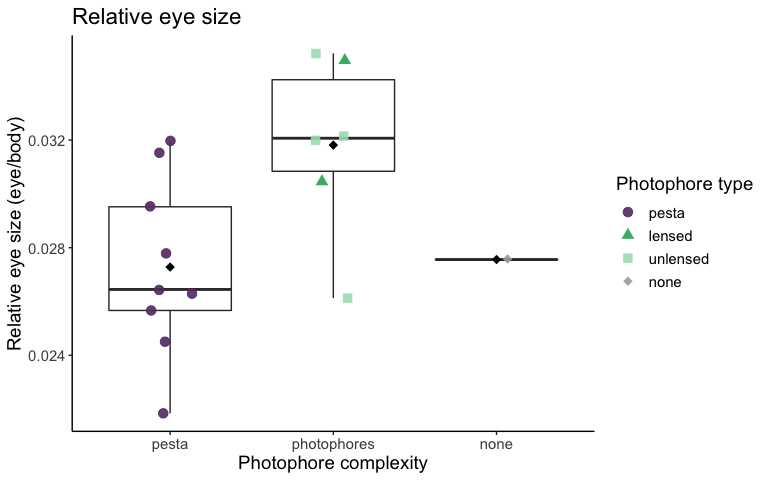
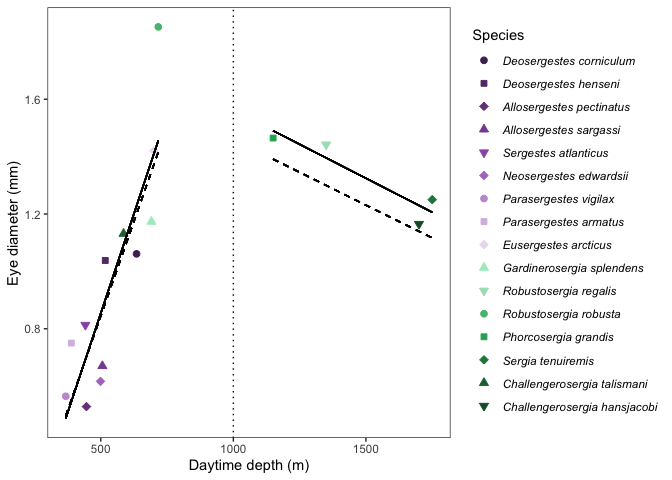

<style type="text/css">

body{ /* Normal  */
      font-size: 17px;
  }
  
</style>


```r
#import specimen data with outliers removed
specimens_ed <- data.frame(read.csv("../Data/cleaned data/specimen_data_tidy_no-outliers.csv", header=TRUE))

#import species trait data
traits <- data.frame(read.csv("../Data/cleaned data/trait_data_tidy.csv", header=TRUE))

#import phylogeny
tree <- read.nexus("../Data/cleaned data/sergestid_tree_pruned")
```

# Evolutionary eye-body allometry in Sergestidae

We next examine evolutionary (interspecific) eye-body allometry across sergestids using species means for eye diameter and body length. We use phylogenetic least-squares regression in _caper_ to fit the allometric relationship between eye size and body length across 16 species of sergestids.


```r
# Prep data ------

#Calculate species means (3 outliers removed)
sp_means <- specimens_ed %>% 
  mutate_if(is.character, as.factor) %>% 
  group_by(genus_species) %>%
  summarise(eye_av = mean(Eye_Diameter), 
            length_av = mean(Body_Length), 
            n = n()) %>%
  ungroup()

#Merge with species trait data stored in dataframe 'species'
species <- traits %>%
  left_join(sp_means, by = "genus_species") %>%
  mutate(Organ = factor(Organ, levels = c("pesta","lensed", "unlensed", "none"))) %>%
  mutate(species_text = as.factor(str_replace(genus_species, "_", " "))) # Add labels for species text 

#check that names match in dataframe and tree
name.check(phy = tree, data = species, data.names = species$genus_species)
  
#use caper function to combine phylogeny and data into one object (this function also matches species names in tree and dataset)
species.comp <- comparative.data(data = species, phy = tree, names.col = "genus_species", vcv = TRUE, na.omit = FALSE, warn.dropped = TRUE)

#check for dropped tips or dropped species
species.comp$dropped$tips #phylogeny
species.comp$dropped$unmatched.rows #dataset

# PGLS model -------

#fit model for eye diameter ~ body length
pgls_evo <- pgls(log10(eye_av) ~ log10(length_av), 
               data = species.comp, 
               lambda = "ML", #uses Maximum Liklihood estimate of lambda
               param.CI = 0.95)

#check model assumptions
par(mar = c(4,4,2,2))
par(mfrow = c(2, 2))
plot(pgls_evo)
```

<!-- -->

```r
par(mfrow = c(1, 1))
```


```r
#print model output 
summary(pgls_evo)
```

```{style="max-height: 300px;"}
## 
## Call:
## pgls(formula = log10(eye_av) ~ log10(length_av), data = species.comp, 
##     lambda = "ML", param.CI = 0.95)
## 
## Residuals:
##       Min        1Q    Median        3Q       Max 
## -0.100464 -0.041912  0.009141  0.044272  0.080878 
## 
## Branch length transformations:
## 
## kappa  [Fix]  : 1.000
## lambda [ ML]  : 1.000
##    lower bound : 0.000, p = 0.077147
##    upper bound : 1.000, p = 1    
##    95.0% CI   : (NA, NA)
## delta  [Fix]  : 1.000
## 
## Coefficients:
##                   Estimate Std. Error t value  Pr(>|t|)    
## (Intercept)      -1.288069   0.147956 -8.7057 5.051e-07 ***
## log10(length_av)  0.822852   0.095634  8.6042 5.810e-07 ***
## ---
## Signif. codes:  0 '***' 0.001 '**' 0.01 '*' 0.05 '.' 0.1 ' ' 1
## 
## Residual standard error: 0.05855 on 14 degrees of freedom
## Multiple R-squared: 0.841,	Adjusted R-squared: 0.8296 
## F-statistic: 74.03 on 1 and 14 DF,  p-value: 5.81e-07
```

```r
#save coefficients of fits as object
cc_pgls_evo <- data.frame(coef(pgls_evo))
```

The PGLS regression shows that eyes scale with body length with a slope of 0.82, indicating that eyes have a negative evolutionary allometry (hypoallometric, slope < 1) with body length. 


```r
#Likelihood plot for Pagel's lambda 
lambda.evo <- pgls.profile(pgls_evo, "lambda")
plot(lambda.evo, main = "Pagel's lambda", 
     sub = "Solid red line indicates estimate for lambda and broken red lines indcaite the 95% confidence interval")
```

<!-- -->

The maximum likelihood estimate of lambda is 1.00 (high phylogenetic signal/Brownian Motion), so that's what _caper_ has used to create the variance-covariance matrix for the regression. However, small sample sizes (< 20-30 data points) have no/little power to estimate lambda (see Freckleton et al., 2002), so tests for phylogenetic signal in this dataset are essentially meaningless (note that the 95% confidence interval for lambda here is 0 to 1, all possible values, and the p-values are non-signficant). For this reason, we should run all of our comparative analyses with fixed values of lambda binning all possiblities (i.e. lambda = 0 and lambda = 1), as we can't estimate the true value of lambda in our small species sample. 


## Lambda fixed at 0 

Below is a PGLS for evolutionary eye-body allometry with lambda fixed at 0 (no phylogenetic signal in model residuals). 


```r
#fit model for eye diameter ~ body length (lambda = 0)
pgls_evo0 <- pgls(log10(eye_av) ~ log10(length_av), 
               data = species.comp, 
               lambda = 0, #set lambda to 0
               bounds=list(lambda=c(0,0)),
               param.CI = 0.95)

#check model assumptions
par(mar = c(4,4,2,2))
par(mfrow = c(2, 2))
plot(pgls_evo0)
```

<!-- -->

```r
par(mfrow = c(1, 1))

#parameter estimates
summary(pgls_evo0)
```

```{style="max-height: 300px;"}
## 
## Call:
## pgls(formula = log10(eye_av) ~ log10(length_av), data = species.comp, 
##     lambda = 0, param.CI = 0.95, bounds = list(lambda = c(0, 
##         0)))
## 
## Residuals:
##       Min        1Q    Median        3Q       Max 
## -0.108877 -0.031123 -0.008501  0.040904  0.086975 
## 
## Branch length transformations:
## 
## kappa  [Fix]  : 1.000
## lambda [Fix]  : 0.000
## delta  [Fix]  : 1.000
## 
## Coefficients:
##                   Estimate Std. Error t value  Pr(>|t|)    
## (Intercept)      -1.431224   0.141272 -10.131 7.949e-08 ***
## log10(length_av)  0.928475   0.091351  10.164 7.636e-08 ***
## ---
## Signif. codes:  0 '***' 0.001 '**' 0.01 '*' 0.05 '.' 0.1 ' ' 1
## 
## Residual standard error: 0.05883 on 14 degrees of freedom
## Multiple R-squared: 0.8807,	Adjusted R-squared: 0.8721 
## F-statistic: 103.3 on 1 and 14 DF,  p-value: 7.636e-08
```

```r
#save coefficients of fits as object
cc_pgls_evo0 <- data.frame(coef(pgls_evo0))
```

## Lambda fixed at 1

Below is a PGLS for evolutionary eye-body allometry with lambda fixed at 1 (high phylogenetic signal in model residuals). 


```r
#fit model for eye diameter ~ body length (lambda = 1)
pgls_evo1 <- pgls(log10(eye_av) ~ log10(length_av), 
               data = species.comp, 
               lambda = 1, #set lambda to 1
               bounds=list(lambda=c(1,1)),
               param.CI = 0.95)

#check model assumptions
par(mar = c(4,4,2,2))
par(mfrow = c(2, 2))
plot(pgls_evo1)
```

<!-- -->

```r
par(mfrow = c(1, 1))

#parameter estimates
summary(pgls_evo1)
```

```{style="max-height: 300px;"}
## 
## Call:
## pgls(formula = log10(eye_av) ~ log10(length_av), data = species.comp, 
##     lambda = 1, param.CI = 0.95, bounds = list(lambda = c(1, 
##         1)))
## 
## Residuals:
##       Min        1Q    Median        3Q       Max 
## -0.100464 -0.041912  0.009141  0.044272  0.080878 
## 
## Branch length transformations:
## 
## kappa  [Fix]  : 1.000
## lambda [Fix]  : 1.000
## delta  [Fix]  : 1.000
## 
## Coefficients:
##                   Estimate Std. Error t value  Pr(>|t|)    
## (Intercept)      -1.288069   0.147956 -8.7057 5.051e-07 ***
## log10(length_av)  0.822852   0.095634  8.6042 5.810e-07 ***
## ---
## Signif. codes:  0 '***' 0.001 '**' 0.01 '*' 0.05 '.' 0.1 ' ' 1
## 
## Residual standard error: 0.05855 on 14 degrees of freedom
## Multiple R-squared: 0.841,	Adjusted R-squared: 0.8296 
## F-statistic: 74.03 on 1 and 14 DF,  p-value: 5.81e-07
```

```r
#save coefficients of fits as object
cc_pgls_evo1 <- data.frame(coef(pgls_evo1))
```
We can plot both estimates of the relationship between eye size and body size onto our data to see the range of possible fits depending on the true value of lambda. 


```r
#Give species unique color/shape combinations, with color groups coordinated to phylogenetic subgroups

#reorder factor levels for figure legend (phylo order)
species$species_text <- factor(species$species_text, 
                                      levels = c("Deosergestes corniculum",
                                                 "Deosergestes henseni",
                                                 "Allosergestes pectinatus",
                                                 "Allosergestes sargassi",
                                                 "Sergestes atlanticus",
                                                 "Neosergestes edwardsii",
                                                 "Parasergestes vigilax",
                                                 "Parasergestes armatus",
                                                 "Eusergestes arcticus",
                                                 "Gardinerosergia splendens",
                                                 "Robustosergia regalis",
                                                 "Robustosergia robusta",
                                                 "Phorcosergia grandis",
                                                 "Sergia tenuiremis",
                                                 "Challengerosergia talismani",
                                                 "Challengerosergia hansjacobi"))

#make shape pallette
shapes.sp <- c("Deosergestes corniculum" = 21,
              "Deosergestes henseni" = 22, 
              "Allosergestes pectinatus" = 23, 
              "Allosergestes sargassi" = 24,
              "Sergestes atlanticus" = 25, 
              "Neosergestes edwardsii"= 23,
              "Parasergestes vigilax" = 21, 
              "Parasergestes armatus" = 22,
              "Eusergestes arcticus" = 23, 
              "Gardinerosergia splendens" = 24, 
              "Robustosergia regalis" = 25, 
              "Robustosergia robusta" = 21, 
              "Phorcosergia grandis" = 22,
              "Sergia tenuiremis" = 23,
              "Challengerosergia talismani" = 24,
               "Challengerosergia hansjacobi" = 25)
 
#rainbow palette
# cols.sp <- c("Deosergestes corniculum" = "#16ABA8",
#               "Deosergestes henseni" = "#1f78b4",
#               "Allosergestes pectinatus" = "#3acf75",
#               "Allosergestes sargassi" = "#33a02c",
#               "Sergestes atlanticus" = "#fb9a99",
#               "Neosergestes edwardsii" = "#C2A8A3",
#               "Parasergestes vigilax" = "#e31a1c",
#               "Parasergestes armatus" = "#fdbf6f",
#               "Eusergestes arcticus" = "#ff7f00",
#               "Gardinerosergia splendens" = "#cab2d6",
#               "Robustosergia regalis" = "#6a3d9a",
#               "Robustosergia robusta" = "gray31",
#               "Phorcosergia grandis" = "burlywood4",
#               "Sergia tenuiremis" = "black",
#               "Challengerosergia talismani" = "maroon1",
#               "Challengerosergia hansjacobi" = "orchid1")

#sergia/sergestes green purple pallette
cols.sp <- c(#Sergestes group
              "Deosergestes corniculum" = "#512E5F",
              "Deosergestes henseni" = "#633974",
              "Allosergestes pectinatus" = "#76448A",
              "Allosergestes sargassi" = "#884EA0",
              "Sergestes atlanticus" = "#9B59B6",
              "Neosergestes edwardsii" = "#AF7AC5",
              "Parasergestes vigilax" = "#C39BD3",
              "Parasergestes armatus" = "#D7BDE2",
              "Eusergestes arcticus" = "#EBDEF0",
             #Sergia group
              "Gardinerosergia splendens" = "#ABEBC6",
              "Robustosergia regalis" = "#A9DFBF",
              "Robustosergia robusta" = "#52BE80",
              "Phorcosergia grandis" = "#27AE60",
              "Sergia tenuiremis" = "#1E8449",
              "Challengerosergia talismani" = "#196F3D",
              "Challengerosergia hansjacobi" = "#145A32")
```


```r
# Make plot 
plot_evo_cols <- ggplot(species, aes(x = Body_length, y = Eye_diameter, color =  species_text, shape = species_text, fill = species_text)) + 
  geom_point(size = 2, alpha = 1) + 
  scale_shape_manual(values = shapes.sp, name = "Species") + 
  scale_color_manual(values = cols.sp, name = "Species") +
  scale_fill_manual(values = cols.sp, name = "Species") +
  scale_x_log10(name = "Body length (mm)") + #makes x axis log scale and named
  scale_y_log10(name = "Eye diameter (mm)", breaks = c(0.5, 0.7, 1, 1.8)) + #makes y axis log scale and named
  theme_bw() +
theme(panel.grid.major = element_blank(), panel.grid.minor = element_blank(), legend.text = element_text(face = "italic")) +
  geom_abline(data = cc_pgls_evo0, aes(intercept = cc_pgls_evo0[1,1], slope = cc_pgls_evo0[2,1]), linetype = "solid") +
  geom_abline(data = cc_pgls_evo1, aes(intercept = cc_pgls_evo1[1,1], slope = cc_pgls_evo1[2,1]), linetype = "dashed")
  

# Interactive plot
ggplotly(plot_evo_cols)
```

```{=html}
<div id="htmlwidget-6a5a5026e30b72e67df9" style="width:768px;height:480px;" class="plotly html-widget"></div>
<script type="application/json" data-for="htmlwidget-6a5a5026e30b72e67df9">{"x":{"data":[{"x":[1.68656179540321],"y":[0.0278024695869028],"text":"Body_length: 48.59167<br />Eye_diameter: 1.0661111<br />species_text: Deosergestes corniculum<br />species_text: Deosergestes corniculum<br />species_text: Deosergestes corniculum","type":"scatter","mode":"markers","marker":{"autocolorscale":false,"color":"rgba(81,46,95,1)","opacity":1,"size":7.55905511811024,"symbol":"circle","line":{"width":1.88976377952756,"color":"rgba(81,46,95,1)"}},"hoveron":"points","name":"Deosergestes corniculum","legendgroup":"Deosergestes corniculum","showlegend":true,"xaxis":"x","yaxis":"y","hoverinfo":"text","frame":null},{"x":[1.60674448447315],"y":[0.0174651152248393],"text":"Body_length: 40.43379<br />Eye_diameter: 1.0410345<br />species_text: Deosergestes henseni<br />species_text: Deosergestes henseni<br />species_text: Deosergestes henseni","type":"scatter","mode":"markers","marker":{"autocolorscale":false,"color":"rgba(99,57,116,1)","opacity":1,"size":7.55905511811024,"symbol":"square","line":{"width":1.88976377952756,"color":"rgba(99,57,116,1)"}},"hoveron":"points","name":"Deosergestes henseni","legendgroup":"Deosergestes henseni","showlegend":true,"xaxis":"x","yaxis":"y","hoverinfo":"text","frame":null},{"x":[1.30059548388996],"y":[-0.281024060681617],"text":"Body_length: 19.98000<br />Eye_diameter: 0.5235714<br />species_text: Allosergestes pectinatus<br />species_text: Allosergestes pectinatus<br />species_text: Allosergestes pectinatus","type":"scatter","mode":"markers","marker":{"autocolorscale":false,"color":"rgba(118,68,138,1)","opacity":1,"size":7.55905511811024,"symbol":"diamond","line":{"width":1.88976377952756,"color":"rgba(118,68,138,1)"}},"hoveron":"points","name":"Allosergestes pectinatus","legendgroup":"Allosergestes pectinatus","showlegend":true,"xaxis":"x","yaxis":"y","hoverinfo":"text","frame":null},{"x":[1.37695615079844],"y":[-0.178727870810471],"text":"Body_length: 23.82079<br />Eye_diameter: 0.6626316<br />species_text: Allosergestes sargassi<br />species_text: Allosergestes sargassi<br />species_text: Allosergestes sargassi","type":"scatter","mode":"markers","marker":{"autocolorscale":false,"color":"rgba(136,78,160,1)","opacity":1,"size":7.55905511811024,"symbol":"triangle-up","line":{"width":1.88976377952756,"color":"rgba(136,78,160,1)"}},"hoveron":"points","name":"Allosergestes sargassi","legendgroup":"Allosergestes sargassi","showlegend":true,"xaxis":"x","yaxis":"y","hoverinfo":"text","frame":null},{"x":[1.4055057258877],"y":[-0.087246696328677],"text":"Body_length: 25.43933<br />Eye_diameter: 0.8180000<br />species_text: Sergestes atlanticus<br />species_text: Sergestes atlanticus<br />species_text: Sergestes atlanticus","type":"scatter","mode":"markers","marker":{"autocolorscale":false,"color":"rgba(155,89,182,1)","opacity":1,"size":7.55905511811024,"symbol":"triangle-down","line":{"width":1.88976377952756,"color":"rgba(155,89,182,1)"}},"hoveron":"points","name":"Sergestes atlanticus","legendgroup":"Sergestes atlanticus","showlegend":true,"xaxis":"x","yaxis":"y","hoverinfo":"text","frame":null},{"x":[1.22762964957101],"y":[-0.198694313693152],"text":"Body_length: 16.89000<br />Eye_diameter: 0.6328571<br />species_text: Neosergestes edwardsii<br />species_text: Neosergestes edwardsii<br />species_text: Neosergestes edwardsii","type":"scatter","mode":"markers","marker":{"autocolorscale":false,"color":"rgba(175,122,197,1)","opacity":1,"size":7.55905511811024,"symbol":"diamond","line":{"width":1.88976377952756,"color":"rgba(175,122,197,1)"}},"hoveron":"points","name":"Neosergestes edwardsii","legendgroup":"Neosergestes edwardsii","showlegend":true,"xaxis":"x","yaxis":"y","hoverinfo":"text","frame":null},{"x":[1.28148788794008],"y":[-0.259637310505756],"text":"Body_length: 19.12000<br />Eye_diameter: 0.5500000<br />species_text: Parasergestes vigilax<br />species_text: Parasergestes vigilax<br />species_text: Parasergestes vigilax","type":"scatter","mode":"markers","marker":{"autocolorscale":false,"color":"rgba(195,155,211,1)","opacity":1,"size":7.55905511811024,"symbol":"circle","line":{"width":1.88976377952756,"color":"rgba(195,155,211,1)"}},"hoveron":"points","name":"Parasergestes vigilax","legendgroup":"Parasergestes vigilax","showlegend":true,"xaxis":"x","yaxis":"y","hoverinfo":"text","frame":null},{"x":[1.48623206085188],"y":[-0.12571150260086],"text":"Body_length: 30.63600<br />Eye_diameter: 0.7486667<br />species_text: Parasergestes armatus<br />species_text: Parasergestes armatus<br />species_text: Parasergestes armatus","type":"scatter","mode":"markers","marker":{"autocolorscale":false,"color":"rgba(215,189,226,1)","opacity":1,"size":7.55905511811024,"symbol":"square","line":{"width":1.88976377952756,"color":"rgba(215,189,226,1)"}},"hoveron":"points","name":"Parasergestes armatus","legendgroup":"Parasergestes armatus","showlegend":true,"xaxis":"x","yaxis":"y","hoverinfo":"text","frame":null},{"x":[1.73239375982297],"y":[0.146128035678238],"text":"Body_length: 54.00000<br />Eye_diameter: 1.4000000<br />species_text: Eusergestes arcticus<br />species_text: Eusergestes arcticus<br />species_text: Eusergestes arcticus","type":"scatter","mode":"markers","marker":{"autocolorscale":false,"color":"rgba(235,222,240,1)","opacity":1,"size":7.55905511811024,"symbol":"diamond","line":{"width":1.88976377952756,"color":"rgba(235,222,240,1)"}},"hoveron":"points","name":"Eusergestes arcticus","legendgroup":"Eusergestes arcticus","showlegend":true,"xaxis":"x","yaxis":"y","hoverinfo":"text","frame":null},{"x":[1.51900248133024],"y":[0.0745900776811261],"text":"Body_length: 33.03714<br />Eye_diameter: 1.1873810<br />species_text: Gardinerosergia splendens<br />species_text: Gardinerosergia splendens<br />species_text: Gardinerosergia splendens","type":"scatter","mode":"markers","marker":{"autocolorscale":false,"color":"rgba(171,235,198,1)","opacity":1,"size":7.55905511811024,"symbol":"triangle-up","line":{"width":1.88976377952756,"color":"rgba(171,235,198,1)"}},"hoveron":"points","name":"Gardinerosergia splendens","legendgroup":"Gardinerosergia splendens","showlegend":true,"xaxis":"x","yaxis":"y","hoverinfo":"text","frame":null},{"x":[1.65375821358531],"y":[0.15955136345263],"text":"Body_length: 45.05658<br />Eye_diameter: 1.4439474<br />species_text: Robustosergia regalis<br />species_text: Robustosergia regalis<br />species_text: Robustosergia regalis","type":"scatter","mode":"markers","marker":{"autocolorscale":false,"color":"rgba(169,223,191,1)","opacity":1,"size":7.55905511811024,"symbol":"triangle-down","line":{"width":1.88976377952756,"color":"rgba(169,223,191,1)"}},"hoveron":"points","name":"Robustosergia regalis","legendgroup":"Robustosergia regalis","showlegend":true,"xaxis":"x","yaxis":"y","hoverinfo":"text","frame":null},{"x":[1.76067155436653],"y":[0.266763269051693],"text":"Body_length: 57.63304<br />Eye_diameter: 1.8482609<br />species_text: Robustosergia robusta<br />species_text: Robustosergia robusta<br />species_text: Robustosergia robusta","type":"scatter","mode":"markers","marker":{"autocolorscale":false,"color":"rgba(82,190,128,1)","opacity":1,"size":7.55905511811024,"symbol":"circle","line":{"width":1.88976377952756,"color":"rgba(82,190,128,1)"}},"hoveron":"points","name":"Robustosergia robusta","legendgroup":"Robustosergia robusta","showlegend":true,"xaxis":"x","yaxis":"y","hoverinfo":"text","frame":null},{"x":[1.74871536846118],"y":[0.166844375831949],"text":"Body_length: 56.06804<br />Eye_diameter: 1.4684000<br />species_text: Phorcosergia grandis<br />species_text: Phorcosergia grandis<br />species_text: Phorcosergia grandis","type":"scatter","mode":"markers","marker":{"autocolorscale":false,"color":"rgba(39,174,96,1)","opacity":1,"size":7.55905511811024,"symbol":"square","line":{"width":1.88976377952756,"color":"rgba(39,174,96,1)"}},"hoveron":"points","name":"Phorcosergia grandis","legendgroup":"Phorcosergia grandis","showlegend":true,"xaxis":"x","yaxis":"y","hoverinfo":"text","frame":null},{"x":[1.65665594845838],"y":[0.100124276522549],"text":"Body_length: 45.35821<br />Eye_diameter: 1.2592857<br />species_text: Sergia tenuiremis<br />species_text: Sergia tenuiremis<br />species_text: Sergia tenuiremis","type":"scatter","mode":"markers","marker":{"autocolorscale":false,"color":"rgba(30,132,73,1)","opacity":1,"size":7.55905511811024,"symbol":"diamond","line":{"width":1.88976377952756,"color":"rgba(30,132,73,1)"}},"hoveron":"points","name":"Sergia tenuiremis","legendgroup":"Sergia tenuiremis","showlegend":true,"xaxis":"x","yaxis":"y","hoverinfo":"text","frame":null},{"x":[1.569889401419],"y":[0.0548762705929864],"text":"Body_length: 37.14406<br />Eye_diameter: 1.1346875<br />species_text: Challengerosergia talismani<br />species_text: Challengerosergia talismani<br />species_text: Challengerosergia talismani","type":"scatter","mode":"markers","marker":{"autocolorscale":false,"color":"rgba(25,111,61,1)","opacity":1,"size":7.55905511811024,"symbol":"triangle-up","line":{"width":1.88976377952756,"color":"rgba(25,111,61,1)"}},"hoveron":"points","name":"Challengerosergia talismani","legendgroup":"Challengerosergia talismani","showlegend":true,"xaxis":"x","yaxis":"y","hoverinfo":"text","frame":null},{"x":[1.52290197437607],"y":[0.0673217659418029],"text":"Body_length: 33.33512<br />Eye_diameter: 1.1676744<br />species_text: Challengerosergia hansjacobi<br />species_text: Challengerosergia hansjacobi<br />species_text: Challengerosergia hansjacobi","type":"scatter","mode":"markers","marker":{"autocolorscale":false,"color":"rgba(20,90,50,1)","opacity":1,"size":7.55905511811024,"symbol":"triangle-down","line":{"width":1.88976377952756,"color":"rgba(20,90,50,1)"}},"hoveron":"points","name":"Challengerosergia hansjacobi","legendgroup":"Challengerosergia hansjacobi","showlegend":true,"xaxis":"x","yaxis":"y","hoverinfo":"text","frame":null},{"x":[1.20097755433123,1.20097755433123,1.7873236496063,1.7873236496063],"y":[-0.316146213137091,-0.316146213137091,0.228261533202124,0.228261533202124],"text":"cc_pgls_evo0[1, 1]: -1.431224<br />cc_pgls_evo0[2, 1]: 0.9284751","type":"scatter","mode":"lines","line":{"width":1.88976377952756,"color":"rgba(0,0,0,1)","dash":"solid"},"hoveron":"points","showlegend":false,"xaxis":"x","yaxis":"y","hoverinfo":"text","frame":null},{"x":[1.20097755433123,1.20097755433123,1.7873236496063,1.7873236496063],"y":[-0.29984236425281,-0.29984236425281,0.182633577301604,0.182633577301604],"text":"cc_pgls_evo1[1, 1]: -1.288069<br />cc_pgls_evo1[2, 1]: 0.8228518","type":"scatter","mode":"lines","line":{"width":1.88976377952756,"color":"rgba(0,0,0,1)","dash":"dash"},"hoveron":"points","showlegend":false,"xaxis":"x","yaxis":"y","hoverinfo":"text","frame":null}],"layout":{"margin":{"t":27.689497716895,"r":7.30593607305936,"b":41.6438356164384,"l":43.1050228310502},"plot_bgcolor":"rgba(255,255,255,1)","paper_bgcolor":"rgba(255,255,255,1)","font":{"color":"rgba(0,0,0,1)","family":"","size":14.6118721461187},"xaxis":{"domain":[0,1],"automargin":true,"type":"linear","autorange":false,"range":[1.20097755433123,1.7873236496063],"tickmode":"array","ticktext":["20","30","50"],"tickvals":[1.30102999566398,1.47712125471966,1.69897000433602],"categoryorder":"array","categoryarray":["20","30","50"],"nticks":null,"ticks":"outside","tickcolor":"rgba(51,51,51,1)","ticklen":3.65296803652968,"tickwidth":0.66417600664176,"showticklabels":true,"tickfont":{"color":"rgba(77,77,77,1)","family":"","size":11.689497716895},"tickangle":-0,"showline":false,"linecolor":null,"linewidth":0,"showgrid":false,"gridcolor":null,"gridwidth":0,"zeroline":false,"anchor":"y","title":{"text":"Body length (mm)","font":{"color":"rgba(0,0,0,1)","family":"","size":14.6118721461187}},"hoverformat":".2f"},"yaxis":{"domain":[0,1],"automargin":true,"type":"linear","autorange":false,"range":[-0.308413427168282,0.294152635538358],"tickmode":"array","ticktext":["0.5","0.7","1.0","1.8"],"tickvals":[-0.301029995663981,-0.154901959985743,0,0.255272505103306],"categoryorder":"array","categoryarray":["0.5","0.7","1.0","1.8"],"nticks":null,"ticks":"outside","tickcolor":"rgba(51,51,51,1)","ticklen":3.65296803652968,"tickwidth":0.66417600664176,"showticklabels":true,"tickfont":{"color":"rgba(77,77,77,1)","family":"","size":11.689497716895},"tickangle":-0,"showline":false,"linecolor":null,"linewidth":0,"showgrid":false,"gridcolor":null,"gridwidth":0,"zeroline":false,"anchor":"x","title":{"text":"Eye diameter (mm)","font":{"color":"rgba(0,0,0,1)","family":"","size":14.6118721461187}},"hoverformat":".2f"},"shapes":[{"type":"rect","fillcolor":"transparent","line":{"color":"rgba(51,51,51,1)","width":0.66417600664176,"linetype":"solid"},"yref":"paper","xref":"paper","x0":0,"x1":1,"y0":0,"y1":1}],"showlegend":true,"legend":{"bgcolor":"rgba(255,255,255,1)","bordercolor":"transparent","borderwidth":1.88976377952756,"font":{"color":"rgba(0,0,0,1)","family":"","size":11.689497716895},"title":{"text":"Species","font":{"color":"rgba(0,0,0,1)","family":"","size":14.6118721461187}}},"hovermode":"closest","barmode":"relative"},"config":{"doubleClick":"reset","modeBarButtonsToAdd":["hoverclosest","hovercompare"],"showSendToCloud":false},"source":"A","attrs":{"6e3f59ff9f2f":{"x":{},"y":{},"colour":{},"shape":{},"fill":{},"type":"scatter"},"6e3f1d2bf4d2":{"intercept":{},"slope":{}},"6e3f30d615f4":{"intercept":{},"slope":{}}},"cur_data":"6e3f59ff9f2f","visdat":{"6e3f59ff9f2f":["function (y) ","x"],"6e3f1d2bf4d2":["function (y) ","x"],"6e3f30d615f4":["function (y) ","x"]},"highlight":{"on":"plotly_click","persistent":false,"dynamic":false,"selectize":false,"opacityDim":0.2,"selected":{"opacity":1},"debounce":0},"shinyEvents":["plotly_hover","plotly_click","plotly_selected","plotly_relayout","plotly_brushed","plotly_brushing","plotly_clickannotation","plotly_doubleclick","plotly_deselect","plotly_afterplot","plotly_sunburstclick"],"base_url":"https://plot.ly"},"evals":[],"jsHooks":[]}</script>
```


```r
#export figure
pdf("../Figures/Fig-2.pdf", width = 7, height = 4)
plot_evo_cols
dev.off()
```


# Correlates of eye size in deep-sea sergestid shrimp

Next, we examine whether variation in eye size is correlated with ecological variables related to light regime and vision: depth, habitat, and bioluminescent organs. 

## Phylogenetic distribution of eye size and ecology

Here, we examine how absolute and relative eye size vary across the sergestid phylogeny, and the corresponding distribution ecological variables. For visualizing relative eye size, we use the residuals of the PGLS fit for evolutionary eye-body allometry, as these show eye size corrected for both body size and evolutionary relationships. (Here we have used the model where lambda = 1, as that was the ML estimate despite being non-significant.)


```r
#Add residuals from PGLS fits to dataframe ----

#extract pgls residuals 
pglsres <- residuals(pgls_evo) 

#name residuals
colnames(pglsres) <- "pglsres" 

#add rownames to species dataframe
rownames(species) <- species$genus_species

#merge residuals with species data by rowname
species.phy <- merge(species, pglsres, by = "row.names") 

#make column converted to observed eye size as factor of PGLS fit
species.phy$eyefactor <- 10^species.phy$pglsres

#make column with factor for pos/neg residuals
species.phy$sign <- ifelse(species.phy$pglsres<0, "neg","pos")

# Prep data ----

#change row names of species data
rownames(species.phy) <- species.phy$genus_species

#check that phylogeny and data match exactly
name.check(tree, species.phy)
```

```{style="max-height: 300px;"}
## [1] "OK"
```

```r
#resort trait dataset to the order of tree tip labels
species.phy <- species.phy[tree$tip.label, ] 

#make trait vector for absolute eye size
aveye <- as.vector(species.phy$eye_av) 
names(aveye) <- species.phy$genus_species

#make trait vector for eye investment (PGLS residuals)
releye <- as.vector(species.phy$pglsres) #residuals of pgls
names(releye) <- species.phy$genus_species

#make vector for bar colors (pos/neg residuals)
col_releye <- c("pos" = "#D3D2D2",
                "neg" = "#807F7F")

#make trait vector for body size
body <- as.vector(species.phy$Body_length)
names(body) <- species.phy$genus_species

# Phylogeny with eye size and investment -------

#color vector for photophores
col_ph <- c("lensed" = "palegreen",
            "none" = "honeydew",
            "pesta" = "cadetblue1",
            "unlensed" = "orchid1")
```

### Eye and body sizes

Here we visualize body sizes (outer circles) and eye sizes (inner circles) across the phylogeny, with colors indicating the two major clades of sergestids (Sergia and Sergestes subgroups). 


```r
# Phylogeny with eye size and body size -------

#color palette for sergia and sergestid clades
col_clade <- c("sergestes" = "#633974",
                "sergia" = "#A9DFBF")

#plot tree with eye investment bars
plotTree.wBars(tree, releye, 
               scale = 1, 
               tip.labels = TRUE,
               col = "transparent",
               border = "transparent",
               offset = 2.9,
               ftype = "bi",
               fsize = 0.7)

#add tip labels for body size
tiplabels(cex = 0.09*body,
          pch = 1,
          col = unname(col_clade[species$Subgroup]),
          offset = 0.15)

#add tip labels for absolute eye size
tiplabels(cex = 1.2*aveye,
          pch = 19, #shape of labels
          col = unname(col_clade[species$Subgroup]),
          offset = 0.15)

#add legend for clade
legend(x = "bottomleft", legend = c("Sergestid group", "Sergia group"), pch = 22, pt.cex= 1.8, pt.bg = col_clade, cex = 0.7, bty = "n", horiz = F)
```

<!-- -->


```r
#Export figure------
pdf("../Figures/Fig-3A.pdf", width = 4.5, height = 7)

#plot tree with eye investment bars
plotTree.wBars(tree, releye, 
               scale = 1, 
               tip.labels = TRUE,
               col = "transparent",
               border = "transparent",
               offset = 2.9,
               ftype = "bi",
               fsize = 0.7)

#add tip labels for body size
tiplabels(cex = 0.09*body,
          pch = 1,
          col = unname(col_clade[species$Subgroup]),
          offset = 0.15)

#add tip labels for absolute eye size
tiplabels(cex = 1.2*aveye,
          pch = 19, #shape of labels
          col = unname(col_clade[species$Subgroup]),
          offset = 0.15)

#add legend for clade
legend(x = "bottomleft", legend = c("Sergestid group", "Sergia group"), pch = 22, pt.cex= 1.8, pt.bg = col_clade, cex = 0.7, bty = "n", horiz = F)

dev.off()
```

### Eye investment (eye-body PGLS residuals)

Here we visualize relative investment in eye size, represented by the residuals of the residuals of the PGLS for eye size vs. body size across species. Positive residuals indicate higher than average investment in eye size, whereas negative residuals indicate relatively small eyes for a given body size. 


```r
#plot tree with eye investment bars
plotTree.wBars(tree, releye, 
               scale = 3.8, 
               tip.labels = FALSE,
               col = unname(col_releye[species.phy$sign]),
               ftype = "bi",
               fsize = 0.7)
```

<!-- -->


```r
#Export figure------
pdf("../Figures/Fig-3C.pdf", width = 4.5, height = 7)

#plot tree with eye investment bars
plotTree.wBars(tree, releye, 
               scale = 3.8, 
               tip.labels = FALSE,
               col = unname(col_releye[species.phy$sign]),
               ftype = "bi",
               fsize = 0.7)

dev.off()
```


### Depth distributions

Here we visualize mean daytime (orange dots), nighttime (blue dots), and maximum (black dots) depth distributions across the phylogeny. Gray bars indicate vertical distance traveled during diel vertical migrations 


```r
#fix node order upset by ladderization

#filter out internal nodes from second column of edge matrix
is_tip <- tree$edge[,2] <= length(tree$tip.label)
ordered_tips <- tree$edge[is_tip, 2]

#extract tips in right order
#tree$tip.label[ordered_tips]

#resort trait dataset to the order of tree tip labels
species.phy <- species.phy[tree$tip.label[ordered_tips], ] 

#make trait vector for day depth av
day <- as.vector(species.phy$Day_Avg) 
names(day) <- species.phy$genus_species

#make trait vector for night depth av
night <- as.vector(species.phy$Night_Avg) 
names(night) <- species.phy$genus_species

#make trait vector for max reported depth
max <- as.vector(species.phy$Max_reported) 
names(max) <- species.phy$genus_species


#Plot tree with depth ranges
plot(tree, 
     show.tip.label= TRUE, 
     font=3, 
     cex=0.9, 
     label.offset = 0.8, 
     edge.width=2)

#add gray bar for difference in day/night depths (migration distance)
segments(1.05 + (day*0.0003), 1:length(day), 1.05 + (night*0.0003), 1:length(night), col="gray", lwd=8)

#add yellow point for day depth
segments(1.05 + (day*0.0003), 1:length(day), 1.05 + (day*0.0003), 1:length(day), col="orange", lwd=10)

#add blue point for night depth
segments(1.05 + (night*0.0003), 1:length(night), 1.05 + (night*0.0003), 1:length(night), col="royalblue2", lwd=10)

#add black point for max depth
segments(1.05 + (max*0.0003), 1:length(max), 1.05 + (max*0.0003), 1:length(max), col="black", lwd=7)
```

<!-- -->


```r
# export figure 
pdf("../Figures/Fig-3D.pdf", width = 8, height = 5.5)

#Plot tree with depth ranges
plot(tree, 
     show.tip.label= TRUE, 
     font=3, 
     cex=0.9, 
     label.offset = 0.8, 
     edge.width=2)

#add gray bar for difference in day/night depths (migration distance)
segments(1.05 + (day*0.0003), 1:length(day), 1.05 + (night*0.0003), 1:length(night), col="gray", lwd=8)

#add yellow point for day depth
segments(1.05 + (day*0.0003), 1:length(day), 1.05 + (day*0.0003), 1:length(day), col="orange", lwd=10)

#add blue point for night depth
segments(1.05 + (night*0.0003), 1:length(night), 1.05 + (night*0.0003), 1:length(night), col="royalblue2", lwd=10)

#add black point for max depth
segments(1.05 + (max*0.0003), 1:length(max), 1.05 + (max*0.0003), 1:length(max), col="black", lwd=7)

dev.off()
```


## Light organ complexity

Here we examine whether eye size is correlated with the complexity of light organs. For this, species were coded as bioluminescent with an organ of pesta present ("pesta"), bioluminescent with only photophores present ("nonpesta"), or light organs not present ("none"). Two models are run with lambda fixed at 0 and 1. 


```r
#recategorize photophore bins
species2 <- species %>%
  mutate(photo2 = recode(Organ, "lensed" = "nonpesta", "unlensed" = "nonpesta")) %>%
  mutate(photo2 = factor(photo2, levels = c("pesta","nonpesta","none")))

#use caper function to combine phylogeny and data into one object (this function also matches species names in tree and dataset)
species.comp2 <- comparative.data(data = species2, phy = tree, names.col = "genus_species", vcv = TRUE, na.omit = FALSE, warn.dropped = TRUE)

#check for dropped tips or dropped species
species.comp2$dropped$tips #phylogeny
species.comp2$dropped$unmatched.rows #dataset
```

### Data visualization

First we can look at the distribution of the data on the phylogeny. 


```r
# Phylogeny with eye size and investment -------

#color palette for photophore groups
col_photo2 <- c("pesta" = "#7b3294",
                "lensed" = "#008837",
                "unlensed" = "#a6dba0",
                "none" = "#A6ACAF")

#plot tree with eye investment bars
plotTree.wBars(tree, releye, 
               scale = 1.5, 
               tip.labels = TRUE,
               col = "gray",
               offset = 1,
               ftype = "bi",
               fsize = 0.7)

#add tip labels for absolute eye size
tiplabels(cex = 1.5*aveye,
          pch = 19, #shape of labels
          col = unname(col_photo2[species2$Organ]),
          offset = 0)

#add legend for photophores
legend(x = "bottomleft", legend = c("pesta", "lensed photophore", "unlensed photophore", "none"), pch = 22, pt.cex= 2, pt.bg = col_photo2, cex = 1, bty = "n", horiz = F)
```


We also examine trends in absolute and relative eye size across light organ complexity states. 


```r
#shapes for photophore groups
sh_photo2 <- c("lensed" = 17, 
                "none" = 18,
                "pesta" = 19,
                "unlensed" = 15)

#color palette for photophore groups
col_photo2 <- c("pesta" = "#633974",
                "lensed" = "#27AE60",
                "unlensed" = "#A9DFBF",
                "none" = "#A6ACAF")

#Boxplots for absolute eye size across photophores -----
plot_abs_photo2 <- ggplot(data = species2, aes(x = factor(photo2, levels=c("pesta", "nonpesta","none")), y = eye_av)) + 
  geom_boxplot(notch = FALSE, outlier.shape = NA, alpha = 0.6) + #controls boxes
  stat_summary(fun.y = mean, colour = "black", geom = "point", shape = 18, size = 3, show_guide = FALSE) + #controls what stats shown
 geom_jitter(aes(x = photo2, y = eye_av, color = Organ, shape = Organ), size = 3, alpha = 0.9, position = position_jitter(0.15)) +
  theme(text = element_text(size=14), panel.background = element_blank(), axis.line = element_line(colour = "black"), legend.key = element_blank()) + #controls background
  scale_color_manual(values = col_photo2, name = "Photophore type", 
                     breaks = c("pesta", "lensed", "unlensed", "none")) +
  scale_shape_manual(values = sh_photo2, name = "Photophore type", 
                     breaks = c("pesta", "lensed", "unlensed", "none")) +
  scale_x_discrete(breaks=c("pesta", "nonpesta","none"), labels=c("pesta", "photophores","none"))+
  xlab("Photophore complexity") +
  ylab("Eye diameter (mm)") +
  ggtitle("Absolute eye size")

plot_abs_photo2
```

<!-- -->

```r
#Boxplots for relative eye size across photophores -----
plot_rel_photo2 <- ggplot(data = species2, aes(x = factor(photo2, levels=c("pesta", "nonpesta","none")), y = eye_av/length_av)) + 
  geom_boxplot(notch = FALSE, outlier.shape = NA, alpha = 0.6) + #controls boxes
  stat_summary(fun.y = mean, colour = "black", geom = "point", shape = 18, size = 3, show_guide = FALSE) + #controls what stats shown
 geom_jitter(aes(x = photo2, y = eye_av/length_av, color = Organ, shape = Organ), size = 3, alpha = 0.9, position = position_jitter(0.15)) +
  theme(text = element_text(size=14), panel.background = element_blank(), axis.line = element_line(colour = "black"), legend.key = element_blank()) + #controls background
  scale_color_manual(values = col_photo2, name = "Photophore type", 
                     breaks = c("pesta", "lensed", "unlensed", "none")) +
  scale_shape_manual(values = sh_photo2, name = "Photophore type", 
                     breaks = c("pesta", "lensed", "unlensed", "none")) +
  scale_x_discrete(breaks=c("pesta", "nonpesta","none"), labels=c("pesta", "photophores","none"))+
  xlab("Photophore complexity") +
  ylab("Relative eye size (eye/body)") +
  ggtitle("Relative eye size")

plot_rel_photo2
```

<!-- -->

```r
#Boxplots for residual eye investment across photophores -----
plot_inv_photo2 <- ggplot(data = species2, aes(x = factor(photo2, levels=c("pesta", "nonpesta","none")), y = pglsres)) + 
  geom_boxplot(notch = FALSE, outlier.shape = NA, alpha = 0.6) + #controls boxes
  stat_summary(fun.y = mean, colour = "black", geom = "point", shape = 18, size = 3, show_guide = FALSE) + #controls what stats shown
 geom_jitter(aes(x = photo2, y = pglsres, color = Organ, shape = Organ), size = 3, alpha = 0.9, position = position_jitter(0.15)) +
  theme(text = element_text(size=14), panel.background = element_blank(), axis.line = element_line(colour = "black"), legend.key = element_blank()) + #controls background
  scale_color_manual(values = col_photo2, name = "Photophore type", 
                     breaks = c("pesta", "lensed", "unlensed", "none")) +
  scale_shape_manual(values = sh_photo2, name = "Photophore type", 
                     breaks = c("pesta", "lensed", "unlensed", "none")) +
  scale_x_discrete(breaks=c("pesta", "nonpesta","none"), labels=c("pesta", "photophores","none"))+
  xlab("Photophore complexity") +
  ylab("Eye ~ body residuals") +
  ggtitle("Residual eye investment")

plot_inv_photo2
```

<!-- -->


```r
# Export figure

#name panels
fig.a <- plot_abs_photo2 + theme(legend.position = "none") + ggtitle("")  + xlab("")
fig.b <- plot_rel_photo2 + theme(legend.position = "none") + ggtitle("") + xlab("")
fig.c <- plot_inv_photo2 + theme(legend.position = "none") + ggtitle("") + xlab("")

#arrange plots in panels
plots <- plot_grid(fig.a, fig.b, fig.c, #list of plots to arrange in grid
           align = 'vh', #align horizontally and vertically
           axis = 'lb',
           labels = c("A", "B", "C"), #panel labels for figure
           hjust = -1, #adjustment for panel labels
           nrow = 1) #number of rows in grids

# extract legend from Rana temporaria figure
leg <- get_legend(fig.a + theme(legend.position="right"))


#export figure
pdf("../Figures/Fig-4.pdf", width = 12, height = 4)
plot_grid(plots, leg, nrow = 1, rel_widths = c(1, .2))
dev.off()
```


### Absolute eye size vs. light organ type (pesta, nonpesta, none)

Here we run PGLS models of absolute eye diameter vs. organ type. Again, we run separate models for lambda = 1 and for lambda = 0.  

#### Model with lambda = 0


```r
#fit model for eye diameter ~ body length (lambda = 0)
pgls_photo0_bin_abs <- pgls(eye_av ~ photo2, 
               data = species.comp2, 
               lambda = 0.00001, #set lambda to 0
               bounds=list(lambda=c(0.00001,0.00001)),
               param.CI = 0.95)

#check model assumptions
par(mar = c(4,4,2,2))
par(mfrow = c(2, 2))
plot(pgls_photo0_bin_abs)
```

<!-- -->

```r
par(mfrow = c(1, 1))

#main effects
anova(pgls_photo0_bin_abs)
```

```{style="max-height: 300px;"}
## Analysis of Variance Table
## Sequential SS for pgls: lambda = 0.00, delta = 1.00, kappa = 1.00
## 
## Response: eye_av
##           Df Sum Sq Mean Sq F value  Pr(>F)  
## photo2     2 1.0975 0.54874  6.6791 0.01011 *
## Residuals 13 1.0680 0.08216                  
## ---
## Signif. codes:  0 '***' 0.001 '**' 0.01 '*' 0.05 '.' 0.1 ' ' 1
```

```r
#parameter estimates
summary(pgls_photo0_bin_abs)
```

```{style="max-height: 300px;"}
## 
## Call:
## pgls(formula = eye_av ~ photo2, data = species.comp2, lambda = 1e-05, 
##     param.CI = 0.95, bounds = list(lambda = c(1e-05, 1e-05)))
## 
## Residuals:
##      Min       1Q   Median       3Q      Max 
## -0.57426 -0.26318 -0.03726  0.13291  0.39016 
## 
## Branch length transformations:
## 
## kappa  [Fix]  : 1.000
## lambda [Fix]  : 0.000
## delta  [Fix]  : 1.000
## 
## Coefficients:
##                Estimate Std. Error t value  Pr(>|t|)    
## (Intercept)    0.829177   0.095544  8.6785 9.072e-07 ***
## photo2nonpesta 0.542243   0.151069  3.5894  0.003298 ** 
## photo2none     0.420823   0.302137  1.3928  0.187036    
## ---
## Signif. codes:  0 '***' 0.001 '**' 0.01 '*' 0.05 '.' 0.1 ' ' 1
## 
## Residual standard error: 0.2866 on 13 degrees of freedom
## Multiple R-squared: 0.5068,	Adjusted R-squared: 0.4309 
## F-statistic: 6.679 on 2 and 13 DF,  p-value: 0.01011
```
When lambda = 0, there is a significant effect of photophore type on absolute eye size, and the contrasts show that species with organs of pesta have significantly smaller mean relative eye sizes than those with other types of organ. 

#### Model with lambda = 1


```r
#fit model for eye diameter ~ body length (lambda = 1)
pgls_photo1_bin_abs <- pgls(eye_av ~ photo2, 
               data = species.comp2, 
               lambda = 1, #set lambda to 1
               bounds=list(lambda=c(1,1)),
               param.CI = 0.95)

#check model assumptions
par(mar = c(4,4,2,2))
par(mfrow = c(2, 2))
plot(pgls_photo1_bin_abs)
```

<!-- -->

```r
par(mfrow = c(1, 1))

#main effects
anova(pgls_photo1_bin_abs)
```

```{style="max-height: 300px;"}
## Analysis of Variance Table
## Sequential SS for pgls: lambda = 1.00, delta = 1.00, kappa = 1.00
## 
## Response: eye_av
##           Df  Sum Sq  Mean Sq F value Pr(>F)
## photo2     2 0.50453 0.252266  2.7004 0.1045
## Residuals 13 1.21443 0.093418
```

```r
#parameter estimates
summary(pgls_photo1_bin_abs)
```

```{style="max-height: 300px;"}
## 
## Call:
## pgls(formula = eye_av ~ photo2, data = species.comp2, lambda = 1, 
##     param.CI = 0.95, bounds = list(lambda = c(1, 1)))
## 
## Residuals:
##      Min       1Q   Median       3Q      Max 
## -0.56167 -0.26508 -0.06907  0.06838  0.29391 
## 
## Branch length transformations:
## 
## kappa  [Fix]  : 1.000
## lambda [Fix]  : 1.000
## delta  [Fix]  : 1.000
## 
## Coefficients:
##                Estimate Std. Error t value  Pr(>|t|)    
## (Intercept)     0.87918    0.12904  6.8135 1.237e-05 ***
## photo2nonpesta  0.49215    0.21405  2.2992   0.03871 *  
## photo2none      0.33982    0.30171  1.1263   0.28039    
## ---
## Signif. codes:  0 '***' 0.001 '**' 0.01 '*' 0.05 '.' 0.1 ' ' 1
## 
## Residual standard error: 0.3056 on 13 degrees of freedom
## Multiple R-squared: 0.2935,	Adjusted R-squared: 0.1848 
## F-statistic:   2.7 on 2 and 13 DF,  p-value: 0.1045
```
When lambda = 1, there is no significant effect of photophore type on absolute eye size.

### Relative eye size vs. organ type

Here we a model log10(eye diameter) vs. log10(body length) + photophore type. Two PGLS models are fit with lambda = 0 and lambda = 1. 

#### Model where lambda = 0


```r
#fit model for eye diameter ~ body length (lambda = 0)
pgls_photo0_bin <- pgls(log10(eye_av) ~ log10(length_av) + photo2, 
               data = species.comp2, 
               lambda = 0.00001, #set lambda to 0
               bounds=list(lambda=c(0.00001,0.00001)),
               param.CI = 0.95)

#check model assumptions
par(mar = c(4,4,2,2))
par(mfrow = c(2, 2))
plot(pgls_photo0_bin)
```

<!-- -->

```r
par(mfrow = c(1, 1))

#main effects
anova(pgls_photo0_bin)
```

```{style="max-height: 300px;"}
## Analysis of Variance Table
## Sequential SS for pgls: lambda = 0.00, delta = 1.00, kappa = 1.00
## 
## Response: log10(eye_av)
##                  Df  Sum Sq Mean Sq  F value    Pr(>F)    
## log10(length_av)  1 0.35757 0.35757 231.3046 3.318e-09 ***
## photo2            2 0.02991 0.01495   9.6737  0.003147 ** 
## Residuals        12 0.01855 0.00155                       
## ---
## Signif. codes:  0 '***' 0.001 '**' 0.01 '*' 0.05 '.' 0.1 ' ' 1
```

```r
#parameter estimates
summary(pgls_photo0_bin)
```

```{style="max-height: 300px;"}
## 
## Call:
## pgls(formula = log10(eye_av) ~ log10(length_av) + photo2, data = species.comp2, 
##     lambda = 1e-05, param.CI = 0.95, bounds = list(lambda = c(1e-05, 
##         1e-05)))
## 
## Residuals:
##       Min        1Q    Median        3Q       Max 
## -0.084884 -0.027957 -0.003879  0.013108  0.042196 
## 
## Branch length transformations:
## 
## kappa  [Fix]  : 1.000
## lambda [Fix]  : 0.000
## delta  [Fix]  : 1.000
## 
## Coefficients:
##                   Estimate Std. Error  t value  Pr(>|t|)    
## (Intercept)      -1.237405   0.105786 -11.6973 6.425e-08 ***
## log10(length_av)  0.774819   0.071712  10.8045 1.543e-07 ***
## photo2nonpesta    0.104921   0.023898   4.3904 0.0008801 ***
## photo2none        0.050714   0.043692   1.1607 0.2683199    
## ---
## Signif. codes:  0 '***' 0.001 '**' 0.01 '*' 0.05 '.' 0.1 ' ' 1
## 
## Residual standard error: 0.03932 on 12 degrees of freedom
## Multiple R-squared: 0.9543,	Adjusted R-squared: 0.9429 
## F-statistic: 83.55 on 3 and 12 DF,  p-value: 2.614e-08
```
Photophore type has a significant effect on relative eye size when lambda = 0. 

#### Model where lambda = 1


```r
#fit model for eye diameter ~ body length (lambda = 1)
pgls_photo1_bin <- pgls(log10(eye_av) ~ log10(length_av) + photo2, 
               data = species.comp2, 
               lambda = 1, #set lambda to 1
               bounds=list(lambda=c(1,1)),
               param.CI = 0.95)

#check model assumptions
par(mar = c(4,4,2,2))
par(mfrow = c(2, 2))
plot(pgls_photo1_bin)
```

<!-- -->

```r
par(mfrow = c(1, 1))

#main effects
anova(pgls_photo1_bin)
```

```{style="max-height: 300px;"}
## Analysis of Variance Table
## Sequential SS for pgls: lambda = 1.00, delta = 1.00, kappa = 1.00
## 
## Response: log10(eye_av)
##                  Df   Sum Sq  Mean Sq  F value    Pr(>F)    
## log10(length_av)  1 0.253779 0.253779 115.4961 1.636e-07 ***
## photo2            2 0.021624 0.010812   4.9206   0.02751 *  
## Residuals        12 0.026368 0.002197                       
## ---
## Signif. codes:  0 '***' 0.001 '**' 0.01 '*' 0.05 '.' 0.1 ' ' 1
```

```r
#coefficients and contrasts
summary(pgls_photo1_bin)
```

```{style="max-height: 300px;"}
## 
## Call:
## pgls(formula = log10(eye_av) ~ log10(length_av) + photo2, data = species.comp2, 
##     lambda = 1, param.CI = 0.95, bounds = list(lambda = c(1, 
##         1)))
## 
## Residuals:
##      Min       1Q   Median       3Q      Max 
## -0.06902 -0.02289 -0.00536  0.03717  0.06538 
## 
## Branch length transformations:
## 
## kappa  [Fix]  : 1.000
## lambda [Fix]  : 1.000
## delta  [Fix]  : 1.000
## 
## Coefficients:
##                   Estimate Std. Error t value  Pr(>|t|)    
## (Intercept)      -1.191766   0.122725 -9.7109 4.912e-07 ***
## log10(length_av)  0.744165   0.080955  9.1923 8.827e-07 ***
## photo2nonpesta    0.106186   0.034696  3.0605   0.00989 ** 
## photo2none        0.066568   0.047496  1.4016   0.18638    
## ---
## Signif. codes:  0 '***' 0.001 '**' 0.01 '*' 0.05 '.' 0.1 ' ' 1
## 
## Residual standard error: 0.04688 on 12 degrees of freedom
## Multiple R-squared: 0.9126,	Adjusted R-squared: 0.8908 
## F-statistic: 41.78 on 3 and 12 DF,  p-value: 1.255e-06
```

We find that organ type (organ of pesta, no organ of pesta, no photophores at all), has a significant effect on eye size in both models (lambda = 1 and lambda = 0).


## Depth distributions

Here we explore whether eye size correlates with daytime, nighttime, or maximum depth distributions, or the distance traversed during vertical migrations. 

### Data visualization

Here we inspect the distribution of our data with scatter plots for absolute and relative eye size and body size vs. daytime and nighttime depth. In the below interactive plots, daytime depths are orange and nighttime depths are blue. Maximum reported depths are in black squares. Depth is not logged. 

#### Absolute eye size with depth


```r
# Absolute eye size with depths
plot_abs_depths <- ggplot(species.phy, aes(y = eye_av, x = Day_Avg, text = genus_species)) + 
  geom_point(size = 2, alpha = 0.8, col = "orange") + 
  xlab("Depth (m)") +
  ylab("Eye diameter (mm)") + 
  theme_bw() +
  theme(panel.grid.major = element_blank(), panel.grid.minor = element_blank()) +
  geom_point(aes(y = eye_av, x = Night_Avg), size = 2, alpha = 0.8, col = "royalblue2") +
  geom_point(aes(y = eye_av, x = Max_reported), size = 1.5, alpha = 0.8, pch = 15, col = "black")

ggplotly(plot_abs_depths)
```

```{=html}
<div id="htmlwidget-d41adcbc3b2a0b6c509c" style="width:768px;height:480px;" class="plotly html-widget"></div>
<script type="application/json" data-for="htmlwidget-d41adcbc3b2a0b6c509c">{"x":{"data":[{"x":[1700,586,1750,1150,717,1350,691,700,389,368,499,442,506,446,517,635],"y":[1.16511627906977,1.13125,1.25,1.46470588235294,1.85217391304348,1.44210526315789,1.17317073170732,1.42,0.75,0.564705882352941,0.616666666666667,0.813333333333333,0.67027027027027,0.528571428571429,1.03793103448276,1.06111111111111],"text":["Day_Avg: 1700<br />eye_av: 1.1651163<br />Challengerosergia_hansjacobi","Day_Avg:  586<br />eye_av: 1.1312500<br />Challengerosergia_talismani","Day_Avg: 1750<br />eye_av: 1.2500000<br />Sergia_tenuiremis","Day_Avg: 1150<br />eye_av: 1.4647059<br />Phorcosergia_grandis","Day_Avg:  717<br />eye_av: 1.8521739<br />Robustosergia_robusta","Day_Avg: 1350<br />eye_av: 1.4421053<br />Robustosergia_regalis","Day_Avg:  691<br />eye_av: 1.1731707<br />Gardinerosergia_splendens","Day_Avg:  700<br />eye_av: 1.4200000<br />Eusergestes_arcticus","Day_Avg:  389<br />eye_av: 0.7500000<br />Parasergestes_armatus","Day_Avg:  368<br />eye_av: 0.5647059<br />Parasergestes_vigilax","Day_Avg:  499<br />eye_av: 0.6166667<br />Neosergestes_edwardsii","Day_Avg:  442<br />eye_av: 0.8133333<br />Sergestes_atlanticus","Day_Avg:  506<br />eye_av: 0.6702703<br />Allosergestes_sargassi","Day_Avg:  446<br />eye_av: 0.5285714<br />Allosergestes_pectinatus","Day_Avg:  517<br />eye_av: 1.0379310<br />Deosergestes_henseni","Day_Avg:  635<br />eye_av: 1.0611111<br />Deosergestes_corniculum"],"type":"scatter","mode":"markers","marker":{"autocolorscale":false,"color":"rgba(255,165,0,1)","opacity":0.8,"size":7.55905511811024,"symbol":"circle","line":{"width":1.88976377952756,"color":"rgba(255,165,0,1)"}},"hoveron":"points","showlegend":false,"xaxis":"x","yaxis":"y","hoverinfo":"text","frame":null},{"x":[350,158,1250,350,304,300,149,330,223,160,133,160,133,146,141,196],"y":[1.16511627906977,1.13125,1.25,1.46470588235294,1.85217391304348,1.44210526315789,1.17317073170732,1.42,0.75,0.564705882352941,0.616666666666667,0.813333333333333,0.67027027027027,0.528571428571429,1.03793103448276,1.06111111111111],"text":["Night_Avg:  350<br />eye_av: 1.1651163<br />Challengerosergia_hansjacobi","Night_Avg:  158<br />eye_av: 1.1312500<br />Challengerosergia_talismani","Night_Avg: 1250<br />eye_av: 1.2500000<br />Sergia_tenuiremis","Night_Avg:  350<br />eye_av: 1.4647059<br />Phorcosergia_grandis","Night_Avg:  304<br />eye_av: 1.8521739<br />Robustosergia_robusta","Night_Avg:  300<br />eye_av: 1.4421053<br />Robustosergia_regalis","Night_Avg:  149<br />eye_av: 1.1731707<br />Gardinerosergia_splendens","Night_Avg:  330<br />eye_av: 1.4200000<br />Eusergestes_arcticus","Night_Avg:  223<br />eye_av: 0.7500000<br />Parasergestes_armatus","Night_Avg:  160<br />eye_av: 0.5647059<br />Parasergestes_vigilax","Night_Avg:  133<br />eye_av: 0.6166667<br />Neosergestes_edwardsii","Night_Avg:  160<br />eye_av: 0.8133333<br />Sergestes_atlanticus","Night_Avg:  133<br />eye_av: 0.6702703<br />Allosergestes_sargassi","Night_Avg:  146<br />eye_av: 0.5285714<br />Allosergestes_pectinatus","Night_Avg:  141<br />eye_av: 1.0379310<br />Deosergestes_henseni","Night_Avg:  196<br />eye_av: 1.0611111<br />Deosergestes_corniculum"],"type":"scatter","mode":"markers","marker":{"autocolorscale":false,"color":"rgba(67,110,238,1)","opacity":0.8,"size":7.55905511811024,"symbol":"circle","line":{"width":1.88976377952756,"color":"rgba(67,110,238,1)"}},"hoveron":"points","showlegend":false,"xaxis":"x","yaxis":"y","hoverinfo":"text","frame":null},{"x":[1700,2000,2000,2300,2300,2000,2000,1000,850,950,1000,2000,900,1300,1500,2000],"y":[1.16511627906977,1.13125,1.25,1.46470588235294,1.85217391304348,1.44210526315789,1.17317073170732,1.42,0.75,0.564705882352941,0.616666666666667,0.813333333333333,0.67027027027027,0.528571428571429,1.03793103448276,1.06111111111111],"text":["Max_reported: 1700<br />eye_av: 1.1651163<br />Challengerosergia_hansjacobi","Max_reported: 2000<br />eye_av: 1.1312500<br />Challengerosergia_talismani","Max_reported: 2000<br />eye_av: 1.2500000<br />Sergia_tenuiremis","Max_reported: 2300<br />eye_av: 1.4647059<br />Phorcosergia_grandis","Max_reported: 2300<br />eye_av: 1.8521739<br />Robustosergia_robusta","Max_reported: 2000<br />eye_av: 1.4421053<br />Robustosergia_regalis","Max_reported: 2000<br />eye_av: 1.1731707<br />Gardinerosergia_splendens","Max_reported: 1000<br />eye_av: 1.4200000<br />Eusergestes_arcticus","Max_reported:  850<br />eye_av: 0.7500000<br />Parasergestes_armatus","Max_reported:  950<br />eye_av: 0.5647059<br />Parasergestes_vigilax","Max_reported: 1000<br />eye_av: 0.6166667<br />Neosergestes_edwardsii","Max_reported: 2000<br />eye_av: 0.8133333<br />Sergestes_atlanticus","Max_reported:  900<br />eye_av: 0.6702703<br />Allosergestes_sargassi","Max_reported: 1300<br />eye_av: 0.5285714<br />Allosergestes_pectinatus","Max_reported: 1500<br />eye_av: 1.0379310<br />Deosergestes_henseni","Max_reported: 2000<br />eye_av: 1.0611111<br />Deosergestes_corniculum"],"type":"scatter","mode":"markers","marker":{"autocolorscale":false,"color":"rgba(0,0,0,1)","opacity":0.8,"size":5.66929133858268,"symbol":"square","line":{"width":1.88976377952756,"color":"rgba(0,0,0,1)"}},"hoveron":"points","showlegend":false,"xaxis":"x","yaxis":"y","hoverinfo":"text","frame":null}],"layout":{"margin":{"t":27.689497716895,"r":7.30593607305936,"b":41.6438356164384,"l":43.1050228310502},"plot_bgcolor":"rgba(255,255,255,1)","paper_bgcolor":"rgba(255,255,255,1)","font":{"color":"rgba(0,0,0,1)","family":"","size":14.6118721461187},"xaxis":{"domain":[0,1],"automargin":true,"type":"linear","autorange":false,"range":[24.65,2408.35],"tickmode":"array","ticktext":["500","1000","1500","2000"],"tickvals":[500,1000,1500,2000],"categoryorder":"array","categoryarray":["500","1000","1500","2000"],"nticks":null,"ticks":"outside","tickcolor":"rgba(51,51,51,1)","ticklen":3.65296803652968,"tickwidth":0.66417600664176,"showticklabels":true,"tickfont":{"color":"rgba(77,77,77,1)","family":"","size":11.689497716895},"tickangle":-0,"showline":false,"linecolor":null,"linewidth":0,"showgrid":false,"gridcolor":null,"gridwidth":0,"zeroline":false,"anchor":"y","title":{"text":"Depth (m)","font":{"color":"rgba(0,0,0,1)","family":"","size":14.6118721461187}},"hoverformat":".2f"},"yaxis":{"domain":[0,1],"automargin":true,"type":"linear","autorange":false,"range":[0.462391304347826,1.91835403726708],"tickmode":"array","ticktext":["0.5","1.0","1.5"],"tickvals":[0.5,1,1.5],"categoryorder":"array","categoryarray":["0.5","1.0","1.5"],"nticks":null,"ticks":"outside","tickcolor":"rgba(51,51,51,1)","ticklen":3.65296803652968,"tickwidth":0.66417600664176,"showticklabels":true,"tickfont":{"color":"rgba(77,77,77,1)","family":"","size":11.689497716895},"tickangle":-0,"showline":false,"linecolor":null,"linewidth":0,"showgrid":false,"gridcolor":null,"gridwidth":0,"zeroline":false,"anchor":"x","title":{"text":"Eye diameter (mm)","font":{"color":"rgba(0,0,0,1)","family":"","size":14.6118721461187}},"hoverformat":".2f"},"shapes":[{"type":"rect","fillcolor":"transparent","line":{"color":"rgba(51,51,51,1)","width":0.66417600664176,"linetype":"solid"},"yref":"paper","xref":"paper","x0":0,"x1":1,"y0":0,"y1":1}],"showlegend":false,"legend":{"bgcolor":"rgba(255,255,255,1)","bordercolor":"transparent","borderwidth":1.88976377952756,"font":{"color":"rgba(0,0,0,1)","family":"","size":11.689497716895}},"hovermode":"closest","barmode":"relative"},"config":{"doubleClick":"reset","modeBarButtonsToAdd":["hoverclosest","hovercompare"],"showSendToCloud":false},"source":"A","attrs":{"6e3f2fcce1bd":{"x":{},"y":{},"text":{},"type":"scatter"},"6e3f33f857cf":{"x":{},"y":{},"text":{}},"6e3f754cf1b0":{"x":{},"y":{},"text":{}}},"cur_data":"6e3f2fcce1bd","visdat":{"6e3f2fcce1bd":["function (y) ","x"],"6e3f33f857cf":["function (y) ","x"],"6e3f754cf1b0":["function (y) ","x"]},"highlight":{"on":"plotly_click","persistent":false,"dynamic":false,"selectize":false,"opacityDim":0.2,"selected":{"opacity":1},"debounce":0},"shinyEvents":["plotly_hover","plotly_click","plotly_selected","plotly_relayout","plotly_brushed","plotly_brushing","plotly_clickannotation","plotly_doubleclick","plotly_deselect","plotly_afterplot","plotly_sunburstclick"],"base_url":"https://plot.ly"},"evals":[],"jsHooks":[]}</script>
```

#### Body size with depth


```r
# Body size with depth
plot_length_depths <- ggplot(species.phy, aes(y = length_av, x = Day_Avg, text = genus_species)) + 
  geom_point(size = 2, alpha = 0.8, col = "orange") + 
  xlab("Depth (m)") + 
  ylab("Body length (mm)") + 
  theme_bw() +
  theme(panel.grid.major = element_blank(), panel.grid.minor = element_blank()) +
  geom_point(aes(y = length_av, x = Night_Avg), size = 2, alpha = 0.8, col = "royalblue2")+
  geom_point(aes(y = length_av, x = Max_reported), size = 1.5, alpha = 0.8, pch = 15, col = "black")

ggplotly(plot_length_depths)
```

```{=html}
<div id="htmlwidget-c7b85c2a1084ab31ae08" style="width:768px;height:480px;" class="plotly html-widget"></div>
<script type="application/json" data-for="htmlwidget-c7b85c2a1084ab31ae08">{"x":{"data":[{"x":[1700,586,1750,1150,717,1350,691,700,389,368,499,442,506,446,517,635],"y":[33.3372093023256,37.146875,45.3571428571429,56.0686274509804,57.6391304347826,45.0578947368421,33.3048780487805,54.02,30.63,19.1294117647059,19.5666666666667,25.4533333333333,24.1135135135135,19.9857142857143,40.4396551724138,48.5833333333333],"text":["Day_Avg: 1700<br />length_av: 33.33721<br />Challengerosergia_hansjacobi","Day_Avg:  586<br />length_av: 37.14688<br />Challengerosergia_talismani","Day_Avg: 1750<br />length_av: 45.35714<br />Sergia_tenuiremis","Day_Avg: 1150<br />length_av: 56.06863<br />Phorcosergia_grandis","Day_Avg:  717<br />length_av: 57.63913<br />Robustosergia_robusta","Day_Avg: 1350<br />length_av: 45.05789<br />Robustosergia_regalis","Day_Avg:  691<br />length_av: 33.30488<br />Gardinerosergia_splendens","Day_Avg:  700<br />length_av: 54.02000<br />Eusergestes_arcticus","Day_Avg:  389<br />length_av: 30.63000<br />Parasergestes_armatus","Day_Avg:  368<br />length_av: 19.12941<br />Parasergestes_vigilax","Day_Avg:  499<br />length_av: 19.56667<br />Neosergestes_edwardsii","Day_Avg:  442<br />length_av: 25.45333<br />Sergestes_atlanticus","Day_Avg:  506<br />length_av: 24.11351<br />Allosergestes_sargassi","Day_Avg:  446<br />length_av: 19.98571<br />Allosergestes_pectinatus","Day_Avg:  517<br />length_av: 40.43966<br />Deosergestes_henseni","Day_Avg:  635<br />length_av: 48.58333<br />Deosergestes_corniculum"],"type":"scatter","mode":"markers","marker":{"autocolorscale":false,"color":"rgba(255,165,0,1)","opacity":0.8,"size":7.55905511811024,"symbol":"circle","line":{"width":1.88976377952756,"color":"rgba(255,165,0,1)"}},"hoveron":"points","showlegend":false,"xaxis":"x","yaxis":"y","hoverinfo":"text","frame":null},{"x":[350,158,1250,350,304,300,149,330,223,160,133,160,133,146,141,196],"y":[33.3372093023256,37.146875,45.3571428571429,56.0686274509804,57.6391304347826,45.0578947368421,33.3048780487805,54.02,30.63,19.1294117647059,19.5666666666667,25.4533333333333,24.1135135135135,19.9857142857143,40.4396551724138,48.5833333333333],"text":["Night_Avg:  350<br />length_av: 33.33721<br />Challengerosergia_hansjacobi","Night_Avg:  158<br />length_av: 37.14688<br />Challengerosergia_talismani","Night_Avg: 1250<br />length_av: 45.35714<br />Sergia_tenuiremis","Night_Avg:  350<br />length_av: 56.06863<br />Phorcosergia_grandis","Night_Avg:  304<br />length_av: 57.63913<br />Robustosergia_robusta","Night_Avg:  300<br />length_av: 45.05789<br />Robustosergia_regalis","Night_Avg:  149<br />length_av: 33.30488<br />Gardinerosergia_splendens","Night_Avg:  330<br />length_av: 54.02000<br />Eusergestes_arcticus","Night_Avg:  223<br />length_av: 30.63000<br />Parasergestes_armatus","Night_Avg:  160<br />length_av: 19.12941<br />Parasergestes_vigilax","Night_Avg:  133<br />length_av: 19.56667<br />Neosergestes_edwardsii","Night_Avg:  160<br />length_av: 25.45333<br />Sergestes_atlanticus","Night_Avg:  133<br />length_av: 24.11351<br />Allosergestes_sargassi","Night_Avg:  146<br />length_av: 19.98571<br />Allosergestes_pectinatus","Night_Avg:  141<br />length_av: 40.43966<br />Deosergestes_henseni","Night_Avg:  196<br />length_av: 48.58333<br />Deosergestes_corniculum"],"type":"scatter","mode":"markers","marker":{"autocolorscale":false,"color":"rgba(67,110,238,1)","opacity":0.8,"size":7.55905511811024,"symbol":"circle","line":{"width":1.88976377952756,"color":"rgba(67,110,238,1)"}},"hoveron":"points","showlegend":false,"xaxis":"x","yaxis":"y","hoverinfo":"text","frame":null},{"x":[1700,2000,2000,2300,2300,2000,2000,1000,850,950,1000,2000,900,1300,1500,2000],"y":[33.3372093023256,37.146875,45.3571428571429,56.0686274509804,57.6391304347826,45.0578947368421,33.3048780487805,54.02,30.63,19.1294117647059,19.5666666666667,25.4533333333333,24.1135135135135,19.9857142857143,40.4396551724138,48.5833333333333],"text":["Max_reported: 1700<br />length_av: 33.33721<br />Challengerosergia_hansjacobi","Max_reported: 2000<br />length_av: 37.14688<br />Challengerosergia_talismani","Max_reported: 2000<br />length_av: 45.35714<br />Sergia_tenuiremis","Max_reported: 2300<br />length_av: 56.06863<br />Phorcosergia_grandis","Max_reported: 2300<br />length_av: 57.63913<br />Robustosergia_robusta","Max_reported: 2000<br />length_av: 45.05789<br />Robustosergia_regalis","Max_reported: 2000<br />length_av: 33.30488<br />Gardinerosergia_splendens","Max_reported: 1000<br />length_av: 54.02000<br />Eusergestes_arcticus","Max_reported:  850<br />length_av: 30.63000<br />Parasergestes_armatus","Max_reported:  950<br />length_av: 19.12941<br />Parasergestes_vigilax","Max_reported: 1000<br />length_av: 19.56667<br />Neosergestes_edwardsii","Max_reported: 2000<br />length_av: 25.45333<br />Sergestes_atlanticus","Max_reported:  900<br />length_av: 24.11351<br />Allosergestes_sargassi","Max_reported: 1300<br />length_av: 19.98571<br />Allosergestes_pectinatus","Max_reported: 1500<br />length_av: 40.43966<br />Deosergestes_henseni","Max_reported: 2000<br />length_av: 48.58333<br />Deosergestes_corniculum"],"type":"scatter","mode":"markers","marker":{"autocolorscale":false,"color":"rgba(0,0,0,1)","opacity":0.8,"size":5.66929133858268,"symbol":"square","line":{"width":1.88976377952756,"color":"rgba(0,0,0,1)"}},"hoveron":"points","showlegend":false,"xaxis":"x","yaxis":"y","hoverinfo":"text","frame":null}],"layout":{"margin":{"t":27.689497716895,"r":7.30593607305936,"b":41.6438356164384,"l":37.2602739726027},"plot_bgcolor":"rgba(255,255,255,1)","paper_bgcolor":"rgba(255,255,255,1)","font":{"color":"rgba(0,0,0,1)","family":"","size":14.6118721461187},"xaxis":{"domain":[0,1],"automargin":true,"type":"linear","autorange":false,"range":[24.65,2408.35],"tickmode":"array","ticktext":["500","1000","1500","2000"],"tickvals":[500,1000,1500,2000],"categoryorder":"array","categoryarray":["500","1000","1500","2000"],"nticks":null,"ticks":"outside","tickcolor":"rgba(51,51,51,1)","ticklen":3.65296803652968,"tickwidth":0.66417600664176,"showticklabels":true,"tickfont":{"color":"rgba(77,77,77,1)","family":"","size":11.689497716895},"tickangle":-0,"showline":false,"linecolor":null,"linewidth":0,"showgrid":false,"gridcolor":null,"gridwidth":0,"zeroline":false,"anchor":"y","title":{"text":"Depth (m)","font":{"color":"rgba(0,0,0,1)","family":"","size":14.6118721461187}},"hoverformat":".2f"},"yaxis":{"domain":[0,1],"automargin":true,"type":"linear","autorange":false,"range":[17.203925831202,59.5646163682864],"tickmode":"array","ticktext":["20","30","40","50"],"tickvals":[20,30,40,50],"categoryorder":"array","categoryarray":["20","30","40","50"],"nticks":null,"ticks":"outside","tickcolor":"rgba(51,51,51,1)","ticklen":3.65296803652968,"tickwidth":0.66417600664176,"showticklabels":true,"tickfont":{"color":"rgba(77,77,77,1)","family":"","size":11.689497716895},"tickangle":-0,"showline":false,"linecolor":null,"linewidth":0,"showgrid":false,"gridcolor":null,"gridwidth":0,"zeroline":false,"anchor":"x","title":{"text":"Body length (mm)","font":{"color":"rgba(0,0,0,1)","family":"","size":14.6118721461187}},"hoverformat":".2f"},"shapes":[{"type":"rect","fillcolor":"transparent","line":{"color":"rgba(51,51,51,1)","width":0.66417600664176,"linetype":"solid"},"yref":"paper","xref":"paper","x0":0,"x1":1,"y0":0,"y1":1}],"showlegend":false,"legend":{"bgcolor":"rgba(255,255,255,1)","bordercolor":"transparent","borderwidth":1.88976377952756,"font":{"color":"rgba(0,0,0,1)","family":"","size":11.689497716895}},"hovermode":"closest","barmode":"relative"},"config":{"doubleClick":"reset","modeBarButtonsToAdd":["hoverclosest","hovercompare"],"showSendToCloud":false},"source":"A","attrs":{"6e3f2dbbce78":{"x":{},"y":{},"text":{},"type":"scatter"},"6e3f4f03fbd":{"x":{},"y":{},"text":{}},"6e3f38e893d3":{"x":{},"y":{},"text":{}}},"cur_data":"6e3f2dbbce78","visdat":{"6e3f2dbbce78":["function (y) ","x"],"6e3f4f03fbd":["function (y) ","x"],"6e3f38e893d3":["function (y) ","x"]},"highlight":{"on":"plotly_click","persistent":false,"dynamic":false,"selectize":false,"opacityDim":0.2,"selected":{"opacity":1},"debounce":0},"shinyEvents":["plotly_hover","plotly_click","plotly_selected","plotly_relayout","plotly_brushed","plotly_brushing","plotly_clickannotation","plotly_doubleclick","plotly_deselect","plotly_afterplot","plotly_sunburstclick"],"base_url":"https://plot.ly"},"evals":[],"jsHooks":[]}</script>
```

#### Relative eye size (eye diameter/body length) with depth


```r
# Eye size/body size (relative eye size) with max depth
plot_rel_depth <- ggplot(species.phy, aes(y = eye_av/length_av, x = Day_Avg, text = genus_species)) + 
  geom_point(size = 2, alpha = 0.8, col = "orange") + 
  xlab("Depth (m)") + 
  ylab("Eye/body ratio") + 
  theme_bw() +
  theme(panel.grid.major = element_blank(), panel.grid.minor = element_blank()) +
  geom_point(aes(y = eye_av/length_av, x = Night_Avg), size = 2, alpha = 0.8, col = "royalblue2") +
  geom_point(aes(y = eye_av/length_av, x = Max_reported), size = 1.5, alpha = 0.8, pch = 15, col = "black")

ggplotly(plot_rel_depth)
```

```{=html}
<div id="htmlwidget-330d859967e16a57054e" style="width:768px;height:480px;" class="plotly html-widget"></div>
<script type="application/json" data-for="htmlwidget-330d859967e16a57054e">{"x":{"data":[{"x":[1700,586,1750,1150,717,1350,691,700,389,368,499,442,506,446,517,635],"y":[0.0349494244855249,0.0304534365272987,0.0275590551181102,0.0261234481552719,0.0321339669608509,0.032005606821633,0.0352251922372757,0.0262865605331359,0.0244857982370225,0.029520295202952,0.0315161839863714,0.0319539025667889,0.0277964581932302,0.0264474624731951,0.0256661692602857,0.0218410520297313],"text":["Day_Avg: 1700<br />eye_av/length_av: 0.03494942<br />Challengerosergia_hansjacobi","Day_Avg:  586<br />eye_av/length_av: 0.03045344<br />Challengerosergia_talismani","Day_Avg: 1750<br />eye_av/length_av: 0.02755906<br />Sergia_tenuiremis","Day_Avg: 1150<br />eye_av/length_av: 0.02612345<br />Phorcosergia_grandis","Day_Avg:  717<br />eye_av/length_av: 0.03213397<br />Robustosergia_robusta","Day_Avg: 1350<br />eye_av/length_av: 0.03200561<br />Robustosergia_regalis","Day_Avg:  691<br />eye_av/length_av: 0.03522519<br />Gardinerosergia_splendens","Day_Avg:  700<br />eye_av/length_av: 0.02628656<br />Eusergestes_arcticus","Day_Avg:  389<br />eye_av/length_av: 0.02448580<br />Parasergestes_armatus","Day_Avg:  368<br />eye_av/length_av: 0.02952030<br />Parasergestes_vigilax","Day_Avg:  499<br />eye_av/length_av: 0.03151618<br />Neosergestes_edwardsii","Day_Avg:  442<br />eye_av/length_av: 0.03195390<br />Sergestes_atlanticus","Day_Avg:  506<br />eye_av/length_av: 0.02779646<br />Allosergestes_sargassi","Day_Avg:  446<br />eye_av/length_av: 0.02644746<br />Allosergestes_pectinatus","Day_Avg:  517<br />eye_av/length_av: 0.02566617<br />Deosergestes_henseni","Day_Avg:  635<br />eye_av/length_av: 0.02184105<br />Deosergestes_corniculum"],"type":"scatter","mode":"markers","marker":{"autocolorscale":false,"color":"rgba(255,165,0,1)","opacity":0.8,"size":7.55905511811024,"symbol":"circle","line":{"width":1.88976377952756,"color":"rgba(255,165,0,1)"}},"hoveron":"points","showlegend":false,"xaxis":"x","yaxis":"y","hoverinfo":"text","frame":null},{"x":[350,158,1250,350,304,300,149,330,223,160,133,160,133,146,141,196],"y":[0.0349494244855249,0.0304534365272987,0.0275590551181102,0.0261234481552719,0.0321339669608509,0.032005606821633,0.0352251922372757,0.0262865605331359,0.0244857982370225,0.029520295202952,0.0315161839863714,0.0319539025667889,0.0277964581932302,0.0264474624731951,0.0256661692602857,0.0218410520297313],"text":["Night_Avg:  350<br />eye_av/length_av: 0.03494942<br />Challengerosergia_hansjacobi","Night_Avg:  158<br />eye_av/length_av: 0.03045344<br />Challengerosergia_talismani","Night_Avg: 1250<br />eye_av/length_av: 0.02755906<br />Sergia_tenuiremis","Night_Avg:  350<br />eye_av/length_av: 0.02612345<br />Phorcosergia_grandis","Night_Avg:  304<br />eye_av/length_av: 0.03213397<br />Robustosergia_robusta","Night_Avg:  300<br />eye_av/length_av: 0.03200561<br />Robustosergia_regalis","Night_Avg:  149<br />eye_av/length_av: 0.03522519<br />Gardinerosergia_splendens","Night_Avg:  330<br />eye_av/length_av: 0.02628656<br />Eusergestes_arcticus","Night_Avg:  223<br />eye_av/length_av: 0.02448580<br />Parasergestes_armatus","Night_Avg:  160<br />eye_av/length_av: 0.02952030<br />Parasergestes_vigilax","Night_Avg:  133<br />eye_av/length_av: 0.03151618<br />Neosergestes_edwardsii","Night_Avg:  160<br />eye_av/length_av: 0.03195390<br />Sergestes_atlanticus","Night_Avg:  133<br />eye_av/length_av: 0.02779646<br />Allosergestes_sargassi","Night_Avg:  146<br />eye_av/length_av: 0.02644746<br />Allosergestes_pectinatus","Night_Avg:  141<br />eye_av/length_av: 0.02566617<br />Deosergestes_henseni","Night_Avg:  196<br />eye_av/length_av: 0.02184105<br />Deosergestes_corniculum"],"type":"scatter","mode":"markers","marker":{"autocolorscale":false,"color":"rgba(67,110,238,1)","opacity":0.8,"size":7.55905511811024,"symbol":"circle","line":{"width":1.88976377952756,"color":"rgba(67,110,238,1)"}},"hoveron":"points","showlegend":false,"xaxis":"x","yaxis":"y","hoverinfo":"text","frame":null},{"x":[1700,2000,2000,2300,2300,2000,2000,1000,850,950,1000,2000,900,1300,1500,2000],"y":[0.0349494244855249,0.0304534365272987,0.0275590551181102,0.0261234481552719,0.0321339669608509,0.032005606821633,0.0352251922372757,0.0262865605331359,0.0244857982370225,0.029520295202952,0.0315161839863714,0.0319539025667889,0.0277964581932302,0.0264474624731951,0.0256661692602857,0.0218410520297313],"text":["Max_reported: 1700<br />eye_av/length_av: 0.03494942<br />Challengerosergia_hansjacobi","Max_reported: 2000<br />eye_av/length_av: 0.03045344<br />Challengerosergia_talismani","Max_reported: 2000<br />eye_av/length_av: 0.02755906<br />Sergia_tenuiremis","Max_reported: 2300<br />eye_av/length_av: 0.02612345<br />Phorcosergia_grandis","Max_reported: 2300<br />eye_av/length_av: 0.03213397<br />Robustosergia_robusta","Max_reported: 2000<br />eye_av/length_av: 0.03200561<br />Robustosergia_regalis","Max_reported: 2000<br />eye_av/length_av: 0.03522519<br />Gardinerosergia_splendens","Max_reported: 1000<br />eye_av/length_av: 0.02628656<br />Eusergestes_arcticus","Max_reported:  850<br />eye_av/length_av: 0.02448580<br />Parasergestes_armatus","Max_reported:  950<br />eye_av/length_av: 0.02952030<br />Parasergestes_vigilax","Max_reported: 1000<br />eye_av/length_av: 0.03151618<br />Neosergestes_edwardsii","Max_reported: 2000<br />eye_av/length_av: 0.03195390<br />Sergestes_atlanticus","Max_reported:  900<br />eye_av/length_av: 0.02779646<br />Allosergestes_sargassi","Max_reported: 1300<br />eye_av/length_av: 0.02644746<br />Allosergestes_pectinatus","Max_reported: 1500<br />eye_av/length_av: 0.02566617<br />Deosergestes_henseni","Max_reported: 2000<br />eye_av/length_av: 0.02184105<br />Deosergestes_corniculum"],"type":"scatter","mode":"markers","marker":{"autocolorscale":false,"color":"rgba(0,0,0,1)","opacity":0.8,"size":5.66929133858268,"symbol":"square","line":{"width":1.88976377952756,"color":"rgba(0,0,0,1)"}},"hoveron":"points","showlegend":false,"xaxis":"x","yaxis":"y","hoverinfo":"text","frame":null}],"layout":{"margin":{"t":27.689497716895,"r":7.30593607305936,"b":41.6438356164384,"l":54.7945205479452},"plot_bgcolor":"rgba(255,255,255,1)","paper_bgcolor":"rgba(255,255,255,1)","font":{"color":"rgba(0,0,0,1)","family":"","size":14.6118721461187},"xaxis":{"domain":[0,1],"automargin":true,"type":"linear","autorange":false,"range":[24.65,2408.35],"tickmode":"array","ticktext":["500","1000","1500","2000"],"tickvals":[500,1000,1500,2000],"categoryorder":"array","categoryarray":["500","1000","1500","2000"],"nticks":null,"ticks":"outside","tickcolor":"rgba(51,51,51,1)","ticklen":3.65296803652968,"tickwidth":0.66417600664176,"showticklabels":true,"tickfont":{"color":"rgba(77,77,77,1)","family":"","size":11.689497716895},"tickangle":-0,"showline":false,"linecolor":null,"linewidth":0,"showgrid":false,"gridcolor":null,"gridwidth":0,"zeroline":false,"anchor":"y","title":{"text":"Depth (m)","font":{"color":"rgba(0,0,0,1)","family":"","size":14.6118721461187}},"hoverformat":".2f"},"yaxis":{"domain":[0,1],"automargin":true,"type":"linear","autorange":false,"range":[0.0211718450193541,0.035894399247653],"tickmode":"array","ticktext":["0.024","0.028","0.032"],"tickvals":[0.024,0.028,0.032],"categoryorder":"array","categoryarray":["0.024","0.028","0.032"],"nticks":null,"ticks":"outside","tickcolor":"rgba(51,51,51,1)","ticklen":3.65296803652968,"tickwidth":0.66417600664176,"showticklabels":true,"tickfont":{"color":"rgba(77,77,77,1)","family":"","size":11.689497716895},"tickangle":-0,"showline":false,"linecolor":null,"linewidth":0,"showgrid":false,"gridcolor":null,"gridwidth":0,"zeroline":false,"anchor":"x","title":{"text":"Eye/body ratio","font":{"color":"rgba(0,0,0,1)","family":"","size":14.6118721461187}},"hoverformat":".2f"},"shapes":[{"type":"rect","fillcolor":"transparent","line":{"color":"rgba(51,51,51,1)","width":0.66417600664176,"linetype":"solid"},"yref":"paper","xref":"paper","x0":0,"x1":1,"y0":0,"y1":1}],"showlegend":false,"legend":{"bgcolor":"rgba(255,255,255,1)","bordercolor":"transparent","borderwidth":1.88976377952756,"font":{"color":"rgba(0,0,0,1)","family":"","size":11.689497716895}},"hovermode":"closest","barmode":"relative"},"config":{"doubleClick":"reset","modeBarButtonsToAdd":["hoverclosest","hovercompare"],"showSendToCloud":false},"source":"A","attrs":{"6e3f1afd175a":{"x":{},"y":{},"text":{},"type":"scatter"},"6e3f5e08238d":{"x":{},"y":{},"text":{}},"6e3f68562e35":{"x":{},"y":{},"text":{}}},"cur_data":"6e3f1afd175a","visdat":{"6e3f1afd175a":["function (y) ","x"],"6e3f5e08238d":["function (y) ","x"],"6e3f68562e35":["function (y) ","x"]},"highlight":{"on":"plotly_click","persistent":false,"dynamic":false,"selectize":false,"opacityDim":0.2,"selected":{"opacity":1},"debounce":0},"shinyEvents":["plotly_hover","plotly_click","plotly_selected","plotly_relayout","plotly_brushed","plotly_brushing","plotly_clickannotation","plotly_doubleclick","plotly_deselect","plotly_afterplot","plotly_sunburstclick"],"base_url":"https://plot.ly"},"evals":[],"jsHooks":[]}</script>
```


## Mean depths

### Absolute eye size vs. mean day and night depths

Here, we run PGLS models of eye diameter vs. mean daytime depth x mean nighttime depth, with lambda set at 0 and then again at 1 in a separate model. 

#### model with lambda = 0 


```r
#fit model for eye diameter ~ body length (lambda = 0)
pgls_depth0 <- pgls(eye_av ~ Day_Avg * Night_Avg,
               data = species.comp, 
               lambda = 0.00001, #set lambda to 0
               bounds=list(lambda=c(0.00001,0.00001)),
               param.CI = 0.95)

#check model assumptions
par(mar = c(4,4,2,2))
par(mfrow = c(2, 2))
plot(pgls_depth0)
```

<!-- -->

```r
par(mfrow = c(1, 1))

#main effects
anova(pgls_depth0)
```

```{style="max-height: 300px;"}
## Analysis of Variance Table
## Sequential SS for pgls: lambda = 0.00, delta = 1.00, kappa = 1.00
## 
## Response: eye_av
##                   Df  Sum Sq Mean Sq F value   Pr(>F)   
## Day_Avg            1 0.60507 0.60507 10.6842 0.006720 **
## Night_Avg          1 0.00627 0.00627  0.1108 0.744988   
## Day_Avg:Night_Avg  1 0.87460 0.87460 15.4435 0.001999 **
## Residuals         12 0.67958 0.05663                    
## ---
## Signif. codes:  0 '***' 0.001 '**' 0.01 '*' 0.05 '.' 0.1 ' ' 1
```

```r
#coefficients and contrasts
summary(pgls_depth0)
```

```{style="max-height: 300px;"}
## 
## Call:
## pgls(formula = eye_av ~ Day_Avg * Night_Avg, data = species.comp, 
##     lambda = 1e-05, param.CI = 0.95, bounds = list(lambda = c(1e-05, 
##         1e-05)))
## 
## Residuals:
##      Min       1Q   Median       3Q      Max 
## -0.25976 -0.04300  0.05435  0.19629  0.41491 
## 
## Branch length transformations:
## 
## kappa  [Fix]  : 1.000
## lambda [Fix]  : 0.000
## delta  [Fix]  : 1.000
## 
## Coefficients:
##                      Estimate  Std. Error t value Pr(>|t|)   
## (Intercept)       -3.8839e-01  3.0478e-01 -1.2744 0.226663   
## Day_Avg            1.0386e-03  2.4323e-04  4.2699 0.001088 **
## Night_Avg          6.2419e-03  1.6506e-03  3.7815 0.002617 **
## Day_Avg:Night_Avg -3.6627e-06  9.3203e-07 -3.9298 0.001999 **
## ---
## Signif. codes:  0 '***' 0.001 '**' 0.01 '*' 0.05 '.' 0.1 ' ' 1
## 
## Residual standard error: 0.238 on 12 degrees of freedom
## Multiple R-squared: 0.6862,	Adjusted R-squared: 0.6077 
## F-statistic: 8.746 on 3 and 12 DF,  p-value: 0.002394
```

There is a significant effect of daytime depth and a significant interaction effect of daytime depth X nighttime depth on absolute eye size when lambda = 0. 

#### model with lambda = 1


```r
#fit model for eye diameter ~ body length (lambda = 1)
pgls_depth1 <- pgls(eye_av ~ Day_Avg * Night_Avg,
               data = species.comp, 
               lambda = 1, #set lambda to 1
               bounds=list(lambda=c(1,1)),
               param.CI = 0.95)

#check model assumptions
par(mar = c(4,4,2,2))
par(mfrow = c(2, 2))
plot(pgls_depth1)
```

<!-- -->

```r
par(mfrow = c(1, 1))

#main effects
anova(pgls_depth1)
```

```{style="max-height: 300px;"}
## Analysis of Variance Table
## Sequential SS for pgls: lambda = 1.00, delta = 1.00, kappa = 1.00
## 
## Response: eye_av
##                   Df  Sum Sq Mean Sq F value   Pr(>F)   
## Day_Avg            1 0.05746 0.05746  1.0034 0.336259   
## Night_Avg          1 0.00178 0.00178  0.0312 0.862811   
## Day_Avg:Night_Avg  1 0.97260 0.97260 16.9856 0.001417 **
## Residuals         12 0.68712 0.05726                    
## ---
## Signif. codes:  0 '***' 0.001 '**' 0.01 '*' 0.05 '.' 0.1 ' ' 1
```

```r
#coefficients and contrasts
summary(pgls_depth1)
```

```{style="max-height: 300px;"}
## 
## Call:
## pgls(formula = eye_av ~ Day_Avg * Night_Avg, data = species.comp, 
##     lambda = 1, param.CI = 0.95, bounds = list(lambda = c(1, 
##         1)))
## 
## Residuals:
##      Min       1Q   Median       3Q      Max 
## -0.47134 -0.08056  0.01827  0.11141  0.30318 
## 
## Branch length transformations:
## 
## kappa  [Fix]  : 1.000
## lambda [Fix]  : 1.000
## delta  [Fix]  : 1.000
## 
## Coefficients:
##                      Estimate  Std. Error t value Pr(>|t|)   
## (Intercept)       -1.0919e-01  2.7596e-01 -0.3957 0.699282   
## Day_Avg            6.6304e-04  2.0266e-04  3.2717 0.006682 **
## Night_Avg          5.8104e-03  1.4414e-03  4.0310 0.001666 **
## Day_Avg:Night_Avg -3.3074e-06  8.0249e-07 -4.1214 0.001417 **
## ---
## Signif. codes:  0 '***' 0.001 '**' 0.01 '*' 0.05 '.' 0.1 ' ' 1
## 
## Residual standard error: 0.2393 on 12 degrees of freedom
## Multiple R-squared: 0.6003,	Adjusted R-squared: 0.5003 
## F-statistic: 6.007 on 3 and 12 DF,  p-value: 0.009693
```
When lambda = 1, only the interaction between day and night depths have a significant effect on absolute eye size.

### Relative eye size vs. mean day and night depths

Here, we run a PGLS models of log10(eye diameter) vs. log10(body length) with covariates of daytime depth, nighttime depth, and the interaction between daytime and nighttime depths. Separate models are run with lamba = 0 and lamba = 1. 

#### model  with lambda = 0


```r
#fit model for eye diameter ~ body length (lambda = 0)
pgls_depth0 <- pgls(log10(eye_av) ~ log10(length_av) + Day_Avg * Night_Avg,
               data = species.comp, 
               lambda = 0.00001, #set lambda to 0
               bounds=list(lambda=c(0.00001,0.00001)),
               param.CI = 0.95)

#check model assumptions
par(mar = c(4,4,2,2))
par(mfrow = c(2, 2))
plot(pgls_depth0)
```

<!-- -->

```r
par(mfrow = c(1, 1))

#main effects
anova(pgls_depth0)
```

```{style="max-height: 300px;"}
## Analysis of Variance Table
## Sequential SS for pgls: lambda = 0.00, delta = 1.00, kappa = 1.00
## 
## Response: log10(eye_av)
##                   Df  Sum Sq Mean Sq  F value    Pr(>F)    
## log10(length_av)   1 0.35757 0.35757 113.8476 3.853e-07 ***
## Day_Avg            1 0.00801 0.00801   2.5510    0.1385    
## Night_Avg          1 0.00581 0.00581   1.8509    0.2009    
## Day_Avg:Night_Avg  1 0.00009 0.00009   0.0272    0.8719    
## Residuals         11 0.03455 0.00314                       
## ---
## Signif. codes:  0 '***' 0.001 '**' 0.01 '*' 0.05 '.' 0.1 ' ' 1
```

```r
#coefficients and contrasts
summary(pgls_depth0)
```

```{style="max-height: 300px;"}
## 
## Call:
## pgls(formula = log10(eye_av) ~ log10(length_av) + Day_Avg * Night_Avg, 
##     data = species.comp, lambda = 1e-05, param.CI = 0.95, bounds = list(lambda = c(1e-05, 
##         1e-05)))
## 
## Residuals:
##       Min        1Q    Median        3Q       Max 
## -0.086086 -0.012487  0.003432  0.033701  0.096953 
## 
## Branch length transformations:
## 
## kappa  [Fix]  : 1.000
## lambda [Fix]  : 0.000
## delta  [Fix]  : 1.000
## 
## Coefficients:
##                      Estimate  Std. Error t value  Pr(>|t|)    
## (Intercept)       -1.3733e+00  1.5202e-01 -9.0334 2.022e-06 ***
## log10(length_av)   8.4631e-01  1.4585e-01  5.8028 0.0001188 ***
## Day_Avg            1.1361e-04  8.0869e-05  1.4049 0.1876539    
## Night_Avg         -1.3455e-05  5.7325e-04 -0.0235 0.9816948    
## Day_Avg:Night_Avg -5.3441e-08  3.2387e-07 -0.1650 0.8719291    
## ---
## Signif. codes:  0 '***' 0.001 '**' 0.01 '*' 0.05 '.' 0.1 ' ' 1
## 
## Residual standard error: 0.05604 on 11 degrees of freedom
## Multiple R-squared: 0.9149,	Adjusted R-squared: 0.884 
## F-statistic: 29.57 on 4 and 11 DF,  p-value: 7.848e-06
```

#### model with lambda = 1


```r
#fit model for eye diameter ~ body length (lambda = 1)
pgls_depth1 <- pgls(log10(eye_av) ~ log10(length_av) + Day_Avg * Night_Avg,
               data = species.comp, 
               lambda = 1, #set lambda to 1
               bounds=list(lambda=c(1,1)),
               param.CI = 0.95)

#check model assumptions
par(mar = c(4,4,2,2))
par(mfrow = c(2, 2))
plot(pgls_depth1)
```

<!-- -->

```r
par(mfrow = c(1, 1))

#main effects
anova(pgls_depth1)
```

```{style="max-height: 300px;"}
## Analysis of Variance Table
## Sequential SS for pgls: lambda = 1.00, delta = 1.00, kappa = 1.00
## 
## Response: log10(eye_av)
##                   Df   Sum Sq  Mean Sq F value    Pr(>F)    
## log10(length_av)   1 0.253779 0.253779 74.6881 3.112e-06 ***
## Day_Avg            1 0.004141 0.004141  1.2187    0.2932    
## Night_Avg          1 0.006218 0.006218  1.8299    0.2033    
## Day_Avg:Night_Avg  1 0.000256 0.000256  0.0755    0.7886    
## Residuals         11 0.037376 0.003398                      
## ---
## Signif. codes:  0 '***' 0.001 '**' 0.01 '*' 0.05 '.' 0.1 ' ' 1
```

```r
#parameter estimates
summary(pgls_depth1)
```

```{style="max-height: 300px;"}
## 
## Call:
## pgls(formula = log10(eye_av) ~ log10(length_av) + Day_Avg * Night_Avg, 
##     data = species.comp, lambda = 1, param.CI = 0.95, bounds = list(lambda = c(1, 
##         1)))
## 
## Residuals:
##       Min        1Q    Median        3Q       Max 
## -0.075678 -0.052157  0.001252  0.039596  0.061882 
## 
## Branch length transformations:
## 
## kappa  [Fix]  : 1.000
## lambda [Fix]  : 1.000
## delta  [Fix]  : 1.000
## 
## Coefficients:
##                      Estimate  Std. Error t value  Pr(>|t|)    
## (Intercept)       -1.3424e+00  1.7428e-01 -7.7025 9.348e-06 ***
## log10(length_av)   8.6045e-01  1.5864e-01  5.4240 0.0002089 ***
## Day_Avg            5.1702e-05  6.4331e-05  0.8037 0.4386036    
## Night_Avg         -2.4008e-04  5.7990e-04 -0.4140 0.6868326    
## Day_Avg:Night_Avg  8.7933e-08  3.2009e-07  0.2747 0.7886296    
## ---
## Signif. codes:  0 '***' 0.001 '**' 0.01 '*' 0.05 '.' 0.1 ' ' 1
## 
## Residual standard error: 0.05829 on 11 degrees of freedom
## Multiple R-squared: 0.8761,	Adjusted R-squared: 0.8311 
## F-statistic: 19.45 on 4 and 11 DF,  p-value: 5.969e-05
```

In both models bounding the possible true value of lambda, daytime depth, nighttime depth, and the interaction between day and night depths do not have significant effects on relative eye size in these species. This means that our finding is robust, regardless of our challenge estimating phylogenetic signal in our model residuals. 

## Maximum depth

While we found no association between eye size and mean daytime or nighttime depths, we also test eye size vs. the maximum reported depth for each species using PGLS models.

### Absolute eye size vs. max depth

Here we fit PGLS models of eye diameter ~ maximum depth, with lambda fixed at 0 and again at 1.

#### model with lambda = 0


```r
#fit model for eye diameter ~ body length (lambda = 0)
pgls_maxdepth0 <- pgls(eye_av ~ Max_reported,
               data = species.comp, 
               lambda = 0.00001, #set lambda to 0
               bounds=list(lambda=c(0.00001,0.00001)),
               param.CI = 0.95)

#check model assumptions
par(mar = c(4,4,2,2))
par(mfrow = c(2, 2))
plot(pgls_maxdepth0)
```

<!-- -->

```r
par(mfrow = c(1, 1))

#main effects
anova(pgls_maxdepth0)
```

```{style="max-height: 300px;"}
## Analysis of Variance Table
## Sequential SS for pgls: lambda = 0.00, delta = 1.00, kappa = 1.00
## 
## Response: eye_av
##              Df Sum Sq Mean Sq F value   Pr(>F)   
## Max_reported  1 1.0314 1.03141  12.732 0.003087 **
## Residuals    14 1.1341 0.08101                    
## ---
## Signif. codes:  0 '***' 0.001 '**' 0.01 '*' 0.05 '.' 0.1 ' ' 1
```

```r
#coefficients and contrasts
summary(pgls_maxdepth0)
```

```{style="max-height: 300px;"}
## 
## Call:
## pgls(formula = eye_av ~ Max_reported, data = species.comp, lambda = 1e-05, 
##     param.CI = 0.95, bounds = list(lambda = c(1e-05, 1e-05)))
## 
## Residuals:
##      Min       1Q   Median       3Q      Max 
## -0.35032 -0.20774 -0.03954  0.05696  0.58970 
## 
## Branch length transformations:
## 
## kappa  [Fix]  : 1.000
## lambda [Fix]  : 0.000
## delta  [Fix]  : 1.000
## 
## Coefficients:
##                Estimate Std. Error t value Pr(>|t|)   
## (Intercept)  0.26375005 0.23390646  1.1276 0.278449   
## Max_reported 0.00049307 0.00013818  3.5682 0.003087 **
## ---
## Signif. codes:  0 '***' 0.001 '**' 0.01 '*' 0.05 '.' 0.1 ' ' 1
## 
## Residual standard error: 0.2846 on 14 degrees of freedom
## Multiple R-squared: 0.4763,	Adjusted R-squared: 0.4389 
## F-statistic: 12.73 on 1 and 14 DF,  p-value: 0.003087
```
Maximum reported depth is significantly correlated with absolute eye size when lambda = 0. 

#### model where lambda = 1

```r
#fit model for eye diameter ~ body length (lambda = 1)
pgls_maxdepth1 <- pgls(eye_av ~ Max_reported,
               data = species.comp, 
               lambda = 1, #set lambda to 1
               bounds=list(lambda=c(1,1)),
               param.CI = 0.95)

#check model assumptions
par(mar = c(4,4,2,2))
par(mfrow = c(2, 2))
plot(pgls_maxdepth1)
```

<!-- -->

```r
par(mfrow = c(1, 1))

#main effects
anova(pgls_maxdepth1)
```

```{style="max-height: 300px;"}
## Analysis of Variance Table
## Sequential SS for pgls: lambda = 1.00, delta = 1.00, kappa = 1.00
## 
## Response: eye_av
##              Df  Sum Sq Mean Sq F value  Pr(>F)  
## Max_reported  1 0.45511 0.45511  5.0414 0.04142 *
## Residuals    14 1.26385 0.09028                  
## ---
## Signif. codes:  0 '***' 0.001 '**' 0.01 '*' 0.05 '.' 0.1 ' ' 1
```

```r
#parameter estimates
summary(pgls_maxdepth1)
```

```{style="max-height: 300px;"}
## 
## Call:
## pgls(formula = eye_av ~ Max_reported, data = species.comp, lambda = 1, 
##     param.CI = 0.95, bounds = list(lambda = c(1, 1)))
## 
## Residuals:
##      Min       1Q   Median       3Q      Max 
## -0.66883 -0.28878 -0.07065  0.02554  0.37075 
## 
## Branch length transformations:
## 
## kappa  [Fix]  : 1.000
## lambda [Fix]  : 1.000
## delta  [Fix]  : 1.000
## 
## Coefficients:
##                Estimate Std. Error t value Pr(>|t|)  
## (Intercept)  0.42595485 0.27755652  1.5347  0.14715  
## Max_reported 0.00036789 0.00016385  2.2453  0.04142 *
## ---
## Signif. codes:  0 '***' 0.001 '**' 0.01 '*' 0.05 '.' 0.1 ' ' 1
## 
## Residual standard error: 0.3005 on 14 degrees of freedom
## Multiple R-squared: 0.2648,	Adjusted R-squared: 0.2122 
## F-statistic: 5.041 on 1 and 14 DF,  p-value: 0.04142
```
Maximum reported depth is significantly correlated with absolute eye size when lambda = 1. 

In both models bounding the possible true value of lambda, maximum depth has a significant effect on absolute eye size.

### Relative eye size vs. maximum depth

Here, we fit PGLS models of log10(eye diameter) vs. log10(body length) + maximum depth at both lambda = 1 and lambda = 0.

#### model with lambda = 0


```r
#fit model for eye diameter ~ body length (lambda = 0)
pgls_maxdepth0 <- pgls(log10(eye_av) ~ log10(length_av) + Max_reported,
               data = species.comp, 
               lambda = 0.00001, #set lambda to 0
               bounds=list(lambda=c(0.00001,0.00001)),
               param.CI = 0.95)

#check model assumptions
par(mar = c(4,4,2,2))
par(mfrow = c(2, 2))
plot(pgls_maxdepth0)
```

<!-- -->

```r
par(mfrow = c(1, 1))

#main effects
anova(pgls_maxdepth0)
```

```{style="max-height: 300px;"}
## Analysis of Variance Table
## Sequential SS for pgls: lambda = 0.00, delta = 1.00, kappa = 1.00
## 
## Response: log10(eye_av)
##                  Df  Sum Sq Mean Sq  F value    Pr(>F)    
## log10(length_av)  1 0.35757 0.35757 123.7525 5.157e-08 ***
## Max_reported      1 0.01090 0.01090   3.7715   0.07412 .  
## Residuals        13 0.03756 0.00289                       
## ---
## Signif. codes:  0 '***' 0.001 '**' 0.01 '*' 0.05 '.' 0.1 ' ' 1
```

```r
#parameter estimates
summary(pgls_maxdepth0)
```

```{style="max-height: 300px;"}
## 
## Call:
## pgls(formula = log10(eye_av) ~ log10(length_av) + Max_reported, 
##     data = species.comp, lambda = 1e-05, param.CI = 0.95, bounds = list(lambda = c(1e-05, 
##         1e-05)))
## 
## Residuals:
##      Min       1Q   Median       3Q      Max 
## -0.09807 -0.03771  0.01952  0.04082  0.07692 
## 
## Branch length transformations:
## 
## kappa  [Fix]  : 1.000
## lambda [Fix]  : 0.000
## delta  [Fix]  : 1.000
## 
## Coefficients:
##                     Estimate  Std. Error t value  Pr(>|t|)    
## (Intercept)      -1.3396e+00  1.3743e-01 -9.7469 2.421e-07 ***
## log10(length_av)  8.0134e-01  1.0607e-01  7.5547 4.162e-06 ***
## Max_reported      6.4411e-05  3.3167e-05  1.9420   0.07412 .  
## ---
## Signif. codes:  0 '***' 0.001 '**' 0.01 '*' 0.05 '.' 0.1 ' ' 1
## 
## Residual standard error: 0.05375 on 13 degrees of freedom
## Multiple R-squared: 0.9075,	Adjusted R-squared: 0.8933 
## F-statistic: 63.76 on 2 and 13 DF,  p-value: 1.907e-07
```
When lambda = 0, maximum depth has no effect on relative eye size. 

#### model with lambda = 1


```r
#fit model for eye diameter ~ body length (lambda = 1)
pgls_maxdepth1 <- pgls(log10(eye_av) ~ log10(length_av) + Max_reported,
               data = species.comp, 
               lambda = 1, #set lambda to 1
               bounds=list(lambda=c(1,1)),
               param.CI = 0.95)

#check model assumptions
par(mar = c(4,4,2,2))
par(mfrow = c(2, 2))
plot(pgls_maxdepth1)
```

<!-- -->

```r
par(mfrow = c(1, 1))

#main effects
anova(pgls_maxdepth1)
```

```{style="max-height: 300px;"}
## Analysis of Variance Table
## Sequential SS for pgls: lambda = 1.00, delta = 1.00, kappa = 1.00
## 
## Response: log10(eye_av)
##                  Df   Sum Sq  Mean Sq F value    Pr(>F)    
## log10(length_av)  1 0.253779 0.253779 78.0290 7.436e-07 ***
## Max_reported      1 0.005711 0.005711  1.7559     0.208    
## Residuals        13 0.042281 0.003252                      
## ---
## Signif. codes:  0 '***' 0.001 '**' 0.01 '*' 0.05 '.' 0.1 ' ' 1
```

```r
#parameter estimates
summary(pgls_maxdepth1)
```

```{style="max-height: 300px;"}
## 
## Call:
## pgls(formula = log10(eye_av) ~ log10(length_av) + Max_reported, 
##     data = species.comp, lambda = 1, param.CI = 0.95, bounds = list(lambda = c(1, 
##         1)))
## 
## Residuals:
##       Min        1Q    Median        3Q       Max 
## -0.072284 -0.035744  0.008099  0.045397  0.078221 
## 
## Branch length transformations:
## 
## kappa  [Fix]  : 1.000
## lambda [Fix]  : 1.000
## delta  [Fix]  : 1.000
## 
## Coefficients:
##                     Estimate  Std. Error t value  Pr(>|t|)    
## (Intercept)      -1.2672e+00  1.4497e-01 -8.7411 8.369e-07 ***
## log10(length_av)  7.6322e-01  1.0345e-01  7.3773 5.367e-06 ***
## Max_reported      4.5769e-05  3.4539e-05  1.3251     0.208    
## ---
## Signif. codes:  0 '***' 0.001 '**' 0.01 '*' 0.05 '.' 0.1 ' ' 1
## 
## Residual standard error: 0.05703 on 13 degrees of freedom
## Multiple R-squared: 0.8599,	Adjusted R-squared: 0.8383 
## F-statistic: 39.89 on 2 and 13 DF,  p-value: 2.832e-06
```
When lambda = 1, maximum depth has no effect on relative eye size. 

In both models bounding the possible true value of lambda, maximum depth does not have a significant effect on relative eye size.

## Vertical migration distance (daytime mean - nighttime mean)

Here we test for relationships between eye size and the distance traversed during DVM, which we calculate as mean daytime depth - mean nighttime depth. 

### Absolute eye size vs. migration distance

Here, we fit PGLS models of eye diameter ~ migration distance, with separate models for lambda = 0 and lambda = 1. 

#### model with lambda = 0


```r
#fit model for eye diameter ~ body length (lambda = 0)
pgls_depthrange0 <- pgls(eye_av ~ Range,
               data = species.comp, 
               lambda = 0.00001, #set lambda to 0
               bounds=list(lambda=c(0.00001,0.00001)),
               param.CI = 0.95)

#check model assumptions
par(mar = c(4,4,2,2))
par(mfrow = c(2, 2))
plot(pgls_depthrange0)
```

<!-- -->

```r
par(mfrow = c(1, 1))

#main effects
anova(pgls_depthrange0)
```

```{style="max-height: 300px;"}
## Analysis of Variance Table
## Sequential SS for pgls: lambda = 0.00, delta = 1.00, kappa = 1.00
## 
## Response: eye_av
##           Df Sum Sq Mean Sq F value  Pr(>F)  
## Range      1 0.4582 0.45820  3.7572 0.07301 .
## Residuals 14 1.7073 0.12195                  
## ---
## Signif. codes:  0 '***' 0.001 '**' 0.01 '*' 0.05 '.' 0.1 ' ' 1
```

```r
#parameter estimates
summary(pgls_depthrange0)
```

```{style="max-height: 300px;"}
## 
## Call:
## pgls(formula = eye_av ~ Range, data = species.comp, lambda = 1e-05, 
##     param.CI = 0.95, bounds = list(lambda = c(1e-05, 1e-05)))
## 
## Residuals:
##      Min       1Q   Median       3Q      Max 
## -0.62839 -0.26817  0.04638  0.22211  0.56495 
## 
## Branch length transformations:
## 
## kappa  [Fix]  : 1.000
## lambda [Fix]  : 0.000
## delta  [Fix]  : 1.000
## 
## Coefficients:
##               Estimate Std. Error t value  Pr(>|t|)    
## (Intercept) 0.78225824 0.16726887  4.6767 0.0003566 ***
## Range       0.00055569 0.00028668  1.9384 0.0730117 .  
## ---
## Signif. codes:  0 '***' 0.001 '**' 0.01 '*' 0.05 '.' 0.1 ' ' 1
## 
## Residual standard error: 0.3492 on 14 degrees of freedom
## Multiple R-squared: 0.2116,	Adjusted R-squared: 0.1553 
## F-statistic: 3.757 on 1 and 14 DF,  p-value: 0.07301
```
When lambda = 0, migration distance has no significant effect on absolute eye size.

#### model with lambda = 1


```r
#fit model for eye diameter ~ body length (lambda = 1)
pgls_depthrange1 <- pgls(eye_av ~ Range,
               data = species.comp, 
               lambda = 1, #set lambda to 1
               bounds=list(lambda=c(1,1)),
               param.CI = 0.95)

#check model assumptions
par(mar = c(4,4,2,2))
par(mfrow = c(2, 2))
plot(pgls_depthrange1)
```

<!-- -->

```r
par(mfrow = c(1, 1))

#main effects
anova(pgls_depthrange1)
```

```{style="max-height: 300px;"}
## Analysis of Variance Table
## Sequential SS for pgls: lambda = 1.00, delta = 1.00, kappa = 1.00
## 
## Response: eye_av
##           Df  Sum Sq  Mean Sq F value Pr(>F)
## Range      1 0.04454 0.044539  0.3724 0.5515
## Residuals 14 1.67442 0.119602
```

```r
#parameter estimates
summary(pgls_depthrange1)
```

```{style="max-height: 300px;"}
## 
## Call:
## pgls(formula = eye_av ~ Range, data = species.comp, lambda = 1, 
##     param.CI = 0.95, bounds = list(lambda = c(1, 1)))
## 
## Residuals:
##      Min       1Q   Median       3Q      Max 
## -0.64588 -0.44759 -0.13224  0.03535  0.27527 
## 
## Branch length transformations:
## 
## kappa  [Fix]  : 1.000
## lambda [Fix]  : 1.000
## delta  [Fix]  : 1.000
## 
## Coefficients:
##               Estimate Std. Error t value  Pr(>|t|)    
## (Intercept) 0.93155235 0.16629239  5.6019 6.524e-05 ***
## Range       0.00013888 0.00022758  0.6102    0.5515    
## ---
## Signif. codes:  0 '***' 0.001 '**' 0.01 '*' 0.05 '.' 0.1 ' ' 1
## 
## Residual standard error: 0.3458 on 14 degrees of freedom
## Multiple R-squared: 0.02591,	Adjusted R-squared: -0.04367 
## F-statistic: 0.3724 on 1 and 14 DF,  p-value: 0.5515
```
When lambda = 1, there is no correlation between migration distance and eye size. Both models agree there is no effect of distance traversed during migration on absolute eye size. 

### Relative eye size vs. migration distance

Here we fit PGLS models of log10(eye diameter) vs. log10(body length) + migration distance. We fit separate models at lambda = 0 and lambda = 1. 

#### model with lambda = 0


```r
#fit model for eye diameter ~ body length (lambda = 0)
pgls_depthrange0 <- pgls(log10(eye_av) ~ log10(length_av) + Range,
               data = species.comp, 
               lambda = 0.00001, #set lambda to 0
               bounds=list(lambda=c(0.00001,0.00001)),
               param.CI = 0.95)

#check model assumptions
par(mar = c(4,4,2,2))
par(mfrow = c(2, 2))
plot(pgls_depthrange0)
```

<!-- -->

```r
par(mfrow = c(1, 1))

#main effects
anova(pgls_depthrange0)
```

```{style="max-height: 300px;"}
## Analysis of Variance Table
## Sequential SS for pgls: lambda = 0.00, delta = 1.00, kappa = 1.00
## 
## Response: log10(eye_av)
##                  Df  Sum Sq Mean Sq F value    Pr(>F)    
## log10(length_av)  1 0.35757 0.35757 134.153 3.192e-08 ***
## Range             1 0.01381 0.01381   5.181    0.0404 *  
## Residuals        13 0.03465 0.00267                      
## ---
## Signif. codes:  0 '***' 0.001 '**' 0.01 '*' 0.05 '.' 0.1 ' ' 1
```

```r
#parameter estimates
summary(pgls_depthrange0)
```

```{style="max-height: 300px;"}
## 
## Call:
## pgls(formula = log10(eye_av) ~ log10(length_av) + Range, data = species.comp, 
##     lambda = 1e-05, param.CI = 0.95, bounds = list(lambda = c(1e-05, 
##         1e-05)))
## 
## Residuals:
##       Min        1Q    Median        3Q       Max 
## -0.088931 -0.012317  0.002286  0.031130  0.099005 
## 
## Branch length transformations:
## 
## kappa  [Fix]  : 1.000
## lambda [Fix]  : 0.000
## delta  [Fix]  : 1.000
## 
## Coefficients:
##                     Estimate  Std. Error  t value  Pr(>|t|)    
## (Intercept)      -1.3794e+00  1.2604e-01 -10.9445 6.253e-08 ***
## log10(length_av)  8.6156e-01  8.5383e-02  10.0905 1.621e-07 ***
## Range             1.0275e-04  4.5143e-05   2.2762    0.0404 *  
## ---
## Signif. codes:  0 '***' 0.001 '**' 0.01 '*' 0.05 '.' 0.1 ' ' 1
## 
## Residual standard error: 0.05163 on 13 degrees of freedom
## Multiple R-squared: 0.9147,	Adjusted R-squared: 0.9015 
## F-statistic: 69.67 on 2 and 13 DF,  p-value: 1.128e-07
```
When lambda = 0, depth range traversed has a significant effect on relative eye size.

#### model with lambda = 1


```r
#fit model for eye diameter ~ body length (lambda = 1)
pgls_depthrange1 <- pgls(log10(eye_av) ~ log10(length_av) + Range,
               data = species.comp, 
               lambda = 1, #set lambda to 1
               bounds=list(lambda=c(1,1)),
               param.CI = 0.95)

#check model assumptions
par(mar = c(4,4,2,2))
par(mfrow = c(2, 2))
plot(pgls_depthrange1)
```

<!-- -->

```r
par(mfrow = c(1, 1))

#main effects
anova(pgls_depthrange1)
```

```{style="max-height: 300px;"}
## Analysis of Variance Table
## Sequential SS for pgls: lambda = 1.00, delta = 1.00, kappa = 1.00
## 
## Response: log10(eye_av)
##                  Df   Sum Sq  Mean Sq F value    Pr(>F)    
## log10(length_av)  1 0.253779 0.253779 86.7481 4.078e-07 ***
## Range             1 0.009961 0.009961  3.4048    0.0879 .  
## Residuals        13 0.038031 0.002925                      
## ---
## Signif. codes:  0 '***' 0.001 '**' 0.01 '*' 0.05 '.' 0.1 ' ' 1
```

```r
#parameter estimates
summary(pgls_depthrange1)
```

```{style="max-height: 300px;"}
## 
## Call:
## pgls(formula = log10(eye_av) ~ log10(length_av) + Range, data = species.comp, 
##     lambda = 1, param.CI = 0.95, bounds = list(lambda = c(1, 
##         1)))
## 
## Residuals:
##       Min        1Q    Median        3Q       Max 
## -0.069275 -0.051016  0.008185  0.041543  0.058192 
## 
## Branch length transformations:
## 
## kappa  [Fix]  : 1.000
## lambda [Fix]  : 1.000
## delta  [Fix]  : 1.000
## 
## Coefficients:
##                     Estimate  Std. Error t value  Pr(>|t|)    
## (Intercept)      -1.3117e+00  1.3728e-01 -9.5547 3.044e-07 ***
## log10(length_av)  8.1984e-01  8.8362e-02  9.2782 4.261e-07 ***
## Range             6.5688e-05  3.5599e-05  1.8452    0.0879 .  
## ---
## Signif. codes:  0 '***' 0.001 '**' 0.01 '*' 0.05 '.' 0.1 ' ' 1
## 
## Residual standard error: 0.05409 on 13 degrees of freedom
## Multiple R-squared: 0.874,	Adjusted R-squared: 0.8546 
## F-statistic: 45.08 on 2 and 13 DF,  p-value: 1.422e-06
```

In the model with lambda set to 0, depth range does not have a significant effect on relative eye size. Thus, the answer depends on the true value of lambda.

#### model with lambda = 0.5

We can see what happens with a lambda of 0.5 for better understanding.


```r
#fit model for eye diameter ~ body length (lambda = 1)
pgls_depthrange05 <- pgls(log10(eye_av) ~ log10(length_av) + Range,
               data = species.comp, 
               lambda = 0.5, #set lambda to 0.5
               param.CI = 0.95)

#check model assumptions
par(mar = c(4,4,2,2))
par(mfrow = c(2, 2))
plot(pgls_depthrange1)
```

<!-- -->

```r
par(mfrow = c(1, 1))

#main effects
anova(pgls_depthrange05)
```

```{style="max-height: 300px;"}
## Analysis of Variance Table
## Sequential SS for pgls: lambda = 0.50, delta = 1.00, kappa = 1.00
## 
## Response: log10(eye_av)
##                  Df   Sum Sq  Mean Sq  F value    Pr(>F)    
## log10(length_av)  1 0.280831 0.280831 103.4663 1.476e-07 ***
## Range             1 0.010073 0.010073   3.7112    0.0762 .  
## Residuals        13 0.035285 0.002714                       
## ---
## Signif. codes:  0 '***' 0.001 '**' 0.01 '*' 0.05 '.' 0.1 ' ' 1
```

```r
#parameter estimates
summary(pgls_depthrange05)
```

```{style="max-height: 300px;"}
## 
## Call:
## pgls(formula = log10(eye_av) ~ log10(length_av) + Range, data = species.comp, 
##     lambda = 0.5, param.CI = 0.95)
## 
## Residuals:
##      Min       1Q   Median       3Q      Max 
## -0.07659 -0.02114  0.01987  0.04817  0.08144 
## 
## Branch length transformations:
## 
## kappa  [Fix]  : 1.000
## lambda [Fix]  : 0.500
## delta  [Fix]  : 1.000
## 
## Coefficients:
##                     Estimate  Std. Error  t value  Pr(>|t|)    
## (Intercept)      -1.3526e+00  1.3250e-01 -10.2085 1.415e-07 ***
## log10(length_av)  8.4502e-01  8.7069e-02   9.7052 2.543e-07 ***
## Range             8.2101e-05  4.2618e-05   1.9264    0.0762 .  
## ---
## Signif. codes:  0 '***' 0.001 '**' 0.01 '*' 0.05 '.' 0.1 ' ' 1
## 
## Residual standard error: 0.0521 on 13 degrees of freedom
## Multiple R-squared: 0.8918,	Adjusted R-squared: 0.8752 
## F-statistic: 53.59 on 2 and 13 DF,  p-value: 5.27e-07
```
At lambda = 0.5 depth range does not have a significant effect on relative eye size. 


## Changes at aphotic zone

Here, we test hypotheses about changes in the relationship between eye or body size and depth above/below 1000m during the day. 

### Absolute eye size vs. mean daytime depth x zone

Here, we fit PGLS models of eye diameter ~ mean daytime depth x depth zone at both lambda = 0 and lambda = 1. 

#### model where lambda = 0


```r
#does scaling absolute eye size with depth change above/below 1000m

#lambda = 0 (eye ~ day depth * depth bin)
pgls_eyedaydepth0 <- pgls(eye_av ~ Day_Avg * daybin,
               data = species.comp, 
               lambda = 0.00001, #set lambda to 0
               bounds=list(lambda=c(0.00001,0.00001)),
               param.CI = 0.95)

#check model assumptions
par(mar = c(4,4,2,2))
par(mfrow = c(2, 2))
plot(pgls_eyedaydepth0)
```

<!-- -->

```r
par(mfrow = c(1, 1))

#main effects
anova(pgls_eyedaydepth0)
```

```{style="max-height: 300px;"}
## Analysis of Variance Table
## Sequential SS for pgls: lambda = 0.00, delta = 1.00, kappa = 1.00
## 
## Response: eye_av
##                Df  Sum Sq Mean Sq F value    Pr(>F)    
## Day_Avg         1 0.60507 0.60507 16.2581 0.0016628 ** 
## daybin          1 0.07065 0.07065  1.8984 0.1934128    
## Day_Avg:daybin  1 1.04321 1.04321 28.0308 0.0001901 ***
## Residuals      12 0.44660 0.03722                      
## ---
## Signif. codes:  0 '***' 0.001 '**' 0.01 '*' 0.05 '.' 0.1 ' ' 1
```

```r
#coefficients and contrasts
summary(pgls_eyedaydepth0)
```

```{style="max-height: 300px;"}
## 
## Call:
## pgls(formula = eye_av ~ Day_Avg * daybin, data = species.comp, 
##     lambda = 1e-05, param.CI = 0.95, bounds = list(lambda = c(1e-05, 
##         1e-05)))
## 
## Residuals:
##      Min       1Q   Median       3Q      Max 
## -0.21995 -0.12474 -0.03699  0.13253  0.30160 
## 
## Branch length transformations:
## 
## kappa  [Fix]  : 1.000
## lambda [Fix]  : 0.000
## delta  [Fix]  : 1.000
## 
## Coefficients:
##                       Estimate  Std. Error t value  Pr(>|t|)    
## (Intercept)        -0.53337618  0.26302546 -2.0278 0.0653755 .  
## Day_Avg             0.00277397  0.00047487  5.8416 7.942e-05 ***
## daybinmore          2.56831005  0.64190686  4.0011 0.0017583 ** 
## Day_Avg:daybinmore -0.00324755  0.00061339 -5.2944 0.0001901 ***
## ---
## Signif. codes:  0 '***' 0.001 '**' 0.01 '*' 0.05 '.' 0.1 ' ' 1
## 
## Residual standard error: 0.1929 on 12 degrees of freedom
## Multiple R-squared: 0.7938,	Adjusted R-squared: 0.7422 
## F-statistic:  15.4 on 3 and 12 DF,  p-value: 0.0002047
```

```r
#save model coefficients
cc_eyedaydepth0 <- as.data.frame(coefficients(pgls_eyedaydepth0))
```

The relationship between aboslute eye size and depth changes significantly at 1000m when lambda = 0. 

#### model where lambda = 1


```r
#lambda = 1 (eye ~ day depth * depth bin)
pgls_eyedaydepth1 <- pgls(eye_av ~ Day_Avg * daybin,
               data = species.comp, 
               lambda = 1, #set lambda to 1
               param.CI = 0.95)

#check model assumptions
par(mar = c(4,4,2,2))
par(mfrow = c(2, 2))
plot(pgls_eyedaydepth1)
```

<!-- -->

```r
par(mfrow = c(1, 1))

#main effects
anova(pgls_eyedaydepth1)
```

```{style="max-height: 300px;"}
## Analysis of Variance Table
## Sequential SS for pgls: lambda = 1.00, delta = 1.00, kappa = 1.00
## 
## Response: eye_av
##                Df  Sum Sq Mean Sq F value    Pr(>F)    
## Day_Avg         1 0.05746 0.05746  1.1448 0.3056993    
## daybin          1 0.00713 0.00713  0.1420 0.7128421    
## Day_Avg:daybin  1 1.05210 1.05210 20.9621 0.0006341 ***
## Residuals      12 0.60228 0.05019                      
## ---
## Signif. codes:  0 '***' 0.001 '**' 0.01 '*' 0.05 '.' 0.1 ' ' 1
```

```r
#coefficients and contrasts
summary(pgls_eyedaydepth1)
```

```{style="max-height: 300px;"}
## 
## Call:
## pgls(formula = eye_av ~ Day_Avg * daybin, data = species.comp, 
##     lambda = 1, param.CI = 0.95)
## 
## Residuals:
##      Min       1Q   Median       3Q      Max 
## -0.36241 -0.23100 -0.12831 -0.04109  0.26509 
## 
## Branch length transformations:
## 
## kappa  [Fix]  : 1.000
## lambda [Fix]  : 1.000
## delta  [Fix]  : 1.000
## 
## Coefficients:
##                       Estimate  Std. Error t value  Pr(>|t|)    
## (Intercept)        -0.47313895  0.33913064 -1.3952 0.1882544    
## Day_Avg             0.00263502  0.00059537  4.4259 0.0008270 ***
## daybinmore          2.39078226  0.61125589  3.9113 0.0020675 ** 
## Day_Avg:daybinmore -0.00309278  0.00067551 -4.5784 0.0006341 ***
## ---
## Signif. codes:  0 '***' 0.001 '**' 0.01 '*' 0.05 '.' 0.1 ' ' 1
## 
## Residual standard error: 0.224 on 12 degrees of freedom
## Multiple R-squared: 0.6496,	Adjusted R-squared: 0.562 
## F-statistic: 7.416 on 3 and 12 DF,  p-value: 0.004536
```

```r
#save model coefficients
cc_eyedaydepth1 <- as.data.frame(coefficients(pgls_eyedaydepth1))
```
The relationship between absolute eye size and depth changes significantly at lambda = 1. Both models of lambda give consistent results. 

### Body lengths vs. mean daytime depth x zone

Here, we fit PGLS models of body length ~ mean daytime depth x depth zone at both lambda = 0 and lambda = 1. 

#### model where lambda = 0


```r
#does scaling of body size with depth change above/below 1000m

#lambda = 0 (body ~ day depth * depth bin)
pgls_bodydaydepth0 <- pgls(length_av ~ Day_Avg * daybin,
               data = species.comp, 
               lambda = 0.00001, #set lambda to 0
               bounds=list(lambda=c(0.00001,0.00001)),
               param.CI = 0.95)

#check model assumptions
par(mar = c(4,4,2,2))
par(mfrow = c(2, 2))
plot(pgls_bodydaydepth0)
```

<!-- -->

```r
par(mfrow = c(1, 1))

#main effects
anova(pgls_bodydaydepth0)
```

```{style="max-height: 300px;"}
## Analysis of Variance Table
## Sequential SS for pgls: lambda = 0.00, delta = 1.00, kappa = 1.00
## 
## Response: length_av
##                Df  Sum Sq Mean Sq F value    Pr(>F)    
## Day_Avg         1  498.68  498.68  7.3957 0.0186252 *  
## daybin          1   33.45   33.45  0.4961 0.4946621    
## Day_Avg:daybin  1 1298.28 1298.28 19.2541 0.0008839 ***
## Residuals      12  809.15   67.43                      
## ---
## Signif. codes:  0 '***' 0.001 '**' 0.01 '*' 0.05 '.' 0.1 ' ' 1
```

```r
#coefficients and contrasts
summary(pgls_bodydaydepth0)
```

```{style="max-height: 300px;"}
## 
## Call:
## pgls(formula = length_av ~ Day_Avg * daybin, data = species.comp, 
##     lambda = 1e-05, param.CI = 0.95, bounds = list(lambda = c(1e-05, 
##         1e-05)))
## 
## Residuals:
##     Min      1Q  Median      3Q     Max 
## -11.571  -6.713  -2.263   3.406  12.208 
## 
## Branch length transformations:
## 
## kappa  [Fix]  : 1.000
## lambda [Fix]  : 0.000
## delta  [Fix]  : 1.000
## 
## Coefficients:
##                      Estimate Std. Error t value  Pr(>|t|)    
## (Intercept)        -14.412923  11.195732 -1.2874 0.2222451    
## Day_Avg              0.089743   0.020213  4.4399 0.0008070 ***
## daybinmore          96.292586  27.322895  3.5242 0.0041906 ** 
## Day_Avg:daybinmore  -0.114566   0.026109 -4.3880 0.0008839 ***
## ---
## Signif. codes:  0 '***' 0.001 '**' 0.01 '*' 0.05 '.' 0.1 ' ' 1
## 
## Residual standard error: 8.212 on 12 degrees of freedom
## Multiple R-squared: 0.6935,	Adjusted R-squared: 0.6168 
## F-statistic: 9.049 on 3 and 12 DF,  p-value: 0.002089
```

```r
#save model coefficients
cc_bodydaydepth0 <- as.data.frame(coefficients(pgls_bodydaydepth0))
```
The relationship between body size and depth changes significantly at 1000m when lambda = 0. 

#### model where lambda = 1


```r
#lambda = 1 (body ~ day depth * depth bin)
pgls_bodydaydepth1 <- pgls(length_av ~ Day_Avg * daybin,
               data = species.comp, 
               lambda = 1, #set lambda to 1
               param.CI = 0.95)

#check model assumptions
par(mar = c(4,4,2,2))
par(mfrow = c(2, 2))
plot(pgls_bodydaydepth1)
```

<!-- -->

```r
par(mfrow = c(1, 1))

#main effects
anova(pgls_bodydaydepth1)
```

```{style="max-height: 300px;"}
## Analysis of Variance Table
## Sequential SS for pgls: lambda = 1.00, delta = 1.00, kappa = 1.00
## 
## Response: length_av
##                Df  Sum Sq Mean Sq F value   Pr(>F)   
## Day_Avg         1   22.11   22.11  0.2347 0.636789   
## daybin          1    8.14    8.14  0.0864 0.773828   
## Day_Avg:daybin  1 1324.48 1324.48 14.0586 0.002774 **
## Residuals      12 1130.54   94.21                    
## ---
## Signif. codes:  0 '***' 0.001 '**' 0.01 '*' 0.05 '.' 0.1 ' ' 1
```

```r
#coefficients and contrasts
summary(pgls_bodydaydepth1)
```

```{style="max-height: 300px;"}
## 
## Call:
## pgls(formula = length_av ~ Day_Avg * daybin, data = species.comp, 
##     lambda = 1, param.CI = 0.95)
## 
## Residuals:
##     Min      1Q  Median      3Q     Max 
## -14.846 -11.497  -3.763  -1.323  10.327 
## 
## Branch length transformations:
## 
## kappa  [Fix]  : 1.000
## lambda [Fix]  : 1.000
## delta  [Fix]  : 1.000
## 
## Coefficients:
##                      Estimate Std. Error t value Pr(>|t|)   
## (Intercept)        -11.220887  14.692946 -0.7637 0.459803   
## Day_Avg              0.085088   0.025794  3.2987 0.006356 **
## daybinmore          92.054812  26.482861  3.4760 0.004580 **
## Day_Avg:daybinmore  -0.109735   0.029267 -3.7495 0.002774 **
## ---
## Signif. codes:  0 '***' 0.001 '**' 0.01 '*' 0.05 '.' 0.1 ' ' 1
## 
## Residual standard error: 9.706 on 12 degrees of freedom
## Multiple R-squared: 0.5451,	Adjusted R-squared: 0.4314 
## F-statistic: 4.793 on 3 and 12 DF,  p-value: 0.02028
```

```r
#save model coefficients
cc_bodydaydepth1 <- as.data.frame(coefficients(pgls_bodydaydepth1))
```
The relationship between body size and depth changes significantly at 1000m when lambda = 1. Both models give consistent results. 


### Eye size vs. nighttime zone (epipelagic vs. deeper)

Here, we fit PGLS models to test whether eye size changes above and below 200m for nighttime depths (the border of the food-rich epipelagic zone). We fit eye diameter ~ night depth bin at both lambda = 0 and lambda = 1. 

#### model with lambda = 0


```r
#does scaling of eye size with nighttime depth change above/below 200m

#lambda = 0 (eye ~ night depth * depth bin)
pgls_eyenightdepth0 <- pgls(eye_av ~ nightbin,
               data = species.comp, 
               lambda = 0.00001, #set lambda to 0
               bounds=list(lambda=c(0.00001,0.00001)),
               param.CI = 0.95)

#check model assumptions
par(mar = c(4,4,2,2))
par(mfrow = c(2, 2))
plot(pgls_eyenightdepth0)
```

<!-- -->

```r
par(mfrow = c(1, 1))

#main effects
anova(pgls_eyenightdepth0)
```

```{style="max-height: 300px;"}
## Analysis of Variance Table
## Sequential SS for pgls: lambda = 0.00, delta = 1.00, kappa = 1.00
## 
## Response: eye_av
##           Df  Sum Sq  Mean Sq F value Pr(>F)
## nightbin   1 0.03898 0.038985  0.2567 0.6203
## Residuals 14 2.12654 0.151896
```

```r
#coefficients and contrasts
summary(pgls_eyenightdepth0)
```

```{style="max-height: 300px;"}
## 
## Call:
## pgls(formula = eye_av ~ nightbin, data = species.comp, lambda = 1e-05, 
##     param.CI = 0.95, bounds = list(lambda = c(1e-05, 1e-05)))
## 
## Residuals:
##      Min       1Q   Median       3Q      Max 
## -0.68225 -0.19832 -0.03239  0.32617  0.63952 
## 
## Branch length transformations:
## 
## kappa  [Fix]  : 1.000
## lambda [Fix]  : 0.000
## delta  [Fix]  : 1.000
## 
## Coefficients:
##              Estimate Std. Error t value  Pr(>|t|)    
## (Intercept)   1.04607    0.10063 10.3952 5.768e-08 ***
## nightbinmore  0.20392    0.40252  0.5066    0.6203    
## ---
## Signif. codes:  0 '***' 0.001 '**' 0.01 '*' 0.05 '.' 0.1 ' ' 1
## 
## Residual standard error: 0.3897 on 14 degrees of freedom
## Multiple R-squared: 0.018,	Adjusted R-squared: -0.05214 
## F-statistic: 0.2567 on 1 and 14 DF,  p-value: 0.6203
```

```r
#save model coefficients
cc_eyenightdepth0 <- as.data.frame(coefficients(pgls_eyenightdepth0))
```

There is no significant difference in absolute eye size above and below 200m at night when lambda = 0. 

#### model with lambda = 1


```r
#lambda = 1 (body ~ day depth * depth bin)
pgls_eyenightdepth1 <- pgls(eye_av ~ nightbin,
               data = species.comp, 
               lambda = 1, #set lambda to 1
               param.CI = 0.95)

#check model assumptions
par(mar = c(4,4,2,2))
par(mfrow = c(2, 2))
plot(pgls_eyenightdepth1)
```

<!-- -->

```r
par(mfrow = c(1, 1))

#main effects
anova(pgls_eyenightdepth1)
```

```{style="max-height: 300px;"}
## Analysis of Variance Table
## Sequential SS for pgls: lambda = 1.00, delta = 1.00, kappa = 1.00
## 
## Response: eye_av
##           Df  Sum Sq  Mean Sq F value Pr(>F)
## nightbin   1 0.01068 0.010685  0.0876 0.7716
## Residuals 14 1.70828 0.122020
```

```r
#coefficients and contrasts
summary(pgls_eyenightdepth1)
```

```{style="max-height: 300px;"}
## 
## Call:
## pgls(formula = eye_av ~ nightbin, data = species.comp, lambda = 1, 
##     param.CI = 0.95)
## 
## Residuals:
##      Min       1Q   Median       3Q      Max 
## -0.73670 -0.44647 -0.13957  0.03549  0.31036 
## 
## Branch length transformations:
## 
## kappa  [Fix]  : 1.000
## lambda [Fix]  : 1.000
## delta  [Fix]  : 1.000
## 
## Coefficients:
##               Estimate Std. Error t value  Pr(>|t|)    
## (Intercept)   0.993342   0.136117  7.2977 3.923e-06 ***
## nightbinmore -0.081105   0.274080 -0.2959    0.7716    
## ---
## Signif. codes:  0 '***' 0.001 '**' 0.01 '*' 0.05 '.' 0.1 ' ' 1
## 
## Residual standard error: 0.3493 on 14 degrees of freedom
## Multiple R-squared: 0.006216,	Adjusted R-squared: -0.06477 
## F-statistic: 0.08757 on 1 and 14 DF,  p-value: 0.7716
```

```r
#save model coefficients
cc_eyenightdepth1 <- as.data.frame(coefficients(pgls_eyenightdepth1))
```
There is no significant differences in eye size above and below 200m at night when lambda = 1. 

#### Visualize these (Figure 5)


```r
#sets x limits by daytime depth bin for plots
limits_daybin <- species %>%
  group_by(daybin) %>%
  summarise(max = max(Day_Avg, na.rm = TRUE),
            min = min(Day_Avg, na.rm = TRUE))

#eye ~ day depth
plot_eye_day <- ggplot(species, aes(y = eye_av, x = Day_Avg, color =  species_text, shape = species_text, fill = species_text)) + 
  geom_point(size = 2, alpha = 1) + 
  scale_shape_manual(values = shapes.sp, name = "Species") + 
  scale_color_manual(values = cols.sp, name = "Species") +
  scale_fill_manual(values = cols.sp, name = "Species") +
  ylab("Eye diameter (mm)") + 
  xlab("Daytime depth (m)") + 
  theme_bw() +
theme(panel.grid.major = element_blank(), panel.grid.minor = element_blank(), legend.text = element_text(face = "italic")) +
  geom_vline(xintercept = 1000, linetype = "dotted") +
  #regression for day depth < 1000m (lambda = 0)
  geom_segment(aes(x = limits_daybin$min[which(limits_daybin$daybin == "less")], 
                   xend = limits_daybin$max[which(limits_daybin$daybin == "less")],
                   y = limits_daybin$min[which(limits_daybin$daybin == "less")]*cc_eyedaydepth0[2,1] + cc_eyedaydepth0[1,1],
                   yend = limits_daybin$max[which(limits_daybin$daybin == "less")]*cc_eyedaydepth0[2,1] + cc_eyedaydepth0[1,1]), linetype = "solid", color = "black") + 
  #regression for day depth > 1000m (lambda = 0)
   geom_segment(aes(x = limits_daybin$min[which(limits_daybin$daybin == "more")], 
                   xend = limits_daybin$max[which(limits_daybin$daybin == "more")],
                   y = limits_daybin$min[which(limits_daybin$daybin == "more")]*(cc_eyedaydepth0[2,1] + cc_eyedaydepth0[4,1]) + (cc_eyedaydepth0[1,1] + cc_eyedaydepth0[3,1]),
                   yend = limits_daybin$max[which(limits_daybin$daybin == "more")]*(cc_eyedaydepth0[2,1] + cc_eyedaydepth0[4,1]) + (cc_eyedaydepth0[1,1] + cc_eyedaydepth0[3,1])), linetype = "solid", color = "black") +
  #regression for day depth < 1000m (lambda = 1)
  geom_segment(aes(x = limits_daybin$min[which(limits_daybin$daybin == "less")], 
                   xend = limits_daybin$max[which(limits_daybin$daybin == "less")],
                   y = limits_daybin$min[which(limits_daybin$daybin == "less")]*cc_eyedaydepth1[2,1] + cc_eyedaydepth1[1,1],
                   yend = limits_daybin$max[which(limits_daybin$daybin == "less")]*cc_eyedaydepth1[2,1] + cc_eyedaydepth1[1,1]), linetype = "dashed", color = "black") + 
  #regression for day depth > 1000m (lambda = 1)
   geom_segment(aes(x = limits_daybin$min[which(limits_daybin$daybin == "more")], 
                   xend = limits_daybin$max[which(limits_daybin$daybin == "more")],
                   y = limits_daybin$min[which(limits_daybin$daybin == "more")]*(cc_eyedaydepth1[2,1] + cc_eyedaydepth1[4,1]) + (cc_eyedaydepth1[1,1] + cc_eyedaydepth1[3,1]),
                   yend = limits_daybin$max[which(limits_daybin$daybin == "more")]*(cc_eyedaydepth1[2,1] + cc_eyedaydepth1[4,1]) + (cc_eyedaydepth1[1,1] + cc_eyedaydepth1[3,1])), linetype = "dashed", color = "black")
  
plot_eye_day
```

<!-- -->

```r
#body ~ day depth
plot_body_day <- ggplot(species, aes(y = Body_length, x = Day_Avg, color =  species_text, shape = species_text, fill = species_text)) + 
  geom_point(size = 2, alpha = 1) + 
  scale_shape_manual(values = shapes.sp, name = "Species") + 
  scale_color_manual(values = cols.sp, name = "Species") +
  scale_fill_manual(values = cols.sp, name = "Species") +
  ylab("Body length (mm)") + 
  xlab("Daytime depth (m)") + 
  theme_bw() +
theme(panel.grid.major = element_blank(), panel.grid.minor = element_blank(), legend.text = element_text(face = "italic")) +
  geom_vline(xintercept = 1000, linetype = "dotted") +
  #regression for day depth < 1000m (lambda = 1)
  geom_segment(aes(x = limits_daybin$min[which(limits_daybin$daybin == "less")], 
                   xend = limits_daybin$max[which(limits_daybin$daybin == "less")],
                   y = limits_daybin$min[which(limits_daybin$daybin == "less")]*cc_bodydaydepth1[2,1] + cc_bodydaydepth1[1,1],
                   yend = limits_daybin$max[which(limits_daybin$daybin == "less")]*cc_bodydaydepth1[2,1] + cc_bodydaydepth1[1,1]), linetype = "dashed", color = "black") + 
  #regression for day depth > 1000m (lambda = 1)
   geom_segment(aes(x = limits_daybin$min[which(limits_daybin$daybin == "more")], 
                   xend = limits_daybin$max[which(limits_daybin$daybin == "more")],
                   y = limits_daybin$min[which(limits_daybin$daybin == "more")]*(cc_bodydaydepth1[2,1] + cc_bodydaydepth1[4,1]) + (cc_bodydaydepth1[1,1] + cc_bodydaydepth1[3,1]),
                   yend = limits_daybin$max[which(limits_daybin$daybin == "more")]*(cc_bodydaydepth1[2,1] + cc_bodydaydepth1[4,1]) + (cc_bodydaydepth1[1,1] + cc_bodydaydepth1[3,1])), linetype = "dashed", color = "black") +
  #regression for day depth < 1000m (lambda = 0)
  geom_segment(aes(x = limits_daybin$min[which(limits_daybin$daybin == "less")], 
                   xend = limits_daybin$max[which(limits_daybin$daybin == "less")],
                   y = limits_daybin$min[which(limits_daybin$daybin == "less")]*cc_bodydaydepth0[2,1] + cc_bodydaydepth0[1,1],
                   yend = limits_daybin$max[which(limits_daybin$daybin == "less")]*cc_bodydaydepth0[2,1] + cc_bodydaydepth0[1,1]), linetype = "solid", color = "black") + 
  #regression for day depth > 1000m (lambda = 0)
   geom_segment(aes(x = limits_daybin$min[which(limits_daybin$daybin == "more")], 
                   xend = limits_daybin$max[which(limits_daybin$daybin == "more")],
                   y = limits_daybin$min[which(limits_daybin$daybin == "more")]*(cc_bodydaydepth0[2,1] + cc_bodydaydepth0[4,1]) + (cc_bodydaydepth0[1,1] + cc_bodydaydepth0[3,1]),
                   yend = limits_daybin$max[which(limits_daybin$daybin == "more")]*(cc_bodydaydepth0[2,1] + cc_bodydaydepth0[4,1]) + (cc_bodydaydepth0[1,1] + cc_bodydaydepth0[3,1])), linetype = "solid", color = "black")

plot_body_day
```

<!-- -->

```r
#rel eye ~ day depth
plot_releye_day <- ggplot(species, aes(y = eye_av/Body_length, x = Day_Avg, color =  species_text, shape = species_text, fill = species_text)) + 
  geom_point(size = 2, alpha = 1) + 
  scale_shape_manual(values = shapes.sp, name = "Species") + 
  scale_color_manual(values = cols.sp, name = "Species") +
  scale_fill_manual(values = cols.sp, name = "Species") +
  ylab("Relative eye size (eye/body)") + 
  xlab("Daytime depth (m)") + 
  theme_bw() +
theme(panel.grid.major = element_blank(), panel.grid.minor = element_blank(), legend.text = element_text(face = "italic")) +
  geom_vline(xintercept = 1000, linetype = "dotted")
  # geom_abline(data = cc_pgls_evo0, aes(intercept = cc_pgls_evo0[1,1], slope = cc_pgls_evo0[2,1]), linetype = "solid") +
  # geom_abline(data = cc_pgls_evo1, aes(intercept = cc_pgls_evo1[1,1], slope = cc_pgls_evo1[2,1]), linetype = "dashed")

plot_releye_day
```

<!-- -->

```r
#eye ~ night depth
plot_eye_night <- ggplot(species, aes(y = eye_av, x = Night_Avg, color =  species_text, shape = species_text, fill = species_text)) + 
  geom_point(size = 2, alpha = 1) + 
  scale_shape_manual(values = shapes.sp, name = "Species") + 
  scale_color_manual(values = cols.sp, name = "Species") +
  scale_fill_manual(values = cols.sp, name = "Species") +
  ylab("Eye diameter (mm)") + 
  xlab("Nighttime depth (m)") + 
  theme_bw() +
theme(panel.grid.major = element_blank(), panel.grid.minor = element_blank(), legend.text = element_text(face = "italic"))+
  geom_vline(xintercept = 200, linetype = "dotted")
  # geom_abline(data = cc_pgls_evo0, aes(intercept = cc_pgls_evo0[1,1], slope = cc_pgls_evo0[2,1]), linetype = "solid") +
  # geom_abline(data = cc_pgls_evo1, aes(intercept = cc_pgls_evo1[1,1], slope = cc_pgls_evo1[2,1]), linetype = "dashed")

plot_eye_night
```

<!-- -->


```r
#export figure
#name panels
fig.a <- plot_eye_day + theme(legend.position = "none") 
fig.b <- plot_body_day + theme(legend.position = "none") 
fig.c <- plot_eye_night + theme(legend.position = "none") 

#arrange plots in panels
plots <- plot_grid(fig.a, fig.b, fig.c, #list of plots to arrange in grid
           align = 'vh', #align horizontally and vertically
           axis = 'lb',
           labels = c("A", "B", "C"), #panel labels for figure
           hjust = -1, #adjustment for panel labels
           nrow = 3) #number of rows in grids

# extract legend from Rana temporaria figure
leg <- get_legend(fig.a + theme(legend.position="right"))

#export figure
pdf("../Figures/Fig-5.pdf", width = 6, height = 9)
plot_grid(plots, leg, ncol = 2, rel_widths = c(1, .5))
dev.off()
```

## Habitat

### Data visualization

Here we inspect the distribution of our data on the phylogeny and by habitat. 

Eye size is plotted by scaled purple circles, and eye investment (residuals of PGLS for eye size ~ body size) is plotted as bars, with positive residuals indicating larger than average relative eye sizes and negative residuals smaller than average relative eye sizes. 


```r
# Phylogeny with eye size and investment and ecology -------

#color vector for photophores
col_eco <- c("no" = "#7FDBFF",
            "yes" = "#FF851B")

#resort trait dataset to the order of tree tip labels
species.phy <- species.phy[tree$tip.label, ] 

#plot tree with eye investment bars
plotTree.wBars(tree, releye, 
               scale = 1.5, 
               tip.labels = TRUE,
               col = unname(col_eco[as.factor(species.phy$Benthopelagic)]),
               offset = 1,
               ftype = "bi",
               fsize = 0.7)

#add tip labels for absolute eye size
tiplabels(cex = 1.5*aveye,
          pch = 19, #shape of labels
          col = "mediumpurple",
          offset = 0)

#add legend for photophores
legend(x = "bottomleft", legend = c("pelagic", "benthopelagic"), pch = 22, pt.cex= 2, pt.bg = col_eco, cex = 1, bty = "n", horiz = F)
```

<!-- -->

Here we examine eye diameter and eye investment across habitats (pelagic vs. benthopelagic).


```r
#Boxplots for absolute eye size across photophores -----
plot_abs_eco <- ggplot(data = species.phy, aes(x = reorder(Benthopelagic, eye_av, FUN = mean), y = eye_av)) + 
  geom_boxplot(notch = FALSE, outlier.shape = NA, alpha = 0.6) + #controls boxes
  stat_summary(fun.y = mean, colour = "black", geom = "point", shape = 18, size = 3, show_guide = FALSE) + #controls what stats shown
 geom_jitter(shape = 19, size = 1.3, alpha = 0.5, position = position_jitter(0.15)) +
  theme(text = element_text(size=14), panel.background = element_blank(), axis.line = element_line(colour = "black")) + #controls background
  xlab("Benthopelagic") +
  ylab("Eye diameter (mm)") +
  ggtitle("Absolute eye size")

plot_abs_eco
```

<!-- -->

```r
#Boxplots for relative eye investment across photophores -----
plot_rel_eco <- ggplot(data = species.phy, aes(x = reorder(Benthopelagic, pglsres, FUN = mean), y = pglsres)) + 
  geom_boxplot(notch = FALSE, outlier.shape = NA, alpha = 0.6) + #controls boxes
  stat_summary(fun.y = mean, colour = "black", geom = "point", shape = 18, size = 3, show_guide = FALSE) + #controls what stats shown
 geom_jitter(shape = 19, size = 1.3, alpha = 0.5, position = position_jitter(0.15)) +
  theme(text = element_text(size=14), panel.background = element_blank(), axis.line = element_line(colour = "black")) + #controls background
  xlab("Benthopelagic") +
  ylab("Eye ~ body residuals") +
  ggtitle("Relative eye investment")

plot_rel_eco
```

<!-- -->

### Absolute eye size vs. habitat

We test for effects of habitat on absolute eye size using a PGLS of eye size ~ habitat. We fit models with lambda at 0 and at 1 seperately.

#### model with lambda = 0


```r
#fit model for eye diameter ~ body length (lambda = 0)
pgls_eco0 <- pgls(eye_av ~ as.factor(Benthopelagic), 
               data = species.comp, 
               lambda = 0.00001, #set lambda to 0
               bounds=list(lambda=c(0.00001,0.00001)),
               param.CI = 0.95)

#check model assumptions
par(mar = c(4,4,2,2))
par(mfrow = c(2, 2))
plot(pgls_eco0)
```

<!-- -->

```r
par(mfrow = c(1, 1))

#main effects
anova(pgls_eco0)
```

```{style="max-height: 300px;"}
## Analysis of Variance Table
## Sequential SS for pgls: lambda = 0.00, delta = 1.00, kappa = 1.00
## 
## Response: eye_av
##                          Df  Sum Sq Mean Sq F value Pr(>F)
## as.factor(Benthopelagic)  1 0.11959 0.11959  0.8183  0.381
## Residuals                14 2.04594 0.14614
```

```r
#parameter estimates
summary(pgls_eco0)
```

```{style="max-height: 300px;"}
## 
## Call:
## pgls(formula = eye_av ~ as.factor(Benthopelagic), data = species.comp, 
##     lambda = 1e-05, param.CI = 0.95, bounds = list(lambda = c(1e-05, 
##         1e-05)))
## 
## Residuals:
##      Min       1Q   Median       3Q      Max 
## -0.59328 -0.29243  0.02651  0.26146  0.58984 
## 
## Branch length transformations:
## 
## kappa  [Fix]  : 1.000
## lambda [Fix]  : 0.000
## delta  [Fix]  : 1.000
## 
## Coefficients:
##                             Estimate Std. Error t value  Pr(>|t|)    
## (Intercept)                  1.01729    0.10603  9.5947 1.556e-07 ***
## as.factor(Benthopelagic)yes  0.22150    0.24486  0.9046     0.381    
## ---
## Signif. codes:  0 '***' 0.001 '**' 0.01 '*' 0.05 '.' 0.1 ' ' 1
## 
## Residual standard error: 0.3823 on 14 degrees of freedom
## Multiple R-squared: 0.05522,	Adjusted R-squared: -0.01226 
## F-statistic: 0.8183 on 1 and 14 DF,  p-value: 0.381
```
When lambda = 0, habitat has no significant effect on absolute eye size.

#### model with lambda = 1


```r
#fit model for eye diameter ~ body length (lambda = 1)
pgls_eco1 <- pgls(eye_av ~ as.factor(Benthopelagic), 
               data = species.comp, 
               lambda = 1, #set lambda to 1
               bounds=list(lambda=c(1,1)),
               param.CI = 0.95)

#check model assumptions
par(mar = c(4,4,2,2))
par(mfrow = c(2, 2))
plot(pgls_eco1)
```

<!-- -->

```r
par(mfrow = c(1, 1))

#main effects
anova(pgls_eco1)
```

```{style="max-height: 300px;"}
## Analysis of Variance Table
## Sequential SS for pgls: lambda = 1.00, delta = 1.00, kappa = 1.00
## 
## Response: eye_av
##                          Df  Sum Sq  Mean Sq F value Pr(>F)
## as.factor(Benthopelagic)  1 0.00128 0.001281  0.0104 0.9201
## Residuals                14 1.71768 0.122692
```

```r
#parameter estimates
summary(pgls_eco1)
```

```{style="max-height: 300px;"}
## 
## Call:
## pgls(formula = eye_av ~ as.factor(Benthopelagic), data = species.comp, 
##     lambda = 1, param.CI = 0.95, bounds = list(lambda = c(1, 
##         1)))
## 
## Residuals:
##      Min       1Q   Median       3Q      Max 
## -0.71189 -0.44229 -0.13957  0.03058  0.32764 
## 
## Branch length transformations:
## 
## kappa  [Fix]  : 1.000
## lambda [Fix]  : 1.000
## delta  [Fix]  : 1.000
## 
## Coefficients:
##                             Estimate Std. Error t value  Pr(>|t|)    
## (Intercept)                 0.988406   0.138957  7.1130 5.229e-06 ***
## as.factor(Benthopelagic)yes 0.021808   0.213436  0.1022    0.9201    
## ---
## Signif. codes:  0 '***' 0.001 '**' 0.01 '*' 0.05 '.' 0.1 ' ' 1
## 
## Residual standard error: 0.3503 on 14 degrees of freedom
## Multiple R-squared: 0.0007451,	Adjusted R-squared: -0.07063 
## F-statistic: 0.01044 on 1 and 14 DF,  p-value: 0.9201
```
Habitat has no significant effect on eye size at lambda = 1. This is consistent across models, though
with n = 3 for benthopelagic species, power here is very low. 

### Relative eye size vs. habitat

Here we fit PGLS models of log10(eye diameter) vs. log10(body length) + habitat (benthopelagic vs. pelagic) at both lambda = 1 and lambda = 0. 

#### model with lambda = 0


```r
#fit model for eye diameter ~ body length (lambda = 0)
pgls_eco0 <- pgls(log10(eye_av) ~ log10(length_av) + Benthopelagic, 
               data = species.comp, 
               lambda = 0.00001, #set lambda to 0
               bounds=list(lambda=c(0.00001,0.00001)),
               param.CI = 0.95)

#check model assumptions
par(mar = c(4,4,2,2))
par(mfrow = c(2, 2))
plot(pgls_eco0)
```

<!-- -->

```r
par(mfrow = c(1, 1))

#main effects
anova(pgls_eco0)
```

```{style="max-height: 300px;"}
## Analysis of Variance Table
## Sequential SS for pgls: lambda = 0.00, delta = 1.00, kappa = 1.00
## 
## Response: log10(eye_av)
##                  Df  Sum Sq Mean Sq  F value    Pr(>F)    
## log10(length_av)  1 0.35757 0.35757 102.5837 1.551e-07 ***
## Benthopelagic     1 0.00315 0.00315   0.9026    0.3594    
## Residuals        13 0.04531 0.00349                       
## ---
## Signif. codes:  0 '***' 0.001 '**' 0.01 '*' 0.05 '.' 0.1 ' ' 1
```

```r
#parameter estimates
summary(pgls_eco0)
```

```{style="max-height: 300px;"}
## 
## Call:
## pgls(formula = log10(eye_av) ~ log10(length_av) + Benthopelagic, 
##     data = species.comp, lambda = 1e-05, param.CI = 0.95, bounds = list(lambda = c(1e-05, 
##         1e-05)))
## 
## Residuals:
##       Min        1Q    Median        3Q       Max 
## -0.102085 -0.026885  0.005143  0.048342  0.095391 
## 
## Branch length transformations:
## 
## kappa  [Fix]  : 1.000
## lambda [Fix]  : 0.000
## delta  [Fix]  : 1.000
## 
## Coefficients:
##                   Estimate Std. Error t value Pr(>|t|)    
## (Intercept)      -1.409336   0.143626 -9.8125 2.24e-07 ***
## log10(length_av)  0.909764   0.093762  9.7029 2.55e-07 ***
## Benthopelagicyes  0.036746   0.038678  0.9501   0.3594    
## ---
## Signif. codes:  0 '***' 0.001 '**' 0.01 '*' 0.05 '.' 0.1 ' ' 1
## 
## Residual standard error: 0.05904 on 13 degrees of freedom
## Multiple R-squared: 0.8884,	Adjusted R-squared: 0.8712 
## F-statistic: 51.74 on 2 and 13 DF,  p-value: 6.454e-07
```

With lambda = 0, habitat has no significant effect on relative eye size. 

#### model with lambda = 1


```r
#fit model for eye diameter ~ body length (lambda = 1)
pgls_eco1 <- pgls(log10(eye_av) ~ log10(length_av) + Benthopelagic, 
               data = species.comp, 
               lambda = 1, #set lambda to 1
               bounds=list(lambda=c(1,1)),
               param.CI = 0.95)

#check model assumptions
par(mar = c(4,4,2,2))
par(mfrow = c(2, 2))
plot(pgls_eco1)
```

<!-- -->

```r
par(mfrow = c(1, 1))

#main effects
anova(pgls_eco1)
```

```{style="max-height: 300px;"}
## Analysis of Variance Table
## Sequential SS for pgls: lambda = 1.00, delta = 1.00, kappa = 1.00
## 
## Response: log10(eye_av)
##                  Df   Sum Sq  Mean Sq F value    Pr(>F)    
## log10(length_av)  1 0.253779 0.253779 70.4597 1.316e-06 ***
## Benthopelagic     1 0.001169 0.001169  0.3245    0.5786    
## Residuals        13 0.046823 0.003602                      
## ---
## Signif. codes:  0 '***' 0.001 '**' 0.01 '*' 0.05 '.' 0.1 ' ' 1
```

```r
#parameter estimates
summary(pgls_eco1)
```

```{style="max-height: 300px;"}
## 
## Call:
## pgls(formula = log10(eye_av) ~ log10(length_av) + Benthopelagic, 
##     data = species.comp, lambda = 1, param.CI = 0.95, bounds = list(lambda = c(1, 
##         1)))
## 
## Residuals:
##       Min        1Q    Median        3Q       Max 
## -0.092420 -0.049981  0.009349  0.043498  0.080494 
## 
## Branch length transformations:
## 
## kappa  [Fix]  : 1.000
## lambda [Fix]  : 1.000
## delta  [Fix]  : 1.000
## 
## Coefficients:
##                   Estimate Std. Error t value  Pr(>|t|)    
## (Intercept)      -1.287737   0.151661 -8.4909 1.158e-06 ***
## log10(length_av)  0.820905   0.098088  8.3691 1.360e-06 ***
## Benthopelagicyes  0.020845   0.036592  0.5697    0.5786    
## ---
## Signif. codes:  0 '***' 0.001 '**' 0.01 '*' 0.05 '.' 0.1 ' ' 1
## 
## Residual standard error: 0.06001 on 13 degrees of freedom
## Multiple R-squared: 0.8448,	Adjusted R-squared: 0.821 
## F-statistic: 35.39 on 2 and 13 DF,  p-value: 5.496e-06
```
When lambda = 1, habitat has no significant effect on relative eye size. This is consistent across models, but with n = 3 for benthic species power is quite low.
