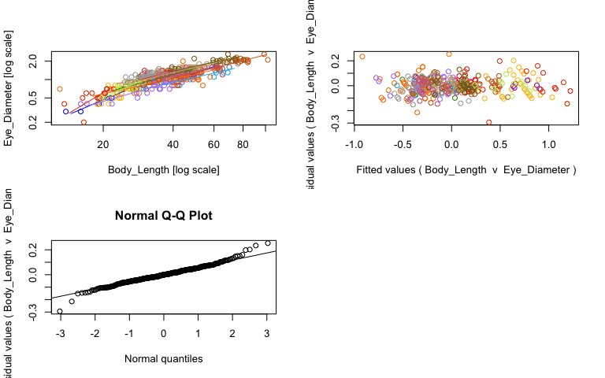

<style type="text/css">

body{ /* Normal  */
      font-size: 17px;
  }
  
</style>


Here, we examine the effect of dropping specimens preserved in paraformaldehyde from the analysis on the regressions for intraspecific eye-body allometry. 

# Import data

Here we import our specimen data (with outliers already removed), then remove all data where the preservation type was paraformaldehyde, as this had the largest effect in our LMM model. 


```r
#import specimen data
specimens <- data.frame(read.csv("../Data/cleaned data/specimen_data_tidy_no-outliers.csv", header=TRUE)) 
```

Before we remove any data, here are the sample sizes for each species. Only the species with PFA samples will be affected.


```r
specimens %>%
  group_by(genus_species) %>%
  count(Preservation)
```

```{style="max-height: 300px;"}
## # A tibble: 37 × 3
## # Groups:   genus_species [16]
##    genus_species                Preservation         n
##    <chr>                        <chr>            <int>
##  1 Allosergestes_pectinatus     ethanol              5
##  2 Allosergestes_pectinatus     fresh                3
##  3 Allosergestes_pectinatus     paraformaldehyde     6
##  4 Allosergestes_sargassi       ethanol              8
##  5 Allosergestes_sargassi       fresh               26
##  6 Allosergestes_sargassi       paraformaldehyde     3
##  7 Challengerosergia_hansjacobi ethanol             30
##  8 Challengerosergia_hansjacobi fresh                2
##  9 Challengerosergia_hansjacobi paraformaldehyde    11
## 10 Challengerosergia_talismani  ethanol             20
## # … with 27 more rows
```
Now we remove all the PFA samples. 


```r
#remove PFA samples
specimens2 <- specimens %>%
  filter(Preservation != "paraformaldehyde")
```

This removes 45 data points from our data set. 

Here are the new sample sizes:


```r
specimens2 %>%
  group_by(genus_species) %>%
  count(Preservation)
```

```{style="max-height: 300px;"}
## # A tibble: 28 × 3
## # Groups:   genus_species [16]
##    genus_species                Preservation     n
##    <chr>                        <chr>        <int>
##  1 Allosergestes_pectinatus     ethanol          5
##  2 Allosergestes_pectinatus     fresh            3
##  3 Allosergestes_sargassi       ethanol          8
##  4 Allosergestes_sargassi       fresh           26
##  5 Challengerosergia_hansjacobi ethanol         30
##  6 Challengerosergia_hansjacobi fresh            2
##  7 Challengerosergia_talismani  ethanol         20
##  8 Challengerosergia_talismani  fresh           11
##  9 Deosergestes_corniculum      ethanol         16
## 10 Deosergestes_corniculum      fresh            2
## # … with 18 more rows
```
Now we can rerun SMA regressions to see if we get similar results to the full dataset. 

# Test whether species differ in static allometry

## Linear mixed model to test whether slopes vary across species

We again remove N. edwardsii, since we didn't have enough samples to estimate static allometry. 


```r
#Remove species with insufficient sampling
specimens_test <- specimens2 %>%
  filter(genus_species != "Neosergestes_edwardsii") %>%
  mutate(species_text = as.factor(paste(Genus, Species, sep = " "))) # Add labels for species text
```

### Fixed slope (variable intercepts) model


```r
# variable intercepts model (species can have different intercepts but share mean slope) -------
lme_fixed <- lmer(log10(Eye_Diameter) ~ log10(Body_Length) + (1|genus_species), 
                  data = specimens_test)

# summary 
summary(lme_fixed)
```

```{style="max-height: 300px;"}
## Linear mixed model fit by REML ['lmerMod']
## Formula: log10(Eye_Diameter) ~ log10(Body_Length) + (1 | genus_species)
##    Data: specimens_test
## 
## REML criterion at convergence: -1025.6
## 
## Scaled residuals: 
##     Min      1Q  Median      3Q     Max 
## -5.9111 -0.5537  0.0564  0.5965  4.0074 
## 
## Random effects:
##  Groups        Name        Variance Std.Dev.
##  genus_species (Intercept) 0.005599 0.07483 
##  Residual                  0.004025 0.06345 
## Number of obs: 406, groups:  genus_species, 15
## 
## Fixed effects:
##                    Estimate Std. Error t value
## (Intercept)        -1.24144    0.05172   -24.0
## log10(Body_Length)  0.79745    0.03092    25.8
## 
## Correlation of Fixed Effects:
##             (Intr)
## lg10(Bdy_L) -0.925
```

```r
# intercepts (variable) and slope (constant)
coef(lme_fixed)
```

```{style="max-height: 300px;"}
## $genus_species
##                              (Intercept) log10(Body_Length)
## Allosergestes_pectinatus       -1.373793          0.7974541
## Allosergestes_sargassi         -1.291884          0.7974541
## Challengerosergia_hansjacobi   -1.149665          0.7974541
## Challengerosergia_talismani    -1.206124          0.7974541
## Deosergestes_corniculum        -1.315554          0.7974541
## Deosergestes_henseni           -1.264591          0.7974541
## Eusergestes_arcticus           -1.232631          0.7974541
## Gardinerosergia_splendens      -1.144121          0.7974541
## Parasergestes_armatus          -1.338059          0.7974541
## Parasergestes_vigilax          -1.294821          0.7974541
## Phorcosergia_grandis           -1.233938          0.7974541
## Robustosergia_regalis          -1.161180          0.7974541
## Robustosergia_robusta          -1.138552          0.7974541
## Sergestes_atlanticus           -1.253298          0.7974541
## Sergia_tenuiremis              -1.223359          0.7974541
## 
## attr(,"class")
## [1] "coef.mer"
```

```r
# AIC
AIC(lme_fixed)
```

```{style="max-height: 300px;"}
## [1] -1017.597
```

```r
#fixed effects
fixef(lme_fixed)
```

```{style="max-height: 300px;"}
##        (Intercept) log10(Body_Length) 
##         -1.2414381          0.7974541
```

```r
#confidence intervals
## if these overlap zero, we do not have good support for significant effects
## if .sig01, which is our estimate of the variability in the random effect is very large and very widely defined, t indicates we may have a lack of precision between our groups - either because the group effect is small between groups, we have too few groups to get a more precise estimate, we have too few units within each group, or a combination of all of the above.
confint(lme_fixed, level = 0.95)
```

```{style="max-height: 300px;"}
##                          2.5 %      97.5 %
## .sig01              0.05080306  0.10987340
## .sigma              0.05917499  0.06809151
## (Intercept)        -1.34446534 -1.13991215
## log10(Body_Length)  0.73695664  0.86004364
```


### Variable slopes model 


```r
# variable slopes model (species can have different slopes/interaction effect between body size and species on eye size) -------
lme_variable <- lmer(log10(Eye_Diameter) ~ log10(Body_Length) + (1 + log10(Body_Length) | genus_species), 
                     data = specimens_test)

# summary
summary(lme_variable)
```

```{style="max-height: 300px;"}
## Linear mixed model fit by REML ['lmerMod']
## Formula: log10(Eye_Diameter) ~ log10(Body_Length) + (1 + log10(Body_Length) |  
##     genus_species)
##    Data: specimens_test
## 
## REML criterion at convergence: -1053.8
## 
## Scaled residuals: 
##     Min      1Q  Median      3Q     Max 
## -5.9833 -0.5109  0.0424  0.5732  4.4573 
## 
## Random effects:
##  Groups        Name               Variance Std.Dev. Corr 
##  genus_species (Intercept)        0.14967  0.38687       
##                log10(Body_Length) 0.05465  0.23376  -0.99
##  Residual                         0.00361  0.06008       
## Number of obs: 406, groups:  genus_species, 15
## 
## Fixed effects:
##                    Estimate Std. Error t value
## (Intercept)        -1.30599    0.11550  -11.31
## log10(Body_Length)  0.85025    0.07109   11.96
## 
## Correlation of Fixed Effects:
##             (Intr)
## lg10(Bdy_L) -0.989
```

```r
# intercepts (variable) and slope (constant)
coef(lme_variable)
```

```{style="max-height: 300px;"}
## $genus_species
##                              (Intercept) log10(Body_Length)
## Allosergestes_pectinatus      -1.8880427          1.1913815
## Allosergestes_sargassi        -1.7421413          1.1225134
## Challengerosergia_hansjacobi  -1.0306929          0.7198252
## Challengerosergia_talismani   -1.3680391          0.9016424
## Deosergestes_corniculum       -1.3080040          0.7943639
## Deosergestes_henseni          -0.8109656          0.5133704
## Eusergestes_arcticus          -1.3627135          0.8752450
## Gardinerosergia_splendens     -0.8546921          0.6061745
## Parasergestes_armatus         -1.5686114          0.9533066
## Parasergestes_vigilax         -1.5866589          1.0243764
## Phorcosergia_grandis          -1.4203573          0.9047839
## Robustosergia_regalis         -1.2024682          0.8225619
## Robustosergia_robusta         -1.0832551          0.7655247
## Sergestes_atlanticus          -1.5496966          1.0093355
## Sergia_tenuiremis             -0.8135746          0.5492860
## 
## attr(,"class")
## [1] "coef.mer"
```

```r
# AIC
AIC(lme_variable)
```

```{style="max-height: 300px;"}
## [1] -1041.797
```

```r
#fixed effects
fixef(lme_variable)
```

```{style="max-height: 300px;"}
##        (Intercept) log10(Body_Length) 
##         -1.3059942          0.8502461
```

```r
#confidence intervals
## if these overlap zero, we do not have good support for significant effects
## if .sig01, which is our estimate of the variability in the random effect is very large and very widely defined, t indicates we may have a lack of precision between our groups - either because the group effect is small between groups, we have too few groups to get a more precise estimate, we have too few units within each group, or a combination of all of the above.
confint(lme_variable, level = 0.95)
```

```{style="max-height: 300px;"}
##                          2.5 %      97.5 %
## .sig01              0.22152172  0.60950629
## .sig02             -0.99732181 -0.95398429
## .sig03              0.12596948  0.37807455
## .sigma              0.05604629  0.06464515
## (Intercept)        -1.54562618 -1.07229159
## log10(Body_Length)  0.70802456  1.00275973
```

### Compare models


```r
#model AIC comparison
AIC(lme_fixed, lme_variable)
```

```{style="max-height: 300px;"}
##              df       AIC
## lme_fixed     4 -1017.597
## lme_variable  6 -1041.797
```

```r
#log likelihood comparison
anova(lme_fixed, lme_variable, refit=FALSE)
```

```{style="max-height: 300px;"}
## Data: specimens_test
## Models:
## lme_fixed: log10(Eye_Diameter) ~ log10(Body_Length) + (1 | genus_species)
## lme_variable: log10(Eye_Diameter) ~ log10(Body_Length) + (1 + log10(Body_Length) | genus_species)
##              npar     AIC     BIC logLik deviance  Chisq Df Pr(>Chisq)    
## lme_fixed       4 -1017.6 -1001.6  512.8  -1025.6                         
## lme_variable    6 -1041.8 -1017.8  526.9  -1053.8 28.201  2  7.522e-07 ***
## ---
## Signif. codes:  0 '***' 0.001 '**' 0.01 '*' 0.05 '.' 0.1 ' ' 1
```

Here we find by comparing AIC scores and log likelihoods that the model with variable slopes is better supported than the one with fixed slopes. We have evidence here that species differ significantly in the slopes of their static eye-body allometries rather than following a shared growth trajectory. This is consistent with our findings before removing PFA samples.

## Linear SMA regression for pairwise comparisons among species slopes


```r
# Model for static allometry across specimens with species and species*body size interaction as covariates
sma_species <- sma(formula = Eye_Diameter ~ Body_Length * genus_species, 
            data = specimens_test, 
            log = "xy", #sets both x and y variables as logged
            method="SMA", #defines SMA as model
            multcomp = TRUE, # adds pairwise comparisons between groups
            multcompmethod = "adjusted", # adjusts p-value for multiple comparisons
            alpha = 0.05) 

#plot fit, residuals, qq
par(mfrow = c(2,2)) #make plot window 2x2
plot(sma_species, which = "default",type = "o") 
plot(sma_species,which = "residual",type = "o")
plot(sma_species, which = "qq", type = "o")
par(mfrow = c(1,1)) 
```

<!-- -->

```r
#view fits
summary(sma_species)
```

```{style="max-height: 300px;"}
## Call: sma(formula = Eye_Diameter ~ Body_Length * genus_species, data = specimens_test, 
##     log = "xy", method = "SMA", alpha = 0.05, multcomp = TRUE, 
##     multcompmethod = "adjusted") 
## 
## Fit using Standardized Major Axis 
## 
## These variables were log-transformed before fitting: xy 
## 
## Confidence intervals (CI) are at 95%
## 
## ------------------------------------------------------------
## Results of comparing lines among groups.
## 
## H0 : slopes are equal.
## Likelihood ratio statistic : 55.87 with 14 degrees of freedom
## P-value : 6.1372e-07 
## ------------------------------------------------------------
## 
## Results of multiple comparisons among groups.
## 
## Test for pair-wise difference in slope :
##                  genus_species_1              genus_species_2       Pval
## 1       Allosergestes_pectinatus       Allosergestes_sargassi 1.00000000
## 2       Allosergestes_pectinatus Challengerosergia_hansjacobi 0.99998391
## 3       Allosergestes_pectinatus  Challengerosergia_talismani 0.78326153
## 4       Allosergestes_pectinatus      Deosergestes_corniculum 0.33362813
## 5       Allosergestes_pectinatus         Deosergestes_henseni 0.23066574
## 6       Allosergestes_pectinatus         Eusergestes_arcticus 1.00000000
## 7       Allosergestes_pectinatus    Gardinerosergia_splendens 0.32026524
## 8       Allosergestes_pectinatus        Parasergestes_armatus 0.98630035
## 9       Allosergestes_pectinatus        Parasergestes_vigilax 1.00000000
## 10      Allosergestes_pectinatus         Phorcosergia_grandis 0.57019386
## 11      Allosergestes_pectinatus        Robustosergia_regalis 0.37107106
## 12      Allosergestes_pectinatus        Robustosergia_robusta 0.29520565
## 13      Allosergestes_pectinatus         Sergestes_atlanticus 1.00000000
## 14      Allosergestes_pectinatus            Sergia_tenuiremis 0.30711560
## 15        Allosergestes_sargassi Challengerosergia_hansjacobi 0.83521848
## 16        Allosergestes_sargassi  Challengerosergia_talismani 0.01403022
## 17        Allosergestes_sargassi      Deosergestes_corniculum 0.00191144
## 18        Allosergestes_sargassi         Deosergestes_henseni 0.00050849
## 19        Allosergestes_sargassi         Eusergestes_arcticus 1.00000000
## 20        Allosergestes_sargassi    Gardinerosergia_splendens 0.00238595
## 21        Allosergestes_sargassi        Parasergestes_armatus 0.24746938
## 22        Allosergestes_sargassi        Parasergestes_vigilax 1.00000000
## 23        Allosergestes_sargassi         Phorcosergia_grandis 0.00130564
## 24        Allosergestes_sargassi        Robustosergia_regalis 0.00044066
## 25        Allosergestes_sargassi        Robustosergia_robusta 0.00303042
## 26        Allosergestes_sargassi         Sergestes_atlanticus 1.00000000
## 27        Allosergestes_sargassi            Sergia_tenuiremis 0.01593580
## 28  Challengerosergia_hansjacobi  Challengerosergia_talismani 1.00000000
## 29  Challengerosergia_hansjacobi      Deosergestes_corniculum 0.99999840
## 30  Challengerosergia_hansjacobi         Deosergestes_henseni 0.99970098
## 31  Challengerosergia_hansjacobi         Eusergestes_arcticus 1.00000000
## 32  Challengerosergia_hansjacobi    Gardinerosergia_splendens 0.99999854
## 33  Challengerosergia_hansjacobi        Parasergestes_armatus 1.00000000
## 34  Challengerosergia_hansjacobi        Parasergestes_vigilax 0.95932211
## 35  Challengerosergia_hansjacobi         Phorcosergia_grandis 1.00000000
## 36  Challengerosergia_hansjacobi        Robustosergia_regalis 0.99999983
## 37  Challengerosergia_hansjacobi        Robustosergia_robusta 0.99999134
## 38  Challengerosergia_hansjacobi         Sergestes_atlanticus 0.99977533
## 39  Challengerosergia_hansjacobi            Sergia_tenuiremis 0.99999644
## 40   Challengerosergia_talismani      Deosergestes_corniculum 1.00000000
## 41   Challengerosergia_talismani         Deosergestes_henseni 0.99999968
## 42   Challengerosergia_talismani         Eusergestes_arcticus 1.00000000
## 43   Challengerosergia_talismani    Gardinerosergia_splendens 1.00000000
## 44   Challengerosergia_talismani        Parasergestes_armatus 1.00000000
## 45   Challengerosergia_talismani        Parasergestes_vigilax 0.53415455
## 46   Challengerosergia_talismani         Phorcosergia_grandis 1.00000000
## 47   Challengerosergia_talismani        Robustosergia_regalis 1.00000000
## 48   Challengerosergia_talismani        Robustosergia_robusta 1.00000000
## 49   Challengerosergia_talismani         Sergestes_atlanticus 0.68809333
## 50   Challengerosergia_talismani            Sergia_tenuiremis 1.00000000
## 51       Deosergestes_corniculum         Deosergestes_henseni 1.00000000
## 52       Deosergestes_corniculum         Eusergestes_arcticus 0.99999999
## 53       Deosergestes_corniculum    Gardinerosergia_splendens 1.00000000
## 54       Deosergestes_corniculum        Parasergestes_armatus 0.99999994
## 55       Deosergestes_corniculum        Parasergestes_vigilax 0.20741123
## 56       Deosergestes_corniculum         Phorcosergia_grandis 1.00000000
## 57       Deosergestes_corniculum        Robustosergia_regalis 1.00000000
## 58       Deosergestes_corniculum        Robustosergia_robusta 1.00000000
## 59       Deosergestes_corniculum         Sergestes_atlanticus 0.23891315
## 60       Deosergestes_corniculum            Sergia_tenuiremis 1.00000000
## 61          Deosergestes_henseni         Eusergestes_arcticus 0.99999959
## 62          Deosergestes_henseni    Gardinerosergia_splendens 1.00000000
## 63          Deosergestes_henseni        Parasergestes_armatus 0.99992405
## 64          Deosergestes_henseni        Parasergestes_vigilax 0.14535552
## 65          Deosergestes_henseni         Phorcosergia_grandis 1.00000000
## 66          Deosergestes_henseni        Robustosergia_regalis 1.00000000
## 67          Deosergestes_henseni        Robustosergia_robusta 1.00000000
## 68          Deosergestes_henseni         Sergestes_atlanticus 0.15535806
## 69          Deosergestes_henseni            Sergia_tenuiremis 1.00000000
## 70          Eusergestes_arcticus    Gardinerosergia_splendens 0.99999997
## 71          Eusergestes_arcticus        Parasergestes_armatus 1.00000000
## 72          Eusergestes_arcticus        Parasergestes_vigilax 0.99999998
## 73          Eusergestes_arcticus         Phorcosergia_grandis 1.00000000
## 74          Eusergestes_arcticus        Robustosergia_regalis 1.00000000
## 75          Eusergestes_arcticus        Robustosergia_robusta 0.99999993
## 76          Eusergestes_arcticus         Sergestes_atlanticus 1.00000000
## 77          Eusergestes_arcticus            Sergia_tenuiremis 0.99999911
## 78     Gardinerosergia_splendens        Parasergestes_armatus 0.99999995
## 79     Gardinerosergia_splendens        Parasergestes_vigilax 0.20487334
## 80     Gardinerosergia_splendens         Phorcosergia_grandis 1.00000000
## 81     Gardinerosergia_splendens        Robustosergia_regalis 1.00000000
## 82     Gardinerosergia_splendens        Robustosergia_robusta 1.00000000
## 83     Gardinerosergia_splendens         Sergestes_atlanticus 0.24043912
## 84     Gardinerosergia_splendens            Sergia_tenuiremis 1.00000000
## 85         Parasergestes_armatus        Parasergestes_vigilax 0.81023470
## 86         Parasergestes_armatus         Phorcosergia_grandis 1.00000000
## 87         Parasergestes_armatus        Robustosergia_regalis 0.99999999
## 88         Parasergestes_armatus        Robustosergia_robusta 0.99999950
## 89         Parasergestes_armatus         Sergestes_atlanticus 0.96786531
## 90         Parasergestes_armatus            Sergia_tenuiremis 0.99999990
## 91         Parasergestes_vigilax         Phorcosergia_grandis 0.36740011
## 92         Parasergestes_vigilax        Robustosergia_regalis 0.23176769
## 93         Parasergestes_vigilax        Robustosergia_robusta 0.18643886
## 94         Parasergestes_vigilax         Sergestes_atlanticus 1.00000000
## 95         Parasergestes_vigilax            Sergia_tenuiremis 0.19844527
## 96          Phorcosergia_grandis        Robustosergia_regalis 1.00000000
## 97          Phorcosergia_grandis        Robustosergia_robusta 1.00000000
## 98          Phorcosergia_grandis         Sergestes_atlanticus 0.44199993
## 99          Phorcosergia_grandis            Sergia_tenuiremis 1.00000000
## 100        Robustosergia_regalis        Robustosergia_robusta 1.00000000
## 101        Robustosergia_regalis         Sergestes_atlanticus 0.25908585
## 102        Robustosergia_regalis            Sergia_tenuiremis 1.00000000
## 103        Robustosergia_robusta         Sergestes_atlanticus 0.21794507
## 104        Robustosergia_robusta            Sergia_tenuiremis 1.00000000
## 105         Sergestes_atlanticus            Sergia_tenuiremis 0.26436660
##         TestStat
## 1    0.486542226
## 2    2.709032845
## 3    5.981464552
## 4    8.349317510
## 5    9.144762533
## 6    0.408716086
## 7    8.440308011
## 8    4.216304962
## 9    1.310915694
## 10   7.031269807
## 11   8.108093816
## 12   8.619214402
## 13   0.094373518
## 14   8.532755132
## 15   5.693681257
## 16  14.576838366
## 17  18.366705005
## 18  20.898021209
## 19   1.167810351
## 20  17.943985019
## 21   8.997098503
## 22   0.544901905
## 23  19.094127740
## 24  21.172380346
## 25  17.488538481
## 26   0.089778522
## 27  14.335168264
## 28   0.567707272
## 29   2.425539500
## 30   3.183734956
## 31   0.276380299
## 32   2.415577002
## 33   0.092544652
## 34   4.707253482
## 35   1.204554267
## 36   2.202388129
## 37   2.626692093
## 38   3.129417027
## 39   2.517038345
## 40   1.425389785
## 41   2.260536099
## 42   0.958425974
## 43   1.405665251
## 44   0.251432302
## 45   7.210247360
## 46   0.236758640
## 47   1.236089320
## 48   1.619775935
## 49   6.459769491
## 50   1.526318331
## 51   0.109100647
## 52   1.922891520
## 53   0.009383239
## 54   2.112719363
## 55   9.365258491
## 56   0.909658118
## 57   0.090438867
## 58   0.039498787
## 59   9.071178255
## 60   0.148644951
## 61   2.285326157
## 62   0.044548556
## 63   2.940633748
## 64  10.085034485
## 65   1.703506539
## 66   0.439705663
## 67   0.011817800
## 68   9.952018385
## 69   0.017248876
## 70   2.036867176
## 71   0.544061005
## 72   2.025052560
## 73   1.255509805
## 74   1.716984219
## 75   2.123385004
## 76   0.683918248
## 77   2.362522827
## 78   2.086182170
## 79   9.390616681
## 80   0.915555688
## 81   0.142730951
## 82   0.009239058
## 83   9.057802602
## 84   0.086414700
## 85   5.835757058
## 86   0.844833122
## 87   1.922713698
## 88   2.303047091
## 89   4.587234480
## 90   2.156616150
## 91   8.130939238
## 92   9.134801259
## 93   9.583667960
## 94   0.783082275
## 95   9.456110514
## 96   0.690455626
## 97   1.116958956
## 98   7.693909639
## 99   1.098325684
## 100  0.237670937
## 101  8.899917461
## 102  0.382756484
## 103  9.262839066
## 104  0.045295804
## 105  8.856943075
## 
## ------------------------------------------------------------
## Coefficients by group in variable "genus_species"
## 
## Group: Allosergestes_pectinatus 
##             elevation    slope
## estimate    -2.422936 1.605829
## lower limit -3.090697 1.168224
## upper limit -1.755175 2.207356
## 
## H0 : variables uncorrelated.
## R-squared : 0.8950948 
## P-value : 0.00037594 
## 
## Group: Allosergestes_sargassi 
##             elevation    slope
## estimate    -2.715954 1.827853
## lower limit -3.356320 1.422425
## upper limit -2.075588 2.348839
## 
## H0 : variables uncorrelated.
## R-squared : 0.5047047 
## P-value : 2.5148e-06 
## 
## Group: Challengerosergia_hansjacobi 
##             elevation     slope
## estimate    -1.679879 1.1449598
## lower limit -2.202152 0.8538121
## upper limit -1.157606 1.5353882
## 
## H0 : variables uncorrelated.
## R-squared : 0.3627906 
## P-value : 0.00026474 
## 
## Group: Challengerosergia_talismani 
##             elevation     slope
## estimate    -1.535118 1.0095650
## lower limit -1.786219 0.8612512
## upper limit -1.284017 1.1834194
## 
## H0 : variables uncorrelated.
## R-squared : 0.8234976 
## P-value : 1.9235e-12 
## 
## Group: Deosergestes_corniculum 
##             elevation     slope
## estimate    -1.432046 0.8653057
## lower limit -1.737583 0.7020666
## upper limit -1.126509 1.0664999
## 
## H0 : variables uncorrelated.
## R-squared : 0.8421211 
## P-value : 8.1768e-08 
## 
## Group: Deosergestes_henseni 
##             elevation     slope
## estimate    -1.306994 0.8238705
## lower limit -1.593941 0.6637531
## upper limit -1.020047 1.0226131
## 
## H0 : variables uncorrelated.
## R-squared : 0.3380975 
## P-value : 1.6982e-06 
## 
## Group: Eusergestes_arcticus 
##              elevation     slope
## estimate    -2.1539322 1.3306114
## lower limit -3.8635100 0.6694485
## upper limit -0.4443543 2.6447543
## 
## H0 : variables uncorrelated.
## R-squared : 0.8368056 
## P-value : 0.029484 
## 
## Group: Gardinerosergia_splendens 
##              elevation     slope
## estimate    -1.2253950 0.8523703
## lower limit -1.5326713 0.6732695
## upper limit -0.9181186 1.0791149
## 
## H0 : variables uncorrelated.
## R-squared : 0.4597308 
## P-value : 1.1132e-06 
## 
## Group: Parasergestes_armatus 
##             elevation     slope
## estimate    -1.764267 1.0820598
## lower limit -2.140730 0.8587238
## upper limit -1.387803 1.3634809
## 
## H0 : variables uncorrelated.
## R-squared : 0.7358466 
## P-value : 1.6796e-07 
## 
## Group: Parasergestes_vigilax 
##             elevation    slope
## estimate    -3.171038 2.271787
## lower limit -4.837160 1.312680
## upper limit -1.504915 3.931666
## 
## H0 : variables uncorrelated.
## R-squared : 0.3307528 
## P-value : 0.050429 
## 
## Group: Phorcosergia_grandis 
##             elevation     slope
## estimate    -1.525170 0.9645622
## lower limit -1.696905 0.8713960
## upper limit -1.353435 1.0676895
## 
## H0 : variables uncorrelated.
## R-squared : 0.8932266 
## P-value : < 2.22e-16 
## 
## Group: Robustosergia_regalis 
##             elevation     slope
## estimate    -1.324440 0.8978007
## lower limit -1.531510 0.7807317
## upper limit -1.117369 1.0324239
## 
## H0 : variables uncorrelated.
## R-squared : 0.8280327 
## P-value : 2.4971e-15 
## 
## Group: Robustosergia_robusta 
##              elevation     slope
## estimate    -1.2073093 0.8386026
## lower limit -1.5732188 0.6553974
## upper limit -0.8413998 1.0730198
## 
## H0 : variables uncorrelated.
## R-squared : 0.6989428 
## P-value : 6.7833e-07 
## 
## Group: Sergestes_atlanticus 
##             elevation    slope
## estimate    -2.530119 1.716828
## lower limit -3.411686 1.195711
## upper limit -1.648552 2.465059
## 
## H0 : variables uncorrelated.
## R-squared : 0.7596496 
## P-value : 0.00047255 
## 
## Group: Sergia_tenuiremis 
##              elevation     slope
## estimate    -1.2313110 0.8025570
## lower limit -1.6822103 0.5747311
## upper limit -0.7804117 1.1206941
## 
## H0 : variables uncorrelated.
## R-squared : 0.2880646 
## P-value : 0.0032339
```

```r
#save coefficients of fits as object
cc_species <- data.frame(coef(sma_species))
```
Here we also still find that slopes across species are not equal (as we did when PFA specimens were included). If you scroll through the output, you can also see the estimate for intercept ("elevation") and slope with 95% confidence intervals (upper and lower limits) for each species, along with the R2 and p-value for that species. This should allow for any comparisons to the fill dataset. Note however that only a handful of species actually had PFA samples in the first place, so some should be unchanged.
