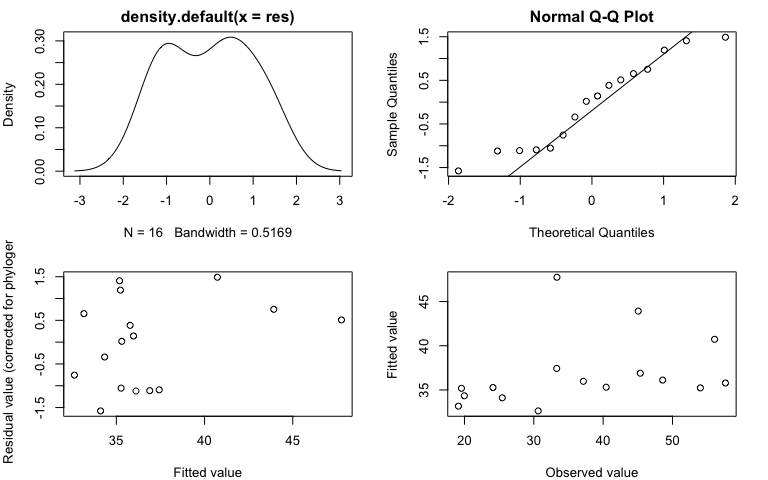
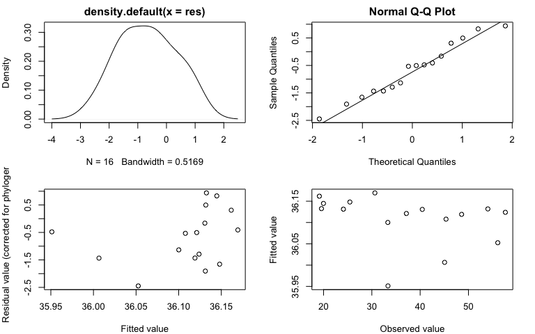

# Import data


```r
#import specimen data with outliers removed
specimens_ed <- data.frame(read.csv("../Data/cleaned data/specimen_data_tidy_no-outliers.csv", header=TRUE))

#import species trait data
traits <- data.frame(read.csv("../Data/cleaned data/trait_data_tidy.csv", header=TRUE))

#import phylogeny
tree <- read.nexus("../Data/cleaned data/sergestid_tree_pruned")
```

# Prep for model


```r
# Prep data ------

#Calculate species means (3 outliers removed)
sp_means <- specimens_ed %>% 
  mutate_if(is.character, as.factor) %>% 
  group_by(genus_species) %>%
  summarise(eye_av = mean(Eye_Diameter), 
            length_av = mean(Body_Length), 
            n = n()) %>%
  ungroup()

#Merge with species trait data stored in dataframe 'species'
species <- traits %>%
  left_join(sp_means, by = "genus_species") %>%
  mutate(Organ = factor(Organ, levels = c("pesta","lensed", "unlensed", "none"))) %>%
  mutate(species_text = as.factor(str_replace(genus_species, "_", " "))) # Add labels for species text 

#check that names match in dataframe and tree
name.check(phy = tree, data = species, data.names = species$genus_species)
  
#use caper function to combine phylogeny and data into one object (this function also matches species names in tree and dataset)
species.comp <- comparative.data(data = species, phy = tree, names.col = "genus_species", vcv = TRUE, na.omit = FALSE, warn.dropped = TRUE)

#check for dropped tips or dropped species
species.comp$dropped$tips #phylogeny
species.comp$dropped$unmatched.rows #dataset
```


# Body length vs. vertical migration distance

Here, we fit PGLS models of body length ~ migration distance, with separate models for lambda = 0 and lambda = 1. 

## model with lambda = 0


```r
#fit model for eye diameter ~ body length (lambda = 0)
pgls_bodyrange0 <- pgls(length_av ~ Range,
               data = species.comp, 
               lambda = 0.00001, #set lambda to 0
               bounds=list(lambda=c(0.00001,0.00001)),
               param.CI = 0.95)

#check model assumptions
par(mar = c(4,4,2,2))
par(mfrow = c(2, 2))
plot(pgls_bodyrange0)
```

<!-- -->

```r
par(mfrow = c(1, 1))

#main effects
anova(pgls_bodyrange0)
```

```{style="max-height: 300px;"}
## Analysis of Variance Table
## Sequential SS for pgls: lambda = 0.00, delta = 1.00, kappa = 1.00
## 
## Response: length_av
##           Df  Sum Sq Mean Sq F value Pr(>F)
## Range      1  242.39  242.39  1.4156 0.2539
## Residuals 14 2397.17  171.23
```

```r
#parameter estimates
summary(pgls_bodyrange0)
```

```{style="max-height: 300px;"}
## 
## Call:
## pgls(formula = length_av ~ Range, data = species.comp, lambda = 1e-05, 
##     param.CI = 0.95, bounds = list(lambda = c(1e-05, 1e-05)))
## 
## Residuals:
##     Min      1Q  Median      3Q     Max 
## -19.925 -13.451   1.005   8.575  18.806 
## 
## Branch length transformations:
## 
## kappa  [Fix]  : 1.000
## lambda [Fix]  : 0.000
## delta  [Fix]  : 1.000
## 
## Coefficients:
##              Estimate Std. Error t value  Pr(>|t|)    
## (Intercept) 30.503636   6.267670  4.8668 0.0002493 ***
## Range        0.012781   0.010742  1.1898 0.2539106    
## ---
## Signif. codes:  0 '***' 0.001 '**' 0.01 '*' 0.05 '.' 0.1 ' ' 1
## 
## Residual standard error: 13.09 on 14 degrees of freedom
## Multiple R-squared: 0.09183,	Adjusted R-squared: 0.02696 
## F-statistic: 1.416 on 1 and 14 DF,  p-value: 0.2539
```

When lambda = 0, body size is not correlated with the distance of vertical migration.

## model with lambda = 1


```r
#fit model for eye diameter ~ body length (lambda = 1)
pgls_bodyrange1 <- pgls(length_av ~ Range,
               data = species.comp, 
               lambda = 1, #set lambda to 1
               bounds=list(lambda=c(1,1)),
               param.CI = 0.95)

#check model assumptions
par(mar = c(4,4,2,2))
par(mfrow = c(2, 2))
plot(pgls_bodyrange1)
```

<!-- -->

```r
par(mfrow = c(1, 1))

#main effects
anova(pgls_bodyrange1)
```

```{style="max-height: 300px;"}
## Analysis of Variance Table
## Sequential SS for pgls: lambda = 1.00, delta = 1.00, kappa = 1.00
## 
## Response: length_av
##           Df  Sum Sq Mean Sq F value Pr(>F)
## Range      1    0.08   0.078   4e-04 0.9835
## Residuals 14 2485.19 177.514
```

```r
#parameter estimates
summary(pgls_bodyrange1)
```

```{style="max-height: 300px;"}
## 
## Call:
## pgls(formula = length_av ~ Range, data = species.comp, lambda = 1, 
##     param.CI = 0.95, bounds = list(lambda = c(1, 1)))
## 
## Residuals:
##      Min       1Q   Median       3Q      Max 
## -25.8326 -15.1206  -5.4750  -0.4621   9.9129 
## 
## Branch length transformations:
## 
## kappa  [Fix]  : 1.000
## lambda [Fix]  : 1.000
## delta  [Fix]  : 1.000
## 
## Coefficients:
##                Estimate  Std. Error t value  Pr(>|t|)    
## (Intercept) 36.20003037  6.40648190  5.6505 5.986e-05 ***
## Range       -0.00018434  0.00876772 -0.0210    0.9835    
## ---
## Signif. codes:  0 '***' 0.001 '**' 0.01 '*' 0.05 '.' 0.1 ' ' 1
## 
## Residual standard error: 13.32 on 14 degrees of freedom
## Multiple R-squared: 3.157e-05,	Adjusted R-squared: -0.07139 
## F-statistic: 0.000442 on 1 and 14 DF,  p-value: 0.9835
```

When lambda = 1, body size is not correlated with the distance traversed in vertical migration. 

Both models agree that body size and vertical migraiton distance are not significantly correlated in this sample of sergestid shrimps.

# Visualize data

Here, we plot body size vs. vertical migration distance.


```r
#Give species unique color/shape combinations, with color groups coordinated to phylogenetic subgroups

#reorder factor levels for figure legend (phylo order)
species$species_text <- factor(species$species_text, 
                                      levels = c("Deosergestes corniculum",
                                                 "Deosergestes henseni",
                                                 "Allosergestes pectinatus",
                                                 "Allosergestes sargassi",
                                                 "Sergestes atlanticus",
                                                 "Neosergestes edwardsii",
                                                 "Parasergestes vigilax",
                                                 "Parasergestes armatus",
                                                 "Eusergestes arcticus",
                                                 "Gardinerosergia splendens",
                                                 "Robustosergia regalis",
                                                 "Robustosergia robusta",
                                                 "Phorcosergia grandis",
                                                 "Sergia tenuiremis",
                                                 "Challengerosergia talismani",
                                                 "Challengerosergia hansjacobi"))

#make shape pallette
shapes.sp <- c("Deosergestes corniculum" = 21,
              "Deosergestes henseni" = 22, 
              "Allosergestes pectinatus" = 23, 
              "Allosergestes sargassi" = 24,
              "Sergestes atlanticus" = 25, 
              "Neosergestes edwardsii"= 23,
              "Parasergestes vigilax" = 21, 
              "Parasergestes armatus" = 22,
              "Eusergestes arcticus" = 23, 
              "Gardinerosergia splendens" = 24, 
              "Robustosergia regalis" = 25, 
              "Robustosergia robusta" = 21, 
              "Phorcosergia grandis" = 22,
              "Sergia tenuiremis" = 23,
              "Challengerosergia talismani" = 24,
               "Challengerosergia hansjacobi" = 25)
 
#sergia/sergestes green purple pallette
cols.sp <- c(#Sergestes group
              "Deosergestes corniculum" = "#512E5F",
              "Deosergestes henseni" = "#633974",
              "Allosergestes pectinatus" = "#76448A",
              "Allosergestes sargassi" = "#884EA0",
              "Sergestes atlanticus" = "#9B59B6",
              "Neosergestes edwardsii" = "#AF7AC5",
              "Parasergestes vigilax" = "#C39BD3",
              "Parasergestes armatus" = "#D7BDE2",
              "Eusergestes arcticus" = "#EBDEF0",
             #Sergia group
              "Gardinerosergia splendens" = "#ABEBC6",
              "Robustosergia regalis" = "#A9DFBF",
              "Robustosergia robusta" = "#52BE80",
              "Phorcosergia grandis" = "#27AE60",
              "Sergia tenuiremis" = "#1E8449",
              "Challengerosergia talismani" = "#196F3D",
              "Challengerosergia hansjacobi" = "#145A32")

# Make plot 
plot_bodyDVM <- ggplot(species, aes(x = Range, y = Body_length, color =  species_text, shape = species_text, fill = species_text)) + 
  geom_point(size = 2, alpha = 1) + 
  scale_shape_manual(values = shapes.sp, name = "Species") + 
  scale_color_manual(values = cols.sp, name = "Species") +
  scale_fill_manual(values = cols.sp, name = "Species") +
  ylab("Body length (mm)") +
  xlab("Distance of DVM (m)") +
  theme_bw() +
theme(panel.grid.major = element_blank(), panel.grid.minor = element_blank(), legend.text = element_text(face = "italic")) 

ggplotly(plot_bodyDVM)
```

```{=html}
<div id="htmlwidget-85877a0a42cc526f44bf" style="width:768px;height:480px;" class="plotly html-widget"></div>
<script type="application/json" data-for="htmlwidget-85877a0a42cc526f44bf">{"x":{"data":[{"x":[439],"y":[48.59166667],"text":"Range:  439<br />Body_length: 48.59167<br />species_text: Deosergestes corniculum<br />species_text: Deosergestes corniculum<br />species_text: Deosergestes corniculum","type":"scatter","mode":"markers","marker":{"autocolorscale":false,"color":"rgba(81,46,95,1)","opacity":1,"size":7.55905511811024,"symbol":"circle","line":{"width":1.88976377952756,"color":"rgba(81,46,95,1)"}},"hoveron":"points","name":"Deosergestes corniculum","legendgroup":"Deosergestes corniculum","showlegend":true,"xaxis":"x","yaxis":"y","hoverinfo":"text","frame":null},{"x":[376],"y":[40.4337931],"text":"Range:  376<br />Body_length: 40.43379<br />species_text: Deosergestes henseni<br />species_text: Deosergestes henseni<br />species_text: Deosergestes henseni","type":"scatter","mode":"markers","marker":{"autocolorscale":false,"color":"rgba(99,57,116,1)","opacity":1,"size":7.55905511811024,"symbol":"square","line":{"width":1.88976377952756,"color":"rgba(99,57,116,1)"}},"hoveron":"points","name":"Deosergestes henseni","legendgroup":"Deosergestes henseni","showlegend":true,"xaxis":"x","yaxis":"y","hoverinfo":"text","frame":null},{"x":[300],"y":[19.98],"text":"Range:  300<br />Body_length: 19.98000<br />species_text: Allosergestes pectinatus<br />species_text: Allosergestes pectinatus<br />species_text: Allosergestes pectinatus","type":"scatter","mode":"markers","marker":{"autocolorscale":false,"color":"rgba(118,68,138,1)","opacity":1,"size":7.55905511811024,"symbol":"diamond","line":{"width":1.88976377952756,"color":"rgba(118,68,138,1)"}},"hoveron":"points","name":"Allosergestes pectinatus","legendgroup":"Allosergestes pectinatus","showlegend":true,"xaxis":"x","yaxis":"y","hoverinfo":"text","frame":null},{"x":[373],"y":[23.82078947],"text":"Range:  373<br />Body_length: 23.82079<br />species_text: Allosergestes sargassi<br />species_text: Allosergestes sargassi<br />species_text: Allosergestes sargassi","type":"scatter","mode":"markers","marker":{"autocolorscale":false,"color":"rgba(136,78,160,1)","opacity":1,"size":7.55905511811024,"symbol":"triangle-up","line":{"width":1.88976377952756,"color":"rgba(136,78,160,1)"}},"hoveron":"points","name":"Allosergestes sargassi","legendgroup":"Allosergestes sargassi","showlegend":true,"xaxis":"x","yaxis":"y","hoverinfo":"text","frame":null},{"x":[282],"y":[25.43933333],"text":"Range:  282<br />Body_length: 25.43933<br />species_text: Sergestes atlanticus<br />species_text: Sergestes atlanticus<br />species_text: Sergestes atlanticus","type":"scatter","mode":"markers","marker":{"autocolorscale":false,"color":"rgba(155,89,182,1)","opacity":1,"size":7.55905511811024,"symbol":"triangle-down","line":{"width":1.88976377952756,"color":"rgba(155,89,182,1)"}},"hoveron":"points","name":"Sergestes atlanticus","legendgroup":"Sergestes atlanticus","showlegend":true,"xaxis":"x","yaxis":"y","hoverinfo":"text","frame":null},{"x":[366],"y":[16.89],"text":"Range:  366<br />Body_length: 16.89000<br />species_text: Neosergestes edwardsii<br />species_text: Neosergestes edwardsii<br />species_text: Neosergestes edwardsii","type":"scatter","mode":"markers","marker":{"autocolorscale":false,"color":"rgba(175,122,197,1)","opacity":1,"size":7.55905511811024,"symbol":"diamond","line":{"width":1.88976377952756,"color":"rgba(175,122,197,1)"}},"hoveron":"points","name":"Neosergestes edwardsii","legendgroup":"Neosergestes edwardsii","showlegend":true,"xaxis":"x","yaxis":"y","hoverinfo":"text","frame":null},{"x":[208],"y":[19.12],"text":"Range:  208<br />Body_length: 19.12000<br />species_text: Parasergestes vigilax<br />species_text: Parasergestes vigilax<br />species_text: Parasergestes vigilax","type":"scatter","mode":"markers","marker":{"autocolorscale":false,"color":"rgba(195,155,211,1)","opacity":1,"size":7.55905511811024,"symbol":"circle","line":{"width":1.88976377952756,"color":"rgba(195,155,211,1)"}},"hoveron":"points","name":"Parasergestes vigilax","legendgroup":"Parasergestes vigilax","showlegend":true,"xaxis":"x","yaxis":"y","hoverinfo":"text","frame":null},{"x":[166],"y":[30.636],"text":"Range:  166<br />Body_length: 30.63600<br />species_text: Parasergestes armatus<br />species_text: Parasergestes armatus<br />species_text: Parasergestes armatus","type":"scatter","mode":"markers","marker":{"autocolorscale":false,"color":"rgba(215,189,226,1)","opacity":1,"size":7.55905511811024,"symbol":"square","line":{"width":1.88976377952756,"color":"rgba(215,189,226,1)"}},"hoveron":"points","name":"Parasergestes armatus","legendgroup":"Parasergestes armatus","showlegend":true,"xaxis":"x","yaxis":"y","hoverinfo":"text","frame":null},{"x":[370],"y":[54],"text":"Range:  370<br />Body_length: 54.00000<br />species_text: Eusergestes arcticus<br />species_text: Eusergestes arcticus<br />species_text: Eusergestes arcticus","type":"scatter","mode":"markers","marker":{"autocolorscale":false,"color":"rgba(235,222,240,1)","opacity":1,"size":7.55905511811024,"symbol":"diamond","line":{"width":1.88976377952756,"color":"rgba(235,222,240,1)"}},"hoveron":"points","name":"Eusergestes arcticus","legendgroup":"Eusergestes arcticus","showlegend":true,"xaxis":"x","yaxis":"y","hoverinfo":"text","frame":null},{"x":[542],"y":[33.03714286],"text":"Range:  542<br />Body_length: 33.03714<br />species_text: Gardinerosergia splendens<br />species_text: Gardinerosergia splendens<br />species_text: Gardinerosergia splendens","type":"scatter","mode":"markers","marker":{"autocolorscale":false,"color":"rgba(171,235,198,1)","opacity":1,"size":7.55905511811024,"symbol":"triangle-up","line":{"width":1.88976377952756,"color":"rgba(171,235,198,1)"}},"hoveron":"points","name":"Gardinerosergia splendens","legendgroup":"Gardinerosergia splendens","showlegend":true,"xaxis":"x","yaxis":"y","hoverinfo":"text","frame":null},{"x":[1050],"y":[45.05657895],"text":"Range: 1050<br />Body_length: 45.05658<br />species_text: Robustosergia regalis<br />species_text: Robustosergia regalis<br />species_text: Robustosergia regalis","type":"scatter","mode":"markers","marker":{"autocolorscale":false,"color":"rgba(169,223,191,1)","opacity":1,"size":7.55905511811024,"symbol":"triangle-down","line":{"width":1.88976377952756,"color":"rgba(169,223,191,1)"}},"hoveron":"points","name":"Robustosergia regalis","legendgroup":"Robustosergia regalis","showlegend":true,"xaxis":"x","yaxis":"y","hoverinfo":"text","frame":null},{"x":[413],"y":[57.63304348],"text":"Range:  413<br />Body_length: 57.63304<br />species_text: Robustosergia robusta<br />species_text: Robustosergia robusta<br />species_text: Robustosergia robusta","type":"scatter","mode":"markers","marker":{"autocolorscale":false,"color":"rgba(82,190,128,1)","opacity":1,"size":7.55905511811024,"symbol":"circle","line":{"width":1.88976377952756,"color":"rgba(82,190,128,1)"}},"hoveron":"points","name":"Robustosergia robusta","legendgroup":"Robustosergia robusta","showlegend":true,"xaxis":"x","yaxis":"y","hoverinfo":"text","frame":null},{"x":[800],"y":[56.06803922],"text":"Range:  800<br />Body_length: 56.06804<br />species_text: Phorcosergia grandis<br />species_text: Phorcosergia grandis<br />species_text: Phorcosergia grandis","type":"scatter","mode":"markers","marker":{"autocolorscale":false,"color":"rgba(39,174,96,1)","opacity":1,"size":7.55905511811024,"symbol":"square","line":{"width":1.88976377952756,"color":"rgba(39,174,96,1)"}},"hoveron":"points","name":"Phorcosergia grandis","legendgroup":"Phorcosergia grandis","showlegend":true,"xaxis":"x","yaxis":"y","hoverinfo":"text","frame":null},{"x":[500],"y":[45.35821429],"text":"Range:  500<br />Body_length: 45.35821<br />species_text: Sergia tenuiremis<br />species_text: Sergia tenuiremis<br />species_text: Sergia tenuiremis","type":"scatter","mode":"markers","marker":{"autocolorscale":false,"color":"rgba(30,132,73,1)","opacity":1,"size":7.55905511811024,"symbol":"diamond","line":{"width":1.88976377952756,"color":"rgba(30,132,73,1)"}},"hoveron":"points","name":"Sergia tenuiremis","legendgroup":"Sergia tenuiremis","showlegend":true,"xaxis":"x","yaxis":"y","hoverinfo":"text","frame":null},{"x":[428],"y":[37.1440625],"text":"Range:  428<br />Body_length: 37.14406<br />species_text: Challengerosergia talismani<br />species_text: Challengerosergia talismani<br />species_text: Challengerosergia talismani","type":"scatter","mode":"markers","marker":{"autocolorscale":false,"color":"rgba(25,111,61,1)","opacity":1,"size":7.55905511811024,"symbol":"triangle-up","line":{"width":1.88976377952756,"color":"rgba(25,111,61,1)"}},"hoveron":"points","name":"Challengerosergia talismani","legendgroup":"Challengerosergia talismani","showlegend":true,"xaxis":"x","yaxis":"y","hoverinfo":"text","frame":null},{"x":[1350],"y":[33.33511628],"text":"Range: 1350<br />Body_length: 33.33512<br />species_text: Challengerosergia hansjacobi<br />species_text: Challengerosergia hansjacobi<br />species_text: Challengerosergia hansjacobi","type":"scatter","mode":"markers","marker":{"autocolorscale":false,"color":"rgba(20,90,50,1)","opacity":1,"size":7.55905511811024,"symbol":"triangle-down","line":{"width":1.88976377952756,"color":"rgba(20,90,50,1)"}},"hoveron":"points","name":"Challengerosergia hansjacobi","legendgroup":"Challengerosergia hansjacobi","showlegend":true,"xaxis":"x","yaxis":"y","hoverinfo":"text","frame":null}],"layout":{"margin":{"t":27.689497716895,"r":7.30593607305936,"b":41.6438356164384,"l":37.2602739726027},"plot_bgcolor":"rgba(255,255,255,1)","paper_bgcolor":"rgba(255,255,255,1)","font":{"color":"rgba(0,0,0,1)","family":"","size":14.6118721461187},"xaxis":{"domain":[0,1],"automargin":true,"type":"linear","autorange":false,"range":[106.8,1409.2],"tickmode":"array","ticktext":["500","1000"],"tickvals":[500,1000],"categoryorder":"array","categoryarray":["500","1000"],"nticks":null,"ticks":"outside","tickcolor":"rgba(51,51,51,1)","ticklen":3.65296803652968,"tickwidth":0.66417600664176,"showticklabels":true,"tickfont":{"color":"rgba(77,77,77,1)","family":"","size":11.689497716895},"tickangle":-0,"showline":false,"linecolor":null,"linewidth":0,"showgrid":false,"gridcolor":null,"gridwidth":0,"zeroline":false,"anchor":"y","title":{"text":"Distance of DVM (m)","font":{"color":"rgba(0,0,0,1)","family":"","size":14.6118721461187}},"hoverformat":".2f"},"yaxis":{"domain":[0,1],"automargin":true,"type":"linear","autorange":false,"range":[14.852847826,59.670195654],"tickmode":"array","ticktext":["20","30","40","50"],"tickvals":[20,30,40,50],"categoryorder":"array","categoryarray":["20","30","40","50"],"nticks":null,"ticks":"outside","tickcolor":"rgba(51,51,51,1)","ticklen":3.65296803652968,"tickwidth":0.66417600664176,"showticklabels":true,"tickfont":{"color":"rgba(77,77,77,1)","family":"","size":11.689497716895},"tickangle":-0,"showline":false,"linecolor":null,"linewidth":0,"showgrid":false,"gridcolor":null,"gridwidth":0,"zeroline":false,"anchor":"x","title":{"text":"Body length (mm)","font":{"color":"rgba(0,0,0,1)","family":"","size":14.6118721461187}},"hoverformat":".2f"},"shapes":[{"type":"rect","fillcolor":"transparent","line":{"color":"rgba(51,51,51,1)","width":0.66417600664176,"linetype":"solid"},"yref":"paper","xref":"paper","x0":0,"x1":1,"y0":0,"y1":1}],"showlegend":true,"legend":{"bgcolor":"rgba(255,255,255,1)","bordercolor":"transparent","borderwidth":1.88976377952756,"font":{"color":"rgba(0,0,0,1)","family":"","size":11.689497716895},"title":{"text":"Species","font":{"color":"rgba(0,0,0,1)","family":"","size":14.6118721461187}}},"hovermode":"closest","barmode":"relative"},"config":{"doubleClick":"reset","modeBarButtonsToAdd":["hoverclosest","hovercompare"],"showSendToCloud":false},"source":"A","attrs":{"4e83291bd52b":{"x":{},"y":{},"colour":{},"shape":{},"fill":{},"type":"scatter"}},"cur_data":"4e83291bd52b","visdat":{"4e83291bd52b":["function (y) ","x"]},"highlight":{"on":"plotly_click","persistent":false,"dynamic":false,"selectize":false,"opacityDim":0.2,"selected":{"opacity":1},"debounce":0},"shinyEvents":["plotly_hover","plotly_click","plotly_selected","plotly_relayout","plotly_brushed","plotly_brushing","plotly_clickannotation","plotly_doubleclick","plotly_deselect","plotly_afterplot","plotly_sunburstclick"],"base_url":"https://plot.ly"},"evals":[],"jsHooks":[]}</script>
```

